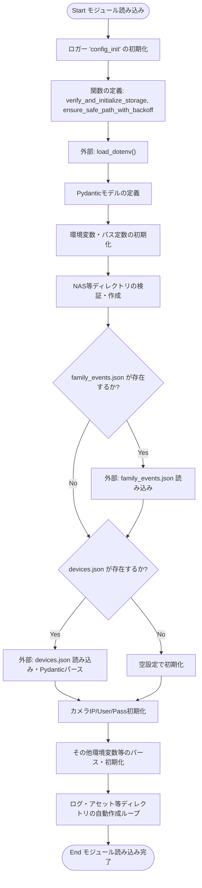
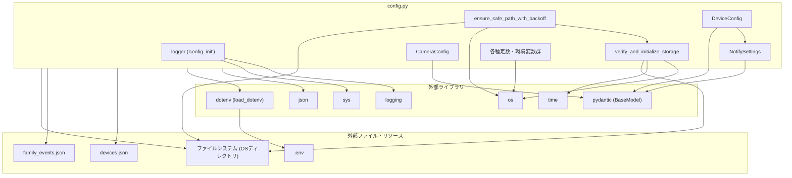

## 1. 解析メタ情報

| 項目 | 内容 |
| --- | --- |
| 対象ファイル | `config.py` |
| 言語 | Python |
| 解析対象 | 提供されたコードのみ |
| 推測・補完 | 一切なし |

## 2. ファイルの概要

* システム全体の環境変数、定数、ディレクトリパスの定義と初期化を行う。
* 根拠: [環境変数読み込み処理] (行番号取得不可 / 抜粋: `ENV: str = os.getenv("ENV"`)

* ロガーの初期化設定を行う。
* 根拠: [ロガー設定処理] (行番号取得不可 / 抜粋: `logger = logging.getLogger`)

* NASなどの外部ストレージのマウント遅延を考慮したディレクトリの検証、作成、書き込みテストを行う関数を提供する。
* 根拠: [ストレージ検証関数] (行番号取得不可 / 抜粋: `def verify_and_initialize_stora`)

* `Pydantic`を用いてデバイスやカメラの設定スキーマを定義する。
* 根拠: [Pydanticモデル定義] (行番号取得不可 / 抜粋: `class CameraConfig(BaseModel):`)

* 外部設定ファイル（`devices.json`, `family_events.json`）を読み込み、グローバル変数にパース結果を格納する。
* 根拠: [JSON読み込み処理] (行番号取得不可 / 抜粋: `with open(DEVICES_JSON_PATH, `)

* ログ用、アセット用などの必須ディレクトリが存在しない場合、自動的に作成する。
* 根拠: [ディレクトリ自動作成ループ] (行番号取得不可 / 抜粋: `os.makedirs(d, exist_ok=True)`)

## 3. 外部依存関係

### インポート一覧

| 名称 | 種類 | 用途 | 根拠 |
| --- | --- | --- | --- |
| `os` | 標準ライブラリ | 環境変数取得、パス結合、ディレクトリ作成等のOS操作 | 根拠: `import os` (行番号取得不可 / 抜粋: `import os`) |
| `sys` | 標準ライブラリ | ロガーの標準出力ハンドラの設定 | 根拠: `import sys` (行番号取得不可 / 抜粋: `import sys`) |
| `json` | 標準ライブラリ | 外部JSONファイルの読み込み・パース | 根拠: `import json` (行番号取得不可 / 抜粋: `import json`) |
| `time` | 標準ライブラリ | リトライ時の待機（Exponential Backoff） | 根拠: `import time` (行番号取得不可 / 抜粋: `import time`) |
| `logging` | 標準ライブラリ | ロガーの取得・設定およびログ出力 | 根拠: `import logging` (行番号取得不可 / 抜粋: `import logging`) |
| `Optional`, `List`, `Dict`, `Any` | 標準ライブラリ(`typing`) | 型ヒントの定義 | 根拠: `from typing import Optional, L` (行番号取得不可 / 抜粋: `from typing import Optional, L`) |
| `load_dotenv` | 外部ライブラリ(`dotenv`) | `.env`ファイルからの環境変数読み込み処理 | 根拠: `from dotenv import load_dotenv` (行番号取得不可 / 抜粋: `from dotenv import load_dotenv`) |
| `BaseModel`, `Field`, `ValidationError` | 外部ライブラリ(`pydantic`) | データバリデーション付きのモデルクラス定義とエラー捕捉 | 根拠: `from pydantic import BaseModel` (行番号取得不可 / 抜粋: `from pydantic import BaseModel`) |

### ブラックボックスとなる外部要素

| 名称 | 理由 | 根拠 |
| --- | --- | --- |
| `.env`ファイル | 外部ファイルであり、実行時の環境変数の実際の内容がコードから読み取れないため。 | 根拠: `load_dotenv()` (行番号取得不可 / 抜粋: `load_dotenv()`) |
| `devices.json` | システムに接続されるカメラやモニター等のデバイス設定情報を持つ外部ファイルであり、具体的な内容が不明なため。 | 根拠: `with open(DEVICES_JSON_PATH, ` (行番号取得不可 / 抜粋: `with open(DEVICES_JSON_PATH, `) |
| `family_events.json` | 家族の記念日・イベント設定情報を持つ外部ファイルであり、具体的な内容が不明なため。 | 根拠: `with open(_events_path, "r", ` (行番号取得不可 / 抜粋: `with open(_events_path, "r", `) |
| `Pydantic`の内部実装 | 外部ライブラリであり、バリデーションの厳密な挙動（例：エイリアスやデフォルトファクトリの処理詳細）は提供コードから読み取れないため。 | 根拠: `class CameraConfig(BaseModel):` (行番号取得不可 / 抜粋: `class CameraConfig(BaseModel):`) |

## 4. 主要要素の定義（関数 / エンドポイント / コンポーネント）

### `verify_and_initialize_storage`

* **役割**: 指定されたパスのディレクトリ作成と書き込みテストを、指定回数リトライ（Exponential Backoff）しながら実行する。
* 根拠: [関数定義] (行番号取得不可 / 抜粋: `def verify_and_initialize_stora`)

* **引数/リクエスト**: `base_path` (str: 確認対象ディレクトリ), `max_retries` (int: 最大リトライ回数。デフォルトは5)
* 根拠: [引数定義] (行番号取得不可 / 抜粋: `base_path: str, max_retries: i`)

* **戻り値/レスポンス**: `bool` (初期化・テスト成功でTrue、最終的に失敗でFalse)
* 根拠: [戻り値型ヒント] (行番号取得不可 / 抜粋: `-> bool:`)

* **副作用**: ディレクトリの作成(`os.makedirs`)、一時ファイル(`.write_test`)の作成・削除。
* 根拠: [ディレクトリ・ファイル操作] (行番号取得不可 / 抜粋: `os.makedirs(base_path, exist_o`)

* **エラーハンドリング**: `OSError`, `PermissionError`, `IOError`をキャッチし、リトライ上限未満なら待機、上限到達時はエラーログを出力しFalseを返す。
* 根拠: [例外捕捉] (行番号取得不可 / 抜粋: `except (OSError, PermissionErr`)

### `ensure_safe_path_with_backoff`

* **役割**: `verify_and_initialize_storage`を呼び出してパスを検証し、失敗した場合はローカルのフォールバックディレクトリを作成して返す。
* 根拠: [関数定義] (行番号取得不可 / 抜粋: `def ensure_safe_path_with_back`)

* **引数/リクエスト**: `preferred_path` (str: 本来の保存パス), `fallback_name` (str: フォールバック時ディレクトリ名), `max_retries` (int: 最大リトライ回数。デフォルト5)
* 根拠: [引数定義] (行番号取得不可 / 抜粋: `preferred_path: str, `)

* **戻り値/レスポンス**: `str` (安全な書き込みパス)
* 根拠: [戻り値型ヒント] (行番号取得不可 / 抜粋: `-> str:`)

* **副作用**: `verify_and_initialize_storage`の副作用に加え、フォールバックディレクトリの作成(`os.makedirs`)。
* 根拠: [フォールバック作成] (行番号取得不可 / 抜粋: `os.makedirs(fallback_path, exi`)

* **エラーハンドリング**: フォールバックディレクトリ作成時の`Exception`をキャッチし、エラーログを出力して`preferred_path`を返す。
* 根拠: [例外捕捉] (行番号取得不可 / 抜粋: `except Exception as fatal_e:`)

### `CameraConfig`

* **役割**: カメラ設定のデータ構造とバリデーションを定義するPydanticモデル。
* 根拠: [クラス定義] (行番号取得不可 / 抜粋: `class CameraConfig(BaseModel):`)

* **引数/リクエスト**: なし（Pydanticによるインスタンス化時に属性を受け取る）
* 根拠: [クラス定義] (行番号取得不可 / 抜粋: `class CameraConfig(BaseModel):`)

* **戻り値/レスポンス**: 該当なし
* 根拠: [クラス定義] (行番号取得不可 / 抜粋: `class CameraConfig(BaseModel):`)

* **副作用**: なし
* 根拠: [クラス定義] (行番号取得不可 / 抜粋: `class CameraConfig(BaseModel):`)

* **エラーハンドリング**: Pydanticの機能に依存するバリデーションエラー(`ValidationError`)。
* 根拠: [Pydanticの継承] (行番号取得不可 / 抜粋: `class CameraConfig(BaseModel):`)

### `NotifySettings`

* **役割**: 通知設定のデータ構造とバリデーションを定義するPydanticモデル。
* 根拠: [クラス定義] (行番号取得不可 / 抜粋: `class NotifySettings(BaseModel`)

* **引数/リクエスト**: なし（Pydanticによるインスタンス化時に属性を受け取る）
* 根拠: [クラス定義] (行番号取得不可 / 抜粋: `class NotifySettings(BaseModel`)

* **戻り値/レスポンス**: 該当なし
* 根拠: [クラス定義] (行番号取得不可 / 抜粋: `class NotifySettings(BaseModel`)

* **副作用**: なし
* 根拠: [クラス定義] (行番号取得不可 / 抜粋: `class NotifySettings(BaseModel`)

* **エラーハンドリング**: Pydanticの機能に依存するバリデーションエラー(`ValidationError`)。
* 根拠: [Pydanticの継承] (行番号取得不可 / 抜粋: `class NotifySettings(BaseModel`)

### `DeviceConfig`

* **役割**: デバイス設定のデータ構造とバリデーションを定義するPydanticモデル。
* 根拠: [クラス定義] (行番号取得不可 / 抜粋: `class DeviceConfig(BaseModel):`)

* **引数/リクエスト**: なし（Pydanticによるインスタンス化時に属性を受け取る）
* 根拠: [クラス定義] (行番号取得不可 / 抜粋: `class DeviceConfig(BaseModel):`)

* **戻り値/レスポンス**: 該当なし
* 根拠: [クラス定義] (行番号取得不可 / 抜粋: `class DeviceConfig(BaseModel):`)

* **副作用**: なし
* 根拠: [クラス定義] (行番号取得不可 / 抜粋: `class DeviceConfig(BaseModel):`)

* **エラーハンドリング**: Pydanticの機能に依存するバリデーションエラー(`ValidationError`)。
* 根拠: [Pydanticの継承] (行番号取得不可 / 抜粋: `class DeviceConfig(BaseModel):`)

## 5. 処理フロー図

## 6. 依存関係図

## 7. 次のステップ（リバースエンジニアリングの提案）

| 優先度 | ファイル名(推測可) | 理由 | 根拠 |
| --- | --- | --- | --- |
| 高 | `devices.json` | 各種デバイス（カメラ・モニター等）の具体的な設定や台数が記載されており、システムの実態を把握するために必須。 | 根拠: `DEVICES_JSON_PATH: str = os.` (行番号取得不可 / 抜粋: `DEVICES_JSON_PATH: str = os.`) |
| 中 | DBアクセス関連ファイル (例: `database.py` や `models.py`) | `SQLITE_TABLE_SENSOR`など多数のテーブル名定数が定義されており、実際のスキーマやデータ操作ロジックを解析する必要がある。 | 根拠: `SQLITE_TABLE_SENSOR: str = ` (行番号取得不可 / 抜粋: `SQLITE_TABLE_SENSOR: str = `) |
| 中 | APIクライアント実装 (例: `switchbot.py`, `nature_remo.py`) | SwitchBotやNature RemoのAPIトークンが定義されており、これらを利用する外部通信ロジックを特定するため。 | 根拠: `SWITCHBOT_API_TOKEN: Optiona` (行番号取得不可 / 抜粋: `SWITCHBOT_API_TOKEN: Optiona`) |
| 低 | 通知処理の実装 (例: `notifier.py` や `discord.py`) | Discord WebhookやLINEのトークンが定義されており、各種通知がいつ・どのような条件で発火するかを確認するため。 | 根拠: `DISCORD_WEBHOOK_NOTIFY: Opti` (行番号取得不可 / 抜粋: `DISCORD_WEBHOOK_NOTIFY: Opti`) |

## 8. 保守上の注意点

* モジュールロード時にファイルI/O（ディレクトリ作成・テストファイルの書き込み）や`time.sleep`を伴う処理（`verify_and_initialize_storage`）が実行されるため、マウント失敗時などはインポート自体に最大で数秒〜数十秒の遅延が発生する可能性がある。
* `fallback_path`を作成する際のフェイルセーフで例外が発生した場合、エラーログを出力しつつ元の`preferred_path`を返す仕様になっているため、後続の処理で書き込みエラー(`PermissionError`等)が誘発される可能性がある。
* モジュールロード時に外部の`devices.json`や`family_events.json`を読み込む仕様であり、JSONの構文エラーが発生した場合は例外をキャッチして警告を出すが、設定は空のまま処理が続行される。
* メモリ使用率やストレージ等の警告通知に関連する定数（例：`MEMORY_ALERT_PERCENT`）が存在するが、このファイル単体では監視機構そのものは実装されていない。

## 9. 不明事項一覧

| 項目 | 理由 | 必要なファイル |
| --- | --- | --- |
| `devices.json` の全体スキーマ | Pydanticモデルで一部定義されているが、実際のJSON構造や、設定されているデバイスの種類・台数が不明であるため。 | `devices.json` |
| 各種APIの利用箇所とエンドポイント | SwitchBot、Nature Remo、LINE、Discord、Gemini等のキーが定義されているが、実際にどう通信しているかが不明であるため。 | API通信を行う各種Pythonモジュール |
| Pydanticバリデーションエラー時のシステムの挙動 | `devices.json`のバリデーションエラーをキャッチしログを出力しているが、その後のシステム全体への影響が不明であるため。 | `config.py`をインポートするメインの実行ファイル |
| 各テーブルの詳細なスキーマ定義 | テーブル名の文字列が定義されているのみで、カラム構成やリレーションが不明であるため。 | データベース操作を行うモジュール |

## 10. 自己検証結果

* [x] 推測・外部ファイルの仕様を一切含んでいない （完了）
* [x] 全関数・全クラス・全コンポーネントを列挙した （完了）
* [x] 全てのインポート要素を列挙した （完了）
* [x] すべての仕様説明に「根拠（行番号・抜粋）」を明記した （完了）
* [x] 根拠漏れが0件である （完了）
* [x] Mermaid構文にエラーの原因となる記号（エスケープ漏れ）がない （完了）
* [x] 不明事項を漏れなく列挙した （完了）