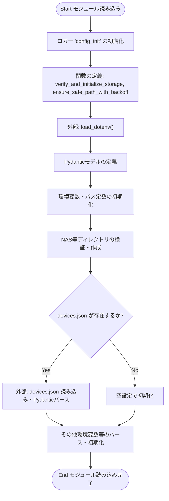
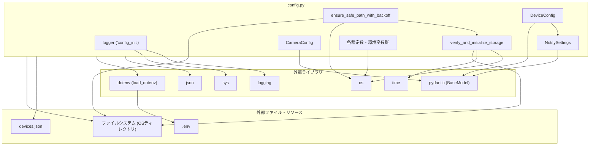

## 1. 解析メタ情報

| 項目 | 内容 |
| --- | --- |
| 対象ファイル | `config.py` |
| 言語 | Python |
| 解析対象 | 提供されたコードのみ |
| 推測・補完 | 一切なし |

## 関連ドキュメント

* [logger.md](./logger.md) - `config.BASE_DIR`, `config.DISCORD_WEBHOOK_ERROR`を参照する呼び出し元
* [database.md](./database.md) / [init_unified_db.md](./init_unified_db.md) - `config.SQLITE_DB_PATH`, `SQLITE_TABLE_*`定数群を参照する呼び出し元
* [notification_service.md](./notification_service.md) - `config.LINE_CHANNEL_ACCESS_TOKEN`, `config.DISCORD_WEBHOOK_*`を参照する呼び出し元
* [webhook_router.md](./webhook_router.md) - `config.SWITCHBOT_WEBHOOK_TOKEN`(SwitchBot Webhook共有シークレット検証)を参照する呼び出し元
* [line_handler.md](./line_handler.md) - `config.AUTHORIZED_LINE_USER_IDS`(認可済みLINEユーザーIDのallowlist)を参照する呼び出し元
* [quest_service.md](./quest_service.md) - `config.TV_UNLOCK_QUEST_IDS`(TVロック解除対象クエストID)、`config.YOUTUBE_REWARD_IDS`(YouTube系ごほうび券クールダウン対象reward_id)を参照する呼び出し元
* [sound_manager.md](./sound_manager.md) - `config.SOUND_MAP`, `SOUND_DIR`, `SOUND_PLAYER_CMD`等を参照する呼び出し元
* [smart_timelapse_generator.md](./smart_timelapse_generator.md) - 解像度・しきい値・Webhook URL等の設定値を参照する呼び出し元
* `financial_service.py`（本リポジトリに実体なし。実機デプロイ先にのみ存在すると見られる） - 本ファイルとは対照的に`config`モジュール経由ではなく`os.getenv`を直接使用する設計(個人情報保護のため)

## 2. ファイルの概要

* システム全体の環境変数、定数、ディレクトリパスの定義と初期化を行う。
* 根拠: [環境変数読み込み処理] (行番号: 204 / 抜粋: `SWITCHBOT_API_TOKEN: Optional[str] = os.getenv("SWITCHBOT_API_TOKEN")`)

* BTスピーカー運用の有効/無効を切り替えるフラグ`ENABLE_BLUETOOTH`（既定`False`）を定義する。`False`の間は`post_boot_health_check.py`のSpeakerチェックがBluetooth確認をスキップしサウンドカード確認へフォールバックする。あわせて、Anker SoundCore 2（`tools/connect_speaker.sh`, `tools/keep_alive_anker.sh`と同一デバイス）のMACアドレス`SPEAKER_BLUETOOTH_MAC`（既定値は環境変数未設定時`"F4:4E:FC:B6:65:D4"`）も同じ「1. 環境・機能フラグ設定」セクションで定義されている。Issue #488で、このセクションにあった未参照の`ENV`定数は削除された（現在このセクションは`ENABLE_BLUETOOTH`/`SPEAKER_BLUETOOTH_MAC`の2定数のみ）。
* 根拠: [ENABLE_BLUETOOTH/SPEAKER_BLUETOOTH_MAC定義とコメント] (行番号: 190〜199 / 抜粋: "# ==========================================\n# 1. 環境・機能フラグ設定\n# ==========================================\n# BTスピーカー運用の有効/無効。Falseの間はpost_boot_health_checkのSpeakerチェックが\n# BT確認をスキップしサウンドカード確認にフォールバックする。\n# 再有効化する場合はTrueにした上で、OS側の `sudo systemctl enable --now bluetooth`\n# と起動時自動接続(tools/connect_speaker.sh の定期実行)の整備が必要。\nENABLE_BLUETOOTH: bool = False\n# Anker SoundCore 2 (tools/connect_speaker.sh, tools/keep_alive_anker.sh と同一デバイス)\nSPEAKER_BLUETOOTH_MAC: str = os.getenv(\"SPEAKER_BLUETOOTH_MAC\", \"F4:4E:FC:B6:65:D4\")")

* SwitchBot Webhookの共有シークレット検証用トークン(`SWITCHBOT_WEBHOOK_TOKEN`)を環境変数から読み込む(`routers/webhook_router.py`が参照。未設定時は検証をスキップする後方互換設計)。
* 根拠: [環境変数読み込み処理] (行番号: 224 / 抜粋: `SWITCHBOT_WEBHOOK_TOKEN: Optional[str] = os.getenv("SWITCHBOT_WEBHOOK_TOKEN")`)

* **（2026-09-06 品質監査で修正）** LINE Messaging API呼び出し(reply/push/get_profile等)に渡す(接続, 読み取り)タイムアウト秒のタプル`LINE_API_REQUEST_TIMEOUT`（固定値`(5.0, 15.0)`、環境変数からは読まない）を「2. 認証・API設定」セクションに追加した。コメントによれば、line-bot-sdk v3は`_request_timeout`未指定だとurllib3に`timeout=None`(無期限ブロック)を渡すため、`api.line.me`へのTCPがブラックホール化した場合に`BackgroundTasks`のワーカースレッドが永久に塞がり、anyioのスレッドプール(既定40)が枯渇すると同期`def`の全エンドポイント(`/api/quest/*`等)まで停止する — その対策として追加された定数であり、`handlers/line_handler.py`・`handlers/line_logic.py`・`services/notification_service.py`の各LINE API呼び出しが`_request_timeout=config.LINE_API_REQUEST_TIMEOUT`として参照する（各仕様書参照）。
* 根拠: [定数定義とコメント] (行番号: 213〜219 / 抜粋: "# LINE Messaging API 呼び出し(reply/push/get_profile 等)の (接続, 読み取り) タイムアウト秒。", "LINE_API_REQUEST_TIMEOUT: tuple = (5.0, 15.0)")

* **（Issue #620で追加）** 「2. 認証・API設定」セクションに、認可済みの家族のLINEユーザーID(`event.source.user_id`、`"U"`+32桁hex形式)のallowlist`AUTHORIZED_LINE_USER_IDS`(環境変数`AUTHORIZED_LINE_USER_IDS`、カンマ区切り)を追加した。`handlers/line_handler.py`の`_is_authorized_line_user`が、体調・食事記録の書き込みとAI経由のDB検索をこのallowlistで制限する際に参照する。パース方式は`TV_UNLOCK_QUEST_IDS`等と同様の「カンマ分割してstrip、空要素は除外」だが、`isdigit()`によるフィルタは行わない(LINEユーザーIDは`U`始まりの文字列のため)。`SWITCHBOT_WEBHOOK_TOKEN`と同じく、未設定(空文字列)の場合は空リストとなり後方互換(検証なし)として扱われる。
* 根拠: [AUTHORIZED_LINE_USER_IDS定義とコメント] (行番号: 221〜230 / 抜粋: "# Issue #620: LINE公式アカウントを友だち追加すれば誰でもメッセージを送信できてしまうため、", "_authorized_line_user_ids_str: str = os.getenv(\"AUTHORIZED_LINE_USER_IDS\", \"\")", "AUTHORIZED_LINE_USER_IDS: List[str] = [\n    uid.strip() for uid in _authorized_line_user_ids_str.split(\",\") if uid.strip()\n]")

* ロガーの初期化設定を行う。
* 根拠: [ロガー設定処理] (行番号: 38 / 抜粋: `logger = logging.getLogger`)

* NASなどの外部ストレージのマウント遅延を考慮したディレクトリの検証、作成、書き込みテストを行う関数を提供する。
* 根拠: [ストレージ検証関数] (行番号: 40 / 抜粋: `def verify_and_initialize_stora`)

* NAS死活監視(`monitors/nas_monitor.py`)の書き込みテストがタイムアウトした際の再試行回数(`NAS_WRITE_CHECK_RETRIES`、既定3)を定義する。`verify_and_initialize_storage`と同様、autofsのアイドルアンマウント後の再トリガーやNAS本体のディスクスピンアップによる一過性の遅延を、単発のタイムアウトで即座に障害と判定せずExponential Backoffで吸収する目的で追加された。
* 根拠: [NAS & Network設定セクション] (行番号: 321 / 抜粋: `NAS_WRITE_CHECK_RETRIES: int = 3`)

* `Pydantic`を用いてデバイスやカメラの設定スキーマを定義する。
* 根拠: [Pydanticモデル定義] (行番号: 166 / 抜粋: `class CameraConfig(BaseModel):`)

* 外部設定ファイル（`devices.json`）を読み込み、グローバル変数にパース結果を格納する。Issue #488で、それまで存在した`family_events.json`（`IMPORTANT_DATES`用）の読み込み処理は本ファイルから完全に削除された。
* 根拠: [JSON読み込み処理] (行番号: 293〜306 / 抜粋: `with open(DEVICES_JSON_PATH, "r", encoding="utf-8") as f:`)

* `FAMILY_SETTINGS["members"]` の実名キー自体は `handlers/line_handler.py` 等でのメッセージ文字列マッチングに機能的に使用されているためソース上に残しつつ、年齢などの個人情報は Git 管理対象外の `family_members.local.json` が存在すればそこから読み込んでマージする（存在しなくてもプレースホルダーのままアプリは起動できる）。
* 根拠: [家族設定のローカルオーバーライド読み込み] (行番号: 430〜439 / 抜粋: `_family_local_path = os.path.join(os.path.dirname`)

* NVR録画・DBバックアップの保持日数（`RECORDING_RETENTION_DAYS`, `DB_BACKUP_RETENTION_DAYS`）、メモリ監視閾値（`MEMORY_ALERT_PERCENT`等）、TVロック機能に関連するクエストID（`TV_UNLOCK_QUEST_IDS`）、Alexaスキル検証用ID（`ALEXA_SKILL_ID`）、ラズパイ監視のフックスクリプトパス（`HEALTH_WATCH_INVESTIGATE_HOOK`）など、他の監視・運用系モジュールが参照する多数の設定値・閾値定数も本ファイルに定義されている。（Issue #488で、同種の未実装機能だった小児科予約監視の`CLINIC_MONITOR_URL`等はこのグループから削除された）
* 根拠: [保持期間設定セクション] (行番号: 389 / 抜粋: `RECORDING_RETENTION_DAYS: int = _get_int_env(`)

* CORS許可オリジン(`CORS_ORIGINS`)を定義する。以前は`unified_server.py`側にも別のハードコードされたオリジンリストが存在し、実際に使われるのはそちらだけで本ファイルの値は参照されない「死に設定」だったが、Streamlitダッシュボード・LAN内開発サーバー・Cloudflare Tunnel公開ドメインを含む形でこちらに一本化された（`unified_server.py`側は本リストを直接参照するよう変更済み）。`FRONTEND_URL`（既定値はパス付きの`"http://192.168.1.200:8000/quest"`）を`CORS_ORIGINS`へ追加する際は、`urlparse`で`scheme://netloc`部分のみを取り出した`_frontend_origin`を使う（Issue #112の修正。ブラウザが送信する`Origin`ヘッダーはscheme://host[:port]のみでパスを含まないため、Starletteの`CORSMiddleware`の完全一致比較ではパス付きの値が永久に一致しない「死にエントリ」になっていた）。`FRONTEND_URL`自体は`post_boot_health_check.py`等が実際にHTTPリクエストを送る完全なURLとして使われているため、パスを保持したまま変更していない。
* 根拠: [CORS許可オリジン定義] (行番号: 337〜344 / 抜粋: `CORS_ORIGINS: List[str] = [`)
* 根拠: [_frontend_originの算出(Issue #112)] (行番号: 326, 332 / 抜粋: `FRONTEND_URL: str = os.getenv("FRONTEND_URL", "http://192.168.1.200:8000/quest")`, `_frontend_origin = "{0.scheme}://{0.netloc}".format(urlparse(FRONTEND_URL))`)

* `reset_game.py`が管理者向けリセットAPI(`POST /api/quest/admin/reset_user`)を呼び出す際のサーバーのベースURL(`RESET_GAME_API_BASE_URL`、既定値`"http://127.0.0.1:8000"`)を定義する(Issue #547)。`reset_game.py`は`unified_server`と同じホストで実行される対話スクリプトという前提のため既定値はループバックアドレスとしており、LAN内の他端末からのアクセスを想定したホストIP指定である`FRONTEND_URL`とは用途が異なるためこの用途には流用しない、という趣旨のコメントが付されている。
* 根拠: [RESET_GAME_API_BASE_URL定義とコメント] (行番号: 357〜361 / 抜粋: "# Issue #547: reset_game.py が管理者向けリセットAPI(POST /api/quest/admin/reset_user)を\n# 呼び出す際のサーバーのベースURL。reset_game.pyはunified_serverと同じホストで実行される\n# 前提の対話スクリプトのため、既定値はループバックアドレスとする(FRONTEND_URLはLAN内の\n# 他端末からのアクセスを想定したホストのIP指定のため、この用途には流用しない)。\nRESET_GAME_API_BASE_URL: str = os.getenv(\"RESET_GAME_API_BASE_URL\", \"http://127.0.0.1:8000\")")

* クエスト機能のファイルアップロード(`/api/quest/upload`)におけるアップロード可能な最大ファイルサイズ(MB単位、環境変数で上書き可、既定5MB)を定義する。M15/Issue #325対応で、フロントエンド(`family-quest/src/components/ui/AvatarUploader.tsx`の`MAX_AVATAR_SIZE_BYTES`)の5MBと揃えられた(以前は既定10MBでフロントと不一致だった)。
* 根拠: [アップロード上限設定] (行番号: 354 / 抜粋: `UPLOAD_MAX_FILE_SIZE_MB: int = `)

* タイムラプス動画生成(`monitors/smart_timelapse_generator.py`)が`getattr(config, "TIMELAPSE_...", デフォルト値)`の形で参照する解像度・背景差分検出パラメータ・エンコード設定等の定数群を定義する。以前は対応する定数が本ファイルに存在せず、常にハードコードされたデフォルト値へフォールバックしていた。（Issue #498: `monitors/scheduled_timelapse.py`は実在しないファイルへの言及だったため削除）Issue #488で、既に削除済みだった`monitors/timelapse_runner.py`/`monitors/timelapse_generator.py`(Issue #485で削除)の残置設定だった`TIMELAPSE_CAMERAS`(監視対象カメラフォルダ)・`TIMELAPSE_SCHEDULES`(実行スケジュール)・`TIMELAPSE_FPS`/`TIMELAPSE_BITRATE`/`TIMELAPSE_MAXRATE`/`TIMELAPSE_SEGMENT_TIME`(エンコード設定)がこのセクションから削除され、`monitors/smart_timelapse_generator.py`が現在も参照する定数群のみが残った。
* 根拠: [タイムラプス生成設定] (行番号: 362 / 抜粋: `# タイムラプス生成設定`)

* 「12. ラズパイ監視(health_watch)設定」セクション(Issue #339)で、層2(異常検知時のClaude自動調査)のフックスクリプト絶対パス`HEALTH_WATCH_INVESTIGATE_HOOK`（環境変数、既定は未設定=`None`）を定義する。設定すると`monitors/health_watch.py`が異常検知時(通知抑制の内側)にこのスクリプトを異常サマリつきでfire-and-forget起動し、未設定なら層1の検知・通知のみで従来と同一挙動になる、というコメントが付されている。想定値は`MY_HOME_SYSTEM/scripts/claude_investigate.sh`で、実機セットアップ完了までは未設定のままにする旨も明記されている。（Issue #488でモジュールdocstring目次の番号が旧19番から12番へ振り直された）
* 根拠: [HEALTH_WATCH_INVESTIGATE_HOOK定義とコメント] (行番号: 476〜486 / 抜粋: "# ==========================================\n# 12. ラズパイ監視(health_watch)設定\n# ==========================================\n# Issue #339: 層2(異常検知時のClaude自動調査)のフックスクリプトの絶対パス。", "HEALTH_WATCH_INVESTIGATE_HOOK: Optional[str] = os.getenv(\"HEALTH_WATCH_INVESTIGATE_HOOK\")")

* 「13. NASパスの遅延解決 (Issue #330 PR-B)」セクション(Issue #488でモジュールdocstring目次の番号が旧20番から13番へ振り直された)で、NAS上のパス定数(`ASSETS_DIR`とその派生`SOUND_DIR`のみ)をPEP 562のモジュール`__getattr__`により**初回アクセス時に解決してモジュール属性へキャッシュ**する。以前はimport時に`ensure_safe_path_with_backoff`(書き込みテスト+Exponential Backoff、最悪 約31秒/パス)を実行しており、NAS障害・マウント遅延時にconfigをimportするだけのテスト・CLIツール・cronスクリプトまでブロックしていた。Issue #488で、未実装の給与PDF機能・小児科予約監視機能が削除されたことに伴い、`__getattr__`が扱っていた`TMP_VIDEO_DIR`分岐(旧・タイムラプス機能の残置設定)、および派生パス辞書`_ASSETS_DERIVED_PATHS`が保持していた`SALARY_IMAGE_DIR`/`CLINIC_HTML_DIR`/`CLINIC_STATS_CSV`/`CLINIC_GRAPH_PATH`は削除され、`_ASSETS_DERIVED_PATHS`は`{"SOUND_DIR": "sounds"}`の1エントリのみとなった。同様に、`ASSETS_DIR`配下で自動作成するサブディレクトリのリスト`_ASSETS_SUBDIRS_TO_CREATE`も(旧`["salary_images", "clinic_html"]`から)空リスト`[]`になった。`prewarm_nas_paths()`が解決する名前のタプルからも`TMP_VIDEO_DIR`が外れ、現在は`("ASSETS_DIR", *_ASSETS_DERIVED_PATHS)`のみとなっている。サーバー起動時は`unified_server.py`のlifespanが`prewarm_nas_paths()`を呼び、遅延化前と同じく起動時点で検証を済ませる。利用側の書き方(`config.ASSETS_DIR`等)は不変で、未知の属性名は従来どおり`AttributeError`を送出する。
* 根拠: [遅延解決セクション] (行番号: 488〜553 / 抜粋: "# 13. NASパスの遅延解決 (Issue #330 PR-B)", "_ASSETS_SUBDIRS_TO_CREATE: List[str] = []", "_ASSETS_DERIVED_PATHS: Dict[str, str] = {\n    \"SOUND_DIR\": \"sounds\",\n}", "def __getattr__(name: str) -> str:", "def prewarm_nas_paths() -> None:\n    ...\n    for name in (\"ASSETS_DIR\", *_ASSETS_DERIVED_PATHS):")

* 「14. Family Quest: YouTubeごほうび券クールダウン設定」セクション(Issue #488でモジュールdocstring目次の番号が旧21番から14番へ振り直された)で、Family Questの子ども向けYouTube系ごほうび券について、連続視聴による目の負担を防ぐためのクールダウン対象reward_idを`YOUTUBE_REWARD_IDS`(環境変数`YOUTUBE_REWARD_IDS`、カンマ区切りの整数、未設定時は既定値`"10,11,12"`)として定義する。パース方式は「10. TVロック機能設定」の`TV_UNLOCK_QUEST_IDS`と同じ(`isdigit()`を満たす要素のみ`int`化してリスト化、パース例外は`logger.warning`のみで握りつぶす)。`services/quest_service.py`の`InventoryService.use_item`/`get_user_inventory`が参照する。
* 根拠: [Family Quest: YouTubeごほうび券クールダウン設定セクション] (行番号: 555〜569 / 抜粋: "# 14. Family Quest: YouTubeごほうび券クールダウン設定", "_youtube_reward_ids_str: str = os.getenv(\"YOUTUBE_REWARD_IDS\", \"10,11,12\")", "YOUTUBE_REWARD_IDS: List[int] = []")
* 同セクションに、クールダウンを実際に強制し始める日を表す`YOUTUBE_REWARD_COOLDOWN_ENFORCE_FROM`(環境変数`YOUTUBE_REWARD_COOLDOWN_ENFORCE_FROM`、`YYYY-MM-DD`形式、既定値`"2026-09-12"`、`datetime.date`型)を追加した。いきなり制限がかかると子どもが困惑するため、この日を迎えるまでは`InventoryService.use_item`が実際には使用を拒否せず、family-quest側に予告バナーのみを表示する猶予期間を設ける目的。パース失敗時は`logger.warning`を出したうえで`date(2000, 1, 1)`(=常に施行済み扱い、安全側の即時強制)にフォールバックする。
* 根拠: [YOUTUBE_REWARD_COOLDOWN_ENFORCE_FROM定義] (行番号: 577〜583 / 抜粋: "from datetime import date as _date\n_youtube_cooldown_enforce_from_str: str = os.getenv(\"YOUTUBE_REWARD_COOLDOWN_ENFORCE_FROM\", \"2026-09-12\")\ntry:\n    YOUTUBE_REWARD_COOLDOWN_ENFORCE_FROM: _date = _date.fromisoformat(_youtube_cooldown_enforce_from_str)\nexcept Exception as e:\n    logger.warning(...)\n    YOUTUBE_REWARD_COOLDOWN_ENFORCE_FROM = _date(2000, 1, 1)")

* 「11. Alexaスキル設定」セクション(Issue #488でモジュールdocstring目次の番号が旧18番から11番へ振り直された)で、`routers/alexa_router.py`経由のリクエスト検証に使う`ALEXA_SKILL_ID`（Alexa Developer Consoleで発行される`"amzn1.ask.skill.xxxx"`形式のID）を定義する。設定されていれば`ask-sdk-core`がリクエストの`context.System.application.applicationId`との一致を検証し他人のスキルからのリクエストを拒否するが、未設定でも動作する（署名検証のみになる）後方互換設計であることがコメントに明記されている。
* 根拠: [ALEXA_SKILL_ID定義とコメント] (行番号: 467〜474 / 抜粋: "# ==========================================\n# 11. Alexaスキル設定\n# ==========================================\n# Alexa Developer Consoleでスキルを作成すると発行される \"amzn1.ask.skill.xxxx\" 形式のID。\n# 設定すると、routers/alexa_router.py 経由のリクエストの context.System.application.applicationId\n# がこの値と一致するかを ask-sdk-core が検証し、他人のスキルからのリクエストを拒否する。\n# 未設定でも動作するが(署名検証だけになる)、本番では設定を強く推奨。\nALEXA_SKILL_ID: Optional[str] = os.getenv(\"ALEXA_SKILL_ID\")")

## 3. 外部依存関係

### インポート一覧

| 名称 | 種類 | 用途 | 根拠 |
| --- | --- | --- | --- |
| `os` | 標準ライブラリ | 環境変数取得、パス結合、ディレクトリ作成等のOS操作 | 根拠: `import os` (行番号: 21 / 抜粋: `import os`) |
| `time` | 標準ライブラリ | `verify_and_initialize_storage`のプロセス固有の書き込みテストファイル名生成(`time.time_ns()`、Issue #384対応)に使用 | 根拠: `import time` (行番号: 22 / 抜粋: `import time`) |
| `sys` | 標準ライブラリ | ロガーの標準出力ハンドラの設定 | 根拠: `import sys` (行番号: 23 / 抜粋: `import sys`) |
| `json` | 標準ライブラリ | 外部JSONファイルの読み込み・パース | 根拠: `import json` (行番号: 24 / 抜粋: `import json`) |
| `logging` | 標準ライブラリ | ロガーの取得・設定およびログ出力 | 根拠: `import logging` (行番号: 25 / 抜粋: `import logging`) |
| `Optional`, `List`, `Dict`, `Any` | 標準ライブラリ(`typing`) | 型ヒントの定義 | 根拠: `from typing import Optional, L` (行番号: 26 / 抜粋: `from typing import Optional, L`) |
| `urlparse` | 標準ライブラリ(`urllib.parse`) | `FRONTEND_URL`から`CORS_ORIGINS`用のscheme+netloc(パスを含まないOrigin相当の値)を取り出すために使用（Issue #112の修正で追加） | 根拠: `from urllib.parse import urlparse` (行番号: 27 / 抜粋: `from urllib.parse import urlparse`) |
| `load_dotenv` | 外部ライブラリ(`dotenv`) | `.env`ファイルからの環境変数読み込み処理 | 根拠: `from dotenv import load_dotenv` (行番号: 29 / 抜粋: `from dotenv import load_dotenv`) |
| `BaseModel`, `Field`, `ValidationError` | 外部ライブラリ(`pydantic`) | データバリデーション付きのモデルクラス定義とエラー捕捉 | 根拠: `from pydantic import BaseModel` (行番号: 30 / 抜粋: `from pydantic import BaseModel`) |
| `retry_with_backoff` | 内部モジュール(`core.utils`) | `verify_and_initialize_storage`のExponential Backoffリトライ機構(Issue #292で共通ユーティリティへ切り出し) | 根拠: `from core.utils import retry_with_backoff` (行番号: 32 / 抜粋: `from core.utils import retry_with_backoff`) |
| `date`(`_date`という別名) | 標準ライブラリ(`datetime`) | `YOUTUBE_REWARD_COOLDOWN_ENFORCE_FROM`(YouTube系ごほうび券クールダウンの施行開始日)のパース・型注釈・フォールバック値の生成 | 根拠: `from datetime import date as _date` (行番号: 577 / 抜粋: `from datetime import date as _date`) |

Issue #488で、未実装のタイムラプススケジュール機能(`TIMELAPSE_SCHEDULES`)の残置設定だった`from datetime import time as _dt_time`は使用箇所ごと削除され、現在`config.py`はこのエイリアスをインポートしていない。

### ブラックボックスとなる外部要素

| 名称 | 理由 | 根拠 |
| --- | --- | --- |
| `.env`ファイル | 外部ファイルであり、実行時の環境変数の実際の内容がコードから読み取れないため。 | 根拠: `load_dotenv()` (行番号: 161 / 抜粋: `load_dotenv()`) |
| `devices.json` | システムに接続されるカメラやモニター等のデバイス設定情報を持つ外部ファイルであり、具体的な内容が不明なため。 | 根拠: `with open(DEVICES_JSON_PATH, ` (行番号: 295 / 抜粋: `with open(DEVICES_JSON_PATH, `) |
| `family_members.local.json` | Git管理対象外(gitignore)の外部ファイルであり、`FAMILY_SETTINGS["styles"]` の年齢等の実データがどのような値・構造で上書きされるか不明なため。 | 根拠: `# family_members.local.json (gitignore対象) から読み込み、` (行番号: 416 / 抜粋: `family_members.local.json`) |
| `Pydantic`の内部実装 | 外部ライブラリであり、バリデーションの厳密な挙動（例：エイリアスやデフォルトファクトリの処理詳細）は提供コードから読み取れないため。 | 根拠: `class CameraConfig(BaseModel):` (行番号: 166 / 抜粋: `class CameraConfig(BaseModel):`) |

Issue #488で、`family_events.json`（家族の記念日・イベント設定`IMPORTANT_DATES`用）の読み込み処理は本ファイルから完全に削除されたため、外部依存としては存在しなくなった。

## 4. 主要要素の定義（関数 / エンドポイント / コンポーネント）

### `verify_and_initialize_storage`

* **役割**: 指定されたパスのディレクトリ作成と書き込みテストを、指定回数リトライ（Exponential Backoff）しながら実行する。Issue #292で、Exponential Backoffのループ機構自体を`core.utils.retry_with_backoff`(共通ユーティリティ)へ委譲するようリファクタリングされた。`monitors/nas_monitor.py`の`check_write_permission`も同じ共通ユーティリティを使うようになったが、リトライ対象の例外集合・リトライ回数・待機時間という「ポリシー」自体は呼び出し元ごとに従来のまま維持されている(挙動を変えない純粋なリファクタリング)。
* 根拠: [関数定義] (行番号: 40 / 抜粋: `def verify_and_initialize_stora`), [retry_with_backoffへの委譲] (行番号: 78〜85 / 抜粋: `retry_with_backoff(\n            _attempt,\n            max_retries=max_retries,\n            retryable_exceptions=(OSError, PermissionError, IOError),`)
* **（Issue #384 で修正）** 書き込みテスト用ファイル名は固定の `.write_test` ではなく `.write_test.<pid>.<time_ns>` とプロセス固有にする。以前は scheduler 起動直後に同時実行される複数の監視プロセスが同じファイルを open→write→remove して衝突し(片方の `os.remove` が `FileNotFoundError`)、起動のたびにリトライ警告が出る/最悪 `temp_fallback` へ落ちていた。
* 根拠: `test_file: str = os.path.join(base_path, f".write_test.{os.getpid()}.{time.time_ns()}")` (行番号: 55)

* **引数/リクエスト**: `base_path` (str: 確認対象ディレクトリ), `max_retries` (int: 最大リトライ回数。デフォルトは5)
* 根拠: [引数定義] (行番号: 40 / 抜粋: `base_path: str, max_retries: i`)

* **戻り値/レスポンス**: `bool` (初期化・テスト成功でTrue、最終的に失敗でFalse)
* 根拠: [戻り値型ヒント] (行番号: 40 / 抜粋: `-> bool:`)

* **副作用**: ディレクトリの作成(`os.makedirs`)、一時ファイル(`.write_test`)の作成・削除、失敗時は`time.sleep`によるExponential Backoff待機(`core.utils.retry_with_backoff`内で発生)。
* 根拠: [ディレクトリ・ファイル操作] (行番号: 58〜68 / 抜粋: `os.makedirs(base_path, exist_o`)

* **エラーハンドリング**: `retry_with_backoff`に`(OSError, PermissionError, IOError)`をリトライ対象として渡し、リトライ上限未満なら`core.utils`側でExponential Backoff待機、上限到達時は`retry_with_backoff`が最後の例外を再送出するため、これを`except`で捕捉してエラーログを出力しFalseを返す。
* 根拠: [例外捕捉] (行番号: 86〜90 / 抜粋: `except (OSError, PermissionError, IOError) as e:`)

#### 追加された設定値（Issue #359 / #405 / #547）

* `WEBHOOK_BASE_URL: Optional[str]`（行番号: 227）: `switchbot_webhook_fix.py` が Webhook URL を再登録する際の公開ベースURL。以前はスクリプト側で `os.environ.get()` を直接読んでおり `.env.example` 整合テストの死角だった（Issue #405）。
* `HLS_VOD_RETENTION_DAYS: int`（既定 3、行番号: 391）: 録画VODのHLSセグメントキャッシュ（`BASE_DIR/data/hls_streams/vod`）の保持日数。`monitors/nas_monitor.py` の `run_retention_cleanup` が参照する（Issue #359）。
* `RESET_GAME_API_BASE_URL: str`（既定`"http://127.0.0.1:8000"`、行番号: 361）: `reset_game.py`が管理者向けリセットAPI(`POST /api/quest/admin/reset_user`)を呼び出す際のサーバーのベースURL。`reset_game.py`は`unified_server`と同じホストで実行される対話スクリプトという前提のため既定値はループバックアドレスとしている(LAN内の他端末からのアクセスを想定した`FRONTEND_URL`とは用途が異なるため流用しない)（Issue #547）。

### `_get_int_env`

* **役割**: 環境変数を整数として読み込む共通ヘルパー（**#411 S-L6で追加**）。以前は `MOTION_COOLDOWN_SEC`・`UPLOAD_MAX_FILE_SIZE_MB`・`RECORDING_RETENTION_DAYS`・`HLS_VOD_RETENTION_DAYS`・`DB_BACKUP_RETENTION_DAYS`に加え、小児科予約監視の`CLINIC_MONITOR_START_HOUR`・`CLINIC_MONITOR_END_HOUR`・`CLINIC_REQUEST_TIMEOUT`の計8変数それぞれで `int(os.getenv(name, "default"))` を直書きしており、`.env` に空文字や非数値（例: コメント混じりの値）が誤って設定されると `int()` が `ValueError` を送出し、`config` モジュール全体のimportが失敗してサーバーが起動不能になっていた。未設定/空文字はデフォルト値、非数値は警告ログを出してデフォルト値にフォールバックするようにした。なお小児科予約監視機能自体は未実装のままIssue #488で`config.py`から削除されたため、現在この関数を呼び出しているのは前者5箇所のみである。
* 根拠: `def _get_int_env(name: str, default: int) -> int:` (行番号: 96〜111)、呼出し例: `MOTION_COOLDOWN_SEC: int = _get_int_env("MOTION_COOLDOWN_SEC", 60)` (行番号: 310)

* **引数/リクエスト**: `name: str` (環境変数名), `default: int` (未設定/パース失敗時のデフォルト値)
* 根拠: `def _get_int_env(name: str, default: int) -> int:` (行番号: 96)

* **戻り値/レスポンス**: `int`
* 根拠: `def _get_int_env(name: str, default: int) -> int:` (行番号: 96)

* **副作用**: パース失敗時に `logger.warning` を出力
* 根拠: `logger.warning(f"⚠️ 環境変数 {name}='{raw}' は整数として解釈できません。デフォルト値 {default} を使用します。")` (行番号: 110)

* **エラーハンドリング**: `int(raw)` の `ValueError` を捕捉してデフォルト値にフォールバック
* 根拠: `except ValueError:` (行番号: 109)

### `ensure_safe_path_with_backoff`

* **役割**: `verify_and_initialize_storage`を呼び出してパスを検証し、失敗した場合はローカルのフォールバックディレクトリを作成して返す。
* 根拠: [関数定義] (行番号: 120〜124 / 抜粋: `def ensure_safe_path_with_back`)

* **引数/リクエスト**: `preferred_path` (str: 本来の保存パス), `fallback_name` (str: フォールバック時ディレクトリ名), `max_retries` (int: 最大リトライ回数。デフォルト5)
* 根拠: [引数定義] (行番号: 121〜123 / 抜粋: `preferred_path: str, `)

* **戻り値/レスポンス**: `str` (安全な書き込みパス)
* 根拠: [戻り値型ヒント] (行番号: 124 / 抜粋: `-> str:`)

* **副作用**: `verify_and_initialize_storage`の副作用に加え、フォールバックディレクトリの作成(`os.makedirs`)。
* 根拠: [フォールバック作成] (行番号: 149 / 抜粋: `os.makedirs(fallback_path, exi`)

* **エラーハンドリング**: フォールバックディレクトリ作成時の`Exception`をキャッチし、エラーログを出力して`preferred_path`を返す。
* 根拠: [例外捕捉] (行番号: 155 / 抜粋: `except Exception as fatal_e:`)

### `CameraConfig`

* **役割**: カメラ設定のデータ構造とバリデーションを定義するPydanticモデル。
* 根拠: [クラス定義] (行番号: 166〜176 / 抜粋: `class CameraConfig(BaseModel):`)

* **引数/リクエスト**: なし（Pydanticによるインスタンス化時に属性を受け取る）
* 根拠: [クラス定義] (行番号: 166〜176 / 抜粋: `class CameraConfig(BaseModel):`)

* **戻り値/レスポンス**: 該当なし
* 根拠: [クラス定義] (行番号: 166〜176 / 抜粋: `class CameraConfig(BaseModel):`)

* **副作用**: なし
* 根拠: [クラス定義] (行番号: 166〜176 / 抜粋: `class CameraConfig(BaseModel):`)

* **エラーハンドリング**: Pydanticの機能に依存するバリデーションエラー(`ValidationError`)。
* 根拠: [Pydanticの継承] (行番号: 166〜176 / 抜粋: `class CameraConfig(BaseModel):`)

### `NotifySettings`

* **役割**: 通知設定のデータ構造とバリデーションを定義するPydanticモデル。
* 根拠: [クラス定義] (行番号: 178〜181 / 抜粋: `class NotifySettings(BaseModel`)

* **引数/リクエスト**: なし（Pydanticによるインスタンス化時に属性を受け取る）
* 根拠: [クラス定義] (行番号: 178〜181 / 抜粋: `class NotifySettings(BaseModel`)

* **戻り値/レスポンス**: 該当なし
* 根拠: [クラス定義] (行番号: 178〜181 / 抜粋: `class NotifySettings(BaseModel`)

* **副作用**: なし
* 根拠: [クラス定義] (行番号: 178〜181 / 抜粋: `class NotifySettings(BaseModel`)

* **エラーハンドリング**: Pydanticの機能に依存するバリデーションエラー(`ValidationError`)。
* 根拠: [Pydanticの継承] (行番号: 178〜181 / 抜粋: `class NotifySettings(BaseModel`)

### `DeviceConfig`

* **役割**: デバイス設定のデータ構造とバリデーションを定義するPydanticモデル。
* 根拠: [クラス定義] (行番号: 183〜188 / 抜粋: `class DeviceConfig(BaseModel):`)

* **引数/リクエスト**: なし（Pydanticによるインスタンス化時に属性を受け取る）
* 根拠: [クラス定義] (行番号: 183〜188 / 抜粋: `class DeviceConfig(BaseModel):`)

* **戻り値/レスポンス**: 該当なし
* 根拠: [クラス定義] (行番号: 183〜188 / 抜粋: `class DeviceConfig(BaseModel):`)

* **副作用**: なし
* 根拠: [クラス定義] (行番号: 183〜188 / 抜粋: `class DeviceConfig(BaseModel):`)

* **エラーハンドリング**: Pydanticの機能に依存するバリデーションエラー(`ValidationError`)。
* 根拠: [Pydanticの継承] (行番号: 183〜188 / 抜粋: `class DeviceConfig(BaseModel):`)

## 5. 処理フロー図

```mermaid
flowchart TD
    Start(["Start モジュール読み込み"]) --> SetupLogger["ロガー 'config_init' の初期化"]
    SetupLogger --> DefFuncs["関数の定義: verify_and_initialize_storage, ensure_safe_path_with_backoff"]
    DefFuncs --> LoadDotenv["外部: load_dotenv()"]
    LoadDotenv --> DefModels["Pydanticモデルの定義"]
    DefModels --> LoadEnvVars["環境変数・パス定数の初期化"]
    LoadEnvVars --> CheckNAS["NAS等ディレクトリの検証・作成"]
    
    CheckNAS --> LoadDevicesJson{"devices.json が存在するか?"}
    LoadDevicesJson -- Yes --> ReadDevices["外部: devices.json 読み込み・Pydanticパース"]
    LoadDevicesJson -- No --> EmptyDeviceConfig["空設定で初期化"]
    ReadDevices --> ParseOtherVars
    EmptyDeviceConfig --> ParseOtherVars["その他環境変数等のパース・初期化"]
    ParseOtherVars --> End(["End モジュール読み込み完了"])

```

（Issue #488で、それまで存在した`family_events.json`読み込み分岐と、`devices.json`読み込み後の「カメラIP/User/Pass初期化」ノード、および末尾の「ログ・アセット等ディレクトリの自動作成ループ」ノードはいずれもソースから削除された処理に対応するため、このフロー図からも削除した。）

## 6. 依存関係図

```mermaid
flowchart TD
    subgraph SubConfig["config.py"]
        logger["logger ('config_init')"]
        verify_and_initialize_storage
        ensure_safe_path_with_backoff
        CameraConfig
        NotifySettings
        DeviceConfig
        EnvVars["各種定数・環境変数群"]
    end

    subgraph SubExtLibs["外部ライブラリ"]
        os
        sys
        json
        time
        logging
        dotenv["dotenv (load_dotenv)"]
        pydantic["pydantic (BaseModel)"]
    end

    subgraph SubResources["外部ファイル・リソース"]
        env_file[".env"]
        devices_json["devices.json"]
        file_system["ファイルシステム (OSディレクトリ)"]
    end

    %% config.py内の依存関係
    ensure_safe_path_with_backoff --> verify_and_initialize_storage
    DeviceConfig --> NotifySettings
    
    %% 外部ライブラリへの依存
    verify_and_initialize_storage --> os
    verify_and_initialize_storage --> time
    logger --> logging
    logger --> sys
    ensure_safe_path_with_backoff --> os
    EnvVars --> os
    SubConfig --> json
    SubConfig --> dotenv
    CameraConfig --> pydantic
    NotifySettings --> pydantic
    DeviceConfig --> pydantic

    %% 外部リソースへの依存
    dotenv --> env_file
    SubConfig --> devices_json
    verify_and_initialize_storage --> file_system
    ensure_safe_path_with_backoff --> file_system
    SubConfig --> file_system

```

（Issue #488で`family_events.json`の読み込みが完全に削除されたため、対応する`family_events_json`ノードとその依存エッジをこの依存関係図からも削除した。）

## 7. 次のステップ（リバースエンジニアリングの提案）

| 優先度 | ファイル名(推測可) | 理由 | 根拠 |
| --- | --- | --- | --- |
| 高 | `devices.json` | 各種デバイス（カメラ・モニター等）の具体的な設定や台数が記載されており、システムの実態を把握するために必須。 | 根拠: `DEVICES_JSON_PATH: str = os.` (行番号: 261 / 抜粋: `DEVICES_JSON_PATH: str = os.`) |
| 中 | DBアクセス関連ファイル (例: `database.py` や `models.py`) | `SQLITE_TABLE_SENSOR`など多数のテーブル名定数が定義されており、実際のスキーマやデータ操作ロジックを解析する必要がある。 | 根拠: `SQLITE_TABLE_SENSOR: str = ` (行番号: 264 / 抜粋: `SQLITE_TABLE_SENSOR: str = `) |
| 中 | APIクライアント実装 (例: `switchbot.py`, `nature_remo.py`) | SwitchBotやNature RemoのAPIトークンが定義されており、これらを利用する外部通信ロジックを特定するため。 | 根拠: `SWITCHBOT_API_TOKEN: Optiona` (行番号: 204 / 抜粋: `SWITCHBOT_API_TOKEN: Optiona`) |
| 低 | 通知処理の実装 (例: `notifier.py` や `discord.py`) | Discord WebhookやLINEのトークンが定義されており、各種通知がいつ・どのような条件で発火するかを確認するため。 | 根拠: `DISCORD_WEBHOOK_NOTIFY: Opti` (行番号: 232 / 抜粋: `DISCORD_WEBHOOK_NOTIFY: Opti`) |

## 8. 保守上の注意点

* モジュールロード時にファイルI/O（ディレクトリ作成・テストファイルの書き込み）や`time.sleep`を伴う処理（`verify_and_initialize_storage`）が実行されるため、マウント失敗時などはインポート自体に最大で数秒〜数十秒の遅延が発生する可能性がある。
* `fallback_path`を作成する際のフェイルセーフで例外が発生した場合、エラーログを出力しつつ元の`preferred_path`を返す仕様になっているため、後続の処理で書き込みエラー(`PermissionError`等)が誘発される可能性がある。
* モジュールロード時に外部の`devices.json`を読み込む仕様であり、JSONの構文エラーが発生した場合は例外をキャッチして警告を出すが、設定は空のまま処理が続行される（Issue #488で`family_events.json`の読み込みは完全に削除された）。
* メモリ使用率やストレージ等の警告通知に関連する定数（例：`MEMORY_ALERT_PERCENT`）が存在するが、このファイル単体では監視機構そのものは実装されていない。
* `TV_UNLOCK_QUEST_IDS` は環境変数のカンマ区切り文字列から数字のみを抽出して`int`変換しており、`isdigit()`を満たさない値（不正なID等）は例外を送出せず黙って除外される仕様のため、設定ミスに気づきにくい。
* `YOUTUBE_REWARD_IDS`も同じパース方式(`isdigit()`を満たす要素のみ`int`化)のため同じ落とし穴を持つ。加えて`TV_UNLOCK_QUEST_IDS`(未設定時は空リスト=機能無効)と異なり、環境変数が未設定の場合は既定値`"10,11,12"`にフォールバックしてクールダウン機能が有効な状態になる点に注意(明示的に`YOUTUBE_REWARD_IDS=`(空文字)を設定した場合のみ空リストとなり無効化される)。
* `FAMILY_SETTINGS["members"]` の実名文字列自体は他モジュール（`handlers/line_handler.py`等）のメッセージマッチングロジックと結合しているため、この値を変更すると気づきにくい形で機能が壊れるリスクがある。年齢等の付随情報のみ`family_members.local.json`（gitignore対象）に切り出す設計になっている。
* `NAS_WRITE_CHECK_RETRIES`(321行目)は本ファイル内では未使用で、`monitors/nas_monitor.py`の`NasMonitor.__init__`が`getattr(config, "NAS_WRITE_CHECK_RETRIES", 3)`で参照する消費専用の設定値である。本ファイル単体を見ても実際の再試行ロジック(Exponential Backoff)は確認できない点に注意。
* **Issue #488での大規模クリーンアップ**: リポジトリ全体をgrepし`config.py`以外から一切参照されていないことを確認できた53個のモジュールレベル定数を削除した。内訳は、未実装の給与PDF機能(`GMAIL_USER`・`SALARY_PDF_PASSWORDS`等)、SUUMO/土地価格監視(`SUUMO_SEARCH_URL`等)、小児科予約監視(`CLINIC_MONITOR_URL`等)、Google Photos連携(`GOOGLE_PHOTOS_TOKEN`等。当時のドキュメントが参照していた`tools/google_photos_service.py`は本リポジトリに実体がなく、参照する箇所も存在しなかった)、ショッピング・美容院予約監視(`SHOPPING_TARGETS`等)、子供健康チェック機能(`CHILDREN_NAMES`等)といった未実装機能の設定値、Issue #485で削除済みのタイムラプス関連スクリプト(`monitors/timelapse_runner.py`/`monitors/timelapse_generator.py`)の残置設定(`TIMELAPSE_CAMERAS`・`TIMELAPSE_SCHEDULES`・`TMP_VIDEO_DIR`等)、およびカメラ設定の旧方式(`CAMERA_IP`等、`CAMERAS`リストに統合済み)などである。これに伴いモジュールdocstringの目次を21セクションから14セクションへ振り直した(削除されたのは旧5.給与、6.ショッピング・美容院予約監視、7.土地価格監視、8.Google Photos連携、9.不動産情報REINFOLIB、14.外部サイト監視SUUMO、15.小児科予約監視の各セクション)。一方で`ALLOW_ALL_ORIGINS`(345行目)は`config.py`以外からの直接参照がなく一見未使用に見えるが、346〜347行目で`CORS_ORIGINS`を`["*"]`に上書きするimport時の副作用を通じて間接的にCORS設定全体を制御しているため、今回のレビューで意図的に削除対象から除外された。今後の同種クリーンアップでもこの点(環境変数経由の間接的な副作用)には注意すること。
* 根拠: [ALLOW_ALL_ORIGINSによるCORS_ORIGINS上書き] (行番号: 345〜347 / 抜粋: `ALLOW_ALL_ORIGINS: bool = os.getenv("ALLOW_ALL_ORIGINS", "False").lower() == "true"\nif ALLOW_ALL_ORIGINS:\n    CORS_ORIGINS = ["*"]`), [モジュール目次(14セクション)] (行番号: 5〜19)
* **（Issue #584で判明）`SQLITE_TABLE_AI_REPORT`はリポジトリ内に書込コードが無い**: `ai_report_records`(ダッシュボードの「セバスチャンからの報告」欄が`analysis_service.load_ai_report`経由で表示)へのINSERT/UPDATE経路はリポジトリ全体・git履歴を通じて一度も存在しない。一方`dashboard.py`にはこのテーブルの`timestamp`列を新形式(ISO8601)・旧形式(`"YYYY-MM-DD HH:MM:SS"`のnaive文字列、Issue #410 L-L2で言及)の両方でパースする分岐があり、過去に実データが書き込まれていたことを示唆する。リポジトリ管理外の外部プロセス(実機での手動運用、または別リポジトリのスクリプト)がこのテーブルへ書き込む前提の設計と判断し、その旨をコメントとして明記した。本リポジトリ側に書込コードを追加する対応は不要。
* 根拠: `SQLITE_TABLE_AI_REPORT`定義とコメント (行番号: 275〜282)、[dashboard.pyの新旧タイムスタンプ分岐] (`MY_HOME_SYSTEM/dashboard.py`、Issue #410 L-L2のコメント参照)

## 9. 不明事項一覧

| 項目 | 理由 | 必要なファイル |
| --- | --- | --- |
| `devices.json` の全体スキーマ | Pydanticモデルで一部定義されているが、実際のJSON構造や、設定されているデバイスの種類・台数が不明であるため。（リポジトリ内を`devices.json`で検索したが実体ファイルは存在せず、解消不可。`.gitignore`の`*.json`規則により追跡対象外と判明） | `devices.json` |
| 各種APIの利用箇所とエンドポイント | SwitchBot、Nature Remo、LINE、Discord、Gemini等のキーが定義されているが、実際にどう通信しているかが不明であるため。 | API通信を行う各種Pythonモジュール |
| Pydanticバリデーションエラー時のシステムの挙動 | `devices.json`のバリデーションエラーをキャッチしログを出力しているが、その後のシステム全体への影響が不明であるため。 | `config.py`をインポートするメインの実行ファイル |
| 各テーブルの詳細なスキーマ定義 | テーブル名の文字列が定義されているのみで、カラム構成やリレーションが不明であるため。 | データベース操作を行うモジュール |
| `family_members.local.json` の具体的な内容・スキーマ | Git管理対象外であり、実際にどの家族の年齢・表示情報がどう格納されているか本ファイルからは判別できないため。 | `family_members.local.json`（gitignore対象。`family_members.local.json.example`が参考になる可能性） |
| `TV_UNLOCK_QUEST_IDS` が参照するクエストの実体 | クエストIDのリストのみが定義されており、対応するクエスト定義やTVロック解除の実処理は別ファイルにあるため。 | クエスト機能・TVロック機能を実装するモジュール |

## 相互参照による補足情報

| 元の不明事項 | 判明した内容 | 参照元ドキュメント |
| --- | --- | --- |
| `devices.json` の全体スキーマ | 実体の`devices.json`はリポジトリ内を検索したが存在せず(`.gitignore`66行目の`*.json`規則により追跡対象外、ランタイム生成ファイル)、実データそのものの解消はできなかった。ただし期待されるスキーマは`config.py`のPydanticモデルから直接確認できる。`CameraConfig`(166〜176行目)は`id, name, nas_folder(任意), location, ip, port(既定2020), user(任意), password(エイリアス"pass", 任意), rtsp_url(任意), enabled(既定True。E-3でカメラのライブ/録画表示のON・OFF永続化用に追加)`を持ち、`DeviceConfig`(183〜188行目)は`id, type, location, name, notify_settings(NotifySettings, default_factory)`を持つ(`NotifySettings`は178〜181行目で`power_threshold_watts, notify_mode(既定"LOG_ONLY"), target`)。`config.py`297〜300行目より、`devices.json`のトップレベルは`{"cameras": [...], "monitor_devices": [...]}`という2キー構造であることも確認した。下流では`routers/camera_router.py`35〜36行目が`cam["id"]`/`cam["name"]`を、`services/analysis_service.py`75〜76行目が`d["id"]`/`d.get("name")`/`d.get("location")`を実際に参照している。 | 直接ソース確認: `MY_HOME_SYSTEM/config.py:166-188, 287-300`（参考: `MY_HOME_SYSTEM/routers/camera_router.py:33-36`, `MY_HOME_SYSTEM/services/analysis_service.py:75-76`） |
| 各種APIの利用箇所とエンドポイント | 5種のAPIについて、`config`定数を実際に参照する箇所を直接確認した。(1) SwitchBot: `services/switchbot_service.py`の`send_device_command(device_id, command, parameter="default", command_type="command")`(58〜60行目)が`config.SWITCHBOT_API_HOST`(`https://api.switch-bot.com`)を使って`{HOST}/v1.1/devices/{device_id}/commands`へPOSTし、`create_switchbot_auth_headers()`(78〜81行目)が`config.SWITCHBOT_API_TOKEN`/`SWITCHBOT_API_SECRET`から認証ヘッダーを生成する。(2) Nature Remo: `monitors/nature_remo_monitor.py`の`main()`(146〜148行目)が伊丹=`config.NATURE_REMO_ACCESS_TOKEN`、高砂=`config.NATURE_REMO_ACCESS_TOKEN_TAKASAGO`のトークンをそれぞれ`process_location(loc, token)`に渡す。(3) LINE: `services/notification_service.py`27〜28行目で`config.LINE_CHANNEL_ACCESS_TOKEN`をLINE Messaging API v3の`Configuration(access_token=...)`に設定する。(4) Discord: 同ファイル30〜37行目の`_send_discord_webhook(messages, image_data=None, channel="notify", filename="snapshot.jpg")`が`channel`引数(`"error"`/`"report"`/既定`"notify"`)に応じて`config.DISCORD_WEBHOOK_ERROR`/`DISCORD_WEBHOOK_REPORT`/`DISCORD_WEBHOOK_NOTIFY or DISCORD_WEBHOOK_URL`のいずれかへ`requests.post`する。(5) Gemini: `services/ai_service.py`34〜35行目で`config.GEMINI_API_KEY`が設定されていれば`genai.configure(api_key=...)`しモデル名`gemini-2.0-flash`を使用、未設定時は39〜40行目でAI機能を無効化する。**（Issue #488で削除）** 以前はここに、`tools/google_photos_service.py`(本リポジトリに実体なし)が`config.GOOGLE_PHOTOS_TOKEN`/`GOOGLE_PHOTOS_CREDENTIALS`をGoogle Photos Library APIの認証フローに使用しているという記載があったが、`GOOGLE_PHOTOS_TOKEN`/`GOOGLE_PHOTOS_CREDENTIALS`/`GOOGLE_PHOTOS_SCOPES`はconfig.py・アプリ全体のどこからも参照されておらず(該当ファイル自体も本リポジトリに存在しない)未実装の連携だったと判明したため、3定数とも削除された。 | 直接ソース確認: `MY_HOME_SYSTEM/services/switchbot_service.py:58-81`, `MY_HOME_SYSTEM/monitors/nature_remo_monitor.py:146-148`, `MY_HOME_SYSTEM/services/notification_service.py:27-37`, `MY_HOME_SYSTEM/services/ai_service.py:34-40`（Google Photos関連定数が現行`config.py`に存在しないことを`grep`で確認済み） |
| Pydanticバリデーションエラー時のシステムの挙動 | `config.py`293〜306行目で`devices.json`のパースを`try`し、`except ValidationError as ve:`(301〜302行目)は`logger.error`でログ出力するのみで例外を再送出せず、`CAMERAS`/`MONITOR_DEVICES`は290〜291行目で初期化された空リスト`[]`のままモジュールのロード自体は正常に完了する。呼び出し元の`unified_server.py`は27行目で`import config`しているのみで、この種のエラーに対する特別なハンドリングは行っていない(エラー処理は`config.py`内で完結している)。下流の消費側も直接確認した: `routers/camera_router.py`28〜40行目の`GET /settings`は`config.CAMERAS`が空でも例外を出さず空配列`[]`を返し、42〜47行目の`GET /live/{camera_id}/stream.m3u8`は該当カメラが見つからないため`HTTPException(status_code=404, detail="Camera not found")`を送出する。`monitors/switchbot_power_monitor.py`132行目も`config.MONITOR_DEVICES`が空の場合は警告ログ(`"⚠️ No devices found in config.MONITOR_DEVICES."`)を出すのみで処理を継続する設計であることを確認した。 | 直接ソース確認: `MY_HOME_SYSTEM/config.py:284-300`, `MY_HOME_SYSTEM/unified_server.py:27`, `MY_HOME_SYSTEM/routers/camera_router.py:28-47`, `MY_HOME_SYSTEM/monitors/switchbot_power_monitor.py:132` |
| 各テーブルの詳細なスキーマ定義 | `init_unified_db.py`を直接確認した。`config.SQLITE_TABLE_DAILY_LOGS`(実体は`"daily_logs"`、config.py 267行目)は122〜130行目の`CREATE TABLE IF NOT EXISTS`文で`id, user_id, category TEXT NOT NULL, detail, timestamp DATETIME NOT NULL`列を持つ。`config.SQLITE_TABLE_SWITCHBOT_LOGS`(`"switchbot_meter_logs"`)は133〜142行目で`id, device_id, device_name, temperature REAL, humidity REAL, timestamp`列。`config.SQLITE_TABLE_POWER_USAGE`(`"power_usage"`)は145〜153行目で`id, device_id, device_name, wattage REAL, timestamp`列。さらに11〜29行目の`validate_schema_integrity(conn)`関数が、これら`config.SQLITE_TABLE_*`定数を含む主要テーブル群について`PRAGMA table_info(table)`で必須カラムの存在を検証する仕組みを持つことを確認した。また`core/migrations.py`49〜75行目の`apply_pending_migrations(conn)`は`migrations/`配下の`*.sql`ファイルをファイル名昇順で適用し、適用済みバージョンを`schema_migrations`テーブル(28〜34行目で`CREATE TABLE IF NOT EXISTS`定義)で追跡する、`init_unified_db.py`の初期スキーマ作成とは別系統のバージョン管理されたマイグレーション機構であることを確認した。 | 直接ソース確認: `MY_HOME_SYSTEM/init_unified_db.py:11-29, 121-153`, `MY_HOME_SYSTEM/core/migrations.py:28-75` |
| `family_members.local.json` の具体的な内容・スキーマ | 実体の`family_members.local.json`はリポジトリ内に存在しない(`.gitignore`69行目の`*.local.json`規則により追跡対象外)が、サンプルファイル`MY_HOME_SYSTEM/family_members.local.json.example`(全4行)を直接確認した。内容は`{"智矢": {"age": "X歳"}, "涼花": {"age": "X歳"}, "将博": {"age": "X歳"}, "春菜": {"age": "X歳"}}`という、`FAMILY_SETTINGS["members"]`の実名文字列をキーとし値に`{"age": ...}`形式の辞書を持つフラットな構造であることが判明した。この構造は`config.py`430〜438行目の読み込みロジック(`for _name, _overrides in _family_local_overrides.items(): if _name in FAMILY_SETTINGS["styles"] ...: FAMILY_SETTINGS["styles"][_name].update(_overrides)`)が期待する形式と一致し、`styles`内の実名キーと一致すれば`age`等のキーのみが上書きされる設計であることを確認した。 | 直接ソース確認: `MY_HOME_SYSTEM/family_members.local.json.example`, `MY_HOME_SYSTEM/config.py:424-432` |
| `TV_UNLOCK_QUEST_IDS` が参照するクエストの実体 | `MY_HOME_SYSTEM/services/quest_service.py`を直接確認した。343行目で`quest['quest_id'] in config.TV_UNLOCK_QUEST_IDS and config.TV_PLUG_DEVICE_ID`かつ`user['role'] == ROLE_CHILD`の場合に345行目で`self._trigger_tv_unlock(quest['quest_id'])`を呼び出す。`_trigger_tv_unlock(self, quest_id: int)`(365〜389行目)は`threading.Thread(target=unlock_task, daemon=True)`でバックグラウンド実行し、`switchbot_service.send_device_command(config.TV_PLUG_DEVICE_ID, "turnOn")`(373行目)を呼び出す。レスポンスの`statusCode`が100なら成功ログを出力し、それ以外またはAPI呼び出しで例外発生時は、`config.LINE_PARENTS_GROUP_ID`が設定されていれば`notification_service.send_push`で「⚠️ テレビの電源ON(自動ロック解除)に失敗しました。お手数ですが、SwitchBotアプリ等から手動でつけてあげてください。」という親グループ向けフェイルソフト通知を送る(378〜386行目)。ただし対応する具体的なクエストID・クエスト定義自体(`quest_master`テーブルの実データ)は`quest_service.py`単体からは確認できなかった。 | 直接ソース確認: `MY_HOME_SYSTEM/services/quest_service.py:342-389` |

## 10. 自己検証結果

* [x] 推測・外部ファイルの仕様を一切含んでいない （完了）
* [x] 全関数・全クラス・全コンポーネントを列挙した （完了）
* [x] 全てのインポート要素を列挙した （完了）
* [x] すべての仕様説明に「根拠（行番号・抜粋）」を明記した （完了）
* [x] 根拠漏れが0件である （完了）
* [x] Mermaid構文にエラーの原因となる記号（エスケープ漏れ）がない （完了）
* [x] 不明事項を漏れなく列挙した （完了）