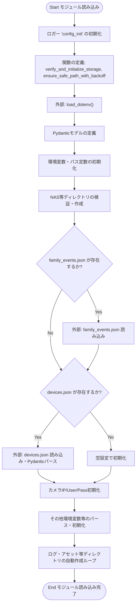
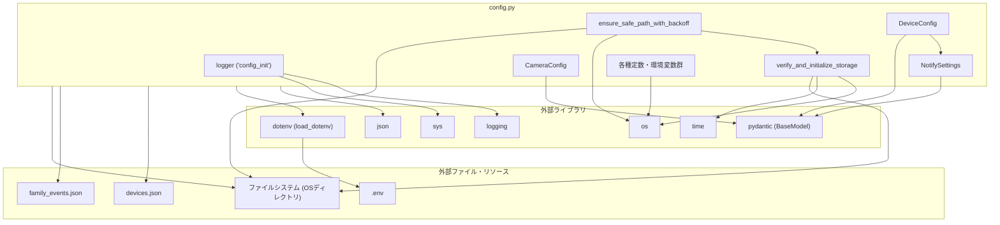

## 1. 解析メタ情報

| 項目 | 内容 |
| --- | --- |
| 対象ファイル | `config.py` |
| 言語 | Python |
| 解析対象 | 提供されたコードのみ |
| 推測・補完 | 一切なし |

## 関連ドキュメント

* [logger.md](./logger.md) - `config.BASE_DIR`, `config.DISCORD_WEBHOOK_ERROR`を参照する呼び出し元
* [database.md](./database.md) / [init_unified_db.md](./init_unified_db.md) - `config.SQLITE_DB_PATH`, `SQLITE_TABLE_*`定数群を参照する呼び出し元
* [notification_service.md](./notification_service.md) - `config.LINE_CHANNEL_ACCESS_TOKEN`, `config.DISCORD_WEBHOOK_*`を参照する呼び出し元
* [webhook_router.md](./webhook_router.md) - `config.SWITCHBOT_WEBHOOK_TOKEN`(SwitchBot Webhook共有シークレット検証)を参照する呼び出し元
* [quest_service.md](./quest_service.md) - `config.TV_UNLOCK_QUEST_IDS`(TVロック解除対象クエストID)を参照する呼び出し元
* [sound_manager.md](./sound_manager.md) - `config.SOUND_MAP`, `SOUND_DIR`, `SOUND_PLAYER_CMD`等を参照する呼び出し元
* [smart_timelapse_generator.md](./smart_timelapse_generator.md) - 解像度・しきい値・Webhook URL等の設定値を参照する呼び出し元
* [google_photos_service.md](./google_photos_service.md) - `config.GOOGLE_PHOTOS_TOKEN`, `GEMINI_API_KEY`等を参照する呼び出し元
* [financial_service.md](./financial_service.md) - 本ファイルとは対照的に`config`モジュール経由ではなく`os.getenv`を直接使用する設計(個人情報保護のため)

## 2. ファイルの概要

* システム全体の環境変数、定数、ディレクトリパスの定義と初期化を行う。
* 根拠: [環境変数読み込み処理] (行番号: 171 / 抜粋: `ENV: str = os.getenv("ENV"`)

* SwitchBot Webhookの共有シークレット検証用トークン(`SWITCHBOT_WEBHOOK_TOKEN`)を環境変数から読み込む(`routers/webhook_router.py`が参照。未設定時は検証をスキップする後方互換設計)。
* 根拠: [環境変数読み込み処理] (抜粋: `SWITCHBOT_WEBHOOK_TOKEN: Optional[str] = os.getenv("SWITCHBOT_WEBHOOK_TOKEN")`)

* ロガーの初期化設定を行う。
* 根拠: [ロガー設定処理] (行番号: 38 / 抜粋: `logger = logging.getLogger`)

* NASなどの外部ストレージのマウント遅延を考慮したディレクトリの検証、作成、書き込みテストを行う関数を提供する。
* 根拠: [ストレージ検証関数] (行番号: 40 / 抜粋: `def verify_and_initialize_stora`)

* `Pydantic`を用いてデバイスやカメラの設定スキーマを定義する。
* 根拠: [Pydanticモデル定義] (行番号: 144 / 抜粋: `class CameraConfig(BaseModel):`)

* 外部設定ファイル（`devices.json`, `family_events.json`）を読み込み、グローバル変数にパース結果を格納する。
* 根拠: [JSON読み込み処理] (行番号: 304 / 抜粋: `with open(DEVICES_JSON_PATH, `)

* ログ用、アセット用などの必須ディレクトリが存在しない場合、自動的に作成する。
* 根拠: [ディレクトリ自動作成ループ] (行番号: 567 / 抜粋: `os.makedirs(d, exist_ok=True)`)

* `FAMILY_SETTINGS["members"]` の実名キー自体は `handlers/line_handler.py` 等でのメッセージ文字列マッチングに機能的に使用されているためソース上に残しつつ、年齢などの個人情報は Git 管理対象外の `family_members.local.json` が存在すればそこから読み込んでマージする（存在しなくてもプレースホルダーのままアプリは起動できる）。
* 根拠: [家族設定のローカルオーバーライド読み込み] (行番号: 532 / 抜粋: `_family_local_path = os.path.join(os.path.dirname`)

* NVR録画・DBバックアップの保持日数（`RECORDING_RETENTION_DAYS`, `DB_BACKUP_RETENTION_DAYS`）、メモリ監視閾値（`MEMORY_ALERT_PERCENT`等）、TVロック機能に関連するクエストID（`TV_UNLOCK_QUEST_IDS`）、小児科予約監視URL（`CLINIC_MONITOR_URL`等）など、他の監視・運用系モジュールが参照する多数の設定値・閾値定数も本ファイルに定義されている。
* 根拠: [Retention / TV Lock / Clinic Monitor 各セクションの定数群] (行番号: 493 / 抜粋: `RECORDING_RETENTION_DAYS: int = int(os.getenv`)

* CORS許可オリジン(`CORS_ORIGINS`)を定義する。以前は`unified_server.py`側にも別のハードコードされたオリジンリストが存在し、実際に使われるのはそちらだけで本ファイルの値は参照されない「死に設定」だったが、Streamlitダッシュボード・LAN内開発サーバー・Cloudflare Tunnel公開ドメインを含む形でこちらに一本化された（`unified_server.py`側は本リストを直接参照するよう変更済み）。
* 根拠: [CORS許可オリジン定義] (行番号: 421 / 抜粋: `CORS_ORIGINS: List[str] = [`)

* クエスト機能のファイルアップロード(`/api/quest/upload`)におけるアップロード可能な最大ファイルサイズ(MB単位、環境変数で上書き可、既定10MB)を定義する。
* 根拠: [アップロード上限設定] (行番号: 436 / 抜粋: `UPLOAD_MAX_FILE_SIZE_MB: int = `)

* タイムラプス動画生成(`monitors/smart_timelapse_generator.py`, `monitors/scheduled_timelapse.py`)が`getattr(config, "TIMELAPSE_...", デフォルト値)`の形で参照する解像度・背景差分検出パラメータ・監視対象カメラフォルダ(`TIMELAPSE_CAMERAS`)・実行スケジュール(`TIMELAPSE_SCHEDULES`)・エンコード設定等の定数群を定義する。以前は対応する定数が本ファイルに存在せず、常にハードコードされたデフォルト値へフォールバックしていた。
* 根拠: [タイムラプス生成設定] (行番号: 450 / 抜粋: `# タイムラプス生成設定`)

## 3. 外部依存関係

### インポート一覧

| 名称 | 種類 | 用途 | 根拠 |
| --- | --- | --- | --- |
| `os` | 標準ライブラリ | 環境変数取得、パス結合、ディレクトリ作成等のOS操作 | 根拠: `import os` (行番号: 24 / 抜粋: `import os`) |
| `sys` | 標準ライブラリ | ロガーの標準出力ハンドラの設定 | 根拠: `import sys` (行番号: 25 / 抜粋: `import sys`) |
| `json` | 標準ライブラリ | 外部JSONファイルの読み込み・パース | 根拠: `import json` (行番号: 26 / 抜粋: `import json`) |
| `time` | 標準ライブラリ | リトライ時の待機（Exponential Backoff） | 根拠: `import time` (行番号: 27 / 抜粋: `import time`) |
| `logging` | 標準ライブラリ | ロガーの取得・設定およびログ出力 | 根拠: `import logging` (行番号: 28 / 抜粋: `import logging`) |
| `Optional`, `List`, `Dict`, `Any` | 標準ライブラリ(`typing`) | 型ヒントの定義 | 根拠: `from typing import Optional, L` (行番号: 29 / 抜粋: `from typing import Optional, L`) |
| `load_dotenv` | 外部ライブラリ(`dotenv`) | `.env`ファイルからの環境変数読み込み処理 | 根拠: `from dotenv import load_dotenv` (行番号: 31 / 抜粋: `from dotenv import load_dotenv`) |
| `BaseModel`, `Field`, `ValidationError` | 外部ライブラリ(`pydantic`) | データバリデーション付きのモデルクラス定義とエラー捕捉 | 根拠: `from pydantic import BaseModel` (行番号: 32 / 抜粋: `from pydantic import BaseModel`) |
| `time`(`_dt_time`という別名) | 標準ライブラリ(`datetime`) | タイムラプススケジュール(`TIMELAPSE_SCHEDULES`)の開始・終了時刻定義 | 根拠: `from datetime import time as _dt_time` (行番号: 454 / 抜粋: `from datetime import time as _`) |

### ブラックボックスとなる外部要素

| 名称 | 理由 | 根拠 |
| --- | --- | --- |
| `.env`ファイル | 外部ファイルであり、実行時の環境変数の実際の内容がコードから読み取れないため。 | 根拠: `load_dotenv()` (行番号: 139 / 抜粋: `load_dotenv()`) |
| `devices.json` | システムに接続されるカメラやモニター等のデバイス設定情報を持つ外部ファイルであり、具体的な内容が不明なため。 | 根拠: `with open(DEVICES_JSON_PATH, ` (行番号: 304 / 抜粋: `with open(DEVICES_JSON_PATH, `) |
| `family_events.json` | 家族の記念日・イベント設定情報を持つ外部ファイルであり、具体的な内容が不明なため。 | 根拠: `with open(_events_path, "r", ` (行番号: 285 / 抜粋: `with open(_events_path, "r", `) |
| `family_members.local.json` | Git管理対象外(gitignore)の外部ファイルであり、`FAMILY_SETTINGS["styles"]` の年齢等の実データがどのような値・構造で上書きされるか不明なため。 | 根拠: `# family_members.local.json (gitignore対象) から読み込み、` (行番号: 518 / 抜粋: `family_members.local.json`) |
| `Pydantic`の内部実装 | 外部ライブラリであり、バリデーションの厳密な挙動（例：エイリアスやデフォルトファクトリの処理詳細）は提供コードから読み取れないため。 | 根拠: `class CameraConfig(BaseModel):` (行番号: 144 / 抜粋: `class CameraConfig(BaseModel):`) |

## 4. 主要要素の定義（関数 / エンドポイント / コンポーネント）

### `verify_and_initialize_storage`

* **役割**: 指定されたパスのディレクトリ作成と書き込みテストを、指定回数リトライ（Exponential Backoff）しながら実行する。
* 根拠: [関数定義] (行番号: 40 / 抜粋: `def verify_and_initialize_stora`)

* **引数/リクエスト**: `base_path` (str: 確認対象ディレクトリ), `max_retries` (int: 最大リトライ回数。デフォルトは5)
* 根拠: [引数定義] (行番号: 40 / 抜粋: `base_path: str, max_retries: i`)

* **戻り値/レスポンス**: `bool` (初期化・テスト成功でTrue、最終的に失敗でFalse)
* 根拠: [戻り値型ヒント] (行番号: 40 / 抜粋: `-> bool:`)

* **副作用**: ディレクトリの作成(`os.makedirs`)、一時ファイル(`.write_test`)の作成・削除。
* 根拠: [ディレクトリ・ファイル操作] (行番号: 58 / 抜粋: `os.makedirs(base_path, exist_o`)

* **エラーハンドリング**: `OSError`, `PermissionError`, `IOError`をキャッチし、リトライ上限未満なら待機、上限到達時はエラーログを出力しFalseを返す。
* 根拠: [例外捕捉] (行番号: 73 / 抜粋: `except (OSError, PermissionErr`)

### `ensure_safe_path_with_backoff`

* **役割**: `verify_and_initialize_storage`を呼び出してパスを検証し、失敗した場合はローカルのフォールバックディレクトリを作成して返す。
* 根拠: [関数定義] (行番号: 98〜102 / 抜粋: `def ensure_safe_path_with_back`)

* **引数/リクエスト**: `preferred_path` (str: 本来の保存パス), `fallback_name` (str: フォールバック時ディレクトリ名), `max_retries` (int: 最大リトライ回数。デフォルト5)
* 根拠: [引数定義] (行番号: 99 / 抜粋: `preferred_path: str, `)

* **戻り値/レスポンス**: `str` (安全な書き込みパス)
* 根拠: [戻り値型ヒント] (行番号: 102 / 抜粋: `-> str:`)

* **副作用**: `verify_and_initialize_storage`の副作用に加え、フォールバックディレクトリの作成(`os.makedirs`)。
* 根拠: [フォールバック作成] (行番号: 127 / 抜粋: `os.makedirs(fallback_path, exi`)

* **エラーハンドリング**: フォールバックディレクトリ作成時の`Exception`をキャッチし、エラーログを出力して`preferred_path`を返す。
* 根拠: [例外捕捉] (行番号: 133 / 抜粋: `except Exception as fatal_e:`)

### `CameraConfig`

* **役割**: カメラ設定のデータ構造とバリデーションを定義するPydanticモデル。
* 根拠: [クラス定義] (行番号: 144〜154 / 抜粋: `class CameraConfig(BaseModel):`)

* **引数/リクエスト**: なし（Pydanticによるインスタンス化時に属性を受け取る）
* 根拠: [クラス定義] (行番号: 144〜154 / 抜粋: `class CameraConfig(BaseModel):`)

* **戻り値/レスポンス**: 該当なし
* 根拠: [クラス定義] (行番号: 144〜154 / 抜粋: `class CameraConfig(BaseModel):`)

* **副作用**: なし
* 根拠: [クラス定義] (行番号: 144〜154 / 抜粋: `class CameraConfig(BaseModel):`)

* **エラーハンドリング**: Pydanticの機能に依存するバリデーションエラー(`ValidationError`)。
* 根拠: [Pydanticの継承] (行番号: 144〜154 / 抜粋: `class CameraConfig(BaseModel):`)

### `NotifySettings`

* **役割**: 通知設定のデータ構造とバリデーションを定義するPydanticモデル。
* 根拠: [クラス定義] (行番号: 156〜159 / 抜粋: `class NotifySettings(BaseModel`)

* **引数/リクエスト**: なし（Pydanticによるインスタンス化時に属性を受け取る）
* 根拠: [クラス定義] (行番号: 156〜159 / 抜粋: `class NotifySettings(BaseModel`)

* **戻り値/レスポンス**: 該当なし
* 根拠: [クラス定義] (行番号: 156〜159 / 抜粋: `class NotifySettings(BaseModel`)

* **副作用**: なし
* 根拠: [クラス定義] (行番号: 156〜159 / 抜粋: `class NotifySettings(BaseModel`)

* **エラーハンドリング**: Pydanticの機能に依存するバリデーションエラー(`ValidationError`)。
* 根拠: [Pydanticの継承] (行番号: 156〜159 / 抜粋: `class NotifySettings(BaseModel`)

### `DeviceConfig`

* **役割**: デバイス設定のデータ構造とバリデーションを定義するPydanticモデル。
* 根拠: [クラス定義] (行番号: 161〜166 / 抜粋: `class DeviceConfig(BaseModel):`)

* **引数/リクエスト**: なし（Pydanticによるインスタンス化時に属性を受け取る）
* 根拠: [クラス定義] (行番号: 161〜166 / 抜粋: `class DeviceConfig(BaseModel):`)

* **戻り値/レスポンス**: 該当なし
* 根拠: [クラス定義] (行番号: 161〜166 / 抜粋: `class DeviceConfig(BaseModel):`)

* **副作用**: なし
* 根拠: [クラス定義] (行番号: 161〜166 / 抜粋: `class DeviceConfig(BaseModel):`)

* **エラーハンドリング**: Pydanticの機能に依存するバリデーションエラー(`ValidationError`)。
* 根拠: [Pydanticの継承] (行番号: 161〜166 / 抜粋: `class DeviceConfig(BaseModel):`)

## 5. 処理フロー図

```mermaid
flowchart TD
    Start(["Start モジュール読み込み"]) --> SetupLogger["ロガー 'config_init' の初期化"]
    SetupLogger --> DefFuncs["関数の定義: verify_and_initialize_storage, ensure_safe_path_with_backoff"]
    DefFuncs --> LoadDotenv["外部: load_dotenv()"]
    LoadDotenv --> DefModels["Pydanticモデルの定義"]
    DefModels --> LoadEnvVars["環境変数・パス定数の初期化"]
    LoadEnvVars --> CheckNAS["NAS等ディレクトリの検証・作成"]
    
    CheckNAS --> LoadFamilyEvents{"family_events.json が存在するか?"}
    LoadFamilyEvents -- Yes --> ReadEvents["外部: family_events.json 読み込み"]
    LoadFamilyEvents -- No --> LoadDevicesJson
    ReadEvents --> LoadDevicesJson
    
    LoadDevicesJson{"devices.json が存在するか?"}
    LoadDevicesJson -- Yes --> ReadDevices["外部: devices.json 読み込み・Pydanticパース"]
    ReadDevices --> InitCameraVars["カメラIP/User/Pass初期化"]
    LoadDevicesJson -- No --> EmptyDeviceConfig["空設定で初期化"]
    EmptyDeviceConfig --> InitCameraVars
    
    InitCameraVars --> ParseOtherVars["その他環境変数等のパース・初期化"]
    ParseOtherVars --> EnsureDirs["ログ・アセット等ディレクトリの自動作成ループ"]
    EnsureDirs --> End(["End モジュール読み込み完了"])

```

## 6. 依存関係図

```mermaid
flowchart TD
    subgraph SubConfig["config.py"]
        logger["logger ('config_init')"]
        verify_and_initialize_storage
        ensure_safe_path_with_backoff
        CameraConfig
        NotifySettings
        DeviceConfig
        EnvVars["各種定数・環境変数群"]
    end

    subgraph SubExtLibs["外部ライブラリ"]
        os
        sys
        json
        time
        logging
        dotenv["dotenv (load_dotenv)"]
        pydantic["pydantic (BaseModel)"]
    end

    subgraph SubResources["外部ファイル・リソース"]
        env_file[".env"]
        devices_json["devices.json"]
        family_events_json["family_events.json"]
        file_system["ファイルシステム (OSディレクトリ)"]
    end

    %% config.py内の依存関係
    ensure_safe_path_with_backoff --> verify_and_initialize_storage
    DeviceConfig --> NotifySettings
    
    %% 外部ライブラリへの依存
    verify_and_initialize_storage --> os
    verify_and_initialize_storage --> time
    logger --> logging
    logger --> sys
    ensure_safe_path_with_backoff --> os
    EnvVars --> os
    SubConfig --> json
    SubConfig --> dotenv
    CameraConfig --> pydantic
    NotifySettings --> pydantic
    DeviceConfig --> pydantic

    %% 外部リソースへの依存
    dotenv --> env_file
    SubConfig --> devices_json
    SubConfig --> family_events_json
    verify_and_initialize_storage --> file_system
    ensure_safe_path_with_backoff --> file_system
    SubConfig --> file_system

```

## 7. 次のステップ（リバースエンジニアリングの提案）

| 優先度 | ファイル名(推測可) | 理由 | 根拠 |
| --- | --- | --- | --- |
| 高 | `devices.json` | 各種デバイス（カメラ・モニター等）の具体的な設定や台数が記載されており、システムの実態を把握するために必須。 | 根拠: `DEVICES_JSON_PATH: str = os.` (行番号: 234 / 抜粋: `DEVICES_JSON_PATH: str = os.`) |
| 中 | DBアクセス関連ファイル (例: `database.py` や `models.py`) | `SQLITE_TABLE_SENSOR`など多数のテーブル名定数が定義されており、実際のスキーマやデータ操作ロジックを解析する必要がある。 | 根拠: `SQLITE_TABLE_SENSOR: str = ` (行番号: 237 / 抜粋: `SQLITE_TABLE_SENSOR: str = `) |
| 中 | APIクライアント実装 (例: `switchbot.py`, `nature_remo.py`) | SwitchBotやNature RemoのAPIトークンが定義されており、これらを利用する外部通信ロジックを特定するため。 | 根拠: `SWITCHBOT_API_TOKEN: Optiona` (行番号: 179 / 抜粋: `SWITCHBOT_API_TOKEN: Optiona`) |
| 低 | 通知処理の実装 (例: `notifier.py` や `discord.py`) | Discord WebhookやLINEのトークンが定義されており、各種通知がいつ・どのような条件で発火するかを確認するため。 | 根拠: `DISCORD_WEBHOOK_NOTIFY: Opti` (行番号: 199 / 抜粋: `DISCORD_WEBHOOK_NOTIFY: Opti`) |

## 8. 保守上の注意点

* モジュールロード時にファイルI/O（ディレクトリ作成・テストファイルの書き込み）や`time.sleep`を伴う処理（`verify_and_initialize_storage`）が実行されるため、マウント失敗時などはインポート自体に最大で数秒〜数十秒の遅延が発生する可能性がある。
* `fallback_path`を作成する際のフェイルセーフで例外が発生した場合、エラーログを出力しつつ元の`preferred_path`を返す仕様になっているため、後続の処理で書き込みエラー(`PermissionError`等)が誘発される可能性がある。
* モジュールロード時に外部の`devices.json`や`family_events.json`を読み込む仕様であり、JSONの構文エラーが発生した場合は例外をキャッチして警告を出すが、設定は空のまま処理が続行される。
* メモリ使用率やストレージ等の警告通知に関連する定数（例：`MEMORY_ALERT_PERCENT`）が存在するが、このファイル単体では監視機構そのものは実装されていない。
* `TV_UNLOCK_QUEST_IDS` は環境変数のカンマ区切り文字列から数字のみを抽出して`int`変換しており、`isdigit()`を満たさない値（不正なID等）は例外を送出せず黙って除外される仕様のため、設定ミスに気づきにくい。
* `FAMILY_SETTINGS["members"]` の実名文字列自体は他モジュール（`handlers/line_handler.py`等）のメッセージマッチングロジックと結合しているため、この値を変更すると気づきにくい形で機能が壊れるリスクがある。年齢等の付随情報のみ`family_members.local.json`（gitignore対象）に切り出す設計になっている。

## 9. 不明事項一覧

| 項目 | 理由 | 必要なファイル |
| --- | --- | --- |
| `devices.json` の全体スキーマ | Pydanticモデルで一部定義されているが、実際のJSON構造や、設定されているデバイスの種類・台数が不明であるため。（リポジトリ内を`devices.json`で検索したが実体ファイルは存在せず、解消不可。`.gitignore`の`*.json`規則により追跡対象外と判明） | `devices.json` |
| 各種APIの利用箇所とエンドポイント | SwitchBot、Nature Remo、LINE、Discord、Gemini等のキーが定義されているが、実際にどう通信しているかが不明であるため。 | API通信を行う各種Pythonモジュール |
| Pydanticバリデーションエラー時のシステムの挙動 | `devices.json`のバリデーションエラーをキャッチしログを出力しているが、その後のシステム全体への影響が不明であるため。 | `config.py`をインポートするメインの実行ファイル |
| 各テーブルの詳細なスキーマ定義 | テーブル名の文字列が定義されているのみで、カラム構成やリレーションが不明であるため。 | データベース操作を行うモジュール |
| `family_members.local.json` の具体的な内容・スキーマ | Git管理対象外であり、実際にどの家族の年齢・表示情報がどう格納されているか本ファイルからは判別できないため。 | `family_members.local.json`（gitignore対象。`family_members.local.json.example`が参考になる可能性） |
| `TV_UNLOCK_QUEST_IDS` が参照するクエストの実体 | クエストIDのリストのみが定義されており、対応するクエスト定義やTVロック解除の実処理は別ファイルにあるため。 | クエスト機能・TVロック機能を実装するモジュール |

## 相互参照による補足情報

| 元の不明事項 | 判明した内容 | 参照元ドキュメント |
| --- | --- | --- |
| `devices.json` の全体スキーマ | 実体の`devices.json`はリポジトリ内を検索したが存在せず(`.gitignore`66行目の`*.json`規則により追跡対象外、ランタイム生成ファイル)、実データそのものの解消はできなかった。ただし期待されるスキーマは`config.py`のPydanticモデルから直接確認できる。`CameraConfig`(144〜154行目)は`id, name, nas_folder(任意), location, ip, port(既定2020), user(任意), password(エイリアス"pass", 任意), rtsp_url(任意), enabled(既定True。E-3でカメラのライブ/録画表示のON・OFF永続化用に追加)`を持ち、`DeviceConfig`(161〜166行目)は`id, type, location, name, notify_settings(NotifySettings, default_factory)`を持つ(`NotifySettings`は156〜159行目で`power_threshold_watts, notify_mode(既定"LOG_ONLY"), target`)。`config.py`306〜309行目より、`devices.json`のトップレベルは`{"cameras": [...], "monitor_devices": [...]}`という2キー構造であることも確認した。下流では`routers/camera_router.py`35〜36行目が`cam["id"]`/`cam["name"]`を、`services/analysis_service.py`75〜76行目が`d["id"]`/`d.get("name")`/`d.get("location")`を実際に参照している。 | 直接ソース確認: `MY_HOME_SYSTEM/config.py:144-166, 302-315`（参考: `MY_HOME_SYSTEM/routers/camera_router.py:33-36`, `MY_HOME_SYSTEM/services/analysis_service.py:75-76`） |
| 各種APIの利用箇所とエンドポイント | 5種のAPIについて、`config`定数を実際に参照する箇所を直接確認した。(1) SwitchBot: `services/switchbot_service.py`の`send_device_command(device_id, command, parameter="default", command_type="command")`(58〜60行目)が`config.SWITCHBOT_API_HOST`(`https://api.switch-bot.com`)を使って`{HOST}/v1.1/devices/{device_id}/commands`へPOSTし、`create_switchbot_auth_headers()`(78〜81行目)が`config.SWITCHBOT_API_TOKEN`/`SWITCHBOT_API_SECRET`から認証ヘッダーを生成する。(2) Nature Remo: `monitors/nature_remo_monitor.py`の`main()`(146〜148行目)が伊丹=`config.NATURE_REMO_ACCESS_TOKEN`、高砂=`config.NATURE_REMO_ACCESS_TOKEN_TAKASAGO`のトークンをそれぞれ`process_location(loc, token)`に渡す。(3) LINE: `services/notification_service.py`27〜28行目で`config.LINE_CHANNEL_ACCESS_TOKEN`をLINE Messaging API v3の`Configuration(access_token=...)`に設定する。(4) Discord: 同ファイル30〜37行目の`_send_discord_webhook(messages, image_data=None, channel="notify", filename="snapshot.jpg")`が`channel`引数(`"error"`/`"report"`/既定`"notify"`)に応じて`config.DISCORD_WEBHOOK_ERROR`/`DISCORD_WEBHOOK_REPORT`/`DISCORD_WEBHOOK_NOTIFY or DISCORD_WEBHOOK_URL`のいずれかへ`requests.post`する。(5) Gemini: `services/ai_service.py`34〜35行目で`config.GEMINI_API_KEY`が設定されていれば`genai.configure(api_key=...)`しモデル名`gemini-2.0-flash`を使用、未設定時は39〜40行目でAI機能を無効化する。加えて`tools/google_photos_service.py`31〜71行目は`config.GOOGLE_PHOTOS_TOKEN`(認証トークンファイルパス)と`config.GOOGLE_PHOTOS_CREDENTIALS`(OAuthクライアント資格情報パス)をGoogle Photos Library APIの認証フローに使用している。 | 直接ソース確認: `MY_HOME_SYSTEM/services/switchbot_service.py:58-81`, `MY_HOME_SYSTEM/monitors/nature_remo_monitor.py:146-148`, `MY_HOME_SYSTEM/services/notification_service.py:27-37`, `MY_HOME_SYSTEM/services/ai_service.py:34-40`, `MY_HOME_SYSTEM/tools/google_photos_service.py:31-71` |
| Pydanticバリデーションエラー時のシステムの挙動 | `config.py`302〜315行目で`devices.json`のパースを`try`し、`except ValidationError as ve:`(310〜311行目)は`logger.error`でログ出力するのみで例外を再送出せず、`CAMERAS`/`MONITOR_DEVICES`は299〜300行目で初期化された空リスト`[]`のままモジュールのロード自体は正常に完了する。呼び出し元の`unified_server.py`は27行目で`import config`しているのみで、この種のエラーに対する特別なハンドリングは行っていない(エラー処理は`config.py`内で完結している)。下流の消費側も直接確認した: `routers/camera_router.py`28〜40行目の`GET /settings`は`config.CAMERAS`が空でも例外を出さず空配列`[]`を返し、42〜47行目の`GET /live/{camera_id}/stream.m3u8`は該当カメラが見つからないため`HTTPException(status_code=404, detail="Camera not found")`を送出する。`monitors/switchbot_power_monitor.py`132行目も`config.MONITOR_DEVICES`が空の場合は警告ログ(`"⚠️ No devices found in config.MONITOR_DEVICES."`)を出すのみで処理を継続する設計であることを確認した。 | 直接ソース確認: `MY_HOME_SYSTEM/config.py:298-315`, `MY_HOME_SYSTEM/unified_server.py:27`, `MY_HOME_SYSTEM/routers/camera_router.py:28-47`, `MY_HOME_SYSTEM/monitors/switchbot_power_monitor.py:132` |
| 各テーブルの詳細なスキーマ定義 | `init_unified_db.py`を直接確認した。`config.SQLITE_TABLE_DAILY_LOGS`(実体は`"daily_logs"`、config.py 240行目)は122〜130行目の`CREATE TABLE IF NOT EXISTS`文で`id, user_id, category TEXT NOT NULL, detail, timestamp DATETIME NOT NULL`列を持つ。`config.SQLITE_TABLE_SWITCHBOT_LOGS`(`"switchbot_meter_logs"`)は133〜142行目で`id, device_id, device_name, temperature REAL, humidity REAL, timestamp`列。`config.SQLITE_TABLE_POWER_USAGE`(`"power_usage"`)は145〜153行目で`id, device_id, device_name, wattage REAL, timestamp`列。さらに11〜29行目の`validate_schema_integrity(conn)`関数が、これら`config.SQLITE_TABLE_*`定数を含む主要テーブル群について`PRAGMA table_info(table)`で必須カラムの存在を検証する仕組みを持つことを確認した。また`core/migrations.py`49〜75行目の`apply_pending_migrations(conn)`は`migrations/`配下の`*.sql`ファイルをファイル名昇順で適用し、適用済みバージョンを`schema_migrations`テーブル(28〜34行目で`CREATE TABLE IF NOT EXISTS`定義)で追跡する、`init_unified_db.py`の初期スキーマ作成とは別系統のバージョン管理されたマイグレーション機構であることを確認した。 | 直接ソース確認: `MY_HOME_SYSTEM/init_unified_db.py:11-29, 121-153`, `MY_HOME_SYSTEM/core/migrations.py:28-75` |
| `family_members.local.json` の具体的な内容・スキーマ | 実体の`family_members.local.json`はリポジトリ内に存在しない(`.gitignore`69行目の`*.local.json`規則により追跡対象外)が、サンプルファイル`MY_HOME_SYSTEM/family_members.local.json.example`(全4行)を直接確認した。内容は`{"智矢": {"age": "X歳"}, "涼花": {"age": "X歳"}, "将博": {"age": "X歳"}, "春菜": {"age": "X歳"}}`という、`FAMILY_SETTINGS["members"]`の実名文字列をキーとし値に`{"age": ...}`形式の辞書を持つフラットな構造であることが判明した。この構造は`config.py`533〜541行目の読み込みロジック(`for _name, _overrides in _family_local_overrides.items(): if _name in FAMILY_SETTINGS["styles"] ...: FAMILY_SETTINGS["styles"][_name].update(_overrides)`)が期待する形式と一致し、`styles`内の実名キーと一致すれば`age`等のキーのみが上書きされる設計であることを確認した。 | 直接ソース確認: `MY_HOME_SYSTEM/family_members.local.json.example`, `MY_HOME_SYSTEM/config.py:533-541` |
| `TV_UNLOCK_QUEST_IDS` が参照するクエストの実体 | `MY_HOME_SYSTEM/services/quest_service.py`を直接確認した。343行目で`quest['quest_id'] in config.TV_UNLOCK_QUEST_IDS and config.TV_PLUG_DEVICE_ID`かつ`user['role'] == ROLE_CHILD`の場合に345行目で`self._trigger_tv_unlock(quest['quest_id'])`を呼び出す。`_trigger_tv_unlock(self, quest_id: int)`(365〜389行目)は`threading.Thread(target=unlock_task, daemon=True)`でバックグラウンド実行し、`switchbot_service.send_device_command(config.TV_PLUG_DEVICE_ID, "turnOn")`(373行目)を呼び出す。レスポンスの`statusCode`が100なら成功ログを出力し、それ以外またはAPI呼び出しで例外発生時は、`config.LINE_PARENTS_GROUP_ID`が設定されていれば`notification_service.send_push`で「⚠️ テレビの電源ON(自動ロック解除)に失敗しました。お手数ですが、SwitchBotアプリ等から手動でつけてあげてください。」という親グループ向けフェイルソフト通知を送る(378〜386行目)。ただし対応する具体的なクエストID・クエスト定義自体(`quest_master`テーブルの実データ)は`quest_service.py`単体からは確認できなかった。 | 直接ソース確認: `MY_HOME_SYSTEM/services/quest_service.py:342-389` |

## 10. 自己検証結果

* [x] 推測・外部ファイルの仕様を一切含んでいない （完了）
* [x] 全関数・全クラス・全コンポーネントを列挙した （完了）
* [x] 全てのインポート要素を列挙した （完了）
* [x] すべての仕様説明に「根拠（行番号・抜粋）」を明記した （完了）
* [x] 根拠漏れが0件である （完了）
* [x] Mermaid構文にエラーの原因となる記号（エスケープ漏れ）がない （完了）
* [x] 不明事項を漏れなく列挙した （完了）