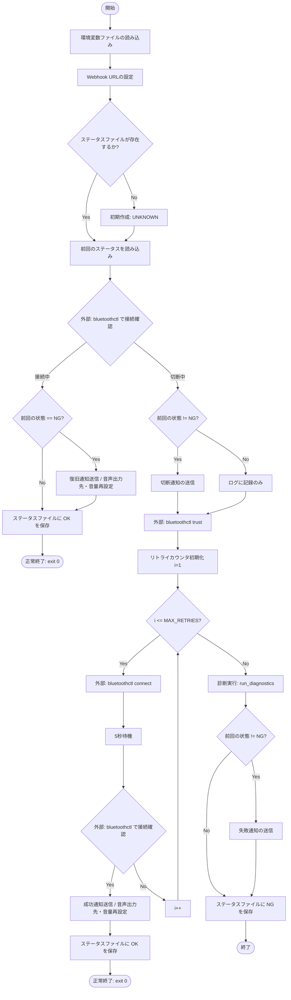
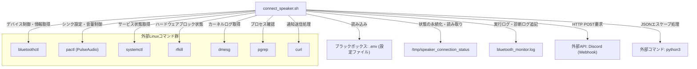

## 1. 解析メタ情報

| 項目 | 内容 |
| --- | --- |
| 対象ファイル | connect_speaker.sh |
| 言語 | Bash (Shell Script) |
| 解析対象 | 提供されたコードのみ |
| 推測・補完 | 一切なし |

## 2. ファイルの概要

* 指定されたMACアドレスのBluetoothスピーカーの接続状態を監視し、切断状態であれば自動で再接続（最大3回）を試みる。
* 接続状態の変化（復旧、切断検知、再接続成功、失敗）に応じて、ログファイルへの記録とDiscordのWebhookを利用した通知を行う。
* 再接続にすべて失敗した場合は、自動調査機能としてシステムのBluetoothおよびオーディオ関連のステータスを取得しログに残す。

## 3. 外部依存関係

### インポート一覧

| 名称 | 種類 | 用途 | 根拠 |
| --- | --- | --- | --- |
| `$ENV_FILE` (.env) | 環境変数読み込み | DiscordのWebhook通知先URLを取得するため | 環境変数読み込みブロック (行番号: 16〜20 / 抜粋: `source "$ENV_FILE"`) |

### ブラックボックスとなる外部要素

| 名称 | 理由 | 根拠 |
| --- | --- | --- |
| `.env` の内容 | スクリプト外で定義されており、具体的なURLや他の設定値が存在するかどうか不明なため | 変数定義と読み込み (行番号: 8, 18 / 抜粋: `ENV_FILE="$PROJECT_DIR/.env"`) |
| Discord API (Webhook) | 外部のAPIであり、リクエスト成功後の詳細な振る舞いやAPI仕様（レートリミット等）が不明なため | `send_discord`関数 (行番号: 41〜44 / 抜粋: `curl -H "Content-Type: applic...`) |
| 各種Linuxコマンド | `bluetoothctl`, `pactl`, `rfkill`, `systemctl`等は外部コマンドであり、内部の実装やOS環境による挙動の違いは判断不可なため | `run_diagnostics`関数等 (行番号: 53, 59, 65 / 抜粋: `bluetoothctl info "$MAC"`) |

## 4. 主要要素の定義（関数 / エンドポイント / コンポーネント）

### `log_message`

* **役割**: 実行時のタイムスタンプを付与して、指定されたメッセージをログファイルに出力する
* 根拠: `log_message` (行番号: 28〜30 / 抜粋: `echo "$(date '+%Y-%m-%d...`)

* **引数/リクエスト**: 文字列（ログに出力するメッセージ内容）
* 根拠: 関数内の引数参照 (行番号: 29〜29 / 抜粋: `... - $1" >> "$LOGFILE"`)

* **戻り値/レスポンス**: なし
* 根拠: `log_message`関数定義 (行番号: 28〜30 / 抜粋: `log_message() { ... }`)

* **副作用**: ファイル (`$LOGFILE`) への追記書き込み
* 根拠: リダイレクト処理 (行番号: 29〜29 / 抜粋: `>> "$LOGFILE"`)

* **エラーハンドリング**: なし
* 根拠: `log_message`関数定義 (行番号: 28〜30 / 抜粋: `log_message() { ... }`)

### `send_discord`

* **役割**: メッセージを簡易JSONエスケープし、`$WEBHOOK_URL`が設定されている場合にDiscordへHTTP POSTリクエストを送信する
* 根拠: `send_discord` (行番号: 32〜46 / 抜粋: `curl -H "Content-Type: applic...`)

* **引数/リクエスト**: 文字列（Discordへ送信する通知メッセージ）
* 根拠: 関数内の変数代入 (行番号: 33〜33 / 抜粋: `local message="$1"`)

* **戻り値/レスポンス**: なし
* 根拠: `send_discord`関数定義 (行番号: 32〜46 / 抜粋: `send_discord() { ... }`)

* **副作用**: 外部API（Discord Webhook）への通信、Python3によるサブプロセスの実行
* 根拠: コマンド実行 (行番号: 37〜44 / 抜粋: `escaped_message=$(python3 -c...`)

* **エラーハンドリング**: `$WEBHOOK_URL`が空の場合は送信をスキップする。また、`curl`実行時の標準出力と標準エラー出力を破棄し、エラーでスクリプトが停止しないようにしている。
* 根拠: 条件分岐・リダイレクト (行番号: 35, 44 / 抜粋: `if [ -n "$WEBHOOK_URL" ]; then`, `>/dev/null 2>&1`)

### `run_diagnostics`

* **役割**: システムのBluetoothサービス状態、RFKill状態、デバイス情報、カーネルログ、PulseAudioシンクおよびプロセス情報を取得し、ログファイルへ追記する
* 根拠: `run_diagnostics` (行番号: 49〜71 / 抜粋: `systemctl status bluetooth ...`)

* **引数/リクエスト**: なし
* 根拠: `run_diagnostics`関数定義 (行番号: 49〜71 / 抜粋: `run_diagnostics() { ... }`)

* **戻り値/レスポンス**: なし
* 根拠: `run_diagnostics`関数定義 (行番号: 49〜71 / 抜粋: `run_diagnostics() { ... }`)

* **副作用**: 各種システムコマンド（`systemctl`, `rfkill`, `bluetoothctl`, `dmesg`, `pactl`, `pgrep`）の実行、およびログファイルへの一括書き込み
* 根拠: ブロックリダイレクト (行番号: 51〜69 / 抜粋: `} >> "$LOGFILE" 2>&1`)

* **エラーハンドリング**: ブロック全体の標準エラー出力を標準出力に統合してファイルに書き込むことで、各コマンドの実行エラー情報もログに残るようにしている。
* 根拠: ブロックリダイレクト (行番号: 69〜69 / 抜粋: `} >> "$LOGFILE" 2>&1`)

## 5. 処理フロー図

## 6. 依存関係図

## 7. 次のステップ（リバースエンジニアリングの提案）

| 優先度 | ファイル名(推測可) | 理由 | 根拠 |
| --- | --- | --- | --- |
| 高 | `.env` | Discord Webhookへの通知先URLなど、システム動作の成否に直結する重要な環境変数の実態を確認するため。 | 環境変数読み込み処理 (行番号: 8, 16〜20 / 抜粋: `ENV_FILE="$PROJECT_DIR/.env"`) |
| 中 | `crontab` 設定、または `systemd` のサービス/タイマーファイル | 本スクリプト内に無限ループ等の常駐処理が存在しないため、どのようなトリガー（定期実行、システム起動時など）で本スクリプトが起動されているか全容を把握するため。 | 実行タイミングを制御する記述がファイル内に存在しないため (行番号取得不可 / 抜粋: 該当なし) |

## 8. 保守上の注意点

* `/tmp/speaker_connection_status` ファイルを利用して前回の状態を保持しているため、OSの再起動を行うとファイルが消失し、初回実行時は必ず `UNKNOWN` 状態から評価が開始される仕様となっている。
* 通知メッセージのエスケープ処理に `python3` のワンライナーを使用しているため、実行環境に Python3 がインストールされていない場合、構文エラーが発生し通知内容が破損・未送信になる可能性がある。
* `send_discord` 関数内の `curl` コマンドで標準出力・標準エラー出力を `/dev/null` にリダイレクトしているため、ネットワークエラーやDiscord側のAPI仕様変更（400番台エラー等）による送信失敗時にエラーログが一切残らない。
* リトライ時の接続待機時間が `sleep 5` と固定されているため、ハードウェアやBluetoothスタックの応答遅延によっては、接続が完了しているにもかかわらずタイムアウト判定を受けるリスクがある。

## 9. 不明事項一覧

| 項目 | 理由 | 必要なファイル |
| --- | --- | --- |
| スクリプトの実行契機（トリガー） | ファイル単体にループ処理等の常駐機能が含まれておらず、実行元が把握できないため。 | `crontab`、`systemd` ユニットファイル等の実行スケジュール定義 |
| Webhook URLの実際の設定内容と使い分け | `DISCORD_WEBHOOK_ERROR` と `DISCORD_WEBHOOK_NOTIFY` が変数として参照されているが、それぞれの具体的なURLや、利用環境における使い分けの意図が外部依存のため。 | `/home/masahiro/develop/MY_HOME_SYSTEM/.env` |
| `bluetoothctl trust` の影響範囲 | MACアドレスの信頼設定を行っているが、これが実行環境のBluetoothデーモン設定にどのように永続化・影響を及ぼしているか確認できないため。 | `/var/lib/bluetooth/` 配下のデバイス設定ファイル等 |

## 10. 自己検証結果

* [x] 推測・外部ファイルの仕様を一切含んでいない
* [x] 全関数・全クラス・全コンポーネントを列挙した
* [x] 全てのインポート要素を列挙した
* [x] すべての仕様説明に「根拠（行番号・抜粋）」を明記した
* [x] 根拠漏れが0件である
* [x] Mermaid構文にエラーの原因となる記号（エスケープ漏れ）がない
* [x] 不明事項を漏れなく列挙した

完了