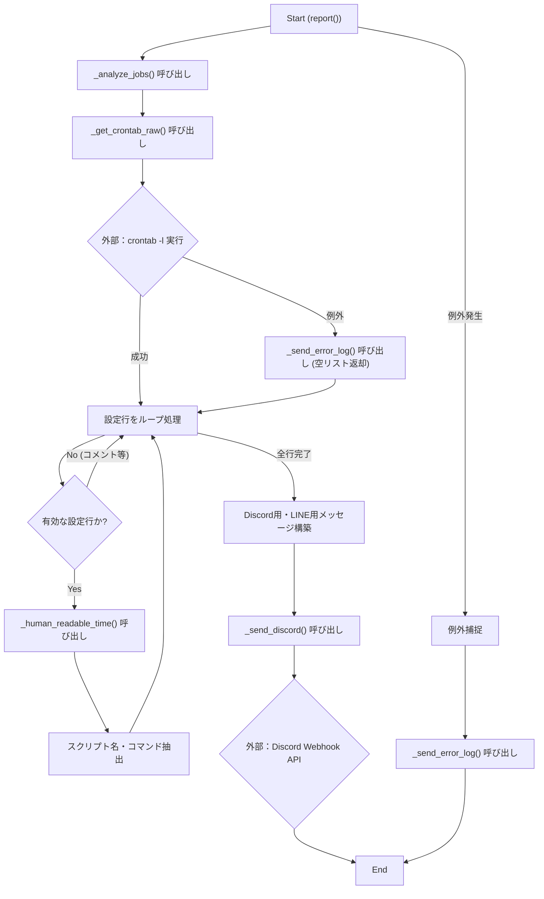
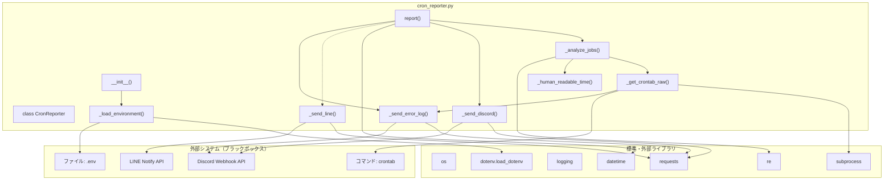

## 1. 解析メタ情報

| 項目 | 内容 |
| --- | --- |
| 対象ファイル | `cron_reporter.py` |
| 言語 | Python |
| 解析対象 | 提供されたコードのみ |
| 推測・補完 | 一切なし |

## 2. ファイルの概要

* 現在のCrontab設定を解析し、分かりやすい日本語レポートとしてLINEおよびDiscordに送信する。
* 根拠: クラス `CronReporter` のドキュメントストリング (行番号取得不可 / 抜粋: "現在のCrontab設定を解析し、分かりやすい日本語レポー...")

## 3. 外部依存関係

### インポート一覧

| 名称 | 種類 | 用途 | 根拠 |
| --- | --- | --- | --- |
| `os` | 標準ライブラリ | パス操作や環境変数の取得 | `import os` (行番号取得不可 / 抜粋: "import os") |
| `subprocess` | 標準ライブラリ | `crontab -l`コマンドの実行 | `import subprocess` (行番号取得不可 / 抜粋: "import subprocess") |
| `logging` | 標準ライブラリ | ログ出力 | `import logging` (行番号取得不可 / 抜粋: "import logging") |
| `requests` | 外部ライブラリ | DiscordおよびLINEへのHTTPリクエスト送信 | `import requests` (行番号取得不可 / 抜粋: "import requests") |
| `re` | 標準ライブラリ | 正規表現によるスクリプト名抽出 | `import re` (行番号取得不可 / 抜粋: "import re") |
| `datetime` | 標準ライブラリ | 現在時刻の取得 | `from datetime import datetime` (行番号取得不可 / 抜粋: "from datetime import datetime") |
| `load_dotenv` | 外部ライブラリ(`dotenv`) | `.env`ファイルからの環境変数読み込み | `from dotenv import load_dotenv` (行番号取得不可 / 抜粋: "from dotenv import load_dotenv") |

### ブラックボックスとなる外部要素

| 名称 | 理由 | 根拠 |
| --- | --- | --- |
| `crontabコマンド` | OSに設定されたCronジョブを管理するコマンドであり、出力フォーマットや実行可否は実行環境(OS)に依存するため | `subprocess.run(['crontab', '-l']...` (行番号取得不可 / 抜粋: "subprocess.run(['crontab', '-l'") |
| `Discord Webhook API` | 外部APIであり、通信先の仕様やレスポンス内容は本コード外で定義されているため | `requests.post(self.discord_webhook...)` (行番号取得不可 / 抜粋: "res = requests.post(") |
| `LINE Notify API` | 外部APIであり、通信先の仕様やレスポンス内容は本コード外で定義されているため | `requests.post(url, headers...)` (行番号取得不可 / 抜粋: "res = requests.post(") |
| `.envファイル` | 環境変数が定義されたファイルであり、ファイルの実体や内容は本コードに含まれていないため | `dotenv_path = os.path.join(...)` (行番号取得不可 / 抜粋: "dotenv_path = os.path.join(sel") |

## 4. 主要要素の定義（関数 / エンドポイント / コンポーネント）

### `CronReporter`

* **役割**: 現在のCrontab設定を解析し、分かりやすい日本語レポートとしてLINEおよびDiscordに送信するクラス
* 根拠: クラス定義ドキュメント (行番号取得不可 / 抜粋: "現在のCrontab設定を解析し、分かりやすい日本語レポー...")

* **引数/リクエスト**: 該当なし
* 根拠: クラス定義 (行番号取得不可 / 抜粋: "class CronReporter:")

* **戻り値/レスポンス**: 該当なし
* 根拠: 該当コードなし

* **副作用**: 該当なし
* 根拠: 該当コードなし

* **エラーハンドリング**: 該当なし
* 根拠: 該当コードなし

### `__init__`

* **役割**: インスタンスの初期化、ベースディレクトリの設定と環境変数のロードを行う
* 根拠: `__init__` 定義 (行番号取得不可 / 抜粋: "self.base_dir = os.path.dirnam...")

* **引数/リクエスト**: なし (selfのみ)
* 根拠: `__init__` 定義 (行番号取得不可 / 抜粋: "def **init**(self):")

* **戻り値/レスポンス**: なし
* 根拠: `__init__` 定義 (行番号取得不可 / 抜粋: "def **init**(self):")

* **副作用**: `self.base_dir` の設定および `_load_environment()` の呼び出しによるインスタンス状態の変更
* 根拠: プロパティ代入 (行番号取得不可 / 抜粋: "self.base_dir = os.path.dirnam...")

* **エラーハンドリング**: なし
* 根拠: 該当コードなし

### `_load_environment`

* **役割**: `.env`ファイルをロードし、通知先設定（LINE、Discord）をインスタンス変数に設定する
* 根拠: 関数定義ドキュメント (行番号取得不可 / 抜粋: "環境変数をロード")

* **引数/リクエスト**: なし (selfのみ)
* 根拠: 関数定義 (行番号取得不可 / 抜粋: "def _load_environment(self):")

* **戻り値/レスポンス**: なし
* 根拠: 関数定義 (行番号取得不可 / 抜粋: "def _load_environment(self):")

* **副作用**: `.env` ファイルの読み込み、`self.line_token`、`self.discord_webhook` への値設定。通知先が未設定の場合に警告ログを出力。
* 根拠: `load_dotenv` 実行 (行番号取得不可 / 抜粋: "load_dotenv(dotenv_path)")

* **エラーハンドリング**: なし (設定漏れ時に警告ログ出力のみ)
* 根拠: `logger.warning` 実行 (行番号取得不可 / 抜粋: "logger.warning("⚠️ 通知先(LINE_ACC")

### `_get_crontab_raw`

* **役割**: `crontab -l` の結果を行リストで取得する
* 根拠: 関数定義ドキュメント (行番号取得不可 / 抜粋: "crontab -l の結果を行リストで取得")

* **引数/リクエスト**: なし (selfのみ)
* 根拠: 関数定義 (行番号取得不可 / 抜粋: "def _get_crontab_raw(self) -> ")

* **戻り値/レスポンス**: `list` 型 (文字列のリスト)
* 根拠: 戻り値の型ヒントと `return` (行番号取得不可 / 抜粋: "-> list:")

* **副作用**: OSコマンド(`crontab -l`)の実行。エラー時のログ出力とDiscordへのエラー送信。
* 根拠: `subprocess.run` 実行 (行番号取得不可 / 抜粋: "subprocess.run(['crontab', '-l'")

* **エラーハンドリング**: `subprocess.CalledProcessError` を捕捉し空リストを返す。他の例外 (`Exception`) を捕捉しエラーログ出力および `_send_error_log` を呼び出し空リストを返す。
* 根拠: `except` ブロック (行番号取得不可 / 抜粋: "except subprocess.CalledProces")

### `_human_readable_time`

* **役割**: Cronの時間を自然な日本語に変換する
* 根拠: 関数定義ドキュメント (行番号取得不可 / 抜粋: "Cronの時間を自然な日本語に変換する")

* **引数/リクエスト**: `min_str`, `hour_str`, `day`, `month`, `wday` (すべてCronの書式文字列)
* 根拠: 関数定義 (行番号取得不可 / 抜粋: "def _human_readable_time(self,")

* **戻り値/レスポンス**: 文字列 (日本語に変換されたスケジュールの文字列)
* 根拠: `return` (行番号取得不可 / 抜粋: "return f"⏱️ {interval}分ごと"")

* **副作用**: なし
* 根拠: 該当コードなし

* **エラーハンドリング**: `Exception` を捕捉し、解析不能な場合は引数をそのまま結合した文字列を返す。
* 根拠: `except Exception:` ブロック (行番号取得不可 / 抜粋: "except Exception:")

### `_analyze_jobs`

* **役割**: 設定行を解析して構造化データを返す
* 根拠: 関数定義ドキュメント (行番号取得不可 / 抜粋: "設定行を解析して構造化データを返す")

* **引数/リクエスト**: なし (selfのみ)
* 根拠: 関数定義 (行番号取得不可 / 抜粋: "def _analyze_jobs(self):")

* **戻り値/レスポンス**: 辞書のリスト (`schedule`, `script`, `raw_cmd` キーを含む)
* 根拠: `return parsed_jobs` (行番号取得不可 / 抜粋: "return parsed_jobs")

* **副作用**: `_get_crontab_raw` の呼び出し
* 根拠: 関数呼び出し (行番号取得不可 / 抜粋: "lines = self._get_crontab_raw()")

* **エラーハンドリング**: なし (条件を満たさない行は `continue` でスキップ)
* 根拠: `if` 条件 (行番号取得不可 / 抜粋: "continue")

### `report`

* **役割**: レポート作成と送信のメイン処理
* 根拠: 関数定義ドキュメント (行番号取得不可 / 抜粋: "レポート作成と送信のメイン処理")

* **引数/リクエスト**: なし (selfのみ)
* 根拠: 関数定義 (行番号取得不可 / 抜粋: "def report(self):")

* **戻り値/レスポンス**: なし
* 根拠: 戻り値に関する記述なし

* **副作用**: `_analyze_jobs`呼び出し、Discordへのメッセージ送信 (`_send_discord`)、ログ出力。
* 根拠: `self._send_discord` 呼び出し (行番号取得不可 / 抜粋: "self._send_discord(discord_msg")

* **エラーハンドリング**: `Exception` を捕捉し、エラーログ出力および `_send_error_log` を呼び出す。
* 根拠: `except` ブロック (行番号取得不可 / 抜粋: "except Exception as e:")

### `_send_discord`

* **役割**: Discordへの送信処理
* 根拠: 関数定義ドキュメント (行番号取得不可 / 抜粋: "Discord送信")

* **引数/リクエスト**: `message` (送信する文字列)
* 根拠: 関数定義 (行番号取得不可 / 抜粋: "def _send_discord(self, messag")

* **戻り値/レスポンス**: なし
* 根拠: 戻り値に関する記述なし

* **副作用**: 外部APIへのHTTP POSTリクエスト送信。エラー時のログ出力。
* 根拠: `requests.post` 呼び出し (行番号取得不可 / 抜粋: "res = requests.post(")

* **エラーハンドリング**: HTTPステータスコードが200, 204以外の場合にエラーログ出力。`Exception` を捕捉し通信エラーログを出力。
* 根拠: `except` ブロック (行番号取得不可 / 抜粋: "except Exception as e:")

### `_send_line`

* **役割**: LINEへの送信処理
* 根拠: 関数定義ドキュメント (行番号取得不可 / 抜粋: "LINE送信")

* **引数/リクエスト**: `message` (送信する文字列)
* 根拠: 関数定義 (行番号取得不可 / 抜粋: "def _send_line(self, message):")

* **戻り値/レスポンス**: なし
* 根拠: 戻り値に関する記述なし

* **副作用**: 外部APIへのHTTP POSTリクエスト送信。エラー時のログ出力。
* 根拠: `requests.post` 呼び出し (行番号取得不可 / 抜粋: "res = requests.post(")

* **エラーハンドリング**: HTTPステータスコードが200以外の場合にエラーログ出力。`Exception` を捕捉し通信エラーログを出力。
* 根拠: `except` ブロック (行番号取得不可 / 抜粋: "except Exception as e:")

### `_send_error_log`

* **役割**: エラー発生時の緊急通知（Discordのみ）を送信する
* 根拠: 関数定義ドキュメント (行番号取得不可 / 抜粋: "エラー発生時の緊急通知（Discordのみ）")

* **引数/リクエスト**: `error_message` (送信するエラー文字列)
* 根拠: 関数定義 (行番号取得不可 / 抜粋: "def _send_error_log(self, erro")

* **戻り値/レスポンス**: なし
* 根拠: 戻り値に関する記述なし

* **副作用**: 外部APIへのHTTP POSTリクエスト送信。
* 根拠: `requests.post` 呼び出し (行番号取得不可 / 抜粋: "requests.post(self.discord_web")

* **エラーハンドリング**: `Exception` を捕捉するが、無視(`pass`)する。
* 根拠: `except` ブロック (行番号取得不可 / 抜粋: "except Exception:\n            p")

## 5. 処理フロー図

## 6. 依存関係図

## 7. 次のステップ（リバースエンジニアリングの提案）

| 優先度 | ファイル名(推測可) | 理由 | 根拠 |
| --- | --- | --- | --- |
| 高 | `.env` | 環境変数の設定値（LINEトークン、Discord Webhook URL）を確認し、実際の通知先を特定するため | `dotenv_path = os.path.join(self.base_dir, '.env')` (行番号取得不可 / 抜粋: "dotenv_path = os.path.join(sel") |
| 中 | Crontabに登録されている各`.py`スクリプト | 本システムが監視対象としている自動タスクの実体および動作内容を把握するため | `match = re.search(r'([\w_]+\.py)', command_full)` (行番号取得不可 / 抜粋: "match = re.search(r'([\w_]+.p") |

## 8. 保守上の注意点

* **副作用と外部依存**: `subprocess`による`crontab -l`の実行に依存しているため、実行環境のOS仕様や権限変更によって動作しなくなる可能性が高い。
* **未使用コード・コメントアウト**: `report` メソッド内において `self._send_line(line_msg)` がコメントアウトされており、現在LINEへの通知は実行されない。
* **エラーの隠蔽**: `_send_error_log` メソッド内での `requests.post` で例外が発生した場合、`pass` されているため緊急通知の失敗が隠蔽される。
* **環境変数の欠落**: `.env` ファイルに通知先設定がない場合でも警告ログが出力されるのみで処理が続行され、最終的な送信処理でエラーまたは無動作となる。

## 9. 不明事項一覧

| 項目 | 理由 | 必要なファイル |
| --- | --- | --- |
| 環境変数の具体的な値 | `.env`から読み込んでいるが、本コード内には値が定義されていないため | `.env` |
| Crontabに設定されている実行コマンドの全容 | コマンド実行結果を動的に取得するため、実行時まで内容が確定しないため | 実行環境のcrontab設定 |
| 抽出される個別のPythonスクリプトの実装内容 | 正規表現でファイル名を抽出しているが、そのスクリプトファイル群のコードが提供されていないため | Crontabに登録された各 `.py` ファイル |

## 10. 自己検証結果

* [x] 完了: 推測・外部ファイルの仕様を一切含んでいない
* [x] 完了: 全関数・全クラス・全コンポーネントを列挙した
* [x] 完了: 全てのインポート要素を列挙した
* [x] 完了: すべての仕様説明に「根拠（行番号・抜粋）」を明記した
* [x] 完了: 根拠漏れが0件である
* [x] 完了: Mermaid構文にエラーの原因となる記号（エスケープ漏れ）がない
* [x] 完了: 不明事項を漏れなく列挙した