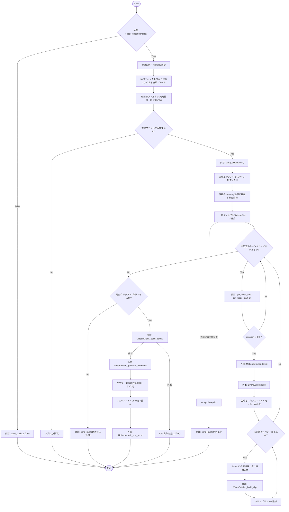
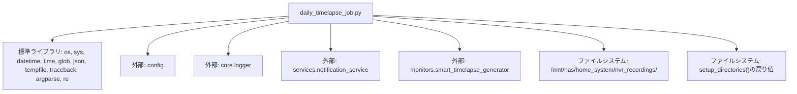

## 1. 解析メタ情報

| 項目 | 内容 |
| --- | --- |
| 対象ファイル | daily_timelapse_job.py |
| 言語 | Python |
| 解析対象 | 提供されたコードのみ |
| 推測・補完 | 一切なし |

## 2. ファイルの概要

指定されたカメラのNAS上の録画ディレクトリから、特定の日付および時間帯に該当する動画チャンクファイルを検索し、動き検知に基づいたタイムラプス（サマリー）動画の生成・結合・サムネイル生成を行い、Discordへ通知およびアップロードを実行する日次・時間指定バッチ処理スクリプトである。

## 3. 外部依存関係

### インポート一覧

| 名称 | 種類 | 用途 | 根拠 |
| --- | --- | --- | --- |
| `os` | 標準ライブラリ | パス操作、ファイル存在確認、リネーム、削除 | `import os` (行番号取得不可 / 抜粋: "import os") |
| `sys` | 標準ライブラリ | システムパス (`sys.path`) へのプロジェクトルート追加 | `import sys` (行番号取得不可 / 抜粋: "import sys") |
| `datetime` | 標準ライブラリ | 日付・時刻のパース、計算、フォーマット | `import datetime` (行番号取得不可 / 抜粋: "import datetime") |
| `time` | 標準ライブラリ | スリープ処理 (`time.sleep`)、処理時間計測 (`time.perf_counter`) | `import time` (行番号取得不可 / 抜粋: "import time") |
| `glob` | 標準ライブラリ | 指定パターンに一致するファイルの検索 | `import glob` (行番号取得不可 / 抜粋: "import glob") |
| `json` | 標準ライブラリ | サマリー情報のJSON形式でのファイル保存 | `import json` (行番号取得不可 / 抜粋: "import json") |
| `tempfile` | 標準ライブラリ | 一時ディレクトリの作成 (`TemporaryDirectory`) | `import tempfile` (行番号取得不可 / 抜粋: "import tempfile") |
| `traceback` | 標準ライブラリ | エラー発生時のスタックトレース取得 | `import traceback` (行番号取得不可 / 抜粋: "import traceback") |
| `argparse` | 標準ライブラリ | コマンドライン引数の解析 | `import argparse` (行番号取得不可 / 抜粋: "import argparse") |
| `re` | 標準ライブラリ | ファイル名からの時刻文字列の正規表現抽出 | `import re` (行番号取得不可 / 抜粋: "import re") |
| `Path` | 標準ライブラリ | （インポートされているが未使用） | `from pathlib import Path` (行番号取得不可 / 抜粋: "from pathlib import Path") |
| `asdict` | 標準ライブラリ | データクラスの辞書化（JSON保存時） | `from dataclasses import asdict` (行番号取得不可 / 抜粋: "from dataclasses import asdict") |
| `config` | 内部モジュール | LINEのユーザーID取得など設定情報の参照 | `import config` (行番号取得不可 / 抜粋: "import config") |
| `setup_logging` | 内部モジュール | ロガーの初期化 | `from core.logger import setup_logging` (行番号取得不可 / 抜粋: "from core.logger import setup_logging") |
| `send_push` | 内部モジュール | Discordへの通知メッセージ送信 | `from services.notification_service import send_push` (行番号取得不可 / 抜粋: "from services.notification_service import send_push") |
| `monitors.smart_timelapse_generator` の各要素 | 内部モジュール | 動き検知、イベント構築、クリップ生成、結合、Discordへのアップロードなどコア処理の実行 | `from monitors.smart_timelapse_generator import ...` (行番号取得不可 / 抜粋: "from monitors.smart_timelapse_generator import") |

### ブラックボックスとなる外部要素

| 名称 | 理由 | 根拠 |
| --- | --- | --- |
| `config` | モジュール内部で定義されている変数や初期化処理の内容が提供されていないため | `getattr(config, "LINE_USER_ID", "")` (行番号取得不可 / 抜粋: "getattr(config, "LINE_USER_ID", "")") |
| `setup_logging` | ログ出力のフォーマット、出力先（ファイル/標準出力など）の仕様が提供されていないため | `logger = setup_logging(__name__)` (行番号取得不可 / 抜粋: "logger = setup_logging(**name**)") |
| `send_push` | 関数内部の処理、引数（`target`, `channel`など）に対する正確な挙動、エラーハンドリングの有無が提供されていないため | `send_push(...)` (行番号取得不可 / 抜粋: "send_push(user_id=user_id, messages=...)") |
| `smart_timelapse_generator` の全インポート要素 | 各クラス(`MotionDetector`, `VideoBuilder`等)のメソッド、プロパティの仕様、各関数の詳細な処理内容、厳密な戻り値・引数の型定義が提供されていないため | `from monitors.smart_timelapse_generator import ...` (行番号取得不可 / 抜粋: "from monitors.smart_timelapse_generator import") |

## 4. 主要要素の定義（関数 / エンドポイント / コンポーネント）

### `parse_time`

* **役割**: HH:MM またはコロンなしの HHMM, HHMMSS, HH 形式の文字列を `datetime.time` オブジェクトに変換する。

* 根拠: [関数定義およびコメント] (行番号取得不可 / 抜粋: "def parse_time(time_str: str) -> datetime.time:")

* **引数/リクエスト**: `time_str: str` (時刻を表す文字列)

* 根拠: [関数の引数定義] (行番号取得不可 / 抜粋: "time_str: str")

* **戻り値/レスポンス**: `datetime.time` または入力がFalsyな場合は `None`

* 根拠: [関数の戻り値型ヒントと初期分岐] (行番号取得不可 / 抜粋: "return None")

* **副作用**: なし

* 根拠: [関数内部処理] (行番号取得不可 / 抜粋: "return datetime.time(...)")

* **エラーハンドリング**: フォーマットが想定された長さ（2, 4, 6桁）に合致しない場合、`ValueError` を発生させる。

* 根拠: [else句の処理] (行番号取得不可 / 抜粋: "raise ValueError(f"時刻のフォーマットが...")")

### `run_daily_timelapse`

* **役割**: 対象カメラの録画ディレクトリから、指定日付および時間帯の動画ファイルを取得・フィルタリングし、動き検知エンジンのパイプライン（検知・イベント構築・クリップ生成・結合・サムネイル作成）を実行して結果をDiscordへアップロード・通知する。

* 根拠: [関数定義] (行番号取得不可 / 抜粋: "def run_daily_timelapse(...) -> None:")

* **引数/リクエスト**:
* `camera_name: str`: 対象のカメラ名

* `target_date_str: str = None`: 対象日(YYYY-MM-DD)。指定がない場合は実行日の前日が設定される

* `start_time_str: str = None`: フィルタリングの開始時刻

* `end_time_str: str = None`: フィルタリングの終了時刻

* 根拠: [関数の引数定義] (行番号取得不可 / 抜粋: "camera_name: str, target_date_str: str = None...")

* **戻り値/レスポンス**: `None`

* 根拠: [関数の戻り値型ヒント] (行番号取得不可 / 抜粋: "-> None:")

* **副作用**:
* DiscordへのPush通知（依存ファイル経由）

* ディレクトリの作成・一時ディレクトリの作成と破棄

* 既存のsummary動画ファイルの削除

* 処理中の中間CSVファイル（`motion.csv`, `events.csv`, `events_enriched.csv`）のリネーム退避

* サマリー情報のJSONファイル (`.done`) のディスクへの保存

* 根拠: [ファイルI/OおよびAPI呼び出し処理] (行番号取得不可 / 抜粋: "os.rename(src_csv, dst_csv)")

* **エラーハンドリング**:
* `check_dependencies` が `False` の場合、エラー通知を送信し早期リターンする。

* 日付(`target_date_str`)や時刻(`start_time_str`, `end_time_str`)のパースに失敗した場合、エラーログを出力して早期リターンする。

* 処理全体を `try...except Exception as e:` で囲み、予期せぬエラーが発生した場合はスタックトレースをログ出力し、Discordへエラー通知を送信する。

* 根拠: [try-exceptブロックおよび早期リターン処理] (行番号取得不可 / 抜粋: "except Exception as e:")

## 5. 処理フロー図

※ 以下のフロー図はソースコード全体の処理順序を可視化したものである。

## 6. 依存関係図

※ 依存関係図はソースコード内のインポート文およびパス指定から抽出したものである。

## 7. 次のステップ（リバースエンジニアリングの提案）

| 優先度 | ファイル名(推測可) | 理由 | 根拠 |
| --- | --- | --- | --- |
| 高 | `monitors/smart_timelapse_generator.py` | コアロジックとなる動き検知、クリップ切り出し、結合などのアルゴリズムや、隠蔽メソッド（`_build_clip`等）の正確な副作用と戻り値を把握するため。 | `from monitors.smart_timelapse_generator import ...` (行番号取得不可 / 抜粋: "from monitors.smart_timelapse_generator import") |
| 中 | `services/notification_service.py` | エラー時や処理完了時に呼ばれる `send_push` の引数（`target="discord"`等）がどのように処理され、実際にどのようなメッセージが飛ぶのかを確認するため。 | `from services.notification_service import send_push` (行番号取得不可 / 抜粋: "from services.notification_service import send_push") |
| 低 | `config.py` | `LINE_USER_ID` 以外にシステム全体の動作に影響を与える環境変数や設定値が存在するか確認するため。 | `import config` (行番号取得不可 / 抜粋: "import config") |

## 8. 保守上の注意点

* 動画処理ループ内でハードコードされた `time.sleep(1)` が存在し、チャンク数に比例して固定の遅延が発生する仕様になっている。

* 根拠: [ループ内処理] (行番号取得不可 / 抜粋: "for filepath in target_files: time.sleep(1)")

* チャンクファイルの長さを最大15分と仮定し、ハードコードされた固定値(`datetime.timedelta(minutes=15)`)を使用して時間帯フィルタリングの終了時刻を算出しているため、カメラ側の設定変更により録画時間が15分を超えた場合にフィルタリング漏れが発生する可能性がある。

* 根拠: [フィルタリング処理] (行番号取得不可 / 抜粋: "file_end_dt = file_start_dt + datetime.timedelta(minutes=15)")

* `VideoBuilder` クラスのインスタンスに対し、`_build_clip`, `_build_concat`, `_generate_thumbnail` のようにアンダースコア始まりのメソッド（Pythonの慣例における非公開/内部メソッド）を直接呼び出している。

* 根拠: [クリップ生成・結合処理] (行番号取得不可 / 抜粋: "clip_path = video_builder._build_clip(...)")

* 既存のsummary動画ファイルを削除する処理において、`OSError` をキャッチしているが `pass` 処理となっており、削除失敗時（権限不足や使用中など）の原因が握りつぶされる実装となっている。

* 根拠: [既存ファイル削除処理] (行番号取得不可 / 抜粋: "except OSError: pass")

* 録画ファイルの検索先ディレクトリが `/mnt/nas/home_system/nvr_recordings/{camera_name}` としてスクリプト内にハードコードされている。

* 根拠: [NASディレクトリ指定] (行番号取得不可 / 抜粋: "nvr_dir = f"/mnt/nas/home_system/nvr_recordings/{camera_name}"")

* `LINE_USER_ID` という変数名で `config` から値を取得しているが、`send_push` の引数には `target="discord"` を指定しており、変数名と通知先が一致していない。

* 根拠: [通知送信処理] (行番号取得不可 / 抜粋: "user_id=user_id, ..., target="discord"")

## 9. 不明事項一覧

| 項目 | 理由 | 必要なファイル |
| --- | --- | --- |
| 各種機能エンジンの詳細仕様 | `MotionDetector`, `EventBuilder`, `VideoBuilder`, `Uploader` の内部状態、メソッドの引数の型や戻り値の構造が一切不明であるため。 | `monitors/smart_timelapse_generator.py`  |
| ディレクトリ構造とパス定義 | `setup_directories` 関数が返す `work, out, rec` の具体的なディレクトリパス構成が不明であるため。 | `monitors/smart_timelapse_generator.py`  |
| 動画メタ情報の構造 | `get_video_info` 関数が返す辞書（`info.get('format', {}).get('duration', 0)` を含む）の完全なスキーマが不明であるため。 | `monitors/smart_timelapse_generator.py`  |
| 通知連携の詳細 | `send_push` の `messages` フォーマットや `target="discord"` 指定時の動作仕様が不明であるため。 | `services/notification_service.py`  |

## 10. 自己検証結果

* [x] 完了: 推測・外部ファイルの仕様を一切含んでいない
* [x] 完了: 全関数・全クラス・全コンポーネントを列挙した
* [x] 完了: 全てのインポート要素を列挙した
* [x] 完了: すべての仕様説明に「根拠（行番号・抜粋）」を明記した
* [x] 完了: 根拠漏れが0件である
* [x] 完了: Mermaid構文にエラーの原因となる記号（エスケープ漏れ）がない
* [x] 完了: 不明事項を漏れなく列挙した