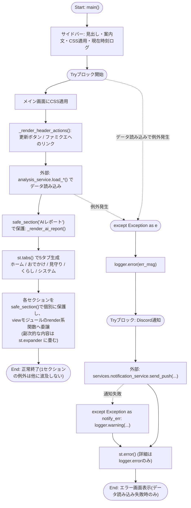

## 1. 解析メタ情報

| 項目 | 内容 |
| --- | --- |
| 対象ファイル | `dashboard.py` |
| 言語 | Python |
| 解析対象 | 提供されたコードのみ |
| 推測・補完 | 一切なし |

## 関連ドキュメント

* [analysis_service.md](./analysis_service.md) - `services.analysis_service`の実体。`load_sensor_data`, `load_generic_data`, `load_bicycle_data`, `load_nas_status`, `load_ai_report`, `apply_friendly_names`等を提供。同ドキュメントでも本ファイル(`dashboard.py`)を主要な呼び出し元として明記している
* [common.md](./common.md) — **Issue #664 で `common.py` ごと廃止された Deprecated Facade**（本ファイルは実体を直importするようになった。仕様書は履歴として残っている）
* [config.md](./config.md) - `SQLITE_TABLE_CHILD`等のテーブル名定数、`LINE_USER_ID`を提供
* [start_all.md](./start_all.md) - 呼び出し元。`start_all.sh`が`streamlit run dashboard.py`をバックグラウンドで起動する（**スマホ対応で変更**: `--server.baseUrlPath` を付けて起動するようになった）
* [dashboard_router.md](./dashboard_router.md) / [dashboard_proxy_service.md](./dashboard_proxy_service.md) - **（スマホ対応で追加）** 本アプリを `unified_server.py`(8000番)の `/dashboard` 配下へ中継する側。スマートフォンからはこの経路でのみ到達する
* [quest_tab.md](./quest_tab.md) — **スマホ対応で `views/dashboard/quest_tab.py` ごと撤去された**（同じ内容をPWA `family-quest` が持つ二重管理だったため）。仕様書は廃止noticeつきで履歴として残っている

## 2. ファイルの概要

* Streamlit製ダッシュボードアプリケーションのエントリーポイント。ページ設定・ロガー設定などアプリ全体の初期化を行う。
* `services.analysis_service` からセンサー・子供・排泄・食事・車・防犯ログ・駐輪場・NASステータス等のデータを読み込み、AIレポート（`load_ai_report`）を取得して展開表示する。
* **（スマホ対応で再設計）** 画面は5つのタブ（🏠 ホーム、🚃 おでかけ、👀 見守り、💡 くらし、🔧 システム）で構成され、レンダリングは `views.dashboard` 配下のビューモジュールに委譲する。サマリー（`views.dashboard.summary`）は常時最上部ではなく「ホーム」タブの中に入っている。
* **（スマホ対応で変更）** 以前は10個のタブ（クエスト、電車遅延、防犯カメラ、電力・環境、気温詳細、健康管理、高砂実家、ログ分析、システム管理、駐輪場）を持ち、そのすべての上にサマリー9枚を常時表示していた。ソース中のコメントには、この構成ではスマートフォンで「どのタブを開いてもサマリーを越えるスクロールが必要」「タブ列が画面幅の数倍になり、目的のタブを探せない」状態だったため用途で5つに束ね直した、と記されている。クエストタブは同じ内容をスマホ最適化済みのPWA `family-quest`（`/quest`）が持つ二重管理だったため撤去され、ヘッダーのリンクボタンだけが残っている。
* **（Issue #507で削除）** 以前は「トレンド」タブも存在したが、参照先の`app_rankings`テーブルへの書き込みコードが存在せず機能として死んでいたため、UIごと削除された。
* **（スマホ対応で追加）** 画面最上部に操作列（`_render_header_actions`）を常設する。「🔄 データを更新」は以前サイドバーにしか無く、`initial_sidebar_state="collapsed"` のためスマートフォンではハンバーガーメニューを開かないと押せなかった。
* アプリ実行中に例外が発生した場合、エラーログを出力しDiscordへ通知を試み、画面上に汎用エラーメッセージを表示するフェイルセーフ処理を持つ（**Issue #410 L-L5で修正**: トレースバックは以前画面にも表示していたが、内部情報の露出防止のためログのみに変更した）。

## 3. 外部依存関係

### インポート一覧

| 名称 | 種類 | 用途 | 根拠 |
| --- | --- | --- | --- |
| `logging` | 標準ライブラリ | ロガーの設定・取得 | `import logging` (行番号: 2 / 抜粋: "import logging") |
| `traceback` | 標準ライブラリ | 例外発生時のスタックトレース文字列取得 | `import traceback` (行番号: 3 / 抜粋: "import traceback") |
| `datetime` | 標準ライブラリ | 現在時刻・レポート時刻の処理 | `from datetime import datetime` (行番号: 4 / 抜粋: "from datetime import datetime") |
| `pytz` | 外部ライブラリ | タイムゾーン（Asia/Tokyo）の処理 | `import pytz` (行番号: 5 / 抜粋: "import pytz") |
| `streamlit` | 外部ライブラリ | Web UIの構築（ページ設定、タブ、サイドバー、エラー表示等） | `import streamlit as st` (行番号: 6 / 抜粋: "import streamlit as st") |
| `services.notification_service.send_push` | ローカルモジュール | **（Issue #664 で変更）** 以前は Deprecated Facade である `common` 経由で参照していた。`common.py` の廃止に伴い実体を直接importする | 根拠: `from services.notification_service import send_push` (行番号: 9 / 抜粋: "from services.notification_service import send_push") |
| `config` | 内部モジュール | DBテーブル名やLINEユーザーIDなど設定値の取得 | `import config` (行番号: 10 / 抜粋: "import config") |
| `services.analysis_service` | 内部モジュール | センサー・各種テーブルデータ・AIレポート等の読み込み処理 | `from services import analysis_service` (行番号: 11 / 抜粋: "from services import analysis_service") |
| `views.dashboard.common` (`view_common`) | 内部モジュール | 共通CSS（`CUSTOM_CSS`）と `safe_section` の提供 | `common as view_common` (行番号: 15 / 抜粋: "common as view_common,") |
| `views.dashboard.summary` | 内部モジュール | サマリー部分のレンダリング | `summary,` (行番号: 16 / 抜粋: "summary,") |
| `views.dashboard.sensor_tab` | 内部モジュール | 電力・気温・高砂実家のレンダリング | `sensor_tab,` (行番号: 17 / 抜粋: "sensor_tab,") |
| `views.dashboard.health_tab` | 内部モジュール | 健康管理のレンダリング | `health_tab,` (行番号: 18 / 抜粋: "health_tab,") |
| `views.dashboard.misc_tab` | 内部モジュール | 電車遅延・防犯カメラ・駐輪場のレンダリング | `misc_tab,` (行番号: 19 / 抜粋: "misc_tab,") |
| `views.dashboard.log_tab` | 内部モジュール | リソース・NAS・サーバーログ・センサーログ分析・メンテナンス操作のレンダリング | `log_tab` (行番号: 20 / 抜粋: "log_tab") |

**（スマホ対応で削除）** `views.dashboard.quest_tab` のインポートは、クエストタブの撤去に伴い削除された。

### ブラックボックスとなる外部要素

| 名称 | 理由 | 根拠 |
| --- | --- | --- |
| `services.analysis_service` の各関数 | `load_sensor_data`, `load_generic_data`, `load_bicycle_data`, `load_nas_status`, `load_ai_report`, `apply_friendly_names` の実装（DBアクセス方法やデータ整形ロジック）が本ファイルからは不明。 | `analysis_service.load_sensor_data(limit=10000)` (行番号: 123 / 抜粋: "df_sensor = analysis_service.load_sensor_data(limit=10000)") |
| `config` の各設定値 | `SQLITE_TABLE_CHILD`, `SQLITE_TABLE_DEFECATION`, `SQLITE_TABLE_FOOD`, `SQLITE_TABLE_CAR` の実際の値がどこでどう定義されているか不明。 | `config.SQLITE_TABLE_CHILD` (行番号: 124 / 抜粋: "df_child = analysis_service.load_generic_data(config.SQLITE_TABLE_CHILD)") |
| `services.notification_service.send_push` | エラー通知の送信方式・成否時の挙動（例外送出の有無など）が不明。 | `services.notification_service.send_push(` (行番号: 216 / 抜粋: "send_push(") |
| `view_common.CUSTOM_CSS` | CSSの具体的な内容・スタイル定義が不明。 | `view_common.CUSTOM_CSS` (行番号: 110 / 抜粋: "st.markdown(view_common.CUSTOM_CSS, unsafe_allow_html=True)") |
| `view_common.safe_section` | 例外を隔離する仕組み（何を表示し、どこへログを出すか）が本ファイルからは不明。 | `view_common.safe_section("サマリー")` (行番号: 168 / 抜粋: "with view_common.safe_section(\"サマリー\"):") |
| `summary.render_summary` | サマリー部の描画ロジック・使用データ項目の詳細が不明。 | `summary.render_summary(now, df_sensor, df_car, df_bicycle, nas_data)` (行番号: 169 / 抜粋: "summary.render_summary(now, df_sensor, df_car, df_bicycle, nas_data)") |
| `misc_tab` の各関数 | `render_traffic`, `render_photos`, `render_bicycle` の内部実装が不明。 | `misc_tab.render_traffic()` (行番号: 173 / 抜粋: "misc_tab.render_traffic()") |
| `sensor_tab` の各関数 | `render_electricity`, `render_temperature`, `render_takasago` の内部実装が不明。 | `sensor_tab.render_electricity(df_sensor, now)` (行番号: 190 / 抜粋: "sensor_tab.render_electricity(df_sensor, now)") |
| `health_tab.render` | 健康管理の描画内容が不明。 | `health_tab.render(df_child, df_poop, df_food)` (行番号: 186 / 抜粋: "health_tab.render(df_child, df_poop, df_food)") |
| `log_tab` の各関数 | **（スマホ対応で変更）** `render_logs` に加え、以前の `render_system` を分割した `render_resources` / `render_nas_status` / `render_server_logs` / `render_maintenance` の内部実装が不明。 | `log_tab.render_resources()` (行番号: 197 / 抜粋: "log_tab.render_resources()") |
| `/quest` のSPA | `QUEST_APP_PATH` のリンク先で何が配信されるかは本ファイルからは不明（`unified_server.py` がマウントする旨のコメントのみ）。 | `QUEST_APP_PATH = "/quest"` (行番号: 39 / 抜粋: "QUEST_APP_PATH = \"/quest\"") |

## 4. 主要要素の定義（関数 / エンドポイント / コンポーネント）

### `logger` (モジュールレベル変数)

* **役割**: `logging.basicConfig` によりログ出力形式・レベルを設定した上で、モジュール専用のロガーインスタンスを生成する。
* 根拠: `logging.basicConfig(...)` および `logger = logging.getLogger(__name__)` (行番号: 26〜29 / 抜粋: "logging.basicConfig(\n    level=logging.INFO, format=\"%(asctime)s - %(levelname)s - %(message)s\"\n)\nlogger = logging.getLogger(__name__)")

* **引数/リクエスト**: なし（モジュールレベルで即時実行）
* 根拠: (行番号: 26〜29 / 抜粋: "logging.basicConfig(")

* **戻り値/レスポンス**: なし（グローバル変数 `logger` への代入）
* 根拠: `logger = logging.getLogger(__name__)` (行番号: 29 / 抜粋: "logger = logging.getLogger(__name__)")

* **副作用**: ルートロガーの設定（INFOレベル、フォーマット指定）、モジュール変数 `logger` の生成。
* 根拠: `logging.basicConfig` (行番号: 26 / 抜粋: "logging.basicConfig(")

* **エラーハンドリング**: なし
* 根拠: (行番号: 26〜29 / 抜粋: "logger = logging.getLogger(__name__)")

### `st.set_page_config` 呼び出し（ページ設定）

* **役割**: Streamlitアプリのページタイトル、アイコン、レイアウト、サイドバーの初期状態を設定する。
* 根拠: `st.set_page_config(...)` (行番号: 32〜37 / 抜粋: "st.set_page_config(\n    page_title=\"My Home Dashboard\",\n    page_icon=\"🏠\",\n    layout=\"wide\",\n    initial_sidebar_state=\"collapsed\",\n)")

* **引数/リクエスト**: `page_title="My Home Dashboard"`, `page_icon="🏠"`, `layout="wide"`, `initial_sidebar_state="collapsed"`
* 根拠: (行番号: 33〜36 / 抜粋: "page_title=\"My Home Dashboard\",")

* **戻り値/レスポンス**: なし
* 根拠: (行番号: 32〜37 / 抜粋: "st.set_page_config(")

* **副作用**: Streamlitアプリ全体のページ設定（ワイドレイアウト、サイドバー折りたたみ等）を変更する。
* 根拠: (行番号: 32〜37 / 抜粋: "st.set_page_config(")

* **エラーハンドリング**: なし
* 根拠: (行番号: 32〜37 / 抜粋: "st.set_page_config(")

### `QUEST_APP_PATH` (モジュールレベル定数)

* **役割**: family-quest(PWA)へのリンク先パス `"/quest"`。コメントに「`unified_server.py` が `/quest` にSPAをマウントしている」と記されている。
* 根拠: `QUEST_APP_PATH = "/quest"` (行番号: 38〜39 / 抜粋: "QUEST_APP_PATH = \"/quest\"")

* **引数/リクエスト**: 該当なし
* 根拠: (行番号: 39 / 抜粋: "QUEST_APP_PATH = \"/quest\"")

* **戻り値/レスポンス**: 該当なし
* 根拠: (行番号: 39 / 抜粋: "QUEST_APP_PATH = \"/quest\"")

* **副作用**: なし
* 根拠: (行番号: 39 / 抜粋: "QUEST_APP_PATH = \"/quest\"")

* **エラーハンドリング**: なし
* 根拠: (行番号: 39 / 抜粋: "QUEST_APP_PATH = \"/quest\"")

### `_render_header_actions`

* **役割**: 画面最上部の操作列を描画する。`st.columns(2)` の左に「🔄 データを更新」ボタン（押下で `st.cache_data.clear()` と `st.rerun()`）、右に「⚔️ ファミクエを開く」リンクボタン（`QUEST_APP_PATH`）を、いずれも `width="stretch"` で配置する。docstringには、以前「データを更新」がサイドバーにしか無く、`initial_sidebar_state="collapsed"` のためスマートフォンではハンバーガーメニューを開かないと押せず最も使う操作が最も遠かったため、メイン画面の先頭に常設する旨が記されている。
* 根拠: `def _render_header_actions() -> None:` (行番号: 42〜64 / 抜粋: "def _render_header_actions() -> None:")

* **引数/リクエスト**: なし
* 根拠: (行番号: 42 / 抜粋: "def _render_header_actions() -> None:")

* **戻り値/レスポンス**: `None`
* 根拠: (行番号: 42 / 抜粋: "def _render_header_actions() -> None:")

* **副作用**: 2カラムのボタン描画。更新ボタン押下時は `st.cache_data.clear()`（キャッシュ全クリア）と `st.rerun()`（再実行）。
* 根拠: (行番号: 52〜54 / 抜粋: "st.cache_data.clear()")

* **エラーハンドリング**: なし（呼び出し元 `main()` の `try` の内側で呼ばれる）
* 根拠: (行番号: 42〜64 / 抜粋: "def _render_header_actions() -> None:")

* **補足（リンクがルート相対である理由）**: ソースのコメントに、このダッシュボードは `unified_server.py`(8000番)の `config.DASHBOARD_BASE_PATH` 配下に中継されて配信されるため、閲覧しているオリジン（LANのIP:8000でもCloudflare経由の公開ドメインでも）の `/quest` に解決されるルート相対リンクにしている、`config.FRONTEND_URL` のような固定URLを埋めるとLAN外から開いたときに繋がらない、と記されている。
* 根拠: (行番号: 58〜63 / 抜粋: "ルート相対のリンクにしているのは、このダッシュボードが")

### `_render_ai_report`

* **役割**: `analysis_service.load_ai_report()` で取得した最新のAIレポート（「セバスチャンからの報告」）を折りたたみ（`st.expander`、`expanded=False`）で表示する。レポートが `None` なら何も描画せず即 `return` する。`timestamp` が文字列の場合、`"T"` を含めば `datetime.fromisoformat` でJSTへ変換し、含まなければ旧フォーマット `"%Y-%m-%d %H:%M:%S"` として `strptime` + `localize` する。時刻から `5<=hour<11` は `☀️`、`11<=hour<17` は `🕛`、それ以外は `🌙` のアイコンを選び、`HH:MM` と併せてexpanderのラベルにする。本文は改行を `"  \n"` に置換して `st.markdown` で表示する。**（Issue #410 L-L2で修正）** 旧フォーマットのタイムスタンプを以前は `datetime.now()` にフォールバックしており、実際の生成時刻に関わらず「たった今」の報告であるかのように表示されていた。
* 根拠: `def _render_ai_report() -> None:` (行番号: 67〜95 / 抜粋: "def _render_ai_report() -> None:")、旧フォーマットのパース (行番号: 86 / 抜粋: "report_time = tz_jst.localize(datetime.strptime(ts, \"%Y-%m-%d %H:%M:%S\"))")

* **引数/リクエスト**: なし
* 根拠: (行番号: 67 / 抜粋: "def _render_ai_report() -> None:")

* **戻り値/レスポンス**: `None`
* 根拠: (行番号: 67, 71 / 抜粋: "        return")

* **副作用**: `analysis_service.load_ai_report()` の呼び出しと、expander・markdownの描画。
* 根拠: (行番号: 69, 94〜95 / 抜粋: "report = analysis_service.load_ai_report()")

* **エラーハンドリング**: なし（**スマホ対応で変更**: 呼び出し元の `main()` が `view_common.safe_section("AIレポート")` で囲み、レポートの表示失敗が他のセクションを巻き込まないようにしている）
* 根拠: (行番号: 67〜95 / 抜粋: "def _render_ai_report() -> None:")、呼び出し側の保護 (行番号: 134〜135 / 抜粋: "with view_common.safe_section(\"AIレポート\"):")

### `main`

* **役割**: サイドバー設定、ヘッダー操作列の描画、各種データの読み込み、AIレポート表示、5個のタブの生成とレンダリングを行うアプリ本体の処理。例外発生時はログ記録・Discord通知・エラー画面表示を行う。**（スマホ対応で変更）** サイドバーからは「データを更新」ボタンが `_render_header_actions` へ移り、代わりに主要操作の場所とスマートフォンからのアクセス経路（8000番の `/dashboard` 経由）を案内する `st.caption` が置かれている。AIレポートの時刻処理は `_render_ai_report` へ抽出された。**（Issue #410 L-L5で修正）** 例外発生時に画面表示していた`traceback.format_exc()`を`logger.error`によるログ出力のみに変更し、内部のファイルパス・設定値がLAN内の閲覧者に露出しないようにした。
* 根拠: `def main():` (行番号: 98〜229 / 抜粋: "def main():")、サイドバーの案内文 (行番号: 104〜107 / 抜粋: "\"主要な操作(データ更新)はメイン画面の先頭にあります。\"")、トレースバックのログのみ化 (行番号: 229 / 抜粋: "logger.error(traceback.format_exc())")

* **引数/リクエスト**: なし
* 根拠: `def main():` (行番号: 98 / 抜粋: "def main():")

* **戻り値/レスポンス**: なし（Streamlit UIへの描画が主目的）
* 根拠: `def main():` (行番号: 98 / 抜粋: "def main():")

* **タブ構成（スマホ対応で再設計）**:

| タブ | 中身（`expanded=False` の `st.expander` に畳まれるものは「▸」付き） | `safe_section` のセクション名 |
| --- | --- | --- |
| 🏠 ホーム | `summary.render_summary` | サマリー |
| 🚃 おでかけ | `misc_tab.render_traffic` / ▸`misc_tab.render_bicycle` | 電車遅延 / 駐輪場 |
| 👀 見守り | `misc_tab.render_photos` / ▸`sensor_tab.render_takasago` / ▸`health_tab.render` | 防犯カメラ / 高砂実家 / 健康管理 |
| 💡 くらし | `sensor_tab.render_electricity` / ▸`sensor_tab.render_temperature` | 電力・環境 / 気温詳細 |
| 🔧 システム | `log_tab.render_resources` / `log_tab.render_nas_status` / ▸`log_tab.render_server_logs` / ▸`log_tab.render_logs` / ▸`log_tab.render_maintenance` | リソース状況 / NAS状態 / サーバーログ / ログ分析 / メンテナンス操作 |

* 根拠: `st.tabs([...])` (行番号: 154〜160 / 抜粋: "tab_home, tab_out, tab_watch, tab_life, tab_sys = st.tabs([")、各タブの中身 (行番号: 167〜209 / 抜粋: "with tab_home:")

* **副作用**:
    * サイドバーに設定見出し・案内文（`st.caption`）・CSS適用・現在時刻ログを出力する。
    * メイン画面にCSSを適用し、`_render_header_actions()` でヘッダーの操作列を描画する。
    * `analysis_service` 経由での複数のデータ読み込み（センサー、子供、排泄、食事、車、防犯ログ、駐輪場、NASステータス）。
    * `_render_ai_report()` によるAIレポートの折りたたみ表示。
    * 5タブ分のUIレンダリング（各ビューモジュールへ処理委譲）。
    * 例外発生時、エラーログ出力・Discordへのエラー通知（`services.notification_service.send_push`）・画面への汎用エラーメッセージ表示。**（Issue #410 L-L5で修正）** トレースバックは画面表示せず、ログ（`logger.error`）にのみ出力する。
* 根拠: `_render_header_actions()` (行番号: 120 / 抜粋: "_render_header_actions()"), `analysis_service.load_sensor_data(limit=10000)` (行番号: 123 / 抜粋: "df_sensor = analysis_service.load_sensor_data(limit=10000)"), `services.notification_service.send_push(` (行番号: 216 / 抜粋: "send_push(")

* **エラーハンドリング**:
    * データ読み込み（`analysis_service.load_*()`・AIレポート取得・パース）を`try...except Exception as e:`で捕捉する。この範囲の失敗は全タブが依存する前提データが揃わないことを意味するため、ダッシュボード全体をエラー画面にする。
    * **[修正済み・Issue #438]** 以前はこの`try`ブロックがサマリー表示・全タブのレンダリングまで含んでおり、いずれか1タブの描画例外でもダッシュボード全体がエラー画面になっていた。現在は各描画呼び出しを、[dashboard_common.md](./dashboard_common.md)の`safe_section`コンテキストマネージャで個別に囲み、1つのセクションの例外が他のセクションの描画を止めないようにした（詳細は8節参照）。**（スマホ対応で変更）** 保護の単位は「タブ」ではなく「セクション」になり、1つのタブの中の複数セクション（例: 🔧 システムの5セクション）もそれぞれ独立して保護される。AIレポートの表示も`safe_section("AIレポート")`で囲まれるようになった。
    * 上記の外側`except Exception as e:`で捕捉した場合、エラーメッセージをログ出力（`logger.error`）した上で、`services.notification_service.send_push`によるDiscord通知を試みる。**[修正済み・Issue #438]** この通知処理自体の失敗は、以前は`except Exception: pass`で握りつぶしていたが、現在は`except Exception as notify_err: logger.warning(...)`でログに記録するよう変更した。
    * 最後に `st.error(...)` でユーザー向けの汎用エラーメッセージを表示する。**（Issue #410 L-L5で修正）** 以前は続けて`st.code(traceback.format_exc())`でトレースバックを画面に出力していたが、内部のファイルパス・設定値の露出防止のため`logger.error(traceback.format_exc())`によるログ出力のみに変更した。
* 根拠: 外側`except Exception as e:` (行番号: 211〜229 / 抜粋: "except Exception as e:")、通知失敗のログ化 (行番号: 221〜224 / 抜粋: "except Exception as notify_err:")、トレースバックのログのみ化 (行番号: 229 / 抜粋: "logger.error(traceback.format_exc())")、`safe_section`によるセクション単位保護 (行番号: 134〜209 / 抜粋: "with view_common.safe_section(")

## 5. 処理フロー図

`main()` 関数における、データ読み込みからタブ描画、例外発生時のフォールバックまでの流れを示します。

## 6. 依存関係図

```mermaid
graph TD
    subgraph "dashboard.py"
        logger["logger (Global)"]
        questPath["QUEST_APP_PATH"]
        header["_render_header_actions()"]
        aiReport["_render_ai_report()"]
        main["main()"]
    end

    subgraph "外部依存"
        logging_mod["logging"]
        pytz_mod["pytz"]
        streamlit_mod["streamlit"]
        traceback_mod["traceback"]
        common_mod["common"]
        config_mod["config"]
        analysis_service["services.analysis_service"]
        view_common["views.dashboard.common"]
        summary["views.dashboard.summary"]
        sensor_tab["views.dashboard.sensor_tab"]
        health_tab["views.dashboard.health_tab"]
        misc_tab["views.dashboard.misc_tab"]
        log_tab["views.dashboard.log_tab"]
    end

    logger --> logging_mod
    header --> streamlit_mod
    header --> questPath
    aiReport --> streamlit_mod
    aiReport --> pytz_mod
    aiReport --> analysis_service
    main --> header
    main --> aiReport
    main --> streamlit_mod
    main --> pytz_mod
    main --> traceback_mod
    main --> view_common
    main --> config_mod
    main --> analysis_service
    main --> common_mod
    main --> summary
    main --> sensor_tab
    main --> health_tab
    main --> misc_tab
    main --> log_tab
```

## 7. 次のステップ（リバースエンジニアリングの提案）

| 優先度 | ファイル名(推測可) | 理由 | 根拠 |
| --- | --- | --- | --- |
| 高 | `services/analysis_service.py` | ダッシュボードが表示する全データ（センサー、子供、排泄、食事、車、防犯ログ、駐輪場、NASステータス、AIレポート）の取得ロジックが集約されており、UIの正確な挙動を把握するために必須。 | `from services import analysis_service` (行番号: 11 / 抜粋: "from services import analysis_service") |
| 高 | `views/dashboard/summary.py`, `sensor_tab.py`, `health_tab.py`, `misc_tab.py`, `log_tab.py` | 実際の画面描画ロジックが全てこれらのモジュールに委譲されており、UIの詳細仕様（表示項目・グラフ・操作性）を理解するために必要。 | `from views.dashboard import (...)` (行番号: 14〜21 / 抜粋: "from views.dashboard import (") |
| 高 | `views/dashboard/common.py` | スマホ幅のレイアウト（列の縦積み・タブの横スクロール・ステータスカードのグリッド）がすべて`CUSTOM_CSS`側にあるため、見た目の仕様は本ファイルからは追えない。 | `st.markdown(view_common.CUSTOM_CSS, ...)` (行番号: 110, 117 / 抜粋: "st.markdown(view_common.CUSTOM_CSS, unsafe_allow_html=True)") |
| 中 | `routers/dashboard_router.py`, `services/dashboard_proxy_service.py` | スマートフォンからの到達経路（8000番の`/dashboard`配下への中継）を把握するため。`QUEST_APP_PATH`をルート相対にしている理由もここに依存する。 | ルート相対リンクの理由を述べたコメント (行番号: 58〜63 / 抜粋: "unified_server.py(8000番)の config.DASHBOARD_BASE_PATH 配下に中継されて") |
| 中 | `config.py` | `SQLITE_TABLE_CHILD` 等のテーブル名定数や `LINE_USER_ID` の実値を把握し、DB構造や通知先を確認するため。 | `config.SQLITE_TABLE_CHILD` (行番号: 60 / 抜粋: "df_child = analysis_service.load_generic_data(config.SQLITE_TABLE_CHILD)") |
| 中 | `common.py` | `send_push` の実装（Discord通知の具体的な送信方式・エラー処理）を確認するため。 | `services.notification_service.send_push(` (行番号: 148 / 抜粋: "send_push(") |

## 8. 保守上の注意点

* **ロガー設定方式の不統一**: 本ファイルは `logging.basicConfig()` と `logging.getLogger(__name__)` を直接使用してロガーを構築しているが、`switchbot_service.py` や `backup_service.py` 等の他サービスは `core.logger.setup_logging` を利用している。両方の初期化方式が同一プロセス内で混在すると、ハンドラの重複登録やログフォーマットの不一致が発生する可能性がある。
* **[修正済み・Issue #438] 二重の広範な例外キャッチとタブ横断の巻き込み**: 以前は`main()`全体（データ読み込み〜全タブのレンダリング）を1つの`except Exception as e:`で捕捉しており、いずれか1つのタブの描画で例外が起きるとダッシュボード全体がエラー画面になり、無関係な他のタブまで巻き込んでいた。その中のDiscord通知処理も`except Exception: pass`で握りつぶしており、通知失敗の原因が完全に不可視化されていた。現在は各タブの描画（`with tab_x: ...`のブロック内）と`summary.render_summary`の呼び出しを、[dashboard_common.md](./dashboard_common.md)の`safe_section`コンテキストマネージャでそれぞれ個別に囲み、1タブの例外が他タブに波及しないようにした。`main()`直下の`try/except`は初期データ読み込み(全タブが依存するため、失敗時は全体をエラー画面にする判断は維持)専用として残り、その中のDiscord通知失敗は`pass`ではなく`logger.warning`で記録するよう変更した。
* **`report["timestamp"]` の型分岐**: `_render_ai_report`（75〜88行目）で `ts` が文字列かつ `"T"` を含む場合は `datetime.fromisoformat`、含まない場合は旧フォーマット `"%Y-%m-%d %H:%M:%S"` として `strptime` + `localize` でパースする。**（Issue #410 L-L2で修正済み）** 以前は後者が `datetime.now()` へのフォールバックになっており、表示時刻がレポート自体のタイムスタンプと食い違っていた。
* **サイドバーとメイン画面での重複処理**: `view_common.CUSTOM_CSS` の `st.markdown` 呼び出し（110行目・117行目）および `datetime.now(pytz.timezone("Asia/Tokyo"))` の取得（112行目・118行目）がサイドバーブロックとメインのtryブロックでそれぞれ重複して実行されている。
* **更新ボタン押下時の`st.rerun()`**: `_render_header_actions` は `st.cache_data.clear()` 直後に `st.rerun()` を呼んでおり、キャッシュ全クリア＋全データ再読み込みとなるため、データ量によっては応答が遅くなる可能性がある。
* **（スマホ対応）タブ構成を変えるときは `safe_section` の名前も合わせること**: 各セクションの例外時に画面へ出る文言は `safe_section` に渡した名前そのものであり（`views/dashboard/common.py`）、タブ名とは独立している。
* **（スマホ対応）レイアウトの実体はCSS側にある**: スマホ幅での列の縦積み・タブの横スクロール・ステータスカードの列数はすべて `view_common.CUSTOM_CSS` のメディアクエリとCSS Gridで決まる。本ファイルの `st.columns` / `st.tabs` の呼び出しだけを見ても、スマートフォンでの見え方は分からない。
* **（スマホ対応）`/quest` へのリンクはルート相対**: `QUEST_APP_PATH` は `"/quest"` であり、8501番へ直接アクセスした場合（中継を経由しない場合）は解決先が存在しない。通常の到達経路は8000番の `/dashboard` 配下である。
* **（スマホ対応）メンテナンス操作はスマートフォンからも到達できる**: 「🔧 システム」タブの `log_tab.render_maintenance`（サービス再起動・バックアップ）は折りたたみの中にあるが、モバイル専用の非表示化はしていない。誤操作防止はチェックボックスによる2段階確認に依存している。

## 9. 不明事項一覧

| 項目 | 理由 | 必要なファイル |
| --- | --- | --- |
| `analysis_service` の各読み込み関数の仕様 | DBアクセス方法、返却される `DataFrame` のスキーマ、キャッシュ有無（`st.cache_data` との関係）が本ファイルからは不明。 | `services/analysis_service.py` |
| 各ビューモジュールの実装詳細 | `summary`, `sensor_tab`, `health_tab`, `misc_tab`, `log_tab` の描画内容・引数の使い方が不明。 | `views/dashboard/summary.py` ほか各ビューファイル |
| `config` の設定値の実体 | `SQLITE_TABLE_CHILD` 等のテーブル名の具体的な値が不明。 | `config.py` |
| `view_common.safe_section` の挙動 | 例外時に何を表示し、どこへログを出すかが本ファイルからは不明。 | `views/dashboard/common.py` |
| スマートフォンからの到達経路 | サイドバーの案内文が「8000番の /dashboard 経由」と述べているが、その中継の実装は本ファイルに無い。 | `routers/dashboard_router.py`, `services/dashboard_proxy_service.py`, `config.py` |
| `services.notification_service.send_push` の仕様 | Discord通知の送信方式や失敗時の挙動（例外を送出するか等）が不明。 | `common.py` |
| `view_common.CUSTOM_CSS` の内容 | 具体的なスタイル定義（特にスマホ幅のメディアクエリ）が不明。 | `views/dashboard/common.py` |

## 相互参照による補足情報

| 元の不明事項 | 判明した内容 | 参照元ドキュメント |
| --- | --- | --- |
| `analysis_service` の各読み込み関数の仕様 | `MY_HOME_SYSTEM/services/analysis_service.py`を直接確認した。`get_ro_db_connection()`(32〜39行目)は`sqlite3.connect(f"file:{config.SQLITE_DB_PATH}?mode=ro", uri=True, timeout=10.0)`で読み取り専用接続を返し、これを内部で用いる`load_generic_data(table_name, limit=500)`(150行目)は`SELECT * FROM {table_name} ORDER BY timestamp DESC LIMIT {limit}`を実行、`load_sensor_data(limit=5000)`(155行目)は`device_records`・SwitchBotメーターログ・電力使用量の複数テーブルを統合して`pd.DataFrame`を返す、`load_nas_status()`(133行目)/`load_ai_report()`(343行目)はそれぞれ最新1件を`Optional[pd.Series]`で返す設計であることを確認した。ファイル全体を`cache_data`および`import streamlit`で検索したが該当箇所はなく、`st.cache_data`によるキャッシュは実装されていないことを確認した。 | 直接ソース確認: `MY_HOME_SYSTEM/services/analysis_service.py:32-39, 133-170, 343-347` |
| 各タブビューモジュールの実装詳細 | `MY_HOME_SYSTEM/views/dashboard/`配下の各ファイルを直接確認した。`summary.py`は`get_takasago_status(df_sensor, now)`(13行目)、`get_itami_status(df_sensor, now)`(36行目)、`get_traffic_status()`(86行目)、`get_server_status()`(97行目)、`get_nas_status_simple(nas_data)`(103行目)等のステータス取得関数群、`quest_tab.py`は引数なしの`render()`(8行目)、`sensor_tab.py`は`render_electricity(df_sensor, now)`(9行目)/`render_temperature(df_sensor, now)`(56行目)/`render_takasago(df_sensor)`(106行目)、`health_tab.py`は`render(df_child, df_poop, df_food)`(5行目)、`misc_tab.py`は`render_traffic()`(14行目)/`render_photos(df_security_log)`(84行目)/`render_bicycle(df_bicycle)`(110行目)、`log_tab.py`は`render_logs(df_sensor)`(8行目)/`render_system()`(20行目)を持つことを確認した。**（Issue #507で削除）** `log_tab.py`にはかつて`render_trends()`(旧22行目、`app_rankings`テーブル参照)も存在したが、書き込み側の収集コードが無く機能として死んでいたため、対応する「トレンド」タブの登録ごと削除された。 | 直接ソース確認: `MY_HOME_SYSTEM/views/dashboard/summary.py:13-103`, `MY_HOME_SYSTEM/views/dashboard/quest_tab.py:8`, `MY_HOME_SYSTEM/views/dashboard/sensor_tab.py:9-106`, `MY_HOME_SYSTEM/views/dashboard/health_tab.py:5`, `MY_HOME_SYSTEM/views/dashboard/misc_tab.py:14-110`, `MY_HOME_SYSTEM/views/dashboard/log_tab.py:8-87` |
| `config` の設定値の実体 | `MY_HOME_SYSTEM/config.py`を直接確認した。`SQLITE_TABLE_CHILD`(245行目)は`"child_health_records"`という文字列定数、`LINE_USER_ID`(185行目)は`os.getenv("LINE_USER_ID")`で環境変数由来（既定値なし、未設定時は`None`）であることを確認した。 | 直接ソース確認: `MY_HOME_SYSTEM/config.py:185, 245` |
| `services.notification_service.send_push` の仕様 | `MY_HOME_SYSTEM/common.py:31-37`が`services.notification_service`から`send_push`を再インポートしているFacadeであることを直接確認した上で、`MY_HOME_SYSTEM/services/notification_service.py:116-163`の実装を直接確認した。Issue #289で`send_push(messages, *, target="both", channel="notify", user_id=None, image_data=None, filename="snapshot.jpg")`に再設計されており、`target`が`"both"`または`"discord"`を含む場合に`_send_discord_webhook`、`"both"`または`"line"`を含む場合に`user_id`(省略時は`config.LINE_USER_ID`にフォールバック)を用いて`_send_line_push`をそれぞれ呼び出す統合プッシュ通知関数であることを確認した。本ファイル(`dashboard.py`)は`target="discord"`のみで呼び出すため`user_id`は渡していない。 | 直接ソース確認: `MY_HOME_SYSTEM/common.py:31-37`, `MY_HOME_SYSTEM/services/notification_service.py:116-163`, `MY_HOME_SYSTEM/dashboard.py:165-169` |
| `view_common.CUSTOM_CSS` の内容 | `MY_HOME_SYSTEM/views/dashboard/common.py`を直接確認した。`CUSTOM_CSS`(11行目〜)は`<style>`タグを含むCSS定義を格納した1つの長い三重引用符文字列定数であり、`views/dashboard/common.py`自体は適用処理を持たず単にこの文字列を定義しているのみで、実際に画面へ流し込むのは本ファイル(`dashboard.py`)48行目・55行目の`st.markdown(view_common.CUSTOM_CSS, unsafe_allow_html=True)`であることを確認した。 | 直接ソース確認: `MY_HOME_SYSTEM/views/dashboard/common.py:11`, `MY_HOME_SYSTEM/dashboard.py:48,55`（参考: [dashboard_common.md](./dashboard_common.md)） |

## 10. 自己検証結果

* [x] 推測・外部ファイルの仕様を一切含んでいない
* [x] 全関数・全クラス・全コンポーネントを列挙した
* [x] 全てのインポート要素を列挙した
* [x] すべての仕様説明に「根拠（行番号・抜粋）」を明記した
* [x] 根拠漏れが0件である
* [x] Mermaid構文にエラーの原因となる記号（エスケープ漏れ）がない
* [x] 不明事項を漏れなく列挙した

完了
