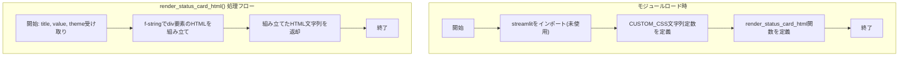

## 1. 解析メタ情報

| 項目 | 内容 |
| --- | --- |
| 対象ファイル | `MY_HOME_SYSTEM/views/dashboard/common.py`（フルパス, disambiguation目的） |
| 言語 | Python |
| 解析対象 | 提供されたコードのみ |
| 推測・補完 | 一切なし |

同名の `MY_HOME_SYSTEM/common.py`（Facadeモジュール、[common.md](./common.md)）とはファイル名が衝突するため、本仕様書は `dashboard_common.md` というファイル名で区別している。

## 関連ドキュメント

* [common.md](./common.md) - 同名衝突の注意（上記参照）。`MY_HOME_SYSTEM/common.py`（下位互換用Facadeモジュール）の仕様書であり、本ファイル（`views/dashboard/common.py`）とは別モジュールである
* [dashboard.md](./dashboard.md) - `views.dashboard.common`を`view_common`としてインポートし、`CUSTOM_CSS`を`st.markdown`で適用する呼び出し元
* [summary.md](./summary.md) - `.common`（相対インポート）から`render_status_card_html`をインポートし、9枚のステータスカード描画に使用する呼び出し元
* [misc_tab.md](./misc_tab.md) - `.common`から`render_status_card_html`をインポートしているが、本ファイル内では未使用
* [quest_tab.md](./quest_tab.md), [log_tab.md](./log_tab.md), [health_tab.md](./health_tab.md), [sensor_tab.md](./sensor_tab.md) - 同じ`views/dashboard`パッケージ内のタブ描画モジュール（本ファイルを直接インポートしていない）

## 2. ファイルの概要

* `views/dashboard`パッケージ内の各タブ・サマリー描画モジュールから共通利用される、CSSスタイル定義とステータスカードHTML生成関数を提供するモジュール。
* 根拠: `CUSTOM_CSS = """` と `def render_status_card_html(title: str, value: str, theme: str) -> str:` (行番号: 4, 50 / 抜粋: "CUSTOM_CSS = \"\"\"")
* `CUSTOM_CSS`は、フォント指定、ステータスカード（`.status-card`）、5種類のテーマ配色クラス（`.theme-green`, `.theme-yellow`, `.theme-red`, `.theme-blue`, `.theme-gray`）、経路検索カード（`.route-card`, `.route-path`等）、Streamlit標準要素のスタイル上書き（`.streamlit-expanderHeader`）を含む、文字列定数として定義されたCSSブロックである。
* 根拠: `.status-card {` (行番号: 9 / 抜粋: "    .status-card {"), `.theme-green { background-color: #e8f5e9; ... }` (行番号: 27 / 抜粋: "    .theme-green { background-color: #e8f5e9; color: #2e7d32; border: 1px solid #c8e6c9; }"), `.route-card {` (行番号: 33 / 抜粋: "    .route-card {")
* `render_status_card_html`は、タイトル・値・テーマ名の3引数を受け取り、`status-card {theme}`クラスを持つ`div`要素のHTML文字列を組み立てて返す純粋関数である。
* 根拠: `def render_status_card_html(title: str, value: str, theme: str) -> str:\n    """ステータスカードのHTMLを生成"""\n    return f"""\n    <div class="status-card {theme}">` (行番号: 50〜53 / 抜粋: "def render_status_card_html(title: str, value: str, theme: str) -> str:")

## 3. 外部依存関係

### インポート一覧

| 名称 | 種類 | 用途 | 根拠 |
| --- | --- | --- | --- |
| `streamlit` | 外部ライブラリ | インポートされているが、本ファイル内では使用されていない（`CUSTOM_CSS`の適用や`render_status_card_html`の呼び出しは、いずれも本ファイルの外側で行われる） | `import streamlit as st` (行番号: 2 / 抜粋: "import streamlit as st") |

### ブラックボックスとなる外部要素

該当なし（本ファイルは`streamlit`のインポート以外に外部モジュール・外部関数への依存を持たず、文字列定数の定義と純粋なHTML文字列生成関数のみで構成される）。

## 4. 主要要素の定義（関数 / エンドポイント / コンポーネント）

### `CUSTOM_CSS` (モジュールレベル変数)

* **役割**: ダッシュボード全体で共通利用されるカスタムCSSを、`<style>`タグを含む複数行文字列として保持するモジュール定数。
* 根拠: `CUSTOM_CSS = """\n<style>` (行番号: 4〜5 / 抜粋: "CUSTOM_CSS = \"\"\"")


* **引数/リクエスト**: なし（モジュールレベルの文字列リテラル定義）
* 根拠: `CUSTOM_CSS = """` (行番号: 4 / 抜粋: "CUSTOM_CSS = \"\"\"")


* **戻り値/レスポンス**: なし（グローバル変数`CUSTOM_CSS`（型: `str`）への代入）
* 根拠: `CUSTOM_CSS = """\n<style>\n...\n</style>\n"""` (行番号: 4〜48 / 抜粋: "CUSTOM_CSS = \"\"\"")


* **副作用**: なし（文字列の定義のみ。DOM適用や画面描画は本ファイルでは行わず、呼び出し元が`st.markdown(view_common.CUSTOM_CSS, unsafe_allow_html=True)`等で適用する想定）
* 根拠: `CUSTOM_CSS = """` から `"""` までの文字列定義 (行番号: 4〜48 / 抜粋: "CUSTOM_CSS = \"\"\"")


* **エラーハンドリング**: なし
* 根拠: `CUSTOM_CSS = """` (行番号: 4 / 抜粋: "CUSTOM_CSS = \"\"\"")


### `render_status_card_html`

* **役割**: タイトル・値・テーマ名を受け取り、`CUSTOM_CSS`で定義された`.status-card`クラスおよびテーマクラス（`{theme}`）を適用したステータスカードのHTML文字列を生成して返す。
* 根拠: `def render_status_card_html(title: str, value: str, theme: str) -> str:\n    """ステータスカードのHTMLを生成"""` (行番号: 50〜51 / 抜粋: "def render_status_card_html(title: str, value: str, theme: str) -> str:")


* **引数/リクエスト**: `title` (型: `str`。カードの見出し文字列)、`value` (型: `str`。カードに表示する値。HTMLタグを含む文字列も許容する設計)、`theme` (型: `str`。`CUSTOM_CSS`で定義されたテーマクラス名。例: `"theme-green"`)
* 根拠: `def render_status_card_html(title: str, value: str, theme: str) -> str:` (行番号: 50 / 抜粋: "def render_status_card_html(title: str, value: str, theme: str) -> str:")


* **戻り値/レスポンス**: `str` (`<div class="status-card {theme}">`内に`title`, `value`を埋め込んだHTML文字列)
* 根拠: `return f"""\n    <div class="status-card {theme}">\n        <div class="status-title">{title}</div>\n        <div class="status-value">{value}</div>\n    </div>\n    """` (行番号: 52〜56 / 抜粋: "return f\"\"\"")


* **副作用**: なし（文字列を生成して返すのみの純粋関数。画面描画・外部I/Oは行わない）
* 根拠: 関数本体全体 (行番号: 50〜57 / 抜粋: "def render_status_card_html(title: str, value: str, theme: str) -> str:")


* **エラーハンドリング**: なし（明示的な例外捕捉は行われていない。渡された引数の型・内容に関するバリデーションも存在しない）
* 根拠: `def render_status_card_html(title: str, value: str, theme: str) -> str:` 全体 (行番号: 50〜57 / 抜粋: "def render_status_card_html(title: str, value: str, theme: str) -> str:")


## 5. 処理フロー図



## 6. 依存関係図

```mermaid
graph TD
    DashboardCommonPy["views/dashboard/common.py"]

    subgraph External_Libraries
        Streamlit["streamlit (未使用インポート)"]
    end

    DashboardCommonPy -.->|未使用インポート| Streamlit

    Dashboard["dashboard.py"] -->|view_commonとしてimport, CUSTOM_CSSを参照| DashboardCommonPy
    Summary["summary.py"] -->|.commonとしてimport, render_status_card_htmlを呼び出し| DashboardCommonPy
    MiscTab["misc_tab.py"] -.->|.commonとしてimport (未使用)| DashboardCommonPy
```

## 7. 次のステップ（リバースエンジニアリングの提案）

| 優先度 | ファイル名(推測可) | 理由 | 根拠 |
| --- | --- | --- | --- |
| 中 | `dashboard.py` | `view_common.CUSTOM_CSS`が実際にどのタイミング・箇所で`st.markdown`に渡され適用されているかを確認するため（既に`dashboard.md`で一部解析済み）。 | 該当なし（呼び出し元は`dashboard.md`で解析済み） |
| 低 | `summary.py` | `render_status_card_html`の実際の呼び出しパターン（`title`, `value`, `theme`引数の実値）を確認するため（既に`summary.md`で解析済み）。 | 該当なし（呼び出し元は`summary.md`で解析済み） |

## 8. 保守上の注意点

* **未使用インポート**: `streamlit`がインポートされているが、本ファイル内のいずれの箇所でも使用されていない（`CUSTOM_CSS`は単なる文字列定数、`render_status_card_html`はf-stringを組み立てるのみで`st.*`のAPIを呼び出していない）。
* 根拠: `import streamlit as st` (行番号: 2 / 抜粋: "import streamlit as st")


* **HTMLエスケープなしの文字列組み立て**: `render_status_card_html`は`title`, `value`の内容をエスケープなしでそのままHTMLに埋め込む。呼び出し元（`summary.py`の`get_bicycle_status`等）は`value`に意図的にHTMLタグ（`<span>`等）を含めて渡す設計になっており、任意のHTML文字列がそのまま出力される。呼び出し元が外部データ由来の文字列を`value`に含めた場合、想定外のHTML混入リスクがある。
* 根拠: `return f"""\n    <div class="status-card {theme}">\n        <div class="status-title">{title}</div>\n        <div class="status-value">{value}</div>\n    </div>\n    """` (行番号: 52〜56 / 抜粋: "return f\"\"\"")


* **`theme`引数のバリデーション欠如**: `render_status_card_html`は`theme`引数がCSS上定義済みのクラス名（`theme-green`等）であることを検証しない。呼び出し元がタイプミス等で未定義のテーマ名を渡した場合、CSSが適用されずスタイル崩れが発生するが、実行時エラーにはならず気づきにくい。
* 根拠: `def render_status_card_html(title: str, value: str, theme: str) -> str:` （バリデーション処理なし） (行番号: 50 / 抜粋: "def render_status_card_html(title: str, value: str, theme: str) -> str:")


* **CSSがPython文字列としてハードコード**: スタイル定義がすべて`CUSTOM_CSS`という1つの長い文字列としてPythonコード内にハードコードされており、`.css`ファイルとして分離されていない。デザイン変更のたびにPythonコードの編集が必要となる。
* 根拠: `CUSTOM_CSS = """\n<style>` (行番号: 4〜5 / 抜粋: "CUSTOM_CSS = \"\"\"")


## 9. 不明事項一覧

| 項目 | 理由 | 必要なファイル |
| --- | --- | --- |
| `CUSTOM_CSS`が実際に`st.markdown`へ渡される具体的な箇所・頻度 | 本ファイル自体は文字列を定義するのみで、適用処理は呼び出し元にあるため。 | `dashboard.py` |
| `render_status_card_html`に渡される`theme`引数の完全な値一覧（本ファイルの`CUSTOM_CSS`で定義される5種以外が渡されていないか） | 呼び出し元の全箇所を横断的に確認する必要があるため。 | `summary.py`, `misc_tab.py` および`views/dashboard`配下の他ファイル |

## 10. 自己検証結果

* [x] 推測・外部ファイルの仕様を一切含んでいない
* [x] 全関数・全クラス・全コンポーネントを列挙した
* [x] 全てのインポート要素を列挙した
* [x] すべての仕様説明に「根拠（行番号・抜粋）」を明記した
* [x] 根拠漏れが0件である
* [x] Mermaid構文にエラーの原因となる記号（エスケープ漏れ）がない
* [x] 不明事項を漏れなく列挙した
