## 1. 解析メタ情報

| 項目 | 内容 |
| --- | --- |
| 対象ファイル | `MY_HOME_SYSTEM/views/dashboard/common.py`（フルパス, disambiguation目的） |
| 言語 | Python |
| 解析対象 | 提供されたコードのみ |
| 推測・補完 | 一切なし |

同名の `MY_HOME_SYSTEM/common.py`（Facadeモジュール、[common.md](./common.md)。**Issue #664 で削除済み**）とはファイル名が衝突していたため、本仕様書は `dashboard_common.md` というファイル名で区別している。

## 関連ドキュメント

* [common.md](./common.md) — 名前が似ているだけの別モジュール(`MY_HOME_SYSTEM/common.py`)の仕様書。**Issue #664 で `common.py` 自体は廃止された**が、本ファイル(`views/dashboard/common.py`)は無関係で存続している。
* [dashboard.md](./dashboard.md) - `views.dashboard.common`を`view_common`としてインポートし、`CUSTOM_CSS`を`st.markdown`で適用する呼び出し元
* [summary.md](./summary.md) - **（スマホ対応で変更）** `.common`（相対インポート）から`StatusCard`と`render_status_grid`をインポートし、9枚のステータスカードをCSS Gridで一括描画する呼び出し元（以前は`render_status_card_html`を直接呼び、`st.columns(3)`を3段重ねていた）
* [misc_tab.md](./misc_tab.md) - `.common`から`render_status_card_html`をインポートしているが、本ファイル内では未使用
* [log_tab.md](./log_tab.md), [health_tab.md](./health_tab.md), [sensor_tab.md](./sensor_tab.md) - 同じ`views/dashboard`パッケージ内の描画モジュール（本ファイルを直接インポートしていない。`safe_section`による保護は`dashboard.py`側で行われる）
* [quest_tab.md](./quest_tab.md) - **スマホ対応で`views/dashboard/quest_tab.py`ごと撤去された**モジュールの仕様書（廃止noticeつき）

## 2. ファイルの概要

* `views/dashboard`パッケージ内の各タブ・サマリー描画モジュールから共通利用される、CSSスタイル定義とステータスカードHTML生成関数を提供するモジュール。
* 根拠: `CUSTOM_CSS = """` と `def render_status_card_html(title: str, value: str, theme: str, *, value_is_html: bool = False) -> str:` (行番号: 18, 190 / 抜粋: "CUSTOM_CSS = \"\"\"")
* `CUSTOM_CSS`は、フォント指定、ステータスカードのグリッド（`.status-grid`）とカード（`.status-card`）、5種類のテーマ配色クラス（`.theme-green`, `.theme-yellow`, `.theme-red`, `.theme-blue`, `.theme-gray`）、経路検索カード（`.route-card`, `.route-path`等）、Streamlit標準要素のスタイル上書き（`.streamlit-expanderHeader`）、タップターゲットの最小高さ、およびスマートフォン幅（`max-width: 640px`）のメディアクエリを含む、f-string の文字列定数として定義されたCSSブロックである。
* 根拠: `.status-grid {` (行番号: 27 / 抜粋: "    .status-grid {"), `.status-card {` (行番号: 33 / 抜粋: "    .status-card {"), `@media (max-width: {MOBILE_BREAKPOINT_PX}px) {` (行番号: 84 / 抜粋: "    @media (max-width: {MOBILE_BREAKPOINT_PX}px) {{")
* **（スマホ対応で追加）** メディアクエリは、(1) `.block-container` の左右パディング縮小、(2) `st.columns`（`[data-testid="stHorizontalBlock"]` / `[data-testid="stColumn"]`）を `flex: 1 1 100%` で縦積みにする、(3) タブ列（`[data-baseweb="tab-list"]`）の横スクロール許可とスクロールバー非表示、(4) 見出し（`h1`〜`h3`）の縮小、(5) `section[data-testid="stMain"]` の横方向はみ出し抑止、を行う。CSS冒頭のコメントに、これらはStreamlitが出力するDOMの属性セレクタに依存しており、Streamlitのバージョンが上がって`data-testid`が変わった場合は単に効かなくなるだけで画面は壊れない（レイアウトがStreamlit既定に戻る）旨が記されている。
* 根拠: メディアクエリ本体 (行番号: 84〜124 / 抜粋: "        [data-testid=\"stHorizontalBlock\"] > [data-testid=\"stColumn\"],")、DOM依存についてのコメント (行番号: 15〜17 / 抜粋: "# Streamlitが出力するDOMの属性セレクタに依存するCSS。")
* **（Issue #741で追加）** `analysis_service` のデータ読み込み関数を `@st.cache_data(ttl=DASHBOARD_CACHE_TTL_SEC)` で包んだラッパー4本（`load_sensor_data_cached` / `load_generic_data_cached` / `load_bicycle_data_cached` / `load_nas_status_cached`）を提供する。`analysis_service` は `unified_server.py` からもインポートされるため、Streamlit 依存をそちらへ持ち込まずキャッシュを View 層に閉じ込める配置になっている。
* 根拠: `def load_sensor_data_cached(limit: int) -> pd.DataFrame:` (行番号: 155)

* **（スマホ対応で追加）** `StatusCard`（`NamedTuple`）と `render_status_grid` を提供する。ステータスカードの列数の決定は`st.columns`ではなくCSS Grid（`.status-grid` の `repeat(auto-fit, minmax(150px, 1fr))`）に委ねられ、スマホでは2列・PCでは3〜5列に自動で切り替わる。
* 根拠: `class StatusCard(NamedTuple):` (行番号: 178 / 抜粋: "class StatusCard(NamedTuple):"), `def render_status_grid(cards: Iterable[StatusCard]) -> None:` (行番号: 213 / 抜粋: "def render_status_grid(cards: Iterable[StatusCard]) -> None:")
* `render_status_card_html`は、タイトル・値・テーマ名に加えてキーワード専用引数 `value_is_html`(既定 `False`)を受け取り、`status-card {theme}`クラスを持つ`div`要素のHTML文字列を組み立てて返す純粋関数である。`value_is_html=True` のときは値をエスケープせずそのまま埋め込む。**(Issue #655 で訂正: 本仕様書は `check_spec_line_refs.py` の索引の死角により長らく未検証で、3引数だった頃のシグネチャと行番号が残っていた。)**
* 根拠: `def render_status_card_html(title: str, value: str, theme: str, *, value_is_html: bool = False) -> str:\n    """ステータスカードのHTMLを生成"""\n    return f"""\n    <div class="status-card {theme}">` (行番号: 190〜210 / 抜粋: "def render_status_card_html(title: str, value: str, theme: str, *, value_is_html: bool = False) -> str:")

## 3. 外部依存関係

### インポート一覧

| 名称 | 種類 | 用途 | 根拠 |
| --- | --- | --- | --- |
| `html` | 標準ライブラリ | **（Issue #378で追加。旧版の記述を訂正）** `render_status_card_html`が`title`/`value`をHTMLエスケープするために使用（`html.escape`）。以前このテーブルは本ファイルが`streamlit`をインポートしていると記載していたが、実際には（Issue #378時点・それ以前も含め）本ファイルは`streamlit`を一切インポートしておらず誤りだった（`CUSTOM_CSS`の適用や`render_status_card_html`の呼び出しは呼び出し元で行われる） | `import html` (行番号: 2 / 抜粋: "import html") |
| `logging`, `traceback` | 標準ライブラリ | **（Issue #438で追加）** `safe_section`が例外発生時にエラー内容とtracebackをログへ記録するために使用。 | `import logging`, `import traceback` (行番号: 3-4) |
| `contextlib.contextmanager` | 標準ライブラリ | `safe_section`をコンテキストマネージャとして実装するために使用。 | `from contextlib import contextmanager` (行番号: 5) |
| `typing.Iterable`, `typing.NamedTuple` | 標準ライブラリ | **（スマホ対応で追加）** `render_status_grid`の引数型と`StatusCard`の定義に使用。**（Issue #741で変更）** `Optional` は使わず `pd.Series \| None` 表記にしているため、ここには追加されていない。 | `from typing import Iterable, NamedTuple` (行番号: 6) |
| `pandas` | サードパーティ | **（Issue #741で追加）** キャッシュ付きローダの戻り値型注釈（`pd.DataFrame` / `pd.Series \| None`）に使用。 | `import pandas as pd` (行番号: 8) |
| `services.analysis_service` | 自作モジュール | **（Issue #741で追加）** キャッシュ付きローダが委譲先として呼ぶデータ読み込み層。 | `from services import analysis_service` (行番号: 10) |
| `streamlit` | サードパーティ | **（Issue #438で追加。上記の「streamlit未インポート」という記述は本Issue以降は当てはまらなくなった）** `safe_section`が例外捕捉時に`st.error`でプレースホルダを画面表示するために使用。**（スマホ対応で追加）** `render_status_grid`も`st.markdown`でグリッドを描画するために使用する。**（Issue #741で追加）** `st.cache_data` デコレータもここから取得する。`CUSTOM_CSS`の適用は引き続き呼び出し元（`dashboard.py`）が行う。 | `import streamlit as st` (行番号: 9) |

### ブラックボックスとなる外部要素

**（Issue #741で変更。「該当なし」だった旧記述を訂正）** 以下の2つが本ファイルの外側にある。

| 要素 | 種類 | 本ファイルから分かること | 根拠 |
| --- | --- | --- | --- |
| `st.cache_data` | Streamlitのキャッシュ機構 | `ttl` 秒だけ戻り値を保持し、同じ引数の呼び出しでは関数本体を実行しない。`show_spinner=False` を指定している。キャッシュの破棄は呼び出し元（`dashboard.py` の「🔄 データを更新」ボタン）の `st.cache_data.clear()` が行う。内部のキー計算・保存方式は本ファイルからは判断できない（9章参照） | `@st.cache_data(ttl=DASHBOARD_CACHE_TTL_SEC, show_spinner=False)` (行番号: 154, 160, 166, 172) |
| `analysis_service.load_sensor_data` / `load_generic_data` / `load_bicycle_data` / `load_nas_status` | 自作のデータ読み込み層 | 引数をそのまま委譲して戻り値をそのまま返す。実際のSQL・取得行数は `analysis_service` 側にある | `return analysis_service.load_sensor_data(limit=limit)` (行番号: 157) |

## 4. 主要要素の定義（関数 / エンドポイント / コンポーネント）

### `logger` (モジュールレベル変数)

* **役割**: モジュール名でロガーを取得し、`safe_section`のエラー記録に使う。
* 根拠: `logger = logging.getLogger(__name__)` (行番号: 10 / 抜粋: "logger = logging.getLogger(__name__)")


* **引数/リクエスト**: なし
* 根拠: (行番号: 10 / 抜粋: "logger = logging.getLogger(__name__)")


* **戻り値/レスポンス**: なし
* 根拠: (行番号: 10 / 抜粋: "logger = logging.getLogger(__name__)")


* **副作用**: なし
* 根拠: (行番号: 10 / 抜粋: "logger = logging.getLogger(__name__)")


* **エラーハンドリング**: なし
* 根拠: (行番号: 10 / 抜粋: "logger = logging.getLogger(__name__)")


### `MOBILE_BREAKPOINT_PX` (モジュールレベル定数、スマホ対応で追加)

* **役割**: スマートフォン幅の境界（px）。値は `640`。コメントに「family-quest 側(Tailwindの`sm`)と同じ640pxに揃える」と記されている。`CUSTOM_CSS`（f-string）のメディアクエリに埋め込まれる。
* 根拠: `MOBILE_BREAKPOINT_PX = 640` (行番号: 12〜13 / 抜粋: "MOBILE_BREAKPOINT_PX = 640")


* **引数/リクエスト**: なし
* 根拠: (行番号: 13 / 抜粋: "MOBILE_BREAKPOINT_PX = 640")


* **戻り値/レスポンス**: なし
* 根拠: (行番号: 13 / 抜粋: "MOBILE_BREAKPOINT_PX = 640")


* **副作用**: なし
* 根拠: (行番号: 13 / 抜粋: "MOBILE_BREAKPOINT_PX = 640")


* **エラーハンドリング**: なし
* 根拠: (行番号: 13 / 抜粋: "MOBILE_BREAKPOINT_PX = 640")


### `CUSTOM_CSS` (モジュールレベル変数)

* **役割**: ダッシュボード全体で共通利用されるカスタムCSSを、`<style>`タグを含む複数行文字列として保持するモジュール定数。**（スマホ対応で変更）** `MOBILE_BREAKPOINT_PX` を埋め込むため通常の文字列リテラルから f-string になり、CSS本体の `{` / `}` はすべて `{{` / `}}` にエスケープされている。
* 根拠: `CUSTOM_CSS = f"""` (行番号: 18〜19 / 抜粋: "CUSTOM_CSS = f\"\"\"")


* **引数/リクエスト**: なし（モジュールレベルのf-stringリテラル定義）
* 根拠: `CUSTOM_CSS = f"""` (行番号: 18 / 抜粋: "CUSTOM_CSS = f\"\"\"")


* **戻り値/レスポンス**: なし（グローバル変数`CUSTOM_CSS`（型: `str`）への代入）
* 根拠: `CUSTOM_CSS = f"""\n<style>\n...\n</style>\n"""` (行番号: 18〜128 / 抜粋: "CUSTOM_CSS = f\"\"\"")


* **副作用**: なし（文字列の定義のみ。DOM適用や画面描画は本ファイルでは行わず、呼び出し元が`st.markdown(view_common.CUSTOM_CSS, unsafe_allow_html=True)`等で適用する想定）
* 根拠: `CUSTOM_CSS = f"""` から `"""` までの文字列定義 (行番号: 18〜128 / 抜粋: "CUSTOM_CSS = f\"\"\"")


* **エラーハンドリング**: なし
* 根拠: `CUSTOM_CSS = f"""` (行番号: 18 / 抜粋: "CUSTOM_CSS = f\"\"\"")


### `DASHBOARD_CACHE_TTL_SEC` (モジュールレベル定数、Issue #741で追加)

* **役割**: キャッシュ付きローダ4本に与える TTL（秒）。値は `60`。コメントに、センサーの書き込み間隔（5〜10分）より十分短いので表示の鮮度は実質劣化せず、「🔄 データを更新」ボタンが TTL を待たずに捨てる手段としてようやく意味を持つ旨が記されている。
* 根拠: `DASHBOARD_CACHE_TTL_SEC = 60` (行番号: 151 / 抜粋: "DASHBOARD_CACHE_TTL_SEC = 60")

* **引数/リクエスト**: なし
* 根拠: `DASHBOARD_CACHE_TTL_SEC = 60` (行番号: 151)

* **戻り値/レスポンス**: なし（グローバル定数（型: `int`）への代入）
* 根拠: `DASHBOARD_CACHE_TTL_SEC = 60` (行番号: 151)

* **副作用**: なし
* 根拠: `DASHBOARD_CACHE_TTL_SEC = 60` (行番号: 151)

* **エラーハンドリング**: なし
* 根拠: `DASHBOARD_CACHE_TTL_SEC = 60` (行番号: 151)

### `load_sensor_data_cached` (Issue #741で追加)

* **役割**: `analysis_service.load_sensor_data` のキャッシュ付きラッパー。`dashboard.py` の `main()` が `limit=10000` で呼ぶ。
* 根拠: `def load_sensor_data_cached(limit: int) -> pd.DataFrame:` (行番号: 155 / 抜粋: "def load_sensor_data_cached(")

* **引数/リクエスト**: `limit` (型: `int`。既定値なし)
* 根拠: `def load_sensor_data_cached(limit: int) -> pd.DataFrame:` (行番号: 155)

* **戻り値/レスポンス**: `pd.DataFrame`（`analysis_service.load_sensor_data(limit=limit)` の戻り値をそのまま返す）
* 根拠: `return analysis_service.load_sensor_data(limit=limit)` (行番号: 157)

* **副作用**: `st.cache_data` のキャッシュへの書き込み。キャッシュヒット時は関数本体（＝DBアクセス）が実行されない。
* 根拠: `@st.cache_data(ttl=DASHBOARD_CACHE_TTL_SEC, show_spinner=False)` (行番号: 154)

* **エラーハンドリング**: なし（`analysis_service` 側の例外はそのまま呼び出し元へ伝播し、`dashboard.py` 側の `safe_section` / `main()` の `try` が受ける）
* 根拠: `return analysis_service.load_sensor_data(limit=limit)` (行番号: 157)

### `load_generic_data_cached` (Issue #741で追加)

* **役割**: `analysis_service.load_generic_data` のキャッシュ付きラッパー。`dashboard.py` が子供・排便・食事・車・`security_logs` の5テーブルに対して呼ぶ。
* 根拠: `def load_generic_data_cached(table_name: str, limit: int = 500) -> pd.DataFrame:` (行番号: 161 / 抜粋: "def load_generic_data_cached(")

* **引数/リクエスト**: `table_name` (型: `str`)、`limit` (型: `int`。既定 `500`)
* 根拠: `def load_generic_data_cached(table_name: str, limit: int = 500) -> pd.DataFrame:` (行番号: 161)

* **戻り値/レスポンス**: `pd.DataFrame`
* 根拠: `return analysis_service.load_generic_data(table_name, limit=limit)` (行番号: 163)

* **副作用**: `st.cache_data` のキャッシュへの書き込み（キーは `table_name` と `limit` の組）。
* 根拠: `@st.cache_data(ttl=DASHBOARD_CACHE_TTL_SEC, show_spinner=False)` (行番号: 160)

* **エラーハンドリング**: なし
* 根拠: `return analysis_service.load_generic_data(table_name, limit=limit)` (行番号: 163)

### `load_bicycle_data_cached` (Issue #741で追加)

* **役割**: `analysis_service.load_bicycle_data` のキャッシュ付きラッパー。`dashboard.py` が `limit=3000` で呼ぶ。
* 根拠: `def load_bicycle_data_cached(limit: int) -> pd.DataFrame:` (行番号: 167 / 抜粋: "def load_bicycle_data_cached(")

* **引数/リクエスト**: `limit` (型: `int`。既定値なし)
* 根拠: `def load_bicycle_data_cached(limit: int) -> pd.DataFrame:` (行番号: 167)

* **戻り値/レスポンス**: `pd.DataFrame`
* 根拠: `return analysis_service.load_bicycle_data(limit=limit)` (行番号: 169)

* **副作用**: `st.cache_data` のキャッシュへの書き込み。
* 根拠: `@st.cache_data(ttl=DASHBOARD_CACHE_TTL_SEC, show_spinner=False)` (行番号: 166)

* **エラーハンドリング**: なし
* 根拠: `return analysis_service.load_bicycle_data(limit=limit)` (行番号: 169)

### `load_nas_status_cached` (Issue #741で追加)

* **役割**: `analysis_service.load_nas_status` のキャッシュ付きラッパー。引数を取らない。
* 根拠: `def load_nas_status_cached() -> pd.Series | None:` (行番号: 173 / 抜粋: "def load_nas_status_cached(")

* **引数/リクエスト**: なし
* 根拠: `def load_nas_status_cached() -> pd.Series | None:` (行番号: 173)

* **戻り値/レスポンス**: `pd.Series | None`（NAS状態の最新1行。データが無い場合は `None`）
* 根拠: `return analysis_service.load_nas_status()` (行番号: 175)

* **副作用**: `st.cache_data` のキャッシュへの書き込み。
* 根拠: `@st.cache_data(ttl=DASHBOARD_CACHE_TTL_SEC, show_spinner=False)` (行番号: 172)

* **エラーハンドリング**: なし
* 根拠: `return analysis_service.load_nas_status()` (行番号: 175)

### `class StatusCard` (NamedTuple、スマホ対応で追加)

* **役割**: サマリーに並べる1枚のステータスカードを表す`NamedTuple`。フィールドは `title: str` / `value: str` / `theme: str` / `value_is_html: bool = False`。docstringに、`value_is_html`は意図的なHTML断片（色付けの`<span>`・改行の`<br>`等）を含める呼び出し元だけTrueにする旨が記されている。
* 根拠: `class StatusCard(NamedTuple):` (行番号: 178〜187 / 抜粋: "class StatusCard(NamedTuple):")


* **引数/リクエスト**: `title`, `value`, `theme`, `value_is_html`（既定 `False`）
* 根拠: フィールド定義 (行番号: 138〜141 / 抜粋: "    value_is_html: bool = False")


* **戻り値/レスポンス**: 該当なし（型定義）
* 根拠: (行番号: 178 / 抜粋: "class StatusCard(NamedTuple):")


* **副作用**: なし
* 根拠: (行番号: 178〜187 / 抜粋: "class StatusCard(NamedTuple):")


* **エラーハンドリング**: なし
* 根拠: (行番号: 178〜187 / 抜粋: "class StatusCard(NamedTuple):")


### `render_status_card_html`

* **役割**: タイトル・値・テーマ名を受け取り、`CUSTOM_CSS`で定義された`.status-card`クラスおよびテーマクラス（`{theme}`）を適用したステータスカードのHTML文字列を生成して返す。**（Issue #378で修正）** `title`・`value`は`unsafe_allow_html=True`経由でそのまま描画される呼び出し元(`views/dashboard/summary.py`)が多く、以前はスクレイピング/DB由来の文字列（クエストタイトル等）をそのまま埋め込むと格納型XSSになり得た。`title`は常に`html.escape`する。`value`も既定でエスケープするが、`views/dashboard/summary.py`の`get_bicycle_status`のように前日比の色付け（`<span>`等）を意図的に組み立てて渡す呼び出し元向けに、キーワード専用引数`value_is_html`（既定`False`）で`value`のエスケープをスキップできる（`title`は`value_is_html`の影響を受けず常にエスケープされる）。
* 根拠: `def render_status_card_html(title: str, value: str, theme: str, *, value_is_html: bool = False) -> str:` (行番号: 190 / 抜粋: "def render_status_card_html(title: str, value: str, theme: str, *, value_is_html: bool = False) -> str:")、エスケープ処理 (行番号: 157 / 抜粋: "safe_title = html.escape(title)")


* **引数/リクエスト**: `title` (型: `str`。カードの見出し文字列。常にエスケープされる)、`value` (型: `str`。カードに表示する値。`value_is_html=True`時のみHTMLタグを含む文字列を許容)、`theme` (型: `str`。`CUSTOM_CSS`で定義されたテーマクラス名。例: `"theme-green"`)、`value_is_html` (型: `bool`。キーワード専用、既定`False`。Issue #378で追加)
* 根拠: 関数シグネチャ (行番号: 143)


* **戻り値/レスポンス**: `str` (`<div class="status-card {theme}">`内に、エスケープ後の`title`/`value`を埋め込んだHTML文字列)
* 根拠: `return f"""\n    <div class="status-card {theme}">\n        <div class="status-title">{safe_title}</div>\n        <div class="status-value">{safe_value}</div>\n    </div>\n    """` (行番号: 159〜164 / 抜粋: "return f\"\"\"")


* **副作用**: なし（文字列を生成して返すのみの純粋関数。画面描画・外部I/Oは行わない）
* 根拠: 関数本体全体 (行番号: 143〜164)


* **エラーハンドリング**: なし（明示的な例外捕捉は行われていない。渡された引数の型・内容に関するバリデーションも存在しない）
* 根拠: 関数本体全体 (行番号: 143〜164)


### `render_status_grid` (スマホ対応で追加)

* **役割**: `StatusCard` の並びを `render_status_card_html` で1枚ずつHTML化し、`<div class="status-grid">` で囲んで1回の `st.markdown(..., unsafe_allow_html=True)` で描画する。docstringに、以前は `st.columns(3)` を3段重ねて9枚を並べていたが、Streamlitの列は画面幅が足りなくても横並びを維持するためスマートフォンでは1枚あたり約100pxまで潰れて値が読めなかったこと、列数の決定をCSS（`.status-grid`のauto-fit）に委ねることでスマホ2列・PC3〜5列に自動で切り替わることが記されている。
* 根拠: `def render_status_grid(cards: Iterable[StatusCard]) -> None:` (行番号: 213〜225 / 抜粋: "def render_status_grid(cards: Iterable[StatusCard]) -> None:")


* **引数/リクエスト**: `cards` (型: `Iterable[StatusCard]`)
* 根拠: 関数シグネチャ (行番号: 213 / 抜粋: "def render_status_grid(cards: Iterable[StatusCard]) -> None:")


* **戻り値/レスポンス**: `None`
* 根拠: 関数シグネチャ (行番号: 213 / 抜粋: "def render_status_grid(cards: Iterable[StatusCard]) -> None:")


* **副作用**: `st.markdown` による画面描画（`unsafe_allow_html=True`）。
* 根拠: `st.markdown(f'<div class="status-grid">{cards_html}</div>', unsafe_allow_html=True)` (行番号: 178 / 抜粋: "st.markdown(f'<div class=\"status-grid\">{cards_html}</div>', unsafe_allow_html=True)")


* **エラーハンドリング**: なし（各カードのエスケープ方針は `render_status_card_html` に従い、`StatusCard.value_is_html` がそのまま渡される）
* 根拠: `render_status_card_html(card.title, card.value, card.theme, value_is_html=card.value_is_html)` (行番号: 174〜176 / 抜粋: "value_is_html=card.value_is_html")


### `safe_section` (コンテキストマネージャ、Issue #438で追加)

* **役割**: ダッシュボードの1セクション(タブ・サマリー等)の描画を`with`ブロックとして囲み、内部で発生した例外を捕捉してそのセクションのプレースホルダ表示に閉じ込める。以前は`dashboard.py`の`main()`全体を1つの`try/except`で囲んでおり、いずれか1つのタブの描画で例外が起きるとダッシュボード全体がエラー画面になり、無関係な他のタブの表示まで巻き込んでいた。本関数の導入により、`dashboard.py`はセクション単位で例外を隔離するようになった（**スマホ対応で変更**: 保護の単位は「タブ」ではなく、1つのタブ内の各セクション。`quest_tab.py`はスマホ対応で撤去された）。L-L5 (#410)と同じ方針で、`traceback`等の内部詳細(ファイルパス・設定値等)は画面に出さずログにのみ残す。
* 根拠: 関数Docstring・実装 (行番号: 229〜248 / 抜粋: "def safe_section(section_name: str):")


* **引数/リクエスト**: `section_name` (型: `str`。エラーメッセージに含めるセクション名。例: `"クエスト"`)
* 根拠: 関数シグネチャ (行番号: 182)


* **戻り値/レスポンス**: なし(`@contextmanager`によるジェネレータ関数で、`with`文のコンテキストマネージャとして使用する)
* 根拠: `@contextmanager` デコレータと `yield` (行番号: 181, 197)


* **副作用**: 例外発生時、`logger.error`でエラー内容と`traceback.format_exc()`を出力し、`st.error`で画面にプレースホルダメッセージを表示する。
* 根拠: `logger.error(f"{section_name}の表示中にエラーが発生しました: {e}")` / `logger.error(traceback.format_exc())` / `st.error(f"⚠️ {section_name}の表示中にエラーが発生しました。ログを確認してください。")` (行番号: 199〜201)


* **エラーハンドリング**: `with`ブロック内で送出された`Exception`(およびそのサブクラス)を全て捕捉し、呼び出し元へは伝播させない。
* 根拠: `except Exception as e:` (行番号: 198)


## 5. 処理フロー図

```mermaid
flowchart TD
    subgraph Module_Load["モジュールロード時"]
        M1["開始"] --> M2["html/logging/traceback/contextlib/typing/streamlitをインポート"]
        M2 --> M2b["MOBILE_BREAKPOINT_PX(640)を定義"]
        M2b --> M3["CUSTOM_CSS(f-string)を定義<br/>メディアクエリに640pxを埋め込む"]
        M3 --> M3c["DASHBOARD_CACHE_TTL_SEC(60)を定義<br/>Issue #741"]
        M3c --> M3d["load_*_cached 4本を @st.cache_data で登録<br/>Issue #741"]
        M3d --> M3b["StatusCard(NamedTuple)を定義"]
        M3b --> M4["render_status_card_html / render_status_grid / safe_section を定義"]
        M4 --> M5["終了"]
    end

    subgraph Cached_Loader_Flow["load_*_cached() 処理フロー(Issue #741で追加)"]
        C1["開始: dashboard.py の main() から呼ばれる"] --> C2{"同じ引数のキャッシュが<br/>TTL(60秒)内に存在するか"}
        C2 -- "あり" --> C3["関数本体を実行せず保持値を返す<br/>(SQLiteへ行かない)"]
        C2 -- "なし" --> C4["analysis_service の対応関数へ委譲"]
        C4 --> C5["戻り値をキャッシュへ保存"]
        C5 --> C3
        C3 --> C6["終了"]
        C7["「🔄 データを更新」ボタン<br/>(dashboard.py)"] -.->|"st.cache_data.clear()"| C2
    end

    subgraph render_status_grid_Flow["render_status_grid() 処理フロー(スマホ対応で追加)"]
        G1["開始: StatusCardの並びを受け取り"] --> G2["各カードを render_status_card_html でHTML化"]
        G2 --> G3["div.status-grid で囲んで連結"]
        G3 --> G4["st.markdown(unsafe_allow_html=True) で1回だけ描画"]
        G4 --> G5["終了(列数はCSS Gridのauto-fitが決める)"]
    end

    subgraph render_status_card_html_Flow["render_status_card_html() 処理フロー"]
        R1["開始: title, value, theme, value_is_html受け取り"] --> R2["Issue #378: html.escape(title)"]
        R2 --> R3{"value_is_html?"}
        R3 -- "False(既定)" --> R4["html.escape(value)"]
        R3 -- "True" --> R5["valueをそのまま使用"]
        R4 --> R6["f-stringでdiv要素のHTMLを組み立て"]
        R5 --> R6
        R6 --> R7["組み立てたHTML文字列を返却"]
        R7 --> R8["終了"]
    end
```



## 6. 依存関係図

```mermaid
graph TD
    DashboardCommonPy["views/dashboard/common.py"]

    subgraph Standard_Library
        HtmlModule["html(Issue #378で追加)"]
    end

    subgraph Third_Party
        StreamlitModule["streamlit(Issue #438で追加)"]
        PandasModule["pandas(Issue #741で追加)"]
    end

    subgraph Own_Modules
        AnalysisService["services/analysis_service.py(Issue #741で追加)"]
    end

    DashboardCommonPy -->|"html.escape(title/value)"| HtmlModule
    DashboardCommonPy -->|"st.error / st.markdown / st.cache_data"| StreamlitModule
    DashboardCommonPy -->|"戻り値の型注釈"| PandasModule
    DashboardCommonPy -->|"load_sensor_data / load_generic_data / load_bicycle_data / load_nas_status"| AnalysisService

    Dashboard["dashboard.py"] -->|view_commonとしてimport, CUSTOM_CSS/safe_section/load_*_cachedを参照| DashboardCommonPy
    Summary["summary.py"] -->|.commonとしてimport, StatusCard/render_status_gridを呼び出し| DashboardCommonPy
    MiscTab["misc_tab.py"] -.->|.commonとしてimport (未使用)| DashboardCommonPy
```

## 7. 次のステップ（リバースエンジニアリングの提案）

| 優先度 | ファイル名(推測可) | 理由 | 根拠 |
| --- | --- | --- | --- |
| 中 | `dashboard.py` | `view_common.CUSTOM_CSS`が実際にどのタイミング・箇所で`st.markdown`に渡され適用されているかを確認するため（既に`dashboard.md`で一部解析済み）。 | 該当なし（呼び出し元は`dashboard.md`で解析済み） |
| 低 | `summary.py` | `render_status_card_html`の実際の呼び出しパターン（`title`, `value`, `theme`引数の実値）を確認するため（既に`summary.md`で解析済み）。 | 該当なし（呼び出し元は`summary.md`で解析済み） |

## 8. 保守上の注意点

* **[Issue #741] キャッシュは View 層に閉じ込めること**: `analysis_service` は `unified_server.py` からもインポートされるため、`@st.cache_data` を `analysis_service` 側へ移すとサーバープロセスが Streamlit に依存してしまう。キャッシュ付きラッパーは本ファイルに置き、`analysis_service` 本体は素のままにしておくこと（`tests/test_dashboard_cache.py` の `test_analysis_service_does_not_depend_on_streamlit` が固定している）。
* **[Issue #741] キャッシュはプロセス内でグローバルに残る**: `@st.cache_data` のキーは関数の引数だけで決まるため、テストで `analysis_service` の関数を差し替えてもキャッシュは無効化されない。`views/dashboard/common.py` のローダを実行するテストは、前後で `st.cache_data.clear()` を呼ぶこと（`tests/test_dashboard_cache.py` の autouse フィクスチャ参照）。差し替える側のテストは、素の `analysis_service` ではなく `view_common.load_*_cached` を差し替えるほうが安全。
* **[Issue #741] TTL を延ばすときの判断材料**: `DASHBOARD_CACHE_TTL_SEC` はセンサーの書き込み間隔より十分短い 60 秒にしてある。延ばすとダッシュボードが「今の状態」を見る用途で古い値を出す。逆に 0 にするとキャッシュが無効化され、`st.cache_data.clear()` を呼ぶ「🔄 データを更新」ボタンが再び無意味になる。

* **[修正済み] Issue #378 render_status_card_htmlの格納型XSS**: `title`/`value`は呼び出し元（`views/dashboard/summary.py`）が`unsafe_allow_html=True`でそのままStreamlitに渡すため、以前はエスケープ無しでf-stringに埋め込んでいた。`title`にDB/スクレイピング由来の文字列が渡ると格納型XSSになり得る構造だった（値そのものは本ファイル外から渡されるため、本ファイル単体では実際に危険な値が渡っているかは判断できない）。`html.escape`で`title`を常に、`value`も既定でエスケープするよう修正し、`get_bicycle_status`のように意図的にHTML断片を組み立てる呼び出し元向けにキーワード専用引数`value_is_html`（既定`False`）でエスケープをスキップできるようにした。
* 根拠: `import html` (行番号: 2)、`html.escape` の呼び出し (行番号: 63〜64)、`value_is_html`引数 (行番号: 50)


* **HTMLエスケープなしの文字列組み立て**: `render_status_card_html`は`title`, `value`の内容をエスケープなしでそのままHTMLに埋め込む。呼び出し元（`summary.py`の`get_bicycle_status`等）は`value`に意図的にHTMLタグ（`<span>`等）を含めて渡す設計になっており、任意のHTML文字列がそのまま出力される。呼び出し元が外部データ由来の文字列を`value`に含めた場合、想定外のHTML混入リスクがある。
* 根拠: `return f"""\n    <div class="status-card {theme}">\n        <div class="status-title">{title}</div>\n        <div class="status-value">{value}</div>\n    </div>\n    """` (行番号: 52〜56 / 抜粋: "return f\"\"\"")


* **`theme`引数のバリデーション欠如**: `render_status_card_html`は`theme`引数がCSS上定義済みのクラス名（`theme-green`等）であることを検証しない。呼び出し元がタイプミス等で未定義のテーマ名を渡した場合、CSSが適用されずスタイル崩れが発生するが、実行時エラーにはならず気づきにくい。
* 根拠: `def render_status_card_html(title: str, value: str, theme: str, *, value_is_html: bool = False) -> str:` （バリデーション処理なし） (行番号: 190 / 抜粋: "def render_status_card_html(title: str, value: str, theme: str, *, value_is_html: bool = False) -> str:")


* **CSSがPython文字列としてハードコード**: スタイル定義がすべて`CUSTOM_CSS`という1つの長い文字列としてPythonコード内にハードコードされており、`.css`ファイルとして分離されていない。デザイン変更のたびにPythonコードの編集が必要となる。
* 根拠: `CUSTOM_CSS = f"""\n<style>` (行番号: 18〜19 / 抜粋: "CUSTOM_CSS = f\"\"\"")


* **（スマホ対応）`CUSTOM_CSS` は f-string なので波括弧のエスケープが必要**: CSS本体の `{` / `}` はすべて `{{` / `}}` と書かなければならない。エスケープを忘れると、モジュールのimport時点で `KeyError` 等になり、ダッシュボード全体が起動しない。
* 根拠: `CUSTOM_CSS = f"""` (行番号: 18 / 抜粋: "CUSTOM_CSS = f\"\"\"") と、エスケープされた波括弧 (行番号: 27〜28 / 抜粋: "    .status-grid {{")


* **（スマホ対応）メディアクエリはStreamlitのDOM属性セレクタに依存している**: `[data-testid="stHorizontalBlock"]` / `[data-testid="stColumn"]` / `[data-baseweb="tab-list"]` / `section[data-testid="stMain"]` は、Streamlitが出力するDOMの内部的な属性であり公開APIではない。ファイル冒頭のコメントにあるとおり、バージョンアップでこれらが変わった場合はCSSが効かなくなるだけで画面は壊れないが、スマートフォンでの縦積み・タブの横スクロールは失われる。旧バージョン向けに `[data-testid="column"]` も併記してある。
* 根拠: DOM依存についてのコメント (行番号: 15〜17 / 抜粋: "# Streamlitが出力するDOMの属性セレクタに依存するCSS。")、旧名の併記 (行番号: 101〜102 / 抜粋: "        [data-testid=\"stHorizontalBlock\"] > [data-testid=\"column\"] {{")


* **（スマホ対応）`.status-grid` の列数はCSSが決めるため、Python側からは制御できない**: `render_status_grid` はカードを並べるだけで列数を指定しない。列数を変えたい場合は `.status-grid` の `minmax(150px, 1fr)` を調整する。
* 根拠: `grid-template-columns: repeat(auto-fit, minmax(150px, 1fr));` (行番号: 29 / 抜粋: "        grid-template-columns: repeat(auto-fit, minmax(150px, 1fr));")


## 9. 不明事項一覧

| 項目 | 理由 | 必要なファイル |
| --- | --- | --- |
| `CUSTOM_CSS`が実際に`st.markdown`へ渡される具体的な箇所・頻度 | 本ファイル自体は文字列を定義するのみで、適用処理は呼び出し元にあるため。 | `dashboard.py` |
| メディアクエリが依拠する`data-testid`の実際の値 | Streamlitが出力するDOMは外部ライブラリの実装詳細であり、本ファイルからは検証できない。 | Streamlit本体（外部ライブラリ） |
| `render_status_card_html`に渡される`theme`引数の完全な値一覧（本ファイルの`CUSTOM_CSS`で定義される5種以外が渡されていないか） | 呼び出し元の全箇所を横断的に確認する必要があるため。 | `summary.py`, `misc_tab.py` および`views/dashboard`配下の他ファイル |
| **（Issue #741）** `st.cache_data` のキー計算方法・キャッシュの保存先・上限サイズ | Streamlit の実装詳細であり、本ファイルからは判断できない。`ttl` と `show_spinner` を渡していること以外は分からない。 | Streamlit本体（外部ライブラリ） |
| **（Issue #741）** キャッシュ導入によって実際に削減された読み取り行数・応答時間 | 本ファイルには読み取り行数の情報が無く（`limit` は呼び出し元が渡す）、実測は実機のダッシュボードでしか取れない。 | `dashboard.py`、実機での計測 |

## 相互参照による補足情報

| 元の不明事項 | 判明した内容 | 参照元ドキュメント |
| --- | --- | --- |
| `CUSTOM_CSS`が実際に`st.markdown`へ渡される具体的な箇所・頻度 | `MY_HOME_SYSTEM/dashboard.py`を直接確認した。`st.markdown(view_common.CUSTOM_CSS, unsafe_allow_html=True)`が48行目（サイドバーブロック内）と55行目（メインのtryブロック内）の2箇所で呼び出されており、1回のページ描画あたり2回適用される（重複適用）ことを確認した。それ以外の箇所（`views/dashboard`配下の各ファイルを含む）で`CUSTOM_CSS`が参照されている箇所はなかった。 | 直接ソース確認: `MY_HOME_SYSTEM/dashboard.py:48, 55` |
| `render_status_card_html`に渡される`theme`引数の完全な値一覧（本ファイルの`CUSTOM_CSS`で定義される5種以外が渡されていないか） | リポジトリ全体を`render_status_card_html(`で検索したところ、呼び出し箇所は`MY_HOME_SYSTEM/views/dashboard/summary.py`の222〜234行目の8箇所のみであり、`misc_tab.py`を含む他のファイルからの呼び出しは存在しないことを確認した。8箇所で渡される`theme`引数はすべて`summary.py`内の`get_*_status`系関数（`get_takasago_status`, `get_itami_status`, `get_car_status`, `get_rice_status`, `get_bicycle_status`, `get_traffic_status`, `get_server_status`, `get_nas_status_simple`）が返す変数、または228行目の直書き文字列`"theme-blue"`であり、`summary.py`内で実際に返される`theme`文字列リテラルを全て確認したところ`"theme-green"`, `"theme-yellow"`, `"theme-red"`, `"theme-blue"`, `"theme-gray"`の5種のみで、本ファイル(`views/dashboard/common.py`)の`CUSTOM_CSS`(27〜31行目)で定義された`.theme-green`, `.theme-yellow`, `.theme-red`, `.theme-blue`, `.theme-gray`の5クラスと完全に一致することを確認した。未定義テーマ名が渡される箇所は見つからなかった。 | 直接ソース確認: `MY_HOME_SYSTEM/views/dashboard/summary.py:13-234`, `MY_HOME_SYSTEM/views/dashboard/common.py:27-31` |

## 10. 自己検証結果

* [x] 推測・外部ファイルの仕様を一切含んでいない
* [x] 全関数・全クラス・全コンポーネントを列挙した
* [x] 全てのインポート要素を列挙した
* [x] すべての仕様説明に「根拠（行番号・抜粋）」を明記した
* [x] 根拠漏れが0件である
* [x] Mermaid構文にエラーの原因となる記号（エスケープ漏れ）がない
* [x] 不明事項を漏れなく列挙した
