## 1. 解析メタ情報

| 項目 | 内容 |
| --- | --- |
| 対象ファイル | `MY_HOME_SYSTEM/views/dashboard/common.py`（フルパス, disambiguation目的） |
| 言語 | Python |
| 解析対象 | 提供されたコードのみ |
| 推測・補完 | 一切なし |

同名の `MY_HOME_SYSTEM/common.py`（Facadeモジュール、[common.md](./common.md)。**Issue #664 で削除済み**）とはファイル名が衝突していたため、本仕様書は `dashboard_common.md` というファイル名で区別している。

## 関連ドキュメント

* [common.md](./common.md) — 名前が似ているだけの別モジュール(`MY_HOME_SYSTEM/common.py`)の仕様書。**Issue #664 で `common.py` 自体は廃止された**が、本ファイル(`views/dashboard/common.py`)は無関係で存続している。
* [dashboard.md](./dashboard.md) - `views.dashboard.common`を`view_common`としてインポートし、`CUSTOM_CSS`を`st.markdown`で適用する呼び出し元
* [summary.md](./summary.md) - **（スマホ対応で変更）** `view_common`のキャッシュ付きローダと`render_status_grid`を使う呼び出し元（以前は`render_status_card_html`を直接呼び、`st.columns(3)`を3段重ねていた）
* [home_status_service.md](./home_status_service.md) - **（スマホ対応で追加）** `StatusCard`・`render_status_card_html`・カードのCSS（`STATUS_CARD_CSS`）の実体。本ファイルはこれらを再エクスポート／埋め込みするだけになった（Streamlitを介さない軽量ページと同じものを使うため）
* [misc_tab.md](./misc_tab.md), [log_tab.md](./log_tab.md), [health_tab.md](./health_tab.md), [sensor_tab.md](./sensor_tab.md) - **（スマホ対応で変更）** いずれも本ファイルを`view_common`としてインポートするようになった。キャッシュ付きの外部取得、グラフ描画(`render_chart`)、表描画(`render_table`)、折りたたみ(`lazy_section`)、グラフの間引き(`downsample_for_chart`)を使う
* [quest_tab.md](./quest_tab.md) - **スマホ対応で`views/dashboard/quest_tab.py`ごと撤去された**モジュールの仕様書（廃止noticeつき）

## 2. ファイルの概要

* `views/dashboard`パッケージ内の各タブ・サマリー描画モジュールから共通利用される、CSSスタイル定義・キャッシュ付きローダ・描画ヘルパーを提供するモジュール。
* 根拠: `CUSTOM_CSS = f"""` (行番号: 23 / 抜粋: "CUSTOM_CSS = f\"\"\"")
* `CUSTOM_CSS`は、フォント指定、ステータスカードのグリッド（`.status-grid`）とカード（`.status-card`）、5種類のテーマ配色クラス（`.theme-green`, `.theme-yellow`, `.theme-red`, `.theme-blue`, `.theme-gray`）、経路検索カード（`.route-card`, `.route-path`等）、Streamlit標準要素のスタイル上書き（`.streamlit-expanderHeader`）、タップターゲットの最小高さ、およびスマートフォン幅（`max-width: 640px`）のメディアクエリを含む、f-string の文字列定数として定義されたCSSブロックである。
* 根拠: `.status-grid {` (行番号: 27 / 抜粋: "    .status-grid {"), `.status-card {` (行番号: 33 / 抜粋: "    .status-card {"), `@media (max-width: {MOBILE_BREAKPOINT_PX}px) {` (行番号: 56 / 抜粋: "    @media (max-width: {MOBILE_BREAKPOINT_PX}px) {{")
* **（スマホ対応で追加）** メディアクエリは、(1) `.block-container` の左右パディング縮小（**（#822 で変更）** 上パディングは 1.2rem から 4.5rem に戻した。Streamlit 既定のヘッダーは `position: fixed` で約 3.75rem あり本文がその下に潜り込むため、1.2rem ではページを開いた時点で先頭の行（更新/ファミクエのボタン）の上半分が隠れていた。`tests/test_dashboard_mobile_header.py` が「上パディング ≥ 3.75rem」を検査する）、(2) `st.columns`（`[data-testid="stHorizontalBlock"]` / `[data-testid="stColumn"]`）を `flex: 1 1 100%` で縦積みにする、(3) タブ列（`[data-baseweb="tab-list"]`）の横スクロール許可とスクロールバー非表示、(4) 見出し（`h1`〜`h3`）の縮小、(5) `section[data-testid="stMain"]` の横方向はみ出し抑止、**（スマホのヘッダー改善で追加）** (6) Streamlit 既定ヘッダー（`[data-testid="stHeader"]`）の不透明化、(7) ヘッダー操作列（`.st-key-header_actions`）だけ (2) の縦積みを打ち消して横並びを維持、**（タブの遅延評価で追加）** (8) タブ選択（`[data-testid="stButtonGroup"]` / `[data-testid="stSegmentedControl"]`）の幅を100%にし、高さ44px以上・ラベルの絵文字を非表示にして5つとも画面内に収める、(9) サマリー直下の「詳しく見る」導線（`.st-key-summary_jump`）と防犯カメラのギャラリー（`.st-key-camera_gallery` / `.st-key-camera_gallery_past`）を2列で折り返す、(10) 押す機会の無い Streamlit の「Deploy」ボタン（`[data-testid="stAppDeployButton"]`）を隠す、を行う。

  (8) の絵文字非表示は実測に基づく。絵文字ありだと5つのタブで約377px必要になり、390px幅（さらに狭い360px端末では確実に）では右端の「システム」がはみ出して横スクロールしないと押せない。目的のタブを探せないのは10タブ構成で一番困っていた点なので、絵文字を落として5つとも読めることを優先している（絵文字はPC幅では残る）。`tests/test_dashboard_mobile_e2e.py` が実ブラウザでタブが画面内に収まることとラベルが切れていないことを検査する。

  (6) は、既定ヘッダーが `position: fixed` かつ半透明のため、スクロールした本文がその下を通ると**透けて重なり読めなくなる**ことへの対処（2026-09-21 に実機のスマホで確認。それまで `stHeader` への指定は1つも無かった）。`backdrop-filter` も `none` にしないと不透明にしてもぼかしが残る。PC 幅では画面が広く重なりが問題にならないため、メディアクエリの中だけで適用する。

  (7) は、`dashboard.py` の `_render_header_actions` が `st.container(key="header_actions")` で付ける `.st-key-header_actions` クラスを目印にする。**この対応は key の文字列と CSS セレクタの一致に依存しており、片方だけリネームすると無言で効かなくなる**（`tests/test_dashboard_mobile_header.py` が一致を検査する）。CSS冒頭のコメントに、これらはStreamlitが出力するDOMの属性セレクタに依存しており、Streamlitのバージョンが上がって`data-testid`が変わった場合は単に効かなくなるだけで画面は壊れない（レイアウトがStreamlit既定に戻る）旨が記されている。
* 根拠: メディアクエリ本体 (行番号: 84〜124 / 抜粋: "        [data-testid=\"stHorizontalBlock\"] > [data-testid=\"stColumn\"],")、DOM依存についてのコメント (行番号: 15〜17 / 抜粋: "# Streamlitが出力するDOMの属性セレクタに依存するCSS。")
* **（Issue #741で追加）** `analysis_service` のデータ読み込み関数を `@st.cache_data(ttl=DASHBOARD_CACHE_TTL_SEC)` で包んだラッパー4本（`load_sensor_data_cached` / `load_generic_data_cached` / `load_bicycle_data_cached` / `load_nas_status_cached`）を提供する。`analysis_service` は `unified_server.py` からもインポートされるため、Streamlit 依存をそちらへ持ち込まずキャッシュを View 層に閉じ込める配置になっている。
* 根拠: `def load_sensor_data_cached(limit: int) -> pd.DataFrame:` (行番号: 255)

* **（スマホ対応で追加・後にサービス層へ移動）** `StatusCard` と `render_status_card_html` は `services/home_status_service.py` の定義を**再エクスポート**しているだけになった。カードのCSSも同モジュールの `STATUS_CARD_CSS` を `CUSTOM_CSS` に埋め込む形に変わっている（Streamlitを介さない軽量ページ `/dashboard/m` と同じ見た目・同じエスケープ規則にするため）。本ファイルが持つのは `render_status_grid`（`st.markdown` への描画）だけである。
* 根拠: `StatusCard = home_status_service.StatusCard` (行番号: 528 / 抜粋: "StatusCard = home_status_service.StatusCard"), `render_status_card_html = home_status_service.render_status_card_html` (行番号: 529 / 抜粋: "render_status_card_html = home_status_service.render_status_card_html")
* **（スマホ対応で追加）** DB以外の重い読み取りにも同じTTL(60秒)のキャッシュ付きラッパーを用意した: `load_jr_traffic_status_cached`（JR運行情報のスクレイピング。サマリーと「おでかけ」タブの2箇所から呼ばれ、以前は1回の描画で2回取りに行っていた）、`load_route_info_cached`（Yahoo!路線情報のスクレイピング）、`load_yearly_temperature_stats_cached`（年間気温の集計SQL）、`get_disk_usage_cached` / `get_memory_usage_cached`、`get_monthly_cost_cached`（今月の電気代の集計SQL）、`get_system_logs_cached`（`journalctl` のサブプロセス起動）。
* 根拠: `def load_jr_traffic_status_cached() -> dict:` (行番号: 293 / 抜粋: "def load_jr_traffic_status_cached() -> dict:"), `def get_system_logs_cached(lines: int = 50, priority=None, target_date=None) -> str:` (行番号: 340 / 抜粋: "def get_system_logs_cached(lines: int = 50, priority=None, target_date=None) -> str:")
* **（スマホ対応で追加）** スマートフォンでの操作性のためのヘルパーを持つ: `lazy_section`（`st.expander` の代替。`st.expander` は折りたたまれていても中身のPythonを実行するため、開いているときだけ中身を実行できるよう `st.toggle` ベースにしたもの）、`render_chart`（plotlyのモードバー非表示・ドラッグ無効・高さ280px）、`render_table`（列を表示名付きで絞る・時刻を短縮する・行番号を隠す）、`downsample_for_chart`（グラフに渡す点を系列あたり500点までに間引く）、`format_short_timestamp` / `format_relative_time`（「09/21 03:04」「3分前」）、`cache_generation_started_at`（いま表示しているキャッシュ世代の取得時刻）。
* 根拠: `def lazy_section(label: str, *, key: str, default_open: bool = False) -> bool:` (行番号: 543 / 抜粋: "def lazy_section(label: str, *, key: str, default_open: bool = False) -> bool:"), `def render_chart(fig, *, height: int = CHART_HEIGHT_PX) -> None:` (行番号: 417 / 抜粋: "def render_chart(fig, *, height: int = CHART_HEIGHT_PX) -> None:"), `def render_table(` (行番号: 487 / 抜粋: "def render_table("), `def downsample_for_chart(` (行番号: 358 / 抜粋: "def downsample_for_chart(")
* 本ファイルが持つカード関連の処理は `render_status_grid`（`st.markdown` への描画）だけで、ステータスカードの列数の決定は`st.columns`ではなくCSS Grid（`.status-grid` の `repeat(auto-fit, minmax(150px, 1fr))`）に委ねられ、スマホでは2列・PCでは3〜5列に自動で切り替わる。**（スマホ対応で変更）** `StatusCard`・`render_status_card_html`・カードのCSSは `services/home_status_service.py` に移り、本ファイルは再エクスポート／埋め込みをしているだけである（`value_is_html` の扱い・Issue #378 のエスケープ規約・#807 で1行にした理由は [home_status_service.md](./home_status_service.md) を参照）。
* 根拠: `def render_status_grid(cards: Iterable[StatusCard]) -> None:` (行番号: 532 / 抜粋: "def render_status_grid(cards: Iterable[StatusCard]) -> None:"), `StatusCard = home_status_service.StatusCard` (行番号: 528 / 抜粋: "StatusCard = home_status_service.StatusCard")

## 3. 外部依存関係

### インポート一覧

| 名称 | 種類 | 用途 | 根拠 |
| --- | --- | --- | --- |
| `html` | 標準ライブラリ | **（スマホ対応で削除）** `render_status_card_html`（エスケープ処理を含む）がサービス層へ移ったため、本ファイルは `html` をインポートしなくなった。エスケープの規約は [home_status_service.md](./home_status_service.md) を参照。 | 現在の本ファイルには `import html` が無い |
| `logging`, `traceback` | 標準ライブラリ | **（Issue #438で追加）** `safe_section`が例外発生時にエラー内容とtracebackをログへ記録するために使用。 | `import logging`, `import traceback` (行番号: 3-4) |
| `contextlib.contextmanager` | 標準ライブラリ | `safe_section`をコンテキストマネージャとして実装するために使用。 | `from contextlib import contextmanager` (行番号: 5) |
| `collections.abc.Iterable` | 標準ライブラリ | `render_status_grid` / `render_table` の引数型に使用。**（スマホ対応で変更）** `StatusCard` の定義がサービス層へ移ったため `typing.NamedTuple` は不要になり、`Iterable` も `collections.abc` からのインポートになった。 | `from collections.abc import Iterable` |
| `math` | 標準ライブラリ | **（スマホ対応で追加）** `downsample_for_chart` の間引き幅の計算（`math.ceil`）。 | `import math` |
| `datetime.datetime` | 標準ライブラリ | **（スマホ対応で追加）** `format_relative_time` / `cache_generation_started_at` の型注釈。 | `from datetime import datetime` |
| `pytz` | サードパーティ | **（スマホ対応で追加）** naive な時刻をJSTとして扱うためのタイムゾーン（`_JST`）。 | `import pytz` |
| `core.utils.get_now_jst` | 自作モジュール | **（スマホ対応で追加）** 相対表記・キャッシュ世代の基準となる現在時刻（JST固定）。 | `from core.utils import get_now_jst` |
| `services.train_service` | 自作モジュール | **（スマホ対応で追加）** JR運行情報・経路検索のキャッシュ付きラッパーの委譲先。 | `from services import analysis_service, home_status_service, train_service` |
| `services.home_status_service` | 自作モジュール | **（スマホ対応で追加）** `StatusCard` / `render_status_card_html` の再エクスポート元、カードCSS（`STATUS_CARD_CSS`）とグリッドHTML（`render_status_grid_html`）の提供元。 | `from services import analysis_service, home_status_service, train_service` |
| `pandas` | サードパーティ | **（Issue #741で追加）** キャッシュ付きローダの戻り値型注釈（`pd.DataFrame` / `pd.Series \| None`）に使用。 | `import pandas as pd` (行番号: 8) |
| `services.analysis_service` | 自作モジュール | **（Issue #741で追加）** キャッシュ付きローダが委譲先として呼ぶデータ読み込み層。 | `from services import analysis_service` (行番号: 10) |
| `streamlit` | サードパーティ | **（Issue #438で追加。上記の「streamlit未インポート」という記述は本Issue以降は当てはまらなくなった）** `safe_section`が例外捕捉時に`st.error`でプレースホルダを画面表示するために使用。**（スマホ対応で追加）** `render_status_grid`も`st.markdown`でグリッドを描画するために使用する。**（Issue #741で追加）** `st.cache_data` デコレータもここから取得する。`CUSTOM_CSS`の適用は引き続き呼び出し元（`dashboard.py`）が行う。 | `import streamlit as st` (行番号: 9) |

### ブラックボックスとなる外部要素

**（Issue #741で変更。「該当なし」だった旧記述を訂正）** 以下の2つが本ファイルの外側にある。

| 要素 | 種類 | 本ファイルから分かること | 根拠 |
| --- | --- | --- | --- |
| `st.cache_data` | Streamlitのキャッシュ機構 | `ttl` 秒だけ戻り値を保持し、同じ引数の呼び出しでは関数本体を実行しない。`show_spinner=False` を指定している。キャッシュの破棄は呼び出し元（`dashboard.py` の「🔄 データを更新」ボタン）の `st.cache_data.clear()` が行う。内部のキー計算・保存方式は本ファイルからは判断できない（9章参照） | `@st.cache_data(ttl=DASHBOARD_CACHE_TTL_SEC, show_spinner=False)` (行番号: 154, 160, 166, 172) |
| `analysis_service.load_sensor_data` / `load_generic_data` / `load_bicycle_data` / `load_nas_status` | 自作のデータ読み込み層 | 引数をそのまま委譲して戻り値をそのまま返す。実際のSQL・取得行数は `analysis_service` 側にある | `return analysis_service.load_sensor_data(limit=limit)` (行番号: 157) |

## 4. 主要要素の定義（関数 / エンドポイント / コンポーネント）

### `logger` (モジュールレベル変数)

* **役割**: モジュール名でロガーを取得し、`safe_section`のエラー記録に使う。
* 根拠: `logger = logging.getLogger(__name__)` (行番号: 15 / 抜粋: "logger = logging.getLogger(__name__)")


* **引数/リクエスト**: なし
* 根拠: (行番号: 15 / 抜粋: "logger = logging.getLogger(__name__)")


* **戻り値/レスポンス**: なし
* 根拠: (行番号: 15 / 抜粋: "logger = logging.getLogger(__name__)")


* **副作用**: なし
* 根拠: (行番号: 15 / 抜粋: "logger = logging.getLogger(__name__)")


* **エラーハンドリング**: なし
* 根拠: (行番号: 15 / 抜粋: "logger = logging.getLogger(__name__)")


### `MOBILE_BREAKPOINT_PX` (モジュールレベル定数、スマホ対応で追加)

* **役割**: スマートフォン幅の境界（px）。値は `640`。コメントに「family-quest 側(Tailwindの`sm`)と同じ640pxに揃える」と記されている。`CUSTOM_CSS`（f-string）のメディアクエリに埋め込まれる。
* 根拠: `MOBILE_BREAKPOINT_PX = 640` (行番号: 12〜13 / 抜粋: "MOBILE_BREAKPOINT_PX = 640")


* **引数/リクエスト**: なし
* 根拠: (行番号: 18 / 抜粋: "MOBILE_BREAKPOINT_PX = 640")


* **戻り値/レスポンス**: なし
* 根拠: (行番号: 18 / 抜粋: "MOBILE_BREAKPOINT_PX = 640")


* **副作用**: なし
* 根拠: (行番号: 18 / 抜粋: "MOBILE_BREAKPOINT_PX = 640")


* **エラーハンドリング**: なし
* 根拠: (行番号: 18 / 抜粋: "MOBILE_BREAKPOINT_PX = 640")


### `CUSTOM_CSS` (モジュールレベル変数)

* **役割**: ダッシュボード全体で共通利用されるカスタムCSSを、`<style>`タグを含む複数行文字列として保持するモジュール定数。**（スマホ対応で変更）** `MOBILE_BREAKPOINT_PX` を埋め込むため通常の文字列リテラルから f-string になり、CSS本体の `{` / `}` はすべて `{{` / `}}` にエスケープされている。
* 根拠: `CUSTOM_CSS = f"""` (行番号: 18〜19 / 抜粋: "CUSTOM_CSS = f\"\"\"")


* **引数/リクエスト**: なし（モジュールレベルのf-stringリテラル定義）
* 根拠: `CUSTOM_CSS = f"""` (行番号: 23 / 抜粋: "CUSTOM_CSS = f\"\"\"")


* **戻り値/レスポンス**: なし（グローバル変数`CUSTOM_CSS`（型: `str`）への代入）
* 根拠: `CUSTOM_CSS = f"""\n<style>\n...\n</style>\n"""` (行番号: 18〜128 / 抜粋: "CUSTOM_CSS = f\"\"\"")


* **副作用**: なし（文字列の定義のみ。DOM適用や画面描画は本ファイルでは行わず、呼び出し元が`st.markdown(view_common.CUSTOM_CSS, unsafe_allow_html=True)`等で適用する想定）
* 根拠: `CUSTOM_CSS = f"""` から `"""` までの文字列定義 (行番号: 18〜128 / 抜粋: "CUSTOM_CSS = f\"\"\"")


* **エラーハンドリング**: なし
* 根拠: `CUSTOM_CSS = f"""` (行番号: 23 / 抜粋: "CUSTOM_CSS = f\"\"\"")


### `DASHBOARD_CACHE_TTL_SEC` (モジュールレベル定数、Issue #741で追加)

* **役割**: キャッシュ付きローダ4本に与える TTL（秒）。値は `60`。コメントに、センサーの書き込み間隔（5〜10分）より十分短いので表示の鮮度は実質劣化せず、「🔄 データを更新」ボタンが TTL を待たずに捨てる手段としてようやく意味を持つ旨が記されている。
* 根拠: `DASHBOARD_CACHE_TTL_SEC = 60` (行番号: 251 / 抜粋: "DASHBOARD_CACHE_TTL_SEC = 60")

* **引数/リクエスト**: なし
* 根拠: `DASHBOARD_CACHE_TTL_SEC = 60` (行番号: 151)

* **戻り値/レスポンス**: なし（グローバル定数（型: `int`）への代入）
* 根拠: `DASHBOARD_CACHE_TTL_SEC = 60` (行番号: 151)

* **副作用**: なし
* 根拠: `DASHBOARD_CACHE_TTL_SEC = 60` (行番号: 151)

* **エラーハンドリング**: なし
* 根拠: `DASHBOARD_CACHE_TTL_SEC = 60` (行番号: 151)

### `load_sensor_data_cached` (Issue #741で追加)

* **役割**: `analysis_service.load_sensor_data` のキャッシュ付きラッパー。`dashboard.py` の `main()` が `limit=10000` で呼ぶ。
* 根拠: `def load_sensor_data_cached(limit: int) -> pd.DataFrame:` (行番号: 255 / 抜粋: "def load_sensor_data_cached(")

* **引数/リクエスト**: `limit` (型: `int`。既定値なし)
* 根拠: `def load_sensor_data_cached(limit: int) -> pd.DataFrame:` (行番号: 255)

* **戻り値/レスポンス**: `pd.DataFrame`（`analysis_service.load_sensor_data(limit=limit)` の戻り値をそのまま返す）
* 根拠: `return analysis_service.load_sensor_data(limit=limit)` (行番号: 157)

* **副作用**: `st.cache_data` のキャッシュへの書き込み。キャッシュヒット時は関数本体（＝DBアクセス）が実行されない。
* 根拠: `@st.cache_data(ttl=DASHBOARD_CACHE_TTL_SEC, show_spinner=False)` (行番号: 154)

* **エラーハンドリング**: なし（`analysis_service` 側の例外はそのまま呼び出し元へ伝播し、`dashboard.py` 側の `safe_section` / `main()` の `try` が受ける）
* 根拠: `return analysis_service.load_sensor_data(limit=limit)` (行番号: 157)

### `load_generic_data_cached` (Issue #741で追加)

* **役割**: `analysis_service.load_generic_data` のキャッシュ付きラッパー。`dashboard.py` が子供・排便・食事・車・`security_logs` の5テーブルに対して呼ぶ。
* 根拠: `def load_generic_data_cached(table_name: str, limit: int = 500) -> pd.DataFrame:` (行番号: 261 / 抜粋: "def load_generic_data_cached(")

* **引数/リクエスト**: `table_name` (型: `str`)、`limit` (型: `int`。既定 `500`)
* 根拠: `def load_generic_data_cached(table_name: str, limit: int = 500) -> pd.DataFrame:` (行番号: 261)

* **戻り値/レスポンス**: `pd.DataFrame`
* 根拠: `return analysis_service.load_generic_data(table_name, limit=limit)` (行番号: 163)

* **副作用**: `st.cache_data` のキャッシュへの書き込み（キーは `table_name` と `limit` の組）。
* 根拠: `@st.cache_data(ttl=DASHBOARD_CACHE_TTL_SEC, show_spinner=False)` (行番号: 160)

* **エラーハンドリング**: なし
* 根拠: `return analysis_service.load_generic_data(table_name, limit=limit)` (行番号: 163)

### `load_bicycle_data_cached` (Issue #741で追加)

* **役割**: `analysis_service.load_bicycle_data` のキャッシュ付きラッパー。`dashboard.py` が `limit=3000` で呼ぶ。
* 根拠: `def load_bicycle_data_cached(limit: int) -> pd.DataFrame:` (行番号: 267 / 抜粋: "def load_bicycle_data_cached(")

* **引数/リクエスト**: `limit` (型: `int`。既定値なし)
* 根拠: `def load_bicycle_data_cached(limit: int) -> pd.DataFrame:` (行番号: 267)

* **戻り値/レスポンス**: `pd.DataFrame`
* 根拠: `return analysis_service.load_bicycle_data(limit=limit)` (行番号: 169)

* **副作用**: `st.cache_data` のキャッシュへの書き込み。
* 根拠: `@st.cache_data(ttl=DASHBOARD_CACHE_TTL_SEC, show_spinner=False)` (行番号: 166)

* **エラーハンドリング**: なし
* 根拠: `return analysis_service.load_bicycle_data(limit=limit)` (行番号: 169)

### `load_nas_status_cached` (Issue #741で追加)

* **役割**: `analysis_service.load_nas_status` のキャッシュ付きラッパー。引数を取らない。
* 根拠: `def load_nas_status_cached() -> pd.Series | None:` (行番号: 273 / 抜粋: "def load_nas_status_cached(")

* **引数/リクエスト**: なし
* 根拠: `def load_nas_status_cached() -> pd.Series | None:` (行番号: 273)

* **戻り値/レスポンス**: `pd.Series | None`（NAS状態の最新1行。データが無い場合は `None`）
* 根拠: `return analysis_service.load_nas_status()` (行番号: 175)

* **副作用**: `st.cache_data` のキャッシュへの書き込み。
* 根拠: `@st.cache_data(ttl=DASHBOARD_CACHE_TTL_SEC, show_spinner=False)` (行番号: 172)

* **エラーハンドリング**: なし
* 根拠: `return analysis_service.load_nas_status()` (行番号: 175)

### `StatusCard` / `render_status_card_html` （スマホ対応で追加、のちサービス層へ移動）

* **役割**: どちらも `services/home_status_service.py` の定義をモジュール属性へ代入しているだけの**再エクスポート**。View 側から従来の名前で参照できるようにするためのもので、実体・仕様（`value_is_html` の扱い、Issue #378 のエスケープ規約、#807 で1行にした理由）は [home_status_service.md](./home_status_service.md) にある。
* 根拠: `StatusCard = home_status_service.StatusCard` (行番号: 528 / 抜粋: "StatusCard = home_status_service.StatusCard")


* **引数/リクエスト**: 該当なし（代入のみ）
* 根拠: `render_status_card_html = home_status_service.render_status_card_html` (行番号: 529 / 抜粋: "render_status_card_html = home_status_service.render_status_card_html")


* **戻り値/レスポンス**: 該当なし（代入のみ）
* 根拠: `StatusCard = home_status_service.StatusCard` (行番号: 528 / 抜粋: "StatusCard = home_status_service.StatusCard")


* **副作用**: なし
* 根拠: `StatusCard = home_status_service.StatusCard` (行番号: 528 / 抜粋: "StatusCard = home_status_service.StatusCard")


* **エラーハンドリング**: なし
* 根拠: `render_status_card_html = home_status_service.render_status_card_html` (行番号: 529 / 抜粋: "render_status_card_html = home_status_service.render_status_card_html")


### `render_status_grid` (スマホ対応で追加)

* **役割**: `StatusCard` の並びを `render_status_card_html` で1枚ずつHTML化し、`<div class="status-grid">` で囲んで1回の `st.markdown(..., unsafe_allow_html=True)` で描画する。docstringに、以前は `st.columns(3)` を3段重ねて9枚を並べていたが、Streamlitの列は画面幅が足りなくても横並びを維持するためスマートフォンでは1枚あたり約100pxまで潰れて値が読めなかったこと、列数の決定をCSS（`.status-grid`のauto-fit）に委ねることでスマホ2列・PC3〜5列に自動で切り替わることが記されている。
* 根拠: `def render_status_grid(cards: Iterable[StatusCard]) -> None:` (行番号: 532〜540 / 抜粋: "def render_status_grid(cards: Iterable[StatusCard]) -> None:")


* **引数/リクエスト**: `cards` (型: `Iterable[StatusCard]`)
* 根拠: 関数シグネチャ (行番号: 532 / 抜粋: "def render_status_grid(cards: Iterable[StatusCard]) -> None:")


* **戻り値/レスポンス**: `None`
* 根拠: 関数シグネチャ (行番号: 532 / 抜粋: "def render_status_grid(cards: Iterable[StatusCard]) -> None:")


* **副作用**: `st.markdown` による画面描画（`unsafe_allow_html=True`）。
* 根拠: `st.markdown(f'<div class="status-grid">{cards_html}</div>', unsafe_allow_html=True)` (行番号: 178 / 抜粋: "st.markdown(f'<div class=\"status-grid\">{cards_html}</div>', unsafe_allow_html=True)")


* **エラーハンドリング**: なし（各カードのエスケープ方針は `render_status_card_html` に従い、`StatusCard.value_is_html` がそのまま渡される）
* 根拠: `render_status_card_html(card.title, card.value, card.theme, value_is_html=card.value_is_html)` (行番号: 174〜176 / 抜粋: "value_is_html=card.value_is_html")


### DB以外のキャッシュ付きラッパー群（スマホ対応で追加）

`load_jr_traffic_status_cached` / `load_route_info_cached` / `load_yearly_temperature_stats_cached` / `get_disk_usage_cached` / `get_memory_usage_cached` / `get_monthly_cost_cached` / `get_system_logs_cached`

* **役割**: DBの読み取り（Issue #741の4本）と同じ `@st.cache_data(ttl=DASHBOARD_CACHE_TTL_SEC, show_spinner=False)` で、HTTPスクレイピング・サブプロセス起動・集計SQLも包む。1回の描画で走っていた「JR運行情報のスクレイピング×2回（サマリーと「おでかけ」タブ）」「Yahoo!路線情報のスクレイピング」「`journalctl` の起動」「年間気温の集計SQL」「今月の電気代の集計SQL」が、TTLの間は1回で済むようになる。
* 根拠: `def load_jr_traffic_status_cached() -> dict:` (行番号: 293 / 抜粋: "def load_jr_traffic_status_cached() -> dict:"), `def get_monthly_cost_cached() -> int:` (行番号: 331 / 抜粋: "def get_monthly_cost_cached() -> int:")


* **引数/リクエスト**: `load_route_info_cached(from_station, to_station)`、`load_yearly_temperature_stats_cached(year)`、`get_system_logs_cached(lines=50, priority=None, target_date=None)`。その他は引数なし。
* 根拠: `def load_route_info_cached(from_station: str, to_station: str) -> dict:` (行番号: 299 / 抜粋: "def load_route_info_cached(from_station: str, to_station: str) -> dict:"), `def get_system_logs_cached(lines: int = 50, priority=None, target_date=None) -> str:` (行番号: 340 / 抜粋: "def get_system_logs_cached(lines: int = 50, priority=None, target_date=None) -> str:")


* **戻り値/レスポンス**: 委譲先（`train_service` / `analysis_service`）の戻り値をそのまま返す。
* 根拠: `return train_service.get_jr_traffic_status()` (行番号: 295 / 抜粋: "return train_service.get_jr_traffic_status()")


* **副作用**: 委譲先の副作用（HTTP取得・サブプロセス起動・DB読み取り）と、Streamlitのキャッシュへの保存。
* 根拠: `return analysis_service.get_system_logs(` (行番号: 346 / 抜粋: "return analysis_service.get_system_logs(")


* **エラーハンドリング**: なし（委譲先の挙動に従う）。`get_system_logs_cached` については、呼び出し元の「🔄 ログを更新」ボタンが `get_system_logs_cached.clear()` を呼ぶことでTTLを待たずに取り直す（docstringに明記）。
* 根拠: `呼び出し側の「🔄 ログを更新」ボタンは、TTLを待たずに取り直すために` (行番号: 343 / 抜粋: "呼び出し側の「🔄 ログを更新」ボタンは、TTLを待たずに取り直すために")


### `downsample_for_chart` (スマホ対応で追加)

* **役割**: 系列あたりの点数が `CHART_MAX_POINTS_PER_SERIES`（500）を超えるとき、等間隔に間引いたDataFrameを返す。plotlyに渡した点はそのままWebSocketの転送量としてスマートフォンへ流れるため、駐輪場の推移（3系列×1,000点前後）のように形しか読まないグラフで効く。平均リサンプルにしないのは、列の型・構成を保ち、欠測区間に元データに無い値を作らないため。最新の点は必ず残す（右端が欠けると「止まっている」ように見えるため）。
* 根拠: `def downsample_for_chart(` (行番号: 358〜393 / 抜粋: "def downsample_for_chart(")


* **引数/リクエスト**: `df` (`pd.DataFrame`)、キーワード専用の `timestamp_col`（既定 `"timestamp"`）、`series_col`（既定 `None`）、`max_points`（既定 `CHART_MAX_POINTS_PER_SERIES`）
* 根拠: `max_points: int = CHART_MAX_POINTS_PER_SERIES,` (行番号: 359〜364 / 抜粋: "series_col: str | None = None,")


* **戻り値/レスポンス**: 間引き後の `pd.DataFrame`。間引きが不要な場合は渡された `df` をそのまま返す。
* 根拠: `if all(len(group) <= max_points for group in groups):` (行番号: 377〜378 / 抜粋: "return df")


* **副作用**: なし
* 根拠: `def downsample_for_chart(` (行番号: 358 / 抜粋: "def downsample_for_chart(")


* **エラーハンドリング**: 空DataFrame・`timestamp_col` 欠落・`max_points <= 0` はそのまま返す。
* 根拠: `if df is None or df.empty or max_points <= 0 or timestamp_col not in df.columns:` (行番号: 375 / 抜粋: "if df is None or df.empty or max_points <= 0 or timestamp_col not in df.columns:")


### `PLOTLY_MOBILE_CONFIG` / `CHART_HEIGHT_PX` / `render_chart` (スマホ対応で追加)

* **役割**: plotlyのグラフをスマートフォン向けの設定で描画する。モードバー（ズーム・保存等のアイコン列）を隠し、`dragmode=False` でグラフ上のドラッグ（既定ではズーム）を無効にし、高さを280pxに、余白を詰める。ドラッグを無効にするのは、指でページをスクロールしようとしてグラフに触れると縦スクロールが奪われ、そのグラフから抜け出せなくなるため。
* 根拠: `def render_chart(fig, *, height: int = CHART_HEIGHT_PX) -> None:` (行番号: 417〜430 / 抜粋: "def render_chart(fig, *, height: int = CHART_HEIGHT_PX) -> None:"), `PLOTLY_MOBILE_CONFIG = {` (行番号: 409 / 抜粋: "PLOTLY_MOBILE_CONFIG = {")


* **引数/リクエスト**: `fig`（plotlyのFigure）、キーワード専用 `height`（既定 `CHART_HEIGHT_PX` = 280）
* 根拠: `def render_chart(fig, *, height: int = CHART_HEIGHT_PX) -> None:` (行番号: 417 / 抜粋: "def render_chart(fig, *, height: int = CHART_HEIGHT_PX) -> None:")


* **戻り値/レスポンス**: なし
* 根拠: `st.plotly_chart(fig, width="stretch", config=PLOTLY_MOBILE_CONFIG)` (行番号: 429 / 抜粋: "st.plotly_chart(fig, width=\"stretch\", config=PLOTLY_MOBILE_CONFIG)")


* **副作用**: 渡された `fig` の `update_layout`（高さ・dragmode・余白）による変更と、`st.plotly_chart` による描画。
* 根拠: `fig.update_layout(` (行番号: 424 / 抜粋: "fig.update_layout(")


* **エラーハンドリング**: なし
* 根拠: `def render_chart(fig, *, height: int = CHART_HEIGHT_PX) -> None:` (行番号: 417 / 抜粋: "def render_chart(fig, *, height: int = CHART_HEIGHT_PX) -> None:")


### `format_short_timestamp` / `format_relative_time` / `cache_generation_started_at` (スマホ対応で追加)

* **役割**: 時刻を「09/21 03:04」に短縮する／「たった今」「3分前」「2時間前」「1日前」の相対表記にする／いま表示しているキャッシュ世代が作られた時刻を返す。表示は最大60秒キャッシュされるため、描画時刻をそのまま「最終更新」と書くと嘘になる。相対表記は1週間以上前と未来の時刻では使わず、短縮表記にフォールバックする。naive な時刻はJSTとして扱う。
* 根拠: `def format_short_timestamp(value) -> str:` (行番号: 436 / 抜粋: "def format_short_timestamp(value) -> str:"), `def format_relative_time(value, now: datetime | None = None) -> str:` (行番号: 448 / 抜粋: "def format_relative_time(value, now: datetime | None = None) -> str:"), `def cache_generation_started_at() -> datetime:` (行番号: 476 / 抜粋: "def cache_generation_started_at() -> datetime:")


* **引数/リクエスト**: `format_short_timestamp(value)`、`format_relative_time(value, now=None)`、`cache_generation_started_at()`
* 根拠: `def format_relative_time(value, now: datetime | None = None) -> str:` (行番号: 448 / 抜粋: "def format_relative_time(value, now: datetime | None = None) -> str:")


* **戻り値/レスポンス**: 整形済みの文字列（読めない値は空文字）／`datetime`
* 根拠: `if pd.isna(ts):` (行番号: 441〜442 / 抜粋: "return \"\"")


* **副作用**: `cache_generation_started_at` のみStreamlitのキャッシュへ保存する（他はなし）。
* 根拠: `@st.cache_data(ttl=DASHBOARD_CACHE_TTL_SEC, show_spinner=False)` (行番号: 475 / 抜粋: "@st.cache_data(ttl=DASHBOARD_CACHE_TTL_SEC, show_spinner=False)")


* **エラーハンドリング**: `pd.to_datetime(..., errors="coerce")` で解釈できない値は空文字を返す。
* 根拠: `ts = pd.to_datetime(value, errors="coerce")` (行番号: 440 / 抜粋: "ts = pd.to_datetime(value, errors=\"coerce\")")


### `render_table` (スマホ対応で追加)

* **役割**: スマートフォン幅でも読める表を描画する。`st.dataframe` は画面幅を超えると横スクロールの箱になるため、(1) 列は「元の列名 → 表示名」の辞書で挙げたもの**かつ実在するもの**だけに絞り、(2) 時刻列を「09/21 03:04」に短縮し（`relative_time=True` なら「(3分前)」を併記）、(3) 行番号（index）を隠す。
* 根拠: `def render_table(` (行番号: 487〜525 / 抜粋: "def render_table(")


* **引数/リクエスト**: `df`、`columns`（`dict`）、キーワード専用の `time_cols`（既定 `("timestamp",)`）、`relative_time`（既定 `False`）、`height`（既定 `None`）
* 根拠: `height: int | None = None,` (行番号: 488〜493 / 抜粋: "relative_time: bool = False,")


* **戻り値/レスポンス**: なし
* 根拠: `st.dataframe(view, width="stretch", hide_index=True, height=height)` (行番号: 522 / 抜粋: "st.dataframe(view, width=\"stretch\", hide_index=True, height=height)")


* **副作用**: `st.dataframe`（または空データ時の `st.info`）による描画。
* 根拠: `st.info("表示できるデータがありません")` (行番号: 507 / 抜粋: "st.info(\"表示できるデータがありません\")")


* **エラーハンドリング**: 指定された列が1つも無い場合・空DataFrameの場合はプレースホルダ（`st.info`）を出して戻る（`KeyError` にはならない）。
* 根拠: `if df.empty or not available:` (行番号: 506 / 抜粋: "if df.empty or not available:")


### `lazy_section` (スマホ対応で追加)

* **役割**: 折りたたみセクションを描画し、「開いているか」を返す。`st.expander` は**折りたたまれていても中身のPythonを実行する**（結果をクライアント側で隠しているだけ）ため、たたまれた「📜 サーバーログ」のために `journalctl` が毎回起動し、「🌡️ 気温・湿度の詳細」のために年間集計SQLが毎回走っていた。開閉状態がPython側から読める `st.toggle` に置き換え、呼び出し側が `if lazy_section(...):` で中身の実行ごと省けるようにしたもの。
* 根拠: `def lazy_section(label: str, *, key: str, default_open: bool = False) -> bool:` (行番号: 543〜559 / 抜粋: "def lazy_section(label: str, *, key: str, default_open: bool = False) -> bool:")


* **引数/リクエスト**: `label` (str)、キーワード専用の `key` (str)、`default_open` (bool, 既定 `False`)
* 根拠: `def lazy_section(label: str, *, key: str, default_open: bool = False) -> bool:` (行番号: 543 / 抜粋: "def lazy_section(label: str, *, key: str, default_open: bool = False) -> bool:")


* **戻り値/レスポンス**: `bool`（開いていれば `True`）
* 根拠: `return bool(st.toggle(label, key=f"lazy_section_{key}", value=default_open))` (行番号: 558 / 抜粋: "return bool(st.toggle(label, key=f\"lazy_section_{key}\", value=default_open))")


* **副作用**: `st.toggle` の描画と、`st.session_state` への開閉状態の保存（キーは `lazy_section_<key>`）。
* 根拠: `return bool(st.toggle(label, key=f"lazy_section_{key}", value=default_open))` (行番号: 558 / 抜粋: "key=f\"lazy_section_{key}\"")


* **エラーハンドリング**: なし
* 根拠: `def lazy_section(label: str, *, key: str, default_open: bool = False) -> bool:` (行番号: 543 / 抜粋: "def lazy_section(label: str, *, key: str, default_open: bool = False) -> bool:")


### `safe_section` (コンテキストマネージャ、Issue #438で追加)

* **役割**: ダッシュボードの1セクション(タブ・サマリー等)の描画を`with`ブロックとして囲み、内部で発生した例外を捕捉してそのセクションのプレースホルダ表示に閉じ込める。以前は`dashboard.py`の`main()`全体を1つの`try/except`で囲んでおり、いずれか1つのタブの描画で例外が起きるとダッシュボード全体がエラー画面になり、無関係な他のタブの表示まで巻き込んでいた。本関数の導入により、`dashboard.py`はセクション単位で例外を隔離するようになった（**スマホ対応で変更**: 保護の単位は「タブ」ではなく、1つのタブ内の各セクション。`quest_tab.py`はスマホ対応で撤去された）。L-L5 (#410)と同じ方針で、`traceback`等の内部詳細(ファイルパス・設定値等)は画面に出さずログにのみ残す。
* 根拠: 関数Docstring・実装 (行番号: 562〜581 / 抜粋: "def safe_section(section_name: str):")


* **引数/リクエスト**: `section_name` (型: `str`。エラーメッセージに含めるセクション名。例: `"クエスト"`)
* 根拠: 関数シグネチャ (行番号: 182)


* **戻り値/レスポンス**: なし(`@contextmanager`によるジェネレータ関数で、`with`文のコンテキストマネージャとして使用する)
* 根拠: `@contextmanager` デコレータと `yield` (行番号: 181, 197)


* **副作用**: 例外発生時、`logger.error`でエラー内容と`traceback.format_exc()`を出力し、`st.error`で画面にプレースホルダメッセージを表示する。
* 根拠: `logger.error(f"{section_name}の表示中にエラーが発生しました: {e}")` / `logger.error(traceback.format_exc())` / `st.error(f"⚠️ {section_name}の表示中にエラーが発生しました。ログを確認してください。")` (行番号: 199〜201)


* **エラーハンドリング**: `with`ブロック内で送出された`Exception`(およびそのサブクラス)を全て捕捉し、呼び出し元へは伝播させない。
* 根拠: `except Exception as e:` (行番号: 198)


## 5. 処理フロー図

```mermaid
flowchart TD
    subgraph Module_Load["モジュールロード時"]
        M1["開始"] --> M2["html/logging/traceback/contextlib/typing/streamlitをインポート"]
        M2 --> M2b["MOBILE_BREAKPOINT_PX(640)を定義"]
        M2b --> M3["CUSTOM_CSS(f-string)を定義<br/>メディアクエリに640pxを埋め込む"]
        M3 --> M3c["DASHBOARD_CACHE_TTL_SEC(60)を定義<br/>Issue #741"]
        M3c --> M3d["load_*_cached 4本を @st.cache_data で登録<br/>Issue #741"]
        M3d --> M3b["StatusCard(NamedTuple)を定義"]
        M3b --> M4["render_status_card_html / render_status_grid / safe_section を定義"]
        M4 --> M5["終了"]
    end

    subgraph Cached_Loader_Flow["load_*_cached() 処理フロー(Issue #741で追加)"]
        C1["開始: dashboard.py の main() から呼ばれる"] --> C2{"同じ引数のキャッシュが<br/>TTL(60秒)内に存在するか"}
        C2 -- "あり" --> C3["関数本体を実行せず保持値を返す<br/>(SQLiteへ行かない)"]
        C2 -- "なし" --> C4["analysis_service の対応関数へ委譲"]
        C4 --> C5["戻り値をキャッシュへ保存"]
        C5 --> C3
        C3 --> C6["終了"]
        C7["「🔄 データを更新」ボタン<br/>(dashboard.py)"] -.->|"st.cache_data.clear()"| C2
    end

    subgraph render_status_grid_Flow["render_status_grid() 処理フロー(スマホ対応で追加)"]
        G1["開始: StatusCardの並びを受け取り"] --> G2["各カードを render_status_card_html でHTML化"]
        G2 --> G3["div.status-grid で囲んで連結"]
        G3 --> G4["st.markdown(unsafe_allow_html=True) で1回だけ描画"]
        G4 --> G5["終了(列数はCSS Gridのauto-fitが決める)"]
    end

    subgraph render_status_card_html_Flow["render_status_card_html() 処理フロー"]
        R1["開始: title, value, theme, value_is_html受け取り"] --> R2["Issue #378: html.escape(title)"]
        R2 --> R3{"value_is_html?"}
        R3 -- "False(既定)" --> R4["html.escape(value)"]
        R3 -- "True" --> R5["valueをそのまま使用"]
        R4 --> R6["f-stringでdiv要素のHTMLを組み立て"]
        R5 --> R6
        R6 --> R7["組み立てたHTML文字列を返却"]
        R7 --> R8["終了"]
    end
```



## 6. 依存関係図

```mermaid
graph TD
    DashboardCommonPy["views/dashboard/common.py"]

    subgraph Standard_Library
        HtmlModule["html(Issue #378で追加)"]
    end

    subgraph Third_Party
        StreamlitModule["streamlit(Issue #438で追加)"]
        PandasModule["pandas(Issue #741で追加)"]
    end

    subgraph Own_Modules
        AnalysisService["services/analysis_service.py(Issue #741で追加)"]
    end

    DashboardCommonPy -->|"html.escape(title/value)"| HtmlModule
    DashboardCommonPy -->|"st.error / st.markdown / st.cache_data"| StreamlitModule
    DashboardCommonPy -->|"戻り値の型注釈"| PandasModule
    DashboardCommonPy -->|"load_sensor_data / load_generic_data / load_bicycle_data / load_nas_status"| AnalysisService

    Dashboard["dashboard.py"] -->|view_commonとしてimport, CUSTOM_CSS/safe_section/load_*_cachedを参照| DashboardCommonPy
    Summary["summary.py"] -->|.commonとしてimport, StatusCard/render_status_gridを呼び出し| DashboardCommonPy
    MiscTab["misc_tab.py"] -.->|.commonとしてimport (未使用)| DashboardCommonPy
```

## 7. 次のステップ（リバースエンジニアリングの提案）

| 優先度 | ファイル名(推測可) | 理由 | 根拠 |
| --- | --- | --- | --- |
| 中 | `dashboard.py` | `view_common.CUSTOM_CSS`が実際にどのタイミング・箇所で`st.markdown`に渡され適用されているかを確認するため（既に`dashboard.md`で一部解析済み）。 | 該当なし（呼び出し元は`dashboard.md`で解析済み） |
| 低 | `summary.py` | `render_status_card_html`の実際の呼び出しパターン（`title`, `value`, `theme`引数の実値）を確認するため（既に`summary.md`で解析済み）。 | 該当なし（呼び出し元は`summary.md`で解析済み） |

## 8. 保守上の注意点

* **[Issue #741] キャッシュは View 層に閉じ込めること**: `analysis_service` は `unified_server.py` からもインポートされるため、`@st.cache_data` を `analysis_service` 側へ移すとサーバープロセスが Streamlit に依存してしまう。キャッシュ付きラッパーは本ファイルに置き、`analysis_service` 本体は素のままにしておくこと（`tests/test_dashboard_cache.py` の `test_analysis_service_does_not_depend_on_streamlit` が固定している）。
* **[Issue #741] キャッシュはプロセス内でグローバルに残る**: `@st.cache_data` のキーは関数の引数だけで決まるため、テストで `analysis_service` の関数を差し替えてもキャッシュは無効化されない。`views/dashboard/common.py` のローダを実行するテストは、前後で `st.cache_data.clear()` を呼ぶこと（`tests/test_dashboard_cache.py` の autouse フィクスチャ参照）。差し替える側のテストは、素の `analysis_service` ではなく `view_common.load_*_cached` を差し替えるほうが安全。
* **[Issue #741] TTL を延ばすときの判断材料**: `DASHBOARD_CACHE_TTL_SEC` はセンサーの書き込み間隔より十分短い 60 秒にしてある。延ばすとダッシュボードが「今の状態」を見る用途で古い値を出す。逆に 0 にするとキャッシュが無効化され、`st.cache_data.clear()` を呼ぶ「🔄 データを更新」ボタンが再び無意味になる。

* **[修正済み・実装はサービス層へ移動] カードのHTMLがMarkdownのインデントコードブロックとして生表示される**: `st.markdown` は本文に `textwrap.dedent()` を掛けてからMarkdownとして解釈する（`streamlit.string_util.clean_text`）。`render_status_grid` が組み立てる文字列は先頭行 `<div class="status-grid">` がインデント0のため共通インデントが0になり、dedentは何も削らない。以前の `render_status_card_html` は整形用の改行と4スペース字下げを含む複数行を返していたため、カードとカードの間に「空白だけの行」ができてHTMLブロックが終端され、続く4スペース字下げの行がインデントコードブロックと解釈されていた。結果、1枚目のカードだけが正しく描画され、2枚目以降は `<div class="status-card...` という生のタグ文字列としてスマートフォン画面に並び（長い行が横幅も溢れさせ）、サマリーが読めない状態になっていた。`render_status_card_html` が整形用の空白を一切持たない1行を返すようにして解消した（`tests/test_dashboard_summary_status.py` の `TestRenderStatusGridIntegration` が、Streamlitの前処理を再現したうえで改行が残っていないことを固定している）。
* 根拠: `def render_status_grid(cards: Iterable[StatusCard]) -> None:` (行番号: 532 / 抜粋: "def render_status_grid(cards: Iterable[StatusCard]) -> None:")、現在の `render_status_card_html` の実体は [home_status_service.md](./home_status_service.md) にある

* **[修正済み] Issue #378 render_status_card_htmlの格納型XSS**: `title`/`value`は呼び出し元（`views/dashboard/summary.py`）が`unsafe_allow_html=True`でそのままStreamlitに渡すため、以前はエスケープ無しでf-stringに埋め込んでいた。`title`にDB/スクレイピング由来の文字列が渡ると格納型XSSになり得る構造だった（値そのものは本ファイル外から渡されるため、本ファイル単体では実際に危険な値が渡っているかは判断できない）。`html.escape`で`title`を常に、`value`も既定でエスケープするよう修正し、`get_bicycle_status`のように意図的にHTML断片を組み立てる呼び出し元向けにキーワード専用引数`value_is_html`（既定`False`）でエスケープをスキップできるようにした。
* 根拠: 現在の実装は [home_status_service.md](./home_status_service.md) にある（本ファイルは `import html` をしなくなった）


* **（スマホ対応で移動）** 「HTMLエスケープの扱い」と「`theme`引数のバリデーション欠如」は、`render_status_card_html` ごと `services/home_status_service.py` へ移った。現在の注意点は [home_status_service.md](./home_status_service.md) の8章を参照。本ファイルは再エクスポートしているだけである。
* 根拠: `render_status_card_html = home_status_service.render_status_card_html` (行番号: 529 / 抜粋: "render_status_card_html = home_status_service.render_status_card_html")


* **CSSがPython文字列としてハードコード**: スタイル定義がすべて`CUSTOM_CSS`という1つの長い文字列としてPythonコード内にハードコードされており、`.css`ファイルとして分離されていない。デザイン変更のたびにPythonコードの編集が必要となる。
* 根拠: `CUSTOM_CSS = f"""` (行番号: 23 / 抜粋: "CUSTOM_CSS = f\"\"\"")


* **（スマホ対応）`CUSTOM_CSS` は f-string なので波括弧のエスケープが必要**: CSS本体の `{` / `}` はすべて `{{` / `}}` と書かなければならない。エスケープを忘れると、モジュールのimport時点で `KeyError` 等になり、ダッシュボード全体が起動しない。
* 根拠: `CUSTOM_CSS = f"""` (行番号: 23 / 抜粋: "CUSTOM_CSS = f\"\"\"") と、エスケープされた波括弧 (行番号: 27〜28 / 抜粋: "    .status-grid {{")


* **（スマホ対応）メディアクエリはStreamlitのDOM属性セレクタに依存している**: `[data-testid="stHorizontalBlock"]` / `[data-testid="stColumn"]` / `[data-baseweb="tab-list"]` / `section[data-testid="stMain"]` は、Streamlitが出力するDOMの内部的な属性であり公開APIではない。ファイル冒頭のコメントにあるとおり、バージョンアップでこれらが変わった場合はCSSが効かなくなるだけで画面は壊れないが、スマートフォンでの縦積み・タブの横スクロールは失われる。旧バージョン向けに `[data-testid="column"]` も併記してある。
* 根拠: DOM依存についてのコメント (行番号: 15〜17 / 抜粋: "# Streamlitが出力するDOMの属性セレクタに依存するCSS。")、旧名の併記 (行番号: 101〜102 / 抜粋: "        [data-testid=\"stHorizontalBlock\"] > [data-testid=\"column\"] {{")


* **（スマホ対応）`.status-grid` の列数はCSSが決めるため、Python側からは制御できない**: `render_status_grid` はカードを並べるだけで列数を指定しない。列数を変えたい場合は `.status-grid` の `minmax(150px, 1fr)` を調整する。
* 根拠: `grid-template-columns: repeat(auto-fit, minmax(150px, 1fr));` (行番号: 29 / 抜粋: "        grid-template-columns: repeat(auto-fit, minmax(150px, 1fr));")


## 9. 不明事項一覧

| 項目 | 理由 | 必要なファイル |
| --- | --- | --- |
| `CUSTOM_CSS`が実際に`st.markdown`へ渡される具体的な箇所・頻度 | 本ファイル自体は文字列を定義するのみで、適用処理は呼び出し元にあるため。 | `dashboard.py` |
| メディアクエリが依拠する`data-testid`の実際の値 | Streamlitが出力するDOMは外部ライブラリの実装詳細であり、本ファイルからは検証できない。 | Streamlit本体（外部ライブラリ） |
| `render_status_card_html`に渡される`theme`引数の完全な値一覧（本ファイルの`CUSTOM_CSS`で定義される5種以外が渡されていないか） | 呼び出し元の全箇所を横断的に確認する必要があるため。 | `summary.py`, `misc_tab.py` および`views/dashboard`配下の他ファイル |
| **（Issue #741）** `st.cache_data` のキー計算方法・キャッシュの保存先・上限サイズ | Streamlit の実装詳細であり、本ファイルからは判断できない。`ttl` と `show_spinner` を渡していること以外は分からない。 | Streamlit本体（外部ライブラリ） |
| **（Issue #741）** キャッシュ導入によって実際に削減された読み取り行数・応答時間 | 本ファイルには読み取り行数の情報が無く（`limit` は呼び出し元が渡す）、実測は実機のダッシュボードでしか取れない。 | `dashboard.py`、実機での計測 |

## 相互参照による補足情報

| 元の不明事項 | 判明した内容 | 参照元ドキュメント |
| --- | --- | --- |
| `CUSTOM_CSS`が実際に`st.markdown`へ渡される具体的な箇所・頻度 | `MY_HOME_SYSTEM/dashboard.py`を直接確認した。`st.markdown(view_common.CUSTOM_CSS, unsafe_allow_html=True)`が48行目（サイドバーブロック内）と55行目（メインのtryブロック内）の2箇所で呼び出されており、1回のページ描画あたり2回適用される（重複適用）ことを確認した。それ以外の箇所（`views/dashboard`配下の各ファイルを含む）で`CUSTOM_CSS`が参照されている箇所はなかった。 | 直接ソース確認: `MY_HOME_SYSTEM/dashboard.py:48, 55` |
| `render_status_card_html`に渡される`theme`引数の完全な値一覧（本ファイルの`CUSTOM_CSS`で定義される5種以外が渡されていないか） | リポジトリ全体を`render_status_card_html(`で検索したところ、呼び出し箇所は`MY_HOME_SYSTEM/views/dashboard/summary.py`の222〜234行目の8箇所のみであり、`misc_tab.py`を含む他のファイルからの呼び出しは存在しないことを確認した。8箇所で渡される`theme`引数はすべて`summary.py`内の`get_*_status`系関数（`get_takasago_status`, `get_itami_status`, `get_car_status`, `get_rice_status`, `get_bicycle_status`, `get_traffic_status`, `get_server_status`, `get_nas_status_simple`）が返す変数、または228行目の直書き文字列`"theme-blue"`であり、`summary.py`内で実際に返される`theme`文字列リテラルを全て確認したところ`"theme-green"`, `"theme-yellow"`, `"theme-red"`, `"theme-blue"`, `"theme-gray"`の5種のみで、本ファイル(`views/dashboard/common.py`)の`CUSTOM_CSS`(27〜31行目)で定義された`.theme-green`, `.theme-yellow`, `.theme-red`, `.theme-blue`, `.theme-gray`の5クラスと完全に一致することを確認した。未定義テーマ名が渡される箇所は見つからなかった。 | 直接ソース確認: `MY_HOME_SYSTEM/views/dashboard/summary.py:13-234`, `MY_HOME_SYSTEM/views/dashboard/common.py:27-31` |

## 10. 自己検証結果

* [x] 推測・外部ファイルの仕様を一切含んでいない
* [x] 全関数・全クラス・全コンポーネントを列挙した
* [x] 全てのインポート要素を列挙した
* [x] すべての仕様説明に「根拠（行番号・抜粋）」を明記した
* [x] 根拠漏れが0件である
* [x] Mermaid構文にエラーの原因となる記号（エスケープ漏れ）がない
* [x] 不明事項を漏れなく列挙した
