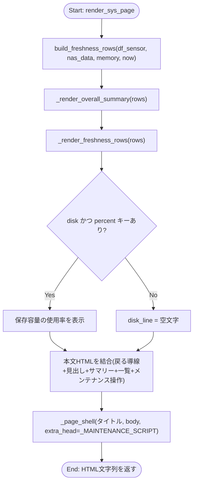

## 1. 解析メタ情報

| 項目 | 内容 |
| --- | --- |
| 対象ファイル | `dashboard_page_service.py` |
| 言語 | Python |
| 解析対象 | 提供されたコードのみ |
| 推測・補完 | 一切なし |

## 関連ドキュメント

* [home_status_service.md](./home_status_service.md) - カードの判定ロジック・HTML組み立て(`render_alerts_html`/`render_status_grid_html`/`format_relative_time`/`format_short_timestamp`/`latest_parking_motion_at`/`STATUS_CARD_CSS`/`STATUS_SECTION_ID`)の正
* [config.md](./config.md) - `ASSETS_DIR`/`CAMERAS`の提供元
* [analysis_service.md](./analysis_service.md) - `apply_friendly_names`の実体
* [dashboard_router.md](./dashboard_router.md) - 本ファイルの各`render_*`関数・`resolve_snapshot_path`の呼び出し元
* [camera_router.md](./camera_router.md) - `_CAMERA_SCRIPT`が呼ぶ`/api/cameras/live/{id}/stream.m3u8`の実体
* [system_router.md](./system_router.md) - `_MAINTENANCE_SCRIPT`が呼ぶ`/api/system/restart`・`/api/system/backup`の実体

## 2. ファイルの概要

ダッシュボード(かんたん表示)のホーム・見守り(`/watch`)・くらし(`/life`)・システム(`/sys`)の4ページのHTML組み立てを担うモジュール。Issue #829で、Streamlit版の「詳細表示」とStreamlitを介さない「かんたん表示」(ステータスカードのみの単一ページ)という2画面構成を廃止し、かんたん表示だけを唯一のダッシュボードとする方針変更に伴い新設された。ホーム画面からの導線としてカードだけでは足りなかった機能(カメラのライブ映像・スナップショットギャラリー・防犯ログ・実家センサーログ・メンテナンス操作)を、Streamlitに依存しないこのモジュールへ移設している。`home_status_service.py`と同じくStreamlitをimportせず、カードの判定・HTML組み立て自体は引き続き`home_status_service.py`が正である。

## 3. 外部依存関係

### インポート一覧

| 名称 | 種類 | 用途 | 根拠 |
| --- | --- | --- | --- |
| `glob` | 標準 | スナップショット画像ファイルの列挙 | 根拠: [インポート宣言] (行番号: 15 / 抜粋: "import glob") |
| `html` | 標準 | HTMLエスケープ(`html.escape`) | 根拠: [インポート宣言] (行番号: 16 / 抜粋: "import html") |
| `json` | 標準 | 自動更新スクリプトへのURL埋め込み(`json.dumps`) | 根拠: [インポート宣言] (行番号: 17 / 抜粋: "import json") |
| `os` | 標準 | パス操作(`os.path.join`/`os.path.realpath`等) | 根拠: [インポート宣言] (行番号: 18 / 抜粋: "import os") |
| `datetime.datetime` | 標準 | 型ヒント・時刻計算 | 根拠: [インポート宣言] (行番号: 19 / 抜粋: "from datetime import datetime") |
| `typing.Any` | 標準 | 型ヒント | 根拠: [インポート宣言] (行番号: 20 / 抜粋: "from typing import Any") |
| `config` | 外部 | `ASSETS_DIR`/`CAMERAS`の取得 | 根拠: [インポート宣言] (行番号: 22 / 抜粋: "import config") |
| `pandas` | 外部 | DataFrame操作 | 根拠: [インポート宣言] (行番号: 23 / 抜粋: "import pandas as pd") |
| `services.analysis_service` | 外部 | `apply_friendly_names`の呼び出し | 根拠: [インポート宣言] (行番号: 25 / 抜粋: "from services import analysis_service, home_status_service") |
| `services.home_status_service` | 外部 | カードのHTML組み立て・時刻表記・鮮度判定に使う定数 | 根拠: [インポート宣言] (行番号: 25 / 抜粋: "from services import analysis_service, home_status_service") |

### ブラックボックスとなる外部要素

| 名称 | 理由 | 根拠 |
| --- | --- | --- |
| `config.ASSETS_DIR` | NAS上のパスの実際の値・遅延解決の詳細は`config.py`側に依存し不明。 | 根拠: [変数参照] (行番号: 311, 324 / 抜粋: "img_dir = os.path.join(config.ASSETS_DIR, \"snapshots\")") |
| `config.CAMERAS` | 各カメラ設定(`id`/`name`/`enabled`)の実際の値は`config.py`(devices.json由来)に依存し不明。 | 根拠: [変数参照] (行番号: 441 / 抜粋: "for cam in config.CAMERAS") |
| `home_status_service.render_alerts_html`/`render_status_grid_html`等 | 実装(カードの並び・エスケープ処理)は`home_status_service.py`側にあり本ファイルからは呼び出しのみ。 | 根拠: [関数呼び出し] (行番号: 249〜250, 474 / 抜粋: "home_status_service.render_alerts_html(...)") |
| `/api/cameras/live/{id}/stream.m3u8`・`/api/system/restart`・`/api/system/backup` | クライアント側JS(`_CAMERA_SCRIPT`/`_MAINTENANCE_SCRIPT`)が`fetch`するエンドポイントの実装は本ファイルの外(`routers/camera_router.py`・`routers/system_router.py`)にある。 | 根拠: [JS文字列内] (行番号: 394, 622〜623) |

## 4. 主要要素の定義（関数 / エンドポイント / コンポーネント）

### `_PAGE_BASE_CSS`

* **役割**: 全ページ共通のCSS(ページ骨格・要約行・ナビ/リンクカード・簡易テーブル・スナップショットギャラリー・鮮度一覧・メンテナンス操作・カメラ選択の各見た目、およびダークモード対応)を保持するモジュール定数。
* 根拠: [定数宣言] (行番号: 29〜158 / 抜粋: '_PAGE_BASE_CSS = """\n    :root { color-scheme: light dark; }')

* **引数/リクエスト**: 該当なし
* 根拠: 同上

* **戻り値/レスポンス**: 該当なし
* 根拠: 同上

* **副作用**: なし
* 根拠: 同上

* **エラーハンドリング**: なし
* 根拠: 同上

### `_page_shell`

* **役割**: `<!DOCTYPE html>`から`</html>`までのページ全体の骨格を組み立てる。タイトル・共通CSS(`_PAGE_BASE_CSS`と`home_status_service.STATUS_CARD_CSS`)・任意の`extra_head`(スクリプト等)・本文HTMLを結合する。
* 根拠: [関数定義] (行番号: 161〜173 / 抜粋: "def _page_shell(title: str, body_html: str, *, extra_head: str = \"\") -> str:")

* **引数/リクエスト**: `title: str`, `body_html: str`, `extra_head: str = ""`(キーワード専用)
* 根拠: [関数定義] (行番号: 161)

* **戻り値/レスポンス**: `str`(HTML全体)
* 根拠: [戻り値] (行番号: 162〜173)

* **副作用**: なし(純粋関数)
* 根拠: [関数本体] (行番号: 162〜173)

* **エラーハンドリング**: なし
* 根拠: [関数本体] (行番号: 161〜173)

### `_back_to_home_link`

* **役割**: 各サブページ先頭に置く「← ホームへ戻る」リンクのHTMLを組み立てる。
* 根拠: [関数定義] (行番号: 176〜177 / 抜粋: 'def _back_to_home_link(dashboard_path: str) -> str:\n    return f\'
<a class="back-link" href="{html.escape(dashboard_path)}">← ホームへ戻る</a>
\'')

* **引数/リクエスト**: `dashboard_path: str`
* 根拠: [関数定義] (行番号: 176)

* **戻り値/レスポンス**: `str`(`
<a>`のHTML片)
* 根拠: [戻り値] (行番号: 177)

* **副作用**: なし
* 根拠: [関数本体] (行番号: 176〜177)

* **エラーハンドリング**: なし
* 根拠: [関数本体] (行番号: 176〜177)

### `_NAV_CARDS`

* **役割**: ホームページのナビカード3件(見守り/くらし/システム)の定義(キー・ラベル・補足文言のタプル)。キーはカードの`tab`と同じ値(`"watch"`/`"life"`/`"sys"`)を使う。
* 根拠: [定数宣言] (行番号: 183〜187 / 抜粋: '_NAV_CARDS: tuple[tuple[str, str, str], ...] = (\n    ("watch", "👀 見守り", "カメラ・実家の様子"),\n    ("life", "💡 くらし", "電気・炊飯器"),\n    ("sys", "🔧 システム", "各機能の状態"),\n)')

* **引数/リクエスト**: 該当なし
* 根拠: 同上

* **戻り値/レスポンス**: 該当なし
* 根拠: 同上

* **副作用**: なし
* 根拠: 同上

* **エラーハンドリング**: なし
* 根拠: 同上

### `render_home_page`

* **役割**: ホームページ全体(ステータスカード＋見守り/くらし/システムへのナビカード＋ファミクエ・あさノートの外部リンクカード)のHTMLを組み立てる。`manifest_path`/`icon_path`が両方渡されたときのみホーム画面追加用の`<head>`断片を先頭に足す。
* 根拠: [関数定義] (行番号: 190〜222 / 抜粋: "def render_home_page(\n    cards,\n    fetched_at: datetime,\n    *,\n    dashboard_path: str,\n    status_path: str,\n    quest_path: str,\n    asa_note_url: str,\n    refresh_sec: int,\n    manifest_path: str | None = None,\n    icon_path: str | None = None,\n) -> str:")

* **引数/リクエスト**: `cards`, `fetched_at: datetime`、キーワード専用で `dashboard_path: str`, `status_path: str`, `quest_path: str`, `asa_note_url: str`, `refresh_sec: int`, `manifest_path: str | None = None`, `icon_path: str | None = None`
* 根拠: [関数定義] (行番号: 190〜201)

* **戻り値/レスポンス**: `str`(ホームページ全体のHTML)
* 根拠: [戻り値] (行番号: 222 / 抜粋: 'return _page_shell("おうちの様子", body, extra_head=extra_head)')

* **副作用**: なし(渡された`cards`等から純粋にHTML文字列を組み立てるのみ)
* 根拠: [関数本体] (行番号: 203〜222)

* **エラーハンドリング**: なし(不正な`cards`等はそのまま呼び出し先の例外として伝播する)
* 根拠: [関数本体] (行番号: 190〜222。try/exceptが存在しないことを確認)

### `_home_screen_install_head`

* **役割**: ホーム画面に追加したときアドレスバー無し(standalone)で開くための`<head>`断片(`<link rel="manifest">`に`crossorigin="use-credentials"`付き、`apple-touch-icon`、各種metaタグ)を組み立てる。
* 根拠: [関数定義] (行番号: 225〜237 / 抜粋: "def _home_screen_install_head(manifest_path: str, icon_path: str) -> str:")

* **引数/リクエスト**: `manifest_path: str`, `icon_path: str`
* 根拠: [関数定義] (行番号: 225)

* **戻り値/レスポンス**: `str`(`<link>`/`<meta>`タグの連結)
* 根拠: [戻り値] (行番号: 231〜237)

* **副作用**: なし
* 根拠: [関数本体] (行番号: 225〜237)

* **エラーハンドリング**: なし
* 根拠: [関数本体] (行番号: 225〜237)

### `STATUS_SECTION_ID`

* **役割**: 自動更新で差し替える`
`の`id`(`home_status_service.STATUS_SECTION_ID`をそのまま再エクスポート)。
* 根拠: [定数宣言] (行番号: 241 / 抜粋: "STATUS_SECTION_ID = home_status_service.STATUS_SECTION_ID")

* **引数/リクエスト**: 該当なし
* 根拠: 同上

* **戻り値/レスポンス**: 該当なし
* 根拠: 同上

* **副作用**: なし
* 根拠: 同上

* **エラーハンドリング**: なし
* 根拠: 同上

### `_render_status_section` / `render_home_status_section`

* **役割**: 取得時刻・要約行(`home_status_service.render_alerts_html`)・カードのグリッド(`render_status_grid_html`)を`
`でまとめた1ブロックを組み立てる。`render_home_status_section`は`_render_status_section`をそのまま呼ぶ公開ラッパーで、ホームページの自動更新フラグメント(`GET {DASHBOARD_BASE_PATH}/status`)として使われる。
* 根拠: [関数定義] (行番号: 244〜252, 255〜257 / 抜粋: "def _render_status_section(cards, fetched_at: datetime, *, dashboard_path: str, refresh_sec: int) -> str:", "def render_home_status_section(cards, fetched_at: datetime, *, dashboard_path: str, refresh_sec: int) -> str:\n    \"\"\"ホームページの自動更新用フラグメント(カードのブロックだけ)。\"\"\"\n    return _render_status_section(cards, fetched_at, dashboard_path=dashboard_path, refresh_sec=refresh_sec)")

* **引数/リクエスト**: `cards`, `fetched_at: datetime`、キーワード専用で `dashboard_path: str`, `refresh_sec: int`
* 根拠: [関数定義] (行番号: 244, 255)

* **戻り値/レスポンス**: `str`(`
...
`)
* 根拠: [戻り値] (行番号: 245〜252)

* **副作用**: なし
* 根拠: [関数本体] (行番号: 244〜257)

* **エラーハンドリング**: なし
* 根拠: [関数本体] (行番号: 244〜257)

### `_status_refresh_script`

* **役割**: ホームページのカードブロックだけを差し替える自動更新JSを組み立てる。`status_path`を`intervalMs`(=`refresh_sec*1000`)間隔で`fetch`し、成功時は`outerHTML`を差し替え、失敗時は`#status`に`stale`クラスを付ける。タブが非表示のときは更新を止め、可視化されたら即座に更新する。
* 根拠: [関数定義] (行番号: 260〜294 / 抜粋: "def _status_refresh_script(status_path: str, refresh_sec: int) -> str:")

* **引数/リクエスト**: `status_path: str`, `refresh_sec: int`
* 根拠: [関数定義] (行番号: 260)

* **戻り値/レスポンス**: `str`(``)
* 根拠: [戻り値] (行番号: 262〜294)

* **副作用**: なし(文字列を組み立てるのみ。実際のfetch等はブラウザ側で実行される)
* 根拠: [関数本体] (行番号: 260〜294)

* **エラーハンドリング**: なし(生成されるJS自体はfetch失敗を`.catch`で捕捉するが、Python側の関数にエラーハンドリングは無い)
* 根拠: [JS文字列内] (行番号: 282〜285 / 抜粋: '.catch(function () {')

### `_list_snapshot_files`

* **役割**: `config.ASSETS_DIR/snapshots`配下のJPEGファイル名一覧を新しい順(ファイル名の降順ソート)に最大`_SNAPSHOT_GLOB_LIMIT`(20)件返す。`config.ASSETS_DIR`はNAS上のパスで遅延解決のためNAS障害に触れうるが、例外を握りつぶして空リストを返す。
* 根拠: [関数定義] (行番号: 303〜315 / 抜粋: "def _list_snapshot_files() -> list[str]:")、[例外処理] (行番号: 314〜315 / 抜粋: "except Exception:\n        return []")

* **引数/リクエスト**: なし
* 根拠: [関数定義] (行番号: 303)

* **戻り値/レスポンス**: `list[str]`(ファイル名のみ。パスは含まない)
* 根拠: [戻り値] (行番号: 313, 315 / 抜粋: "return [os.path.basename(p) for p in paths[:_SNAPSHOT_GLOB_LIMIT]]")

* **副作用**: `config.ASSETS_DIR`配下のファイルシステムアクセス(`glob.glob`)
* 根拠: [関数本体] (行番号: 311〜313)

* **エラーハンドリング**: `Exception`を捕捉し、空リストを返す(ページ全体を落とさない)。
* 根拠: [例外処理] (行番号: 314〜315)

### `resolve_snapshot_path`

* **役割**: 見守りページから要求された1件のスナップショットファイル名を、`config.ASSETS_DIR/snapshots`配下の実パスへ安全に解決する。パストラバーサル対策として、`os.path.realpath`で正規化した候補パスが`snapshots`ディレクトリの配下に収まっているか(`os.path.commonpath`)を検証する。
* 根拠: [関数定義] (行番号: 318〜332 / 抜粋: "def resolve_snapshot_path(filename: str) -> str | None:")、[パストラバーサル対策] (行番号: 327〜329 / 抜粋: 'candidate = os.path.realpath(os.path.join(base_dir, filename))\n    if os.path.commonpath([base_dir, candidate]) != base_dir:\n        return None')

* **引数/リクエスト**: `filename: str`
* 根拠: [関数定義] (行番号: 318)

* **戻り値/レスポンス**: `str | None`(解決できた絶対パス、またはNone)
* 根拠: [戻り値] (行番号: 326, 329, 331, 332)

* **副作用**: なし(ファイル存在確認`os.path.isfile`のみ。読み書きはしない)
* 根拠: [関数本体] (行番号: 330)

* **エラーハンドリング**: `config.ASSETS_DIR`解決時の`Exception`を捕捉してNoneを返す。パストラバーサル(範囲外)またはファイル非存在の場合もNoneを返す。
* 根拠: [例外処理] (行番号: 323〜326)、[条件分岐] (行番号: 328〜331)

### `_render_snapshot_gallery`

* **役割**: `_list_snapshot_files`の結果を最大`_SNAPSHOT_GALLERY_LIMIT`(8)件に絞り、``タグのグリッド(`snapshot-grid`)を組み立てる。ファイルが1件も無い場合は「写真なし」の注記を返す。
* 根拠: [関数定義] (行番号: 335〜343 / 抜粋: "def _render_snapshot_gallery(snapshot_url_prefix: str) -> str:")

* **引数/リクエスト**: `snapshot_url_prefix: str`(画像を配信するURLプレフィックス)
* 根拠: [関数定義] (行番号: 335)

* **戻り値/レスポンス**: `str`(`
`または「写真なし」の`
`)
* 根拠: [戻り値] (行番号: 338, 343)

* **副作用**: `_list_snapshot_files`経由でファイルシステムアクセス
* 根拠: [関数呼び出し] (行番号: 336)

* **エラーハンドリング**: なし(`_list_snapshot_files`側で握りつぶし済み)
* 根拠: [関数本体] (行番号: 335〜343)

### `_render_simple_table`

* **役割**: DataFrameをスマホ向けの簡易`<table>`に変換する。`columns`(元の列名→表示名)で指定した列だけを`limit`(既定50)行ぶん描画し、`timestamp`列は`home_status_service.format_relative_time`/`format_short_timestamp`で「MM/DD HH:MM (N分前)」形式に整形する。DataFrameが空、または指定列が1つも存在しない場合は「表示できるデータがありません」を返す。
* 根拠: [関数定義] (行番号: 346〜367 / 抜粋: "def _render_simple_table(df: pd.DataFrame, columns: dict[str, str], *, limit: int = 50) -> str:")

* **引数/リクエスト**: `df: pd.DataFrame`, `columns: dict[str, str]`、キーワード専用で `limit: int = 50`
* 根拠: [関数定義] (行番号: 346)

* **戻り値/レスポンス**: `str`(`<table class="simple-table">`、またはプレースホルダの`
`)
* 根拠: [戻り値] (行番号: 350, 367)

* **副作用**: なし(渡された`df`を読むのみ)
* 根拠: [関数本体] (行番号: 348〜367)

* **エラーハンドリング**: なし(欠損値は`pd.isna`で空文字に変換するのみで、例外処理は無い)
* 根拠: [関数本体] (行番号: 364 / 抜粋: 'text = "" if pd.isna(value) else str(value)')

### `_render_camera_selector`

* **役割**: カメラ一覧からカメラ切替ボタン(`onclick="dashboardSelectCamera(...)"`)と、選択中カメラのライブ映像を表示する`<video>`要素を組み立てる。カメラが1台も無い場合は「カメラが登録されていません」を返す。
* 根拠: [関数定義] (行番号: 370〜381 / 抜粋: "def _render_camera_selector(cameras: list[dict[str, Any]]) -> str:")

* **引数/リクエスト**: `cameras: list[dict[str, Any]]`(各要素は`id`/`name`キーを持つ)
* 根拠: [関数定義] (行番号: 370)

* **戻り値/レスポンス**: `str`(`camera-select-row`のボタン列＋`camera-video-box`の`<video>`、またはプレースホルダの`
`)
* 根拠: [戻り値] (行番号: 372, 378〜381)

* **副作用**: なし
* 根拠: [関数本体] (行番号: 370〜381)

* **エラーハンドリング**: なし(`cameras`の各要素が`id`/`name`キーを持たない場合は`KeyError`がそのまま伝播する)
* 根拠: [関数本体] (行番号: 374〜375 / 抜粋: 'cam["id"]', 'cam["name"]')

### `_CAMERA_SCRIPT`

* **役割**: hls.js(CDN読み込み)を使い、`dashboardSelectCamera(cameraId)`関数でカメラのライブHLS映像(`/api/cameras/live/{id}/stream.m3u8`)を`<video>`に切り替えるJS。選択結果は`localStorage`(`dashboardSelectedCamera`)に保存し、`DOMContentLoaded`時に前回選択(存在しなければ先頭のカメラ)を自動再生する。ブラウザがhls.jsに非対応でもネイティブHLS再生(`canPlayType`)に対応していればそちらへフォールバックする。
* 根拠: [定数宣言] (行番号: 384〜428 / 抜粋: '_CAMERA_SCRIPT = """\n')、[localStorage保存] (行番号: 411 / 抜粋: 'try { localStorage.setItem(STORAGE_KEY, cameraId); } catch (e) {}')、[初期選択] (行番号: 417〜425)

* **引数/リクエスト**: 該当なし(モジュール定数)
* 根拠: 同上

* **戻り値/レスポンス**: 該当なし
* 根拠: 同上

* **副作用**: ブラウザ側で`localStorage`の読み書き、`fetch`によるHLSセグメント取得、`<video>`要素の再生(Python側の実行時副作用は無い)
* 根拠: [JS文字列内] (行番号: 394, 411, 421)

* **エラーハンドリング**: `localStorage`アクセスは`try/catch`で握りつぶす(プライベートブラウジング等でのアクセス拒否対策)。
* 根拠: [JS文字列内] (行番号: 411, 421 / 抜粋: 'try { localStorage.setItem(STORAGE_KEY, cameraId); } catch (e) {}')

### `render_watch_page`

* **役割**: 👀見守りページ全体を組み立てる。`config.CAMERAS`から有効なカメラ一覧を作り、防犯ログ(`df_security_log`)に`analysis_service.apply_friendly_names`を適用し、`df_sensor`から`location == "高砂"`の行を抽出して、カメラ選択・スナップショットギャラリー・防犯ログ表・高砂実家センサーログ表の順に並べる。
* 根拠: [関数定義] (行番号: 431〜462 / 抜粋: "def render_watch_page(\n    df_sensor: pd.DataFrame,\n    df_security_log: pd.DataFrame,\n    *,\n    dashboard_path: str,\n    snapshot_url_prefix: str,\n) -> str:")

* **引数/リクエスト**: `df_sensor: pd.DataFrame`, `df_security_log: pd.DataFrame`、キーワード専用で `dashboard_path: str`, `snapshot_url_prefix: str`
* 根拠: [関数定義] (行番号: 431〜437)

* **戻り値/レスポンス**: `str`(見守りページ全体のHTML)
* 根拠: [戻り値] (行番号: 462 / 抜粋: 'return _page_shell("見守り - おうちの様子", body, extra_head=_CAMERA_SCRIPT)')

* **副作用**: なし(渡された`df_sensor`/`df_security_log`/`config.CAMERAS`を読むのみ)
* 根拠: [関数本体] (行番号: 439〜461)

* **エラーハンドリング**: なし(`config.CAMERAS`の各要素の欠損キーは`KeyError`として伝播しうる。`df_sensor`が空または`location`列が無い場合は空のDataFrameにフォールバックする)
* 根拠: [条件分岐] (行番号: 445〜448 / 抜粋: 'if not df_sensor.empty and "location" in df_sensor.columns:\n        df_takasago = df_sensor[df_sensor["location"] == "高砂"]\n    else:\n        df_takasago = df_sensor.iloc[0:0]')

### `render_life_page`

* **役割**: 💡くらしページを組み立てる。渡された`cards`のうち`group == "life"`のものだけを`home_status_service.render_status_grid_html`で描画し、「今月の電気代はスマートメーターの記録からの概算です」の注記を添える。
* 根拠: [関数定義] (行番号: 468〜477 / 抜粋: "def render_life_page(cards, *, dashboard_path: str) -> str:")

* **引数/リクエスト**: `cards`、キーワード専用で `dashboard_path: str`
* 根拠: [関数定義] (行番号: 468)

* **戻り値/レスポンス**: `str`(くらしページ全体のHTML)
* 根拠: [戻り値] (行番号: 477 / 抜粋: 'return _page_shell("くらし - おうちの様子", body)')

* **副作用**: なし
* 根拠: [関数本体] (行番号: 470〜477)

* **エラーハンドリング**: なし(各`card`が`.group`属性を持たない場合は`AttributeError`が伝播する)
* 根拠: [関数本体] (行番号: 470 / 抜粋: 'life_cards = [card for card in cards if card.group == "life"]')

### `FreshnessRow`

* **役割**: システムページの鮮度一覧1行を表す型エイリアス(ラベル・最終更新時刻・異常とみなす経過分数のタプル。分数が`None`なら情報表示のみ)。
* 根拠: [型宣言] (行番号: 482〜483 / 抜粋: "# (ラベル, 最終更新時刻を取り出す関数のキー, 異常とみなす経過分数。Noneは情報表示のみ)\nFreshnessRow = tuple[str, datetime | None, int | None]")

* **引数/リクエスト**: 該当なし
* 根拠: 同上

* **戻り値/レスポンス**: 該当なし
* 根拠: 同上

* **副作用**: なし
* 根拠: 同上

* **エラーハンドリング**: なし
* 根拠: 同上

### `_electric_last_updated`

* **役割**: `df_sensor`のうち`device_type`が`"Nature Remo E Lite"`/`"Plug"`/`"Meter"`のいずれかである行の最新`timestamp`を返す。該当行が無い、または列が欠けている場合は`None`。
* 根拠: [関数定義] (行番号: 486〜492 / 抜粋: 'def _electric_last_updated(df_sensor: pd.DataFrame) -> datetime | None:\n    if df_sensor.empty or "device_type" not in df_sensor.columns:\n        return None\n    df = df_sensor[df_sensor["device_type"].isin(["Nature Remo E Lite", "Plug", "Meter"])]\n    if df.empty:\n        return None\n    return df["timestamp"].max()')

* **引数/リクエスト**: `df_sensor: pd.DataFrame`
* 根拠: [関数定義] (行番号: 486)

* **戻り値/レスポンス**: `datetime | None`
* 根拠: [戻り値] (行番号: 488, 491, 492)

* **副作用**: なし
* 根拠: [関数本体] (行番号: 486〜492)

* **エラーハンドリング**: なし(空チェック・列存在チェックのみで、例外処理は無い)
* 根拠: [関数本体] (行番号: 487, 490)

### `build_freshness_rows`

* **役割**: システムページの「各機能の最終データ更新時刻」一覧(⚡電気・環境の見守り/🗄️保存装置(NAS)/🚗駐車場カメラ(参考)/🖥️サーバー本体)を組み立てる。内部の`_add`ヘルパーが、時刻が無ければ「データがありません」(閾値ありなら赤、無ければ情報表示)、閾値を超えていれば赤で「(更新が止まっています)」を付記、それ以外は閾値の有無に応じて`ok`/`info`状態にする。駐車場カメラはイベント駆動(動きがあった時だけ記録)のため閾値`None`で「更新が無い=異常」とはみなさない。サーバー本体は`memory`の有無だけで`ok`/`red`を決める。
* 根拠: [関数定義] (行番号: 495〜542 / 抜粋: "def build_freshness_rows(\n    df_sensor: pd.DataFrame,\n    nas_data: pd.Series | None,\n    memory: dict[str, float] | None,\n    now: datetime,\n) -> list[dict[str, Any]]:")、[閾値判定] (行番号: 509〜519 / 抜粋: "def _add(label: str, at: datetime | None, threshold_min: int | None):")

* **引数/リクエスト**: `df_sensor: pd.DataFrame`, `nas_data: pd.Series | None`, `memory: dict[str, float] | None`, `now: datetime`
* 根拠: [関数定義] (行番号: 495〜500)

* **戻り値/レスポンス**: `list[dict[str, Any]]`(各要素は`label`/`text`/`state`キーを持つ)
* 根拠: [戻り値] (行番号: 542 / 抜粋: "return rows")、[辞書組み立て] (行番号: 511, 516, 519, 536〜540)

* **副作用**: なし(渡された引数を読むのみ)
* 根拠: [関数本体] (行番号: 507〜540)

* **エラーハンドリング**: `nas_data["timestamp"]`の変換で`KeyError`/`TypeError`を捕捉し、`nas_at`を`None`にフォールバックする。
* 根拠: [例外処理] (行番号: 523〜530 / 抜粋: 'try:\n            nas_at = pd.to_datetime(nas_data["timestamp"], errors="coerce")\n            if pd.isna(nas_at):\n                nas_at = None\n        except (KeyError, TypeError):\n            nas_at = None')

### `_render_freshness_rows`

* **役割**: `build_freshness_rows`の戻り値を`
`の並びに変換する。`state`(`red`/`ok`/`info`)に応じてCSSクラス(`freshness-red`/`freshness-ok`/`freshness-info`)を付ける。
* 根拠: [関数定義] (行番号: 545〜552 / 抜粋: "def _render_freshness_rows(rows: list[dict[str, Any]]) -> str:")

* **引数/リクエスト**: `rows: list[dict[str, Any]]`
* 根拠: [関数定義] (行番号: 545)

* **戻り値/レスポンス**: `str`(`
`の連結)
* 根拠: [戻り値] (行番号: 547〜552)

* **副作用**: なし
* 根拠: [関数本体] (行番号: 545〜552)

* **エラーハンドリング**: なし(`row["state"]`が未知の値の場合、`state_class.get`が空文字にフォールバックする)
* 根拠: [関数本体] (行番号: 549 / 抜粋: 'state_class.get(row["state"], "")')

### `_render_overall_summary`

* **役割**: `build_freshness_rows`の戻り値のうち`state == "red"`の件数を数え、0件なら「✅ すべて正常です」、1件以上なら「⚠️ N件、確認が必要です」を返す(項目3の全体サマリー)。
* 根拠: [関数定義] (行番号: 555〜559 / 抜粋: "def _render_overall_summary(rows: list[dict[str, Any]]) -> str:")

* **引数/リクエスト**: `rows: list[dict[str, Any]]`
* 根拠: [関数定義] (行番号: 555)

* **戻り値/レスポンス**: `str`(`
`または`
`)
* 根拠: [戻り値] (行番号: 558, 559)

* **副作用**: なし
* 根拠: [関数本体] (行番号: 556〜559)

* **エラーハンドリング**: なし
* 根拠: [関数本体] (行番号: 555〜559)

### `render_sys_page`

* **役割**: 🔧システムページ全体を組み立てる。全体サマリー(`_render_overall_summary`)・各機能の最終更新一覧(`_render_freshness_rows`)・保存容量の使用率(`disk`があれば)・メンテナンス操作(サービス再起動の確認チェックボックス付きボタン、今すぐバックアップボタン)を並べる。
* 根拠: [関数定義] (行番号: 562〜601 / 抜粋: "def render_sys_page(\n    df_sensor: pd.DataFrame,\n    nas_data: pd.Series | None,\n    memory: dict[str, float] | None,\n    disk: dict[str, float] | None,\n    now: datetime,\n    *,\n    dashboard_path: str,\n) -> str:")

* **引数/リクエスト**: `df_sensor: pd.DataFrame`, `nas_data: pd.Series | None`, `memory: dict[str, float] | None`, `disk: dict[str, float] | None`, `now: datetime`、キーワード専用で `dashboard_path: str`
* 根拠: [関数定義] (行番号: 562〜570)

* **戻り値/レスポンス**: `str`(システムページ全体のHTML)
* 根拠: [戻り値] (行番号: 601 / 抜粋: 'return _page_shell("システム - おうちの様子", body, extra_head=_MAINTENANCE_SCRIPT)')

* **副作用**: なし(HTML文字列の組み立てのみ。実際のAPI呼び出しはクライアント側JS(`_MAINTENANCE_SCRIPT`)が行う)
* 根拠: [関数本体] (行番号: 572〜600)

* **エラーハンドリング**: なし
* 根拠: [関数本体] (行番号: 562〜601)

### `_MAINTENANCE_SCRIPT`

* **役割**: システムページのメンテナンス操作(再起動・バックアップ)ボタンから`POST /api/system/restart`・`POST /api/system/backup`を`fetch`するJS。共通ヘルパー`dashboardPost(url, resultId, busyText)`が実行中メッセージを表示し、レスポンスのJSON(`message`または`detail`)を結果欄に表示する。
* 根拠: [定数宣言] (行番号: 604〜625 / 抜粋: '_MAINTENANCE_SCRIPT = """\n<script>\nfunction dashboardPost(url, resultId, busyText) {')、[エンドポイント] (行番号: 622〜623 / 抜粋: 'function dashboardRestart() { dashboardPost("/api/system/restart", "restartResult", "再起動コマンドを送信しています..."); }\nfunction dashboardBackup() { dashboardPost("/api/system/backup", "backupResult", "バックアップ中..."); }')

* **引数/リクエスト**: 該当なし(モジュール定数)
* 根拠: 同上

* **戻り値/レスポンス**: 該当なし
* 根拠: 同上

* **副作用**: ブラウザ側でのHTTP POST実行(Python側の実行時副作用は無い)
* 根拠: [JS文字列内] (行番号: 609)

* **エラーハンドリング**: `fetch`の`.catch`で通信エラーを結果欄に表示する。
* 根拠: [JS文字列内] (行番号: 618〜620 / 抜粋: '.catch(function (e) {\n            box.textContent = "通信エラー: " + e;\n        });')

## 5. 処理フロー図

以下は`render_sys_page`(項目3の「全体サマリー・各機能の最終更新時刻・メンテナンス操作」を組み立てる中心的な関数)のフローチャートです。

## 6. 依存関係図

```mermaid
graph TD
    subgraph "dashboard_page_service.py"
        render_home_page
        render_watch_page
        render_life_page
        render_sys_page
        render_home_status_section
        resolve_snapshot_path
        build_freshness_rows
        _page_shell
        _back_to_home_link
        _render_camera_selector
        _render_snapshot_gallery
        _render_simple_table
        _render_freshness_rows
        _render_overall_summary
    end

    subgraph "外部モジュール"
        config
        analysis_service["services.analysis_service"]
        home_status_service["services.home_status_service"]
    end

    render_home_page --> _page_shell
    render_home_page --> render_home_status_section
    render_watch_page --> _page_shell
    render_watch_page --> _render_camera_selector
    render_watch_page --> _render_snapshot_gallery
    render_watch_page --> _render_simple_table
    render_watch_page --> config
    render_watch_page --> analysis_service
    render_life_page --> _page_shell
    render_life_page --> home_status_service
    render_sys_page --> _page_shell
    render_sys_page --> build_freshness_rows
    render_sys_page --> _render_freshness_rows
    render_sys_page --> _render_overall_summary
    build_freshness_rows --> home_status_service
    resolve_snapshot_path --> config
    _render_simple_table --> home_status_service
    _page_shell --> home_status_service
```

## 7. 次のステップ（リバースエンジニアリングの提案）

| 優先度 | ファイル名(推測可) | 理由 | 根拠 |
| --- | --- | --- | --- |
| 高 | `routers/dashboard_router.py` | 本ファイルの各`render_*`関数・`resolve_snapshot_path`の実際の呼び出し元(HTTPルーティング)を確認するため。 | 呼び出し元は本ファイル外にあり不明 |
| 高 | `services/home_status_service.py` | カードの判定ロジック・`render_alerts_html`/`render_status_grid_html`/`latest_parking_motion_at`等の実装を確認するため。 | 根拠: [インポート宣言] (行番号: 25) |
| 中 | `routers/camera_router.py` | `_CAMERA_SCRIPT`が呼ぶ`/api/cameras/live/{id}/stream.m3u8`の実装を確認するため。 | 根拠: [JS文字列内] (行番号: 394) |
| 中 | `routers/system_router.py` | `_MAINTENANCE_SCRIPT`が呼ぶ`/api/system/restart`・`/api/system/backup`の実装を確認するため。 | 根拠: [JS文字列内] (行番号: 622〜623) |

## 8. 保守上の注意点

* hls.jsは`https://cdn.jsdelivr.net/npm/hls.js@1/dist/hls.min.js`からCDN読み込みしている。LAN限定・オフライン環境ではカメラのライブ映像が表示できない(インターネット接続を前提とする)。
* `_render_simple_table`は`timestamp`という列名を特別扱いして相対時刻表記に変換する。それ以外の列名では常に`str(value)`をそのまま表示するため、日時以外の列を意図的に整形したい場合はこの関数の対象外になる。
* `resolve_snapshot_path`のパストラバーサル対策は`os.path.realpath`+`os.path.commonpath`によるもので、`camera_router.py`の`_resolve_segment_path`と同種の方式である。
* `render_home_page`は`manifest_path`と`icon_path`が両方揃わないとホーム画面追加用の`<head>`断片を出さない(片方だけを渡しても効果が無い)。

## 9. 不明事項一覧

| 項目 | 理由 | 必要なファイル |
| --- | --- | --- |
| `routers/dashboard_router.py`側のルーティング(各ページのURLパス、`dashboard_path`/`status_path`/`snapshot_url_prefix`等の実際の値) | 本ファイルは引数として受け取るのみで、呼び出し元のURL組み立てロジックは不明。 | `routers/dashboard_router.py` |
| `config.CAMERAS`の実際の中身(台数・`id`/`name`の値) | `devices.json`由来の設定値であり本ファイルからは不明。 | `config.py`, `devices.json` |
| `home_status_service.render_alerts_html`等の内部実装 | 本ファイルは呼び出すのみで実装は別ファイルにある。 | `services/home_status_service.py` |

## 10. 自己検証結果

* [x] 完了: 推測・外部ファイルの仕様を一切含んでいない
* [x] 完了: 全関数・全クラス・全コンポーネントを列挙した
* [x] 完了: 全てのインポート要素を列挙した
* [x] 完了: すべての仕様説明に「根拠（行番号・抜粋）」を明記した
* [x] 完了: 根拠漏れが0件である
* [x] 完了: Mermaid構文にエラーの原因となる記号（エスケープ漏れ）がない
* [x] 完了: 不明事項を漏れなく列挙した

完了
