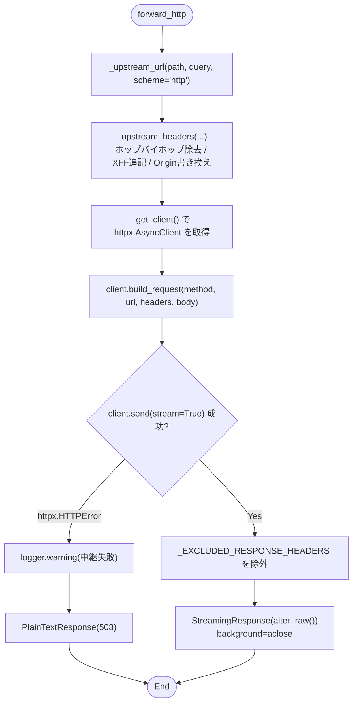
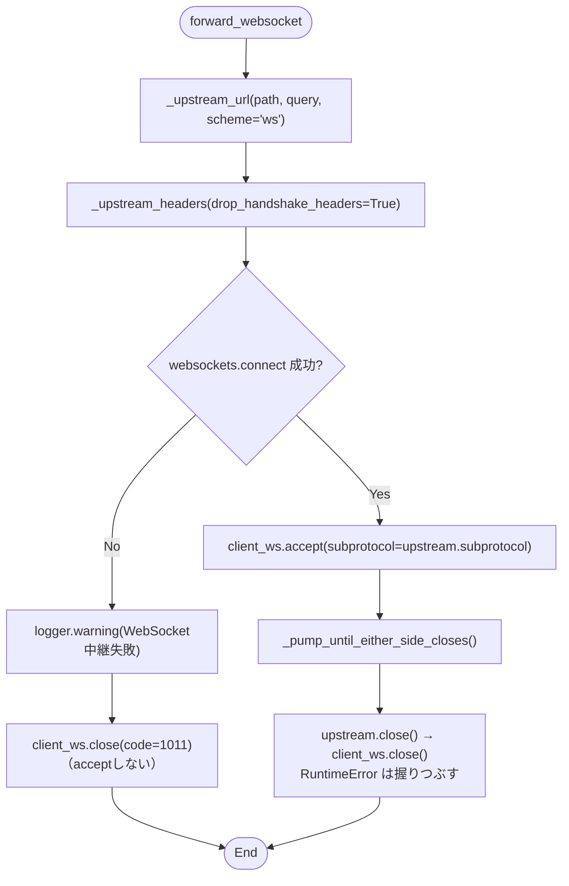

## 1. 解析メタ情報

| 項目 | 内容 |
| --- | --- |
| 対象ファイル | `services/dashboard_proxy_service.py` |
| 言語 | Python |
| 解析対象 | 提供されたコードのみ |
| 推測・補完 | 一切なし |

## 関連ドキュメント

* [dashboard_router.md](./dashboard_router.md) - 本サービスを呼び出す唯一のルーター（`config.DASHBOARD_BASE_PATH` 配下のルートを定義）
* [config.md](./config.md) - `DASHBOARD_INTERNAL_URL` / `DASHBOARD_BASE_PATH` / `DASHBOARD_PROXY_TIMEOUT_SEC` / `DASHBOARD_PROXY_ENABLED` の定義元
* [unified_server.md](./unified_server.md) - 本サービスの `aclose` を lifespan 終了時に呼び、`dashboard_router` を include する側
* [dashboard.md](./dashboard.md) - 中継先で動くStreamlitアプリ本体
* [start_all.md](./start_all.md) - 中継先のStreamlitを `--server.baseUrlPath` 付きで起動する側

## 2. ファイルの概要

`unified_server.py`（8000番）が受けたリクエストを、別プロセスで動くStreamlitダッシュボード（`config.DASHBOARD_INTERNAL_URL`、既定 `http://127.0.0.1:8501`）へ中継するリバースプロキシ。HTTPとWebSocketの双方を中継する。

ダッシュボードは認証機構を持たないため 127.0.0.1 束縛のままにし、外部（スマートフォン等）からの到達は、既にエッジのCloudflare Accessで保護されている `unified_server.py` 経由に一本化する、という構成のアプリ側の実装にあたる。モジュール末尾で `DashboardProxyService` のインスタンスをモジュールレベルのシングルトン `dashboard_proxy_service` として公開している。

## 3. 外部依存関係

### インポート一覧

| 名称 | 種類 | 用途 | 根拠 |
| --- | --- | --- | --- |
| `asyncio` | 標準 | クライアント生成の排他（`Lock`）、双方向転送タスクの生成・待機 | 根拠: [インポート宣言] (行番号: 29 / 抜粋: "import asyncio") |
| `logging` | 標準 | 中継失敗時の警告ログ | 根拠: [インポート宣言] (行番号: 30 / 抜粋: "import logging") |
| `typing` | 標準 | 型ヒントの提供（`Dict`, `Iterable`, `Optional`, `Tuple`） | 根拠: [インポート宣言] (行番号: 31 / 抜粋: "from typing import Dict, Iterable, Optional, Tuple") |
| `httpx` | 外部 | HTTP中継用の非同期クライアント | 根拠: [インポート宣言] (行番号: 33 / 抜粋: "import httpx") |
| `websockets` | 外部 | WebSocket中継用のクライアント（`websockets.connect`） | 根拠: [インポート宣言] (行番号: 34 / 抜粋: "import websockets") |
| `websockets.exceptions` | 外部 | 切断例外（`ConnectionClosed`）の捕捉 | 根拠: [インポート宣言] (行番号: 35 / 抜粋: "from websockets import exceptions as ws_exceptions") |
| `fastapi` | 外部 | 受け取るリクエスト／WebSocketの型（`Request`, `WebSocket`） | 根拠: [インポート宣言] (行番号: 36 / 抜粋: "from fastapi import Request, WebSocket") |
| `fastapi.responses` | 外部 | 返却するレスポンス型（`PlainTextResponse`, `StreamingResponse`） | 根拠: [インポート宣言] (行番号: 37 / 抜粋: "from fastapi.responses import PlainTextResponse, StreamingResponse") |
| `starlette.background` | 外部 | レスポンス送出後にアップストリームのストリームを閉じる `BackgroundTask` | 根拠: [インポート宣言] (行番号: 38 / 抜粋: "from starlette.background import BackgroundTask") |
| `starlette.websockets` | 外部 | ブラウザ側切断の例外 `WebSocketDisconnect` | 根拠: [インポート宣言] (行番号: 39 / 抜粋: "from starlette.websockets import WebSocketDisconnect") |
| `config` | 内部 | 中継先URL・ベースパス・タイムアウトの取得 | 根拠: [インポート宣言] (行番号: 41 / 抜粋: "import config") |

### ブラックボックスとなる外部要素

| 名称 | 理由 | 根拠 |
| --- | --- | --- |
| `config.DASHBOARD_INTERNAL_URL` | 中継先のホスト・ポートの実値は環境変数で上書き可能であり、本ファイルからは決まらない。 | 根拠: [変数参照] (行番号: 126, 167 / 抜粋: "base = config.DASHBOARD_INTERNAL_URL") |
| `config.DASHBOARD_PROXY_TIMEOUT_SEC` | タイムアウト秒数の実値が本ファイルからは不明。 | 根拠: [変数参照] (行番号: 103, 230 / 抜粋: "timeout=httpx.Timeout(config.DASHBOARD_PROXY_TIMEOUT_SEC)") |
| 中継先のStreamlitサーバー | 応答内容・WebSocketプロトコル（`_stcore/stream` のメッセージ形式）は別プロセスの実装であり、本ファイルは内容を解釈せずそのまま流す。 | 根拠: [転送処理] (行番号: 202〜208, 284〜288 / 抜粋: "upstream_response.aiter_raw()") |

## 4. 主要要素の定義（関数 / エンドポイント / コンポーネント）

### `logger`

* **役割**: モジュール名（`services.dashboard_proxy_service`）でロガーを取得し保持する。
* 根拠: [変数宣言] (行番号: 43 / 抜粋: "logger = logging.getLogger(__name__)")

* **引数/リクエスト**: 該当なし
* 根拠: [変数宣言] (行番号: 43 / 抜粋: "logger = logging.getLogger(__name__)")

* **戻り値/レスポンス**: 該当なし
* 根拠: [変数宣言] (行番号: 43 / 抜粋: "logger = logging.getLogger(__name__)")

* **副作用**: なし
* 根拠: [変数宣言] (行番号: 43 / 抜粋: "logger = logging.getLogger(__name__)")

* **エラーハンドリング**: なし
* 根拠: [変数宣言] (行番号: 43 / 抜粋: "logger = logging.getLogger(__name__)")

### `_HOP_BY_HOP_HEADERS`

* **役割**: 中継先へ転送しないホップバイホップヘッダー名（小文字）の集合。`connection` / `keep-alive` / `proxy-authenticate` / `proxy-authorization` / `te` / `trailer` / `trailers` / `transfer-encoding` / `upgrade` に加え、中継先のホストへ差し替えるため `host` も含む。
* 根拠: [定数宣言] (行番号: 47〜60 / 抜粋: "_HOP_BY_HOP_HEADERS = frozenset(")

* **引数/リクエスト**: 該当なし
* 根拠: [定数宣言] (行番号: 47〜60 / 抜粋: "_HOP_BY_HOP_HEADERS = frozenset(")

* **戻り値/レスポンス**: 該当なし
* 根拠: [定数宣言] (行番号: 47〜60 / 抜粋: "_HOP_BY_HOP_HEADERS = frozenset(")

* **副作用**: なし
* 根拠: [定数宣言] (行番号: 47〜60 / 抜粋: "_HOP_BY_HOP_HEADERS = frozenset(")

* **エラーハンドリング**: なし
* 根拠: [定数宣言] (行番号: 47〜60 / 抜粋: "_HOP_BY_HOP_HEADERS = frozenset(")

### `_WEBSOCKET_HANDSHAKE_HEADERS`

* **役割**: WebSocket中継時に追加で落とすハンドシェイク固有ヘッダー（`sec-websocket-key` / `sec-websocket-version` / `sec-websocket-extensions` / `sec-websocket-protocol`）の集合。`websockets` クライアントが自前で生成するため、ブラウザ由来の値を転送すると重複して接続が失敗する。
* 根拠: [定数宣言] (行番号: 64〜71 / 抜粋: "_WEBSOCKET_HANDSHAKE_HEADERS = frozenset(")

* **引数/リクエスト**: 該当なし
* 根拠: [定数宣言] (行番号: 64〜71 / 抜粋: "_WEBSOCKET_HANDSHAKE_HEADERS = frozenset(")

* **戻り値/レスポンス**: 該当なし
* 根拠: [定数宣言] (行番号: 64〜71 / 抜粋: "_WEBSOCKET_HANDSHAKE_HEADERS = frozenset(")

* **副作用**: なし
* 根拠: [定数宣言] (行番号: 64〜71 / 抜粋: "_WEBSOCKET_HANDSHAKE_HEADERS = frozenset(")

* **エラーハンドリング**: なし
* 根拠: [定数宣言] (行番号: 64〜71 / 抜粋: "_WEBSOCKET_HANDSHAKE_HEADERS = frozenset(")

### `_EXCLUDED_RESPONSE_HEADERS`

* **役割**: 中継先のレスポンスからブラウザへ引き継がないヘッダー名の集合。`_HOP_BY_HOP_HEADERS` に `content-length`・`date`・`server` を加えたもの。`date`/`server` は uvicorn が自前で付けるため、持ち越すと1レスポンスに2つずつ並ぶ（実機の `curl -D -` で確認した）。
* 根拠: [定数宣言] (行番号: 76 / 抜粋: '_EXCLUDED_RESPONSE_HEADERS = _HOP_BY_HOP_HEADERS | {"content-length", "date", "server"}')

* **引数/リクエスト**: 該当なし
* 根拠: [定数宣言] (行番号: 76 / 抜粋: '_EXCLUDED_RESPONSE_HEADERS = _HOP_BY_HOP_HEADERS | {"content-length", "date", "server"}')

* **戻り値/レスポンス**: 該当なし
* 根拠: [定数宣言] (行番号: 76 / 抜粋: '_EXCLUDED_RESPONSE_HEADERS = _HOP_BY_HOP_HEADERS | {"content-length", "date", "server"}')

* **副作用**: なし
* 根拠: [定数宣言] (行番号: 76 / 抜粋: '_EXCLUDED_RESPONSE_HEADERS = _HOP_BY_HOP_HEADERS | {"content-length", "date", "server"}')

* **エラーハンドリング**: なし
* 根拠: [定数宣言] (行番号: 76 / 抜粋: '_EXCLUDED_RESPONSE_HEADERS = _HOP_BY_HOP_HEADERS | {"content-length", "date", "server"}')

### `_UPSTREAM_UNAVAILABLE_MESSAGE`

* **役割**: 中継先へ接続できなかったときに503のボディとして返す日本語メッセージ。`home_dashboard.service` の起動確認を促す文言。
* 根拠: [定数宣言] (行番号: 77〜80 / 抜粋: "_UPSTREAM_UNAVAILABLE_MESSAGE = (")

* **引数/リクエスト**: 該当なし
* 根拠: [定数宣言] (行番号: 77〜80 / 抜粋: "_UPSTREAM_UNAVAILABLE_MESSAGE = (")

* **戻り値/レスポンス**: 該当なし
* 根拠: [定数宣言] (行番号: 77〜80 / 抜粋: "_UPSTREAM_UNAVAILABLE_MESSAGE = (")

* **副作用**: なし
* 根拠: [定数宣言] (行番号: 77〜80 / 抜粋: "_UPSTREAM_UNAVAILABLE_MESSAGE = (")

* **エラーハンドリング**: なし
* 根拠: [定数宣言] (行番号: 77〜80 / 抜粋: "_UPSTREAM_UNAVAILABLE_MESSAGE = (")

### `class DashboardProxyService`

* **役割**: Streamlitダッシュボードへのリバースプロキシ本体。docstringに、DIコンテナを導入しない既存方針（CLAUDE.md）に合わせて設定は都度 `config` から読む旨が記されている。
* 根拠: [クラス宣言] (行番号: 84〜306 / 抜粋: "class DashboardProxyService:")

* **引数/リクエスト**: 該当なし
* 根拠: [クラス宣言] (行番号: 84 / 抜粋: "class DashboardProxyService:")

* **戻り値/レスポンス**: 該当なし
* 根拠: [クラス宣言] (行番号: 84 / 抜粋: "class DashboardProxyService:")

* **副作用**: なし
* 根拠: [クラス宣言] (行番号: 84 / 抜粋: "class DashboardProxyService:")

* **エラーハンドリング**: なし
* 根拠: [クラス宣言] (行番号: 84 / 抜粋: "class DashboardProxyService:")

### `DashboardProxyService.__init__`

* **役割**: `_client`（`httpx.AsyncClient` または `None`）と `_client_lock`（`asyncio.Lock`）を初期化する。クライアントはimport時ではなく最初のリクエスト時に生成する方針がコメントに記されている。
* 根拠: [メソッド定義] (行番号: 91〜95 / 抜粋: "def __init__(self) -> None:")

* **引数/リクエスト**: `self` のみ
* 根拠: [メソッド定義] (行番号: 91 / 抜粋: "def __init__(self) -> None:")

* **戻り値/レスポンス**: `None`
* 根拠: [メソッド定義] (行番号: 91 / 抜粋: "def __init__(self) -> None:")

* **副作用**: インスタンス属性 `_client` / `_client_lock` の設定。
* 根拠: [代入] (行番号: 93〜94 / 抜粋: "self._client: Optional[httpx.AsyncClient] = None")

* **エラーハンドリング**: なし
* 根拠: [メソッド定義] (行番号: 91〜95 / 抜粋: "def __init__(self) -> None:")

### `DashboardProxyService._get_client`

* **役割**: `httpx.AsyncClient` を遅延生成して返す。未生成または既に閉じている場合のみ、`_client_lock` を取得したうえで二重チェックして生成する。タイムアウトは `config.DASHBOARD_PROXY_TIMEOUT_SEC`、`follow_redirects=False`（中継先が返すリダイレクトは追わずブラウザへそのまま返す）。
* 根拠: [メソッド定義] (行番号: 99〜110 / 抜粋: "async def _get_client(self) -> httpx.AsyncClient:")

* **引数/リクエスト**: `self` のみ
* 根拠: [メソッド定義] (行番号: 99 / 抜粋: "async def _get_client(self) -> httpx.AsyncClient:")

* **戻り値/レスポンス**: `httpx.AsyncClient`
* 根拠: [return文] (行番号: 109 / 抜粋: "return self._client")

* **副作用**: `self._client` への代入（接続プールの生成）。
* 根拠: [代入] (行番号: 102〜108 / 抜粋: "self._client = httpx.AsyncClient(")

* **エラーハンドリング**: なし（`try`/`except` を持たない）
* 根拠: [メソッド定義] (行番号: 99〜110 / 抜粋: "async def _get_client(self) -> httpx.AsyncClient:")

### `DashboardProxyService.aclose`

* **役割**: `unified_server.py` の lifespan 終了時に呼ぶ後始末。`_client` が存在し未クローズなら `aclose()` し、その後 `_client` を `None` に戻す。
* 根拠: [メソッド定義] (行番号: 112〜116 / 抜粋: "async def aclose(self) -> None:")

* **引数/リクエスト**: `self` のみ
* 根拠: [メソッド定義] (行番号: 112 / 抜粋: "async def aclose(self) -> None:")

* **戻り値/レスポンス**: `None`
* 根拠: [メソッド定義] (行番号: 112 / 抜粋: "async def aclose(self) -> None:")

* **副作用**: HTTP接続プールのクローズと `self._client = None`。
* 根拠: [代入] (行番号: 114〜115 / 抜粋: "await self._client.aclose()")

* **エラーハンドリング**: なし（呼び出し側の `unified_server.py` が `try`/`except` で包んでいる）
* 根拠: [メソッド定義] (行番号: 112〜116 / 抜粋: "async def aclose(self) -> None:")

### `DashboardProxyService._upstream_url`

* **役割**: 公開パス配下の `path` を、中継先の同じパスへ写像したURL文字列を返す。`scheme == "ws"` のときは `config.DASHBOARD_INTERNAL_URL` の `https://` → `wss://`、`http://` → `ws://` を各1回だけ置換する。`path` が `/` 始まりでなければ先頭に `/` を補い、`query_string` が空でなければ `?` で連結する（`latin-1` でデコード）。docstringに、Streamlitは `--server.baseUrlPath` 付きで起動するためベースパスを剥がさずそのまま渡す旨が記されている。
* 根拠: [メソッド定義] (行番号: 120〜135 / 抜粋: "def _upstream_url(self, path: str, query_string: bytes, *, scheme: str) -> str:")

* **引数/リクエスト**: `path: str`、`query_string: bytes`、キーワード専用の `scheme: str`
* 根拠: [メソッド定義] (行番号: 120 / 抜粋: "def _upstream_url(self, path: str, query_string: bytes, *, scheme: str) -> str:")

* **戻り値/レスポンス**: 連結済みのURL文字列
* 根拠: [return文] (行番号: 134 / 抜粋: "return url")

* **副作用**: なし
* 根拠: [メソッド定義] (行番号: 120〜135 / 抜粋: "def _upstream_url(self, path: str, query_string: bytes, *, scheme: str) -> str:")

* **エラーハンドリング**: なし
* 根拠: [メソッド定義] (行番号: 120〜135 / 抜粋: "def _upstream_url(self, path: str, query_string: bytes, *, scheme: str) -> str:")

### `DashboardProxyService._upstream_headers`

* **役割**: 中継先へ渡すヘッダー辞書を組み立てる。(1) `_HOP_BY_HOP_HEADERS`（`drop_handshake_headers=True` のときは `_WEBSOCKET_HANDSHAKE_HEADERS` も）に含まれる名前を小文字比較で除外する。(2) `client_host` があれば `x-forwarded-for` に追記（既存値があれば `", "` 区切りで連結）する。(3) `x-forwarded-proto` を `forwarded_proto` で設定する。(4) `origin` が存在する場合のみ `config.DASHBOARD_INTERNAL_URL` に書き換える。(4)についてはコメントに、Streamlit(Tornado)がOriginとHostの一致を検証するため書き換えないとハンドシェイクが拒否され画面が "Connecting..." のまま進まないこと、`--server.enableCORS false` / `--server.enableXsrfProtection false` による無効化の回避策を取らずに済ませるための処理であることが記されている。
* 根拠: [メソッド定義] (行番号: 137〜169 / 抜粋: "def _upstream_headers(")

* **引数/リクエスト**: `headers: Iterable[Tuple[str, str]]`、キーワード専用の `client_host: Optional[str]`・`forwarded_proto: str`・`drop_handshake_headers: bool = False`
* 根拠: [メソッド定義] (行番号: 136〜143 / 抜粋: "headers: Iterable[Tuple[str, str]],")

* **戻り値/レスポンス**: `Dict[str, str]`
* 根拠: [return文] (行番号: 168 / 抜粋: "return forwarded")

* **副作用**: なし（引数の辞書を変更せず新しい辞書を構築する）
* 根拠: [辞書内包表記] (行番号: 149〜151 / 抜粋: "forwarded: Dict[str, str] = {")

* **エラーハンドリング**: なし
* 根拠: [メソッド定義] (行番号: 137〜169 / 抜粋: "def _upstream_headers(")

### `DashboardProxyService._pin_accept_encoding` （静的メソッド）

* **役割**: 転送ヘッダーの `accept-encoding` を、ブラウザが送ってきた値に固定する（送ってこなければ `"identity"` を補う）。docstringに、httpxは明示しないと既定の `Accept-Encoding: gzip, deflate, ...` を付けるため、圧縮を要求していないクライアントにも中継先が gzip で返し、それをそのまま流してしまう（=クライアントが解凍できずバイナリのまま表示される）こと、ヘルスチェックや `Accept-Encoding` を送らないクライアントで実際に再現したことが記されている。
* 根拠: `def _pin_accept_encoding(headers: Dict[str, str]) -> Dict[str, str]:` (行番号: 172〜182 / 抜粋: "def _pin_accept_encoding(headers: Dict[str, str]) -> Dict[str, str]:")

* **引数/リクエスト**: `headers: Dict[str, str]`
* 根拠: (行番号: 172 / 抜粋: "def _pin_accept_encoding(headers: Dict[str, str]) -> Dict[str, str]:")

* **戻り値/レスポンス**: `accept-encoding` を補った新しい `Dict[str, str]`
* 根拠: `return pinned` (行番号: 182 / 抜粋: "return pinned")

* **副作用**: なし（引数の辞書を変更せずコピーを返す）
* 根拠: `pinned = dict(headers)` (行番号: 180 / 抜粋: "pinned = dict(headers)")

* **エラーハンドリング**: なし
* 根拠: (行番号: 172〜182 / 抜粋: "def _pin_accept_encoding(headers: Dict[str, str]) -> Dict[str, str]:")

### `DashboardProxyService.forward_http`

* **役割**: HTTPリクエストを中継先へ送り、レスポンスをストリームで返す。`_upstream_url`（`scheme="http"`）でURLを、`_upstream_headers` + `_pin_accept_encoding` でヘッダーを組み立て、`client.build_request` にリクエストボディ（`await request.body()`）を載せて `client.send(..., stream=True)` する。成功時は `_EXCLUDED_RESPONSE_HEADERS` を除いたヘッダーと中継先のステータスコードを持つ `StreamingResponse` を返し、ボディは `aiter_raw()` で無加工のまま流す。
* 根拠: [メソッド定義] (行番号: 186〜224 / 抜粋: "async def forward_http(self, request: Request, path: str) -> StreamingResponse | PlainTextResponse:")

* **引数/リクエスト**: `request: Request`（FastAPIのリクエスト）、`path: str`（中継先へ渡すパス）
* 根拠: [メソッド定義] (行番号: 186 / 抜粋: "async def forward_http(self, request: Request, path: str)")

* **戻り値/レスポンス**: 成功時は `StreamingResponse`、中継失敗時は本文が `_UPSTREAM_UNAVAILABLE_MESSAGE` の `PlainTextResponse`（ステータス503）
* 根拠: [return文] (行番号: 194, 202〜208 / 抜粋: "return PlainTextResponse(_UPSTREAM_UNAVAILABLE_MESSAGE, status_code=503)")

* **副作用**: 中継先へのHTTPリクエスト送信。レスポンス送出完了後に `BackgroundTask(upstream_response.aclose)` でストリームを閉じる（コメントに、閉じ忘れると接続プールを食いつぶす旨が記されている）。
* 根拠: [引数指定] (行番号: 206〜207 / 抜粋: "background=BackgroundTask(upstream_response.aclose),")

* **エラーハンドリング**: `httpx.HTTPError` を捕捉し、URLと例外内容を `logger.warning` に記録したうえで503を返す（コメントに「Streamlitが落ちている/起動途中でも、8000番側まで500にしない」と記載）。
* 根拠: [try/except] (行番号: 189〜194 / 抜粋: "except httpx.HTTPError as e:")

### `DashboardProxyService.forward_websocket`

* **役割**: StreamlitのWebSocket（`_stcore/stream`）を双方向に中継する。`_upstream_url`（`scheme="ws"`）でURLを組み立て、ブラウザが要求したサブプロトコル（`scope["subprotocols"]`）と `drop_handshake_headers=True` で組み立てたヘッダーを渡して `websockets.connect` する。接続オプションは `max_size=None`（コメント: Streamlitのメッセージはデフォルト上限1MiBを超えうる）、`open_timeout=config.DASHBOARD_PROXY_TIMEOUT_SEC`、`ping_interval=None`（コメント: 中継区間で独自にpingを打って切断判定を二重化しない）。接続後にブラウザ側を `accept(subprotocol=upstream.subprotocol)` し、`_pump_until_either_side_closes` で転送する。
* 根拠: [メソッド定義] (行番号: 228〜267 / 抜粋: "async def forward_websocket(self, client_ws: WebSocket, path: str) -> None:")

* **引数/リクエスト**: `client_ws: WebSocket`（ブラウザ側の接続）、`path: str`
* 根拠: [メソッド定義] (行番号: 228 / 抜粋: "async def forward_websocket(self, client_ws: WebSocket, path: str) -> None:")

* **戻り値/レスポンス**: `None`
* 根拠: [メソッド定義] (行番号: 228 / 抜粋: "async def forward_websocket(self, client_ws: WebSocket, path: str) -> None:")

* **副作用**: 中継先へのWebSocket接続の確立・切断、ブラウザ側接続の `accept` / `close`。
* 根拠: [呼び出し] (行番号: 224, 242, 245, 247 / 抜粋: "upstream = await websockets.connect(")

* **エラーハンドリング**: 接続時の例外はすべて捕捉し、URLと例外内容を `logger.warning` に記録したうえで `accept` せずに `close(code=1011)` する（コメント: accept前に閉じることでブラウザ側には接続失敗として伝わる）。転送後の `finally` では中継先を閉じ、ブラウザ側の `close()` が `RuntimeError`（既に切断済み）を出した場合は正常終了として握りつぶす。
* 根拠: [try/except] (行番号: 235〜239, 244〜251 / 抜粋: "except RuntimeError:")

### `DashboardProxyService._pump_until_either_side_closes`

* **役割**: `_client_to_upstream` と `_upstream_to_client` をタスクとして起動し、`asyncio.wait(..., return_when=asyncio.FIRST_COMPLETED)` でどちらかの完了を待つ。`finally` で両タスクを `cancel()` し、`asyncio.gather(..., return_exceptions=True)` で回収する。
* 根拠: [メソッド定義] (行番号: 269〜280 / 抜粋: "async def _pump_until_either_side_closes(self, client_ws: WebSocket, upstream) -> None:")

* **引数/リクエスト**: `client_ws: WebSocket`、`upstream`（型注釈なし。`websockets.connect` の戻り値）
* 根拠: [メソッド定義] (行番号: 269 / 抜粋: "async def _pump_until_either_side_closes(self, client_ws: WebSocket, upstream) -> None:")

* **戻り値/レスポンス**: `None`
* 根拠: [メソッド定義] (行番号: 269 / 抜粋: "async def _pump_until_either_side_closes(self, client_ws: WebSocket, upstream) -> None:")

* **副作用**: 2つのasyncioタスクの生成とキャンセル。
* 根拠: [呼び出し] (行番号: 255〜258, 262〜264 / 抜粋: "asyncio.create_task(self._client_to_upstream(client_ws, upstream)),")

* **エラーハンドリング**: `try`/`finally` によるタスクの確実なキャンセルと、`gather(return_exceptions=True)` による例外の握りつぶし。
* 根拠: [try/finally] (行番号: 259〜264 / 抜粋: "await asyncio.gather(*tasks, return_exceptions=True)")

### `DashboardProxyService._client_to_upstream`

* **役割**: ブラウザ→中継先方向の転送。`client_ws.receive()` を繰り返し、`type` が `"websocket.disconnect"` なら終了、`text` があればそれを、なければ `bytes` を中継先へ `send` する。
* 根拠: [メソッド定義] (行番号: 282〜296 / 抜粋: "async def _client_to_upstream(self, client_ws: WebSocket, upstream) -> None:")

* **引数/リクエスト**: `client_ws: WebSocket`、`upstream`
* 根拠: [メソッド定義] (行番号: 282 / 抜粋: "async def _client_to_upstream(self, client_ws: WebSocket, upstream) -> None:")

* **戻り値/レスポンス**: `None`
* 根拠: [return文] (行番号: 271, 280 / 抜粋: "return")

* **副作用**: 中継先WebSocketへの送信。
* 根拠: [呼び出し] (行番号: 274, 278 / 抜粋: "await upstream.send(text)")

* **エラーハンドリング**: `WebSocketDisconnect` と `ws_exceptions.ConnectionClosed` を捕捉して正常終了する。
* 根拠: [try/except] (行番号: 279〜280 / 抜粋: "except (WebSocketDisconnect, ws_exceptions.ConnectionClosed):")

### `DashboardProxyService._upstream_to_client`

* **役割**: 中継先→ブラウザ方向の転送。`async for` で受け取ったメッセージが `str` なら `send_text`、それ以外は `send_bytes` でブラウザへ送る。
* 根拠: [メソッド定義] (行番号: 298〜306 / 抜粋: "async def _upstream_to_client(self, client_ws: WebSocket, upstream) -> None:")

* **引数/リクエスト**: `client_ws: WebSocket`、`upstream`
* 根拠: [メソッド定義] (行番号: 298 / 抜粋: "async def _upstream_to_client(self, client_ws: WebSocket, upstream) -> None:")

* **戻り値/レスポンス**: `None`
* 根拠: [return文] (行番号: 290 / 抜粋: "return")

* **副作用**: ブラウザ側WebSocketへの送信。
* 根拠: [呼び出し] (行番号: 286, 288 / 抜粋: "await client_ws.send_text(message)")

* **エラーハンドリング**: `WebSocketDisconnect`・`ws_exceptions.ConnectionClosed`・`RuntimeError` を捕捉して正常終了する。
* 根拠: [try/except] (行番号: 289〜290 / 抜粋: "except (WebSocketDisconnect, ws_exceptions.ConnectionClosed, RuntimeError):")

### `dashboard_proxy_service`

* **役割**: `DashboardProxyService` のモジュールレベルのシングルトン。コメントに、CLAUDE.mdの方針どおりサービスはモジュールレベルのシングルトンとして公開する旨が記されている。
* 根拠: [変数宣言] (行番号: 293〜294 / 抜粋: "dashboard_proxy_service = DashboardProxyService()")

* **引数/リクエスト**: 該当なし
* 根拠: [変数宣言] (行番号: 294 / 抜粋: "dashboard_proxy_service = DashboardProxyService()")

* **戻り値/レスポンス**: 該当なし
* 根拠: [変数宣言] (行番号: 294 / 抜粋: "dashboard_proxy_service = DashboardProxyService()")

* **副作用**: import時にインスタンスが1つ生成される（`httpx.AsyncClient` はこの時点では作られない）。
* 根拠: [変数宣言] (行番号: 294 / 抜粋: "dashboard_proxy_service = DashboardProxyService()")

* **エラーハンドリング**: なし
* 根拠: [変数宣言] (行番号: 294 / 抜粋: "dashboard_proxy_service = DashboardProxyService()")

## 5. 処理フロー図

### `forward_http`

### `forward_websocket`

## 6. 依存関係図

```mermaid
graph TD
    subgraph "dashboard_proxy_service.py"
        logger
        HopByHop["_HOP_BY_HOP_HEADERS"]
        WsHandshake["_WEBSOCKET_HANDSHAKE_HEADERS"]
        ExcludedRes["_EXCLUDED_RESPONSE_HEADERS"]
        UnavailableMsg["_UPSTREAM_UNAVAILABLE_MESSAGE"]
        GetClient["_get_client"]
        Aclose["aclose"]
        UpstreamUrl["_upstream_url"]
        UpstreamHeaders["_upstream_headers"]
        ForwardHttp["forward_http"]
        ForwardWs["forward_websocket"]
        Pump["_pump_until_either_side_closes"]
        C2U["_client_to_upstream"]
        U2C["_upstream_to_client"]
        Singleton["dashboard_proxy_service"]
    end

    subgraph "外部モジュール"
        config
        httpx
        websockets
        starlette["starlette.background / starlette.websockets"]
        fastapi["fastapi / fastapi.responses"]
    end

    GetClient --> config
    GetClient --> httpx
    UpstreamUrl --> config
    UpstreamHeaders --> HopByHop
    UpstreamHeaders --> WsHandshake
    UpstreamHeaders --> config

    ForwardHttp --> UpstreamUrl
    ForwardHttp --> UpstreamHeaders
    ForwardHttp --> GetClient
    ForwardHttp --> ExcludedRes
    ForwardHttp --> UnavailableMsg
    ForwardHttp --> httpx
    ForwardHttp --> starlette
    ForwardHttp --> fastapi
    ForwardHttp --> logger

    ForwardWs --> UpstreamUrl
    ForwardWs --> UpstreamHeaders
    ForwardWs --> websockets
    ForwardWs --> config
    ForwardWs --> Pump
    ForwardWs --> logger

    Pump --> C2U
    Pump --> U2C
    C2U --> websockets
    U2C --> websockets

    Singleton --> GetClient
    Aclose --> httpx
```

## 7. 次のステップ（リバースエンジニアリングの提案）

| 優先度 | ファイル名(推測可) | 理由 | 根拠 |
| --- | --- | --- | --- |
| 高 | `routers/dashboard_router.py` | 本サービスに渡される `path` の組み立て方と、公開パスの登録方法を把握するため。 | 根拠: 本ファイルは `path` を受け取るだけで組み立てていない (行番号: 172, 212) |
| 高 | `config.py` | `DASHBOARD_INTERNAL_URL` / `DASHBOARD_BASE_PATH` / `DASHBOARD_PROXY_TIMEOUT_SEC` の既定値と上書き方法を確認するため。 | 根拠: `config` からの変数読み込み (行番号: 103, 126, 167, 230) |
| 中 | `unified_server.py` | `aclose` を呼ぶ lifespan と、ルーターのinclude条件（`DASHBOARD_PROXY_ENABLED`）を確認するため。 | 根拠: `aclose` のdocstring (行番号: 112) |
| 中 | `deploy/systemd/home_dashboard.service` / `start_all.sh` | 中継先のStreamlitが `--server.baseUrlPath` をどう指定して起動されるかを確認するため。 | 根拠: モジュールdocstring (行番号: 25〜27) |

## 8. 保守上の注意点

* **公開パスをCloudflare Accessのバイパス対象にしてはならない。** モジュールdocstringにあるとおり、この経路の外部アクセス制御はエッジのCloudflare Accessに委譲している（Issue #321・2026-09-03決定）。`unified_server.py` の `allowed_webhook_paths`（外部到達が必要なWebhook）とは目的が逆で、バイパスすると無認証でダッシュボードが外部公開される。
* **Streamlit側の `--server.baseUrlPath` と `config.DASHBOARD_BASE_PATH` は一致している必要がある。** `_upstream_url` はベースパスを剥がさずそのまま中継先へ渡すため、ずれると静的アセットのURLが合わず画面が正しく表示されない。
* **`origin` の書き換えを外すとWebSocketのハンドシェイクが拒否される。** `_upstream_headers` の該当処理（行番号: 166〜167）は、Streamlit側の `--server.enableCORS false` / `--server.enableXsrfProtection false` という保護の無効化を避けるための代替手段としてコメントに明記されている。
* `upstream` 引数（`_pump_until_either_side_closes` / `_client_to_upstream` / `_upstream_to_client`）には型注釈が付いていない。
* `forward_http` は `await request.body()` でリクエストボディを一度メモリに読み切ってから送信する（レスポンス側はストリームだが、リクエスト側はストリームではない）。
* `_get_client` は `_client_lock` で二重チェックロックを行うが、`aclose` 側はロックを取らない。

## 9. 不明事項一覧

| 項目 | 理由 | 必要なファイル |
| --- | --- | --- |
| `config.DASHBOARD_*` の既定値 | 本ファイルからは参照しているだけで、既定値・環境変数名が不明。 | `config.py`、`.env.example` |
| 本サービスを呼ぶルートのパス構成 | `path` 引数に何が渡るか（ベースパスを含むか等）は呼び出し元次第で、本ファイルからは決まらない。 | `routers/dashboard_router.py` |
| 中継先Streamlitの起動引数 | `--server.baseUrlPath` の実際の指定値が本ファイルからは不明。 | `deploy/systemd/home_dashboard.service`、`start_all.sh` |

## 10. 自己検証結果

* [x] 完了: 推測・外部ファイルの仕様を一切含んでいない
* [x] 完了: 全関数・全クラス・全コンポーネントを列挙した
* [x] 完了: 全てのインポート要素を列挙した
* [x] 完了: すべての仕様説明に「根拠（行番号・抜粋）」を明記した
* [x] 完了: 根拠漏れが0件である
* [x] 完了: Mermaid構文にエラーの原因となる記号（エスケープ漏れ）がない
