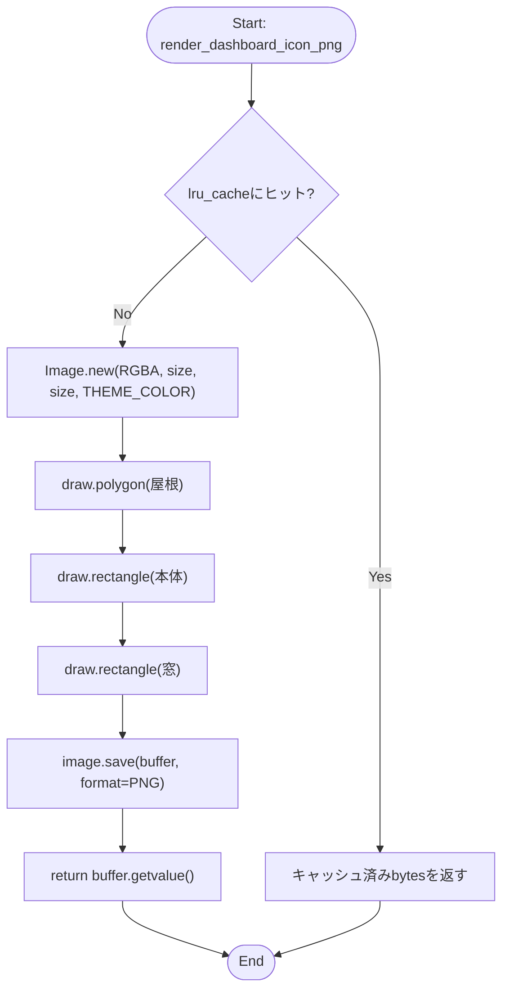
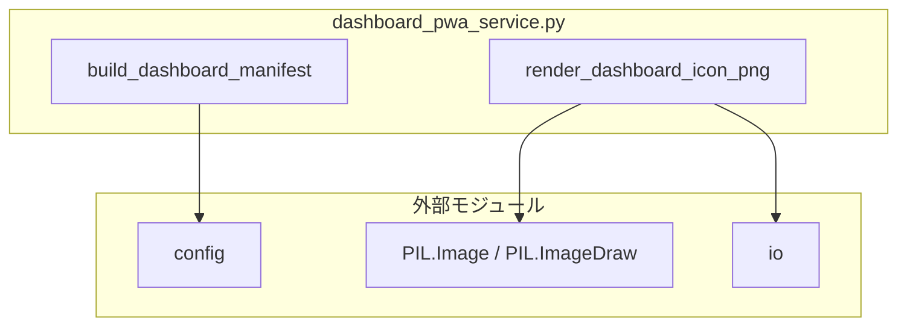

## 1. 解析メタ情報

| 項目 | 内容 |
| --- | --- |
| 対象ファイル | `dashboard_pwa_service.py` |
| 言語 | Python |
| 解析対象 | 提供されたコードのみ |
| 推測・補完 | 一切なし |

## 関連ドキュメント

* [config.md](./config.md) - `DASHBOARD_BASE_PATH` を提供
* [dashboard_router.md](./dashboard_router.md) - `build_dashboard_manifest`/`render_dashboard_icon_png`/`DASHBOARD_ICON_SIZES` の呼び出し元
* [dashboard_proxy_service.md](./dashboard_proxy_service.md) - Issue #829 で廃止されたStreamlit版逆プロキシ。本ファイルはそのマニフェスト・アイコン生成部分を引き継いだもの

## 2. ファイルの概要

ダッシュボード(`routers/dashboard_router.py`)をスマートフォンのホーム画面に追加するための付帯物(PWA Webアプリマニフェスト・ホーム画面アイコンのPNG)を組み立てるモジュール。Issue #829でStreamlit版ダッシュボードへの逆プロキシ(`dashboard_proxy_service.py`)を廃止した際、そのモジュールが持っていたマニフェスト・アイコン生成部分だけを独立させて残したもの。

## 3. 外部依存関係

### インポート一覧

| 名称 | 種類 | 用途 | 根拠 |
| --- | --- | --- | --- |
| `io` | 標準 | PNGバイト列を保持するバッファ(`BytesIO`) | 根拠: [インポート宣言] (行番号: 12 / 抜粋: "import io") |
| `functools.lru_cache` | 標準 | `render_dashboard_icon_png` の結果をサイズごとにキャッシュ | 根拠: [インポート宣言] (行番号: 13 / 抜粋: "from functools import lru_cache") |
| `config` | 外部 | `DASHBOARD_BASE_PATH` の取得 | 根拠: [インポート宣言] (行番号: 15 / 抜粋: "import config") |
| `PIL.Image` / `PIL.ImageDraw` | 外部 | アイコンPNGの図形描画 | 根拠: [関数内インポート] (行番号: 64 / 抜粋: "from PIL import Image, ImageDraw") |

### ブラックボックスとなる外部要素

| 名称 | 理由 | 根拠 |
| --- | --- | --- |
| `config.DASHBOARD_BASE_PATH` | 実際の値(既定 `/dashboard` かどうか)は `config.py` 側の定義に依存し、本ファイルからは不明。 | 根拠: [変数参照] (行番号: 34 / 抜粋: "base = config.DASHBOARD_BASE_PATH") |

## 4. 主要要素の定義（関数 / エンドポイント / コンポーネント）

### `DASHBOARD_APP_NAME` / `DASHBOARD_APP_SHORT_NAME` / `DASHBOARD_THEME_COLOR` / `DASHBOARD_BACKGROUND_COLOR` / `DASHBOARD_ICON_SIZES`

* **役割**: ホーム画面に追加したときの表示名(`"My Home Dashboard"`/`"おうち"`)・配色(`#0d47a1`/`#ffffff`)・生成するアイコンサイズ(180/192/512px)を定義するモジュール定数。
* 根拠: [定数宣言] (行番号: 18〜24 / 抜粋: 'DASHBOARD_APP_NAME = "My Home Dashboard"\nDASHBOARD_APP_SHORT_NAME = "おうち"\nDASHBOARD_THEME_COLOR = "#0d47a1"\nDASHBOARD_BACKGROUND_COLOR = "#ffffff"\n\n# PWAマニフェストとapple-touch-iconで参照するアイコンのサイズ(px)。\nDASHBOARD_ICON_SIZES = (180, 192, 512)')

* **引数/リクエスト**: 該当なし
* 根拠: 同上

* **戻り値/レスポンス**: 該当なし
* 根拠: 同上

* **副作用**: なし
* 根拠: 同上

* **エラーハンドリング**: なし
* 根拠: 同上

### `build_dashboard_manifest`

* **役割**: ホーム画面に追加するためのWebアプリマニフェスト(dict)を組み立てる。`start_url`/`scope`を`config.DASHBOARD_BASE_PATH`配下に閉じ、`icons`は`DASHBOARD_ICON_SIZES`各サイズぶんのエントリ(`src`は`{base}/icon-{size}.png`)を持つ。
* 根拠: [関数定義] (行番号: 27〜54 / 抜粋: "def build_dashboard_manifest() -> dict:")

* **引数/リクエスト**: なし
* 根拠: [関数定義] (行番号: 27 / 抜粋: "def build_dashboard_manifest() -> dict:")

* **戻り値/レスポンス**: `dict`(`name`/`short_name`/`lang`/`start_url`/`scope`/`display`/`orientation`/`background_color`/`theme_color`/`icons`の各キーを持つマニフェスト)
* 根拠: [戻り値] (行番号: 35〜54 / 抜粋: "return {\n        \"name\": DASHBOARD_APP_NAME,")

* **副作用**: なし(純粋関数)
* 根拠: [関数本体] (行番号: 34〜54)

* **エラーハンドリング**: なし
* 根拠: [関数本体] (行番号: 27〜54)

### `render_dashboard_icon_png`

* **役割**: ホーム画面アイコンのPNGをサイズごとに1回だけ描画し、`lru_cache`でキャッシュする。絵文字やシステムフォントに依存すると実機で崩れうるため、屋根(三角)・本体(四角)・窓(本体をくり抜いた四角)の3つの図形だけで家のアイコンを描く。
* 根拠: [関数定義] (行番号: 58〜82 / 抜粋: "def render_dashboard_icon_png(size: int) -> bytes:")、[キャッシュ] (行番号: 57 / 抜粋: "@lru_cache(maxsize=len(DASHBOARD_ICON_SIZES))")

* **引数/リクエスト**: `size: int`(生成するアイコンの一辺のピクセル数)
* 根拠: [関数定義] (行番号: 58 / 抜粋: "def render_dashboard_icon_png(size: int) -> bytes:")

* **戻り値/レスポンス**: `bytes`(PNG形式の画像データ)
* 根拠: [戻り値] (行番号: 82 / 抜粋: "return buffer.getvalue()")

* **副作用**: なし(戻り値はメモリ上のバイト列のみで、ファイル・ネットワークI/Oは行わない)
* 根拠: [関数本体] (行番号: 64〜82)

* **エラーハンドリング**: なし(`size`が不正な値でもPillow側の例外がそのまま呼び出し元へ伝播する)
* 根拠: [関数本体] (行番号: 64〜82。try/exceptが存在しないことを確認)

## 5. 処理フロー図

## 6. 依存関係図

## 7. 次のステップ（リバースエンジニアリングの提案）

| 優先度 | ファイル名(推測可) | 理由 | 根拠 |
| --- | --- | --- | --- |
| 高 | `routers/dashboard_router.py` | `build_dashboard_manifest`/`render_dashboard_icon_png`/`DASHBOARD_ICON_SIZES`の実際の呼び出し元(マニフェスト・アイコンのHTTPエンドポイント)を確認するため。 | 呼び出し元は本ファイル外にあり不明 |
| 中 | `config.py` | `DASHBOARD_BASE_PATH`の実際の値・環境変数上書きの可否を確認するため。 | 根拠: [変数参照] (行番号: 34) |

## 8. 保守上の注意点

* `render_dashboard_icon_png`は`lru_cache`でプロセス生存期間中キャッシュされる。`DASHBOARD_THEME_COLOR`等の見た目を変更する場合、既存プロセスはキャッシュ済みの古い画像を返し続ける(プロセス再起動まで反映されない)。
* アイコンサイズは`DASHBOARD_ICON_SIZES`(180/192/512)に固定されており、これ以外のサイズを`render_dashboard_icon_png`に渡すこと自体は関数レベルでは制限していない(呼び出し元がバリデーションする前提)。

## 9. 不明事項一覧

| 項目 | 理由 | 必要なファイル |
| --- | --- | --- |
| `config.DASHBOARD_BASE_PATH`の実際の値 | 本ファイルは`config`モジュールを参照するのみで、値の定義は`config.py`側にあるため。 | `config.py` |
| マニフェスト・アイコンを実際に配信するHTTPエンドポイント | 本ファイルはdict/bytesを返す関数のみを提供し、ルーティングは持たないため。 | `routers/dashboard_router.py` |

## 10. 自己検証結果

* [x] 完了: 推測・外部ファイルの仕様を一切含んでいない
* [x] 完了: 全関数・全クラス・全コンポーネントを列挙した
* [x] 完了: 全てのインポート要素を列挙した
* [x] 完了: すべての仕様説明に「根拠（行番号・抜粋）」を明記した
* [x] 完了: 根拠漏れが0件である
* [x] 完了: Mermaid構文にエラーの原因となる記号（エスケープ漏れ）がない
* [x] 完了: 不明事項を漏れなく列挙した

完了
