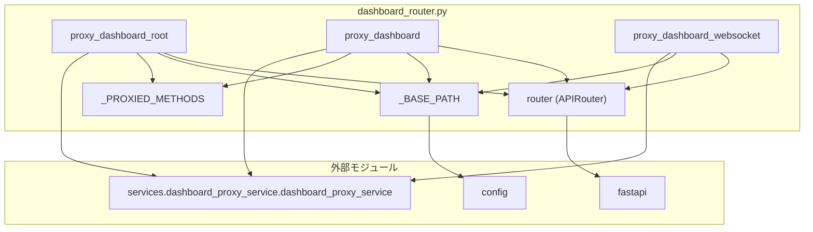

## 1. 解析メタ情報

| 項目 | 内容 |
| --- | --- |
| 対象ファイル | `routers/dashboard_router.py` |
| 言語 | Python |
| 解析対象 | 提供されたコードのみ |
| 推測・補完 | 一切なし |

## 関連ドキュメント

* [dashboard_proxy_service.md](./dashboard_proxy_service.md) - 実際の中継処理の実体（本ファイルは委譲するだけ）
* [config.md](./config.md) - `DASHBOARD_BASE_PATH` / `DASHBOARD_PROXY_ENABLED` の定義元
* [unified_server.md](./unified_server.md) - 本ルーターを `config.DASHBOARD_PROXY_ENABLED` が真のときだけ include する側
* [dashboard.md](./dashboard.md) - 中継先で動くStreamlitアプリ本体

## 2. ファイルの概要

Streamlitダッシュボードを `config.DASHBOARD_BASE_PATH`（既定 `/dashboard`）配下で配信するためのFastAPIルーター。スマートフォンからダッシュボードを見られるようにするための入口であり、実際の中継処理は `services/dashboard_proxy_service.py` に委譲する（CLAUDE.mdの「ルーターは薄く」の方針）。HTTP用に2本（ベースパスそのもの、ベースパス配下のワイルドカード）、WebSocket用に1本のルートを定義する。

`config.DASHBOARD_PROXY_ENABLED=false` のときは `unified_server.py` がこのルーターをincludeしないため、パス自体が存在しなくなる（404）旨がモジュールdocstringに記されている。

## 3. 外部依存関係

### インポート一覧

| 名称 | 種類 | 用途 | 根拠 |
| --- | --- | --- | --- |
| `fastapi` | 外部 | ルーター定義（`APIRouter`）とハンドラ引数の型（`Request`, `WebSocket`） | 根拠: [インポート宣言] (行番号: 12 / 抜粋: "from fastapi import APIRouter, Request, WebSocket") |
| `config` | 内部 | 公開パス（`DASHBOARD_BASE_PATH`）の取得 | 根拠: [インポート宣言] (行番号: 14 / 抜粋: "import config") |
| `services.dashboard_proxy_service` | 内部 | 中継処理のシングルトン `dashboard_proxy_service` | 根拠: [インポート宣言] (行番号: 15 / 抜粋: "from services.dashboard_proxy_service import dashboard_proxy_service") |

### ブラックボックスとなる外部要素

| 名称 | 理由 | 根拠 |
| --- | --- | --- |
| `config.DASHBOARD_BASE_PATH` | 公開パスの実値は環境変数で上書き可能であり、本ファイルからは決まらない。import時に一度だけ読まれてルートのパス文字列になる。 | 根拠: [変数参照] (行番号: 23 / 抜粋: "_BASE_PATH = config.DASHBOARD_BASE_PATH") |
| `dashboard_proxy_service.forward_http` / `forward_websocket` | 中継の具体的な処理（ヘッダー加工・ストリーミング・エラー時の応答）が本ファイルからは不明。 | 根拠: [関数呼び出し] (行番号: 33, 39, 49 / 抜粋: "await dashboard_proxy_service.forward_http(request, _BASE_PATH)") |

## 4. 主要要素の定義（関数 / エンドポイント / コンポーネント）

### `router`

* **役割**: 本ファイルのルートをまとめる `APIRouter` インスタンス。prefixやtagsは指定していない（`unified_server.py` 側でtagsが付く）。
* 根拠: [変数宣言] (行番号: 17 / 抜粋: "router = APIRouter()")

* **引数/リクエスト**: 該当なし
* 根拠: [変数宣言] (行番号: 17 / 抜粋: "router = APIRouter()")

* **戻り値/レスポンス**: 該当なし
* 根拠: [変数宣言] (行番号: 17 / 抜粋: "router = APIRouter()")

* **副作用**: なし
* 根拠: [変数宣言] (行番号: 17 / 抜粋: "router = APIRouter()")

* **エラーハンドリング**: なし
* 根拠: [変数宣言] (行番号: 17 / 抜粋: "router = APIRouter()")

### `_PROXIED_METHODS`

* **役割**: 中継対象のHTTPメソッド一覧（`GET`, `POST`, `PUT`, `PATCH`, `DELETE`, `HEAD`, `OPTIONS`）。コメントに「ダッシュボードはGETが大半だが、`_stcore/upload_file` 等のためにPOST系も通す」と記されている。
* 根拠: [定数宣言] (行番号: 19〜21 / 抜粋: '_PROXIED_METHODS = ["GET", "POST", "PUT", "PATCH", "DELETE", "HEAD", "OPTIONS"]')

* **引数/リクエスト**: 該当なし
* 根拠: [定数宣言] (行番号: 21 / 抜粋: '_PROXIED_METHODS = ["GET", "POST", "PUT", "PATCH", "DELETE", "HEAD", "OPTIONS"]')

* **戻り値/レスポンス**: 該当なし
* 根拠: [定数宣言] (行番号: 21 / 抜粋: '_PROXIED_METHODS = ["GET", "POST", "PUT", "PATCH", "DELETE", "HEAD", "OPTIONS"]')

* **副作用**: なし
* 根拠: [定数宣言] (行番号: 21 / 抜粋: '_PROXIED_METHODS = ["GET", "POST", "PUT", "PATCH", "DELETE", "HEAD", "OPTIONS"]')

* **エラーハンドリング**: なし
* 根拠: [定数宣言] (行番号: 21 / 抜粋: '_PROXIED_METHODS = ["GET", "POST", "PUT", "PATCH", "DELETE", "HEAD", "OPTIONS"]')

### `_BASE_PATH`

* **役割**: 公開パス。`config.DASHBOARD_BASE_PATH` をモジュールのimport時に1回だけ読み、以降のルート定義とパス組み立てに使う。
* 根拠: [定数宣言] (行番号: 23 / 抜粋: "_BASE_PATH = config.DASHBOARD_BASE_PATH")

* **引数/リクエスト**: 該当なし
* 根拠: [定数宣言] (行番号: 23 / 抜粋: "_BASE_PATH = config.DASHBOARD_BASE_PATH")

* **戻り値/レスポンス**: 該当なし
* 根拠: [定数宣言] (行番号: 23 / 抜粋: "_BASE_PATH = config.DASHBOARD_BASE_PATH")

* **副作用**: なし
* 根拠: [定数宣言] (行番号: 23 / 抜粋: "_BASE_PATH = config.DASHBOARD_BASE_PATH")

* **エラーハンドリング**: なし
* 根拠: [定数宣言] (行番号: 23 / 抜粋: "_BASE_PATH = config.DASHBOARD_BASE_PATH")

### `proxy_dashboard_root`（`_BASE_PATH`、`_PROXIED_METHODS`、`include_in_schema=False`）

* **役割**: ベースパスそのもの（例: `/dashboard`）へのアクセスを中継する。docstringに「Streamlitは末尾スラッシュ付きへリダイレクトを返すが、中継先も同じベースパスで動いているため `Location` はそのままブラウザに返して問題ない」と記されている。
* 根拠: [デコレータ/関数定義] (行番号: 26〜37 / 抜粋: "@router.api_route(_BASE_PATH, methods=_PROXIED_METHODS, include_in_schema=False)")

* **引数/リクエスト**: `request: Request`
* 根拠: [関数定義] (行番号: 27 / 抜粋: "async def proxy_dashboard_root(request: Request):")

* **戻り値/レスポンス**: `dashboard_proxy_service.forward_http(request, _BASE_PATH)` の戻り値をそのまま返す
* 根拠: [return文] (行番号: 33 / 抜粋: "return await dashboard_proxy_service.forward_http(request, _BASE_PATH)")

* **副作用**: 中継先へのHTTPリクエスト送信（`forward_http` 内）。
* 根拠: [関数呼び出し] (行番号: 33 / 抜粋: "await dashboard_proxy_service.forward_http(request, _BASE_PATH)")

* **エラーハンドリング**: 本関数には `try`/`except` は無く、中継失敗時の扱いは `forward_http` 側に委ねられている。
* 根拠: [関数定義] (行番号: 27〜33 / 抜粋: "async def proxy_dashboard_root(request: Request):")

### `proxy_dashboard`（`{_BASE_PATH}/{path:path}`、`_PROXIED_METHODS`、`include_in_schema=False`）

* **役割**: ベースパス配下の静的アセット・API（`_stcore/*` 等）を中継する。
* 根拠: [デコレータ/関数定義] (行番号: 36〜39 / 抜粋: '@router.api_route(f"{_BASE_PATH}/{{path:path}}", methods=_PROXIED_METHODS, include_in_schema=False)')

* **引数/リクエスト**: `request: Request`、パスパラメータ `path: str`
* 根拠: [関数定義] (行番号: 37 / 抜粋: "async def proxy_dashboard(request: Request, path: str):")

* **戻り値/レスポンス**: `forward_http(request, f"{_BASE_PATH}/{path}")` の戻り値（ベースパスを付け直して渡す）
* 根拠: [return文] (行番号: 39 / 抜粋: 'return await dashboard_proxy_service.forward_http(request, f"{_BASE_PATH}/{path}")')

* **副作用**: 中継先へのHTTPリクエスト送信（`forward_http` 内）。
* 根拠: [関数呼び出し] (行番号: 39 / 抜粋: 'await dashboard_proxy_service.forward_http(request, f"{_BASE_PATH}/{path}")')

* **エラーハンドリング**: 本関数には `try`/`except` は無い。
* 根拠: [関数定義] (行番号: 37〜39 / 抜粋: "async def proxy_dashboard(request: Request, path: str):")

### `proxy_dashboard_websocket`（WebSocket `{_BASE_PATH}/{path:path}`）

* **役割**: StreamlitのWebSocket（`_stcore/stream`）を中継する。docstringに「これが無いとHTMLと静的アセットだけが配信され、画面は "Connecting..." のまま永久にデータが表示されない」と記されている。
* 根拠: [デコレータ/関数定義] (行番号: 42〜49 / 抜粋: '@router.websocket(f"{_BASE_PATH}/{{path:path}}")')

* **引数/リクエスト**: `websocket: WebSocket`、パスパラメータ `path: str`
* 根拠: [関数定義] (行番号: 43 / 抜粋: "async def proxy_dashboard_websocket(websocket: WebSocket, path: str):")

* **戻り値/レスポンス**: `None`（`forward_websocket` を `await` するのみ）
* 根拠: [関数呼び出し] (行番号: 49 / 抜粋: 'await dashboard_proxy_service.forward_websocket(websocket, f"{_BASE_PATH}/{path}")')

* **副作用**: 中継先へのWebSocket接続の確立とメッセージ転送（`forward_websocket` 内）。
* 根拠: [関数呼び出し] (行番号: 49 / 抜粋: 'await dashboard_proxy_service.forward_websocket(websocket, f"{_BASE_PATH}/{path}")')

* **エラーハンドリング**: 本関数には `try`/`except` は無く、接続失敗時のクローズは `forward_websocket` 側が行う。
* 根拠: [関数定義] (行番号: 43〜49 / 抜粋: "async def proxy_dashboard_websocket(websocket: WebSocket, path: str):")

## 5. 処理フロー図

## 6. 依存関係図

## 7. 次のステップ（リバースエンジニアリングの提案）

| 優先度 | ファイル名(推測可) | 理由 | 根拠 |
| --- | --- | --- | --- |
| 高 | `services/dashboard_proxy_service.py` | 中継の実体（ヘッダー加工・WebSocket転送・失敗時の応答）を把握するため。本ファイルは委譲しかしない。 | 根拠: 全エンドポイントが `dashboard_proxy_service` を呼ぶのみ (行番号: 33, 39, 49) |
| 中 | `unified_server.py` | 本ルーターをincludeする条件（`DASHBOARD_PROXY_ENABLED`）と、他ルートとの優先順位を確認するため。 | 根拠: モジュールdocstring (行番号: 9〜10) |
| 中 | `config.py` | `DASHBOARD_BASE_PATH` の既定値と正規化（先頭スラッシュの扱い）を確認するため。 | 根拠: `_BASE_PATH = config.DASHBOARD_BASE_PATH` (行番号: 23) |

## 8. 保守上の注意点

* **`_BASE_PATH` はimport時に1回だけ評価される。** ルートのパス文字列そのものになるため、テスト等で実行時に `config.DASHBOARD_BASE_PATH` を差し替えても、既に登録済みのルートのパスは変わらない。
* **3本のルートはすべて `include_in_schema=False`** であり、OpenAPIスキーマに現れない。`tests/test_unified_server_app.py` の外部Webhook整合テストはOpenAPIスキーマ上のパス一覧を使っているため、ここでワイルドカードをスキーマに出すとその検査を濁すことになる。
* **`{path:path}` のワイルドカードは貪欲に一致する。** `_BASE_PATH` 配下に別のルートを足す場合は、本ルーターより前にincludeされている必要がある。
* エンドポイント関数自身は例外処理を持たないため、中継失敗時の挙動（503を返す等）はすべて `dashboard_proxy_service` 側の実装に依存する。

## 9. 不明事項一覧

| 項目 | 理由 | 必要なファイル |
| --- | --- | --- |
| `DASHBOARD_BASE_PATH` の既定値・正規化規則 | 本ファイルは値を読むだけで、先頭スラッシュの有無をどう扱うかが不明。 | `config.py` |
| `DASHBOARD_PROXY_ENABLED` による無効化の実装箇所 | docstringで言及されているが、判定そのものは本ファイルに無い。 | `unified_server.py` |
| 中継先Streamlitが実際に使うパス（`_stcore/*` の一覧） | 本ファイルはワイルドカードで受けるだけで、個別のパスを列挙していない。 | Streamlit本体（外部ライブラリ） |

## 10. 自己検証結果

* [x] 完了: 推測・外部ファイルの仕様を一切含んでいない
* [x] 完了: 全関数・全クラス・全コンポーネントを列挙した
* [x] 完了: 全てのインポート要素を列挙した
* [x] 完了: すべての仕様説明に「根拠（行番号・抜粋）」を明記した
* [x] 完了: 根拠漏れが0件である
* [x] 完了: Mermaid構文にエラーの原因となる記号（エスケープ漏れ）がない
