## 1. 解析メタ情報

| 項目 | 内容 |
| --- | --- |
| 対象ファイル | `routers/dashboard_router.py` |
| 言語 | Python |
| 解析対象 | 提供されたコードのみ |
| 推測・補完 | 一切なし |

## 関連ドキュメント

* [config.md](./config.md) - `DASHBOARD_BASE_PATH`/`ASA_NOTE_URL`の提供元
* [home_status_service.md](./home_status_service.md) - `collect_status_cards`/`get_cached_materials`/`QUEST_APP_PATH`/`MOBILE_PAGE_REFRESH_SEC`/`get_now_jst`の実体
* [dashboard_page_service.md](./dashboard_page_service.md) - 各`render_*`関数・`resolve_snapshot_path`の実体
* [dashboard_pwa_service.md](./dashboard_pwa_service.md) - `build_dashboard_manifest`/`render_dashboard_icon_png`/`DASHBOARD_ICON_SIZES`の実体
* [unified_server.md](./unified_server.md) - 本ルーターの`include_router`元。`config.DASHBOARD_ENABLED`が`False`のときはincludeされない
* [dashboard_proxy_service.md](./dashboard_proxy_service.md) - Issue #829で廃止されたStreamlit版へのリバースプロキシ(履歴)

## 2. ファイルの概要

ダッシュボード(かんたん表示)を`config.DASHBOARD_BASE_PATH`(既定`/dashboard`)配下で配信するルーター。Issue #829で、Streamlit版の「詳細表示」とそれへのリバースプロキシ、および「かんたん表示」(カードのみの単一ページ)という構成を廃止し、この`unified_server`自身がホーム・見守り(`/watch`)・くらし(`/life`)・システム(`/sys`)の4ページをHTMLで直接返す構成に作り替えた(外部プロセスへの中継は無い)。ページの組み立ては`services/dashboard_page_service.py`に委譲し(CLAUDE.md「ルーターは薄く」の方針)、カードの判定・材料の取得キャッシュは`services/home_status_service.py`が正である。ベースパス配下には各ページのほか、スマートフォンのホーム画面に追加するためのマニフェスト・アイコン、ホームページの自動更新用フラグメント(`{DASHBOARD_BASE_PATH}/status`)、見守りページのカメラスナップショット画像、旧URL(`/dashboard/m`・`?tab=`クエリ)からのリダイレクトも置く。
根拠: [モジュールdocstring] (行番号: 2〜20)

## 3. 外部依存関係

### インポート一覧

| 名称 | 種類 | 用途 | 根拠 |
| --- | --- | --- | --- |
| `json` | 標準 | マニフェストのJSONエンコード | 根拠: [インポート宣言] (行番号: 21 / 抜粋: "import json") |
| `fastapi.APIRouter` / `HTTPException` / `Response` | 外部 | ルーター定義、404送出、レスポンス組み立て | 根拠: [インポート宣言] (行番号: 23 / 抜粋: "from fastapi import APIRouter, HTTPException, Response") |
| `fastapi.responses.FileResponse` / `HTMLResponse` / `RedirectResponse` | 外部 | 画像ファイル配信・HTML返却・リダイレクト | 根拠: [インポート宣言] (行番号: 24 / 抜粋: "from fastapi.responses import FileResponse, HTMLResponse, RedirectResponse") |
| `config` | 外部 | `DASHBOARD_BASE_PATH`/`ASA_NOTE_URL`の取得 | 根拠: [インポート宣言] (行番号: 26 / 抜粋: "import config") |
| `services.dashboard_page_service` | 外部 | 各ページのHTML組み立て | 根拠: [インポート宣言] (行番号: 27 / 抜粋: "from services import dashboard_page_service, dashboard_pwa_service, home_status_service") |
| `services.dashboard_pwa_service` | 外部 | マニフェスト・アイコンの生成 | 根拠: [インポート宣言] (行番号: 27) |
| `services.home_status_service` | 外部 | カードの取得・キャッシュ、`QUEST_APP_PATH`/`MOBILE_PAGE_REFRESH_SEC`/`get_now_jst` | 根拠: [インポート宣言] (行番号: 27) |

### ブラックボックスとなる外部要素

| 名称 | 理由 | 根拠 |
| --- | --- | --- |
| `config.DASHBOARD_BASE_PATH` / `config.ASA_NOTE_URL` | 実際の値は`config.py`側の定義に依存し不明。 | 根拠: [変数参照] (行番号: 31, 105 / 抜粋: "_BASE_PATH = config.DASHBOARD_BASE_PATH") |
| `home_status_service.collect_status_cards` / `get_cached_materials` | 実装(DB読み取り・キャッシュ)は`home_status_service.py`側にあり、本ファイルからは呼び出しのみ。 | 根拠: [関数呼び出し] (行番号: 97, 131 / 抜粋: "home_status_service.collect_status_cards()") |
| `dashboard_page_service`の各`render_*`関数 | 実装(HTML組み立て)は`dashboard_page_service.py`側にあり、本ファイルからは呼び出しのみ。 | 根拠: [関数呼び出し] (行番号: 99, 118, 133, 145, 153) |

## 4. 主要要素の定義（関数 / エンドポイント / コンポーネント）

### モジュールレベル定数（`router` / `_BASE_PATH` / `_STATUS_PATH` / `_QUEST_APP_PATH` / `_LEGACY_TAB_REDIRECTS`）

* **役割**: `router`はAPIRouterインスタンス。`_BASE_PATH`は`config.DASHBOARD_BASE_PATH`。`_STATUS_PATH`はホームページの自動更新フラグメントのパス(`{_BASE_PATH}/status`)。`_QUEST_APP_PATH`はfamily-questへのパス(`home_status_service.QUEST_APP_PATH`の再参照)。`_LEGACY_TAB_REDIRECTS`はStreamlit版の`?tab=`クエリ値(`home`/`watch`/`life`/`sys`)から新しいページパスへの対応表。
* 根拠: `router = APIRouter()` (行番号: 29)、`_BASE_PATH = config.DASHBOARD_BASE_PATH` (行番号: 31)、`_STATUS_PATH = f"{_BASE_PATH}/status"` (行番号: 32)、`_QUEST_APP_PATH = home_status_service.QUEST_APP_PATH` (行番号: 34)、`_LEGACY_TAB_REDIRECTS = {"home": _BASE_PATH, "watch": f"{_BASE_PATH}/watch",\n                         "life": f"{_BASE_PATH}/life", "sys": f"{_BASE_PATH}/sys"}` (行番号: 39〜40)


* **引数/リクエスト**: 該当なし
* 根拠: 同上


* **戻り値/レスポンス**: 該当なし
* 根拠: 同上


* **副作用**: なし
* 根拠: 同上


* **エラーハンドリング**: なし
* 根拠: 同上


### `GET {DASHBOARD_BASE_PATH}/app.webmanifest` (`dashboard_manifest`)

* **役割**: ホーム画面に追加したときアドレスバー無し(standalone)で開くためのWebアプリマニフェストをJSONで返す。
* 根拠: [ルート定義] (行番号: 48〜54 / 抜粋: '@router.get(f"{_BASE_PATH}/app.webmanifest", include_in_schema=False)\ndef dashboard_manifest() -> Response:')


* **引数/リクエスト**: なし
* 根拠: [関数定義] (行番号: 49)


* **戻り値/レスポンス**: `Response`(`media_type="application/manifest+json"`、`dashboard_pwa_service.build_dashboard_manifest()`をJSONエンコードした本文)
* 根拠: [戻り値] (行番号: 51〜54)


* **副作用**: なし
* 根拠: [関数本体] (行番号: 51〜54)


* **エラーハンドリング**: なし
* 根拠: [関数本体] (行番号: 48〜54)


### `GET {DASHBOARD_BASE_PATH}/icon-{size}.png` (`dashboard_icon`)

* **役割**: ホーム画面アイコンのPNGを返す(マニフェストと`apple-touch-icon`から参照される)。1日(86400秒)のキャッシュヘッダーを付ける。
* 根拠: [ルート定義] (行番号: 57〜67 / 抜粋: '@router.get(f"{_BASE_PATH}/icon-{{size}}.png", include_in_schema=False)\ndef dashboard_icon(size: int) -> Response:')


* **引数/リクエスト**: `size: int`(パスパラメータ)
* 根拠: [関数定義] (行番号: 58)


* **戻り値/レスポンス**: `Response`(`media_type="image/png"`、`Cache-Control: public, max-age=86400`)
* 根拠: [戻り値] (行番号: 62〜67)


* **副作用**: なし
* 根拠: [関数本体] (行番号: 60〜67)


* **エラーハンドリング**: `size`が`dashboard_pwa_service.DASHBOARD_ICON_SIZES`に含まれない場合は`404`(`HTTPException`)。
* 根拠: [エラーハンドリング] (行番号: 60〜61 / 抜粋: 'if size not in dashboard_pwa_service.DASHBOARD_ICON_SIZES:\n        raise HTTPException(status_code=404, detail="unknown icon size")')


### `GET {DASHBOARD_BASE_PATH}/m` (`legacy_mobile_path_redirect`)

* **役割**: **(#829で新設)** 旧「かんたん表示」(`/dashboard/m`)のURLを新しいホームページ(`{_BASE_PATH}/`)へ301リダイレクトする。Streamlit版廃止前は本体(詳細表示)とかんたん表示が別URLだったため、スマートフォンのホーム画面に旧URLを追加している可能性がある。
* 根拠: [ルート定義] (行番号: 70〜78 / 抜粋: '@router.get(f"{_BASE_PATH}/m", include_in_schema=False)\ndef legacy_mobile_path_redirect() -> RedirectResponse:')


* **引数/リクエスト**: なし
* 根拠: [関数定義] (行番号: 71)


* **戻り値/レスポンス**: `RedirectResponse`(`status_code=301`、`url=f"{_BASE_PATH}/"`)
* 根拠: [戻り値] (行番号: 78 / 抜粋: 'return RedirectResponse(url=f"{_BASE_PATH}/", status_code=301)')


* **副作用**: なし
* 根拠: [関数本体] (行番号: 78)


* **エラーハンドリング**: なし
* 根拠: [関数本体] (行番号: 70〜78)


### `GET {DASHBOARD_BASE_PATH}` / `GET {DASHBOARD_BASE_PATH}/` (`dashboard_home`)

* **役割**: ホームページ(ステータスカード＋見守り/くらし/システムへの導線＋外部リンク)を返す。クエリパラメータ`tab`(Streamlit版の`?tab=watch`等)が指定されていれば、`_LEGACY_TAB_REDIRECTS`を使って対応する新しいページへ302リダイレクトする(未知の値は`_BASE_PATH`=ホームへ)。
* 根拠: [ルート定義] (行番号: 84〜110 / 抜粋: '@router.get(_BASE_PATH, include_in_schema=False)\n@router.get(f"{_BASE_PATH}/", include_in_schema=False)\ndef dashboard_home(tab: str | None = None) -> Response:')


* **引数/リクエスト**: `tab: str | None = None`(クエリパラメータ)
* 根拠: [関数定義] (行番号: 86)


* **戻り値/レスポンス**: `tab`指定時は`RedirectResponse`(`status_code=302`)。それ以外は`HTMLResponse`(`dashboard_page_service.render_home_page`の結果)。
* 根拠: [戻り値] (行番号: 95, 98〜110)


* **副作用**: `home_status_service.collect_status_cards()`経由でDBの読み取り(TTLキャッシュ付き)。
* 根拠: [関数呼び出し] (行番号: 97 / 抜粋: "cards, fetched_at = home_status_service.collect_status_cards()")


* **エラーハンドリング**: `tab`が`_LEGACY_TAB_REDIRECTS`に無い値の場合は`.get(tab, _BASE_PATH)`によりホームへフォールバックする(例外は送出しない)。
* 根拠: [条件分岐] (行番号: 93〜95 / 抜粋: 'if tab is not None:\n        target = _LEGACY_TAB_REDIRECTS.get(tab, _BASE_PATH)\n        return RedirectResponse(url=target, status_code=302)')


### `GET {DASHBOARD_BASE_PATH}/status` (`dashboard_status_fragment`)

* **役割**: ホームページの自動更新用に、カードのブロックだけ(`<div id="status">`)を返す。
* 根拠: [ルート定義] (行番号: 113〜123 / 抜粋: '@router.get(_STATUS_PATH, include_in_schema=False)\ndef dashboard_status_fragment() -> HTMLResponse:')


* **引数/リクエスト**: なし
* 根拠: [関数定義] (行番号: 114)


* **戻り値/レスポンス**: `HTMLResponse`(`dashboard_page_service.render_home_status_section`の結果)
* 根拠: [戻り値] (行番号: 117〜123)


* **副作用**: `home_status_service.collect_status_cards()`経由でDBの読み取り(ホームページ本体と同じTTLキャッシュを共有)。
* 根拠: [関数呼び出し] (行番号: 116)


* **エラーハンドリング**: なし(個々の取得失敗は`home_status_service`側で吸収される)
* 根拠: [関数本体] (行番号: 113〜123)


### `GET {DASHBOARD_BASE_PATH}/watch` (`dashboard_watch`)

* **役割**: 👀見守りページを返す。`home_status_service.get_cached_materials()`で材料(`df_sensor`/`df_security_log`)を取得し、`dashboard_page_service.render_watch_page`に渡す。
* 根拠: [ルート定義] (行番号: 129〜139 / 抜粋: '@router.get(f"{_BASE_PATH}/watch", include_in_schema=False)\ndef dashboard_watch() -> HTMLResponse:')


* **引数/リクエスト**: なし
* 根拠: [関数定義] (行番号: 130)


* **戻り値/レスポンス**: `HTMLResponse`(見守りページ全体のHTML)
* 根拠: [戻り値] (行番号: 132〜139)


* **副作用**: `get_cached_materials()`経由でDBの読み取り
* 根拠: [関数呼び出し] (行番号: 131)


* **エラーハンドリング**: なし
* 根拠: [関数本体] (行番号: 129〜139)


### `GET {DASHBOARD_BASE_PATH}/life` (`dashboard_life`)

* **役割**: 💡くらしページを返す。`collect_status_cards()`のカードのうち`life`グループだけを`dashboard_page_service.render_life_page`で描画する。
* 根拠: [ルート定義] (行番号: 142〜145 / 抜粋: '@router.get(f"{_BASE_PATH}/life", include_in_schema=False)\ndef dashboard_life() -> HTMLResponse:\n    cards, _ = home_status_service.collect_status_cards()\n    return HTMLResponse(dashboard_page_service.render_life_page(cards, dashboard_path=f"{_BASE_PATH}/"))')


* **引数/リクエスト**: なし
* 根拠: [関数定義] (行番号: 143)


* **戻り値/レスポンス**: `HTMLResponse`(くらしページ全体のHTML)
* 根拠: [戻り値] (行番号: 145)


* **副作用**: `collect_status_cards()`経由でDBの読み取り
* 根拠: [関数呼び出し] (行番号: 144)


* **エラーハンドリング**: なし
* 根拠: [関数本体] (行番号: 142〜145)


### `GET {DASHBOARD_BASE_PATH}/sys` (`dashboard_sys`)

* **役割**: 🔧システムページを返す。`get_cached_materials()`で材料を取得し、`home_status_service.get_now_jst()`の現在時刻とあわせて`dashboard_page_service.render_sys_page`に渡す。
* 根拠: [ルート定義] (行番号: 148〜161 / 抜粋: '@router.get(f"{_BASE_PATH}/sys", include_in_schema=False)\ndef dashboard_sys() -> HTMLResponse:')


* **引数/リクエスト**: なし
* 根拠: [関数定義] (行番号: 149)


* **戻り値/レスポンス**: `HTMLResponse`(システムページ全体のHTML)
* 根拠: [戻り値] (行番号: 152〜161)


* **副作用**: `get_cached_materials()`経由でDBの読み取り
* 根拠: [関数呼び出し] (行番号: 150〜151)


* **エラーハンドリング**: なし
* 根拠: [関数本体] (行番号: 148〜161)


### `GET {DASHBOARD_BASE_PATH}/snapshot/{filename}` (`dashboard_snapshot`)

* **役割**: 見守りページのカメラスナップショット画像を1枚返す。`dashboard_page_service.resolve_snapshot_path`でパストラバーサル対策込みの実パスに解決する。
* 根拠: [ルート定義] (行番号: 164〜170 / 抜粋: '@router.get(f"{_BASE_PATH}/snapshot/{{filename}}", include_in_schema=False)\ndef dashboard_snapshot(filename: str) -> FileResponse:')


* **引数/リクエスト**: `filename: str`(パスパラメータ)
* 根拠: [関数定義] (行番号: 165)


* **戻り値/レスポンス**: `FileResponse`(`media_type="image/jpeg"`)
* 根拠: [戻り値] (行番号: 170)


* **副作用**: なし(ファイル読み取りのみ)
* 根拠: [関数本体] (行番号: 167〜170)


* **エラーハンドリング**: `resolve_snapshot_path`が`None`を返した場合(見つからない/範囲外)は`404`(`HTTPException`)。
* 根拠: [エラーハンドリング] (行番号: 168〜169 / 抜粋: 'if path is None:\n        raise HTTPException(status_code=404, detail="snapshot not found")')


## 5. 処理フロー図

```mermaid
flowchart TD
    Start([GET {BASE_PATH} または {BASE_PATH}/]) --> TabCheck{"?tab= が指定されている?"}
    TabCheck -- Yes --> Redirect["_LEGACY_TAB_REDIRECTS.get(tab, BASE_PATH)へ302"]
    TabCheck -- No --> Collect["home_status_service.collect_status_cards()"]
    Collect --> Render["dashboard_page_service.render_home_page(...)"]
    Render --> Return["HTMLResponseを返す"]
```

## 6. 依存関係図

```mermaid
graph TD
    subgraph "dashboard_router.py"
        dashboard_manifest
        dashboard_icon
        legacy_mobile_path_redirect
        dashboard_home
        dashboard_status_fragment
        dashboard_watch
        dashboard_life
        dashboard_sys
        dashboard_snapshot
    end

    subgraph "外部モジュール"
        config
        home_status_service["services.home_status_service"]
        dashboard_page_service["services.dashboard_page_service"]
        dashboard_pwa_service["services.dashboard_pwa_service"]
    end

    dashboard_manifest --> dashboard_pwa_service
    dashboard_icon --> dashboard_pwa_service
    dashboard_home --> home_status_service
    dashboard_home --> dashboard_page_service
    dashboard_status_fragment --> home_status_service
    dashboard_status_fragment --> dashboard_page_service
    dashboard_watch --> home_status_service
    dashboard_watch --> dashboard_page_service
    dashboard_life --> home_status_service
    dashboard_life --> dashboard_page_service
    dashboard_sys --> home_status_service
    dashboard_sys --> dashboard_page_service
    dashboard_snapshot --> dashboard_page_service
    dashboard_home --> config
```



## 7. 次のステップ（リバースエンジニアリングの提案）

| 優先度 | ファイル名(推測可) | 理由 | 根拠 |
| --- | --- | --- | --- |
| 高 | `services/dashboard_page_service.py` | 各`render_*`関数・`resolve_snapshot_path`の実装を確認するため。 | 呼び出し元は本ファイルにあるが実装は別ファイル |
| 高 | `services/home_status_service.py` | `collect_status_cards`/`get_cached_materials`の実装を確認するため。 | 同上 |
| 中 | `unified_server.py` | 本ルーターが`config.DASHBOARD_ENABLED`の条件でどう`include_router`されるかを確認するため。 | 根拠なし(本ファイル外) |

## 8. 保守上の注意点

* ★このパスをCloudflare Accessのバイパス対象に設定してはならない(モジュールdocstring外のCLAUDE.md記載事項だが、`allowed_webhook_paths`とは逆の扱いであることに注意)。
* `_LEGACY_TAB_REDIRECTS`は`DASHBOARD_TABS`のキー(`home`/`watch`/`life`/`sys`)と一致させること。新しいページを追加する場合はこの対応表も更新する。
* `dashboard_home`・`dashboard_status_fragment`・`dashboard_watch`・`dashboard_sys`はいずれも`home_status_service`の`_cached`(TTL60秒)を共有するため、同じリクエスト内で複数ページを開いてもDB読み取り回数は増えない(`tests/test_mobile_status_page.py`の`TestStatusCacheOnTheServerSide`が固定している)。

## 9. 不明事項一覧

| 項目 | 理由 | 必要なファイル |
| --- | --- | --- |
| `config.DASHBOARD_ENABLED`が`False`のときの挙動 | 本ファイルには条件分岐が無く、`include_router`するかどうかは呼び出し元(`unified_server.py`)側の判断であるため。 | `unified_server.py` |
| Cloudflare Accessの実際の設定(バイパス対象になっていないか) | 本ファイルのコメント・CLAUDE.mdの記載のみで、実際のエッジ設定は確認できないため。 | 実機のCloudflare Access設定 |

## 10. 自己検証結果

* [x] 完了: 推測・外部ファイルの仕様を一切含んでいない
* [x] 完了: 全関数・全クラス・全コンポーネントを列挙した
* [x] 完了: 全てのインポート要素を列挙した
* [x] 完了: すべての仕様説明に「根拠（行番号・抜粋）」を明記した
* [x] 完了: 根拠漏れが0件である
* [x] 完了: Mermaid構文にエラーの原因となる記号（エスケープ漏れ）がない
* [x] 完了: 不明事項を漏れなく列挙した

完了
