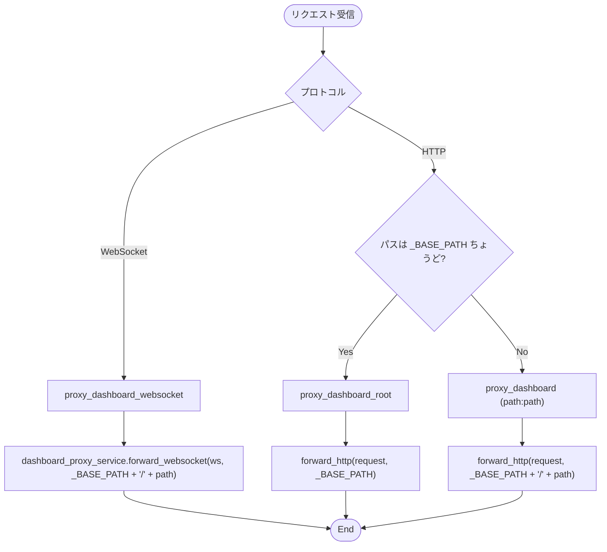
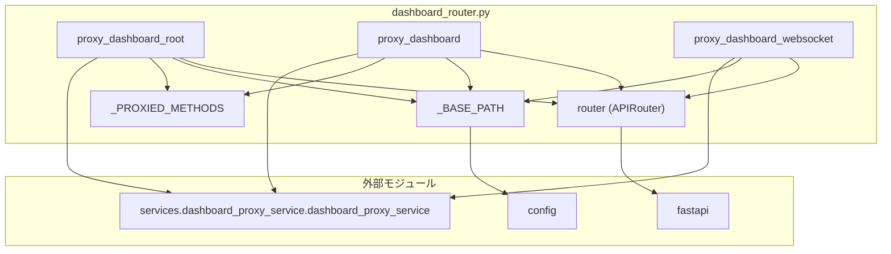

## 1. 解析メタ情報

| 項目 | 内容 |
| --- | --- |
| 対象ファイル | `routers/dashboard_router.py` |
| 言語 | Python |
| 解析対象 | 提供されたコードのみ |
| 推測・補完 | 一切なし |

## 関連ドキュメント

* [dashboard_proxy_service.md](./dashboard_proxy_service.md) - 実際の中継処理の実体（本ファイルは委譲するだけ）
* [config.md](./config.md) - `DASHBOARD_BASE_PATH` / `DASHBOARD_PROXY_ENABLED` の定義元
* [unified_server.md](./unified_server.md) - 本ルーターを `config.DASHBOARD_PROXY_ENABLED` が真のときだけ include する側
* [dashboard.md](./dashboard.md) - 中継先で動くStreamlitアプリ本体

## 2. ファイルの概要

> **（スマホ対応で追加）** ベースパス配下には、中継のほかに「スマートフォンのホーム画面に追加するためのマニフェスト・アイコン」と「Streamlitを介さない軽量ページ `{DASHBOARD_BASE_PATH}/m`」も置く。いずれも中継先のStreamlitは持っていないため、このアプリ自身が返す。**これらは中継の総当たりルート（`{path:path}`）より前に定義する必要がある**（FastAPIは定義順に照合するため、後ろに置くとStreamlitへ中継されて404になる）。

Streamlitダッシュボードを `config.DASHBOARD_BASE_PATH`（既定 `/dashboard`）配下で配信するためのFastAPIルーター。スマートフォンからダッシュボードを見られるようにするための入口であり、実際の中継処理は `services/dashboard_proxy_service.py` に委譲する（CLAUDE.mdの「ルーターは薄く」の方針）。HTTP用に2本（ベースパスそのもの、ベースパス配下のワイルドカード）、WebSocket用に1本のルートを定義する。

`config.DASHBOARD_PROXY_ENABLED=false` のときは `unified_server.py` がこのルーターをincludeしないため、パス自体が存在しなくなる（404）旨がモジュールdocstringに記されている。

## 3. 外部依存関係

### インポート一覧

| 名称 | 種類 | 用途 | 根拠 |
| --- | --- | --- | --- |
| `fastapi` | 外部 | ルーター定義（`APIRouter`）とハンドラ引数の型（`Request`, `WebSocket`） | 根拠: [インポート宣言] (行番号: 12 / 抜粋: "from fastapi import APIRouter, Request, WebSocket") |
| `config` | 内部 | 公開パス（`DASHBOARD_BASE_PATH`）の取得 | 根拠: [インポート宣言] (行番号: 24 / 抜粋: "import config") |
| `services.dashboard_proxy_service` | 内部 | 中継処理のシングルトン `dashboard_proxy_service` | 根拠: [インポート宣言] (行番号: 15 / 抜粋: "from services.dashboard_proxy_service import dashboard_proxy_service") |

### ブラックボックスとなる外部要素

| 名称 | 理由 | 根拠 |
| --- | --- | --- |
| `config.DASHBOARD_BASE_PATH` | 公開パスの実値は環境変数で上書き可能であり、本ファイルからは決まらない。import時に一度だけ読まれてルートのパス文字列になる。 | 根拠: [変数参照] (行番号: 46 / 抜粋: "_BASE_PATH = config.DASHBOARD_BASE_PATH") |
| `dashboard_proxy_service.forward_http` / `forward_websocket` | 中継の具体的な処理（ヘッダー加工・ストリーミング・エラー時の応答）が本ファイルからは不明。 | 根拠: [関数呼び出し] (行番号: 33, 39, 49 / 抜粋: "await dashboard_proxy_service.forward_http(request, _BASE_PATH)") |

## 4. 主要要素の定義（関数 / エンドポイント / コンポーネント）

### `router`

* **役割**: 本ファイルのルートをまとめる `APIRouter` インスタンス。prefixやtagsは指定していない（`unified_server.py` 側でtagsが付く）。
* 根拠: [変数宣言] (行番号: 40 / 抜粋: "router = APIRouter()")

* **引数/リクエスト**: 該当なし
* 根拠: [変数宣言] (行番号: 40 / 抜粋: "router = APIRouter()")

* **戻り値/レスポンス**: 該当なし
* 根拠: [変数宣言] (行番号: 40 / 抜粋: "router = APIRouter()")

* **副作用**: なし
* 根拠: [変数宣言] (行番号: 40 / 抜粋: "router = APIRouter()")

* **エラーハンドリング**: なし
* 根拠: [変数宣言] (行番号: 40 / 抜粋: "router = APIRouter()")

### `_PROXIED_METHODS`

* **役割**: 中継対象のHTTPメソッド一覧（`GET`, `POST`, `PUT`, `PATCH`, `DELETE`, `HEAD`, `OPTIONS`）。コメントに「ダッシュボードはGETが大半だが、`_stcore/upload_file` 等のためにPOST系も通す」と記されている。
* 根拠: [定数宣言] (行番号: 19〜21 / 抜粋: '_PROXIED_METHODS = ["GET", "POST", "PUT", "PATCH", "DELETE", "HEAD", "OPTIONS"]')

* **引数/リクエスト**: 該当なし
* 根拠: [定数宣言] (行番号: 21 / 抜粋: '_PROXIED_METHODS = ["GET", "POST", "PUT", "PATCH", "DELETE", "HEAD", "OPTIONS"]')

* **戻り値/レスポンス**: 該当なし
* 根拠: [定数宣言] (行番号: 21 / 抜粋: '_PROXIED_METHODS = ["GET", "POST", "PUT", "PATCH", "DELETE", "HEAD", "OPTIONS"]')

* **副作用**: なし
* 根拠: [定数宣言] (行番号: 21 / 抜粋: '_PROXIED_METHODS = ["GET", "POST", "PUT", "PATCH", "DELETE", "HEAD", "OPTIONS"]')

* **エラーハンドリング**: なし
* 根拠: [定数宣言] (行番号: 21 / 抜粋: '_PROXIED_METHODS = ["GET", "POST", "PUT", "PATCH", "DELETE", "HEAD", "OPTIONS"]')

### `_BASE_PATH`

* **役割**: 公開パス。`config.DASHBOARD_BASE_PATH` をモジュールのimport時に1回だけ読み、以降のルート定義とパス組み立てに使う。
* 根拠: [定数宣言] (行番号: 46 / 抜粋: "_BASE_PATH = config.DASHBOARD_BASE_PATH")

* **引数/リクエスト**: 該当なし
* 根拠: [定数宣言] (行番号: 46 / 抜粋: "_BASE_PATH = config.DASHBOARD_BASE_PATH")

* **戻り値/レスポンス**: 該当なし
* 根拠: [定数宣言] (行番号: 46 / 抜粋: "_BASE_PATH = config.DASHBOARD_BASE_PATH")

* **副作用**: なし
* 根拠: [定数宣言] (行番号: 46 / 抜粋: "_BASE_PATH = config.DASHBOARD_BASE_PATH")

* **エラーハンドリング**: なし
* 根拠: [定数宣言] (行番号: 46 / 抜粋: "_BASE_PATH = config.DASHBOARD_BASE_PATH")

### `_MOBILE_PATH` / `_MOBILE_STATUS_PATH` / `_QUEST_APP_PATH` (モジュールレベル定数、スマホ対応で追加)

* **役割**: 軽量ページのパス（`{DASHBOARD_BASE_PATH}/m`）、その自動更新が差し替えるカードのブロックだけを返すパス（`{DASHBOARD_BASE_PATH}/m/status`）、軽量ページ下部から張るファミクエ（`/quest`）への導線。
* 根拠: `_MOBILE_PATH = f"{config.DASHBOARD_BASE_PATH}/m"` (行番号: 33 / 抜粋: "_MOBILE_PATH = f\"{config.DASHBOARD_BASE_PATH}/m\""), `_MOBILE_STATUS_PATH = f"{_MOBILE_PATH}/status"` (行番号: 35 / 抜粋: "_MOBILE_STATUS_PATH = f\"{_MOBILE_PATH}/status\""), `_QUEST_APP_PATH = "/quest"` (行番号: 38 / 抜粋: "_QUEST_APP_PATH = \"/quest\"")

* **引数/リクエスト**: なし（定数）
* 根拠: (行番号: 33〜35 / 抜粋: "_MOBILE_PATH = f\"{config.DASHBOARD_BASE_PATH}/m\"")

* **戻り値/レスポンス**: なし（定数）
* 根拠: (行番号: 33〜35 / 抜粋: "_QUEST_APP_PATH = \"/quest\"")

* **副作用**: なし
* 根拠: (行番号: 33〜35 / 抜粋: "_MOBILE_PATH = f\"{config.DASHBOARD_BASE_PATH}/m\"")

* **エラーハンドリング**: なし
* 根拠: (行番号: 33〜35 / 抜粋: "_MOBILE_PATH = f\"{config.DASHBOARD_BASE_PATH}/m\"")

### `dashboard_manifest`（GET `{_BASE_PATH}/app.webmanifest`、スマホ対応で追加）

* **役割**: ダッシュボード本体をホーム画面に追加したときアドレスバー無し（standalone）で開くためのWebアプリマニフェストを返す。内容の組み立ては `services/dashboard_proxy_service.py` の `build_dashboard_manifest` が行う。
* 根拠: `def dashboard_manifest() -> Response:` (行番号: 56〜61 / 抜粋: "def dashboard_manifest() -> Response:")

* **引数/リクエスト**: なし
* 根拠: `def dashboard_manifest() -> Response:` (行番号: 56 / 抜粋: "def dashboard_manifest() -> Response:")

* **戻り値/レスポンス**: `application/manifest+json` の `Response`（JSONは `ensure_ascii=False` で日本語をそのまま出す）
* 根拠: `media_type="application/manifest+json",` (行番号: 56〜58 / 抜粋: "media_type=\"application/manifest+json\",")

* **副作用**: なし（中継しない）
* 根拠: `content=json.dumps(build_dashboard_manifest(), ensure_ascii=False),` (行番号: 59 / 抜粋: "content=json.dumps(build_dashboard_manifest(), ensure_ascii=False),")

* **エラーハンドリング**: なし
* 根拠: `def dashboard_manifest() -> Response:` (行番号: 56 / 抜粋: "def dashboard_manifest() -> Response:")

### `dashboard_icon`（GET `{_BASE_PATH}/icon-{size}.png`、スマホ対応で追加）

* **役割**: ホーム画面アイコンのPNGを返す。マニフェストの `icons` と `apple-touch-icon` から参照される。生成は `render_dashboard_icon_png`（図形だけで描画、サイズごとにキャッシュ）が行う。
* 根拠: `def dashboard_icon(size: int) -> Response:` (行番号: 65〜74 / 抜粋: "def dashboard_icon(size: int) -> Response:")

* **引数/リクエスト**: パスパラメータ `size` (int)
* 根拠: `@router.get(f"{_BASE_PATH}/icon-{{size}}.png", include_in_schema=False)` (行番号: 64 / 抜粋: "@router.get(f\"{_BASE_PATH}/icon-{{size}}.png\", include_in_schema=False)")

* **戻り値/レスポンス**: `image/png` の `Response`。`Cache-Control: public, max-age=86400` を付ける（内容はコードから決まり実質変わらないため）。
* 根拠: `headers={"Cache-Control": "public, max-age=86400"},` (行番号: 73 / 抜粋: "headers={\"Cache-Control\": \"public, max-age=86400\"},")

* **副作用**: 初回のみPNGを描画する（以降は関数側のキャッシュ）。
* 根拠: `content=render_dashboard_icon_png(size),` (行番号: 70 / 抜粋: "content=render_dashboard_icon_png(size),")

* **エラーハンドリング**: `DASHBOARD_ICON_SIZES` に無いサイズは404（中継にフォールバックさせない）。
* 根拠: `raise HTTPException(status_code=404, detail="unknown icon size")` (行番号: 68 / 抜粋: "raise HTTPException(status_code=404, detail=\"unknown icon size\")")

### `mobile_status_page`（GET `{_MOBILE_PATH}`、スマホ対応で追加）

* **役割**: Streamlitを介さない読み取り専用のサマリーページを返す。スマートフォンで見るのはステータスカードの9枚、という用途に対して、Streamlitの初期化・WebSocket接続・Reactの読み込みを省く。ダッシュボード本体はグラフ・ログ・メンテナンス操作を持つ「詳しく見る側」として残し、このページからリンクする。`dashboard_path`（`{_BASE_PATH}/`）を渡すことで各カードが詳細タブへのリンクになり、`status_path`（`_MOBILE_STATUS_PATH`）を渡すことで自動更新が差分更新になる。
* 根拠: `def mobile_status_page() -> HTMLResponse:` (行番号: 81〜104 / 抜粋: "def mobile_status_page() -> HTMLResponse:")

* **引数/リクエスト**: なし
* 根拠: `@router.get(_MOBILE_PATH, include_in_schema=False)` (行番号: 80 / 抜粋: "@router.get(_MOBILE_PATH, include_in_schema=False)")

* **戻り値/レスポンス**: `HTMLResponse`（`home_status_service.render_mobile_status_page_html` の出力）
* 根拠: `return HTMLResponse(` (行番号: 91 / 抜粋: "return HTMLResponse(")

* **副作用**: `home_status_service.collect_status_cards()` 経由のDB読み取り・HTTPスクレイピング（いずれもTTL 60秒のキャッシュ越し）。**`async def` にしていない**のは、中で同期のDB読み取りとスクレイピングを行うため。`def` にしておくと Starlette がスレッドプールで実行し、イベントループ（IoT制御・Webhook受信）を止めない。
* 根拠: `cards, fetched_at = home_status_service.collect_status_cards()` (行番号: 90 / 抜粋: "cards, fetched_at = home_status_service.collect_status_cards()")

* **エラーハンドリング**: 個々の取得失敗は `home_status_service` 側で `None` に丸められ、ページ全体は返る。
* 根拠: `cards, fetched_at = home_status_service.collect_status_cards()` (行番号: 90 / 抜粋: "cards, fetched_at = home_status_service.collect_status_cards()")

### `mobile_status_section`（GET `{_MOBILE_PATH}/status`、差分更新で追加）

* **役割**: 軽量ページのカードのブロック（取得時刻・要約行・カードのグリッド）だけをHTML断片として返す。軽量ページの自動更新は以前 `<meta http-equiv="refresh">` による全ページ再読み込みで、60秒ごとに画面が白く瞬き、スクロール位置も先頭へ戻っていた。この断片だけを差し替えることで、見ている位置を保ったまま値が新しくなる。
* 根拠: `def mobile_status_section() -> HTMLResponse:` (行番号: 108 / 抜粋: "def mobile_status_section() -> HTMLResponse:")

* **引数/リクエスト**: なし
* 根拠: `@router.get(_MOBILE_STATUS_PATH, include_in_schema=False)` (行番号: 107 / 抜粋: "@router.get(_MOBILE_STATUS_PATH, include_in_schema=False)")

* **戻り値/レスポンス**: `HTMLResponse`（`home_status_service.render_status_section_html` の出力。`
…
` の断片で、`<html>` や `<style>` は含まない）
* 根拠: `home_status_service.render_status_section_html(` (行番号: 120 / 抜粋: "home_status_service.render_status_section_html(")

* **副作用**: `home_status_service.collect_status_cards()` 経由のDB読み取り・HTTPスクレイピング。ページ全体を返す経路と同じTTL 60秒のメモを共有するため、DB・スクレイピングの回数は増えない。`mobile_status_page` と同じ理由で `async def` にしていない。
* 根拠: `cards, fetched_at = home_status_service.collect_status_cards()` (行番号: 117 / 抜粋: "cards, fetched_at = home_status_service.collect_status_cards()")

* **エラーハンドリング**: 個々の取得失敗は `home_status_service` 側で `None` に丸められ、断片は返る。ページ側のスクリプトは取得そのものに失敗した場合、古い表示を消さずに `#status` へ `stale` クラスを付けるだけにする。
* 根拠: `cards, fetched_at = home_status_service.collect_status_cards()` (行番号: 117 / 抜粋: "cards, fetched_at = home_status_service.collect_status_cards()")

### `mobile_status_manifest`（GET `{_MOBILE_PATH}/app.webmanifest`、スマホ対応で追加）

* **役割**: 軽量ページ専用のマニフェスト。ダッシュボード本体のマニフェストと `name` / `start_url` / `scope` だけが異なる。軽量ページから追加すれば軽量ページが、本体から追加すれば本体が開く（追加した画面と違うものが開くと戸惑うため、1つにまとめていない）。
* 根拠: `def mobile_status_manifest() -> Response:` (行番号: 129〜144 / 抜粋: "def mobile_status_manifest() -> Response:")

* **引数/リクエスト**: なし
* 根拠: `@router.get(f"{_MOBILE_PATH}/app.webmanifest", include_in_schema=False)` (行番号: 128 / 抜粋: "@router.get(f\"{_MOBILE_PATH}/app.webmanifest\", include_in_schema=False)")

* **戻り値/レスポンス**: `application/manifest+json` の `Response`
* 根拠: `media_type="application/manifest+json",` (行番号: 116〜118 / 抜粋: "media_type=\"application/manifest+json\",")

* **副作用**: なし
* 根拠: `manifest["start_url"] = _MOBILE_PATH` (行番号: 139 / 抜粋: "manifest[\"start_url\"] = _MOBILE_PATH")

* **エラーハンドリング**: なし
* 根拠: `def mobile_status_manifest() -> Response:` (行番号: 129 / 抜粋: "def mobile_status_manifest() -> Response:")

### `proxy_dashboard_root`（`_BASE_PATH`、`_PROXIED_METHODS`、`include_in_schema=False`）

* **役割**: ベースパスそのもの（例: `/dashboard`）へのアクセスを中継する。docstringに「Streamlitは末尾スラッシュ付きへリダイレクトを返すが、中継先も同じベースパスで動いているため `Location` はそのままブラウザに返して問題ない」と記されている。
* 根拠: [デコレータ/関数定義] (行番号: 26〜37 / 抜粋: "@router.api_route(_BASE_PATH, methods=_PROXIED_METHODS, include_in_schema=False)")

* **引数/リクエスト**: `request: Request`
* 根拠: [関数定義] (行番号: 148 / 抜粋: "async def proxy_dashboard_root(request: Request):")

* **戻り値/レスポンス**: `dashboard_proxy_service.forward_http(request, _BASE_PATH)` の戻り値をそのまま返す
* 根拠: [return文] (行番号: 154 / 抜粋: "return await dashboard_proxy_service.forward_http(request, _BASE_PATH)")

* **副作用**: 中継先へのHTTPリクエスト送信（`forward_http` 内）。
* 根拠: [関数呼び出し] (行番号: 154 / 抜粋: "await dashboard_proxy_service.forward_http(request, _BASE_PATH)")

* **エラーハンドリング**: 本関数には `try`/`except` は無く、中継失敗時の扱いは `forward_http` 側に委ねられている。
* 根拠: [関数定義] (行番号: 148〜154 / 抜粋: "async def proxy_dashboard_root(request: Request):")

### `proxy_dashboard`（`{_BASE_PATH}/{path:path}`、`_PROXIED_METHODS`、`include_in_schema=False`）

* **役割**: ベースパス配下の静的アセット・API（`_stcore/*` 等）を中継する。
* 根拠: [デコレータ/関数定義] (行番号: 36〜39 / 抜粋: '@router.api_route(f"{_BASE_PATH}/{{path:path}}", methods=_PROXIED_METHODS, include_in_schema=False)')

* **引数/リクエスト**: `request: Request`、パスパラメータ `path: str`
* 根拠: [関数定義] (行番号: 158 / 抜粋: "async def proxy_dashboard(request: Request, path: str):")

* **戻り値/レスポンス**: `forward_http(request, f"{_BASE_PATH}/{path}")` の戻り値（ベースパスを付け直して渡す）
* 根拠: [return文] (行番号: 39 / 抜粋: 'return await dashboard_proxy_service.forward_http(request, f"{_BASE_PATH}/{path}")')

* **副作用**: 中継先へのHTTPリクエスト送信（`forward_http` 内）。
* 根拠: [関数呼び出し] (行番号: 39 / 抜粋: 'await dashboard_proxy_service.forward_http(request, f"{_BASE_PATH}/{path}")')

* **エラーハンドリング**: 本関数には `try`/`except` は無い。
* 根拠: [関数定義] (行番号: 158〜160 / 抜粋: "async def proxy_dashboard(request: Request, path: str):")

### `proxy_dashboard_websocket`（WebSocket `{_BASE_PATH}/{path:path}`）

* **役割**: StreamlitのWebSocket（`_stcore/stream`）を中継する。docstringに「これが無いとHTMLと静的アセットだけが配信され、画面は "Connecting..." のまま永久にデータが表示されない」と記されている。
* 根拠: [デコレータ/関数定義] (行番号: 42〜49 / 抜粋: '@router.websocket(f"{_BASE_PATH}/{{path:path}}")')

* **引数/リクエスト**: `websocket: WebSocket`、パスパラメータ `path: str`
* 根拠: [関数定義] (行番号: 164 / 抜粋: "async def proxy_dashboard_websocket(websocket: WebSocket, path: str):")

* **戻り値/レスポンス**: `None`（`forward_websocket` を `await` するのみ）
* 根拠: [関数呼び出し] (行番号: 49 / 抜粋: 'await dashboard_proxy_service.forward_websocket(websocket, f"{_BASE_PATH}/{path}")')

* **副作用**: 中継先へのWebSocket接続の確立とメッセージ転送（`forward_websocket` 内）。
* 根拠: [関数呼び出し] (行番号: 49 / 抜粋: 'await dashboard_proxy_service.forward_websocket(websocket, f"{_BASE_PATH}/{path}")')

* **エラーハンドリング**: 本関数には `try`/`except` は無く、接続失敗時のクローズは `forward_websocket` 側が行う。
* 根拠: [関数定義] (行番号: 164〜170 / 抜粋: "async def proxy_dashboard_websocket(websocket: WebSocket, path: str):")

## 5. 処理フロー図

## 6. 依存関係図

## 7. 次のステップ（リバースエンジニアリングの提案）

| 優先度 | ファイル名(推測可) | 理由 | 根拠 |
| --- | --- | --- | --- |
| 高 | `services/dashboard_proxy_service.py` | 中継の実体（ヘッダー加工・WebSocket転送・失敗時の応答）を把握するため。本ファイルは委譲しかしない。 | 根拠: 全エンドポイントが `dashboard_proxy_service` を呼ぶのみ (行番号: 33, 39, 49) |
| 中 | `unified_server.py` | 本ルーターをincludeする条件（`DASHBOARD_PROXY_ENABLED`）と、他ルートとの優先順位を確認するため。 | 根拠: モジュールdocstring (行番号: 9〜10) |
| 中 | `config.py` | `DASHBOARD_BASE_PATH` の既定値と正規化（先頭スラッシュの扱い）を確認するため。 | 根拠: `_BASE_PATH = config.DASHBOARD_BASE_PATH` (行番号: 23) |

## 8. 保守上の注意点

* **（スマホ対応で追加）ルートの定義順に依存する**: `app.webmanifest` / `icon-{size}.png` / `m` / `m/status` / `m/app.webmanifest` は、中継の総当たりルート（`{_BASE_PATH}/{path:path}`）より**前**に定義されていなければならない。後ろに移すと、これらのパスもStreamlitへ中継されて404になる（`tests/test_dashboard_proxy.py` の `TestMobileHomeScreenAssets` と `tests/test_mobile_status_page.py` の `TestPartialRefresh` が、中継先が居ない状態でも200で返ることを検査して固定している）。
* 根拠: `@router.get(f"{_BASE_PATH}/app.webmanifest", include_in_schema=False)` (行番号: 55 / 抜粋: "@router.get(f\"{_BASE_PATH}/app.webmanifest\", include_in_schema=False)")

* **`_BASE_PATH` はimport時に1回だけ評価される。** ルートのパス文字列そのものになるため、テスト等で実行時に `config.DASHBOARD_BASE_PATH` を差し替えても、既に登録済みのルートのパスは変わらない。
* **中継の3本のルートはすべて `include_in_schema=False`** であり、OpenAPIスキーマに現れない。`tests/test_unified_server_app.py` の外部Webhook整合テストはOpenAPIスキーマ上のパス一覧を使っているため、ここでワイルドカードをスキーマに出すとその検査を濁すことになる。
* **`{path:path}` のワイルドカードは貪欲に一致する。** `_BASE_PATH` 配下に別のルートを足す場合は、本ルーターより前にincludeされている必要がある。
* エンドポイント関数自身は例外処理を持たないため、中継失敗時の挙動（503を返す等）はすべて `dashboard_proxy_service` 側の実装に依存する。

## 9. 不明事項一覧

| 項目 | 理由 | 必要なファイル |
| --- | --- | --- |
| `DASHBOARD_BASE_PATH` の既定値・正規化規則 | 本ファイルは値を読むだけで、先頭スラッシュの有無をどう扱うかが不明。 | `config.py` |
| `DASHBOARD_PROXY_ENABLED` による無効化の実装箇所 | docstringで言及されているが、判定そのものは本ファイルに無い。 | `unified_server.py` |
| 中継先Streamlitが実際に使うパス（`_stcore/*` の一覧） | 本ファイルはワイルドカードで受けるだけで、個別のパスを列挙していない。 | Streamlit本体（外部ライブラリ） |

## 10. 自己検証結果

* [x] 完了: 推測・外部ファイルの仕様を一切含んでいない
* [x] 完了: 全関数・全クラス・全コンポーネントを列挙した
* [x] 完了: 全てのインポート要素を列挙した
* [x] 完了: すべての仕様説明に「根拠（行番号・抜粋）」を明記した
* [x] 完了: 根拠漏れが0件である
* [x] 完了: Mermaid構文にエラーの原因となる記号（エスケープ漏れ）がない
