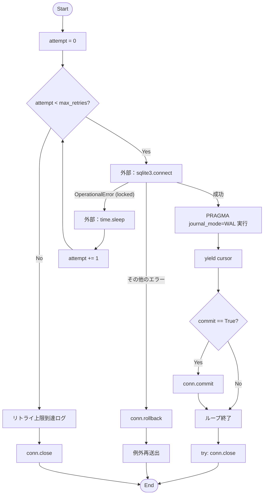
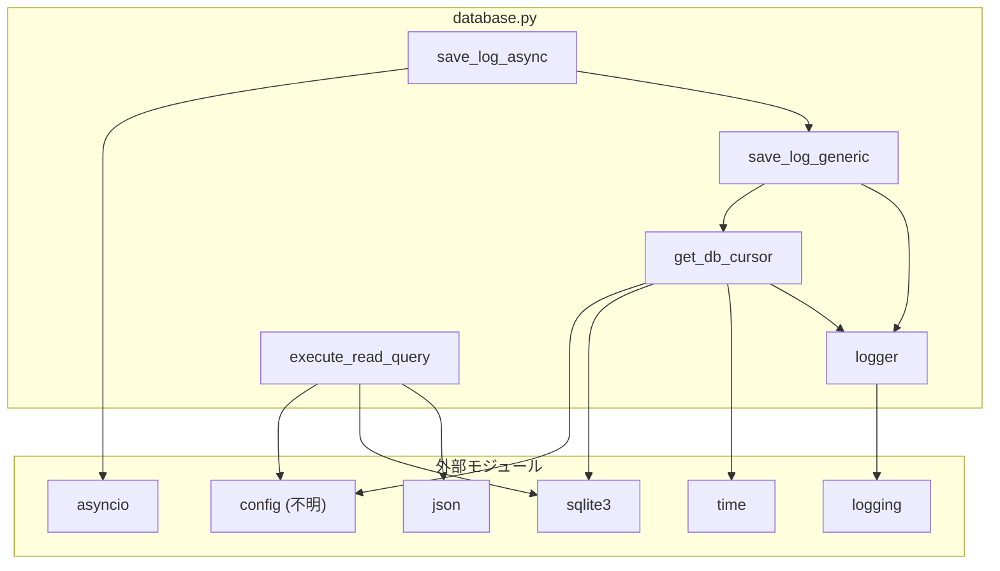

## 1. 解析メタ情報

| 項目 | 内容 |
| --- | --- |
| 対象ファイル | `database.py` |
| 言語 | Python |
| 解析対象 | 提供されたコードのみ |
| 推測・補完 | 一切なし |

## 2. ファイルの概要

* SQLiteデータベースへの接続、クエリ実行、データの書き込みを管理するユーティリティ機能を提供する。
* 接続のリトライ機構（ロック時の待機）、読み取り専用モードでの安全なデータ検索、および同期・非同期に対応した汎用的なデータ挿入（INSERT）機能を実装している。
* 根拠: `get_db_cursor`, `execute_read_query`, `save_log_generic`, `save_log_async` 関数の定義 (行番号: 12-85 / 抜粋: "DB接続コンテキストマネージャ", "読み取り専用モードで安全にSELECTを実行する", "汎用データ保存関数")

## 3. 外部依存関係

### インポート一覧

| 名称 | 種類 | 用途 | 根拠 |
| --- | --- | --- | --- |
| `sqlite3` | 標準ライブラリ | SQLiteデータベースへの接続・操作 | `import sqlite3` (行番号: 1 / 抜粋: "import sqlite3") |
| `time` | 標準ライブラリ | DBロック時のリトライ待機処理 | `import time` (行番号: 2 / 抜粋: "import time") |
| `json` | 標準ライブラリ | 検索結果のJSON文字列化 | `import json` (行番号: 3 / 抜粋: "import json") |
| `logging` | 標準ライブラリ | エラーや警告のロギング出力 | `import logging` (行番号: 4 / 抜粋: "import logging") |
| `asyncio` | 標準ライブラリ | 非同期処理の実行ループ取得 | `import asyncio` (行番号: 5 / 抜粋: "import asyncio") |
| `List` | 標準ライブラリ | 型ヒント | `from typing import List` (行番号: 6 / 抜粋: "from typing import List") |
| `contextmanager` | 標準ライブラリ | 関数をコンテキストマネージャ化する | `from contextlib import contextmanager` (行番号: 7 / 抜粋: "from contextlib import contextmanager") |
| `config` | 外部モジュール | データベースファイルパスの設定取得 | `import config` (行番号: 8 / 抜粋: "import config") |

### ブラックボックスとなる外部要素

| 名称 | 理由 | 根拠 |
| --- | --- | --- |
| `config.SQLITE_DB_PATH` | `config` モジュールの実装が提供されておらず、実際のファイルパスや環境変数の定義が不明。 | `config.SQLITE_DB_PATH` (行番号: 20 / 抜粋: "sqlite3.connect(config.SQLITE_DB_PATH") |

## 4. 主要要素の定義（関数 / エンドポイント / コンポーネント）

### `logger`

* **役割**: `core.database` という名前のロガーインスタンスを生成・保持する。
* 根拠: `logger = logging.getLogger("core.database")` (行番号: 10 / 抜粋: "logger = logging.getLogger("core.database")")

### `get_db_cursor`

* **役割**: リトライ機能（最大5回、1秒間隔）を備えたデータベース接続を提供するコンテキストマネージャ。WALモードを有効化し、カーソルを `yield` する。
* 根拠: `def get_db_cursor(commit: bool = False):` (行番号: 12-24 / 抜粋: "DB接続コンテキストマネージャ (リトライ機能付き)")

* **引数/リクエスト**: `commit` (bool, デフォルト `False`): コンテキスト終了時にコミットを実行するかどうか。
* 根拠: `def get_db_cursor(commit: bool = False):` (行番号: 13 / 抜粋: "def get_db_cursor(commit: bool = False):")

* **戻り値/レスポンス**: `sqlite3.Cursor` (yieldにより返却)
* 根拠: `yield conn.cursor()` (行番号: 24 / 抜粋: "yield conn.cursor()")

* **副作用**: DB接続の確立、`PRAGMA journal_mode=WAL;` の実行、指定時のコミット、接続のクローズ。
* 根拠: `conn.execute("PRAGMA journal_mode=WAL;")`, `if commit: conn.commit()`, `conn.close()` (行番号: 22, 27, 48 / 抜粋: "conn.execute("PRAGMA journal_mode=WAL;")")

* **エラーハンドリング**: `sqlite3.OperationalError` (locked) 発生時は最大5回リトライする。その他のエラーはロールバックして例外を再送出する。
* 根拠: `except sqlite3.OperationalError as e:` (行番号: 30-43 / 抜粋: "if "locked" in str(e):")

### `execute_read_query`

* **役割**: 読み取り専用モード (`?mode=ro`) で指定されたSELECTクエリを実行し、結果をJSON形式の文字列で返す。データが存在しない場合は専用のメッセージを返す。
* 根拠: `def execute_read_query(query: str, params: tuple = ()) -> str:` (行番号: 51-62 / 抜粋: "読み取り専用モードで安全にSELECTを実行する")

* **引数/リクエスト**:
* `query` (str): 実行するSQLクエリ文字列。
* `params` (tuple, デフォルト `()`): SQLクエリにバインドするパラメータ。
* 根拠: `def execute_read_query(query: str, params: tuple = ()) -> str:` (行番号: 51 / 抜粋: "query: str, params: tuple = ()")

* **戻り値/レスポンス**: `str`: JSON形式の検索結果文字列、該当データなしメッセージ、またはエラーメッセージ。
* 根拠: `-> str:` (行番号: 51 / 抜粋: "-> str:")
* 根拠: `if not rows: return "該当するデータはありませんでした。"` (行番号: 61 / 抜粋: "return "該当するデータはありませんでした。"")
* 根拠: `return json.dumps(...)` (行番号: 62 / 抜粋: "return json.dumps([dict(r) for r in rows]")

* **副作用**: データベースからのデータ読み取り。
* 根拠: `cursor.execute(query, params)` (行番号: 58 / 抜粋: "cursor.execute(query, params)")

* **エラーハンドリング**: 例外 (`Exception`) をキャッチし、例外を送出せずにエラーメッセージの文字列として返す。
* 根拠: `except Exception as e: return f"検索エラー: {str(e)}"` (行番号: 63-65 / 抜粋: "except Exception as e:")

### `save_log_generic`

* **役割**: 指定されたテーブル、カラム、値を用いてINSERTクエリを動的に構築し、データを保存する。
* 根拠: `def save_log_generic(table: str, columns_list: List[str], values_list: tuple) -> bool:` (行番号: 67-75 / 抜粋: "汎用データ保存関数")

* **引数/リクエスト**:
* `table` (str): 保存対象のテーブル名。
* `columns_list` (List[str]): 保存対象のカラム名のリスト。
* `values_list` (tuple): 保存する値のタプル。
* 根拠: `def save_log_generic(table: str, columns_list: List[str], values_list: tuple) -> bool:` (行番号: 67 / 抜粋: "table: str, columns_list: List[str]")

* **戻り値/レスポンス**: `bool`: 保存成功時は `True`、失敗時は `False`。
* 根拠: `-> bool:` (行番号: 67 / 抜粋: "-> bool:")
* 根拠: `return True` / `return False` (行番号: 76, 79 / 抜粋: "return True")

* **副作用**: DBへのINSERT実行（データ書き込み）。
* 根拠: `cur.execute(sql, values_list)` (行番号: 75 / 抜粋: "cur.execute(sql, values_list)")

* **エラーハンドリング**: 例外 (`Exception`) をキャッチし、ロガーにエラーを出力して `False` を返す。
* 根拠: `except Exception as e: logger.error(...)` (行番号: 77-78 / 抜粋: "except Exception as e:")

### `save_log_async`

* **役割**: `save_log_generic` を非同期で実行するためのラッパー関数。
* 根拠: `async def save_log_async(table: str, columns_list: List[str], values_list: tuple) -> bool:` (行番号: 81-85 / 抜粋: "save_log_generic の非同期ラッパー")

* **引数/リクエスト**: `table` (str), `columns_list` (List[str]), `values_list` (tuple) （`save_log_generic` と同等）
* 根拠: `async def save_log_async(...)` (行番号: 81 / 抜粋: "table: str, columns_list: List[str]")

* **戻り値/レスポンス**: `bool`: `save_log_generic` の実行結果。
* 根拠: `-> bool:` (行番号: 81 / 抜粋: "-> bool:")
* 根拠: `return await loop.run_in_executor(...)` (行番号: 85 / 抜粋: "return await loop.run_in_executor")

* **副作用**: 非同期スレッドプールでの `save_log_generic` の実行。
* 根拠: `loop.run_in_executor(None, save_log_generic, ...)` (行番号: 85 / 抜粋: "loop.run_in_executor(None, save_log_generic")

* **エラーハンドリング**: なし（内部で呼び出す `save_log_generic` のエラーハンドリングに依存）。
* 根拠: 関数内に `try...except` ブロックが存在しない (行番号: 81-85 / 抜粋: "loop = asyncio.get_running_loop()")

---

## 5. 処理フロー図

`get_db_cursor` のDB接続とリトライのロジックを示すフローチャート。

## 6. 依存関係図

## 7. 次のステップ（リバースエンジニアリングの提案）

| 優先度 | ファイル名(推測可) | 理由 | 根拠 |
| --- | --- | --- | --- |
| 高 | `config.py` | `SQLITE_DB_PATH` の定義を確認し、対象DBの特定をするため。 | `config.SQLITE_DB_PATH` を参照している (行番号: 20, 54) |
| 中 | 呼び出し元ファイル (不明) | どのテーブルに対して `save_log_generic` が呼び出されているか、どんなクエリが `execute_read_query` に渡されているかを確認するため。 | 各関数が引数としてクエリやテーブル名を受け取る汎用関数であるため (行番号: 51, 67) |

## 8. 保守上の注意点

* `get_db_cursor` において、`OperationalError` 以外の例外が発生した場合はロールバックされた後に例外が再送出 (`raise e`) されるため、呼び出し元で適切なエラーハンドリングを行う必要がある。
* `execute_read_query` で例外が発生した場合、例外を送出せず文字列 (`検索エラー: ...`) を返す。呼び出し元が戻り値を常にJSON文字列としてパースしようとすると、パースエラー（`JSONDecodeError`など）が発生する可能性が高い。
* `save_log_generic` は `values_list` に対してプレースホルダー（`?`）を用いているが、`table` と `columns_list` は文字列展開でSQL文に直接埋め込まれている。これらに外部入力が渡される場合、SQLインジェクションのリスクが存在する。
* `get_db_cursor` の `else` ブロック（リトライ上限到達時）で `if conn: conn.close()` が実行された後、`finally` のような後続の `if conn:` ブロックでも再度 `try: conn.close()` が実行される冗長な設計になっている。

## 9. 不明事項一覧

| 項目 | 理由 | 必要なファイル |
| --- | --- | --- |
| 対象データベースのファイルパス | `config` モジュールに依存しており、実際の値が読み取れないため | `config.py` または関連設定ファイル |
| 操作対象のテーブル名・スキーマ | 実行時に引数で受け取る仕様であり、本ファイル内にテーブル定義の記述がないため | このモジュールを呼び出す外部ファイル |

## 10. 自己検証結果

* [x] 推測・外部ファイルの仕様を一切含んでいない
* [x] 全関数・全クラス・全コンポーネントを列挙した
* [x] 全てのインポート要素を列挙した
* [x] すべての仕様説明に「根拠（行番号・抜粋）」を明記した
* [x] 根拠漏れが0件である
* [x] Mermaid構文にエラーの原因となる記号（エスケープ漏れ）がない
* [x] 不明事項を漏れなく列挙した

完了