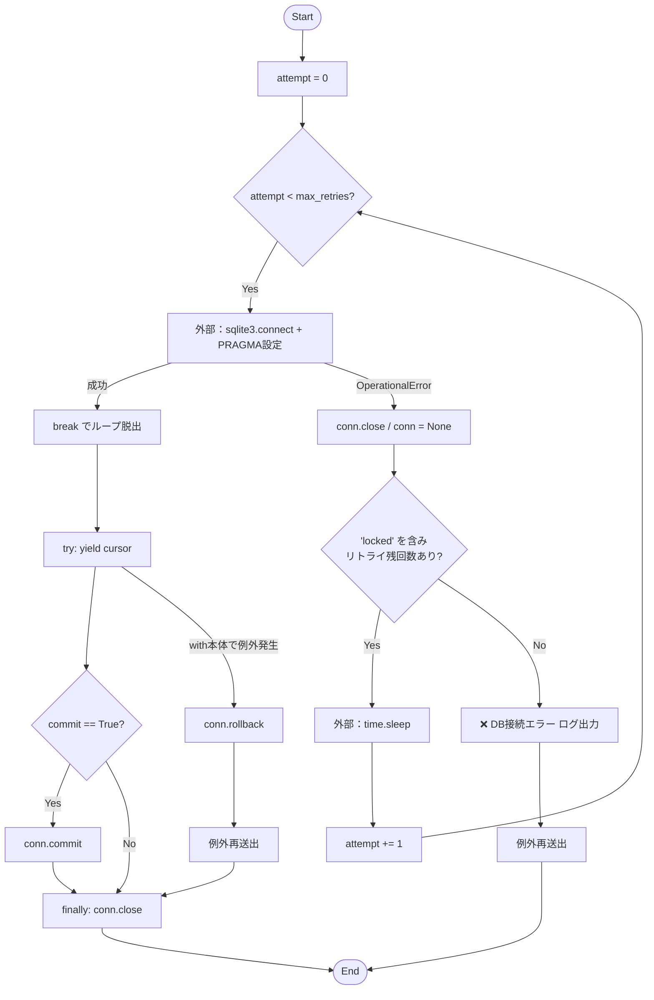
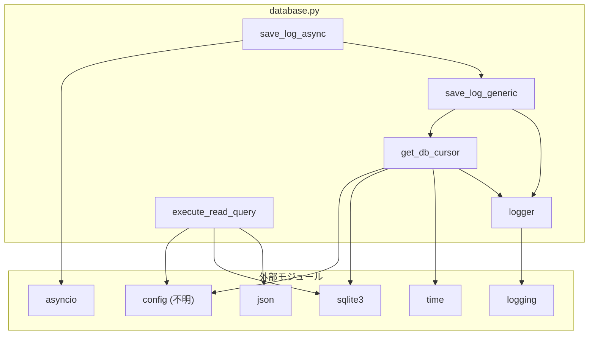

## 1. 解析メタ情報

| 項目 | 内容 |
| --- | --- |
| 対象ファイル | `database.py` |
| 言語 | Python |
| 解析対象 | 提供されたコードのみ |
| 推測・補完 | 一切なし |

## 関連ドキュメント

* [config.md](./config.md) - `config.SQLITE_DB_PATH`(DBファイルパス設定値)の提供元
* [common.md](./common.md) - 本ファイル(`core.database`)を`get_db_cursor`, `execute_read_query`, `save_log_generic`, `save_log_async`としてFacade再エクスポートする呼び出し元
* [init_unified_db.md](./init_unified_db.md) - `common.get_db_cursor(commit=True)`経由で本ファイルの接続処理(WALモード・外部キー制約有効化を含む)を利用してテーブル初期化を行う呼び出し元
* [webhook_router.md](./webhook_router.md) - `core.database.save_log_async`を直接インポートして利用する呼び出し元
* [quest_service.md](./quest_service.md) - `common.get_db_cursor`経由で本ファイルの接続処理を利用する呼び出し元
* [analysis_service.md](./analysis_service.md) - 対照的な設計。本ファイルの`get_db_cursor`は使わず`get_ro_db_connection`による直接の`sqlite3.connect`を独自に用いている

## 2. ファイルの概要

* SQLiteデータベースへの接続、クエリ実行、データの書き込みを管理するユーティリティ機能を提供する。
* 接続のリトライ機構（接続確立時のみ、ロック時の待機）、WALモードおよび外部キー制約(`PRAGMA foreign_keys`)の有効化、読み取り専用モードでの安全なデータ検索、および同期・非同期に対応した汎用的なデータ挿入（INSERT）機能を実装している。
* 根拠: `get_db_cursor`, `execute_read_query`, `save_log_generic`, `save_log_async` 関数の定義 (行番号: 12-85 / 抜粋: "DB接続コンテキストマネージャ (接続確立のみリトライ", "読み取り専用モードで安全にSELECTを実行する", "汎用データ保存関数")

## 3. 外部依存関係

### インポート一覧

| 名称 | 種類 | 用途 | 根拠 |
| --- | --- | --- | --- |
| `sqlite3` | 標準ライブラリ | SQLiteデータベースへの接続・操作 | `import sqlite3` (行番号: 1 / 抜粋: "import sqlite3") |
| `time` | 標準ライブラリ | DBロック時のリトライ待機処理 | `import time` (行番号: 2 / 抜粋: "import time") |
| `json` | 標準ライブラリ | 検索結果のJSON文字列化 | `import json` (行番号: 3 / 抜粋: "import json") |
| `logging` | 標準ライブラリ | エラーや警告のロギング出力 | `import logging` (行番号: 4 / 抜粋: "import logging") |
| `asyncio` | 標準ライブラリ | 非同期処理の実行ループ取得 | `import asyncio` (行番号: 5 / 抜粋: "import asyncio") |
| `List` | 標準ライブラリ | 型ヒント | `from typing import List` (行番号: 6 / 抜粋: "from typing import List") |
| `contextmanager` | 標準ライブラリ | 関数をコンテキストマネージャ化する | `from contextlib import contextmanager` (行番号: 7 / 抜粋: "from contextlib import contextmanager") |
| `config` | 外部モジュール | データベースファイルパスの設定取得 | `import config` (行番号: 8 / 抜粋: "import config") |

### ブラックボックスとなる外部要素

| 名称 | 理由 | 根拠 |
| --- | --- | --- |
| `config.SQLITE_DB_PATH` | `config` モジュールの実装が提供されておらず、実際のファイルパスや環境変数の定義が不明。 | `config.SQLITE_DB_PATH` (行番号: 21 / 抜粋: "sqlite3.connect(config.SQLITE_DB_PATH") |

## 4. 主要要素の定義（関数 / エンドポイント / コンポーネント）

### `logger`

* **役割**: `core.database` という名前のロガーインスタンスを生成・保持する。
* 根拠: `logger = logging.getLogger("core.database")` (行番号: 10 / 抜粋: "logger = logging.getLogger("core.database")")

### `get_db_cursor`

* **役割**: リトライ機能（最大5回、DB接続の確立時のみ、"locked"エラー時に1秒間隔で再試行）を備えたデータベース接続を提供するコンテキストマネージャ。WALモードおよび外部キー制約(`PRAGMA foreign_keys=ON`)を有効化し、接続確立後は `with` 文本体に対して必ず1回だけカーソルを `yield` する（H-1で書き直し。従来は`for`ループの中で`yield`しており、with本体実行中にDBロック等の例外が発生すると`raise e`後に再度ループ・`yield`しようとして`RuntimeError("generator didn't stop after throw()")`に、接続リトライが尽きた場合も`RuntimeError("generator didn't yield")`に化けて、呼び出し元(`save_log_generic`等)が想定しない例外で処理ごと落ちる不具合があった）。
* 根拠: `def get_db_cursor(commit: bool = False):` (行番号: 12-45 / 抜粋: "DB接続コンテキストマネージャ (接続確立のみリトライ。yieldは必ず1回だけ行う)")

* **引数/リクエスト**: `commit` (bool, デフォルト `False`): コンテキスト終了時にコミットを実行するかどうか。
* 根拠: `def get_db_cursor(commit: bool = False):` (行番号: 13 / 抜粋: "def get_db_cursor(commit: bool = False):")

* **戻り値/レスポンス**: `sqlite3.Cursor` (yieldにより返却)
* 根拠: `yield conn.cursor()` (行番号: 38 / 抜粋: "yield conn.cursor()")

* **副作用**: DB接続の確立、`PRAGMA journal_mode=WAL;` および `PRAGMA foreign_keys=ON;` の実行、指定時のコミット、with本体で例外発生時のロールバック、`finally`での必ずの接続クローズ。
* 根拠: `conn.execute("PRAGMA journal_mode=WAL;")`, `conn.execute("PRAGMA foreign_keys=ON;")`, `if commit: conn.commit()`, `conn.rollback()`, `conn.close()` (行番号: 23, 24, 39-40, 42, 45 / 抜粋: "conn.execute("PRAGMA foreign_keys=ON;")")

* **エラーハンドリング**: 接続確立時に発生した `sqlite3.OperationalError` のうち、メッセージに"locked"を含みリトライ残回数がある場合のみ最大5回まで再試行する。それ以外（ロック以外の`OperationalError`、またはリトライ上限到達時）はエラーログを出力し、その例外をそのまま再送出する（接続は必ず閉じてから）。接続確立後、`with`文本体の実行中に例外が発生した場合はリトライを行わず、ロールバックしてから例外を再送出する。いずれの場合も呼び出し元には元の例外がそのまま伝播し、以前のような`RuntimeError`への化けは発生しない。
* 根拠: `except sqlite3.OperationalError as e:` (行番号: 26-35 / 抜粋: "if "locked" in str(e) and attempt < max_retries - 1:"), `except Exception: conn.rollback(); raise` (行番号: 41-43 / 抜粋: "conn.rollback()")

### `execute_read_query`

* **役割**: 読み取り専用モード (`?mode=ro`) で指定されたSELECTクエリを実行し、結果をJSON形式の文字列で返す。データが存在しない場合は専用のメッセージを返す。**（Issue #178で修正）** 以前は`conn.close()`が正常経路にしか無く`try/finally`が無かったため、`cursor.execute()`が例外を送出する（不正なSQL等）たびに接続がクローズされずGC任せで残り、長期稼働プロセスでのfd/接続リークを招いていた。`conn`を`try`節の前で`None`初期化し、`finally`節で確実に`close()`するよう修正した。
* 根拠: `def execute_read_query(query: str, params: tuple = ()) -> str:` (行番号: 47-67 / 抜粋: "読み取り専用モードで安全にSELECTを実行する")、接続クリーンアップの修正 (行番号: 65-67 / 抜粋: "finally:\n        if conn:\n            conn.close()")

* **引数/リクエスト**:
* `query` (str): 実行するSQLクエリ文字列。
* `params` (tuple, デフォルト `()`): SQLクエリにバインドするパラメータ。
* 根拠: `def execute_read_query(query: str, params: tuple = ()) -> str:` (行番号: 47 / 抜粋: "query: str, params: tuple = ()")

* **戻り値/レスポンス**: `str`: JSON形式の検索結果文字列、該当データなしメッセージ、またはエラーメッセージ。
* 根拠: `-> str:` (行番号: 47 / 抜粋: "-> str:")
* 根拠: `if not rows: return "該当するデータはありませんでした。"` (行番号: 61 / 抜粋: "return "該当するデータはありませんでした。"")
* 根拠: `return json.dumps(...)` (行番号: 62 / 抜粋: "return json.dumps([dict(r) for r in rows]")

* **副作用**: データベースからのデータ読み取り。接続は正常終了・例外終了のいずれの経路でも`finally`節で必ずクローズされる。
* 根拠: `cursor.execute(query, params)` (行番号: 58 / 抜粋: "cursor.execute(query, params)")、`finally: if conn: conn.close()` (行番号: 65-67 / 抜粋: "finally:\n        if conn:\n            conn.close()")

* **エラーハンドリング**: 例外 (`Exception`) をキャッチし、例外を送出せずにエラーメッセージの文字列として返す。接続の後始末は`except`節ではなく`finally`節が担う。
* 根拠: `except Exception as e: return f"検索エラー: {str(e)}"` (行番号: 63-64 / 抜粋: "except Exception as e:")

### `save_log_generic`

* **役割**: 指定されたテーブル、カラム、値を用いてINSERTクエリを動的に構築し、`get_db_cursor`経由でデータを保存する。H-1の`get_db_cursor`書き直しに伴い、返るカーソルが常に有効になったため、以前存在した`if cur:`チェックは削除された。`get_db_cursor`自体が送出する例外（接続確立失敗・with本体内のDBエラー等）も含めて関数全体を`try/except`で捕捉する構成に整理されている。
* 根拠: `def save_log_generic(table: str, columns_list: List[str], values_list: tuple) -> bool:` (行番号: 69-80 / 抜粋: "汎用データ保存関数")

* **引数/リクエスト**:
* `table` (str): 保存対象のテーブル名。
* `columns_list` (List[str]): 保存対象のカラム名のリスト。
* `values_list` (tuple): 保存する値のタプル。
* 根拠: `def save_log_generic(table: str, columns_list: List[str], values_list: tuple) -> bool:` (行番号: 69 / 抜粋: "table: str, columns_list: List[str]")

* **戻り値/レスポンス**: `bool`: 保存成功時は `True`、失敗時は `False`。
* 根拠: `-> bool:` (行番号: 69 / 抜粋: "-> bool:")
* 根拠: `return True` / `return False` (行番号: 77, 80 / 抜粋: "return True")

* **副作用**: DBへのINSERT実行（データ書き込み）。
* 根拠: `cur.execute(sql, values_list)` (行番号: 76 / 抜粋: "cur.execute(sql, values_list)")

* **エラーハンドリング**: `get_db_cursor`のwith文全体を囲む`try/except Exception`で、接続エラー・SQL実行エラー・`get_db_cursor`が再送出する例外のいずれもキャッチし、ロガーにエラーを出力して `False` を返す。
* 根拠: `except Exception as e: logger.error(...); return False` (行番号: 78-80 / 抜粋: "except Exception as e:")

### `save_log_async`

* **役割**: `save_log_generic` を非同期で実行するためのラッパー関数。
* 根拠: `async def save_log_async(table: str, columns_list: List[str], values_list: tuple) -> bool:` (行番号: 82-85 / 抜粋: "save_log_generic の非同期ラッパー")

* **引数/リクエスト**: `table` (str), `columns_list` (List[str]), `values_list` (tuple) （`save_log_generic` と同等）
* 根拠: `async def save_log_async(...)` (行番号: 82 / 抜粋: "table: str, columns_list: List[str]")

* **戻り値/レスポンス**: `bool`: `save_log_generic` の実行結果。
* 根拠: `-> bool:` (行番号: 82 / 抜粋: "-> bool:")
* 根拠: `return await loop.run_in_executor(...)` (行番号: 85 / 抜粋: "return await loop.run_in_executor")

* **副作用**: 非同期スレッドプールでの `save_log_generic` の実行。
* 根拠: `loop.run_in_executor(None, save_log_generic, ...)` (行番号: 85 / 抜粋: "loop.run_in_executor(None, save_log_generic")

* **エラーハンドリング**: なし（内部で呼び出す `save_log_generic` のエラーハンドリングに依存）。
* 根拠: 関数内に `try...except` ブロックが存在しない (行番号: 82-85 / 抜粋: "loop = asyncio.get_running_loop()")

---

## 5. 処理フロー図

`get_db_cursor` のDB接続とリトライのロジックを示すフローチャート。H-1でリトライ対象を「接続確立のみ」に限定し、`yield`は接続成功後にループの外で必ず1回だけ行うよう書き直された。

```mermaid
flowchart TD
    Start([Start]) --> Init[attempt = 0]
    Init --> LoopCheck{attempt < max_retries?}
    LoopCheck -- Yes --> Connect[外部：sqlite3.connect + PRAGMA設定]
    Connect -- 成功 --> BreakLoop[break でループ脱出]
    BreakLoop --> TryYield[try: yield cursor]

    Connect -- "OperationalError" --> CloseConn[conn.close / conn = None]
    CloseConn --> LockedCheck{"'locked' を含み<br/>リトライ残回数あり?"}
    LockedCheck -- Yes --> Wait[外部：time.sleep] --> Inc[attempt += 1] --> LoopCheck
    LockedCheck -- No --> LogConnErr[❌ DB接続エラー ログ出力]
    LogConnErr --> RaiseConnErr[例外再送出] --> End([End])

    TryYield --> CommitCheck{commit == True?}
    CommitCheck -- Yes --> DoCommit[conn.commit]
    CommitCheck -- No --> FinallyClose
    DoCommit --> FinallyClose[finally: conn.close]
    FinallyClose --> End

    TryYield -- "with本体で例外発生" --> Rollback[conn.rollback]
    Rollback --> RaiseBodyErr[例外再送出] --> FinallyClose

```

## 6. 依存関係図

```mermaid
graph TD
    subgraph database.py
        logger
        get_db_cursor
        execute_read_query
        save_log_generic
        save_log_async
    end

    subgraph 外部モジュール
        config["config (不明)"]
        sqlite3["sqlite3"]
        logging["logging"]
        asyncio["asyncio"]
        json["json"]
        time["time"]
    end

    get_db_cursor --> config
    get_db_cursor --> sqlite3
    get_db_cursor --> time
    get_db_cursor --> logger

    execute_read_query --> config
    execute_read_query --> sqlite3
    execute_read_query --> json

    save_log_generic --> get_db_cursor
    save_log_generic --> logger

    save_log_async --> asyncio
    save_log_async --> save_log_generic

    logger --> logging

```

## 7. 次のステップ（リバースエンジニアリングの提案）

| 優先度 | ファイル名(推測可) | 理由 | 根拠 |
| --- | --- | --- | --- |
| 高 | `config.py` | `SQLITE_DB_PATH` の定義を確認し、対象DBの特定をするため。 | `config.SQLITE_DB_PATH` を参照している (行番号: 21, 55) |
| 中 | 呼び出し元ファイル (不明) | どのテーブルに対して `save_log_generic` が呼び出されているか、どんなクエリが `execute_read_query` に渡されているかを確認するため。 | 各関数が引数としてクエリやテーブル名を受け取る汎用関数であるため (行番号: 47, 69) |

## 8. 保守上の注意点

* `get_db_cursor` の `with` 文本体（`yield`後）で例外が発生した場合はロールバックされた後に例外が再送出される (行番号: 41-43) ため、呼び出し元で適切なエラーハンドリングを行う必要がある（H-1で書き直され、以前存在した「本体例外がリトライされ`RuntimeError`に化ける」不具合は解消されている）。
* `execute_read_query` で例外が発生した場合、例外を送出せず文字列 (`検索エラー: ...`) を返す。呼び出し元が戻り値を常にJSON文字列としてパースしようとすると、パースエラー（`JSONDecodeError`など）が発生する可能性が高い。
* `save_log_generic` は `values_list` に対してプレースホルダー（`?`）を用いているが、`table` と `columns_list` は文字列展開でSQL文に直接埋め込まれている。これらに外部入力が渡される場合、SQLインジェクションのリスクが存在する。
* `get_db_cursor` は接続確立時に`sqlite3.OperationalError`以外の例外（例: PRAGMA実行時のエラー）が発生した場合、`except sqlite3.OperationalError`節では捕捉されずリトライされないまま例外がそのまま送出される（`conn`は開いたままクローズされない）。この経路は本ファイル内に専用の例外処理を持たない。

## 9. 不明事項一覧

| 項目 | 理由 | 必要なファイル |
| --- | --- | --- |
| 対象データベースのファイルパス | `config` モジュールに依存しており、実際の値が読み取れないため | `config.py` または関連設定ファイル |
| 操作対象のテーブル名・スキーマ | 実行時に引数で受け取る仕様であり、本ファイル内にテーブル定義の記述がないため | このモジュールを呼び出す外部ファイル |

## 相互参照による補足情報

| 元の不明事項 | 判明した内容 | 参照元ドキュメント |
| --- | --- | --- |
| 対象データベースのファイルパス | `MY_HOME_SYSTEM/config.py:222`を直接確認した。`SQLITE_DB_PATH: str = os.getenv("SQLITE_DB_PATH") or os.path.join(BASE_DIR, "home_system.db")`であり、環境変数`SQLITE_DB_PATH`が設定されていればその値、未設定時は`config.py`が配置されたディレクトリ（`BASE_DIR`）直下の`home_system.db`が既定パスとなることを確認した。 | 直接ソース確認: `MY_HOME_SYSTEM/config.py:212, 222` |
| 操作対象のテーブル名・スキーマ | `MY_HOME_SYSTEM/init_unified_db.py`を直接確認した。`CREATE TABLE IF NOT EXISTS`文が合計34件存在し、`users`(76行目), `quests`(93行目), `quest_history`(109行目), `{config.SQLITE_TABLE_DAILY_LOGS}`(123行目), `{config.SQLITE_TABLE_SWITCHBOT_LOGS}`(134行目), `{config.SQLITE_TABLE_POWER_USAGE}`(146行目), `device_records`(163行目), `{config.SQLITE_TABLE_OHAYO}`(183行目), `{config.SQLITE_TABLE_FOOD}`(195行目), `daily_records`(209行目), `{config.SQLITE_TABLE_HEALTH}`(222行目), `{config.SQLITE_TABLE_CAR}`(233行目), `{config.SQLITE_TABLE_CHILD}`(244行目), `{config.SQLITE_TABLE_DEFECATION}`(256行目), `{config.SQLITE_TABLE_AI_REPORT}`(269行目), `{config.SQLITE_TABLE_SHOPPING}`(278行目), `haircut_records`(291行目), `weather_history`(305行目), `security_logs`(317行目), `{config.SQLITE_TABLE_BICYCLE}`(329行目), `land_price_records`(340行目), `{config.SQLITE_TABLE_NAS}`(357行目), `quest_users`(377行目), `quest_master`(392行目), `reward_master`(413行目), `reward_history`(426行目), `equipment_master`(438行目), `user_equipments`(450行目), `party_state`(462行目), `user_inventory`(477行目), `family_mileage`(490行目), `family_mileage_history`(501行目), `bounties`(512行目), `suumo_records`(531行目)を含むテーブル群が初期化されることを確認した。あわせて`validate_schema_integrity(conn)`(11〜29行目)が`PRAGMA table_info(table)`で主要テーブルの必須カラムを検証すること、`core/migrations.py`の`apply_pending_migrations(conn)`(49〜75行目)が`migrations/`配下の`*.sql`をファイル名昇順で適用し`schema_migrations`テーブルで適用済みバージョンを追跡する別系統のマイグレーション機構であることも確認した（`config.md`の相互参照セクションで既出の調査結果と一致）。 | 直接ソース確認: `MY_HOME_SYSTEM/init_unified_db.py:11-29, 76-531`, `MY_HOME_SYSTEM/core/migrations.py:28-75` |

## 10. 自己検証結果

* [x] 推測・外部ファイルの仕様を一切含んでいない
* [x] 全関数・全クラス・全コンポーネントを列挙した
* [x] 全てのインポート要素を列挙した
* [x] すべての仕様説明に「根拠（行番号・抜粋）」を明記した
* [x] 根拠漏れが0件である
* [x] Mermaid構文にエラーの原因となる記号（エスケープ漏れ）がない
* [x] 不明事項を漏れなく列挙した

完了