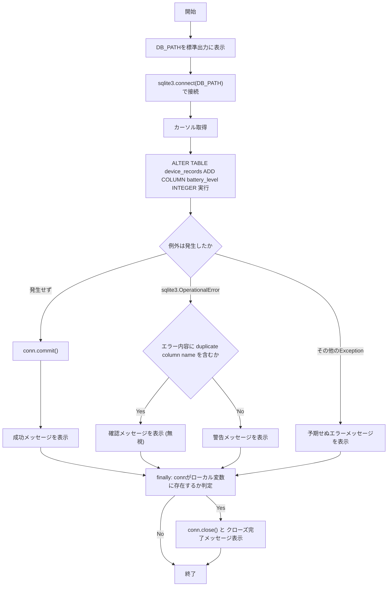
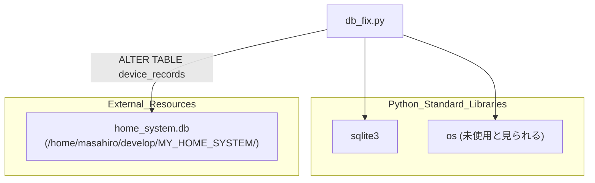

## 1. 解析メタ情報

| 項目 | 内容 |
| --- | --- |
| 対象ファイル | `db_fix.py` |
| 言語 | Python |
| 解析対象 | 提供されたコードのみ |
| 推測・補完 | 一切なし |

## 関連ドキュメント

* [nas_monitor.md](./nas_monitor.md) - `device_records`テーブルの`battery_level`カラム（本ファイルが追加対象とするカラム）を参照する数少ない運用中モジュールの一つと推測される
* [config.md](./config.md) - 本ファイルはコード内コメントで「configに依存せず」直接パスを指定する方針を明示しており、本来`config.py`が提供していたであろうDB接続情報との対比として関連
* [init_unified_db.md](./init_unified_db.md) - `device_records`テーブルを含むDBスキーマの初期構築を担うと推測される関連ドキュメント

## 2. ファイルの概要

`sqlite3`データベースファイルへ直接接続し、`device_records`テーブルに`battery_level`カラムを追加するワンショットの修正スクリプト。関数化されておらず、モジュールの読み込み（実行）と同時にトップレベルで処理が実行される。コード内コメントにより、共通設定モジュール（`config`）を経由せず、DBファイルへの絶対パスをスクリプト内に直接ハードコードする方針であることが明記されている。

* 根拠: `[コメントおよびDB_PATH定義]` (行番号: 4〜5 / 抜粋: "# 修正点: configに依存せず、直接絶対パスを指定します\nDB_PATH = \"/home/masahiro/develop/MY_HOME_SYSTEM/home_system.db\"")
* 根拠: `[ALTER TABLE実行]` (行番号: 14 / 抜粋: "cursor.execute(\"ALTER TABLE device_records ADD COLUMN battery_level INTEGER;\")")
* 根拠: `[重複カラムエラーの無視]` (行番号: 18〜21 / 抜粋: "except sqlite3.OperationalError as e:\n    # 既に追加されている場合のエラーは無視してOK\n    if \"duplicate column name\" in str(e):")
* 根拠: `[接続クローズ]` (行番号: 28〜30 / 抜粋: "finally:\n    if 'conn' in locals():\n        conn.close()")

## 3. 外部依存関係

### インポート一覧

| 名称 | 種類 | 用途 | 根拠 |
| --- | --- | --- | --- |
| `sqlite3` | 標準ライブラリ | SQLiteデータベースへの接続、カーソル生成、SQL実行（`ALTER TABLE`）、および`OperationalError`の捕捉 | 根拠: `[import sqlite3]` (行番号: 1 / 抜粋: "import sqlite3") |
| `os` | 標準ライブラリ | インポートされているが、ファイル内で`os.`を用いた呼び出し箇所が見当たらない（未使用の可能性） | 根拠: `[import os]` (行番号: 2 / 抜粋: "import os") |

### ブラックボックスとなる外部要素

| 名称 | 理由 | 根拠 |
| --- | --- | --- |
| `DB_PATH`先のSQLiteデータベースファイル(`home_system.db`) | 接続先ファイルの実体・既存スキーマ（`device_records`テーブルの既存カラム構成等）が当ファイル内では提供されていないため。 | 根拠: `[DB_PATH]` (行番号: 5 / 抜粋: "DB_PATH = \"/home/masahiro/develop/MY_HOME_SYSTEM/home_system.db\"") |

## 4. 主要要素の定義（関数 / エンドポイント / コンポーネント）

本ファイルは関数・クラス定義を一切持たず、モジュールのトップレベルに実行コードが直接記述されたスクリプトである。以下、モジュールレベル処理全体を単一の要素として扱う。

### モジュールレベル処理（メインスクリプト本体）

* **役割**: `DB_PATH`で指定された固定パスのSQLiteデータベースに接続し、`device_records`テーブルへ`battery_level`（INTEGER型）カラムを追加する。
* 根拠: `[DB_PATH定義およびALTER TABLE文]` (行番号: 5, 14 / 抜粋: "DB_PATH = \"/home/masahiro/develop/MY_HOME_SYSTEM/home_system.db\"" / "cursor.execute(\"ALTER TABLE device_records ADD COLUMN battery_level INTEGER;\")")

* **引数/リクエスト**: なし（スクリプトとして直接実行される。外部からのパラメータ入力は存在しない）
* 根拠: `[モジュール全体]` (行番号: 1〜31 / 抜粋: "import sqlite3\nimport os")

* **戻り値/レスポンス**: なし。処理結果は`print`により標準出力へ絵文字付きメッセージとして出力されるのみ。
* 根拠: `[print出力]` (行番号: 16, 21, 23, 26 / 抜粋: "print(\"✅ 成功: 'battery_level' カラムを追加しました。\")")

* **副作用**: `sqlite3.connect`によるDB接続の確立、`ALTER TABLE`によるスキーマ変更、`conn.commit()`による永続化、`conn.close()`によるDB接続のクローズ。
* 根拠: `[connect/commit/close]` (行番号: 10, 15, 29〜30 / 抜粋: "conn = sqlite3.connect(DB_PATH)" / "conn.commit()" / "conn.close()")

* **エラーハンドリング**: `sqlite3.OperationalError`を捕捉し、エラーメッセージに`"duplicate column name"`が含まれる場合はカラム既存として情報メッセージのみ表示（無視）、それ以外は警告として表示。さらに広範な`Exception`も別途捕捉しエラーメッセージを表示。`finally`節で、`conn`変数がローカルスコープに存在する場合に限り接続をクローズする。
* 根拠: `[except節]` (行番号: 18〜30 / 抜粋: "except sqlite3.OperationalError as e:\n    # 既に追加されている場合のエラーは無視してOK\n    if \"duplicate column name\" in str(e):")

## 5. 処理フロー図

## 6. 依存関係図

## 7. 次のステップ（リバースエンジニアリングの提案）

| 優先度 | ファイル名(推測可) | 理由 | 根拠 |
| --- | --- | --- | --- |
| 高 | `nas_monitor.py` | `device_records`テーブルおよび`battery_level`カラムを実際に書き込み・参照している可能性が高く、本スクリプトの追加対象カラムがどのように利用されるかを確認するため。 | 根拠: `[ALTER TABLE device_records ADD COLUMN battery_level]` (行番号: 14 / 抜粋: "cursor.execute(\"ALTER TABLE device_records ADD COLUMN battery_level INTEGER;\")") |
| 中 | `init_unified_db.py` | `device_records`テーブルの完全な初期スキーマ（本カラム追加前の既存カラム構成）を確認するため。 | 根拠: `[device_recordsテーブル名]` (行番号: 14 / 抜粋: "ADD COLUMN battery_level") |
| 中 | `config.py` | コメントで言及されている「config」が本来どのようなDBパス設定を提供していたかを確認し、ハードコードされたパスとの差異を把握するため。 | 根拠: `[configに依存せずのコメント]` (行番号: 4 / 抜粋: "# 修正点: configに依存せず、直接絶対パスを指定します") |

## 8. 保守上の注意点

* **開発者ローカル環境依存の絶対パス**: `DB_PATH`が`/home/masahiro/develop/MY_HOME_SYSTEM/home_system.db`という特定ユーザーのホームディレクトリを含む絶対パスでハードコードされており、他の環境（本番サーバー等）ではそのまま動作しない可能性が高い。
* 根拠: `[DB_PATH]` (行番号: 5 / 抜粋: "DB_PATH = \"/home/masahiro/develop/MY_HOME_SYSTEM/home_system.db\"")
* **未使用のインポート**: `import os`が行われているが、ファイル内で`os`モジュールの関数呼び出しが見当たらない。
* 根拠: `[import os]` (行番号: 2 / 抜粋: "import os")
* **ログ基盤(logger.py)不使用**: 他モジュールで使われる`setup_logging`等の共通ロギング機構を用いず、`print`文による標準出力のみで結果を通知しており、実行ログがファイルやDiscordに記録されない。
* 根拠: `[print文]` (行番号: 7, 16, 21, 23, 26, 30 / 抜粋: "print(f\"Connecting to database: {DB_PATH}\")")
* **広範な例外の握りつぶし**: `except Exception as e`で予期しないエラー全般を捕捉し、メッセージ表示のみで再送出（`raise`）していないため、自動実行時にスクリプトの失敗を外部から検知しにくい。
* 根拠: `[except Exception]` (行番号: 25〜26 / 抜粋: "except Exception as e:\n    print(f\"❌ 予期せぬエラー: {e}\")")

## 9. 不明事項一覧

| 項目 | 理由 | 必要なファイル |
| --- | --- | --- |
| `device_records`テーブルの既存カラム構成 | `ALTER TABLE`によるカラム追加のみが記述されており、テーブルの完全な定義は当ファイル内に存在しないため。 | `init_unified_db.py`、DBスキーマ定義ファイル |
| `battery_level`カラムの実際の利用箇所 | 追加されたカラムがどのモジュールで書き込み・読み取りされるかは当ファイルからは判断できないため。 | `nas_monitor.py`等、`device_records`を参照するモジュール |
| 本スクリプトの実行契機（手動実行か自動実行か） | `if __name__ == "__main__":`のガードがなく常に実行される構造だが、呼び出し元やスケジューリングの記述が当ファイル内に存在しないため。 | 呼び出し元スクリプトまたは運用手順書 |

## 10. 自己検証結果

* [x] 推測・外部ファイルの仕様を一切含んでいない（完了）
* [x] 全関数・全クラス・全コンポーネントを列挙した（完了）
* [x] 全てのインポート要素を列挙した（完了）
* [x] すべての仕様説明に「根拠（行番号・抜粋）」を明記した（完了）
* [x] 根拠漏れが0件である（完了）
* [x] Mermaid構文にエラーの原因となる記号（エスケープ漏れ）がない（完了）
* [x] 不明事項を漏れなく列挙した（完了）
