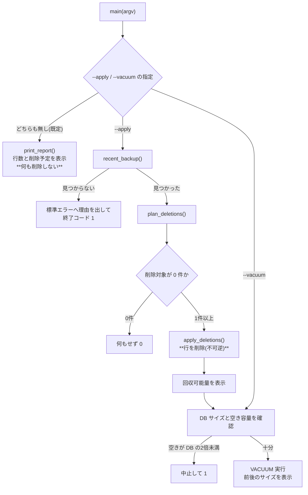
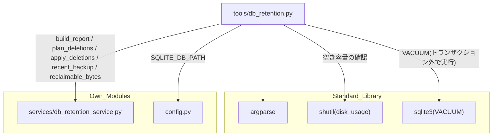

## 1. 解析メタ情報

| 項目 | 内容 |
| --- | --- |
| 対象ファイル | `MY_HOME_SYSTEM/tools/db_retention.py` |
| 言語 | Python |
| 解析対象 | 提供されたコードのみ |
| 推測・補完 | 一切なし |
| 解析基準コミット | Issue #733 (AUDIT-003) での新規追加時点 |

## 関連ドキュメント

* [db_retention_service.md](./db_retention_service.md) - 実処理の実体。本 CLI は `build_report` / `plan_deletions` / `apply_deletions` / `recent_backup` / `reclaimable_bytes` を呼ぶ薄い層
* [nas_monitor.md](./nas_monitor.md) - 同じサービスを1日1回自動で呼ぶ側。そちらは既定でドライランのまま動く
* [backup_service.md](./backup_service.md) - `--apply` の前提条件となるバックアップを作る側
* [config.md](./config.md) - `SQLITE_DB_PATH` / `DB_ROW_RETENTION_ENABLED` の定義元
* [notify_task_failure.md](./notify_task_failure.md) - 同じ `tools/` 配下の CLI。`sys.path` へ親ディレクトリを足してから `config` を import する構成が共通

## 2. ファイルの概要

SQLite の行の保持期間削除を、実機で手元から確認・実行するための CLI。

**Issue #733 (AUDIT-003)**: `services/db_retention_service.py` の仕組みは `nas_monitor` から1日1回自動で呼ばれるが、**既定はドライラン**で1行も消さない。有効化してよいかを判断するには「どのテーブルがどれだけ育っていて、有効化すると何行消えるのか」を実機で見る必要があるため、その確認と、必要なら手動実行・`VACUUM` までを担う。

* 根拠: モジュールdocstring (行番号: 3〜19 / 抜粋: "SQLite の行の保持期間削除を、実機で手元から確認・実行するための CLI (Issue #733)。")

引数なしで実行すると**何も削除せず**レポートだけを出す。`--apply` は `config.DB_ROW_RETENTION_ENABLED` が `False` でも削除する（このコマンドを打つこと自体が明示的な意思表示のため）が、直近のバックアップが確認できなければ中止する。

* 根拠: `def main(argv: list[str] | None = None) -> int:` (行番号: 153 / 抜粋: "def main(")

## 3. 外部依存関係

### インポート一覧

| 名称 | 種類 | 用途 | 根拠 |
| --- | --- | --- | --- |
| `argparse` | 標準 | `--apply` / `--vacuum` の解析 | 根拠: [インポート宣言] (行番号: 22 / 抜粋: "import argparse") |
| `os` | 標準 | `sys.path` の組み立て・DB ファイルの存在確認とサイズ取得 | 根拠: [インポート宣言] (行番号: 23 / 抜粋: "import os") |
| `shutil` | 標準 | `disk_usage` による空き容量の確認（`VACUUM` の前提） | 根拠: [インポート宣言] (行番号: 24 / 抜粋: "import shutil") |
| `sqlite3` | 標準 | `VACUUM` の実行（トランザクション外で行う必要があるため直接接続する） | 根拠: [インポート宣言] (行番号: 25 / 抜粋: "import sqlite3") |
| `sys` | 標準 | `sys.path` への追加・終了コード・標準エラー出力 | 根拠: [インポート宣言] (行番号: 26 / 抜粋: "import sys") |
| `time` | 標準 | 所要時間の計測 | 根拠: [インポート宣言] (行番号: 27 / 抜粋: "import time") |
| `config` | 自作 | `SQLITE_DB_PATH` | 根拠: [インポート宣言] (行番号: 31 / 抜粋: "import config") |
| `services.db_retention_service` | 自作 | 実処理のすべて | 根拠: [インポート宣言] (行番号: 32 / 抜粋: "from services import db_retention_service as retention") |

インポートに先立ち親ディレクトリを `sys.path` へ追加している（根拠: [パス操作] (行番号: 29 / 抜粋: "sys.path.insert(0, os.path.abspath(os.path.join(os.path.dirname(__file__), \"..\")))")）。

### ブラックボックスとなる外部要素

| 名称 | 理由 | 根拠 |
| --- | --- | --- |
| `config.SQLITE_DB_PATH` が指す実 DB の内容・サイズ | 実行環境に依存する | 根拠: [変数参照] (行番号: 115 / 抜粋: "db_path = config.SQLITE_DB_PATH") |
| `VACUUM` の実所要時間 | DB サイズと SD カードの書き込み速度に依存し、本ファイルからは判断できない | 根拠: `def do_vacuum() -> int:` (行番号: 107) |

## 4. 主要要素の定義（関数 / エンドポイント / コンポーネント）

### `_human_bytes`

* **役割**: バイト数を B / KB / MB / GB の読みやすい文字列にする。
* 根拠: `def _human_bytes(num: float) -> str:` (行番号: 35 / 抜粋: "def _human_bytes(")

* **引数/リクエスト**: `num` (`float`)
* 根拠: `def _human_bytes(num: float) -> str:` (行番号: 35)

* **戻り値/レスポンス**: `str`
* 根拠: `def _human_bytes(num: float) -> str:` (行番号: 35)

* **副作用**: なし
* 根拠: `def _human_bytes(num: float) -> str:` (行番号: 35)

* **エラーハンドリング**: なし
* 根拠: `def _human_bytes(num: float) -> str:` (行番号: 35)

### `print_report`

* **役割**: 現在の行数と削除予定件数を表示する。**何も削除しない。** 「削除対象に登録済みのテーブル」（全行数・削除予定・保持日数・境界・最古/最新）と「未登録のテーブル」（行数の多い順に上位20件）の2部構成。後者を出すのは、どのテーブルを対象に追加すべきかを実測で決めるための材料にするため。
* 根拠: `def print_report() -> None:` (行番号: 43 / 抜粋: "def print_report(")

* **引数/リクエスト**: なし
* 根拠: `def print_report() -> None:` (行番号: 43)

* **戻り値/レスポンス**: `None`（標準出力へ出す）
* 根拠: `def print_report() -> None:` (行番号: 43)

* **副作用**: 標準出力への印字のみ
* 根拠: `def print_report() -> None:` (行番号: 43)

* **エラーハンドリング**: なし（`build_report` 側で個別テーブルの失敗は握られる）
* 根拠: `def print_report() -> None:` (行番号: 43)

### `do_apply`

* **役割**: 保持期間を超えた行を実際に削除する。最初に `retention.recent_backup()` を確認し、見つからなければ**中止**する（行削除は不可逆であるため）。削除対象が0件なら何もしない。完了後に `VACUUM` で回収できる量を表示する。
* 根拠: `def do_apply() -> int:` (行番号: 78 / 抜粋: "def do_apply(")

* **引数/リクエスト**: なし
* 根拠: `def do_apply() -> int:` (行番号: 78)

* **戻り値/レスポンス**: 終了コード（バックアップ未確認で中止した場合 `1`、それ以外 `0`）
* 根拠: `def do_apply() -> int:` (行番号: 78)

* **副作用**: **行の削除（不可逆）。**
* 根拠: `def do_apply() -> int:` (行番号: 78)

* **エラーハンドリング**: バックアップ未確認時は標準エラーへ理由を出して `1` を返す
* 根拠: `def do_apply() -> int:` (行番号: 78)

### `do_vacuum`

* **役割**: `VACUUM` を実行してファイルを縮める。自動実行させず CLI に分けているのは、`VACUUM` が DB 全体を書き直す操作で、(1) 実行中は排他ロックが掛かりサーバーの書き込みが止まる、(2) 一時的に DB と同じサイズの空き容量を要求する、の2点が実機のファイルサイズとディスク残量に依存するため。空き容量が DB サイズの2倍未満なら中止する（安全側に倒している）。
* 根拠: `def do_vacuum() -> int:` (行番号: 107 / 抜粋: "def do_vacuum(")

* **引数/リクエスト**: なし
* 根拠: `def do_vacuum() -> int:` (行番号: 107)

* **戻り値/レスポンス**: 終了コード（DB 不在・空き容量不足・SQL エラーで `1`、成功で `0`）
* 根拠: `def do_vacuum() -> int:` (行番号: 107)

* **副作用**: DB ファイルの再構築。実行前後のサイズと所要時間を表示する
* 根拠: `def do_vacuum() -> int:` (行番号: 107)

* **エラーハンドリング**: `sqlite3.Error` を捕捉して標準エラーへ出し `1` を返す。接続は `finally` で必ず閉じる。`VACUUM` はトランザクション内で実行できないため `core.database.get_db_cursor` ではなく `isolation_level=None` の直接接続を使う
* 根拠: `def do_vacuum() -> int:` (行番号: 107)

### `main`

* **役割**: 引数を解析し、`--apply` も `--vacuum` も無ければ `print_report()` を呼んで終了する（**既定は非破壊**）。両方指定された場合は `--apply` → `--vacuum` の順に実行し、`--apply` が失敗した時点で打ち切る。
* 根拠: `def main(argv: list[str] | None = None) -> int:` (行番号: 153 / 抜粋: "def main(")

* **引数/リクエスト**: `argv`（省略時は `sys.argv[1:]`）
* 根拠: `def main(argv: list[str] | None = None) -> int:` (行番号: 153)

* **戻り値/レスポンス**: 終了コード
* 根拠: `def main(argv: list[str] | None = None) -> int:` (行番号: 153)

* **副作用**: 指定されたサブ動作に従う
* 根拠: `def main(argv: list[str] | None = None) -> int:` (行番号: 153)

* **エラーハンドリング**: 各サブ関数の戻り値をそのまま終了コードとして返す
* 根拠: `def main(argv: list[str] | None = None) -> int:` (行番号: 153)

## 5. 処理フロー図

## 6. 依存関係図

## 7. 次のステップ（リバースエンジニアリングの提案）

| 優先度 | ファイル名(推測可) | 理由 | 根拠 |
| --- | --- | --- | --- |
| 高 | `services/db_retention_service.py` | 本 CLI はその薄いラッパーで、判定・削除のロジックはすべてそちらにある | `from services import db_retention_service as retention` (行番号: 32) |
| 中 | `services/backup_service.py` | `--apply` の前提条件を作る側 | `def do_apply() -> int:` (行番号: 78) |
| 低 | `tools/notify_task_failure.py` | 同じ `tools/` 配下の CLI。`sys.path` 操作と `config` import の構成が共通 | `sys.path.insert(0, os.path.abspath(os.path.join(os.path.dirname(__file__), "..")))` (行番号: 29) |

## 8. 保守上の注意点

* **`--apply` は `config.DB_ROW_RETENTION_ENABLED` を見ない**: 自動実行の設定に関わらず削除する。運用者がこのコマンドを打つこと自体を明示的な意思表示とみなす設計で、代わりにバックアップの存在確認を必須にしている。
* **`--vacuum` の空き容量チェックは安全側に倒している**: SQLite の `VACUUM` は実際には DB サイズと同程度の一時領域を要求するが、本ファイルは2倍を要求する。SD カードが逼迫している実機で途中失敗させないための判断で、厳密な下限ではない。
* **`cron` から自動実行しないこと**: `--apply` / `--vacuum` はどちらも書き込みロックを取る。自動実行が必要なら `nas_monitor` 経由の（バッチ分割と1回あたりの上限がある）経路を使う。
* **`tools/` は `.coveragerc` の omit 対象ではない**: 本ファイルもカバレッジの分母に入る。

## 9. 不明事項一覧

| 項目 | 理由 | 必要なファイル |
| --- | --- | --- |
| 実機での `print_report()` の実出力 | 実機の DB にのみ存在する。保持日数の妥当性判断はこの出力を見てから行う | 実機での実行結果 |
| `VACUUM` の実所要時間とその間のサービス影響 | DB サイズと SD カードの性能に依存する | 実機での計測 |
| 本 CLI を `run_task.sh` 経由の定期実行に載せるかどうか | 現時点でどこからも自動起動されていない（`deploy/cron/crontab` に記載が無い） | `deploy/cron/crontab` |
