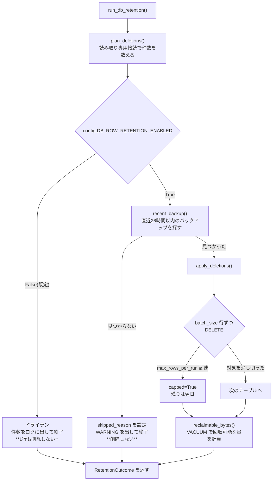
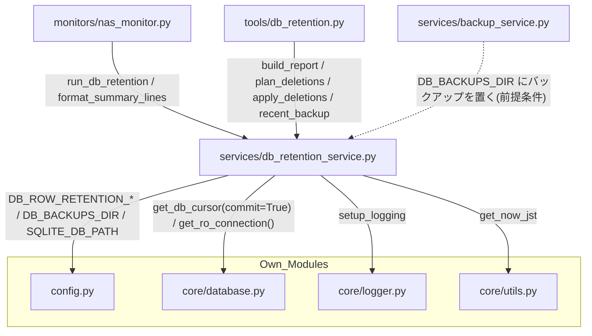

## 1. 解析メタ情報

| 項目 | 内容 |
| --- | --- |
| 対象ファイル | `MY_HOME_SYSTEM/services/db_retention_service.py` |
| 言語 | Python |
| 解析対象 | 提供されたコードのみ |
| 推測・補完 | 一切なし |
| 解析基準コミット | Issue #733 (AUDIT-003) での新規追加時点 |

## 関連ドキュメント

* [nas_monitor.md](./nas_monitor.md) - 唯一の自動実行の呼び出し元。ファイルの保持期間削除（`run_retention_cleanup`）と同じ1日1回のタイミングで本モジュールを呼び、結果を同じ Discord 通知に載せる
* [db_retention.md](./db_retention.md) - 実機で手動確認・実行するための CLI。本モジュールの `build_report` / `plan_deletions` / `apply_deletions` / `recent_backup` / `reclaimable_bytes` を呼ぶ
* [backup_service.md](./backup_service.md) - 削除の前提条件である「直近の成功したバックアップ」を作る側。`config.DB_BACKUPS_DIR` に `home_system_<timestamp>.db` を置く
* [database.md](./database.md) - `get_db_cursor`（削除用の書き込み接続。ロック時のリトライ付き）と `get_ro_connection`（集計用の読み取り専用接続）の実体
* [config.md](./config.md) - `DB_ROW_RETENTION_*` の定義元
* [utils.md](./utils.md) - `get_now_jst`（保持期間の境界を JST で計算するため）

## 2. ファイルの概要

SQLite の**行**に対する保持期間削除を行うサービス層モジュール。

**Issue #733 (AUDIT-003)**: NAS 上のファイルには保持期間削除が実装されている一方、SQLite の行を削除・アーカイブ・`VACUUM` するコードはリポジトリ内に1つも存在しなかった。`nas_monitor.run_retention_cleanup` が削除していたのは NVR 録画・スナップショット・DB バックアップ・HLS キャッシュで、いずれもファイルである。

* 根拠: モジュールdocstring (行番号: 2〜40 / 抜粋: "SQLite の「行」の保持期間削除 (Issue #733 / AUDIT-003)。")

設計上の最大の特徴は**既定がドライラン**であること。`config.DB_ROW_RETENTION_ENABLED` が `False`（既定）のあいだ、本モジュールは1行も削除せず「何がどれだけ消えるか」を数えて報告するだけで終わる。行削除は不可逆であり、テーブルごとの適切な保持期間は実機のデータ量を見ないと決められないため、「仕組みを先に入れ、値は実測してから決める」という順序を取っている。

* 根拠: `def run_db_retention(now=None) -> RetentionOutcome:` (行番号: 367 / 抜粋: "def run_db_retention(")

削除対象は明示的に登録したテーブルだけで、`RETENTION_TARGETS` に無いテーブルは1行も消えない。一方 `build_report()` は DB 内の**全**テーブルの行数を返すため、「対象に入れていないテーブルがどれだけ育っているか」も同じ出力で分かる。

* 根拠: `RETENTION_TARGETS: tuple[RetentionTarget, ...] = (` (行番号: 74 / 抜粋: "RETENTION_TARGETS: tuple[RetentionTarget, ...] = (")

### 削除対象に入れていないもの（モジュールdocstringに明記）

| 対象 | 理由 |
| --- | --- |
| `quest_history` / `reward_history` | Family Quest の年代記の原資。単純に消すと家族の記録が失われる（#762 が同じ懸念を扱う）。#733 の「推奨修正」どおり、削除ではなく日次サマリへの集約を別途設計すべき対象 |
| `daily_logs` および `*_records` 系 | 人が読む記録であり、センサーの生ログとはライフサイクルが違う |
| `weather_history` | `UNIQUE(date, location)` で1日1行/地点しか増えないため、蓄積の問題になっていない |
| `land_price_records` / `suumo_records` | 更新頻度が低く、蓄積の問題になっていない |
| `quest_cancellation_audit` | クエスト取消の監査証跡（#762）。物理削除される `quest_history` の行を保全するためのテーブルなので、ここを期限で消すと「取消で消えた記録」そのものが失われる。取消は稀な操作で行数も増えない |

* 根拠: モジュールdocstring (行番号: 28〜39 / 抜粋: "### 対象に入れていないもの")

## 3. 外部依存関係

### インポート一覧

| 名称 | 種類 | 用途 | 根拠 |
| --- | --- | --- | --- |
| `os` | 標準 | バックアップディレクトリの走査・DB ファイルサイズの取得 | 根拠: [インポート宣言] (行番号: 43 / 抜粋: "import os") |
| `sqlite3` | 標準 | 例外型（`sqlite3.Error`）と接続の型注釈 | 根拠: [インポート宣言] (行番号: 44 / 抜粋: "import sqlite3") |
| `time` | 標準 | バックアップの更新時刻との比較 | 根拠: [インポート宣言] (行番号: 45 / 抜粋: "import time") |
| `dataclasses.dataclass`, `field` | 標準 | 計画・結果の値オブジェクト | 根拠: [インポート宣言] (行番号: 46 / 抜粋: "from dataclasses import dataclass, field") |
| `datetime.timedelta` | 標準 | 保持期間の境界の算出 | 根拠: [インポート宣言] (行番号: 47 / 抜粋: "from datetime import timedelta") |
| `config` | 自作 | `DB_ROW_RETENTION_*` / `DB_BACKUPS_DIR` / `SQLITE_DB_PATH` | 根拠: [インポート宣言] (行番号: 50 / 抜粋: "import config") |
| `core.database.get_db_cursor`, `get_ro_connection` | 自作 | 削除用の書き込み接続と、集計用の読み取り専用接続 | 根拠: [インポート宣言] (行番号: 51 / 抜粋: "from core.database import get_db_cursor, get_ro_connection") |
| `core.logger.setup_logging` | 自作 | ロガー取得（`DiscordErrorHandler` が付く） | 根拠: [インポート宣言] (行番号: 52 / 抜粋: "from core.logger import setup_logging") |
| `core.utils.get_now_jst` | 自作 | 保持期間の境界を JST で計算する | 根拠: [インポート宣言] (行番号: 53 / 抜粋: "from core.utils import get_now_jst") |

### ブラックボックスとなる外部要素

| 名称 | 理由 | 根拠 |
| --- | --- | --- |
| `config.DB_BACKUPS_DIR` の実体 | NAS 上のパスであり、存在するかどうかは実行環境に依存する | 根拠: [変数参照] (行番号: 267 / 抜粋: "backups_dir = getattr(config, \"DB_BACKUPS_DIR\", \"\")") |
| 各対象テーブルの実際の行数・最古の時刻 | 実機の DB にのみ存在する。本ファイルからは判断できない（これを測るための `build_report` である） | 根拠: `def build_report(now=None) -> dict[str, Any]:` (行番号: 322) |
| 書き込み側が実際に入れている時刻文字列の形式 | 本ファイルは `"%Y-%m-%d %H:%M:%S"` を前提に境界文字列を作るが、各テーブルへの書き込みは別モジュールが行う | 根拠: `def _cutoff_string(retention_days: int, now=None) -> str:` (行番号: 135) |

## 4. 主要要素の定義（関数 / エンドポイント / コンポーネント）

### `class RetentionTarget` (frozen dataclass)

* **役割**: 削除対象テーブル1件の定義。`table` / `timestamp_column` / `retention_days_attr` / `label` を持つ。保持日数を直接の数値ではなく **`config` の属性名**で保持しているのは、テストやローカル運用で `config` の値を差し替えたときに、モジュール import 時に焼き付いた値ではなく実行時の値が使われるようにするため（`config.SQLITE_DB_PATH` を monkeypatch する既存テストと同じ考え方）。
* 根拠: `class RetentionTarget:` (行番号: 62 / 抜粋: "class RetentionTarget:")

* **引数/リクエスト**: 該当なし（値オブジェクト）
* 根拠: `class RetentionTarget:` (行番号: 62)

* **戻り値/レスポンス**: 該当なし
* 根拠: `class RetentionTarget:` (行番号: 62)

* **副作用**: なし（`frozen=True`）
* 根拠: `@dataclass(frozen=True)` (行番号: 58 / 抜粋: "@dataclass(frozen=True)")

* **エラーハンドリング**: なし
* 根拠: `class RetentionTarget:` (行番号: 62)

### `RETENTION_TARGETS` (モジュール定数)

* **役割**: 削除対象テーブルの一覧。7件（`device_records` / `power_usage` / `switchbot_meter_logs` / `nas_records` / `bicycle_parking_records` / `security_logs` は `DB_ROW_RETENTION_SENSOR_DAYS`、`routine_step_events` は `occurred_at` 列と `DB_ROW_RETENTION_EVENT_DAYS`）。**ここに無いテーブルは1行も消えない。**
* 根拠: `RETENTION_TARGETS: tuple[RetentionTarget, ...] = (` (行番号: 74 / 抜粋: "RETENTION_TARGETS: tuple[RetentionTarget, ...] = (")

### `class TablePlan` / `class TableResult` / `class RetentionOutcome` (dataclass)

* **役割**: それぞれ「1テーブル分の消える予定」「1テーブル分の実削除結果」「1回の実行の結果」。`RetentionOutcome` は `dry_run` / `plans` / `results` / `skipped_reason` / `reclaimable_bytes` を持ち、`planned_rows` と `deleted_rows` を集計プロパティとして提供する。
* 根拠: `class TablePlan:` (行番号: 93 / 抜粋: "class TablePlan:"), `class TableResult:` (行番号: 105 / 抜粋: "class TableResult:"), `class RetentionOutcome:` (行番号: 113 / 抜粋: "class RetentionOutcome:")

### `plan_deletions`

* **役割**: 対象テーブルごとに「保持期間より古い行が何行あるか」を数える。**何も削除しない。** 読み取り専用接続を使うため書き込みロックを取らない。対象テーブルが DB に存在しない場合（マイグレーション未適用の古い DB）はスキップする。
* 根拠: `def plan_deletions(now=None) -> list[TablePlan]:` (行番号: 155 / 抜粋: "def plan_deletions(")

* **引数/リクエスト**: `now`（省略時は `get_now_jst()`）
* 根拠: `def plan_deletions(now=None) -> list[TablePlan]:` (行番号: 155)

* **戻り値/レスポンス**: `list[TablePlan]`（各要素に `total_rows` / `deletable_rows` / `cutoff` / `oldest` / `newest`）
* 根拠: `def plan_deletions(now=None) -> list[TablePlan]:` (行番号: 155)

* **副作用**: なし（`get_ro_connection` による読み取りのみ）
* 根拠: `def plan_deletions(now=None) -> list[TablePlan]:` (行番号: 155)

* **エラーハンドリング**: テーブル不在は `_table_exists` で事前に判定してスキップする。SQL エラーは呼び出し元へ伝播する
* 根拠: `def _table_exists(conn: sqlite3.Connection, table: str) -> bool:` (行番号: 148 / 抜粋: "def _table_exists(")

### `apply_deletions`

* **役割**: `plans` に従って実際に行を削除する。1トランザクションあたり `batch_size` 行ずつ削る。これは SQLite の `DELETE` がその間ずっと書き込みロックを保持するためで、一度に数十万行を消すと同時に走っている Webhook の保存が `database is locked` のリトライ上限を超え、**センサーイベントが恒久的に失われる**（#733 が指摘した問題の連鎖そのもの）。`max_rows_per_run` は1回の実行全体の上限で、初回の積み残しが大きいときに複数日へ分割するための保険。
* 根拠: `def apply_deletions(` (行番号: 199 / 抜粋: "def apply_deletions(")

* **引数/リクエスト**: `plans` (`list[TablePlan]`)、`batch_size`（省略時 `config.DB_ROW_RETENTION_BATCH_SIZE`）、`max_rows_per_run`（省略時 `config.DB_ROW_RETENTION_MAX_ROWS_PER_RUN`）
* 根拠: `def apply_deletions(` (行番号: 199)

* **戻り値/レスポンス**: `list[TableResult]`（`deleted_rows` と、上限に到達したかを示す `capped`）
* 根拠: `def apply_deletions(` (行番号: 199)

* **副作用**: **行の削除（不可逆）。** `DELETE FROM <table> WHERE rowid IN (SELECT rowid ... ORDER BY <col> LIMIT ?)` を `get_db_cursor(commit=True)` で繰り返す。主キー経由のサブクエリにしているのは、`DELETE` 自体に `LIMIT` を付けられる SQLite ビルド（`SQLITE_ENABLE_UPDATE_DELETE_LIMIT`）が保証されていないため
* 根拠: `def apply_deletions(` (行番号: 199)

* **エラーハンドリング**: 1バッチの削除件数が 0 になった場合は無限ループを避けて打ち切る。SQL エラーは呼び出し元へ伝播する
* 根拠: `def apply_deletions(` (行番号: 199)

### `recent_backup`

* **役割**: 直近のDBバックアップが指定時間以内に存在するかを返す。#733 の副作用の項が「削除前に必ずバックアップが成功していることを確認」を必須としているための前提条件チェック。`backup_service.perform_backup` が成功時に `config.DB_BACKUPS_DIR` へ `home_system_<timestamp>.db` を置くので、そのファイルの更新時刻を成功の記録として使う（専用の状態ファイルを増やさない）。ファイル名の前後で絞り込んでいるため、同じディレクトリに置かれる設定ファイルのコピー（`config_*.py` 等）は成功の証拠にならない。
* 根拠: `def recent_backup(within_hours: int | None = None) -> tuple[bool, str]:` (行番号: 263 / 抜粋: "def recent_backup(")

* **引数/リクエスト**: `within_hours`（省略時 `config.DB_ROW_RETENTION_REQUIRE_BACKUP_WITHIN_HOURS`、既定26）
* 根拠: `def recent_backup(within_hours: int | None = None) -> tuple[bool, str]:` (行番号: 263)

* **戻り値/レスポンス**: `(ok, detail)`。`ok=True` なら `detail` は採用したバックアップのファイル名、`False` なら理由（ディレクトリ不在／バックアップ無し／古すぎる）
* 根拠: `def recent_backup(within_hours: int | None = None) -> tuple[bool, str]:` (行番号: 263)

* **副作用**: なし（ディレクトリの走査と `os.path.getmtime` のみ）
* 根拠: `def recent_backup(within_hours: int | None = None) -> tuple[bool, str]:` (行番号: 263)

* **エラーハンドリング**: 個々のファイルの `OSError` は `continue` で読み飛ばす。最新更新時刻の番兵は `float("-inf")` で、`0.0` にすると mtime が epoch のファイルを「見つからなかった」と誤判定し「古いバックアップしかない」を「バックアップが無い」と報告してしまう
* 根拠: `def recent_backup(within_hours: int | None = None) -> tuple[bool, str]:` (行番号: 263)

### `reclaimable_bytes`

* **役割**: `VACUUM` で回収できる見込みのバイト数（`PRAGMA freelist_count` × `PRAGMA page_size`）。`DELETE` してもファイルは縮まないため、「消したのにサイズが減らない」ことを運用者が誤解しないようにする。**`VACUUM` 自体はここでは実行しない。**
* 根拠: `def reclaimable_bytes() -> int:` (行番号: 303 / 抜粋: "def reclaimable_bytes(")

* **引数/リクエスト**: なし
* 根拠: `def reclaimable_bytes() -> int:` (行番号: 303)

* **戻り値/レスポンス**: `int`（取得に失敗した場合は `0`）
* 根拠: `def reclaimable_bytes() -> int:` (行番号: 303)

* **副作用**: なし
* 根拠: `def reclaimable_bytes() -> int:` (行番号: 303)

* **エラーハンドリング**: `sqlite3.Error` を捕捉して警告ログを出し `0` を返す
* 根拠: `def reclaimable_bytes() -> int:` (行番号: 303)

### `build_report`

* **役割**: DB 内の**全**テーブルの行数と、削除対象テーブルの削除予定件数をまとめて返す。対象に入れていないテーブルも行数を出すのは、「どのテーブルを対象に追加すべきか」を実測で決めるための材料にするため（#733 の保留理由が「何をどれだけ消すかがコードから機械的に導けない」だった）。
* 根拠: `def build_report(now=None) -> dict[str, Any]:` (行番号: 322 / 抜粋: "def build_report(")

* **引数/リクエスト**: `now`
* 根拠: `def build_report(now=None) -> dict[str, Any]:` (行番号: 322)

* **戻り値/レスポンス**: `dict`（`db_path` / `db_bytes` / `reclaimable_bytes` / `enabled` / `tables`（`table`・`rows`・`managed`）/ `plans`）
* 根拠: `def build_report(now=None) -> dict[str, Any]:` (行番号: 322)

* **副作用**: なし（読み取りのみ）
* 根拠: `def build_report(now=None) -> dict[str, Any]:` (行番号: 322)

* **エラーハンドリング**: 個別テーブルの `COUNT(*)` が `sqlite3.Error` になった場合は警告ログを出してそのテーブルを飛ばす。DB ファイルサイズ取得の `OSError` は `0` にフォールバックする
* 根拠: `def build_report(now=None) -> dict[str, Any]:` (行番号: 322)

### `run_db_retention`

* **役割**: 保持期間削除の入口。`nas_monitor` から1日1回呼ばれる。(1) 計画を立て、(2) `config.DB_ROW_RETENTION_ENABLED` が `False` なら**ここで終了して1行も削除しない**、(3) 有効でも直近のバックアップを確認できなければ削除を見送る、(4) それ以外で初めて `apply_deletions` を呼ぶ。
* 根拠: `def run_db_retention(now=None) -> RetentionOutcome:` (行番号: 367 / 抜粋: "def run_db_retention(")

* **引数/リクエスト**: `now`
* 根拠: `def run_db_retention(now=None) -> RetentionOutcome:` (行番号: 367)

* **戻り値/レスポンス**: `RetentionOutcome`
* 根拠: `def run_db_retention(now=None) -> RetentionOutcome:` (行番号: 367)

* **副作用**: 有効かつバックアップ確認 OK の場合のみ行を削除する。いずれの場合もログを出す
* 根拠: `def run_db_retention(now=None) -> RetentionOutcome:` (行番号: 367)

* **エラーハンドリング**: バックアップ未確認時は例外にせず `skipped_reason` を設定して `WARNING` を出す（「消さない」側へ倒す）
* 根拠: `def run_db_retention(now=None) -> RetentionOutcome:` (行番号: 367)

### `format_summary_lines`

* **役割**: Discord 通知に載せる行を組み立てる（`nas_monitor` のファイル削除と同じ箇条書き形式）。ドライラン時は「ドライラン」と明記し、削除時は回収可能量も添える。
* 根拠: `def format_summary_lines(outcome: RetentionOutcome) -> list[str]:` (行番号: 398 / 抜粋: "def format_summary_lines(")

* **引数/リクエスト**: `outcome` (`RetentionOutcome`)
* 根拠: `def format_summary_lines(outcome: RetentionOutcome) -> list[str]:` (行番号: 398)

* **戻り値/レスポンス**: `list[str]`（削除も予定も無ければ空リスト＝通知に何も足さない）
* 根拠: `def format_summary_lines(outcome: RetentionOutcome) -> list[str]:` (行番号: 398)

* **副作用**: なし
* 根拠: `def format_summary_lines(outcome: RetentionOutcome) -> list[str]:` (行番号: 398)

* **エラーハンドリング**: なし
* 根拠: `def format_summary_lines(outcome: RetentionOutcome) -> list[str]:` (行番号: 398)

## 5. 処理フロー図

## 6. 依存関係図

## 7. 次のステップ（リバースエンジニアリングの提案）

| 優先度 | ファイル名(推測可) | 理由 | 根拠 |
| --- | --- | --- | --- |
| 高 | `monitors/nas_monitor.py` | 唯一の自動実行の呼び出し元。実行タイミング（1日1回・8時以降）の判定はそちらにある | `def run_db_retention(now=None) -> RetentionOutcome:` (行番号: 356) |
| 高 | `tools/db_retention.py` | 実機で実測するための CLI。有効化の判断はこちらの出力で行う | `def build_report(now=None) -> dict[str, Any]:` (行番号: 313) |
| 中 | `services/backup_service.py` | 削除の前提条件となるバックアップを作る側。ファイル名の規則が本モジュールの判定と結合している | `def recent_backup(within_hours: int | None = None) -> tuple[bool, str]:` (行番号: 254) |
| 中 | `migrations/0014_add_timeseries_retention_indexes.sql` | 削除の `WHERE` 句が使う索引。無いと毎晩テーブル全体をスキャンしながら書き込みロックを保持する | `def apply_deletions(` (行番号: 199) |

## 8. 保守上の注意点

* **既定はドライランであり、これを変えるのはオーナーの判断**: `config.DB_ROW_RETENTION_ENABLED` の既定を `True` にしてはいけない。実機のデータ量を見ずに有効化すると、意図しない量の行が不可逆に消える。`.env` での明示的な設定によってのみ有効になる。
* **`RETENTION_TARGETS` にテーブルを追加したら、同時に索引も追加すること**: 追加したテーブルの時刻列に索引が無いと、毎晩そのテーブル全体をスキャンしながら書き込みロックを保持することになる。`tests/test_db_retention_service.py` の `TestDeletionUsesAnIndex` が `EXPLAIN QUERY PLAN` で全対象を検証するため、索引を忘れるとテストが落ちる。
* **`quest_history` / `reward_history` を安易に対象へ追加しないこと**: これらは家族の年代記の原資で、消すと記録が失われる。#733 の「推奨修正」は削除ではなく日次サマリへの集約を求めており、#762（承認済み履歴の物理削除）と同じ設計判断が必要になる。
* **時刻の比較は文字列の辞書順に依存している**: 境界文字列は `"%Y-%m-%d %H:%M:%S"` で作られ、SQLite の `<` は辞書順比較になる。書き込み側が別の形式（ISO8601 の `T` 区切りやタイムゾーン付き）で入れるようになると比較が壊れる。
* **`DELETE` してもファイルは縮まない**: 縮めるには `VACUUM` が必要で、それは `tools/db_retention.py --vacuum` に切り出してある（DB 全体を書き直す操作で、排他ロックと DB サイズ分の空き容量を要求するため自動実行しない）。

## 9. 不明事項一覧

| 項目 | 理由 | 必要なファイル |
| --- | --- | --- |
| 各対象テーブルの実際の行数・最古の時刻 | 実機の DB にのみ存在する。既定の保持日数（400日）が妥当かは本ファイルからは判断できない | 実機での `tools/db_retention.py` の出力 |
| 既定の `DB_ROW_RETENTION_MAX_ROWS_PER_RUN`（50000）が1回の実行で許容できる所要時間に収まるか | SD カードの書き込み速度と DB サイズに依存する | 実機での計測 |
| `security_logs` の `timestamp` と `recorded_at` のどちらが書き込み側の正か | 本ファイルは `timestamp` を使うが、スキーマには両方の列がある | `services/camera_service.py` 等の書き込み側 |
