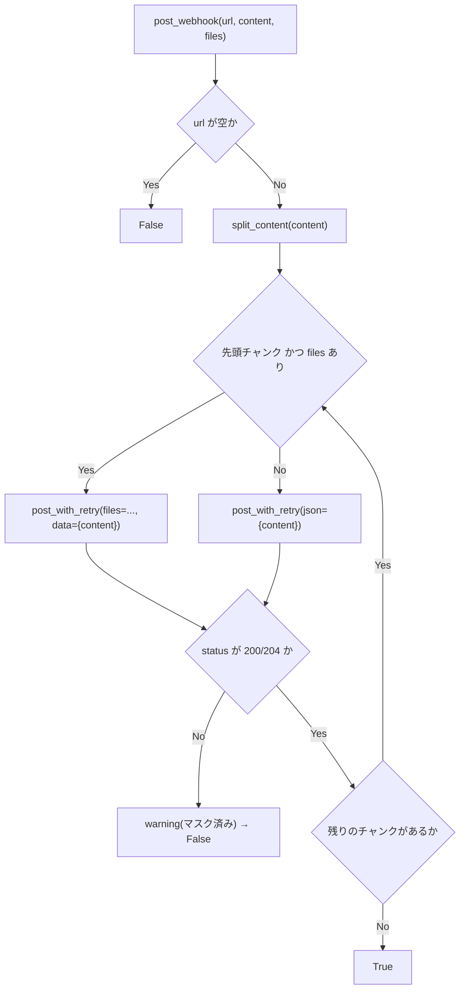
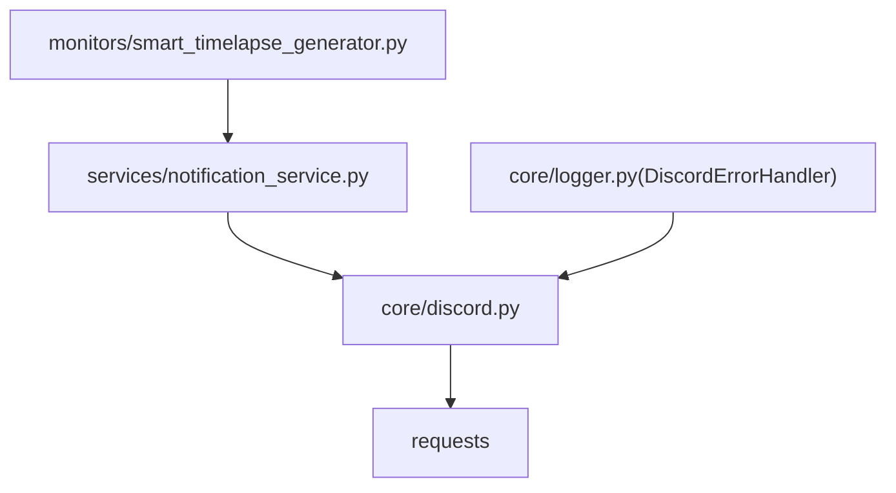

## 1. 解析メタ情報

| 項目 | 内容 |
| --- | --- |
| 対象ファイル | core/discord.py |
| 解析基準コミット | Issue #661 での新規作成時点(2026-09-16) |
| 言語 | Python |
| 解析対象 | 提供されたコードのみ |
| 推測・補完 | 一切なし |

## 関連ドキュメント

* [notification_service.md](./notification_service.md) - 上位の送信経路(チャンネル振り分け・LINEメッセージのテキスト化)。分割とリトライは本ファイルへ委譲する
* [logger.md](./logger.md) - `DiscordErrorHandler` がエラー通知の POST に本ファイルを使う
* [smart_timelapse_generator.md](./smart_timelapse_generator.md) - 動画送信・完了通知の呼び出し元

## 2. ファイルの概要

Discord Webhook への POST を1箇所へ集約する低レベルユーティリティ。Issue #661 の調査時点で、Discord への送信は5系統(`notification_service`、`core/logger` の `DiscordErrorHandler`、`smart_timelapse_generator` の2箇所、`DDD` の2スクリプト)に散っており、2000字上限の分割・429/5xx のリトライ・Webhook URL のマスクの有無が経路ごとにばらばらだった。

本ファイルが担うのは「1回の POST をどう投げるか」だけで、宛先チャンネルの決定や LINE メッセージオブジェクトからのテキスト化といった上位の責務は `services/notification_service.py` に残る。

**本ファイルは `core.logger` を import しない。** `core.logger` 側がこれを使うため循環 import になるのに加え、Webhook 送信の失敗を同じロギング経路へ流すと「エラーを通知しようとして失敗し、その失敗をまた通知しようとする」ループになりうる。ログは標準ライブラリの `logging` を直接使い、ハンドラの設定は呼び出し側に委ねる。

## 3. 外部依存関係

### インポート一覧

| 名称 | 種類 | 用途 | 根拠 |
| --- | --- | --- | --- |
| `logging` | 標準ライブラリ | 失敗時の warning(`core.logger` は使わない) | `import logging` (行番号: 26) |
| `re` | 標準ライブラリ | Webhook URL のトークン部分のマスク | `import re` (行番号: 27) |
| `time` | 標準ライブラリ | リトライ前の待機(`_retry_sleep`) | `import time` (行番号: 28) |
| `requests` | サードパーティ | HTTP POST | `import requests` (行番号: 31) |

### ブラックボックスとなる外部要素

| 項目 | 理由 |
| --- | --- |
| Discord 側のレート制限の実挙動 | `Retry-After` / `X-RateLimit-Reset-After` ヘッダの値はサーバー依存で、本ファイルからは不明。 |

## 4. 主要要素の定義（関数 / エンドポイント / コンポーネント）

### モジュールレベル定数

| 定数 | 値 | 意味 |
| --- | --- | --- |
| `CONTENT_CHUNK_SIZE` | `1900` | Discord の content 上限(2000)に対する安全側のチャンクサイズ |
| `RETRY_ATTEMPTS` | `1` | 429/5xx 時の追加試行回数(初回を除く) |
| `RETRY_MAX_WAIT_SECONDS` | `5.0` | `Retry-After` が無い/異常な場合を含む待機時間の上限 |
| `SUCCESS_STATUS_CODES` | `(200, 204)` | 成功とみなすステータス(Discord は 204 を返すことがある) |
| `_retry_sleep` | `time.sleep` | テストから差し替えられるようにモジュール属性にしてある |

* 根拠: `CONTENT_CHUNK_SIZE = 1900` (行番号: 34)、`RETRY_ATTEMPTS = 1` (行番号: 36)、`RETRY_MAX_WAIT_SECONDS = 5.0` (行番号: 37)

### `redact_webhook_url`

* **役割**: 文字列(例外メッセージ・レスポンス本文を含む)中の Webhook URL のトークン部分を `<redacted>` に置換する。正規表現・置換後の表記は移行前の `core/logger._redact_webhook_url` と同一で、ログの見た目を変えない。
* **引数/リクエスト**: `value: Any`(`str()` される)
* **戻り値/レスポンス**: `str`
* 根拠: `redact_webhook_url` (行番号: 49 / 抜粋: "def redact_webhook_url(value: Any) -> str:")

### `split_content`

* **役割**: テキストを `limit` 文字以下のチャンクへ、できるだけ改行位置で分割する。空文字は1チャンクとして返す。
* **引数/リクエスト**: `text: str`、`limit: int = CONTENT_CHUNK_SIZE`
* **戻り値/レスポンス**: `List[str]`
* 根拠: `split_content` (行番号: 54 / 抜粋: "def split_content(text: str, limit: int = CONTENT_CHUNK_SIZE) -> List[str]:")

### `post_with_retry`

* **役割**: `requests.post` を呼び、ステータスが 429 または 5xx なら `Retry-After`(無ければ1秒、上限 `RETRY_MAX_WAIT_SECONDS`)だけ待って `RETRY_ATTEMPTS` 回まで再送する。レスポンスオブジェクトをそのまま返し、例外は伝播させる(ステータスの解釈は呼び出し側の責務)。
* **引数/リクエスト**: `url: str`、`**kwargs`(`requests.post` へそのまま渡す)
* **戻り値/レスポンス**: `requests.Response`
* 根拠: `post_with_retry` (行番号: 71 / 抜粋: "def post_with_retry(url: str, **kwargs):")

### `post_webhook`

* **役割**: 1つの Webhook URL へ content を送る高レベル API。上限を超える場合は `split_content` で分割し、添付(`files`)は先頭チャンクにのみ付ける。URL 未設定なら何もせず `False`。
* **引数/リクエスト**: `url: Optional[str]`、`content: str = ""`、`files: Optional[dict] = None`、`timeout: float = 10`
* **戻り値/レスポンス**: `bool`(全チャンクが成功ステータスなら `True`)
* **エラーハンドリング**: 非成功ステータス・全例外を warning ログ(URL はマスク)にして `False` を返す。通知の失敗で呼び出し元の本処理を止めない。
* 根拠: `post_webhook` (行番号: 97 / 抜粋: "def post_webhook(")

## 5. 処理フロー図

## 6. 依存関係図

## 7. 次のステップ（リバースエンジニアリングの提案）

| 優先度 | ファイル名 | 理由 |
| --- | --- | --- |
| 中 | `DDD/batch_download_discord.py` / `DDD/newface_monitor.py` | Issue #661 で挙げた残りの2系統。`core.*` を import できる本番経路では本ファイルへ寄せられる。 |

## 8. 保守上の注意点

* **`core.logger` を import しないこと**: 循環 import と「通知失敗の通知」ループを避けるための設計上の制約。ログは `logging.getLogger("core.discord")` を直接使う。
* **リトライはコマンド送信には使わない**: ここでのリトライは通知の送信に限る。SwitchBot のコマンド送信のように二重実行が副作用として現れる経路には流用しないこと(`services/switchbot_service.post_switchbot_api` のコメント参照)。
* **`notification_service` 側の名前は互換のため残っている**: `_split_discord_content` / `_post_discord_with_retry` / `DISCORD_*` 定数は本ファイルへの薄い委譲で、既存の呼び出し元・テストの契約(`notification_service._retry_sleep` の差し替え)を維持している。

## 9. 不明事項一覧

| 項目 | 理由 | 必要なファイル |
| --- | --- | --- |
| 実際の Webhook URL | `.env`(gitignore 対象)依存のため不明。 | `config.py` / `.env` |

## 10. 自己検証結果

* 本ファイル内の行番号・シグネチャは `core/discord.py` の現物と照合済み。
* マスク表記(`<redacted>`)が移行前と同じであることは `tests/test_logger.py::TestWebhookFailureLogDoesNotLeakToken` で確認している。
