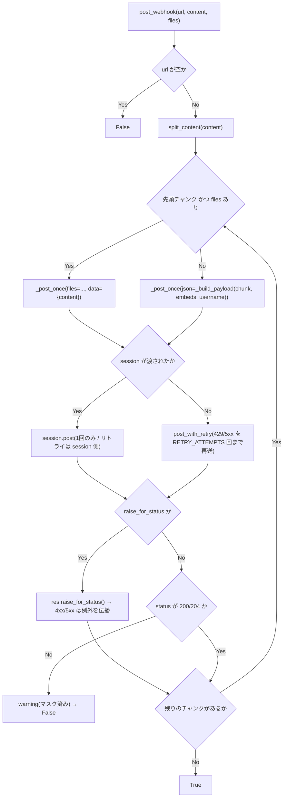
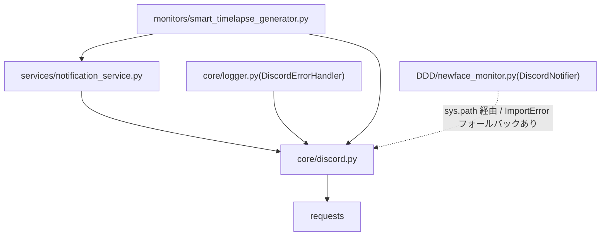

## 1. 解析メタ情報

| 項目 | 内容 |
| --- | --- |
| 対象ファイル | core/discord.py |
| 解析基準コミット | Issue #661 の残り2系統(`smart_timelapse_generator` / `DDD/newface_monitor`)移行時点(2026-09-18) |
| 言語 | Python |
| 解析対象 | 提供されたコードのみ |
| 推測・補完 | 一切なし |

## 関連ドキュメント

* [notification_service.md](./notification_service.md) - 上位の送信経路(チャンネル振り分け・LINEメッセージのテキスト化)。分割とリトライは本ファイルへ委譲する
* [logger.md](./logger.md) - `DiscordErrorHandler` がエラー通知の POST に本ファイルを使う
* [smart_timelapse_generator.md](./smart_timelapse_generator.md) - 動画ファイルのアップロード・完了通知の呼び出し元
* [newface_monitor.md](../DDD/newface_monitor.md) - embed ペイロードの呼び出し元(`session` / `raise_for_status` を使う)

## 2. ファイルの概要

Discord Webhook への POST を1箇所へ集約する低レベルユーティリティ。Issue #661 の調査時点で、Discord への送信は5系統(`notification_service`、`core/logger` の `DiscordErrorHandler`、`smart_timelapse_generator` の2箇所、`DDD` の2スクリプト)に散っており、2000字上限の分割・429/5xx のリトライ・Webhook URL のマスクの有無が経路ごとにばらばらだった。

本ファイルが担うのは「1回の POST をどう投げるか」だけで、宛先チャンネルの決定や LINE メッセージオブジェクトからのテキスト化といった上位の責務は `services/notification_service.py` に残る。

移行状況は次のとおり。`DDD/batch_download_discord._standalone_send_discord_webhook` だけは、MY_HOME_SYSTEM が無い環境でも動くことが要件のフォールバックであるため、**意図的に未移行**のまま残している(本ファイルを import できない前提を保つ必要があるため)。

| 経路 | 状態 |
| --- | --- |
| `services/notification_service._send_discord_webhook` | 移行済み |
| `core/logger.DiscordErrorHandler._send_webhook` | 移行済み |
| `monitors/smart_timelapse_generator`(動画アップロード・完了通知) | 移行済み |
| `DDD/newface_monitor.DiscordNotifier`(embed・テキスト) | 移行済み |
| `DDD/batch_download_discord._standalone_send_discord_webhook` | 意図的に未移行 |

送るものはテキスト(`content`)・添付(`files`)・埋め込み(`embeds`)の3種で、呼び出し元の事情に応じて `session`(呼び出し元が持つ retry アダプタ付きセッションを使い、こちら側のリトライを重ねない)と `raise_for_status`(bool ではなく `requests` の例外で失敗を伝え、ステータスコードごとの分岐を呼び出し元に委ねる)の2つの受け口がある。いずれも省略時は従来どおりの挙動。

**本ファイルは `core.logger` を import しない。** `core.logger` 側がこれを使うため循環 import になるのに加え、Webhook 送信の失敗を同じロギング経路へ流すと「エラーを通知しようとして失敗し、その失敗をまた通知しようとする」ループになりうる。ログは標準ライブラリの `logging` を直接使い、ハンドラの設定は呼び出し側に委ねる。

## 3. 外部依存関係

### インポート一覧

| 名称 | 種類 | 用途 | 根拠 |
| --- | --- | --- | --- |
| `logging` | 標準ライブラリ | 失敗時の warning(`core.logger` は使わない) | `import logging` (行番号: 34) |
| `re` | 標準ライブラリ | Webhook URL のトークン部分のマスク | `import re` (行番号: 35) |
| `time` | 標準ライブラリ | リトライ前の待機(`_retry_sleep`) | `import time` (行番号: 36) |
| `collections.abc.Sequence` | 標準ライブラリ | `embeds` 引数の型注釈 | `from collections.abc import Sequence` (行番号: 37) |
| `typing.Any` | 標準ライブラリ | `redact_webhook_url` / `session` の型注釈 | `from typing import Any` (行番号: 38) |
| `requests` | サードパーティ | HTTP POST | `import requests` (行番号: 40) |

### ブラックボックスとなる外部要素

| 項目 | 理由 |
| --- | --- |
| Discord 側のレート制限の実挙動 | `Retry-After` / `X-RateLimit-Reset-After` ヘッダの値はサーバー依存で、本ファイルからは不明。 |

## 4. 主要要素の定義（関数 / エンドポイント / コンポーネント）

### モジュールレベル定数

| 定数 | 値 | 意味 |
| --- | --- | --- |
| `CONTENT_CHUNK_SIZE` | `1900` | Discord の content 上限(2000)に対する安全側のチャンクサイズ |
| `RETRY_ATTEMPTS` | `1` | 429/5xx 時の追加試行回数(初回を除く) |
| `RETRY_MAX_WAIT_SECONDS` | `5.0` | `Retry-After` が無い/異常な場合を含む待機時間の上限 |
| `SUCCESS_STATUS_CODES` | `(200, 204)` | 成功とみなすステータス(Discord は 204 を返すことがある) |
| `_retry_sleep` | `time.sleep` | テストから差し替えられるようにモジュール属性にしてある |

* 根拠: `CONTENT_CHUNK_SIZE = 1900` (行番号: 45)、`RETRY_ATTEMPTS = 1` (行番号: 47)、`RETRY_MAX_WAIT_SECONDS = 5.0` (行番号: 48)

### `redact_webhook_url`

* **役割**: 文字列(例外メッセージ・レスポンス本文を含む)中の Webhook URL のトークン部分を `<redacted>` に置換する。正規表現・置換後の表記は移行前の `core/logger._redact_webhook_url` と同一で、ログの見た目を変えない。
* **引数/リクエスト**: `value: Any`(`str()` される)
* **戻り値/レスポンス**: `str`
* 根拠: `redact_webhook_url` (行番号: 60 / 抜粋: "def redact_webhook_url(value: Any) -> str:")

### `split_content`

* **役割**: テキストを `limit` 文字以下のチャンクへ、できるだけ改行位置で分割する。空文字は1チャンクとして返す。
* **引数/リクエスト**: `text: str`、`limit: int = CONTENT_CHUNK_SIZE`
* **戻り値/レスポンス**: `list[str]`
* 根拠: `split_content` (行番号: 65 / 抜粋: "def split_content(text: str, limit: int = CONTENT_CHUNK_SIZE) -> list[str]:")

### `_rewind_files`

* **役割**: `files` に渡されたファイルオブジェクトの読み取り位置を先頭へ戻す。リトライ直前に必ず呼ぶ。1回目の POST で EOF まで読み切られているため、巻き戻さずに再送すると**中身が空のまま**アップロードされ、しかも Discord は 200/204 を返すので「成功したのに0バイトの動画が届く」という壊れ方をする。`{"name": fileobj}` と `{"name": (filename, fileobj, type)}` の両形式に対応し、`seek` できないストリームは黙って諦める。
* **引数/リクエスト**: `files: dict | None`
* **戻り値/レスポンス**: `None`
* **エラーハンドリング**: `AttributeError` / `OSError` / `ValueError` は握って次の要素へ進む。
* 根拠: `_rewind_files` (行番号: 82 / 抜粋: "def _rewind_files(files: dict | None) -> None:")

### `post_with_retry`

* **役割**: `requests.post` を呼び、ステータスが 429 または 5xx なら `Retry-After`(無ければ1秒、上限 `RETRY_MAX_WAIT_SECONDS`)だけ待って `RETRY_ATTEMPTS` 回まで再送する。再送の直前に `_rewind_files(kwargs.get("files"))` で添付の読み取り位置を戻す。レスポンスオブジェクトをそのまま返し、例外は伝播させる(ステータスの解釈は呼び出し側の責務)。
* **引数/リクエスト**: `url: str`、`**kwargs`(`requests.post` へそのまま渡す)
* **戻り値/レスポンス**: `requests.Response`
* 根拠: `post_with_retry` (行番号: 100 / 抜粋: "def post_with_retry(url: str, **kwargs):")

### `_build_payload`

* **役割**: 1回の POST に載せる JSON ボディを組み立てる。`content` キーはテキストが空でも embed を伴わない限り常に入れる(embed 無しの従来の呼び出しが送っていたボディを1バイトも変えないため)。逆に embed だけを送る呼び出しでは `content` を入れない。`embeds` は添付と同じく先頭チャンクにのみ付ける。
* **引数/リクエスト**: `chunk: str`、`embeds: Sequence[dict] | None`、`username: str | None`、キーワード専用 `first_chunk: bool`
* **戻り値/レスポンス**: `dict[str, Any]`
* 根拠: `_build_payload` (行番号: 127 / 抜粋: "def _build_payload(")

### `_post_once`

* **役割**: 1回分の POST。`session` が渡されていればそちらの `post` を使い、こちら側のリトライ(`post_with_retry`)を重ねない。session には呼び出し元が retry アダプタ(urllib3 の `Retry`)を載せている前提で、二重リトライになると 429 時の総待機時間が呼び出し元の設計値から外れるため。
* **引数/リクエスト**: `url: str`、`session: Any | None`、`**kwargs`
* **戻り値/レスポンス**: `requests.Response`
* 根拠: `_post_once` (行番号: 151 / 抜粋: "def _post_once(url: str, session: Any | None, **kwargs):")

### `_send_chunks`

* **役割**: `split_content` の各チャンクを順に送る内部ループ。先頭チャンクにのみ `files` / `embeds` を付ける。`raise_for_status` が真なら各レスポンスに `raise_for_status()` を呼んで例外を呼び出し元へ通し、偽なら `SUCCESS_STATUS_CODES` 判定で warning ログ + `False` を返す。
* **引数/リクエスト**: `url`、`content`、`files`、`timeout`、`embeds`、`username`、`session`、`raise_for_status`
* **戻り値/レスポンス**: `bool`
* 根拠: `_send_chunks` (行番号: 163 / 抜粋: "def _send_chunks(")

### `post_webhook`

* **役割**: 1つの Webhook URL へ content(必要なら添付・embed つき)を送る高レベル API。上限を超える場合は `split_content` で分割し、添付(`files`)と `embeds` は先頭チャンクにのみ付ける。URL 未設定なら何もせず `False`。**`files` と `embeds` は同時に指定できない**(`files` 送信は multipart になり、embed を載せる口が無いため。指定すると `ValueError`)。
* **引数/リクエスト**: `url: str | None`、`content: str = ""`、`files: dict | None = None`、`timeout: float = 10`、以下はキーワード専用 — `embeds: Sequence[dict] | None = None`(Discord webhook API の `embeds` 配列。`files` と併用不可)、`username: str | None = None`(webhook 表示名の上書き)、`session: Any | None = None`(送信に使う `requests.Session`。渡すとこちら側のリトライは行わない)、`raise_for_status: bool = False`
* **戻り値/レスポンス**: `bool`(全チャンクが成功ステータスなら `True`)
* **エラーハンドリング**: `files` と `embeds` を同時に指定した場合は呼び出し元の設定ミスとして `ValueError` を送出する(以前は multipart 送信時に embed が無言で消えていた。PR #695 レビュー指摘)。それ以外は既定では非成功ステータス・全例外を warning ログ(URL はマスク)にして `False` を返し、通知の失敗で呼び出し元の本処理を止めない。`raise_for_status=True` のときだけは例外を握り潰さずそのまま伝播させる(ステータスコードごとに分岐したい呼び出し元専用。成功時は `True`)。
* 根拠: `post_webhook` (行番号: 201 / 抜粋: "def post_webhook(")

## 5. 処理フロー図

## 6. 依存関係図

## 7. 次のステップ（リバースエンジニアリングの提案）

| 優先度 | ファイル名 | 理由 |
| --- | --- | --- |
| 中 | `DDD/batch_download_discord.py` | Issue #661 で唯一意図的に未移行として残した経路。MY_HOME_SYSTEM が無い環境で動くことが要件のため、寄せるかどうかは要件の再確認とセットになる。 |

## 8. 保守上の注意点

* **`core.logger` を import しないこと**: 循環 import と「通知失敗の通知」ループを避けるための設計上の制約。ログは `logging.getLogger("core.discord")` を直接使う。
* **リトライはコマンド送信には使わない**: ここでのリトライは通知の送信に限る。SwitchBot のコマンド送信のように二重実行が副作用として現れる経路には流用しないこと(`services/switchbot_service.post_switchbot_api` のコメント参照)。
* **添付付きのリトライでは必ず巻き戻すこと**: `post_with_retry` は再送前に `_rewind_files` を呼ぶ。`files` を扱う新しい経路を足すときにこの呼び出しを外すと、リトライ時に0バイトのファイルが「成功」として送られる。
* **`session` と `raise_for_status` は既存経路の挙動を保つための受け口**: `session` を渡すとこちら側のリトライを行わない(呼び出し元の Retry アダプタと二重にしないため)。`raise_for_status` は 401/404 でサーキットブレーカーを開くといった、ステータスコード依存の分岐を持つ呼び出し元(`DDD/newface_monitor`)のためのもので、通常の通知経路では使わない。
* **`notification_service` 側の名前は互換のため残っている**: `_split_discord_content` / `_post_discord_with_retry` / `DISCORD_*` 定数は本ファイルへの薄い委譲で、既存の呼び出し元・テストの契約(`notification_service._retry_sleep` の差し替え)を維持している。

## 9. 不明事項一覧

| 項目 | 理由 | 必要なファイル |
| --- | --- | --- |
| 実際の Webhook URL | `.env`(gitignore 対象)依存のため不明。 | `config.py` / `.env` |

## 10. 自己検証結果

* 本ファイル内の行番号・シグネチャは `core/discord.py` の現物と照合済み。
* マスク表記(`<redacted>`)が移行前と同じであることは `tests/test_logger.py::TestWebhookFailureLogDoesNotLeakToken` で確認している。
* `embeds` / `session` / `raise_for_status` / 添付の巻き戻しの契約は `tests/test_core_shared_helpers.py::TestDiscordEmbedAndSessionSupport` で固定している。
