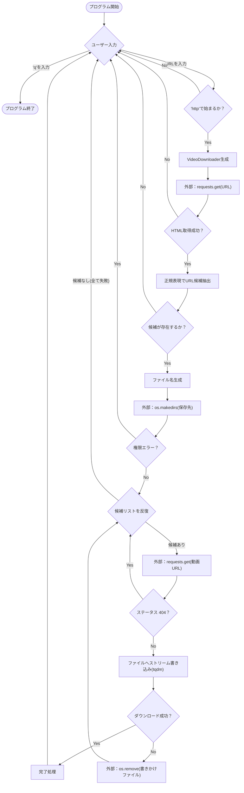
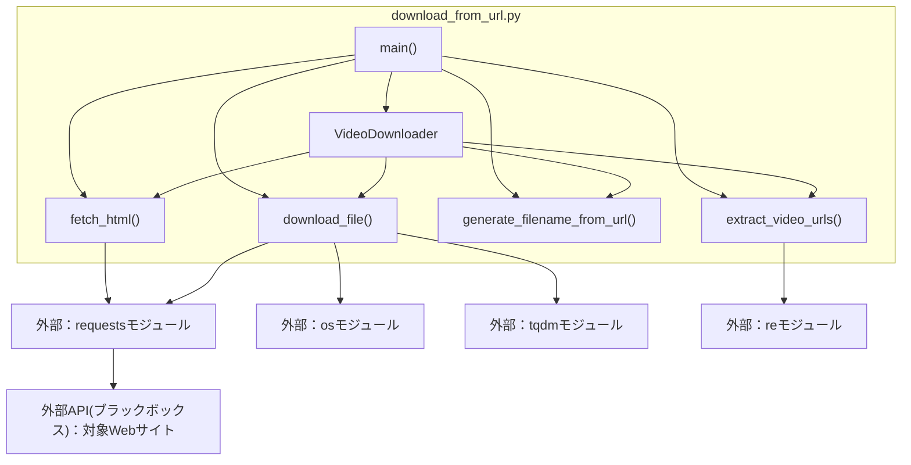

## 1. 解析メタ情報

| 項目 | 内容 |
| --- | --- |
| 対象ファイル | `download_from_url.py` |
| 言語 | Python |
| 解析対象 | 提供されたコードのみ |
| 推測・補完 | 一切なし |

## 2. ファイルの概要

* 指定されたURLからHTMLを取得し、正規表現を用いて動画ファイルのURLを抽出し、ローカル環境（NAS等の指定ディレクトリ）へダウンロードを実行するCLIダウンローダープログラム。
* 根拠: [ファイル全体] (行番号: 8-169 / 抜粋: "class VideoDownloader:")

## 3. 外部依存関係

### インポート一覧

| 名称 | 種類 | 用途 | 根拠 |
| --- | --- | --- | --- |
| `re` | 標準ライブラリ | HTMLからの正規表現による動画URLの抽出に使用 | 根拠: [インポート宣言] (行番号: 1 / 抜粋: "import re") |
| `os` | 標準ライブラリ | 保存先ディレクトリの作成およびファイルの削除処理に使用 | 根拠: [インポート宣言] (行番号: 2 / 抜粋: "import os") |
| `sys` | 標準ライブラリ | 強制終了時のシステムエグジット(`sys.exit()`)に使用 | 根拠: [インポート宣言] (行番号: 3 / 抜粋: "import sys") |
| `requests` | サードパーティ | 対象URLからのHTML取得や、動画ファイルのストリームダウンロードに使用 | 根拠: [インポート宣言] (行番号: 4 / 抜粋: "import requests") |
| `tqdm` | サードパーティ | ダウンロード進捗を可視化するプログレスバーの表示に使用 | 根拠: [インポート宣言] (行番号: 5 / 抜粋: "from tqdm import tqdm") |
| `urlparse` | 標準ライブラリ | 本ファイル内での使用箇所なし（未使用コード） | 根拠: [インポート宣言] (行番号: 6 / 抜粋: "from urllib.parse import urlparse") |

### ブラックボックスとなる外部要素

| 名称 | 理由 | 根拠 |
| --- | --- | --- |
| 対象のWebサイト | 提供コード外であり、取得するHTMLの構造や、正規表現に合致する動画URLの存在は外部サイトの仕様に依存するため | 根拠: [`fetch_html`関数] (行番号: 27 / 抜粋: "response = requests.get(url...") |

## 4. 主要要素の定義（関数 / エンドポイント / コンポーネント）

### `VideoDownloader.__init__`

* **役割**: ダウンロード先のディレクトリパス(`/mnt/nas/ddd`)および、HTTPリクエスト時に使用するベースヘッダー（User-Agent等）を初期化する。
* 根拠: [`__init__`] (行番号: 9-18 / 抜粋: "self.save_dir = '/mnt/nas/ddd'")

* **引数/リクエスト**: なし
* 根拠: [`__init__`] (行番号: 9 / 抜粋: "def **init**(self):")

* **戻り値/レスポンス**: なし
* 根拠: [`__init__`] (行番号: 9 / 抜粋: "def **init**(self):")

* **副作用**: なし
* 根拠: [`__init__`] (行番号: 9-18 / 抜粋: "self.base_headers = {")

* **エラーハンドリング**: なし
* 根拠: [`__init__`] (行番号: 9-18 / 抜粋: "def **init**(self):")

### `VideoDownloader.fetch_html`

* **役割**: 受け取ったURLに対してGETリクエストを送信し、HTMLのテキストデータを取得する。`Referer`ヘッダに対象URLをセットして偽装する。
* 根拠: [`fetch_html`] (行番号: 20-29 / 抜粋: "headers['Referer'] = url")

* **引数/リクエスト**: `url` (文字列：アクセス対象のURL)
* 根拠: [`fetch_html`] (行番号: 20 / 抜粋: "def fetch_html(self, url):")

* **戻り値/レスポンス**: HTMLのテキストデータ(文字列)、または取得失敗時は `None`
* 根拠: [`fetch_html`] (行番号: 29, 32 / 抜粋: "return response.text")

* **副作用**: 外部WebサイトへのHTTP GETリクエスト発行
* 根拠: [`fetch_html`] (行番号: 27 / 抜粋: "response = requests.get(url...")

* **エラーハンドリング**: `requests.exceptions.RequestException`をキャッチしてエラーメッセージを標準出力し、`None`を返す。さらに `response.raise_for_status()` によるHTTPエラー判定を含む。
* 根拠: [`fetch_html`] (行番号: 28, 30-32 / 抜粋: "except requests.exceptions...")

### `VideoDownloader.extract_video_urls`

* **役割**: 取得したHTML文字列に対して正規表現を適用し、HD画質(`video_alt_url`)と標準画質(`video_url`)の動画URLを抽出してリスト化する。
* 根拠: [`extract_video_urls`] (行番号: 34-49 / 抜粋: "match_hd = re.search(r'video...")

* **引数/リクエスト**: `html_content` (文字列：HTMLデータ)
* 根拠: [`extract_video_urls`] (行番号: 34 / 抜粋: "def extract_video_urls(self...")

* **戻り値/レスポンス**: タプルのリスト (例: `[('HD (高画質)', url), ...]`)
* 根拠: [`extract_video_urls`] (行番号: 36, 49 / 抜粋: "return urls")

* **副作用**: なし
* 根拠: [`extract_video_urls`] (行番号: 34-49 / 抜粋: "urls = []")

* **エラーハンドリング**: なし（正規表現にマッチしない場合はリストに追加されない）
* 根拠: [`extract_video_urls`] (行番号: 39, 45 / 抜粋: "if match_hd:")

### `VideoDownloader.generate_filename_from_url`

* **役割**: 対象URLの末尾からディレクトリ/ファイル名を抽出し、`.mp4`の拡張子を付与してファイル名を生成する。
* 根拠: [`generate_filename_from_url`] (行番号: 51-64 / 抜粋: "return f'{filename_base}.mp4'")

* **引数/リクエスト**: `page_url` (文字列：対象ページのURL)
* 根拠: [`generate_filename_from_url`] (行番号: 51 / 抜粋: "def generate_filename_from_url...")

* **戻り値/レスポンス**: 生成されたファイル名 (文字列)
* 根拠: [`generate_filename_from_url`] (行番号: 64 / 抜粋: "return f'{filename_base}.mp4'")

* **副作用**: なし
* 根拠: [`generate_filename_from_url`] (行番号: 51-64 / 抜粋: "clean_url = page_url.split...")

* **エラーハンドリング**: URLの構造上ファイル名ベースが空文字になった場合、`video_download` をデフォルト名として設定するフォールバック処理。
* 根拠: [`generate_filename_from_url`] (行番号: 60-62 / 抜粋: "if not filename_base:")

### `VideoDownloader.download_file`

* **役割**: 保存先ディレクトリを作成し、抽出された動画URLのリスト（HD/SDなど）を順に試行して、ファイルをストリーム形式で1MB単位でダウンロード保存する。
* 根拠: [`download_file`] (行番号: 66-128 / 抜粋: "for data in response.iter_content...")

* **引数/リクエスト**: `video_candidates` (タプルのリスト), `filename` (文字列), `page_url` (文字列)
* 根拠: [`download_file`] (行番号: 66 / 抜粋: "def download_file(self, video...")

* **戻り値/レスポンス**: なし
* 根拠: [`download_file`] (行番号: 66-128 / 抜粋: "return")

* **副作用**: ローカルファイルシステムへのディレクトリ作成(`os.makedirs`)、ファイル書き込み(`open`)、および外部サーバへのHTTP GETリクエスト。
* 根拠: [`download_file`] (行番号: 71, 88, 101 / 抜粋: "os.makedirs(self.save_dir...")

* **エラーハンドリング**:
* ディレクトリ作成時の`PermissionError`をキャッチし、処理中断。
* HTTPステータス404の場合は次の候補へスキップ。
* ダウンロード中の任意の例外(`Exception`)をキャッチし、不完全なファイルが生成されていれば削除(`os.remove`)するクリーンアップ処理を行う。
* 根拠: [`download_file`] (行番号: 72-74, 90-92, 117-125 / 抜粋: "except Exception as e:")

### `main`

* **役割**: 無限ループ内でユーザーからURLを入力させ、`VideoDownloader`のインスタンスを生成後、HTML取得・URL抽出・ファイル名生成・ダウンロードの各フローを順次実行するエントリーポイント。
* 根拠: [`main`] (行番号: 130-162 / 抜粋: "while True:")

* **引数/リクエスト**: なし
* 根拠: [`main`] (行番号: 130 / 抜粋: "def main():")

* **戻り値/レスポンス**: なし
* 根拠: [`main`] (行番号: 130-162 / 抜粋: "break")

* **副作用**: 標準出力へのログ・UI描画(`print`)、標準入力の待機(`input`)。
* 根拠: [`main`] (行番号: 136 / 抜粋: "target_url = input...")

* **エラーハンドリング**:
* 入力が `q` の場合はループを終了(`break`)。
* 入力URLが `http` で始まらない場合は警告を出して次の入力を待機。
* 各ステップで取得データが空(`None`や空リスト)の場合は処理を中断し、次の入力を待機。
* 根拠: [`main`] (行番号: 138-144, 149-150, 154-156 / 抜粋: "if not target_url.startswith...")

### `__main__` スクリプト実行ブロック

* **役割**: スクリプトが直接実行された場合に `main()` を呼び出す。
* 根拠: [モジュールレベル] (行番号: 164-165 / 抜粋: "if **name** == '**main**':")

* **エラーハンドリング**: `KeyboardInterrupt` をキャッチし、正常にプログラムを終了（`sys.exit()`）させる。
* 根拠: [モジュールレベル] (行番号: 167-169 / 抜粋: "except KeyboardInterrupt:")

---

## 5. 処理フロー図

## 6. 依存関係図

## 7. 次のステップ（リバースエンジニアリングの提案）

| 優先度 | ファイル名(推測可) | 理由 | 根拠 |
| --- | --- | --- | --- |
| 高 | 対象WebサイトのHTMLソース (ファイル名不明) | `extract_video_urls` で依存している `video_alt_url` および `video_url` というプロパティがHTML上でどのように定義されているかを特定するため。 | 根拠: [`extract_video_urls`] (行番号: 38, 44 / 抜粋: "match_hd = re.search(...") |

## 8. 保守上の注意点

* 保存先ディレクトリパス（`/mnt/nas/ddd`）がソースコード内でハードコードされている。
* 根拠: [`__init__`] (行番号: 11 / 抜粋: "self.save_dir = '/mnt/nas/ddd'")

* ファイル書き込み時にディスク容量不足などで例外が発生した場合、作成途中のファイルは削除される仕様となっている。
* 根拠: [`download_file`] (行番号: 120-124 / 抜粋: "if os.path.exists(file_path):")

* `urllib.parse`からの`urlparse`のインポートが存在するが、ファイル内で一度も使用されていない（未使用コード）。
* 根拠: [インポート宣言] (行番号: 6 / 抜粋: "from urllib.parse import urlparse")

## 9. 不明事項一覧

| 項目 | 理由 | 必要なファイル |
| --- | --- | --- |
| 正規表現の抽出確実性 | 対象サイトのHTML構造が不明なため、`video_alt_url`や`video_url`の文字列が常に単一引用符/二重引用符で囲まれているか、あるいは動的に生成されるか判断できない。 | 対象Webサイトのソースコード（HTML/JS） |

## 10. 自己検証結果

* [x] 完了: 推測・外部ファイルの仕様を一切含んでいない
* [x] 完了: 全関数・全クラス・全コンポーネントを列挙した
* [x] 完了: 全てのインポート要素を列挙した
* [x] 完了: すべての仕様説明に「根拠（行番号・抜粋）」を明記した
* [x] 完了: 根拠漏れが0件である
* [x] 完了: Mermaid構文にエラーの原因となる記号（エスケープ漏れ）がない
* [x] 完了: 不明事項を漏れなく列挙した