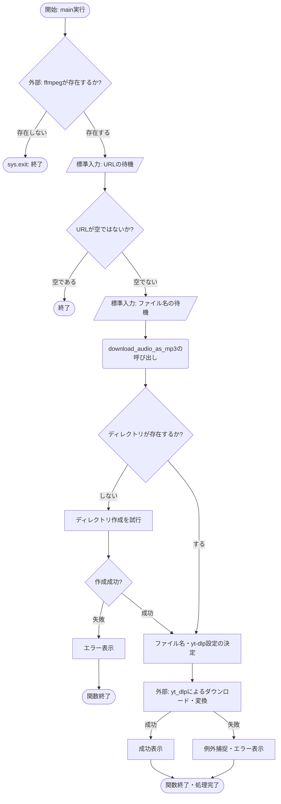
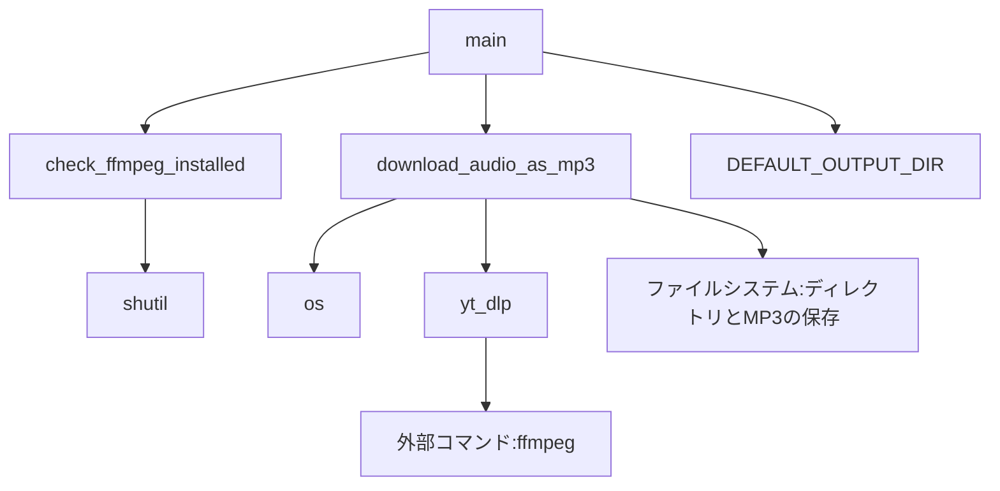

## 1. 解析メタ情報

| 項目 | 内容 |
| --- | --- |
| 対象ファイル | `download_mp3.py` |
| 言語 | Python |
| 解析対象 | 提供されたコードのみ |
| 推測・補完 | 一切なし |

## 2. ファイルの概要

* YouTubeの動画URLを元に音声をダウンロードし、MP3形式へ変換して特定のディレクトリへ保存するための単一のCLI（コマンドラインインターフェース）スクリプトである。

## 3. 外部依存関係

### インポート一覧

| 名称 | 種類 | 用途 | 根拠 |
| --- | --- | --- | --- |
| `os` | 標準ライブラリ | ディレクトリの存在確認・作成、および拡張子を除外したファイル名のパース処理 | 根拠: `import os` (行番号: 1 / 抜粋: "import os") |
| `sys` | 標準ライブラリ | 例外発生時や正常処理中断時のプロセス終了処理 | 根拠: `import sys` (行番号: 2 / 抜粋: "import sys") |
| `shutil` | 標準ライブラリ | 外部実行可能バイナリファイル（ffmpeg）のパス検索 | 根拠: `import shutil` (行番号: 3 / 抜粋: "import shutil") |
| `Optional` | 標準ライブラリ | 型ヒント（引数のオプショナル定義） | 根拠: `Optional` (行番号: 4 / 抜粋: "from typing import Optional") |
| `yt_dlp` | 外部ライブラリ | YouTubeからの音声データダウンロードおよびメタデータ処理 | 根拠: `import yt_dlp` (行番号: 8 / 抜粋: "import yt_dlp") |

### ブラックボックスとなる外部要素

| 名称 | 理由 | 根拠 |
| --- | --- | --- |
| `ffmpeg` | yt-dlpのポストプロセッサ設定内で音声のMP3抽出・変換（`FFmpegExtractAudio`）に利用されているが、実行環境（システムパス）に依存する外部ツールの動作であるため、本コード内では実装の詳細は不明である。 | 根拠: `shutil.which("ffmpeg")` (行番号: 20 / 抜粋: "shutil.which("ffmpeg")") |

## 4. 主要要素の定義（関数 / エンドポイント / コンポーネント）

### `DEFAULT_OUTPUT_DIR`

* **役割**: ダウンロードしたMP3ファイルを保存するためのデフォルトディレクトリ絶対パスを保持する定数。
* 根拠: `DEFAULT_OUTPUT_DIR` (行番号: 15 / 抜粋: "DEFAULT_OUTPUT_DIR = "/home...")

* **引数/リクエスト**: なし（定数）
* 根拠: `DEFAULT_OUTPUT_DIR` (行番号: 15 / 抜粋: "DEFAULT_OUTPUT_DIR = "/home...")

* **戻り値/レスポンス**: `str`（パス文字列）
* 根拠: `DEFAULT_OUTPUT_DIR` (行番号: 15 / 抜粋: "DEFAULT_OUTPUT_DIR = "/home...")

* **副作用**: なし
* 根拠: `DEFAULT_OUTPUT_DIR` (行番号: 15 / 抜粋: "DEFAULT_OUTPUT_DIR = "/home...")

* **エラーハンドリング**: なし
* 根拠: `DEFAULT_OUTPUT_DIR` (行番号: 15 / 抜粋: "DEFAULT_OUTPUT_DIR = "/home...")

### `check_ffmpeg_installed`

* **役割**: 外部ツールであるFFmpegがシステムパスに存在し、実行可能であるかを確認する。
* 根拠: `check_ffmpeg_installed` (行番号: 18〜20 / 抜粋: "return shutil.which("ffmpeg")")

* **引数/リクエスト**: なし
* 根拠: `def check_ffmpeg_installed()` (行番号: 18 / 抜粋: "def check_ffmpeg_installed()")

* **戻り値/レスポンス**: `bool` (存在すればTrue、なければFalse)
* 根拠: `-> bool` (行番号: 18 / 抜粋: "def check_ffmpeg_installed()")

* **副作用**: なし
* 根拠: `check_ffmpeg_installed` (行番号: 18〜20 / 抜粋: "return shutil.which("ffmpeg")")

* **エラーハンドリング**: なし
* 根拠: `check_ffmpeg_installed` (行番号: 18〜20 / 抜粋: "return shutil.which("ffmpeg")")

### `download_audio_as_mp3`

* **役割**: 提供されたYouTube URLから音声をダウンロードし、MP3形式（192kbps）に変換して指定ディレクトリに保存する。指定ディレクトリが存在しない場合は再帰的に作成する。
* 根拠: `download_audio_as_mp3` (行番号: 23〜74 / 抜粋: "def download_audio_as_mp3")

* **引数/リクエスト**: `youtube_url` (str: 対象URL), `output_dir` (str: 保存先パス), `custom_filename` (Optional[str]: ユーザー指定のファイル名、未指定時はNone)
* 根拠: `download_audio_as_mp3`引数定義 (行番号: 23 / 抜粋: "youtube_url: str, output_dir:")

* **戻り値/レスポンス**: `None`
* 根拠: `-> None:` (行番号: 23 / 抜粋: "Optional[str] = None) -> None:")

* **副作用**: ファイルシステムへのディレクトリ作成（`os.makedirs`）および音声ファイルの書き込み。標準出力(`print`)への進行状態・結果の出力。
* 根拠: `os.makedirs`, `ydl.download` (行番号: 29, 69 / 抜粋: "os.makedirs(output_dir", "ydl.download([youtube_url])")

* **エラーハンドリング**: ディレクトリ作成時の`OSError`、ダウンロード時の`yt_dlp.utils.DownloadError`、その他予期せぬ`Exception`をそれぞれ捕捉し、標準出力へエラー内容を表示して関数を終了する。
* 根拠: `except OSError as e:` など (行番号: 31, 72, 74 / 抜粋: "except yt_dlp.utils.DownloadEr")

### `main`

* **役割**: スクリプトの実行エントリーポイント。FFmpegのインストール確認後、ユーザーからの標準入力を経てダウンロード処理を呼び出す。
* 根拠: `main` (行番号: 77〜100 / 抜粋: "def main():")

* **引数/リクエスト**: なし
* 根拠: `def main():` (行番号: 77 / 抜粋: "def main():")

* **戻り値/レスポンス**: なし
* 根拠: `def main():` (行番号: 77 / 抜粋: "def main():")

* **副作用**: 標準入力（`input`）の待機、標準出力へのメッセージ表示、プロセス終了（`sys.exit`）の実行。
* 根拠: `input`, `sys.exit` (行番号: 87, 80 / 抜粋: "url = input("YouTube URLを", "sys.exit(1)")

* **エラーハンドリング**: `KeyboardInterrupt` を捕捉し、メッセージを表示して安全にプロセスを中断・終了（終了コード0）する。
* 根拠: `except KeyboardInterrupt:` (行番号: 98〜100 / 抜粋: "except KeyboardInterrupt:")

## 5. 処理フロー図

## 6. 依存関係図

## 7. 次のステップ（リバースエンジニアリングの提案）

| 優先度 | ファイル名(推測可) | 理由 | 根拠 |
| --- | --- | --- | --- |
| 中 | `src/assets/sounds/` 以下のファイルを参照するソースコード群 | ハードコードされた `DEFAULT_OUTPUT_DIR` にダウンロードしたMP3ファイルが保存されるため、アプリ側でこれらを再生・利用する実装を確認することで、ファイル名の命名規則（カスタムファイル名の必要性）やシステム要件が明確になる。 | 根拠: `DEFAULT_OUTPUT_DIR` (行番号: 15 / 抜粋: "DEFAULT_OUTPUT_DIR = "/home...") |

## 8. 保守上の注意点

* **インポート時の副作用**: グローバルスコープの最初で `yt_dlp` のインポートチェックを行っているため、他モジュールからこのファイルをインポートした際、`yt-dlp` が未インストールだとプロセス全体が強制終了（`sys.exit(1)`）する挙動を持つ。
* **ハードコードされた絶対パス**: `DEFAULT_OUTPUT_DIR` が特定ユーザーのローカル環境を想定した絶対パス（`/home/masahiro/...`）として記述されており、別環境で実行した場合にディレクトリ作成エラー等の不具合が発生する可能性が高い。
* **エラーの握り潰し**: `download_audio_as_mp3` 内で例外（`OSError`, `DownloadError` など）が発生しても標準出力にエラー内容を出すだけで関数自体は正常系としてリターンするため、呼び出し元の `main` では処理の成否をプログラム的に判定できない。

## 9. 不明事項一覧

| 項目 | 理由 | 必要なファイル |
| --- | --- | --- |
| 保存先ディレクトリに求められる運用要件 | `DEFAULT_OUTPUT_DIR` (`family-quest/src/assets/sounds`) に保存された音声データが、システム全体でどのようにロードされ、ファイル名やビットレートにどのような制約があるかが本ファイル単独では不明である。 | `family-quest` アプリケーション側の音声ロード・再生処理を実装しているソースコード。 |

## 10. 自己検証結果

* [x] 完了 推測・外部ファイルの仕様を一切含んでいない
* [x] 完了 全関数・全クラス・全コンポーネントを列挙した
* [x] 完了 全てのインポート要素を列挙した
* [x] 完了 すべての仕様説明に「根拠（行番号・抜粋）」を明記した
* [x] 完了 根拠漏れが0件である
* [x] 完了 Mermaid構文にエラーの原因となる記号（エスケープ漏れ）がない
* [x] 完了 不明事項を漏れなく列挙した