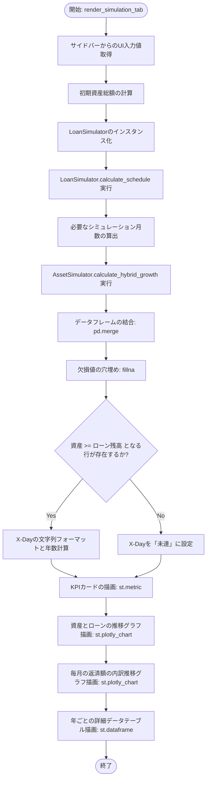
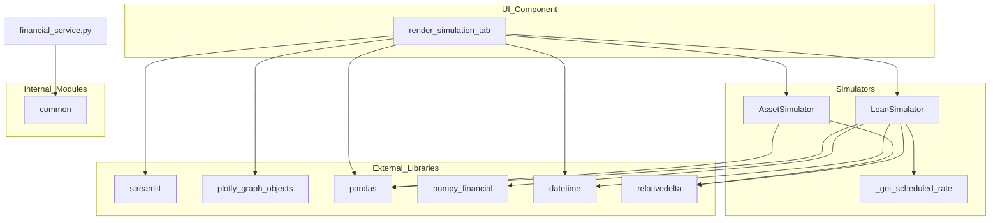

## 1. 解析メタ情報

| 項目 | 内容 |
| --- | --- |
| 対象ファイル | financial_service.py |
| 言語 | Python |
| 解析対象 | 提供されたコードのみ |
| 推測・補完 | 一切なし |

## 2. ファイルの概要

本ファイルは、設定された初期条件と変動金利ルールに基づく「住宅ローンの返済スケジュール」と、毎月の積立額と想定利回りに基づく「ハイブリッド型（現金＋投資）の資産成長スケジュール」をシミュレーションし、その推移と双方が逆転するタイミング（ゴール）を可視化するためのStreamlit UIコンポーネントを提供する責務を持つ。

## 3. 外部依存関係

### インポート一覧

| 名称 | 種類 | 用途 | 根拠 |
| --- | --- | --- | --- |
| pandas (pd) | 外部ライブラリ | データフレームの作成、結合、操作 | 根拠: `import pandas` (行番号: 2 / 抜粋: "import pandas as pd") |
| numpy_financial (npf) | 外部ライブラリ | ローンの月額返済額（PMT）の計算 | 根拠: `import numpy_financial` (行番号: 3 / 抜粋: "import numpy_financial as npf") |
| streamlit (st) | 外部ライブラリ | UIコンポーネント（サイドバー、グラフ枠、表等）の描画 | 根拠: `import streamlit` (行番号: 4 / 抜粋: "import streamlit as st") |
| plotly.graph_objects (go) | 外部ライブラリ | 時系列グラフや積み上げ面グラフの描画 | 根拠: `import plotly.graph_objects` (行番号: 5 / 抜粋: "import plotly.graph_objects as go") |
| date | 標準ライブラリ | 日付データの表現と操作 | 根拠: `from datetime import date` (行番号: 6 / 抜粋: "from datetime import date") |
| relativedelta | 外部ライブラリ | 日付に対する月単位での加算処理 | 根拠: `from dateutil.relativedelta import relativedelta` (行番号: 7 / 抜粋: "from dateutil.relativedelta im") |
| common | 内部モジュール | 共通処理（ロガー設定など）の呼び出し | 根拠: `import common` (行番号: 8 / 抜粋: "import common") |

### ブラックボックスとなる外部要素

| 名称 | 理由 | 根拠 |
| --- | --- | --- |
| `common.setup_logging` | 外部ファイルで定義されており、ログの出力先、フォーマット、ログレベルなどの具体的な内部実装が提供されたコード内からは判断不可。 | 根拠: `common.setup_logging` (行番号: 11 / 抜粋: "logger = common.setup_logging(") |

## 4. 主要要素の定義（関数 / エンドポイント / コンポーネント）

### `logger`

* **役割**: 指定された名称（"FinancialService"）でセットアップされたロガーのインスタンスを保持する。
* 根拠: `logger` (行番号: 11 / 抜粋: "logger = common.setup_logging(")

### `LoanSimulator.__init__`

* **役割**: ローンシミュレーションの初期条件（開始日、借入総額、総返済月数、初回支払額）と、2025年3月31日までの確定金利スケジュールを設定する。
* 根拠: `__init__` (行番号: 14〜25 / 抜粋: "def **init**(self):")

* **引数/リクエスト**: `self` (インスタンス自身)
* 根拠: `__init__` (行番号: 14 / 抜粋: "def **init**(self):")

* **戻り値/レスポンス**: なし
* 根拠: `__init__` (行番号: 14〜25 / 抜粋: "self.FIXED_RATES = [")

* **副作用**: 自身のインスタンス変数（START_DATE, TOTAL_AMOUNT, TOTAL_MONTHS, INITIAL_PAYMENT, FIXED_RATES）の初期化。
* 根拠: `__init__` (行番号: 15〜25 / 抜粋: "self.START_DATE = date(2024, 6")

* **エラーハンドリング**: なし
* 根拠: `__init__` (行番号: 14〜25 / 抜粋: "def **init**(self):")

### `LoanSimulator._get_scheduled_rate`

* **役割**: 指定された日付時点での適用金利を判定する。確定スケジュールに該当する場合はその金利を返し、2025年4月1日以降の場合は経過年数と指定された上昇率に基づいて算出し、上限キャップを適用した数値を返す。
* 根拠: `_get_scheduled_rate` (行番号: 27〜45 / 抜粋: "def _get_scheduled_rate(self, ")

* **引数/リクエスト**:
* `current_date`: date (判定対象の日付)
* `future_rise_rate`: float (デフォルト値 0.0、2025年4月以降の年次金利上昇率)
* `max_rate`: float (デフォルト値 2.0、計算金利の上限値)
* 根拠: `_get_scheduled_rate` (行番号: 27 / 抜粋: "def _get_scheduled_rate(self, ")

* **戻り値/レスポンス**: float (計算された金利)
* 根拠: `_get_scheduled_rate` (行番号: 33, 44, 45 / 抜粋: "return min(calculated_rate, ma")

* **副作用**: なし
* 根拠: `_get_scheduled_rate` (行番号: 27〜45 / 抜粋: "return base_rate")

* **エラーハンドリング**: なし
* 根拠: `_get_scheduled_rate` (行番号: 27〜45 / 抜粋: "def _get_scheduled_rate(self, ")

### `LoanSimulator.calculate_schedule`

* **役割**: 月ごとのローン残高、支払額、利息、元金、金利の推移を計算しリスト化する。5年（60ヶ月）ごとの支払額再計算、および前回支払額の125%を上限とする激変緩和措置を適用してDataFrameに変換して返す。
* 根拠: `calculate_schedule` (行番号: 47〜88 / 抜粋: "def calculate_schedule(self, f")

* **引数/リクエスト**:
* `future_rise_rate`: float (デフォルト値 0.05)
* `max_future_rate`: float (デフォルト値 2.0)
* 根拠: `calculate_schedule` (行番号: 47 / 抜粋: "def calculate_schedule(self, f")

* **戻り値/レスポンス**: pandas.DataFrame (月ごとのローン推移データ)
* 根拠: `calculate_schedule` (行番号: 88 / 抜粋: "return pd.DataFrame(schedule)")

* **副作用**: なし
* 根拠: `calculate_schedule` (行番号: 47〜88 / 抜粋: "def calculate_schedule(self, f")

* **エラーハンドリング**: 残り月数が0以下になった場合のゼロ除算回避（if remaining_months > 0）および金利0時の分岐処理。例外の明示的なキャッチ（try-except）はなし。
* 根拠: `calculate_schedule` (行番号: 62〜65 / 抜粋: "if remaining_months > 0:")

### `AssetSimulator.calculate_hybrid_growth`

* **役割**: 指定期間において、投資部分（複利で増加）と現金部分（単利・加算のみ）の合計資産推移をシミュレーションし、DataFrameとして返す静的メソッド。
* 根拠: `calculate_hybrid_growth` (行番号: 91〜115 / 抜粋: "def calculate_hybrid_growth(st")

* **引数/リクエスト**:
* `start_date`: date (シミュレーション開始日)
* `months`: int (シミュレーション月数)
* `init_invest`: 数値型 (初期投資残高)
* `init_cash`: 数値型 (初期現金残高)
* `monthly_total_save`: 数値型 (毎月の総積立額)
* `invest_ratio`: 数値型 (総積立額のうち投資へ回す割合[%])
* `annual_return`: float (想定年利回り[%])
* 根拠: `calculate_hybrid_growth` (行番号: 92 / 抜粋: "def calculate_hybrid_growth(st")

* **戻り値/レスポンス**: pandas.DataFrame (月ごとの資産推移データ)
* 根拠: `calculate_hybrid_growth` (行番号: 115 / 抜粋: "return pd.DataFrame(schedule)")

* **副作用**: なし
* 根拠: `calculate_hybrid_growth` (行番号: 92〜115 / 抜粋: "return pd.DataFrame(schedule)")

* **エラーハンドリング**: なし
* 根拠: `calculate_hybrid_growth` (行番号: 92〜115 / 抜粋: "def calculate_hybrid_growth(st")

### `render_simulation_tab`

* **役割**: Streamlitを使用してシミュレーション設定用のサイドバーUIを提供し、入力値をもとに各シミュレータを呼び出す。結果を結合して「ローンと資産の逆転日（X-Day）」を算出し、各種KPIカード、資産とローンの推移グラフ、返済額内訳グラフ、詳細データテーブルを画面にレンダリングする。
* 根拠: `render_simulation_tab` (行番号: 119〜252 / 抜粋: "def render_simulation_tab():")

* **引数/リクエスト**: なし
* 根拠: `render_simulation_tab` (行番号: 119 / 抜粋: "def render_simulation_tab():")

* **戻り値/レスポンス**: なし
* 根拠: `render_simulation_tab` (行番号: 119〜252 / 抜粋: "def render_simulation_tab():")

* **副作用**: Streamlitの関数群（`st.markdown`, `st.sidebar`, `st.plotly_chart` など）を呼び出し、Web画面のDOMを書き換える副作用がある。
* 根拠: `render_simulation_tab` (行番号: 120, 192, 226 等 / 抜粋: "st.plotly_chart(fig, use_conta")

* **エラーハンドリング**: `df_merged["balance"]` のNaN値をゼロ埋めしてエラーを防止。例外の明示的なキャッチ（try-except）はなし。
* 根拠: `render_simulation_tab` (行番号: 153 / 抜粋: "df_merged["balance"] = df_merg")

## 5. 処理フロー図

## 6. 依存関係図

## 7. 次のステップ（リバースエンジニアリングの提案）

| 優先度 | ファイル名(推測可) | 理由 | 根拠 |
| --- | --- | --- | --- |
| 高 | `common.py` | `setup_logging`関数が呼び出されているため、ログの出力仕様（出力先、フォーマット、ログレベルなど）を把握し、システム全体の監視仕様を確認するため。 | 根拠: `common` (行番号: 11 / 抜粋: "logger = common.setup_logging(") |

## 8. 保守上の注意点

* `LoanSimulator.__init__` 内で設定される初期条件（ローン開始日、借入総額、借入期間、初回支払額、確定金利スケジュール等）がクラス内にハードコードされている。
* `AssetSimulator` 内の `calculate_hybrid_growth` は `@staticmethod` として定義されており、クラスのインスタンス状態に依存しない純粋なデータ変換（計算）関数として動作する設計となっている。
* `render_simulation_tab` 内部では `streamlit` API を直接多数呼び出しており、画面の再描画が行われるたびに当該関数の先頭から末尾までの計算処理（シミュレーション、データ結合、DOM構築）が都度再実行される。

## 9. 不明事項一覧

| 項目 | 理由 | 必要なファイル |
| --- | --- | --- |
| ロガーの設定内容 | `common.setup_logging` 内で行われている具体的な設定（標準出力かファイル出力か、ログレベル等）が本ファイルからは確認できないため。 | `common.py` |

## 10. 自己検証結果

* [x] 推測・外部ファイルの仕様を一切含んでいない
* [x] 全関数・全クラス・全コンポーネントを列挙した
* [x] 全てのインポート要素を列挙した
* [x] すべての仕様説明に「根拠（行番号・抜粋）」を明記した
* [x] 根拠漏れが0件である
* [x] Mermaid構文にエラーの原因となる記号（エスケープ漏れ）がない
* [x] 不明事項を漏れなく列挙した

完了