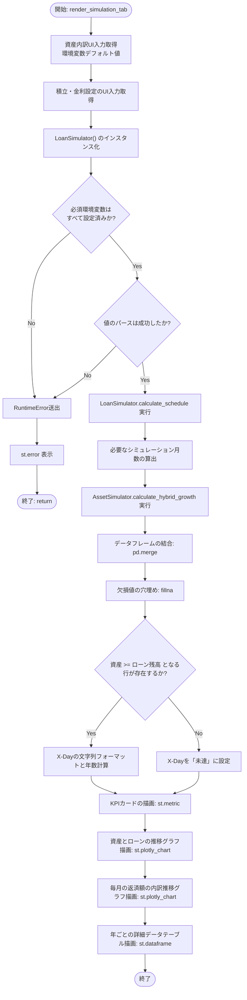
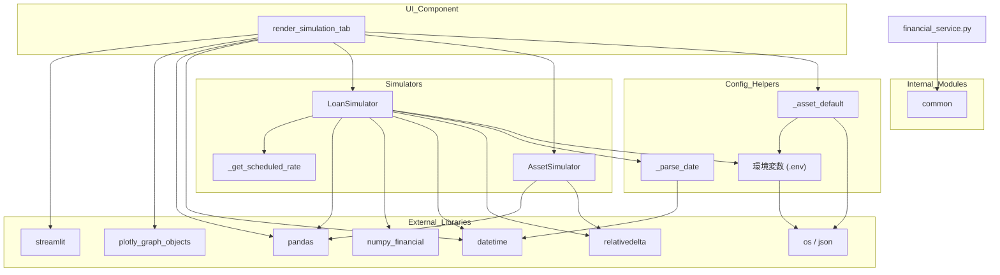

## 1. 解析メタ情報

| 項目 | 内容 |
| --- | --- |
| 対象ファイル | financial_service.py |
| 言語 | Python |
| 解析対象 | 提供されたコードのみ |
| 推測・補完 | 一切なし |

## 関連ドキュメント

* [common.md](./common.md) - `common.setup_logging("FinancialService")`の呼び出し先。実体は`core.logger.setup_logging`へのFacade
* [logger.md](./logger.md) - `setup_logging`の実体
* 本ファイルは`config.py`を経由せず`os.getenv`を直接使用する設計(個人情報保護のため)であり、[config.md](./config.md)とは対照的な設定値読み込み方式を採る点に留意

## 2. ファイルの概要

本ファイルは、設定された初期条件と変動金利ルールに基づく「住宅ローンの返済スケジュール」と、毎月の積立額と想定利回りに基づく「ハイブリッド型（現金＋投資）の資産成長スケジュール」をシミュレーションし、その推移と双方が逆転するタイミング（ゴール）を可視化するためのStreamlit UIコンポーネントを提供する責務を持つ。ローンの初期条件（開始日・借入総額・返済月数・初回支払額・金利スケジュール）や現在の資産内訳は、個人情報のためソースコードに直書きせず、すべて環境変数（`.env`）から読み込む設計になっている。
* 根拠: `_FINANCIAL_START_DATE = os.getenv("FINANCIAL_START_DATE")` 等 (行番号: 15-26 / 抜粋: "個人の実際のローン条件は git 管理対象のソースに直書きせず、環境変数から読み込む。")

## 3. 外部依存関係

### インポート一覧

| 名称 | 種類 | 用途 | 根拠 |
| --- | --- | --- | --- |
| os | 標準ライブラリ | ローン条件・資産内訳の環境変数(`os.getenv`)からの読み込み | 根拠: `import os` (行番号: 2 / 抜粋: "import os") |
| json | 標準ライブラリ | 金利スケジュール環境変数(JSON文字列)のパース | 根拠: `import json` (行番号: 3 / 抜粋: "import json") |
| pandas (pd) | 外部ライブラリ | データフレームの作成、結合、操作 | 根拠: `import pandas` (行番号: 4 / 抜粋: "import pandas as pd") |
| numpy_financial (npf) | 外部ライブラリ | ローンの月額返済額（PMT）の計算 | 根拠: `import numpy_financial` (行番号: 5 / 抜粋: "import numpy_financial as npf") |
| streamlit (st) | 外部ライブラリ | UIコンポーネント（サイドバー、グラフ枠、表等）の描画 | 根拠: `import streamlit` (行番号: 6 / 抜粋: "import streamlit as st") |
| plotly.graph_objects (go) | 外部ライブラリ | 時系列グラフや積み上げ面グラフの描画 | 根拠: `import plotly.graph_objects` (行番号: 7 / 抜粋: "import plotly.graph_objects as go") |
| date, datetime | 標準ライブラリ | 日付データの表現・操作、および環境変数の日付文字列のパース | 根拠: `from datetime import date, datetime` (行番号: 8 / 抜粋: "from datetime import date, datetime") |
| relativedelta | 外部ライブラリ | 日付に対する月単位での加算処理 | 根拠: `from dateutil.relativedelta import relativedelta` (行番号: 9 / 抜粋: "from dateutil.relativedelta import relativedelta") |
| common | 内部モジュール | 共通処理（ロガー設定など）の呼び出し | 根拠: `import common` (行番号: 10 / 抜粋: "import common") |

### ブラックボックスとなる外部要素

| 名称 | 理由 | 根拠 |
| --- | --- | --- |
| `common.setup_logging` | 外部ファイルで定義されており、ログの出力先、フォーマット、ログレベルなどの具体的な内部実装が提供されたコード内からは判断不可。 | 根拠: `common.setup_logging` (行番号: 13 / 抜粋: "logger = common.setup_logging(") |
| 環境変数 (`.env`) 群 (`FINANCIAL_START_DATE`, `FINANCIAL_TOTAL_AMOUNT`, `FINANCIAL_TOTAL_MONTHS`, `FINANCIAL_INITIAL_PAYMENT`, `FINANCIAL_RATE_SCHEDULE`, `FINANCIAL_PROJECTION_BASE_RATE`, `FINANCIAL_PROJECTION_BASE_DATE`, `FINANCIAL_ASSET_*`) | `.env` / `.env.example` の実体が本ファイル内に含まれておらず、実際の値やフォーマットの正確性は外部設定に依存するため | 根拠: `os.getenv("FINANCIAL_START_DATE")` 等 (行番号: 19-26, 218-222 / 抜粋: "_FINANCIAL_START_DATE = os.getenv("FINANCIAL_START_DATE")") |

## 4. 主要要素の定義（関数 / エンドポイント / コンポーネント）

### `logger`

* **役割**: 指定された名称（"FinancialService"）でセットアップされたロガーのインスタンスを保持する。
* 根拠: `logger` (行番号: 13 / 抜粋: "logger = common.setup_logging("FinancialService")")

### モジュール定数 `_FINANCIAL_*`

* **役割**: 住宅ローンシミュレーションの初期条件（開始日、借入総額、返済月数、初回支払額、金利スケジュール、変動予測の起点金利・起点日）を環境変数から読み込んでモジュールレベルの変数として保持する。個人情報のためソースコードには直書きしない設計。
* 根拠: `_FINANCIAL_START_DATE = os.getenv("FINANCIAL_START_DATE")` ほか (行番号: 19-26 / 抜粋: "_FINANCIAL_START_DATE = os.getenv("FINANCIAL_START_DATE")")

* **引数/リクエスト**: なし（モジュールインポート時に環境変数から取得）
* 根拠: [モジュールレベル] (行番号: 19-26 / 抜粋: "os.getenv(")

* **戻り値/レスポンス**: `str` または `None`（環境変数未設定時）
* 根拠: `os.getenv(...)` (行番号: 19-26 / 抜粋: "os.getenv("FINANCIAL_START_DATE")")

* **副作用**: なし
* 根拠: [モジュールレベル] (行番号: 19-26 / 抜粋: "os.getenv(")

* **エラーハンドリング**: なし（未設定時は`None`のまま保持され、実際の検証は`LoanSimulator.__init__`で行われる）
* 根拠: [モジュールレベル] (行番号: 19-26 / 抜粋: "os.getenv(")

### 関数 `_parse_date`

* **役割**: `YYYY-MM-DD`形式の文字列を`date`オブジェクトに変換するヘルパー関数。
* 根拠: `def _parse_date(value: str) -> date:` (行番号: 29-30 / 抜粋: "def _parse_date(value: str) -> date:")

* **引数/リクエスト**: `value`: str (`YYYY-MM-DD`形式の日付文字列)
* 根拠: 引数定義 (行番号: 29 / 抜粋: "def _parse_date(value: str) -> date:")

* **戻り値/レスポンス**: `date`
* 根拠: `return datetime.strptime(value, "%Y-%m-%d").date()` (行番号: 30 / 抜粋: "return datetime.strptime(value, "%Y-%m-%d").date()")

* **副作用**: なし
* 根拠: [関数本体] (行番号: 29-30 / 抜粋: 副作用を伴う処理なし)

* **エラーハンドリング**: なし（フォーマット不正時は`ValueError`が呼び出し元に伝播する）
* 根拠: [関数本体] (行番号: 29-30 / 抜粋: "try-exceptなし")

### 関数 `_asset_default`

* **役割**: 資産内訳UIの初期値を環境変数から取得する。個人の資産残高は情報のためソースコードに直書きせず、未設定時は`0`にフォールバックしてシミュレーション機能自体は継続利用できるようにする。
* 根拠: `def _asset_default(env_name: str) -> int:` (行番号: 33-43 / 抜粋: "def _asset_default(env_name: str) -> int:")

* **引数/リクエスト**: `env_name`: str (参照する環境変数名)
* 根拠: 引数定義 (行番号: 33 / 抜粋: "def _asset_default(env_name: str) -> int:")

* **戻り値/レスポンス**: `int` (環境変数の値、未設定または不正な場合は`0`)
* 根拠: `return int(raw)` / `return 0` (行番号: 38, 40, 43 / 抜粋: "return int(raw)")

* **副作用**: 値が不正な場合、`logger.warning`によるログ出力。
* 根拠: `logger.warning(f"{env_name} の値が不正です...")` (行番号: 42 / 抜粋: "logger.warning(f"{env_name} の値が不正です")")

* **エラーハンドリング**: `int(raw)`変換失敗時の`ValueError`をキャッチし、警告ログを出力して`0`を返す。
* 根拠: `except ValueError:` (行番号: 41-43 / 抜粋: "except ValueError:")

### `LoanSimulator.__init__`

* **役割**: モジュールレベルの環境変数（`_FINANCIAL_START_DATE`等）から住宅ローンシミュレーションの初期条件を読み込み、必須の環境変数が未設定の場合は`RuntimeError`を送出する。値のパースに成功した場合、開始日・借入総額・総返済月数・初回支払額・確定金利スケジュール(`FIXED_RATES`)、および確定スケジュール終了後の変動予測の起点金利・起点日を設定する。
* 根拠: `def __init__(self):` (行番号: 47-89 / 抜粋: "def __init__(self):")

* **引数/リクエスト**: `self` (インスタンス自身)
* 根拠: `def __init__(self):` (行番号: 47 / 抜粋: "def __init__(self):")

* **戻り値/レスポンス**: なし
* 根拠: [関数本体] (行番号: 47-89 / 抜粋: "self._projection_base_date = self.START_DATE")

* **副作用**: 自身のインスタンス変数（`START_DATE`, `TOTAL_AMOUNT`, `TOTAL_MONTHS`, `INITIAL_PAYMENT`, `FIXED_RATES`, `_projection_base_rate`, `_projection_base_date`）の初期化。
* 根拠: `self.START_DATE = _parse_date(_FINANCIAL_START_DATE)` ほか (行番号: 66-89 / 抜粋: "self.START_DATE = _parse_date(_FINANCIAL_START_DATE)")

* **エラーハンドリング**: 必須の環境変数（`FINANCIAL_START_DATE`等5項目）のいずれかが未設定の場合、`RuntimeError`を送出し設定必要項目を案内する。値のパース（日付変換、`int`変換、JSON解析）に失敗した場合も`ValueError`/`TypeError`/`json.JSONDecodeError`をキャッチして`RuntimeError`として再送出する。
* 根拠: `if missing: raise RuntimeError(...)` / `except (ValueError, TypeError, json.JSONDecodeError) as e: raise RuntimeError(...)` (行番号: 58-63, 75-76 / 抜粋: "raise RuntimeError(")

### `LoanSimulator._get_scheduled_rate`

* **役割**: 指定された日付時点での適用金利を判定する。確定スケジュールに該当する場合はその金利を返し、確定スケジュール終了後（変動予測の起点日以降）は経過年数と指定された上昇率に基づいて算出し、上限キャップを適用した数値を返す。
* 根拠: `def _get_scheduled_rate(self, current_date, future_rise_rate=0.0, max_rate=2.0):` (行番号: 91-114 / 抜粋: "def _get_scheduled_rate(self, current_date, future_rise_rate=0.0, max_rate=2.0):")

* **引数/リクエスト**:
* `current_date`: date (判定対象の日付)
* `future_rise_rate`: float (デフォルト値 0.0、変動予測期間の年次金利上昇率)
* `max_rate`: float (デフォルト値 2.0、計算金利の上限値)
* 根拠: 引数定義 (行番号: 91 / 抜粋: "def _get_scheduled_rate(self, current_date, future_rise_rate=0.0, max_rate=2.0):")

* **戻り値/レスポンス**: float (計算された金利)
* 根拠: `return rate` / `return min(calculated_rate, max_rate)` / `return base_rate` (行番号: 98, 112, 114 / 抜粋: "return min(calculated_rate, max_rate)")

* **副作用**: なし
* 根拠: [関数本体] (行番号: 91-114 / 抜粋: 副作用を伴う処理なし)

* **エラーハンドリング**: なし
* 根拠: [関数本体] (行番号: 91-114 / 抜粋: "try-exceptなし")

### `LoanSimulator.calculate_schedule`

* **役割**: 月ごとのローン残高、支払額、利息、元金、金利の推移を計算しリスト化する。5年（60ヶ月）ごとの支払額再計算、および前回支払額の125%を上限とする激変緩和措置を適用してDataFrameに変換して返す。
* 根拠: `def calculate_schedule(self, future_rise_rate=0.05, max_future_rate=2.0):` (行番号: 116-171 / 抜粋: "def calculate_schedule(self, future_rise_rate=0.05, max_future_rate=2.0):")

* **引数/リクエスト**:
* `future_rise_rate`: float (デフォルト値 0.05)
* `max_future_rate`: float (デフォルト値 2.0)
* 根拠: 引数定義 (行番号: 116 / 抜粋: "def calculate_schedule(self, future_rise_rate=0.05, max_future_rate=2.0):")

* **戻り値/レスポンス**: pandas.DataFrame (月ごとのローン推移データ)
* 根拠: `return pd.DataFrame(schedule)` (行番号: 171 / 抜粋: "return pd.DataFrame(schedule)")

* **副作用**: なし
* 根拠: [関数本体] (行番号: 116-171 / 抜粋: "schedule.append({")

* **エラーハンドリング**: 残り月数が0以下になった場合のゼロ除算回避（`if remaining_months > 0:`）および金利0時の分岐処理。例外の明示的なキャッチ（try-except）はなし。
* 根拠: `if remaining_months > 0:` (行番号: 134 / 抜粋: "if remaining_months > 0:")

### `AssetSimulator.calculate_hybrid_growth`

* **役割**: 指定期間において、投資部分（複利で増加）と現金部分（単利・加算のみ）の合計資産推移をシミュレーションし、DataFrameとして返す静的メソッド。
* 根拠: `def calculate_hybrid_growth(start_date, months, init_invest, init_cash, monthly_total_save, invest_ratio, annual_return):` (行番号: 174-206 / 抜粋: "def calculate_hybrid_growth(start_date, months, init_invest, init_cash, monthly_total_save, invest_ratio, annual_return):")

* **引数/リクエスト**:
* `start_date`: date (シミュレーション開始日)
* `months`: int (シミュレーション月数)
* `init_invest`: 数値型 (初期投資残高)
* `init_cash`: 数値型 (初期現金残高)
* `monthly_total_save`: 数値型 (毎月の総積立額)
* `invest_ratio`: 数値型 (総積立額のうち投資へ回す割合[%])
* `annual_return`: float (想定年利回り[%])
* 根拠: 引数定義 (行番号: 175 / 抜粋: "def calculate_hybrid_growth(start_date, months, init_invest, init_cash, monthly_total_save, invest_ratio, annual_return):")

* **戻り値/レスポンス**: pandas.DataFrame (月ごとの資産推移データ)
* 根拠: `return pd.DataFrame(schedule)` (行番号: 206 / 抜粋: "return pd.DataFrame(schedule)")

* **副作用**: なし
* 根拠: [関数本体] (行番号: 174-206 / 抜粋: "return pd.DataFrame(schedule)")

* **エラーハンドリング**: なし
* 根拠: [関数本体] (行番号: 174-206 / 抜粋: "try-exceptなし")

### `render_simulation_tab`

* **役割**: Streamlitを使用してシミュレーション設定用のサイドバーUI（現在の資産内訳・積立設定・変動金利設定）を提供し、入力値をもとに`LoanSimulator`をインスタンス化する。環境変数未設定などで`RuntimeError`が送出された場合は`st.error`を表示して処理を中断する。正常時は各シミュレータを呼び出して結果を結合し、「ローンと資産の逆転日（X-Day）」を算出、各種KPIカード、資産とローンの推移グラフ、返済額内訳グラフ、詳細データテーブルを画面にレンダリングする。
* 根拠: `def render_simulation_tab():` (行番号: 210-398 / 抜粋: "def render_simulation_tab():")

* **引数/リクエスト**: なし
* 根拠: `def render_simulation_tab():` (行番号: 210 / 抜粋: "def render_simulation_tab():")

* **戻り値/レスポンス**: なし（`RuntimeError`捕捉時は早期`return`）
* 根拠: `return` (行番号: 244 / 抜粋: "return")

* **副作用**: Streamlitの関数群（`st.markdown`, `st.sidebar`, `st.plotly_chart` など）を呼び出し、Web画面のDOMを書き換える副作用がある。
* 根拠: `st.markdown(...)`, `st.plotly_chart(fig, use_container_width=True)` (行番号: 211, 321, 368 等 / 抜粋: "st.plotly_chart(fig, use_container_width=True)")

* **エラーハンドリング**: `LoanSimulator()`のインスタンス化時に`RuntimeError`（環境変数未設定・形式不正）が発生した場合、`st.error`でエラーメッセージを表示して処理を中断する。また`df_merged["balance"]`のNaN値をゼロ埋めしてグラフ描画時のエラーを防止する。
* 根拠: `except RuntimeError as e: st.error(f"⚠️ {e}") return` / `df_merged["balance"] = df_merged["balance"].fillna(0)` (行番号: 240-244, 256 / 抜粋: "except RuntimeError as e:")

## 5. 処理フロー図

```mermaid
flowchart TD
    Start([開始: render_simulation_tab]) --> UI_Assets[資産内訳UI入力取得<br>環境変数デフォルト値]
    UI_Assets --> UI_Inputs[積立・金利設定のUI入力取得]
    UI_Inputs --> Init_LoanSim["LoanSimulator() のインスタンス化"]
    Init_LoanSim --> EnvCheck{必須環境変数は<br>すべて設定済みか?}
    EnvCheck -- No --> RaiseErr["RuntimeError送出"] --> ShowErr["st.error 表示"] --> End_Early([終了: return])
    EnvCheck -- Yes --> ParseCheck{値のパースは成功したか?}
    ParseCheck -- No --> RaiseErr
    ParseCheck -- Yes --> Exec_LoanSim[LoanSimulator.calculate_schedule 実行]
    Exec_LoanSim --> Init_AssetSim[必要なシミュレーション月数の算出]
    Init_AssetSim --> Exec_AssetSim[AssetSimulator.calculate_hybrid_growth 実行]
    Exec_AssetSim --> Merge_DF[データフレームの結合: pd.merge]
    Merge_DF --> Fill_NaN[欠損値の穴埋め: fillna]
    Fill_NaN --> Calc_XDay{資産 >= ローン残高 となる行が存在するか?}
    Calc_XDay -- Yes --> Format_XDay[X-Dayの文字列フォーマットと年数計算]
    Calc_XDay -- No --> Format_MissDay[X-Dayを「未達」に設定]
    Format_XDay --> Render_KPI[KPIカードの描画: st.metric]
    Format_MissDay --> Render_KPI
    Render_KPI --> Render_Chart1[資産とローンの推移グラフ描画: st.plotly_chart]
    Render_Chart1 --> Render_Chart2[毎月の返済額の内訳推移グラフ描画: st.plotly_chart]
    Render_Chart2 --> Render_Table[年ごとの詳細データテーブル描画: st.dataframe]
    Render_Table --> End([終了])

```

## 6. 依存関係図

```mermaid
graph TD
    subgraph UI_Component
        render_simulation_tab
    end

    subgraph Simulators
        LoanSimulator
        AssetSimulator
        _get_scheduled_rate
    end

    subgraph Config_Helpers
        _parse_date
        _asset_default
        EnvVars["環境変数 (.env)"]
    end

    subgraph External_Libraries
        streamlit
        plotly_graph_objects
        pandas
        numpy_financial
        datetime
        relativedelta
        os_json["os / json"]
    end

    subgraph Internal_Modules
        common
    end

    render_simulation_tab --> streamlit
    render_simulation_tab --> plotly_graph_objects
    render_simulation_tab --> pandas
    render_simulation_tab --> datetime
    render_simulation_tab --> LoanSimulator
    render_simulation_tab --> AssetSimulator
    render_simulation_tab --> _asset_default

    LoanSimulator --> _get_scheduled_rate
    LoanSimulator --> pandas
    LoanSimulator --> numpy_financial
    LoanSimulator --> datetime
    LoanSimulator --> relativedelta
    LoanSimulator --> _parse_date
    LoanSimulator --> EnvVars

    _parse_date --> datetime
    _asset_default --> EnvVars
    _asset_default --> os_json
    EnvVars --> os_json

    AssetSimulator --> pandas
    AssetSimulator --> relativedelta

    financial_service.py --> common

```

## 7. 次のステップ（リバースエンジニアリングの提案）

| 優先度 | ファイル名(推測可) | 理由 | 根拠 |
| --- | --- | --- | --- |
| 高 | `.env.example` | `FINANCIAL_START_DATE`等、必須環境変数の正確な項目名・フォーマット（特に`FINANCIAL_RATE_SCHEDULE`のJSON構造）を確認するため。 | 根拠: `raw_schedule = json.loads(_FINANCIAL_RATE_SCHEDULE)` (行番号: 70) |
| 高 | `common.py` | `setup_logging`関数が呼び出されているため、ログの出力仕様（出力先、フォーマット、ログレベルなど）を把握し、システム全体の監視仕様を確認するため。 | 根拠: `common` (行番号: 13 / 抜粋: "logger = common.setup_logging(") |

## 8. 保守上の注意点

* **ローン条件・資産内訳の環境変数化**: 従来ソースコードに直書きされていたローン初期条件（開始日・借入総額・返済月数・初回支払額・確定金利スケジュール）および資産内訳の初期値は、個人情報保護のためすべて環境変数（`.env`）経由の読み込みに変更された。`LoanSimulator.__init__`は必須環境変数が1つでも未設定だと`RuntimeError`を送出する設計であり、呼び出し元の`render_simulation_tab`はこれを`try/except`で捕捉して`st.error`表示に変換している。
* `AssetSimulator` 内の `calculate_hybrid_growth` は `@staticmethod` として定義されており、クラスのインスタンス状態に依存しない純粋なデータ変換（計算）関数として動作する設計となっている。
* `render_simulation_tab` 内部では `streamlit` API を直接多数呼び出しており、画面の再描画が行われるたびに当該関数の先頭から末尾までの計算処理（シミュレーション、データ結合、DOM構築）が都度再実行される。
* `_FINANCIAL_RATE_SCHEDULE` はJSON文字列として環境変数に設定する必要があり、フォーマット誤りは`RuntimeError`として`LoanSimulator.__init__`内で捕捉されるが、具体的にどのようなJSON構造が期待されているかはコメント例（行番号23）以外に明記がない。

## 9. 不明事項一覧

| 項目 | 理由 | 必要なファイル |
| --- | --- | --- |
| ロガーの設定内容 | `common.setup_logging` 内で行われている具体的な設定（標準出力かファイル出力か、ログレベル等）が本ファイルからは確認できないため。 | `common.py` |
| 環境変数の正確な設定値・フォーマット | `.env` / `.env.example` の実体が提供されておらず、`FINANCIAL_RATE_SCHEDULE`のJSON構造や各`FINANCIAL_ASSET_*`項目の一覧が本ファイル単体では確定できないため。 | `.env.example` |

## 相互参照による補足情報

| 元の不明事項 | 判明した内容 | 参照元ドキュメント |
| --- | --- | --- |
| ロガーの設定内容 | `logger.md`の解析によれば、`setup_logging`はコンソール出力・日次ローテーションのファイル出力(`home_system.log`固定)・ERRORレベル以上をDiscord Webhookへ通知する`DiscordErrorHandler`の3種のハンドラを登録するとされる。ただしログ保存先ディレクトリ(`config.BASE_DIR`)の実際の値は`logger.md`自体でも未確認とされている。 | logger.md |
| 環境変数の正確な設定値・フォーマット | `MY_HOME_SYSTEM/.env.example`(全30行、コピーして`.env`として使う旨のコメント付き)を直接確認した。6〜21行目が本ファイル向けの設定で、`FINANCIAL_START_DATE=2024-01-01`、`FINANCIAL_TOTAL_AMOUNT=50000000`、`FINANCIAL_TOTAL_MONTHS=420`、`FINANCIAL_INITIAL_PAYMENT=140000`、`FINANCIAL_RATE_SCHEDULE=[["2024-01-01","2024-12-31",0.5],["2025-01-01",null,0.7]]`(`[start_date, end_date_or_null, annual_rate_percent]`のタプルを要素とするJSON配列)、`FINANCIAL_PROJECTION_BASE_RATE=0.9`、`FINANCIAL_PROJECTION_BASE_DATE=2026-01-01`という例示値が確認できた。23〜30行目は資産内訳のデフォルト値で、`FINANCIAL_ASSET_CASH=1000000`、`FINANCIAL_ASSET_STOCK=1000000`、`FINANCIAL_ASSET_TRUST=1000000`、`FINANCIAL_ASSET_PENSION=1000000`、`FINANCIAL_ASSET_POINT=10000`の5項目が、コメント(24〜25行目)によれば「すべて任意、未設定時は0扱い」とされている。 | 直接ソース確認: `MY_HOME_SYSTEM/.env.example:6-30` |

## 10. 自己検証結果

* [x] 推測・外部ファイルの仕様を一切含んでいない
* [x] 全関数・全クラス・全コンポーネントを列挙した
* [x] 全てのインポート要素を列挙した
* [x] すべての仕様説明に「根拠（行番号・抜粋）」を明記した
* [x] 根拠漏れが0件である
* [x] Mermaid構文にエラーの原因となる記号（エスケープ漏れ）がない
* [x] 不明事項を漏れなく列挙した

完了
