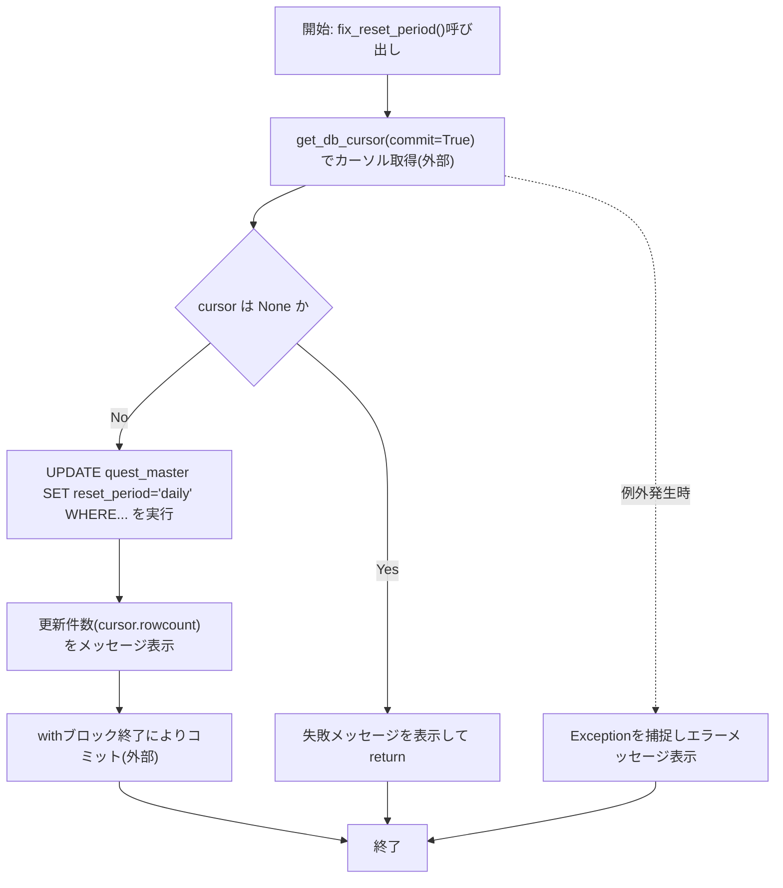
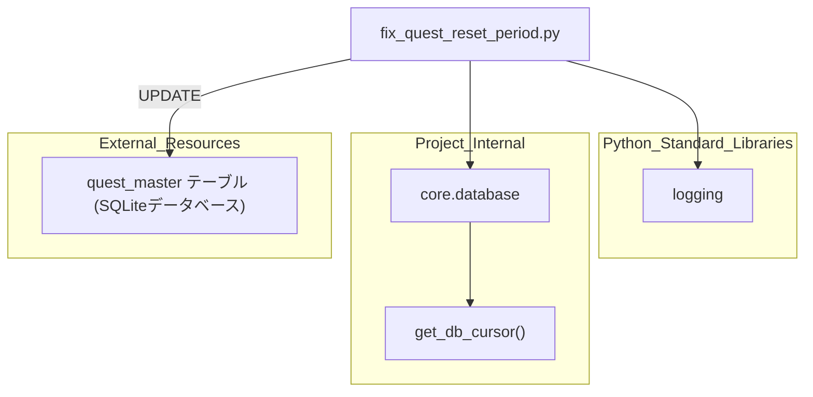

## 1. 解析メタ情報

| 項目 | 内容 |
| --- | --- |
| 対象ファイル | `fix_quest_reset_period.py` |
| 言語 | Python |
| 解析対象 | 提供されたコードのみ |
| 推測・補完 | 一切なし |

## 関連ドキュメント

* [database.md](./database.md) - `get_db_cursor`を提供する`core.database`モジュールの仕様書（本ファイルの直接のインポート元）
* [quest_service.md](./quest_service.md) - `quest_master`テーブルの`reset_period`カラムを扱う本番サービス側モジュールと推測され、本ファイルが修正するデータの利用先として関連
* [add_quest_columns.md](./add_quest_columns.md) - 同じ`quest_master`テーブルに対して別の観点（カラム追加）でマイグレーションを行う同系統のスクリプト

## 2. ファイルの概要

`quest_master`テーブルの`reset_period`カラムの値を修正するワンショットスクリプト。`reset_period`が`'weekly_monday'`かつ`quest_id`が`'boss_'`で始まらないレコードを対象に、`reset_period`を`'daily'`へ一括更新する`fix_reset_period`関数を定義し、モジュール直接実行時にこれを呼び出す。

* 根拠: `[UPDATE文]` (行番号: 16〜21 / 抜粋: "cursor.execute(\"\"\"\n                UPDATE quest_master\n                SET reset_period = 'daily'\n                WHERE reset_period = 'weekly_monday' \n                  AND quest_id NOT LIKE 'boss_%'\n            \"\"\")")
* 根拠: `[コメント：テーブル名変更]` (行番号: 15 / 抜粋: "# 修正: テーブル名を `quest_master` に変更しました")
* 根拠: `[main実行部]` (行番号: 29〜30 / 抜粋: "if __name__ == \"__main__\":\n    fix_reset_period()")

## 3. 外部依存関係

### インポート一覧

| 名称 | 種類 | 用途 | 根拠 |
| --- | --- | --- | --- |
| `logging` | 標準ライブラリ | `basicConfig`によるルートロガーのログレベル設定（INFO） | 根拠: `[import logging / basicConfig]` (行番号: 1, 5 / 抜粋: "import logging" / "logging.basicConfig(level=logging.INFO)") |
| `get_db_cursor` | 内部モジュール（`core.database`） | DBカーソルをコンテキストマネージャとして取得し、`commit=True`指定でブロック終了時に自動コミットする機能の提供 | 根拠: `[from core.database import get_db_cursor]` (行番号: 2 / 抜粋: "from core.database import get_db_cursor") |

### ブラックボックスとなる外部要素

| 名称 | 理由 | 根拠 |
| --- | --- | --- |
| `get_db_cursor` の内部実装 | `core.database`モジュールの実装コードが提供されておらず、接続先DB・カーソル生成方法・`commit=True`時の具体的挙動・`cursor`が`None`になり得る条件が不明であるため。 | 根拠: `[get_db_cursor(commit=True)]` (行番号: 10 / 抜粋: "with get_db_cursor(commit=True) as cursor:") |
| `quest_master`テーブルの完全なスキーマ | テーブル定義自体が当ファイル内に存在せず、`reset_period`・`quest_id`以外のカラム構成が不明であるため。 | 根拠: `[UPDATE quest_master]` (行番号: 17 / 抜粋: "UPDATE quest_master") |

## 4. 主要要素の定義（関数 / エンドポイント / コンポーネント）

### `fix_reset_period`

* **役割**: `quest_master`テーブルのうち、`reset_period`が`'weekly_monday'`かつ`quest_id`が`'boss_'`で始まらないレコードの`reset_period`を`'daily'`に一括更新する。
* 根拠: `[fix_reset_period定義およびUPDATE文]` (行番号: 7, 16〜21 / 抜粋: "def fix_reset_period():" / "SET reset_period = 'daily'\n                WHERE reset_period = 'weekly_monday'")

* **引数/リクエスト**: なし
* 根拠: `[関数シグネチャ]` (行番号: 7 / 抜粋: "def fix_reset_period():")

* **戻り値/レスポンス**: なし。処理結果（更新件数または失敗理由）は`print`で標準出力へ表示されるのみ。`cursor`が`None`の場合は早期`return`（戻り値なし）。
* 根拠: `[早期return]` (行番号: 11〜13 / 抜粋: "if cursor is None:\n                print(\"❌ DBカーソルの取得に失敗しました。\")\n                return")
* 根拠: `[結果表示]` (行番号: 24 / 抜粋: "print(f\"✅ {cursor.rowcount} 件のクエストを 'daily' に修正しました。\")")

* **副作用**: `get_db_cursor(commit=True)`のコンテキストマネージャを介したDBへの`UPDATE`実行およびコミット（自動コミットはコンテキストマネージャの責務とコメントに明記）。
* 根拠: `[commit=Trueのコメント]` (行番号: 9 / 抜粋: "# commit=True を指定することで、withブロック終了時に自動コミットされます")

* **エラーハンドリング**: 関数全体を`try`ブロックで囲み、`Exception`を捕捉してエラーメッセージを`print`表示する。捕捉した例外の再送出は行わない。
* 根拠: `[except Exception]` (行番号: 26〜27 / 抜粋: "except Exception as e:\n        print(f\"❌ エラーが発生しました: {e}\")")

## 5. 処理フロー図

## 6. 依存関係図

## 7. 次のステップ（リバースエンジニアリングの提案）

| 優先度 | ファイル名(推測可) | 理由 | 根拠 |
| --- | --- | --- | --- |
| 高 | `core/database.py` | `get_db_cursor`の実装（接続先DB、`commit`引数の挙動、`cursor`が`None`になる条件）を確認するため。 | 根拠: `[get_db_cursor(commit=True)]` (行番号: 2, 10 / 抜粋: "from core.database import get_db_cursor") |
| 中 | `quest_service.py` | `quest_master`テーブルの`reset_period`カラムが実際にどのようなロジックで参照・利用されているかを確認するため。 | 根拠: `[quest_master, reset_period]` (行番号: 17〜18 / 抜粋: "UPDATE quest_master\n                SET reset_period = 'daily'") |
| 低 | `add_quest_columns.py` | 同じ`quest_master`テーブルに対する別のマイグレーション処理との整合性・実行順序を確認するため。 | 根拠: `[quest_master]` (行番号: 17 / 抜粋: "UPDATE quest_master") |

## 8. 保守上の注意点

* **広範な例外の握りつぶし**: `except Exception as e`で全ての例外を捕捉しメッセージ表示のみに留めており、`raise`による再送出がないため、自動実行環境では失敗が検知されにくい。
* 根拠: `[except Exception]` (行番号: 26〜27 / 抜粋: "except Exception as e:\n        print(f\"❌ エラーが発生しました: {e}\")")
* **loggingとprintの混在**: `logging.basicConfig(level=logging.INFO)`でロガーを設定しているにもかかわらず、実際の出力は全て`print`文で行われており、`logging`モジュールの機能（ロガーオブジェクトの利用）が実質的に使われていない。
* 根拠: `[basicConfigとprintの併用]` (行番号: 5, 12, 24, 27 / 抜粋: "logging.basicConfig(level=logging.INFO)" / "print(f\"✅ {cursor.rowcount} 件のクエストを 'daily' に修正しました。\")")
* **ハードコードされた対象条件**: `'weekly_monday'`および`'boss_%'`という文字列条件がSQL文中に直接埋め込まれており、これらの値が将来変更された場合はスクリプト自体の修正が必要になる。
* 根拠: `[WHERE句]` (行番号: 19〜20 / 抜粋: "WHERE reset_period = 'weekly_monday' \n                  AND quest_id NOT LIKE 'boss_%'")

## 9. 不明事項一覧

| 項目 | 理由 | 必要なファイル |
| --- | --- | --- |
| `get_db_cursor`関数の実装詳細 | `core.database`モジュールのソースコードが当ファイル内に存在しないため、接続先DBや`commit`引数の具体的挙動が不明。 | `core/database.py` |
| `quest_master`テーブルの完全なスキーマ | `reset_period`・`quest_id`カラム以外の構成が当ファイルからは判断できないため。 | `init_unified_db.py`等のスキーマ定義ファイル |
| 本スクリプトの想定実行タイミング | 手動実行か、定期バッチ実行かなど、呼び出しコンテキストが当ファイル内に記述されていないため。 | 呼び出し元スクリプトまたは運用手順書 |

## 10. 自己検証結果

* [x] 推測・外部ファイルの仕様を一切含んでいない（完了）
* [x] 全関数・全クラス・全コンポーネントを列挙した（完了）
* [x] 全てのインポート要素を列挙した（完了）
* [x] すべての仕様説明に「根拠（行番号・抜粋）」を明記した（完了）
* [x] 根拠漏れが0件である（完了）
* [x] Mermaid構文にエラーの原因となる記号（エスケープ漏れ）がない（完了）
* [x] 不明事項を漏れなく列挙した（完了）
