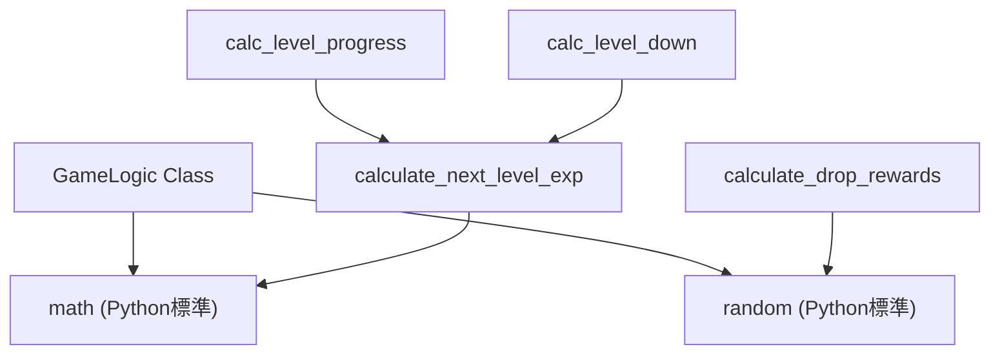

## 1. 解析メタ情報

| 項目 | 内容 |
| --- | --- |
| 対象ファイル | `game_logic.py` |
| 言語 | Python |
| 解析対象 | 提供されたコードのみ |
| 推測・補完 | 一切なし |

## 2. ファイルの概要

ゲームルールの計算ロジック（レベルアップの必要経験値、最大HPの算出、経験値増減に伴うレベルの変動、ドロップ報酬の決定）を担当するクラスを定義している。データベース接続は行わず、純粋な入出力のみを扱う。

## 3. 外部依存関係

### インポート一覧

| 名称 | 種類 | 用途 | 根拠 |
| --- | --- | --- | --- |
| `math` | 標準ライブラリ | 経験値計算における累乗と切り捨て処理 | `import math` (行番号取得不可 / 抜粋: "import math") |
| `random` | 標準ライブラリ | ドロップ報酬のメダル獲得確率判定 | `import random` (行番号取得不可 / 抜粋: "import random") |
| `Tuple`, `Dict`, `Any`, `Optional` | 標準ライブラリ(型ヒント) | 関数の引数・戻り値の型定義 | `from typing import Tuple, Dict...` (行番号取得不可 / 抜粋: "from typing import Tuple, Dict") |

### ブラックボックスとなる外部要素

| 名称 | 理由 | 根拠 |
| --- | --- | --- |
| 該当なし | 提供されたコード内で全ての計算ロジックが完結しているため。 | 全体コード (行番号取得不可 / 抜粋: "class GameLogic:") |

## 4. 主要要素の定義（関数 / エンドポイント / コンポーネント）

### `GameLogic.calculate_next_level_exp`

* **役割**: 次のレベルに必要な経験値を計算する（100 × 1.2の(レベル-1)乗の切り捨て）。
* 根拠: `GameLogic.calculate_next_level_exp` (行番号取得不可 / 抜粋: "return math.floor(100 * math...")

* **引数/リクエスト**: `level: int` (対象となるレベル)
* 根拠: `GameLogic.calculate_next_level_exp` (行番号取得不可 / 抜粋: "def calculate_next_level_exp...")

* **戻り値/レスポンス**: `int` (必要経験値)
* 根拠: `GameLogic.calculate_next_level_exp` (行番号取得不可 / 抜粋: "def calculate_next_level_exp...")

* **副作用**: なし
* 根拠: `GameLogic.calculate_next_level_exp` (行番号取得不可 / 抜粋: "return math.floor(100 * math...")

* **エラーハンドリング**: なし
* 根拠: `GameLogic.calculate_next_level_exp` (行番号取得不可 / 抜粋: "return math.floor(100 * math...")

### `GameLogic.calculate_max_hp`

* **役割**: レベルに応じた最大HPを計算する（レベル × 20 + 5）。
* 根拠: `GameLogic.calculate_max_hp` (行番号取得不可 / 抜粋: "return level * 20 + 5")

* **引数/リクエスト**: `level: int` (対象となるレベル)
* 根拠: `GameLogic.calculate_max_hp` (行番号取得不可 / 抜粋: "def calculate_max_hp(level: ...")

* **戻り値/レスポンス**: `int` (最大HP)
* 根拠: `GameLogic.calculate_max_hp` (行番号取得不可 / 抜粋: "def calculate_max_hp(level: ...")

* **副作用**: なし
* 根拠: `GameLogic.calculate_max_hp` (行番号取得不可 / 抜粋: "return level * 20 + 5")

* **エラーハンドリング**: なし
* 根拠: `GameLogic.calculate_max_hp` (行番号取得不可 / 抜粋: "return level * 20 + 5")

### `GameLogic.calc_level_progress`

* **役割**: 経験値を加算し、必要経験値を満たす間レベルを上げ続け、最終的なレベルと余剰経験値、レベルアップ有無を判定する。
* 根拠: `GameLogic.calc_level_progress` (行番号取得不可 / 抜粋: "while total_exp >= req_exp:")

* **引数/リクエスト**: `current_level: int`, `current_exp: int`, `added_exp: int`
* 根拠: `GameLogic.calc_level_progress` (行番号取得不可 / 抜粋: "def calc_level_progress(cls,...")

* **戻り値/レスポンス**: `Tuple[int, int, bool]` (新しいレベル, 新しい経験値, レベルアップフラグ)
* 根拠: `GameLogic.calc_level_progress` (行番号取得不可 / 抜粋: "-> Tuple[int, int, bool]:")

* **副作用**: なし
* 根拠: `GameLogic.calc_level_progress` (行番号取得不可 / 抜粋: "return new_level, total_exp,...")

* **エラーハンドリング**: なし
* 根拠: `GameLogic.calc_level_progress` (行番号取得不可 / 抜粋: "while total_exp >= req_exp:")

### `GameLogic.calc_level_down`

* **役割**: 経験値を減算し、経験値がマイナスかつレベルが1より大きい場合はレベルを下げて前のレベルの最大経験値を足し戻す。最終的に経験値がマイナスの場合は0に補正する。
* 根拠: `GameLogic.calc_level_down` (行番号取得不可 / 抜粋: "while new_exp < 0 and new_le...")

* **引数/リクエスト**: `current_level: int`, `current_exp: int`, `removed_exp: int`
* 根拠: `GameLogic.calc_level_down` (行番号取得不可 / 抜粋: "def calc_level_down(cls, cur...")

* **戻り値/レスポンス**: `Tuple[int, int]` (新しいレベル, 新しい経験値)
* 根拠: `GameLogic.calc_level_down` (行番号取得不可 / 抜粋: "-> Tuple[int, int]:")

* **副作用**: なし
* 根拠: `GameLogic.calc_level_down` (行番号取得不可 / 抜粋: "return new_level, new_exp")

* **エラーハンドリング**: なし
* 根拠: `GameLogic.calc_level_down` (行番号取得不可 / 抜粋: "if new_exp < 0: new_exp = 0")

### `GameLogic.calculate_drop_rewards`

* **役割**: ベースの報酬に加え、5%の確率でメダルを付与するランダムドロップ判定を行う。
* 根拠: `GameLogic.calculate_drop_rewards` (行番号取得不可 / 抜粋: "earned_medals = 1 if random....")

* **引数/リクエスト**: `base_gold: int`, `base_exp: int`
* 根拠: `GameLogic.calculate_drop_rewards` (行番号取得不可 / 抜粋: "def calculate_drop_rewards(b...")

* **戻り値/レスポンス**: `Dict[str, Any]` (gold, exp, medals, is_luckyを含む辞書)
* 根拠: `GameLogic.calculate_drop_rewards` (行番号取得不可 / 抜粋: "-> Dict[str, Any]:")

* **副作用**: なし (ただし内部で非決定的な `random.random()` を実行)
* 根拠: `GameLogic.calculate_drop_rewards` (行番号取得不可 / 抜粋: "random.random() < medal_chan...")

* **エラーハンドリング**: なし
* 根拠: `GameLogic.calculate_drop_rewards` (行番号取得不可 / 抜粋: "return { "gold": base_gold...")

---

## 5. 処理フロー図

以下は、経験値増減処理の主要ロジックを示すフローチャートです。

```mermaid
flowchart TD
    subgraph calc_level_progress
        Start_Prog([Start: 経験値加算]) --> CalcTotalExp[total_exp = current_exp + added_exp]
        CalcTotalExp --> GetReqExp[req_exp = calculate_next_level_exp]
        GetReqExp --> CheckExpProg{total_exp >= req_exp}
        CheckExpProg -- Yes --> SubReqExp[total_exp -= req_exp]
        SubReqExp --> IncLevel[new_level += 1, leveled_up = True]
        IncLevel --> GetNextReqExp[req_exp = calculate_next_level_exp]
        GetNextReqExp --> CheckExpProg
        CheckExpProg -- No --> End_Prog([End: return new_level, total_exp, leveled_up])
    end

    subgraph calc_level_down
        Start_Down([Start: 経験値減算]) --> CalcRawDiff[new_exp = current_exp - removed_exp]
        CalcRawDiff --> CheckExpDown{new_exp < 0 AND new_level > 1}
        CheckExpDown -- Yes --> DecLevel[new_level -= 1]
        DecLevel --> GetPrevReqExp[prev_level_max = calculate_next_level_exp]
        GetPrevReqExp --> AddPrevMax[new_exp += prev_level_max]
        AddPrevMax --> CheckExpDown
        CheckExpDown -- No --> CheckZero{new_exp < 0}
        CheckZero -- Yes --> SetZero[new_exp = 0]
        SetZero --> End_Down([End: return new_level, new_exp])
        CheckZero -- No --> End_Down
    end

```

## 6. 依存関係図

## 7. 次のステップ（リバースエンジニアリングの提案）

| 優先度 | ファイル名(推測可) | 理由 | 根拠 |
| --- | --- | --- | --- |
| 高 | `services.py` または `controllers.py` | このクラスのメソッドを呼び出し、計算結果をDBに保存している処理フローとタイミングを確認するため。 | `GameLogic` のコメント `DB接続は行わず、純粋な入出力のみを扱う` (行番号取得不可 / 抜粋: "DB接続は行わず、純粋な入出力のみを扱う") |
| 中 | 定数定義ファイル (例: `constants.py` など) | メダルドロップ確率の `0.05` など、ハードコードされたマジックナンバーが将来的に外部化される箇所を探るため。 | `calculate_drop_rewards` のコメント `将来的には引数で確率を変えられるようにする` (行番号取得不可 / 抜粋: "将来的には引数で確率を変えられるようにする") |

## 8. 保守上の注意点

* `calculate_drop_rewards` の出力は `random.random()` に依存しており、非決定的である。
* `calc_level_down` では、レベル1の状態で経験値減算により最終的な値がマイナスになった場合、`0`に強制リセットされる仕様が存在する。
* メソッドに対する入力値のバリデーション（例: レベルが0以下の場合、引数 `removed_exp` に負の値が渡された場合など）を行う処理が存在しない。

## 9. 不明事項一覧

| 項目 | 理由 | 必要なファイル |
| --- | --- | --- |
| メソッドの呼び出し元と実行タイミング | 当該コードにはコアの計算ロジックしか含まれておらず、ゲームシステム全体のライフサイクルにおいてどの時点で各メソッドが実行されるかが判断できないため。 | このモジュールをインポートしている各実装ファイル |
| メダルドロップ確率の変更仕様の詳細 | 「将来的には引数で確率を変えられるようにする」というコメントがあるが、どのような条件下で確率が変動するかの仕様が存在しないため。 | 要件定義書、または関連する機能の仕様書 |

## 10. 自己検証結果

* [x] 推測・外部ファイルの仕様を一切含んでいない
* [x] 全関数・全クラス・全コンポーネントを列挙した
* [x] 全てのインポート要素を列挙した
* [x] すべての仕様説明に「根拠（行番号・抜粋）」を明記した
* [x] 根拠漏れが0件である
* [x] Mermaid構文にエラーの原因となる記号（エスケープ漏れ）がない
* [x] 不明事項を漏れなく列挙した
* [x] 完了