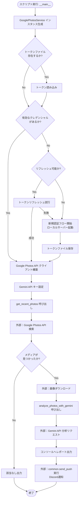
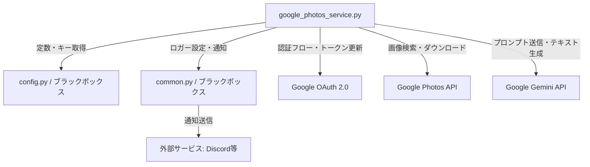

## 1. 解析メタ情報

| 項目 | 内容 |
| --- | --- |
| 対象ファイル | `google_photos_service.py` |
| 言語 | Python |
| 解析対象 | 提供されたコードのみ |
| 推測・補完 | 一切なし |

## 2. ファイルの概要

このファイルは、Google Photos APIとGoogle Gemini APIを連携させ、直近の写真を自動で取得し、その内容をAIに分析・要約させて「家族の思い出記録」としてのレポートを生成する機能を提供する。また、テスト実行時には生成されたレポートを外部サービス（Discordなど）にプッシュ通知する機能を持つ。

## 3. 外部依存関係

### インポート一覧

| 名称 | 種類 | 用途 | 根拠 |
| --- | --- | --- | --- |
| `os.path` | 標準ライブラリ | トークンファイルの存在確認や削除を行うため | 根拠: `import os.path` (行番号取得不可 / 抜粋: "import os.path") |
| `pickle` | 標準ライブラリ | 未使用（コード内に利用箇所なし） | 根拠: `import pickle` (行番号取得不可 / 抜粋: "import pickle") |
| `requests` | 外部ライブラリ | 画像データをURLからダウンロードするため | 根拠: `requests.get` (行番号取得不可 / 抜粋: "res = requests.get(download...") |
| `logging` | 標準ライブラリ | 未使用（ロガーは`common`モジュールから取得しているため） | 根拠: `import logging` (行番号取得不可 / 抜粋: "import logging") |
| `datetime` / `timedelta` | 標準ライブラリ | 日付フィルタ用の日時（過去◯日）を算出するため | 根拠: `today - timedelta(days=days)` (行番号取得不可 / 抜粋: "start_date = today - timedelta") |
| `Request` | 外部ライブラリ | OAuthトークンのリフレッシュ処理を行うため | 根拠: `self.creds.refresh(Request())` (行番号取得不可 / 抜粋: "self.creds.refresh(Request())") |
| `Credentials` | 外部ライブラリ | トークンファイルからの認証情報読み込みのため | 根拠: `Credentials.from_authorized_user_...` (行番号取得不可 / 抜粋: "self.creds = Credentials.from_...") |
| `InstalledAppFlow` | 外部ライブラリ | ローカルサーバーを起動し新規OAuth認証フローを行うため | 根拠: `InstalledAppFlow.from_client_...` (行番号取得不可 / 抜粋: "flow = InstalledAppFlow.from_c...") |
| `build` | 外部ライブラリ | Google Photos APIのクライアントを構築するため | 根拠: `build('photoslibrary', 'v1', ...)` (行番号取得不可 / 抜粋: "self.service = build('photosli...") |
| `google.generativeai` | 外部ライブラリ | Gemini APIを利用して画像分析を行うため | 根拠: `genai.configure(...)` (行番号取得不可 / 抜粋: "genai.configure(api_key=config...") |
| `PIL.Image` | 外部ライブラリ | ダウンロードしたバイナリデータを画像オブジェクトに変換するため | 根拠: `Image.open(...)` (行番号取得不可 / 抜粋: "img = Image.open(BytesIO(res.c...") |
| `io.BytesIO` | 標準ライブラリ | HTTPレスポンスのバイナリをメモリストリームとして扱うため | 根拠: `BytesIO(res.content)` (行番号取得不可 / 抜粋: "img = Image.open(BytesIO(res.c...") |
| `config` | 内部モジュール | APIキー、トークンパス、スコープなどの各種設定値を取得するため | 根拠: `import config` (行番号取得不可 / 抜粋: "import config") |
| `common` | 内部モジュール | 共通のロガー設定およびプッシュ通知処理を呼び出すため | 根拠: `import common` (行番号取得不可 / 抜粋: "import common") |

### ブラックボックスとなる外部要素

| 名称 | 理由 | 根拠 |
| --- | --- | --- |
| `config` モジュール | 各定数（`GOOGLE_PHOTOS_TOKEN`, `GOOGLE_PHOTOS_SCOPES`, `GEMINI_API_KEY`等）の具体的な値や構造が本ファイルからは判断不可。 | 根拠: `config.GOOGLE_PHOTOS_TOKEN` (行番号取得不可 / 抜粋: "os.path.exists(config.GOOGLE_...") |
| `common` モジュール | `setup_logging`が返すロガーの仕様、および`send_push`が実行する外部通信の具体的手順が本ファイルからは判断不可。 | 根拠: `common.send_push(...)` (行番号取得不可 / 抜粋: "common.send_push(config.LINE_U...") |

## 4. 主要要素の定義（関数 / エンドポイント / コンポーネント）

### `GooglePhotosService`

* **役割**: Google Photos APIの認証・画像取得と、Gemini APIによる画像分析処理を統合して管理するクラス。
* 根拠: `class GooglePhotosService:` (行番号取得不可 / 抜粋: "class GooglePhotosService:")

### `__init__`

* **役割**: クラスのインスタンス初期化時に、資格情報とAPIクライアントの初期化処理（`_authenticate`, `_setup_gemini`）を自動的に実行する。
* 根拠: `def __init__(self):` (行番号取得不可 / 抜粋: "def **init**(self):")

* **引数/リクエスト**: なし
* 根拠: `def __init__(self):` (行番号取得不可 / 抜粋: "def **init**(self):")

* **戻り値/レスポンス**: なし
* 根拠: `def __init__(self):` (行番号取得不可 / 抜粋: "def **init**(self):")

* **副作用**: `_authenticate`、`_setup_gemini`の呼び出しによる状態変更や外部通信。
* 根拠: `self._authenticate()` (行番号取得不可 / 抜粋: "self._authenticate()")

* **エラーハンドリング**: なし（内部で呼び出すメソッドに依存）
* 根拠: `def __init__(self):` (行番号取得不可 / 抜粋: "def **init**(self):")

### `_authenticate`

* **役割**: 既存トークンの読み込み・リフレッシュ、またはブラウザを通じた新規OAuth認証（ローカルサーバー起動）を行い、Google Photos APIクライアント（`self.service`）を構築する。
* 根拠: `def _authenticate(self):` (行番号取得不可 / 抜粋: "def _authenticate(self):")

* **引数/リクエスト**: なし
* 根拠: `def _authenticate(self):` (行番号取得不可 / 抜粋: "def _authenticate(self):")

* **戻り値/レスポンス**: なし
* 根拠: `def _authenticate(self):` (行番号取得不可 / 抜粋: "def _authenticate(self):")

* **副作用**: ファイルシステム（トークンの削除・書き込み）、外部API通信（Google OAuthエンドポイント、Photos APIディスカバリ）。`self.creds` と `self.service` の書き換え。
* 根拠: `with open(config.GOOGLE_PHOTOS_TOKEN, 'w') as token:` (行番号取得不可 / 抜粋: "with open(config.GOOGLE_PHOTOS...")

* **エラーハンドリング**: 広範な `Exception` をキャッチし、ログにエラーを出力。エラー発生時は `self.service = None` とする。
* 根拠: `except Exception as e:` (行番号取得不可 / 抜粋: "except Exception as e:")

### `_setup_gemini`

* **役割**: `config` に設定されたAPIキーを用いて、`google.generativeai` ライブラリの初期設定を行う。
* 根拠: `def _setup_gemini(self):` (行番号取得不可 / 抜粋: "def _setup_gemini(self):")

* **引数/リクエスト**: なし
* 根拠: `def _setup_gemini(self):` (行番号取得不可 / 抜粋: "def _setup_gemini(self):")

* **戻り値/レスポンス**: なし
* 根拠: `def _setup_gemini(self):` (行番号取得不可 / 抜粋: "def _setup_gemini(self):")

* **副作用**: `genai`モジュールのグローバル設定（APIキー）を変更する。
* 根拠: `genai.configure(api_key=config.GEMINI_API_KEY)` (行番号取得不可 / 抜粋: "genai.configure(api_key=config...")

* **エラーハンドリング**: なし。APIキーがない場合は警告ログを出力するのみ。
* 根拠: `logger.warning("⚠️ GEMINI_API_KEYが設定されていません")` (行番号取得不可 / 抜粋: "logger.warning("⚠️ GEMINI_API_...")

### `get_recent_photos`

* **役割**: 指定された日数内の写真をGoogle Photosから検索し、画像以外のメディアをスキップしたうえで、画像データをバイナリとしてダウンロードする。
* 根拠: `def get_recent_photos(self, limit=5, days=1):` (行番号取得不可 / 抜粋: "def get_recent_photos(self, li...")

* **引数/リクエスト**:
* `limit`: int (デフォルト 5) - 検索する最大件数
* `days`: int (デフォルト 1) - 遡る日数
* 根拠: `def get_recent_photos(self, limit=5, days=1):` (行番号取得不可 / 抜粋: "def get_recent_photos(self, li...")

* **戻り値/レスポンス**: `list[dict]` - 写真のメタデータ（id, filename, timestamp）と画像オブジェクト（`image_obj`）を格納した辞書のリスト。
* 根拠: `return photos_data` (行番号取得不可 / 抜粋: "return photos_data")

* **副作用**: Google Photos APIへの検索リクエストおよび画像ダウンロード（HTTP GETリクエスト）。
* 根拠: `res = requests.get(download_url, ...)` (行番号取得不可 / 抜粋: "res = requests.get(download_ur...")

* **エラーハンドリング**: スコープ不足エラー（`insufficient authentication scopes`）を特別に検知し対処法をログ出力。それ以外の例外もキャッチし、空リスト `[]` を返す。
* 根拠: `except Exception as e:` (行番号取得不可 / 抜粋: "except Exception as e:")

### `analyze_photos_with_gemini`

* **役割**: 取得した画像オブジェクトとメタデータをプロンプトに組み込み、Geminiモデル（`gemini-1.5-flash`）に家族の思い出としてのレポート生成を依頼する。
* 根拠: `def analyze_photos_with_gemini(self, photos_data):` (行番号取得不可 / 抜粋: "def analyze_photos_with_gemini...")

* **引数/リクエスト**: `photos_data` (list) - `get_recent_photos` が返す形式の画像データリスト。
* 根拠: `def analyze_photos_with_gemini(self, photos_data):` (行番号取得不可 / 抜粋: "def analyze_photos_with_gemini...")

* **戻り値/レスポンス**: `str` - Geminiによって生成されたレポートテキスト、またはエラー時の固定メッセージ。
* 根拠: `return response.text` (行番号取得不可 / 抜粋: "return response.text")

* **副作用**: Gemini APIへのコンテンツ生成リクエスト。
* 根拠: `response = model.generate_content(prompt)` (行番号取得不可 / 抜粋: "response = model.generate_cont...")

* **エラーハンドリング**: `Exception`をキャッチし、ログにエラーを記録した上で「AIによる分析に失敗しました。」という文字列を返す。
* 根拠: `except Exception as e:` (行番号取得不可 / 抜粋: "except Exception as e:")

### `__main__` (テスト実行ブロック)

* **役割**: スクリプトが直接実行された際に、サービスをインスタンス化し、直近3日間の写真を最大5枚取得、Geminiで分析を行い、標準出力と外部通知（Discord）を行う。
* 根拠: `if __name__ == "__main__":` (行番号取得不可 / 抜粋: "if **name** == "**main**":")

* **引数/リクエスト**: なし
* 根拠: `if __name__ == "__main__":` (行番号取得不可 / 抜粋: "if **name** == "**main**":")

* **戻り値/レスポンス**: なし
* 根拠: `if __name__ == "__main__":` (行番号取得不可 / 抜粋: "if **name** == "**main**":")

* **副作用**: コンソールへの標準出力、`common.send_push` による外部サービス（Discord）へのメッセージ送信。
* 根拠: `common.send_push(...)` (行番号取得不可 / 抜粋: "common.send_push(config.LINE_U...")

* **エラーハンドリング**: なし（戻り値が空の場合の条件分岐のみ）。
* 根拠: `if photos:` (行番号取得不可 / 抜粋: "if photos:")

## 5. 処理フロー図

## 6. 依存関係図

## 7. 次のステップ（リバースエンジニアリングの提案）

| 優先度 | ファイル名(推測可) | 理由 | 根拠 |
| --- | --- | --- | --- |
| 高 | `config.py` | 認証情報、APIキー、各種パス、スコープ、LINE/Discord宛先IDなど、システムの根幹をなす定数定義が含まれており、本スクリプトの動作前提を完全に把握するために不可欠なため。 | 根拠: `config.GOOGLE_PHOTOS_TOKEN` 等の呼び出し (行番号取得不可 / 抜粋: "os.path.exists(config.GOOGLE_...") |
| 中 | `common.py` | 通知処理 `send_push` およびログ設定 `setup_logging` の詳細実装を確認することで、エラー監視手法や通知の到達性を特定できるため。 | 根拠: `common.send_push(...)` 等の呼び出し (行番号取得不可 / 抜粋: "common.send_push(config.LINE_U...") |

## 8. 保守上の注意点

* **広範な例外キャッチ**: `_authenticate` や `analyze_photos_with_gemini` 内で `except Exception as e:` が使われており、予期せぬエラーの握りつぶしや原因特定が困難になる可能性がある。
* **ファイルI/Oの安全性**: トークンファイルの削除 (`os.remove`) や上書き保存を行っているため、ファイルアクセス権限に問題がある環境では実行時エラーとなる可能性がある。
* **ブロッキング処理**: 新規認証時 `flow.run_local_server(..., open_browser=False)` でブラウザが自動で開かない設定になっており、コンソールに出力されたURLを手動で開かない限り処理が永続的にブロックされる。
* **メモリ使用量**: 画像を `BytesIO` 経由で `PIL.Image` オブジェクトとしてメモリ上に全て読み込んでからリスト化しているため、取得枚数（`limit`）や画像解像度（現状 `w1024-h1024`）が大きいとメモリを圧迫する可能性がある。
* **未使用のインポート**: `import pickle` と `import logging` が宣言されているが、コード内で一度も利用されていない。

## 9. 不明事項一覧

| 項目 | 理由 | 必要なファイル |
| --- | --- | --- |
| 定数値の実体 | トークンファイルのパス、OAuthのクライアントシークレットファイルパス、認証スコープ（`config.GOOGLE_PHOTOS_SCOPES`）、各種APIキーの実体が不明。 | `config.py` |
| プッシュ通知の仕様 | `common.send_push` の具体的なプロトコル、再試行処理の有無、エラーハンドリングの仕様が不明。 | `common.py` |
| ロガーの設定内容 | `common.setup_logging` で設定されるログの出力先（標準出力、ファイル、外部監視サービスなど）やフォーマットが不明。 | `common.py` |

## 10. 自己検証結果

* [x] 推測・外部ファイルの仕様を一切含んでいない
* [x] 全関数・全クラス・全コンポーネントを列挙した
* [x] 全てのインポート要素を列挙した
* [x] すべての仕様説明に「根拠（行番号・抜粋）」を明記した
* [x] 根拠漏れが0件である
* [x] Mermaid構文にエラーの原因となる記号（エスケープ漏れ）がない
* [x] 不明事項を漏れなく列挙した

完了