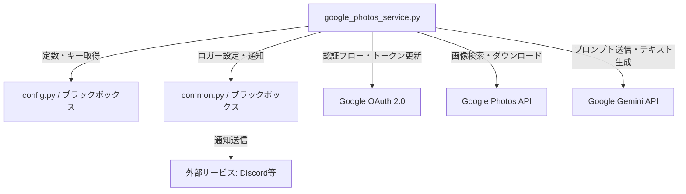

## 1. 解析メタ情報

| 項目 | 内容 |
| --- | --- |
| 対象ファイル | `google_photos_service.py` |
| 言語 | Python |
| 解析対象 | 提供されたコードのみ |
| 推測・補完 | 一切なし |

## 2. ファイルの概要

このファイルは、Google Photos APIとGoogle Gemini APIを連携させ、直近の写真を自動で取得し、その内容をAIに分析・要約させて「家族の思い出記録」としてのレポートを生成する機能を提供する。また、テスト実行時には生成されたレポートを外部サービス（Discordなど）にプッシュ通知する機能を持つ。

## 3. 外部依存関係

### インポート一覧

| 名称 | 種類 | 用途 | 根拠 |
| --- | --- | --- | --- |
| `os.path` | 標準ライブラリ | トークンファイルの存在確認や削除を行うため | 根拠: `import os.path` (行番号: 2 / 抜粋: "import os.path") |
| `requests` | 外部ライブラリ | 画像データをURLからダウンロードするため | 根拠: `import requests` (行番号: 3 / 抜粋: "import requests") |
| `logging` | 標準ライブラリ | 未使用（ロガーは`common`モジュールから取得しているため、`logging.`の直接呼び出しはコード内に存在しない） | 根拠: `import logging` (行番号: 4 / 抜粋: "import logging") |
| `datetime` / `timedelta` | 標準ライブラリ | 日付フィルタ用の日時（過去◯日）を算出するため | 根拠: `from datetime import datetime, timedelta` (行番号: 5 / 抜粋: "from datetime import datetime, timedelta") |
| `Request` | 外部ライブラリ | OAuthトークンのリフレッシュ処理を行うため | 根拠: `from google.auth.transport.requests import Request` (行番号: 6 / 抜粋: "from google.auth.transport.requests import Request") |
| `Credentials` | 外部ライブラリ | トークンファイルからの認証情報読み込みのため | 根拠: `from google.oauth2.credentials import Credentials` (行番号: 7 / 抜粋: "from google.oauth2.credentials import Credentials") |
| `InstalledAppFlow` | 外部ライブラリ | ローカルサーバーを起動し新規OAuth認証フローを行うため | 根拠: `from google_auth_oauthlib.flow import InstalledAppFlow` (行番号: 8 / 抜粋: "from google_auth_oauthlib.flow import InstalledAppFlow") |
| `build` | 外部ライブラリ | Google Photos APIのクライアントを構築するため | 根拠: `from googleapiclient.discovery import build` (行番号: 9 / 抜粋: "from googleapiclient.discovery import build") |
| `google.generativeai` (`genai`) | 外部ライブラリ | Gemini APIを利用して画像分析を行うため | 根拠: `import google.generativeai as genai` (行番号: 10 / 抜粋: "import google.generativeai as genai") |
| `PIL.Image` | 外部ライブラリ | ダウンロードしたバイナリデータを画像オブジェクトに変換するため | 根拠: `from PIL import Image` (行番号: 11 / 抜粋: "from PIL import Image") |
| `io.BytesIO` | 標準ライブラリ | HTTPレスポンスのバイナリをメモリストリームとして扱うため | 根拠: `from io import BytesIO` (行番号: 12 / 抜粋: "from io import BytesIO") |
| `config` | 内部モジュール | APIキー、トークンパス、スコープなどの各種設定値を取得するため | 根拠: `import config` (行番号: 14 / 抜粋: "import config") |
| `common` | 内部モジュール | 共通のロガー設定およびプッシュ通知処理を呼び出すため | 根拠: `import common` (行番号: 15 / 抜粋: "import common") |

### ブラックボックスとなる外部要素

| 名称 | 理由 | 根拠 |
| --- | --- | --- |
| `config` モジュール | 各定数（`GOOGLE_PHOTOS_TOKEN`, `GOOGLE_PHOTOS_SCOPES`, `GOOGLE_PHOTOS_CREDENTIALS`, `GEMINI_API_KEY`, `LINE_USER_ID`等）の具体的な値や構造が本ファイルからは判断不可。 | 根拠: `config.GOOGLE_PHOTOS_TOKEN` (行番号: 31 / 抜粋: "if os.path.exists(config.GOOGLE_PHOTOS_TOKEN):") |
| `common` モジュール | `setup_logging`が返すロガーの仕様、および`send_push`が実行する外部通信の具体的手順が本ファイルからは判断不可。 | 根拠: `common.send_push(...)` (行番号: 198 / 抜粋: "common.send_push(config.LINE_USER_ID, ...") |

## 4. 主要要素の定義（関数 / エンドポイント / コンポーネント）

### `logger`

* **役割**: `google_photos` という名前でセットアップされたロガーのインスタンスを保持する。
* 根拠: `logger = common.setup_logging("google_photos")` (行番号: 18 / 抜粋: "logger = common.setup_logging("google_photos")")

### `GooglePhotosService`

* **役割**: Google Photos APIの認証・画像取得と、Gemini APIによる画像分析処理を統合して管理するクラス。
* 根拠: `class GooglePhotosService:` (行番号: 20 / 抜粋: "class GooglePhotosService:")

### `GooglePhotosService.__init__`

* **役割**: クラスのインスタンス初期化時に、資格情報とAPIクライアントの初期化処理（`_authenticate`, `_setup_gemini`）を自動的に実行する。
* 根拠: `def __init__(self):` (行番号: 21-25 / 抜粋: "self._authenticate()")

* **引数/リクエスト**: なし
* 根拠: `def __init__(self):` (行番号: 21 / 抜粋: "def __init__(self):")

* **戻り値/レスポンス**: なし
* 根拠: `def __init__(self):` (行番号: 21-25 / 抜粋: "self._setup_gemini()")

* **副作用**: `self.creds`, `self.service` を `None` に初期化したうえで、`_authenticate`、`_setup_gemini`の呼び出しによる状態変更や外部通信。
* 根拠: `self._authenticate()` / `self._setup_gemini()` (行番号: 24-25 / 抜粋: "self._authenticate()")

* **エラーハンドリング**: なし（内部で呼び出すメソッドに依存）
* 根拠: `def __init__(self):` (行番号: 21-25 / 抜粋: "self.creds = None")

### `GooglePhotosService._authenticate`

* **役割**: 既存トークンの読み込み・リフレッシュ、またはブラウザを通じた新規OAuth認証（ローカルサーバー起動）を行い、Google Photos APIクライアント（`self.service`）を構築する。
* 根拠: `def _authenticate(self):` (行番号: 27-81 / 抜粋: "Google Photos APIの認証を行う")

* **引数/リクエスト**: なし
* 根拠: `def _authenticate(self):` (行番号: 27 / 抜粋: "def _authenticate(self):")

* **戻り値/レスポンス**: なし
* 根拠: `def _authenticate(self):` (行番号: 27-81 / 抜粋: "self.service = None")

* **副作用**: ファイルシステム（既存トークンファイルの削除・新規トークンの書き込み）、外部API通信（Google OAuthエンドポイント、Photos APIディスカバリ）。`self.creds` と `self.service` の書き換え。
* 根拠: `os.remove(config.GOOGLE_PHOTOS_TOKEN)` / `with open(config.GOOGLE_PHOTOS_TOKEN, 'w') as token:` (行番号: 52, 71 / 抜粋: "with open(config.GOOGLE_PHOTOS_TOKEN, 'w') as token:")

* **エラーハンドリング**: 広範な `Exception` をキャッチし、`logger.error`でエラー内容を出力。エラー発生時は `self.service = None` とする。
* 根拠: `except Exception as e:` (行番号: 78-81 / 抜粋: "except Exception as e:")

### `GooglePhotosService._setup_gemini`

* **役割**: `config` に設定されたAPIキーを用いて、`google.generativeai` ライブラリの初期設定を行う。
* 根拠: `def _setup_gemini(self):` (行番号: 83-88 / 抜粋: "Geminiのセットアップ")

* **引数/リクエスト**: なし
* 根拠: `def _setup_gemini(self):` (行番号: 83 / 抜粋: "def _setup_gemini(self):")

* **戻り値/レスポンス**: なし
* 根拠: `def _setup_gemini(self):` (行番号: 83-88 / 抜粋: "logger.warning(")

* **副作用**: `genai`モジュールのグローバル設定（APIキー）を変更する。
* 根拠: `genai.configure(api_key=config.GEMINI_API_KEY)` (行番号: 86 / 抜粋: "genai.configure(api_key=config.GEMINI_API_KEY)")

* **エラーハンドリング**: なし。APIキーが未設定の場合は警告ログを出力するのみで処理は継続する。
* 根拠: `else: logger.warning(...)` (行番号: 87-88 / 抜粋: "logger.warning("⚠️ GEMINI_API_KEYが設定されていません")")

### `GooglePhotosService.get_recent_photos`

* **役割**: 指定された日数内の写真をGoogle Photosから検索し、画像以外のメディアをスキップしたうえで、画像データをバイナリとしてダウンロードする。
* 根拠: `def get_recent_photos(self, limit=5, days=1):` (行番号: 90-152 / 抜粋: "直近の写真をバイナリデータとして取得する")

* **引数/リクエスト**:
* `limit`: int (デフォルト 5) - 検索する最大件数
* `days`: int (デフォルト 1) - 遡る日数
* 根拠: `def get_recent_photos(self, limit=5, days=1):` (行番号: 90 / 抜粋: "def get_recent_photos(self, limit=5, days=1):")

* **戻り値/レスポンス**: `list[dict]` - 写真のメタデータ（id, filename, timestamp）と画像オブジェクト（`image_obj`）を格納した辞書のリスト。未接続時・エラー時は空リスト `[]`。
* 根拠: `return photos_data` / `return []` (行番号: 94, 142, 152 / 抜粋: "return photos_data")

* **副作用**: Google Photos APIへの検索リクエストおよび画像ダウンロード（HTTP GETリクエスト）、ログ出力。
* 根拠: `res = requests.get(download_url, headers={"Authorization": f"Bearer {self.creds.token}"}, timeout=20)` (行番号: 129 / 抜粋: "res = requests.get(download_url,")

* **エラーハンドリング**: `self.service`が未接続の場合はエラーログを出して早期リターン。検索・ダウンロード処理は`try/except`で囲まれ、スコープ不足エラー（`insufficient authentication scopes`）を特別に検知して対処法をログ出力する。それ以外の例外もキャッチし、空リスト `[]` を返す。
* 根拠: `if not self.service:` / `except Exception as e:` (行番号: 92-94, 144-152 / 抜粋: "if "insufficient authentication scopes" in error_str:")

### `GooglePhotosService.analyze_photos_with_gemini`

* **役割**: 取得した画像オブジェクトとメタデータをプロンプトに組み込み、Geminiモデル（`gemini-1.5-flash`）に家族の思い出としてのレポート生成を依頼する。
* 根拠: `def analyze_photos_with_gemini(self, photos_data):` (行番号: 154-183 / 抜粋: "取得した写真をGeminiに投げて分析させる")

* **引数/リクエスト**: `photos_data` (list) - `get_recent_photos` が返す形式の画像データリスト。
* 根拠: `def analyze_photos_with_gemini(self, photos_data):` (行番号: 154 / 抜粋: "def analyze_photos_with_gemini(self, photos_data):")

* **戻り値/レスポンス**: `str` - Geminiによって生成されたレポートテキスト、写真がない/APIキー未設定時の案内文、またはエラー時の固定メッセージ。
* 根拠: `return response.text` / `return "分析対象の写真がないか、Geminiキーが未設定です。"` / `return "AIによる分析に失敗しました。"` (行番号: 157, 180, 183 / 抜粋: "return response.text")

* **副作用**: Gemini APIへのコンテンツ生成リクエスト、ログ出力。
* 根拠: `response = model.generate_content(prompt)` (行番号: 179 / 抜粋: "response = model.generate_content(prompt)")

* **エラーハンドリング**: 写真データが空、または`GEMINI_API_KEY`未設定の場合は早期リターン。生成処理は`Exception`をキャッチし、ログにエラーを記録した上で「AIによる分析に失敗しました。」という文字列を返す。
* 根拠: `if not photos_data or not config.GEMINI_API_KEY:` / `except Exception as e:` (行番号: 156-157, 181-183 / 抜粋: "except Exception as e:")

### `__main__` (テスト実行ブロック)

* **役割**: スクリプトが直接実行された際に、サービスをインスタンス化し、直近3日間の写真を最大5枚取得、Geminiで分析を行い、標準出力と外部通知（Discord）を行う。
* 根拠: `if __name__ == "__main__":` (行番号: 185-200 / 抜粋: "if __name__ == "__main__":")

* **引数/リクエスト**: なし
* 根拠: `if __name__ == "__main__":` (行番号: 185 / 抜粋: "if __name__ == "__main__":")

* **戻り値/レスポンス**: なし
* 根拠: `if __name__ == "__main__":` (行番号: 185-200 / 抜粋: "print("写真が見つかりませんでした。")")

* **副作用**: コンソールへの標準出力、`common.send_push` による外部サービス（Discord）へのメッセージ送信。
* 根拠: `common.send_push(config.LINE_USER_ID, [{"type": "text", "text": f"📸 **写真分析テスト**\n\n{report}"}], target="discord", channel="report")` (行番号: 198 / 抜粋: "common.send_push(config.LINE_USER_ID,")

* **エラーハンドリング**: なし（取得写真が空か否かの条件分岐（`if photos:` / `else:`）のみ）。
* 根拠: `if photos:` (行番号: 192 / 抜粋: "if photos:")

## 5. 処理フロー図

```mermaid
flowchart TD
    Start([スクリプト実行: __main__]) --> InitService[GooglePhotosService インスタンス生成]
    
    %% _authenticate フロー
    InitService --> AuthCheckToken{トークンファイル<br>存在するか?}
    AuthCheckToken -- Yes --> AuthLoadToken[トークン読み込み]
    AuthCheckToken -- No --> AuthCheckValid
    AuthLoadToken --> AuthCheckValid{有効なクレデンシャル<br>があるか?}
    
    AuthCheckValid -- Yes --> BuildAPIClient[Google Photos API クライアント構築]
    AuthCheckValid -- No --> AuthCheckRefresh{リフレッシュ可能か?}
    
    AuthCheckRefresh -- Yes --> DoRefresh[トークンリフレッシュ試行]
    DoRefresh -- 失敗 --> DoLocalServer
    DoRefresh -- 成功 --> BuildAPIClient
    AuthCheckRefresh -- No --> DoLocalServer[新規認証フロー開始<br>ローカルサーバー起動]
    
    DoLocalServer --> SaveToken[トークンファイル保存]
    SaveToken --> BuildAPIClient
    
    BuildAPIClient --> SetupGemini[Gemini API キー設定]
    SetupGemini --> CallGetPhotos[get_recent_photos 呼び出し]
    
    %% get_recent_photos フロー
    CallGetPhotos --> ServiceCheck{self.serviceは<br>接続済みか?}
    ServiceCheck -- No --> ReturnEmpty[空リストを返す]
    ServiceCheck -- Yes --> APIPhotos[外部：Google Photos API 検索]
    APIPhotos --> HasPhotosCheck{画像メディアが<br>見つかったか?}
    
    HasPhotosCheck -- Yes --> DLImages[外部：画像ダウンロード]
    DLImages --> CallAnalyze[analyze_photos_with_gemini 呼び出し]
    HasPhotosCheck -- No --> PrintNoPhotos[該当なし出力]
    ReturnEmpty --> PrintNoPhotos
    PrintNoPhotos --> End([終了])
    
    %% analyze_photos_with_gemini フロー
    CallAnalyze --> APIGemini[外部：Gemini API 分析リクエスト]
    APIGemini --> PrintReport[コンソールへレポート出力]
    PrintReport --> PushReport[外部：common.send_push実行<br>Discord通知]
    PushReport --> End

```

## 6. 依存関係図

```mermaid
graph TD
    %% Files and Modules
    Main[google_photos_service.py]
    Config[config.py / ブラックボックス]
    Common[common.py / ブラックボックス]
    
    %% External Services
    GoogleAuth[Google OAuth 2.0]
    GooglePhotosAPI[Google Photos API]
    GeminiAPI[Google Gemini API]
    Discord[外部サービス: Discord等]
    
    %% Relationships
    Main -->|定数・キー取得| Config
    Main -->|ロガー設定・通知| Common
    Common -->|通知送信| Discord
    
    Main -->|認証フロー・トークン更新| GoogleAuth
    Main -->|画像検索・ダウンロード| GooglePhotosAPI
    Main -->|プロンプト送信・テキスト生成| GeminiAPI

```

## 7. 次のステップ（リバースエンジニアリングの提案）

| 優先度 | ファイル名(推測可) | 理由 | 根拠 |
| --- | --- | --- | --- |
| 高 | `config.py` | 認証情報、APIキー、各種パス、スコープ、LINE/Discord宛先IDなど、システムの根幹をなす定数定義が含まれており、本スクリプトの動作前提を完全に把握するために不可欠なため。 | 根拠: `config.GOOGLE_PHOTOS_TOKEN` 等の呼び出し (行番号: 31, 33, 55-56, 85-86 / 抜粋: "if os.path.exists(config.GOOGLE_PHOTOS_TOKEN):") |
| 中 | `common.py` | 通知処理 `send_push` およびログ設定 `setup_logging` の詳細実装を確認することで、エラー監視手法や通知の到達性を特定できるため。 | 根拠: `common.send_push(...)` 等の呼び出し (行番号: 18, 198 / 抜粋: "common.send_push(config.LINE_USER_ID,") |

## 8. 保守上の注意点

* **広範な例外キャッチ**: `_authenticate` や `get_recent_photos`、`analyze_photos_with_gemini` 内で `except Exception as e:` が使われており、予期せぬエラーの握りつぶしや原因特定が困難になる可能性がある。（行番号: 78, 144, 181）
* **ファイルI/Oの安全性**: トークンファイルの削除 (`os.remove`, 行番号: 52) や上書き保存 (`open(..., 'w')`, 行番号: 71) を行っているため、ファイルアクセス権限に問題がある環境では実行時エラーとなる可能性がある。
* **ブロッキング処理**: 新規認証時 `flow.run_local_server(..., open_browser=False)`（行番号: 62-67）でブラウザが自動で開かない設定になっており、コンソールに出力されたURLを手動で開かない限り処理が永続的にブロックされる。
* **メモリ使用量**: 画像を `BytesIO` 経由で `PIL.Image` オブジェクトとしてメモリ上に全て読み込んでからリスト化している（行番号: 132-138）ため、取得枚数（`limit`）や画像解像度（現状 `w1024-h1024`、行番号: 128）が大きいとメモリを圧迫する可能性がある。
* **未使用のインポート**: `import logging`（行番号: 4）が宣言されているが、コード内で`logging.`を直接呼び出す箇所はなく、ロガーは`common.setup_logging`経由でのみ使用されている。

## 9. 不明事項一覧

| 項目 | 理由 | 必要なファイル |
| --- | --- | --- |
| 定数値の実体 | トークンファイルのパス、OAuthのクライアントシークレットファイルパス、認証スコープ（`config.GOOGLE_PHOTOS_SCOPES`）、各種APIキーの実体が不明。 | `config.py` |
| プッシュ通知の仕様 | `common.send_push` の具体的なプロトコル、再試行処理の有無、エラーハンドリングの仕様が不明。 | `common.py` |
| ロガーの設定内容 | `common.setup_logging` で設定されるログの出力先（標準出力、ファイル、外部監視サービスなど）やフォーマットが不明。 | `common.py` |

## 10. 自己検証結果

* [x] 推測・外部ファイルの仕様を一切含んでいない
* [x] 全関数・全クラス・全コンポーネントを列挙した
* [x] 全てのインポート要素を列挙した
* [x] すべての仕様説明に「根拠（行番号・抜粋）」を明記した
* [x] 根拠漏れが0件である
* [x] Mermaid構文にエラーの原因となる記号（エスケープ漏れ）がない
* [x] 不明事項を漏れなく列挙した

完了
