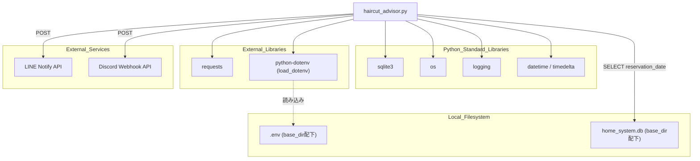

## 1. 解析メタ情報

| 項目 | 内容 |
| --- | --- |
| 対象ファイル | haircut_advisor.py |
| 言語 | Python |
| 解析対象 | 提供されたコードのみ |
| 推測・補完 | 一切なし |

## 関連ドキュメント

* 本ファイルはローカルの`.env`(`os.path.dirname(os.path.abspath(__file__))`配下)と`sqlite3`で直接DB(`home_system.db`)の`haircut_history`テーブルを読み取る自己完結型スクリプトであり、`config`モジュールや`core/logger.py`など他のプロジェクト内モジュールは一切インポートしていない(根拠: 行番号1〜6のインポート文、行番号27・31・42のパス組み立て)。そのため、他の仕様書との明確な依存関係(import関係)は確認できない。
* 参考: `haircut_history`テーブルへの書き込み処理を持つ旧実装が`old/haircut_monitor.py`として存在するが、本ファイルからは参照されておらず、当ドキュメントの解析範囲外である。

## 2. ファイルの概要

散髪(ヘアカット)の予約履歴をSQLiteデータベースから読み込み、過去の間隔から次回の散髪推奨日を計算し、通知時期になるとLINEおよびDiscordへ提案メッセージを送信するスタンドアロンのPythonスクリプト。モジュールインポート直後に`logging.basicConfig`で標準ロガーを構築する(根拠: `[logging.basicConfig]` (行番号: 9〜14 / 抜粋: "logging.basicConfig(\n    level=logging.INFO,"))。中心となる`HaircutAdvisor`クラスは、初期化時に自身のスクリプトファイルが置かれたディレクトリ配下の`.env`を読み込み、`LINE_ACCESS_TOKEN`と`DISCORD_WEBHOOK_NOTIFY`を環境変数から取得する(根拠: `[_load_environment]` (行番号: 30〜38 / 抜粋: "dotenv_path = os.path.join(self.base_dir, '.env')\n        load_dotenv(dotenv_path)"))。`calculate_next_date`は`haircut_history`テーブルの`reservation_date`を古い順に取得し、履歴が2件以上あれば連続する予約日の間隔の平均日数を、1件以下であればデフォルト周期(50日)を使って次回推奨日を算出する(根拠: `[calculate_next_date]` (行番号: 67〜92 / 抜粋: "avg_interval = sum(intervals) / len(intervals)"))。`suggest`は算出結果と現在日時から残り日数を求め、残り日数が`NOTIFY_DAYS_BEFORE`(7日)以下、または`force_notify=True`の場合にLINEとDiscordへ通知する(根拠: `[suggest]` (行番号: 94〜114 / 抜粋: "if days_until <= self.NOTIFY_DAYS_BEFORE or force_notify:"))。スクリプトとして直接実行された場合は`force_notify=True`で`suggest`を呼び出す(根拠: `[__main__]` (行番号: 172〜175 / 抜粋: "advisor.suggest(force_notify=True)"))。

## 3. 外部依存関係

### インポート一覧

| 名称 | 種類 | 用途 | 根拠 |
| --- | --- | --- | --- |
| `sqlite3` | 標準ライブラリ | `home_system.db`への接続、`haircut_history`テーブルからの予約履歴取得 | 根拠: `[import sqlite3]` (行番号: 1 / 抜粋: "import sqlite3") |
| `os` | 標準ライブラリ | スクリプト自身のディレクトリパス解決、`.env`/DBファイルのパス組み立て | 根拠: `[import os]` (行番号: 2 / 抜粋: "import os") |
| `logging` | 標準ライブラリ | ログ出力の設定・ロガー生成 | 根拠: `[import logging]` (行番号: 3 / 抜粋: "import logging") |
| `requests` | 外部ライブラリ | LINE Notify APIおよびDiscord WebhookへのHTTP POST送信 | 根拠: `[import requests]` (行番号: 4 / 抜粋: "import requests") |
| `datetime`, `timedelta` | 標準ライブラリ(`datetime`モジュール) | 予約日時のパース、日数計算、次回推奨日の算出 | 根拠: `[from datetime import datetime, timedelta]` (行番号: 5 / 抜粋: "from datetime import datetime, timedelta") |
| `load_dotenv` | 外部ライブラリ(`python-dotenv`) | `.env`ファイルから環境変数(`LINE_ACCESS_TOKEN`等)を読み込む | 根拠: `[from dotenv import load_dotenv]` (行番号: 6 / 抜粋: "from dotenv import load_dotenv") |

### ブラックボックスとなる外部要素

| 名称 | 理由 | 根拠 |
| --- | --- | --- |
| `home_system.db`の`haircut_history`テーブルのスキーマ・データ生成元 | 本ファイルは`reservation_date`列を`SELECT`するのみで、テーブル定義やレコードを誰がどう挿入しているかは提供されていないため。 | 根拠: `[SELECT文]` (行番号: 50 / 抜粋: "cursor.execute(\"SELECT reservation_date FROM haircut_history ORDER BY reservation_date ASC\")") |
| `.env`ファイルの内容(`LINE_ACCESS_TOKEN`、`DISCORD_WEBHOOK_NOTIFY`の実値) | `.env`ファイル自体は提供されておらず、実際のトークン・Webhook URLの値は不明であるため。 | 根拠: `[_load_environment]` (行番号: 33, 35 / 抜粋: "self.discord_webhook = os.getenv(\"DISCORD_WEBHOOK_NOTIFY\")") |

## 4. 主要要素の定義（関数 / エンドポイント / コンポーネント）

### `HaircutAdvisor`

* **役割**: 散髪履歴の分析、次回推奨日の計算、および通知送信を一手に担うクラス。クラス変数として`DB_NAME`("home_system.db")、`DEFAULT_INTERVAL_DAYS`(50)、`NOTIFY_DAYS_BEFORE`(7)、`REQUEST_TIMEOUT`(10)を定義する。
* 根拠: `[HaircutAdvisorクラス定義]` (行番号: 16〜24 / 抜粋: "class HaircutAdvisor:\n    \"\"\"\n    過去の散髪履歴を分析し、次回の散髪時期を提案するクラス\n    \"\"\"")


### `HaircutAdvisor.__init__`

* **役割**: 自身のスクリプトファイルが存在するディレクトリを`base_dir`として記録し、環境変数の読み込みを行う。
* 根拠: `[__init__]` (行番号: 26〜28 / 抜粋: "self.base_dir = os.path.dirname(os.path.abspath(__file__))\n        self._load_environment()")


* **引数/リクエスト**: なし(`self`のみ)
* 根拠: `[__init__シグネチャ]` (行番号: 26 / 抜粋: "def __init__(self):")


* **戻り値/レスポンス**: なし
* 根拠: `[__init__本体]` (行番号: 26〜28 / 抜粋: "def __init__(self):")


* **副作用**: `self.base_dir`・`self.line_token`・`self.discord_webhook`のインスタンス属性設定(`_load_environment`経由)。
* 根拠: `[__init__本体]` (行番号: 27〜28 / 抜粋: "self._load_environment()")


* **エラーハンドリング**: なし
* 根拠: `[__init__本体]` (行番号: 26〜28 / 抜粋: "def __init__(self):")


### `HaircutAdvisor._load_environment`

* **役割**: `base_dir`配下の`.env`ファイルを読み込み、`LINE_ACCESS_TOKEN`と`DISCORD_WEBHOOK_NOTIFY`を環境変数から取得してインスタンス属性に設定する。Webhook URLが未設定の場合は警告ログを出す。
* 根拠: `[_load_environment]` (行番号: 30〜38 / 抜粋: "dotenv_path = os.path.join(self.base_dir, '.env')\n        load_dotenv(dotenv_path)")


* **引数/リクエスト**: なし(`self`のみ)
* 根拠: `[_load_environmentシグネチャ]` (行番号: 30 / 抜粋: "def _load_environment(self):")


* **戻り値/レスポンス**: なし
* 根拠: `[_load_environment本体]` (行番号: 30〜38 / 抜粋: "def _load_environment(self):")


* **副作用**: `load_dotenv`によるプロセス環境変数への読み込み、`self.line_token`・`self.discord_webhook`属性の設定、条件付きで警告ログ出力。
* 根拠: `[_load_environment本体]` (行番号: 32〜38 / 抜粋: "if not self.discord_webhook:\n            logger.warning(\"⚠️ Discord Webhook URLが設定されていません。通知は届きません。\")")


* **エラーハンドリング**: なし(例外捕捉なし。`.env`が存在しない場合`load_dotenv`は静かに失敗し値が`None`になる想定)。
* 根拠: `[_load_environment本体]` (行番号: 30〜38 / 抜粋: "def _load_environment(self):")


### `HaircutAdvisor._get_history`

* **役割**: `base_dir`配下の`home_system.db`に接続し、`haircut_history`テーブルの`reservation_date`を昇順で取得、パース可能なものだけを`datetime`オブジェクトのリストとして返す。
* 根拠: `[_get_history]` (行番号: 40〜65 / 抜粋: "cursor.execute(\"SELECT reservation_date FROM haircut_history ORDER BY reservation_date ASC\")")


* **引数/リクエスト**: なし(`self`のみ)
* 根拠: `[_get_historyシグネチャ]` (行番号: 40 / 抜粋: "def _get_history(self):")


* **戻り値/レスポンス**: `list`(`datetime`オブジェクトのリスト)。DBファイルが存在しない場合、または例外発生時は空リスト`[]`を返す。
* 根拠: `[戻り値]` (行番号: 43〜45, 61, 65 / 抜粋: "return []")


* **副作用**: `sqlite3.connect`によるDB接続の確立とクローズ(`conn.close()`)。パース失敗行に関するログ出力はない(`except ValueError: continue`で無視)。
* 根拠: `[DB接続処理]` (行番号: 48〜52, 56〜60 / 抜粋: "conn = sqlite3.connect(db_path)")


* **エラーハンドリング**: DBファイル未存在時は`logger.error`を出して空リストを返す。`SELECT`や接続処理で例外が発生した場合は`logger.error`でログ出力し、`self._send_discord_error`でDiscordへエラー通知したうえで空リストを返す。個々の日付文字列のパース失敗(`ValueError`)はその行のみスキップする。
* 根拠: `[例外処理]` (行番号: 43〜45, 56〜60, 62〜65 / 抜粋: "except Exception as e:\n            logger.error(f\"❌ DB読み込みエラー: {e}\")\n            self._send_discord_error(f\"DB読み込みエラー: {e}\")")


### `HaircutAdvisor.calculate_next_date`

* **役割**: `_get_history`で取得した履歴から次回推奨日を計算する。履歴が2件以上あれば連続する予約間隔(日数)の平均を、1件以下ならデフォルト周期(`DEFAULT_INTERVAL_DAYS`)を最終予約日に加算して次回日を求める。
* 根拠: `[calculate_next_date]` (行番号: 67〜92 / 抜粋: "def calculate_next_date(self):\n        \"\"\"次回の推奨日を計算する\"\"\"")


* **引数/リクエスト**: なし(`self`のみ)
* 根拠: `[calculate_next_dateシグネチャ]` (行番号: 67 / 抜粋: "def calculate_next_date(self):")


* **戻り値/レスポンス**: `(next_date, interval)`のタプル。`next_date`は`datetime`、`interval`は`int`(平均間隔日数またはデフォルト日数)。履歴が空の場合は`(None, None)`。
* 根拠: `[戻り値]` (行番号: 71〜73, 87〜88, 91〜92 / 抜粋: "return next_date, int(avg_interval)")


* **副作用**: `logger.warning`・`logger.info`によるログ出力。
* 根拠: `[ログ出力]` (行番号: 72, 85, 90 / 抜粋: "logger.info(f\"📊 過去{len(history)}回のデータから平均サイクルを算出: {avg_interval:.1f}日\")")


* **エラーハンドリング**: 明示的な例外捕捉はなし。履歴が空の場合は警告ログのみで`(None, None)`を返して早期終了する。
* 根拠: `[空履歴時の早期return]` (行番号: 71〜73 / 抜粋: "if not history:\n            logger.warning(\"📭 データがないため分析できません。\")\n            return None, None")


### `HaircutAdvisor.suggest`

* **役割**: 分析処理全体のエントリーポイント。次回推奨日と現在日時から残り日数を算出し、通知タイミング(`NOTIFY_DAYS_BEFORE`日以内、または強制指定時)であれば`_send_suggestion`を呼び出す。
* 根拠: `[suggest]` (行番号: 94〜114 / 抜粋: "def suggest(self, force_notify=False):\n        \"\"\"分析と提案の実行\"\"\"")


* **引数/リクエスト**: `force_notify` (型: 明示なし、デフォルト`False`。`True`の場合、残り日数によらず強制的に通知する)
* 根拠: `[suggestシグネチャ]` (行番号: 94 / 抜粋: "def suggest(self, force_notify=False):")


* **戻り値/レスポンス**: なし(`next_date`が取得できない場合は早期`return`)
* 根拠: `[早期return]` (行番号: 100〜101 / 抜粋: "if not next_date:\n            return")


* **副作用**: `calculate_next_date`・`_get_history`(ログ表示用に再度呼び出し)・`_send_suggestion`の呼び出し、複数のログ出力。
* 根拠: `[副作用のある呼び出し]` (行番号: 98, 108, 112 / 抜粋: "logger.info(f\"📅 最新カット: {self._get_history()[-1].strftime('%Y/%m/%d')}\")")


* **エラーハンドリング**: 明示的な例外捕捉なし。`next_date`が`None`の場合のみ早期リターンでスキップする。
* 根拠: `[suggest本体]` (行番号: 94〜114 / 抜粋: "def suggest(self, force_notify=False):")


### `HaircutAdvisor._send_suggestion`

* **役割**: 残り日数に応じたメッセージ文言(通知が近い/当日/経過済み)を組み立て、`_send_line`と`_send_discord`の両方を呼び出して通知する。
* 根拠: `[_send_suggestion]` (行番号: 116〜135 / 抜粋: "def _send_suggestion(self, next_date_str, interval, days_until):")


* **引数/リクエスト**: `next_date_str` (`str`、表示用の次回推奨日文字列)、`interval` (`int`、平均/デフォルト間隔日数)、`days_until` (`int`、次回推奨日までの残り日数)
* 根拠: `[_send_suggestionシグネチャ]` (行番号: 116 / 抜粋: "def _send_suggestion(self, next_date_str, interval, days_until):")


* **戻り値/レスポンス**: なし
* 根拠: `[_send_suggestion本体]` (行番号: 116〜135 / 抜粋: "def _send_suggestion(self, next_date_str, interval, days_until):")


* **副作用**: `self._send_line(message)`・`self._send_discord(message)`の呼び出し(＝外部通知API呼び出し)。
* 根拠: `[通知呼び出し]` (行番号: 134〜135 / 抜粋: "self._send_line(message)\n        self._send_discord(message)")


* **エラーハンドリング**: なし(呼び出し先の`_send_line`/`_send_discord`内で個別に例外処理)
* 根拠: `[_send_suggestion本体]` (行番号: 116〜135 / 抜粋: "def _send_suggestion(self, next_date_str, interval, days_until):")


### `HaircutAdvisor._send_line`

* **役割**: LINE Notify APIへメッセージをPOST送信する。
* 根拠: `[_send_line]` (行番号: 137〜148 / 抜粋: "requests.post(\n                \"https://notify-api.line.me/api/notify\",")


* **引数/リクエスト**: `message` (`str`、送信するメッセージ本文)
* 根拠: `[_send_lineシグネチャ]` (行番号: 137 / 抜粋: "def _send_line(self, message):")


* **戻り値/レスポンス**: なし。`self.line_token`が未設定の場合は早期`return`。
* 根拠: `[早期return]` (行番号: 138 / 抜粋: "if not self.line_token: return")


* **副作用**: `requests.post`によるLINE Notify APIへの外部HTTP通信(タイムアウト`self.REQUEST_TIMEOUT`秒)。
* 根拠: `[requests.post]` (行番号: 140〜145 / 抜粋: "requests.post(\n                \"https://notify-api.line.me/api/notify\",\n                headers={\"Authorization\": f\"Bearer {self.line_token}\"},")


* **エラーハンドリング**: `Exception`を捕捉して`logger.error`でログ出力するのみ(呼び出し元へは伝播させない)。
* 根拠: `[except Exception]` (行番号: 147〜148 / 抜粋: "except Exception as e:\n            logger.error(f\"❌ LINE送信エラー: {e}\")")


### `HaircutAdvisor._send_discord`

* **役割**: Discord WebhookへメッセージをタイトルなしのcontentとしてPOST送信する。
* 根拠: `[_send_discord]` (行番号: 150〜160 / 抜粋: "def _send_discord(self, message):")


* **引数/リクエスト**: `message` (`str`、送信するメッセージ本文)
* 根拠: `[_send_discordシグネチャ]` (行番号: 150 / 抜粋: "def _send_discord(self, message):")


* **戻り値/レスポンス**: なし。`self.discord_webhook`が未設定の場合は早期`return`。
* 根拠: `[早期return]` (行番号: 151 / 抜粋: "if not self.discord_webhook: return")


* **副作用**: `requests.post`によるDiscord Webhookへの外部HTTP通信(タイムアウト`self.REQUEST_TIMEOUT`秒)。
* 根拠: `[requests.post]` (行番号: 153〜157 / 抜粋: "requests.post(\n                self.discord_webhook, \n                json={\"content\": message},")


* **エラーハンドリング**: `Exception`を捕捉して`logger.error`でログ出力するのみ。
* 根拠: `[except Exception]` (行番号: 159〜160 / 抜粋: "except Exception as e:\n            logger.error(f\"❌ Discord送信エラー: {e}\")")


### `HaircutAdvisor._send_discord_error`

* **役割**: システム内部のエラー内容を、コードブロック形式でDiscord Webhookへ通知する。
* 根拠: `[_send_discord_error]` (行番号: 162〜170 / 抜粋: "def _send_discord_error(self, error_message: str):")


* **引数/リクエスト**: `error_message` (`str`、通知するエラーメッセージ)
* 根拠: `[_send_discord_errorシグネチャ]` (行番号: 162 / 抜粋: "def _send_discord_error(self, error_message: str):")


* **戻り値/レスポンス**: なし。`self.discord_webhook`が未設定の場合は早期`return`。
* 根拠: `[早期return]` (行番号: 163 / 抜粋: "if not self.discord_webhook: return")


* **副作用**: `requests.post`によるDiscord Webhookへの外部HTTP通信。
* 根拠: `[requests.post]` (行番号: 165〜169 / 抜粋: "requests.post(\n                self.discord_webhook, \n                json={\"content\": f\"🚨 **エラー発生(Advisor)** 🚨\\n```\\n{error_message}\\n```\"},")


* **エラーハンドリング**: `Exception`を捕捉し、ログ出力もせず`pass`で完全に握りつぶす。
* 根拠: `[except Exception: pass]` (行番号: 170 / 抜粋: "except Exception: pass")


## 5. 処理フロー図

```mermaid
flowchart TD
    subgraph Main["__main__ (スクリプト直接実行時)"]
        M1["開始"] --> M2["HaircutAdvisor() 生成"]
        M2 --> M3["advisor.suggest(force_notify=True) 呼び出し"]
    end

    subgraph InitFlow["__init__ / _load_environment"]
        I1["base_dir を自ファイルのディレクトリに設定"] --> I2["外部: .env を load_dotenv で読み込み"]
        I2 --> I3["LINE_ACCESS_TOKEN / DISCORD_WEBHOOK_NOTIFY を環境変数から取得"]
        I3 --> I4{"DISCORD_WEBHOOK_NOTIFYが未設定か"}
        I4 -- Yes --> I5["ログ: WARNING"]
        I4 -- No --> I6["初期化完了"]
        I5 --> I6
    end

    subgraph SuggestFlow["suggest() 処理フロー"]
        S1["開始"] --> S2["calculate_next_date() 呼び出し"]
        S2 --> S3["_get_history(): 外部 DB接続しhaircut_historyを取得"]
        S3 --> S4{"履歴が空か"}
        S4 -- Yes --> S5["ログ: WARNING / (None, None) を返却"]
        S4 -- No --> S6{"履歴が2件以上か"}
        S6 -- Yes --> S7["連続する間隔の平均日数を算出"]
        S6 -- No --> S8["デフォルト周期(50日)を使用"]
        S7 --> S9["next_date = 最終予約日 + 平均間隔"]
        S8 --> S10["next_date = 最終予約日 + デフォルト日数"]
        S9 --> S11["next_date, interval を返却"]
        S10 --> S11
        S5 --> S12{"next_dateがNoneか"}
        S11 --> S12
        S12 -- Yes --> S13["終了(通知なし)"]
        S12 -- No --> S14["残り日数(days_until) = next_date - 現在日時"]
        S14 --> S15{"days_until <= 7 または force_notify か"}
        S15 -- No --> S16["ログ: INFO まだ通知時期ではない"]
        S15 -- Yes --> S17["_send_suggestion() 呼び出し"]
        S17 --> S18["メッセージ文言を残り日数に応じて組み立て"]
        S18 --> S19["外部: _send_line() で LINE Notify API へPOST"]
        S19 --> S20["外部: _send_discord() で Discord WebhookへPOST"]
        S20 --> S21["終了"]
        S16 --> S21
        S13 --> S21
    end
```



## 6. 依存関係図



## 7. 次のステップ（リバースエンジニアリングの提案）

| 優先度 | ファイル名(推測可) | 理由 | 根拠 |
| --- | --- | --- | --- |
| 高 | `home_system.db`のスキーマ定義(`current_schema.sql`等) | `haircut_history`テーブルの列定義(`reservation_date`の型・制約等)を確認するため。 | 根拠: `[SELECT文]` (行番号: 50 / 抜粋: "SELECT reservation_date FROM haircut_history ORDER BY reservation_date ASC") |
| 中 | `old/haircut_monitor.py` | `haircut_history`テーブルへレコードを実際に挿入している旧実装(推測される関連処理)を確認し、データ生成経路を把握するため。 | 根拠: `[DB_NAME定数]` (行番号: 21 / 抜粋: "DB_NAME = \"home_system.db\"") |
| 中 | 本ファイルを定期実行するcrontab/systemd設定(ファイル名不明) | `__main__`ブロックが常に`force_notify=True`でテスト実行相当になっており、本来の定期実行時の呼び出し方法(引数・スケジュール)を確認するため。 | 根拠: `[__main__]` (行番号: 172〜175 / 抜粋: "# テスト実行: 強制通知モードON\n    advisor.suggest(force_notify=True)") |

## 8. 保守上の注意点

* **`__main__`が常に強制通知モード**: スクリプトを直接実行すると`force_notify=True`で`suggest`が呼ばれるため、コメントにある通り「テスト実行」用の状態のままであり、本来の定期実行(残り日数によるフィルタリング)を行う呼び出し経路が本ファイル内には存在しない。 根拠: `[__main__]` (行番号: 172〜175 / 抜粋: "# テスト実行: 強制通知モードON\n    advisor.suggest(force_notify=True)")
* **DBパスが`base_dir`(スクリプト自身のディレクトリ)基準**: `db_path = os.path.join(self.base_dir, self.DB_NAME)`であり、`self.base_dir`は本ファイル(`tools/haircut_advisor.py`)が置かれたディレクトリとなる。プロジェクトの中心的なDBパス解決(`config.SQLITE_DB_PATH`等、他ファイル同様の仕組み)を使用していないため、実行場所やディレクトリ構成によっては意図したDBファイルと異なる場所を参照する可能性がある。 根拠: `[base_dir, db_path]` (行番号: 27, 42 / 抜粋: "self.base_dir = os.path.dirname(os.path.abspath(__file__))" / "db_path = os.path.join(self.base_dir, self.DB_NAME)")
* **エラー通知の握りつぶし**: `_send_discord_error`内の`requests.post`は`except Exception: pass`で全例外を無視しており、エラー通知自体が失敗してもログにすら残らない。 根拠: `[except Exception: pass]` (行番号: 170 / 抜粋: "except Exception: pass")
* **`_get_history`の重複呼び出し**: `suggest`内でログ表示のためだけに`self._get_history()`を再度呼び出しており(`calculate_next_date`内で既に1回呼ばれている)、DBへの問い合わせが1回の`suggest`実行で最低2回発生する。 根拠: `[重複呼び出し]` (行番号: 98, 108 / 抜粋: "next_date, interval = self.calculate_next_date()" / "logger.info(f\"📅 最新カット: {self._get_history()[-1].strftime('%Y/%m/%d')}\")")
* **平均間隔が小数のまま日数計算に使用**: `avg_interval`は`float`のまま`timedelta(days=avg_interval)`に渡され、`interval`表示用には`int(avg_interval)`で切り捨てられるため、実際の`next_date`計算とログ・通知文言に表示される`interval`(整数)との間に微小なズレが生じ得る。 根拠: `[avg_interval計算]` (行番号: 84, 87〜88 / 抜粋: "avg_interval = sum(intervals) / len(intervals)" / "next_date = last_date + timedelta(days=avg_interval)\n            return next_date, int(avg_interval)")

## 9. 不明事項一覧

| 項目 | 理由 | 必要なファイル |
| --- | --- | --- |
| `haircut_history`テーブルのスキーマおよびデータ挿入元 | 本ファイルは`SELECT`のみを行い、テーブル定義やレコード挿入処理は含まれていないため。 | DBスキーマ定義ファイル(`current_schema.sql`等)、および`haircut_history`へINSERTする実装 |
| `.env`ファイルに実際に設定される値(`LINE_ACCESS_TOKEN`、`DISCORD_WEBHOOK_NOTIFY`) | `.env`の中身自体は本ファイルの解析範囲外であるため。 | `tools/.env`(実運用ファイル、非公開) |
| 本スクリプトの実際の定期実行方法・スケジュール | `__main__`ブロックが常時`force_notify=True`のテスト実行相当であり、本番運用時の呼び出しコマンドや引数は本ファイルからは判断できないため。 | crontab設定またはタスクスケジューラ関連ファイル(ファイル名不明) |

## 10. 自己検証結果

* [x] 推測・外部ファイルの仕様を一切含んでいない（完了）
* [x] 全関数・全クラス・全コンポーネントを列挙した（完了）
* [x] 全てのインポート要素を列挙した（完了）
* [x] すべての仕様説明に「根拠（行番号・抜粋）」を明記した（完了）
* [x] 根拠漏れが0件である（完了）
* [x] Mermaid構文にエラーの原因となる記号（エスケープ漏れ）がない（完了）
* [x] 不明事項を漏れなく列挙した（完了）
