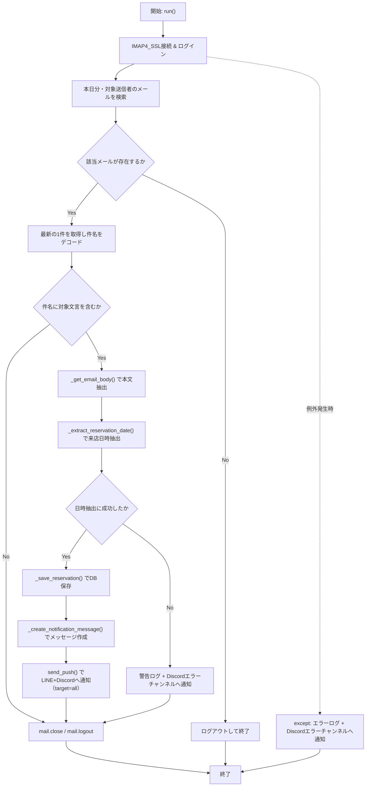

## 1. 解析メタ情報

| 項目 | 内容 |
| --- | --- |
| 対象ファイル | haircut_monitor.py |
| 言語 | Python |
| 解析対象 | 提供されたコードのみ |
| 推測・補完 | 一切なし |

## 関連ドキュメント

- [config.md](./config.md) — `LINE_USER_ID`設定値を提供
- [logger.md](./logger.md) — `core.logger.setup_logging`の実体
- [notification_service.md](./notification_service.md) — `services.notification_service.send_push`の実体
- [shopping_monitor.md](./shopping_monitor.md) — 同じ`MY_HOME_SYSTEM/old/`配下でGmail(IMAP)を監視し購入確認メールを検知する類似構成のスクリプト（直接の依存関係はない）
- [salary_analyzer.md](./salary_analyzer.md) — 同じくGmail(IMAP)経由で対象メールを検知する類似構成のスクリプト（直接の依存関係はない）

## 2. ファイルの概要

`HaircutMonitor`クラスは、Gmail(IMAP)を監視し、HotPepper Beauty（`reserve@beauty.hotpepper.jp`）からの予約確定メールを検知して、予約日時をローカルのSQLiteデータベース（`home_system.db`）に記録し、LINE/Discordへ通知するモジュールである。ファイル冒頭のコメントには`# MY_HOME_SYSTEM/monitors/haircut_monitor.py`と記されているが、実際の配置は`MY_HOME_SYSTEM/old/`配下である。
根拠: [ファイル冒頭コメント] (行番号: 1 / 抜粋: "# MY_HOME_SYSTEM/monitors/haircut_monitor.py")

他の類似モジュール（`shopping_monitor.py`など）が`common`モジュール経由でロガーや通知機能を利用するのに対し、本ファイルは`core.logger`と`services.notification_service`から直接`setup_logging`・`send_push`をインポートしており、依存の取り方が異なる。
根拠: [インポート文] (行番号: 17〜18 / 抜粋: "from core.logger import setup_logging\nfrom services.notification_service import send_push")

`__init__`時に`sys.path`へ親ディレクトリを追加した上で、`.env`ファイルからGmail認証情報を読み込み、`self.base_dir`（本ファイル自身の配置ディレクトリ）直下の`home_system.db`にSQLite接続してテーブルを初期化する。
根拠: [sys.path操作] (行番号: 13 / 抜粋: "sys.path.append(os.path.abspath(os.path.join(os.path.dirname(__file__), '..')))")

`run()`メソッドがエントリポイントであり、当日届いた対象送信者からのメールのうち最新1件を取得し、件名が「ご予約が確定いたしました」を含む場合に本文から来店日時を抽出、DB保存の上で通知メッセージを送信する。
根拠: [run] (行番号: 159〜213 / 抜粋: "def run(self):")

## 3. 外部依存関係

### インポート一覧

| 名称 | 種類 | 用途 | 根拠 |
| --- | --- | --- | --- |
| `imaplib` | 標準ライブラリ | GmailへのIMAP接続・メール検索・取得 | 根拠: [import imaplib] (行番号: 2 / 抜粋: "import imaplib") |
| `email`, `email.header.decode_header` | 標準ライブラリ | 受信メールのパースおよび件名のデコード | 根拠: [import email] (行番号: 3, 9 / 抜粋: "from email.header import decode_header") |
| `re` | 標準ライブラリ | 本文からの来店日時抽出（正規表現） | 根拠: [import re] (行番号: 4 / 抜粋: "import re") |
| `sys` | 標準ライブラリ | `sys.path`への親ディレクトリ追加 | 根拠: [import sys] (行番号: 5 / 抜粋: "import sys") |
| `os` | 標準ライブラリ | パス操作（`.env`パス、DBパス、`__file__`基準のディレクトリ取得） | 根拠: [import os] (行番号: 6 / 抜粋: "import os") |
| `sqlite3` | 標準ライブラリ | ローカルSQLiteデータベースへの直接接続・テーブル作成・INSERT | 根拠: [import sqlite3] (行番号: 7 / 抜粋: "import sqlite3") |
| `datetime.datetime` | 標準ライブラリ | 日時のパース・フォーマット・現在時刻取得 | 根拠: [from datetime import datetime] (行番号: 8 / 抜粋: "from datetime import datetime") |
| `typing.Optional` | 標準ライブラリ | 型ヒント（`_extract_reservation_date`の戻り値注釈） | 根拠: [from typing import Optional] (行番号: 10 / 抜粋: "from typing import Optional") |
| `dotenv.load_dotenv` | 外部ライブラリ | `.env`ファイルからの環境変数読み込み | 根拠: [from dotenv import load_dotenv] (行番号: 11 / 抜粋: "from dotenv import load_dotenv") |
| `config` | 内部モジュール | 通知先ユーザーID（`LINE_USER_ID`）の提供 | 根拠: [import config] (行番号: 16 / 抜粋: "import config") |
| `core.logger.setup_logging` | 内部モジュール | ロガーの初期化 | 根拠: [from core.logger import setup_logging] (行番号: 17 / 抜粋: "from core.logger import setup_logging") |
| `services.notification_service.send_push` | 内部モジュール | LINE/Discordへのプッシュ通知送信 | 根拠: [from services.notification_service import send_push] (行番号: 18 / 抜粋: "from services.notification_service import send_push") |

### ブラックボックスとなる外部要素

| 名称 | 理由 | 根拠 |
| --- | --- | --- |
| `config.LINE_USER_ID` | `config`モジュールの実装が提供されておらず、通知先ユーザーIDの実値が不明 | 根拠: [_load_environment, run] (行番号: 58, 199, 205, 213 / 抜粋: "send_push(config.LINE_USER_ID,") |
| `core.logger.setup_logging` | ロガーの初期化仕様（ハンドラ構成等）がこのファイル内では不明 | 根拠: [logger定義] (行番号: 23 / 抜粋: "logger = setup_logging(\"HaircutMonitor\")") |
| `services.notification_service.send_push` | 通知送信の実装・対応プラットフォーム・失敗時挙動が不明 | 根拠: [send_push呼び出し] (行番号: 58, 198〜202, 205, 213 / 抜粋: "send_push(\n                        config.LINE_USER_ID,") |

## 4. 主要要素の定義（関数 / エンドポイント / コンポーネント）

### `HaircutMonitor`

* **役割**: Gmailを監視しHotPepper Beautyの予約確定メールを検知・記録・通知するクラス本体。クラス定数として`IMAP_SERVER`, `TARGET_SENDER`, `TARGET_SUBJECT`, `DB_NAME`を保持する。
* 根拠: [HaircutMonitor] (行番号: 25〜35 / 抜粋: "class HaircutMonitor:")

### `__init__`

* **役割**: 自身の配置ディレクトリを`self.base_dir`に設定し、環境変数の読み込みとデータベースの初期化を行う。
* 根拠: [**init**] (行番号: 37〜42 / 抜粋: "def __init__(self):")

* **引数/リクエスト**: `None`（`self`のみ）
* 根拠: [**init**] (行番号: 37 / 抜粋: "def __init__(self):")

* **戻り値/レスポンス**: `None`
* 根拠: [**init**] (行番号: 37〜42 / 抜粋: "\"\"\"初期設定: 環境変数ロードとDB準備\"\"\"")

* **副作用**: `self.base_dir`の設定、`self._load_environment()`と`self._init_database()`の呼び出し（環境変数読み込み・DBテーブル作成）
* 根拠: [**init**] (行番号: 40〜42 / 抜粋: "self._load_environment()\n        self._init_database()")

* **エラーハンドリング**: なし（呼び出し先の`_load_environment`が送出する`ValueError`はここでは捕捉されない）

### `_load_environment`

* **役割**: `.env`ファイルを読み込み、`GMAIL_USER`・`GMAIL_APP_PASSWORD`環境変数を取得・検証する。
* 根拠: [_load_environment] (行番号: 44〜61 / 抜粋: "def _load_environment(self):")

* **引数/リクエスト**: `None`（`self`のみ）
* 根拠: [_load_environment] (行番号: 44 / 抜粋: "def _load_environment(self):")

* **戻り値/レスポンス**: `None`（正常時）。必須環境変数が欠落している場合は`ValueError`を送出する。
* 根拠: [_load_environment] (行番号: 59 / 抜粋: "raise ValueError(error_msg)")

* **副作用**: `self.gmail_user`, `self.gmail_password`への代入、環境変数不足時のエラーログ出力と`send_push`によるDiscordエラーチャンネルへの通知
* 根拠: [_load_environment] (行番号: 49〜58 / 抜粋: "send_push(config.LINE_USER_ID, [{\"type\":\"text\", \"text\": error_msg}], target=\"discord\", channel=\"error\")")

* **エラーハンドリング**: `GMAIL_USER`または`GMAIL_APP_PASSWORD`が未設定の場合、エラーログとDiscord通知を行った上で`ValueError`を送出する（呼び出し元の`__init__`では捕捉されないため、インスタンス生成自体が失敗する）。
* 根拠: [_load_environment] (行番号: 54〜59 / 抜粋: "if not self.gmail_user or not self.gmail_password:")

### `_init_database`

* **役割**: `self.base_dir`直下の`home_system.db`に接続し、`haircut_history`テーブルが存在しなければ作成する。
* 根拠: [_init_database] (行番号: 63〜80 / 抜粋: "def _init_database(self):")

* **引数/リクエスト**: `None`（`self`のみ）
* 根拠: [_init_database] (行番号: 63 / 抜粋: "def _init_database(self):")

* **戻り値/レスポンス**: `None`
* 根拠: [_init_database] (行番号: 63〜80 / 抜粋: "\"\"\"データベース接続とテーブル作成\"\"\"")

* **副作用**: `home_system.db`への接続、`CREATE TABLE IF NOT EXISTS haircut_history`の実行・コミット・接続クローズ
* 根拠: [_init_database] (行番号: 67〜77 / 抜粋: "CREATE TABLE IF NOT EXISTS haircut_history (")

* **エラーハンドリング**: `except Exception as e`でDB初期化エラーを捕捉しエラーログを出力する（例外は再送出されない）。
* 根拠: [_init_database] (行番号: 79〜80 / 抜粋: "logger.error(f\"❌ DB初期化エラー: {e}\")")

### `_save_reservation`

* **役割**: 抽出した予約日時を`haircut_history`テーブルへ`INSERT OR IGNORE`で保存する。ユニーク制約（`reservation_date`）により重複保存を防ぐ。
* 根拠: [_save_reservation] (行番号: 82〜109 / 抜粋: "def _save_reservation(self, dt: datetime) -> bool:")

* **引数/リクエスト**: `dt` (`datetime`。予約日時)
* 根拠: [_save_reservation] (行番号: 82 / 抜粋: "def _save_reservation(self, dt: datetime) -> bool:")

* **戻り値/レスポンス**: `bool`（新規保存成功時`True`、重複または失敗時`False`）
* 根拠: [_save_reservation] (行番号: 102, 105, 109 / 抜粋: "return True" / "return False")

* **副作用**: `home_system.db`への接続・INSERT・コミット・クローズ
* 根拠: [_save_reservation] (行番号: 89〜98 / 抜粋: "INSERT OR IGNORE INTO haircut_history (reservation_date, created_at)")

* **エラーハンドリング**: `except Exception as e`でDB例外を捕捉しエラーログを出力し`False`を返す。
* 根拠: [_save_reservation] (行番号: 107〜109 / 抜粋: "logger.error(f\"❌ DB保存エラー: {e}\")")

### `_get_email_body`

* **役割**: メールメッセージから`text/plain`パートの本文を抽出しデコードする。
* 根拠: [_get_email_body] (行番号: 111〜123 / 抜粋: "def _get_email_body(self, msg: email.message.Message) -> str:")

* **引数/リクエスト**: `msg` (`email.message.Message`。メールオブジェクト)
* 根拠: [_get_email_body] (行番号: 111 / 抜粋: "def _get_email_body(self, msg: email.message.Message) -> str:")

* **戻り値/レスポンス**: `str`（本文テキスト。該当パートがない場合は空文字列）
* 根拠: [_get_email_body] (行番号: 118, 122, 123 / 抜粋: "return \"\"")

* **副作用**: なし
* 根拠: [_get_email_body] (行番号: 111〜123 / 抜粋: "payload = part.get_payload(decode=True)")

* **エラーハンドリング**: なし（例外捕捉なし。デコード失敗時は呼び出し元の`run`の`try`節で捕捉される想定）

### `_extract_reservation_date`

* **役割**: 本文中の「■来店日時」ラベルに続く日時文字列を正規表現で抽出し、`datetime`オブジェクトへパースする。
* 根拠: [_extract_reservation_date] (行番号: 125〜140 / 抜粋: "def _extract_reservation_date(self, body: str) -> Optional[datetime]:")

* **引数/リクエスト**: `body` (`str`。メール本文)
* 根拠: [_extract_reservation_date] (行番号: 125 / 抜粋: "def _extract_reservation_date(self, body: str)")

* **戻り値/レスポンス**: `Optional[datetime]`（抽出・パース成功時は`datetime`、パターン不一致またはパース失敗時は`None`）
* 根拠: [_extract_reservation_date] (行番号: 136, 139, 140 / 抜粋: "return dt" / "return None")

* **副作用**: なし
* 根拠: [_extract_reservation_date] (行番号: 125〜140 / 抜粋: "match = re.search(date_pattern, body, re.DOTALL)")

* **エラーハンドリング**: `strptime`の`ValueError`を`except ValueError as e`で捕捉し、エラーログを出力して`None`を返す。
* 根拠: [_extract_reservation_date] (行番号: 137〜139 / 抜粋: "except ValueError as e:\n                logger.error(f\"⚠️ 日時パースエラー: {e}\")")

### `_create_notification_message`

* **役割**: 予約日時と新規/既存フラグをもとに、主婦層向けの通知メッセージ文字列を作成する。
* 根拠: [_create_notification_message] (行番号: 142〜157 / 抜粋: "def _create_notification_message(self, dt: datetime, is_new: bool) -> str:")

* **引数/リクエスト**: `dt` (`datetime`。予約日時), `is_new` (`bool`。新規保存かどうか)
* 根拠: [_create_notification_message] (行番号: 142 / 抜粋: "def _create_notification_message(self, dt: datetime, is_new: bool)")

* **戻り値/レスポンス**: `str`（通知メッセージ本文）
* 根拠: [_create_notification_message] (行番号: 146〜157 / 抜粋: "return (")

* **副作用**: なし
* 根拠: [_create_notification_message] (行番号: 142〜157 / 抜粋: "date_str = dt.strftime('%Y年%m月%d日 %H:%M')")

* **エラーハンドリング**: なし

### `run`

* **役割**: メイン処理フロー。GmailにIMAP接続し、当日届いた対象送信者のメールのうち最新1件を取得、件名判定・本文抽出・日時抽出・DB保存・通知送信までを一連で実行する。
* 根拠: [run] (行番号: 159〜213 / 抜粋: "def run(self):")

* **引数/リクエスト**: `None`（`self`のみ）
* 根拠: [run] (行番号: 159 / 抜粋: "def run(self):")

* **戻り値/レスポンス**: `None`（対象メールがない場合は早期`return`）
* 根拠: [run] (行番号: 175〜178 / 抜粋: "if not email_ids:\n                logger.info(\"✨ 新しい予約メールはありませんでした。\")\n                mail.logout()\n                return")

* **副作用**: IMAP接続・検索・メール取得・クローズ・ログアウト、`_save_reservation`によるDB書き込み、`send_push`による通知送信
* 根拠: [run] (行番号: 164〜209 / 抜粋: "mail = imaplib.IMAP4_SSL(self.IMAP_SERVER)")

* **エラーハンドリング**: `try/except Exception as e`で全体を包み、予期せぬエラーをエラーログに出力するとともに、`send_push`でDiscordのエラーチャンネルへシステムエラー通知を送信する。日時抽出失敗時も個別に警告ログとDiscord通知を行う。
* 根拠: [run] (行番号: 203〜213 / 抜粋: "except Exception as e:\n            logger.error(f\"❌ 予期せぬエラー: {e}\")")

## 5. 処理フロー図

## 6. 依存関係図

```mermaid
graph TD
    HaircutMonitorPY["haircut_monitor.py"]

    subgraph Python_Standard_Libraries
        Imaplib["imaplib"]
        Email["email / email.header"]
        Re["re"]
        Sys["sys"]
        OS["os"]
        Sqlite3["sqlite3"]
        Datetime["datetime"]
        Typing["typing"]
    end

    subgraph External_Libraries
        Dotenv["dotenv.load_dotenv"]
    end

    subgraph Project_Internal
        Config["config.py"]
        CoreLogger["core.logger"]
        NotificationService["services.notification_service"]
    end

    subgraph External_Services
        Gmail["Gmail (IMAP)"]
        NotifyTarget["LINE / Discord（send_push経由）"]
    end

    subgraph Local_Storage
        DB["home_system.db（haircut_historyテーブル）"]
        EnvFile[".env"]
    end

    HaircutMonitorPY --> Imaplib
    HaircutMonitorPY --> Email
    HaircutMonitorPY --> Re
    HaircutMonitorPY --> Sys
    HaircutMonitorPY --> OS
    HaircutMonitorPY --> Sqlite3
    HaircutMonitorPY --> Datetime
    HaircutMonitorPY --> Typing
    HaircutMonitorPY --> Dotenv
    HaircutMonitorPY --> Config
    HaircutMonitorPY --> CoreLogger
    HaircutMonitorPY --> NotificationService

    HaircutMonitorPY -->|IMAP接続/検索/取得| Gmail
    HaircutMonitorPY -->|send_push経由| NotifyTarget
    HaircutMonitorPY -->|SQLite接続| DB
    HaircutMonitorPY -->|load_dotenv| EnvFile
```

## 7. 次のステップ（リバースエンジニアリングの提案）

| 優先度 | ファイル名(推測可) | 理由 | 根拠 |
| --- | --- | --- | --- |
| 高 | `core/logger.py` | `setup_logging`の初期化仕様（ハンドラ構成、Discordエラー通知の有無）を確認するため。（本リポジトリでは`logger.md`として既に解析済み） | 根拠: [logger定義] (行番号: 17, 23 / 抜粋: "from core.logger import setup_logging") |
| 高 | `services/notification_service.py` | `send_push`の`target="all"`指定時の実際の送信経路（LINE/Discord両方への送信仕様）を確認するため。（本リポジトリでは`notification_service.md`として既に解析済み） | 根拠: [send_push呼び出し] (行番号: 198〜202 / 抜粋: "target=\"all\" # LINEとDiscord両方に送る") |
| 中 | `config.py` | `LINE_USER_ID`の実値を確認するため。（本リポジトリでは`config.md`として既に解析済み） | 根拠: [config参照箇所] (行番号: 58, 199 / 抜粋: "config.LINE_USER_ID") |
| 低 | `.env`ファイル | `GMAIL_USER`, `GMAIL_APP_PASSWORD`以外の必要な環境変数の有無を確認するため。 | 根拠: [_load_environment] (行番号: 46〜50 / 抜粋: "dotenv_path = os.path.join(self.base_dir, '.env')") |

## 8. 保守上の注意点

* **独自のDB接続先**: 本ファイルは`config.SQLITE_DB_PATH`や`common.get_db_cursor`を使わず、`self.base_dir`（本ファイル自身の配置ディレクトリ、すなわち`MY_HOME_SYSTEM/old/`）直下に`home_system.db`という独自のSQLite接続を都度張っている。他のモジュール（`shopping_monitor.py`等）が使う共有DBと同名だが、パス解決が異なるため、実際に同一ファイルを参照しているかは本ファイル単体では確認できない。
  * 根拠: [DB_NAME/base_dir定義] (行番号: 35, 40, 65, 84 / 抜粋: "db_path = os.path.join(self.base_dir, self.DB_NAME)")
* **DB接続の都度オープン・クローズ**: `_init_database`と`_save_reservation`がそれぞれ個別に`sqlite3.connect`〜`close`を行っており、コネクションプーリングやトランザクションの一元管理がされていない。
  * 根拠: [_init_database, _save_reservation] (行番号: 67, 77, 89, 98 / 抜粋: "conn = sqlite3.connect(db_path)")
* **`__init__`が例外を送出しうる**: `_load_environment`が必須環境変数の欠落時に`ValueError`を送出し、これは`__init__`内で捕捉されないため、`HaircutMonitor()`のインスタンス化自体が失敗しうる。呼び出し元でのtry/except対応が必須となる設計。
  * 根拠: [_load_environment] (行番号: 54〜59 / 抜粋: "raise ValueError(error_msg)")
* **他モジュールとインポート経路の不統一**: 同じ`old/`配下の`shopping_monitor.py`は`common`モジュール経由でロガー・通知機能を取得するのに対し、本ファイルは`core.logger`・`services.notification_service`から直接インポートしており、依存関係の取り方がシステム内で統一されていない。
  * 根拠: [インポート文] (行番号: 17〜18 / 抜粋: "from core.logger import setup_logging\nfrom services.notification_service import send_push")
* **ファイル冒頭コメントと実配置の不一致**: コメントは`# MY_HOME_SYSTEM/monitors/haircut_monitor.py`だが、実ファイルは`MY_HOME_SYSTEM/old/`配下にあり、`monitors/`ディレクトリから`old/`へ移動された、または移動予定のまま放置されている可能性がある。
  * 根拠: [ファイル冒頭コメント] (行番号: 1 / 抜粋: "# MY_HOME_SYSTEM/monitors/haircut_monitor.py")

## 9. 不明事項一覧

| 項目 | 理由 | 必要なファイル |
| --- | --- | --- |
| `config.LINE_USER_ID`の実際の値 | 通知先ユーザーIDの実値が本ファイル内で定義されていないため。 | `config.py` |
| `core.logger.setup_logging`の詳細な挙動 | ハンドラ構成やDiscord通知連携の有無が本ファイル内では確認できないため。 | `core/logger.py` |
| `services.notification_service.send_push`の`target="all"`時の挙動 | LINEとDiscordへの送信順序・失敗時のフォールバック仕様が本ファイル内では確認できないため。 | `services/notification_service.py` |
| `self.base_dir`直下の`home_system.db`とシステム共有DBの同一性 | `config.SQLITE_DB_PATH`との関係が本ファイル単体では確認できないため。 | `config.py` |

## 相互参照による補足情報

| 元の不明事項 | 判明した内容 | 参照元ドキュメント |
| --- | --- | --- |
| `config.LINE_USER_ID`の実際の値 | `MY_HOME_SYSTEM/config.py`185行目`LINE_USER_ID: Optional[str] = os.getenv("LINE_USER_ID")`を直接確認した。環境変数`LINE_USER_ID`から取得する定義のみであり、リテラルな実値は`config.py`にも`.env.example`にも存在しない(`.env.example`を全文検索したが`LINE_USER_ID`の記載なし)。実際の値は`.env`(gitignore対象)にのみ存在すると推定されるが、本リポジトリからは確認できなかった。 | 直接ソース確認: `MY_HOME_SYSTEM/config.py:185` |
| `core.logger.setup_logging`の詳細な挙動 | `MY_HOME_SYSTEM/core/logger.py`(全86行)を直接確認した。`setup_logging(name: str, webhook_url: str = None)`(46〜86行目)は、既存ハンドラをクリアし(51〜52行目)、レベルを`INFO`に設定した上で、(1) `StreamHandler`によるコンソール出力(58〜60行目)、(2) `config.BASE_DIR/logs/home_system.log`への`TimedRotatingFileHandler`(`when='midnight', interval=1, backupCount=7`、63〜74行目)、(3) `webhook_url`引数または`config.DISCORD_WEBHOOK_ERROR`が設定されていれば`DiscordErrorHandler`(`ERROR`レベル以上、80〜84行目)、の3種のハンドラを登録して返す。`DiscordErrorHandler.emit`(17〜44行目)は`record.levelno >= logging.ERROR`かつメッセージに`"Discord"`という文字列を含まない場合のみ、スタックトレース(末尾1000文字)付きのメッセージをWebhook URLへ`requests.post`(タイムアウト5秒)する。本ファイル(`haircut_monitor.py`)23行目の`logger = setup_logging("HaircutMonitor")`は`webhook_url`を指定していないため、`config.DISCORD_WEBHOOK_ERROR`が使われる。 | 直接ソース確認: `MY_HOME_SYSTEM/core/logger.py:1-86` |
| `services.notification_service.send_push`の`target="all"`時の挙動 | `MY_HOME_SYSTEM/services/notification_service.py`116〜140行目の`send_push(user_id, messages, image_data=None, target="both", channel="notify", filename="snapshot.jpg")`を直接確認した。実装は`if target in ["discord", "both"]:`(121行目)でDiscord送信、`if target in ["line", "both"]:`(127行目)でLINE送信を行う2つの独立した条件分岐のみであり、`"all"`という文字列はどちらの`in`判定にも一致しない。したがって本ファイル198〜202行目の`send_push(config.LINE_USER_ID, [...], target="all")`(コメント「LINEとDiscord両方に送る」)は、実際にはどちらの分岐にも入らず、DiscordにもLINEにも一切送信されずに`success = True`のまま関数が終了するという、コメントの意図と実装が一致していない不具合であることが直接ソースの突き合わせで判明した。なお本ファイルの他の呼び出し箇所(58, 205, 213行目)はいずれも`target="discord"`を明示的に指定しており、この問題が起きるのは198〜202行目の1箇所のみである。 | 直接ソース確認: `MY_HOME_SYSTEM/services/notification_service.py:116-140`, `MY_HOME_SYSTEM/old/haircut_monitor.py:198-202`（参考: `MY_HOME_SYSTEM/old/haircut_monitor.py:58, 205, 213`） |
| `self.base_dir`直下の`home_system.db`とシステム共有DBの同一性 | `MY_HOME_SYSTEM/old/haircut_monitor.py`を直接確認した。`self.base_dir = os.path.dirname(os.path.abspath(__file__))`であり、本ファイルの実配置(`MY_HOME_SYSTEM/old/haircut_monitor.py`)から`self.base_dir`は`MY_HOME_SYSTEM/old/`ディレクトリを指す。一方`config.py`222行目の`SQLITE_DB_PATH: str = os.getenv("SQLITE_DB_PATH") or os.path.join(BASE_DIR, "home_system.db")`は、環境変数未設定時`config.BASE_DIR`(212行目、`MY_HOME_SYSTEM/`直下)配下の`home_system.db`を指す。したがって既定設定では、本ファイルが読み書きする`self.base_dir/home_system.db`(`MY_HOME_SYSTEM/old/home_system.db`)と`config.SQLITE_DB_PATH`(`MY_HOME_SYSTEM/home_system.db`)はディレクトリが異なり、同一ファイルではない。両者が一致するのは`SQLITE_DB_PATH`環境変数が明示的に`MY_HOME_SYSTEM/old/home_system.db`を指すよう設定されている場合のみだが、`.env`はgitignore対象でありその設定値はリポジトリから確認できなかった。 | 直接ソース確認: `MY_HOME_SYSTEM/old/haircut_monitor.py:1, 35, 40, 65, 84`, `MY_HOME_SYSTEM/config.py:212, 222` |

## 10. 自己検証結果

* [x] 推測・外部ファイルの仕様を一切含んでいない
* [x] 全関数・全クラス・全コンポーネントを列挙した
* [x] 全てのインポート要素を列挙した
* [x] すべての仕様説明に「根拠（行番号・抜粋）」を明記した
* [x] 根拠漏れが0件である
* [x] Mermaid構文にエラーの原因となる記号（エスケープ漏れ）がない
* [x] 不明事項を漏れなく列挙した
