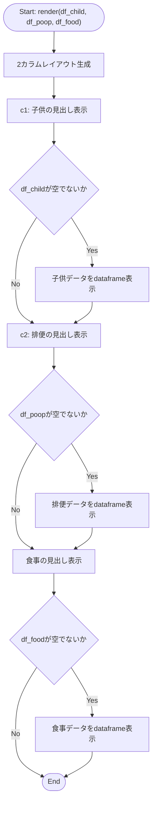

## 1. 解析メタ情報

| 項目 | 内容 |
| --- | --- |
| 対象ファイル | `views/dashboard/health_tab.py` |
| 言語 | Python |
| 解析対象 | 提供されたコードのみ |
| 推測・補完 | 一切なし |

## 関連ドキュメント

* [dashboard.md](./dashboard.md) - 呼び出し元。`views.dashboard.health_tab`をインポートし、健康管理タブとして`health_tab.render(df_child, df_poop, df_food)`を呼び出す
* [dashboard_common.md](./dashboard_common.md) - 同じ`views/dashboard`パッケージ内の共通CSS/カード生成モジュール（本ファイルからは直接インポートされていない）

## 2. ファイルの概要

* Streamlitダッシュボードの「健康管理」タブを描画するモジュール。子供の体調、排便、食事の3種類のデータフレームを引数として受け取り、それぞれ表形式で表示する単一の関数`render`のみで構成される。
* 根拠: `def render(df_child: pd.DataFrame, df_poop: pd.DataFrame, df_food: pd.DataFrame):` (行番号: 5 / 抜粋: "def render(df_child: pd.DataFrame, df_poop: pd.DataFrame, df_food: pd.DataFrame):")
* 子供・排便のデータは2カラムレイアウトで横並びに、食事のデータはその下に単独で表示される。
* 根拠: `c1, c2 = st.columns(2)` (行番号: 6 / 抜粋: "c1, c2 = st.columns(2)")
* 各データフレームが空でない場合のみ、指定列（子供: `timestamp`, `child_name`, `condition`。排便: `timestamp`, `user_name`, `condition`。食事: `timestamp`, `menu_category`）に絞った`st.dataframe`を表示する。
* 根拠: `if not df_child.empty:\n            st.dataframe(df_child[["timestamp", "child_name", "condition"]], width="stretch")` (行番号: 9〜10 / 抜粋: "if not df_child.empty:")

## 3. 外部依存関係

### インポート一覧

| 名称 | 種類 | 用途 | 根拠 |
| --- | --- | --- | --- |
| `streamlit` | 外部ライブラリ | UI描画（カラムレイアウト、見出し、データフレーム表示） | `import streamlit as st` (行番号: 2 / 抜粋: "import streamlit as st") |
| `pandas` | 外部ライブラリ | `render`の各引数の型注釈（`pd.DataFrame`）および列選択処理 | `import pandas as pd` (行番号: 3 / 抜粋: "import pandas as pd") |

### ブラックボックスとなる外部要素

該当なし（本ファイルは`streamlit`, `pandas`のみに依存し、渡された`DataFrame`引数を処理するのみで、外部関数呼び出しは行っていない）。

## 4. 主要要素の定義（関数 / エンドポイント / コンポーネント）

### `render`

* **役割**: 子供の体調・排便・食事の3つの`DataFrame`を受け取り、健康管理タブとして表形式で表示する。
* 根拠: `def render(df_child: pd.DataFrame, df_poop: pd.DataFrame, df_food: pd.DataFrame):` (行番号: 5〜17 / 抜粋: "def render(df_child: pd.DataFrame, df_poop: pd.DataFrame, df_food: pd.DataFrame):")


* **引数/リクエスト**: `df_child` (型: `pd.DataFrame`。`timestamp`, `child_name`, `condition`列を含む子供の体調データ)、`df_poop` (型: `pd.DataFrame`。`timestamp`, `user_name`, `condition`列を含む排便データ)、`df_food` (型: `pd.DataFrame`。`timestamp`, `menu_category`列を含む食事データ)
* 根拠: `def render(df_child: pd.DataFrame, df_poop: pd.DataFrame, df_food: pd.DataFrame):` (行番号: 5 / 抜粋: "def render(df_child: pd.DataFrame, df_poop: pd.DataFrame, df_food: pd.DataFrame):")


* **戻り値/レスポンス**: なし
* 根拠: `def render(df_child: pd.DataFrame, df_poop: pd.DataFrame, df_food: pd.DataFrame):` (行番号: 5 / 抜粋: "def render(df_child: pd.DataFrame, df_poop: pd.DataFrame, df_food: pd.DataFrame):")


* **副作用**: `st.columns`, `st.markdown`, `st.dataframe`によるStreamlit画面への描画のみ。外部I/O・データ取得処理は行わない。
* 根拠: `st.dataframe(df_child[["timestamp", "child_name", "condition"]], width="stretch")` (行番号: 10 / 抜粋: "st.dataframe(df_child[[\"timestamp\", \"child_name\", \"condition\"]], width=\"stretch\")")


* **エラーハンドリング**: なし（明示的な例外捕捉は行われていない。各`DataFrame`が空の場合は`if not ...empty:`分岐により当該表を描画しないだけで、エラー表示や警告は行わない）
* 根拠: `if not df_food.empty:\n        st.dataframe(df_food[["timestamp", "menu_category"]], width="stretch")` (行番号: 16〜17 / 抜粋: "if not df_food.empty:")


## 5. 処理フロー図



## 6. 依存関係図

```mermaid
graph TD
    HealthTabPy["health_tab.py"]

    subgraph External_Libraries
        Streamlit["streamlit"]
        Pandas["pandas"]
    end

    HealthTabPy --> Streamlit
    HealthTabPy --> Pandas

    Dashboard["dashboard.py"] -->|render(df_child, df_poop, df_food)呼び出し| HealthTabPy
```

## 7. 次のステップ（リバースエンジニアリングの提案）

| 優先度 | ファイル名(推測可) | 理由 | 根拠 |
| --- | --- | --- | --- |
| 中 | `services/analysis_service.py` | `render`に渡される`df_child`, `df_poop`, `df_food`が呼び出し元（`dashboard.py`）でどのように生成されるか（テーブル名、取得条件）を確認するため。 | `def render(df_child: pd.DataFrame, df_poop: pd.DataFrame, df_food: pd.DataFrame):` (行番号: 5 / 抜粋: "def render(df_child: pd.DataFrame, df_poop: pd.DataFrame, df_food: pd.DataFrame):") |
| 低 | `dashboard.py` | `health_tab.render`の実際の呼び出し箇所と引数の生成元を確認するため（既に`dashboard.md`で解析済み）。 | 該当なし（呼び出し元は`dashboard.md`で解析済み） |

## 8. 保守上の注意点

* **列存在チェックの欠如**: 各`DataFrame`が空でないと判定された場合、`["timestamp", "child_name", "condition"]`等の固定列名で直接インデックス参照している。対象の列が存在しない`DataFrame`が渡された場合、`KeyError`が送出されタブ全体の描画が中断する可能性があるが、これに対する例外処理は存在しない。
* 根拠: `st.dataframe(df_child[["timestamp", "child_name", "condition"]], width="stretch")` (行番号: 10 / 抜粋: "st.dataframe(df_child[[\"timestamp\", \"child_name\", \"condition\"]], width=\"stretch\")")


* **他タブとの一貫性の欠如**: 同じ`views/dashboard`配下の他モジュール（例: `misc_tab.py`の`render_bicycle`）は空データ時に`st.info`等でメッセージを表示するのに対し、本ファイルは空の場合何も表示せず見出しのみが残る。UI上の一貫性に欠ける可能性がある。
* 根拠: `if not df_child.empty:\n            st.dataframe(...)` （elseブロックなし） (行番号: 9〜10 / 抜粋: "if not df_child.empty:")


## 9. 不明事項一覧

| 項目 | 理由 | 必要なファイル |
| --- | --- | --- |
| `df_child`, `df_poop`, `df_food`の生成元・正確なスキーマ | 呼び出し元でどのように`DataFrame`が構築されるか（テーブル名、取得件数、フィルタ条件）が本ファイルからは不明。 | `dashboard.py`, `services/analysis_service.py` |

## 10. 自己検証結果

* [x] 推測・外部ファイルの仕様を一切含んでいない
* [x] 全関数・全クラス・全コンポーネントを列挙した
* [x] 全てのインポート要素を列挙した
* [x] すべての仕様説明に「根拠（行番号・抜粋）」を明記した
* [x] 根拠漏れが0件である
* [x] Mermaid構文にエラーの原因となる記号（エスケープ漏れ）がない
* [x] 不明事項を漏れなく列挙した
