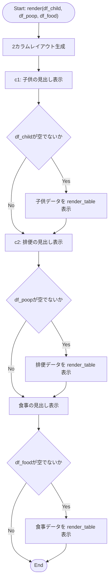

> **廃止 (2026-09-25)**: このファイルはソース (`MY_HOME_SYSTEM/views/dashboard/health_tab.py`) が Issue #829(お家ダッシュボード改修:
> Streamlit版の詳細表示・表示モード切替UIを廃止し、かんたん表示のみの構成にする)で削除されたため
> 廃止されました。ダッシュボードの現行構成は `docs/specifications/MY_HOME_SYSTEM/dashboard_router.md`・
> `docs/specifications/MY_HOME_SYSTEM/dashboard_page_service.md`・
> `docs/specifications/MY_HOME_SYSTEM/home_status_service.md` を参照。以下は削除前時点の解析内容を
> 履歴として残す。

## 1. 解析メタ情報

| 項目 | 内容 |
| --- | --- |
| 対象ファイル | `views/dashboard/health_tab.py` |
| 言語 | Python |
| 解析対象 | 提供されたコードのみ |
| 推測・補完 | 一切なし |

## 関連ドキュメント

* [dashboard.md](./dashboard.md) - 呼び出し元。`views.dashboard.health_tab`をインポートし、健康管理タブとして`health_tab.render(df_child, df_poop, df_food)`を呼び出す
* [dashboard_common.md](./dashboard_common.md) - 同じ`views/dashboard`パッケージ内の共通モジュール。**（スマホ対応で変更）** 表の描画は本ファイルが直接`st.dataframe`を呼ぶのをやめ、`view_common.render_table`（列を表示名付きで絞る・時刻を短縮する・行番号を隠す）経由になった

## 2. ファイルの概要

* Streamlitダッシュボードの「健康管理」タブを描画するモジュール。子供の体調、排便、食事の3種類のデータフレームを引数として受け取り、それぞれ表形式で表示する単一の関数`render`のみで構成される。
* 根拠: `def render(df_child: pd.DataFrame, df_poop: pd.DataFrame, df_food: pd.DataFrame):` (行番号: 7 / 抜粋: "def render(df_child: pd.DataFrame, df_poop: pd.DataFrame, df_food: pd.DataFrame):")
* 子供・排便のデータは2カラムレイアウトで横並びに、食事のデータはその下に単独で表示される。
* 根拠: `c1, c2 = st.columns(2)` (行番号: 8 / 抜粋: "c1, c2 = st.columns(2)")
* 各データフレームが空でない場合のみ、指定列に絞った表を表示する。**（スマホ対応で変更）** 列の指定は「元の列名 → 表示名」の辞書になり、描画は`view_common.render_table`に委譲する（子供: 時刻/名前/様子、排便: 時刻/名前/様子、食事: 時刻/メニュー）。`st.dataframe`は画面幅を超えると横スクロールの箱になるため、列を絞り・時刻を「09/21 03:04」に短縮し・行番号を隠す処理を共通ヘルパー側に寄せている。
* 根拠: `view_common.render_table(df_child, {"timestamp": "時刻", "child_name": "名前", "condition": "様子"})` (行番号: 12 / 抜粋: "view_common.render_table(df_child, {\"timestamp\": \"時刻\", \"child_name\": \"名前\", \"condition\": \"様子\"})")

## 3. 外部依存関係

### インポート一覧

| 名称 | 種類 | 用途 | 根拠 |
| --- | --- | --- | --- |
| `streamlit` | 外部ライブラリ | UI描画（カラムレイアウト、見出し、データフレーム表示） | `import streamlit as st` (行番号: 2 / 抜粋: "import streamlit as st") |
| `pandas` | 外部ライブラリ | `render`の各引数の型注釈（`pd.DataFrame`） | `import pandas as pd` (行番号: 3 / 抜粋: "import pandas as pd") |
| `views.dashboard.common` (`view_common`) | 内部モジュール | **（スマホ対応で追加）** 表の描画ヘルパー`render_table`の利用 | `from . import common as view_common` (行番号: 5 / 抜粋: "from . import common as view_common") |

### ブラックボックスとなる外部要素

| 名称 | 理由 | 根拠 |
| --- | --- | --- |
| `view_common.render_table` | 列の絞り込み・時刻の整形・空データ時の表示の実装は[dashboard_common.md](./dashboard_common.md)側にある。 | `view_common.render_table(df_food, {"timestamp": "時刻", "menu_category": "メニュー"})` |

## 4. 主要要素の定義（関数 / エンドポイント / コンポーネント）

### `render`

* **役割**: 子供の体調・排便・食事の3つの`DataFrame`を受け取り、健康管理タブとして表形式で表示する。
* 根拠: `def render(df_child: pd.DataFrame, df_poop: pd.DataFrame, df_food: pd.DataFrame):` (行番号: 7〜19 / 抜粋: "def render(df_child: pd.DataFrame, df_poop: pd.DataFrame, df_food: pd.DataFrame):")


* **引数/リクエスト**: `df_child` (型: `pd.DataFrame`。`timestamp`, `child_name`, `condition`列を含む子供の体調データ)、`df_poop` (型: `pd.DataFrame`。`timestamp`, `user_name`, `condition`列を含む排便データ)、`df_food` (型: `pd.DataFrame`。`timestamp`, `menu_category`列を含む食事データ)
* 根拠: `def render(df_child: pd.DataFrame, df_poop: pd.DataFrame, df_food: pd.DataFrame):` (行番号: 7 / 抜粋: "def render(df_child: pd.DataFrame, df_poop: pd.DataFrame, df_food: pd.DataFrame):")


* **戻り値/レスポンス**: なし
* 根拠: `def render(df_child: pd.DataFrame, df_poop: pd.DataFrame, df_food: pd.DataFrame):` (行番号: 7 / 抜粋: "def render(df_child: pd.DataFrame, df_poop: pd.DataFrame, df_food: pd.DataFrame):")


* **副作用**: `st.columns`, `st.markdown`, および`view_common.render_table`（内部で`st.dataframe`）によるStreamlit画面への描画のみ。外部I/O・データ取得処理は行わない。
* 根拠: `view_common.render_table(df_child, {"timestamp": "時刻", "child_name": "名前", "condition": "様子"})` (行番号: 11 / 抜粋: "view_common.render_table(df_child, ...)")


* **エラーハンドリング**: なし（明示的な例外捕捉は行われていない。各`DataFrame`が空の場合は`if not ...empty:`分岐により当該表を描画しないだけで、エラー表示や警告は行わない）
* 根拠: `if not df_food.empty:` (行番号: 18 / 抜粋: "if not df_food.empty:")


## 5. 処理フロー図



## 6. 依存関係図

```mermaid
graph TD
    HealthTabPy["health_tab.py"]

    subgraph External_Libraries
        Streamlit["streamlit"]
        Pandas["pandas"]
    end

    HealthTabPy --> Streamlit
    HealthTabPy --> Pandas
    HealthTabPy -->|render_table| ViewCommon["views/dashboard/common.py"]

    Dashboard["dashboard.py"] -->|render(df_child, df_poop, df_food)呼び出し| HealthTabPy
```

## 7. 次のステップ（リバースエンジニアリングの提案）

| 優先度 | ファイル名(推測可) | 理由 | 根拠 |
| --- | --- | --- | --- |
| 中 | `services/analysis_service.py` | `render`に渡される`df_child`, `df_poop`, `df_food`が呼び出し元（`dashboard.py`）でどのように生成されるか（テーブル名、取得条件）を確認するため。 | `def render(df_child: pd.DataFrame, df_poop: pd.DataFrame, df_food: pd.DataFrame):` (行番号: 7 / 抜粋: "def render(df_child: pd.DataFrame, df_poop: pd.DataFrame, df_food: pd.DataFrame):") |
| 低 | `dashboard.py` | `health_tab.render`の実際の呼び出し箇所と引数の生成元を確認するため（既に`dashboard.md`で解析済み）。 | 該当なし（呼び出し元は`dashboard.md`で解析済み） |

## 8. 保守上の注意点

* **（スマホ対応で解消）列存在チェックの欠如**: 以前は`["timestamp", "child_name", "condition"]`等の固定列名で直接インデックス参照しており、列が欠けた`DataFrame`では`KeyError`でタブ全体の描画が中断しうる状態だった。`view_common.render_table`は指定された列のうち**実在するものだけ**に絞るため、この経路の`KeyError`は起きなくなった（欠けた列は表から消えるだけになる）。
* 根拠: `view_common.render_table(df_poop, {"timestamp": "時刻", "user_name": "名前", "condition": "様子"})` (行番号: 15 / 抜粋: "view_common.render_table(df_poop, ...)")


* **他タブとの一貫性の欠如**: 同じ`views/dashboard`配下の他モジュール（例: `misc_tab.py`の`render_bicycle`）は空データ時に`st.info`等でメッセージを表示するのに対し、本ファイルは空の場合何も表示せず見出しのみが残る（`render_table`自体は空データにプレースホルダを出すが、本ファイルは`if not ...empty:`で呼び出し自体を省くためそこへ到達しない）。UI上の一貫性に欠ける可能性がある。
* 根拠: `if not df_child.empty:` （elseブロックなし） (行番号: 11 / 抜粋: "if not df_child.empty:")


## 9. 不明事項一覧

| 項目 | 理由 | 必要なファイル |
| --- | --- | --- |
| `df_child`, `df_poop`, `df_food`の生成元・正確なスキーマ | 呼び出し元でどのように`DataFrame`が構築されるか（テーブル名、取得件数、フィルタ条件）が本ファイルからは不明。 | `dashboard.py`, `services/analysis_service.py` |

## 相互参照による補足情報

| 元の不明事項 | 判明した内容 | 参照元ドキュメント |
| --- | --- | --- |
| `df_child`, `df_poop`, `df_food`の生成元・正確なスキーマ | `MY_HOME_SYSTEM/dashboard.py`と`MY_HOME_SYSTEM/services/analysis_service.py`を直接確認した。`dashboard.py`60〜62行目で`df_child = analysis_service.load_generic_data(config.SQLITE_TABLE_CHILD)`、`df_poop = analysis_service.load_generic_data(config.SQLITE_TABLE_DEFECATION)`、`df_food = analysis_service.load_generic_data(config.SQLITE_TABLE_FOOD)`が呼ばれ、121行目で`health_tab.render(df_child, df_poop, df_food)`に渡される。`analysis_service.load_generic_data(table_name, limit=500)`(150〜153行目)は`SELECT * FROM {table_name} ORDER BY timestamp DESC LIMIT {limit}`を実行するのみの汎用関数であり、フィルタ条件は特になく最新500件を取得する。テーブル名は`config.py`の`SQLITE_TABLE_CHILD = "child_health_records"`(245行目)、`SQLITE_TABLE_DEFECATION = "defecation_records"`(246行目)、`SQLITE_TABLE_FOOD = "food_records"`(242行目)である。`MY_HOME_SYSTEM/current_schema.sql`で各テーブルの実スキーマを直接確認した。`child_health_records`(48〜55行目)は`id, user_id, user_name, child_name, condition, timestamp DATETIME NOT NULL`。`defecation_records`(56〜64行目)は`id, user_id, user_name, record_type("排便" or "症状"), condition, note, timestamp DATETIME NOT NULL`。`food_records`(94〜99行目)は`id, date, menu, created_at, menu_category, meal_date, meal_time_category, user_id, user_name, timestamp DATETIME`という列構成である。本ファイル(`health_tab.py`)5〜17行目の`render`関数が参照する列(`df_child`の`timestamp/child_name/condition`、`df_poop`の`timestamp/user_name/condition`、`df_food`の`timestamp/menu_category`)は、いずれもこれらのスキーマに実在する列であることを確認した。 | 直接ソース確認: `MY_HOME_SYSTEM/dashboard.py:60-62, 121`, `MY_HOME_SYSTEM/services/analysis_service.py:150-153`, `MY_HOME_SYSTEM/config.py:242, 245-246`, `MY_HOME_SYSTEM/current_schema.sql:48-64, 94-99` |

## 10. 自己検証結果

* [x] 推測・外部ファイルの仕様を一切含んでいない
* [x] 全関数・全クラス・全コンポーネントを列挙した
* [x] 全てのインポート要素を列挙した
* [x] すべての仕様説明に「根拠（行番号・抜粋）」を明記した
* [x] 根拠漏れが0件である
* [x] Mermaid構文にエラーの原因となる記号（エスケープ漏れ）がない
* [x] 不明事項を漏れなく列挙した
