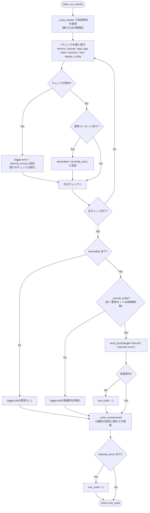

## 1. 解析メタ情報

| 項目 | 内容 |
| --- | --- |
| 対象ファイル | `monitors/health_watch.py` |
| 言語 | Python |
| 解析対象 | 提供されたコードのみ |
| 推測・補完 | 一切なし |
| 解析基準コミット | `0e15b41` (+同一PR内のチェック7追加変更) |

## 関連ドキュメント

* [config.md](./config.md) - `LOG_DIR`, `NAS_MOUNT_POINT`の設定値を提供
* [logger.md](./logger.md) - `setup_logging`の実体
* [notification_service.md](./notification_service.md) - `send_push`の実体
* [log_analyzer.md](./log_analyzer.md) - ログ走査に流用する`LogAnalyzer`クラスの実体
* [server_watchdog.md](./server_watchdog.md) - 同種のサービス監視（ただし`home_system.service`と同一プロセスツリー内で稼働）との棲み分けはdocstring参照
* 運用設計: `docs/runbooks/raspi_claude_log_monitoring.md`（層1としての位置づけ・cron登録・死活監視との組み合わせ）

## 2. ファイルの概要

ラズパイの一次ヘルスチェックを行うcron想定のスクリプト。`home_system.service`の稼働状態、journalctlのエラーログ、アプリログのERROR行、ディスク/メモリ使用率、NASマウント、実機構成(crontab/systemd/logrotate)とリポジトリ`deploy/`配下の一致(チェック7・構成ドリフト検知)の7項目を決定論的にチェックし、異常があればDiscordのerrorチャンネルへ要約を通知する。前回チェック時刻をマーカーファイルで管理してログ走査の重複を防ぎ、同一の異常セットが継続する間は再通知を6時間抑制する。自動復旧(systemctl restart等)は行わない。**Issue #339(層2)**: `config.HEALTH_WATCH_INVESTIGATE_HOOK`にスクリプトパスが設定されている場合のみ、通知と同じ抑制の内側で自動調査フック(`scripts/claude_investigate.sh`)を`_fire_investigate_hook()`によりfire-and-forget起動する。未設定(既定)なら従来どおり検知・通知のみ。
* 根拠: モジュールdocstring (行番号: 9-18, 23-26 / 抜粋: "7. 実機構成(crontab / systemdユニット / logrotate設定)がリポジトリの deploy/ 配下と\n     一致しているか(構成ドリフト検知。", "層2(Issue #339): config.HEALTH_WATCH_INVESTIGATE_HOOK にスクリプトパスが\n設定されている場合のみ、通知と同じ抑制の内側で自動調査フック")

## 3. 外部依存関係

### インポート一覧

| 名称 | 種類 | 用途 | 根拠 |
| --- | --- | --- | --- |
| `datetime` | 標準 | マーカー時刻の読み書き・経過時間計算 | 根拠: [インポート宣言] (行番号: 29 / 抜粋: "import datetime") |
| `difflib` | 標準 | 構成ファイル差分の要約(`unified_diff`) | 根拠: [インポート宣言] (行番号: 30 / 抜粋: "import difflib") |
| `glob` | 標準 | `logs/*.log`・`deploy/systemd/*.service`等のパターンマッチング | 根拠: [インポート宣言] (行番号: 31 / 抜粋: "import glob") |
| `hashlib` | 標準 | 異常セットのフィンガープリント生成 | 根拠: [インポート宣言] (行番号: 23 / 抜粋: "import hashlib") |
| `json` | 標準 | 再通知抑制状態ファイルの読み書き | 根拠: [インポート宣言] (行番号: 24 / 抜粋: "import json") |
| `os` | 標準 | パス操作・マウント確認 | 根拠: [インポート宣言] (行番号: 25 / 抜粋: "import os") |
| `shutil` | 標準 | ディスク使用量取得 | 根拠: [インポート宣言] (行番号: 26 / 抜粋: "import shutil") |
| `subprocess` | 標準 | `systemctl`/`journalctl`/`free`の実行 | 根拠: [インポート宣言] (行番号: 27 / 抜粋: "import subprocess") |
| `sys` | 標準 | パス追加・終了コード返却 | 根拠: [インポート宣言] (行番号: 28 / 抜粋: "import sys") |
| `typing` | 標準 | 型ヒント(`List`, `Optional`, `Tuple`) | 根拠: [インポート宣言] (行番号: 38 / 抜粋: "from typing import List, Optional, Tuple") |
| `config` | 自作 | `LOG_DIR`, `NAS_MOUNT_POINT`の取得 | 根拠: [インポート宣言] (行番号: 33 / 抜粋: "import config") |
| `core.logger` | 自作 | ロガーのセットアップ | 根拠: [インポート宣言] (行番号: 34 / 抜粋: "from core.logger import setup_logging") |
| `services.notification_service` | 自作 | 異常通知の送信 | 根拠: [インポート宣言] (行番号: 35 / 抜粋: "from services.notification_service import send_push") |
| `monitors.log_analyzer` | 自作 | ログ走査ロジックの流用 | 根拠: [インポート宣言] (行番号: 36 / 抜粋: "from monitors.log_analyzer import LogAnalyzer") |

なお、インポートに先立ち親ディレクトリを`sys.path`へ追加している（根拠: [パス操作] (行番号: 31 / 抜粋: "sys.path.append(os.path.abspath(os.path.join(os.path.dirname(__file__), '..')))")）。

### ブラックボックスとなる外部要素

| 名称 | 理由 | 根拠 |
| --- | --- | --- |
| `config.LOG_DIR` / `config.NAS_MOUNT_POINT` | 外部ファイルで定義されており具体的な値が不明。 | 根拠: [変数参照] (行番号: 45, 47, 114, 158 / 抜粋: "os.path.join(config.LOG_DIR, ...)") |
| `setup_logging` | ロガーの具体的な設定が不明。 | 根拠: [関数呼び出し] (行番号: 38 / 抜粋: 'logger = setup_logging("health_watch")') |
| `send_push` | 送信処理の内部実装・エラー挙動が不明。 | 根拠: [関数呼び出し] (行番号: 225 / 抜粋: 'send_push([{"type": "text", "text": msg}], target="discord", channel="error")') |
| `LogAnalyzer` | 走査キーワード・タイムスタンプ解析の実装詳細は別ファイル。 | 根拠: [クラス利用] (行番号: 109〜118 / 抜粋: "analyzer = LogAnalyzer(days_back=0)") |
| 外部コマンド `systemctl`/`journalctl`/`free`/`crontab` | OS側コマンドの出力仕様に依存。 | 根拠: [外部コマンド実行] (行番号: 100〜103, 112〜119, 184, 243 / 抜粋: 'subprocess.run(["systemctl", "is-active", ...])', 'subprocess.run(["crontab", "-l"], ...)') |
| 実機側ファイル `/etc/systemd/system/*.service`・`/etc/logrotate.d/*` | 実機に導入済みの構成ファイル。存在・内容は実行環境に依存。 | 根拠: [定数定義] (行番号: 74〜77 / 抜粋: '(os.path.join(HOME_SYSTEM_DIR, "deploy", "systemd"), "*.service", "/etc/systemd/system")') |

## 4. 主要要素の定義（関数 / エンドポイント / コンポーネント）

### モジュール定数群

* **役割**: 監視対象サービス名(`WATCH_SERVICE_NAME`)、ディスク/メモリ閾値(90.0%)、マーカーファイルパス(`LOG_DIR/.claude_watch_marker`)、再通知抑制状態ファイルパス(`LOG_DIR/.claude_watch_notify_state`)、再通知間隔(6時間)、初回実行時の遡り時間(1時間)、通知抜粋の最大文字数(400)を定義する。加えてチェック7(構成ドリフト検知)用に、リポジトリルート(`REPO_ROOT`、本ファイルの2階層上)、リポジトリ管理のcrontab(`TRACKED_CRONTAB` = `deploy/cron/crontab`)、(リポジトリ側ディレクトリ, globパターン, 実機側導入先)の組(`TRACKED_CONFIG_DIRS`: `MY_HOME_SYSTEM/deploy/systemd/*.service`→`/etc/systemd/system`、`MY_HOME_SYSTEM/deploy/logrotate/*`→`/etc/logrotate.d`)、比較除外ファイル名(`CONFIG_IGNORE_BASENAMES` = `README.md`)、通知に載せる差分行の上限(`DIFF_LINES_LIMIT` = 3)を定義する。
* 根拠: [変数宣言] (行番号: 49〜62, 64〜81 / 抜粋: 'WATCH_SERVICE_NAME: str = "home_system.service"', 'TRACKED_CRONTAB: str = os.path.join(REPO_ROOT, "deploy", "cron", "crontab")' ほか)

* **引数/リクエスト**: 該当なし
* 根拠: [変数宣言] (行番号: 41〜53)

* **戻り値/レスポンス**: 該当なし
* 根拠: [変数宣言] (行番号: 41〜53)

* **副作用**: なし
* 根拠: [変数宣言] (行番号: 41〜53)

* **エラーハンドリング**: なし
* 根拠: [変数宣言] (行番号: 41〜53)

### `_read_marker`

* **役割**: マーカーファイルから前回チェック完了時刻(ISO8601)を読み取る。
* 根拠: [関数定義] (行番号: 56〜62 / 抜粋: "def _read_marker() -> datetime.datetime:")

* **引数/リクエスト**: なし
* 根拠: [関数定義] (行番号: 56)

* **戻り値/レスポンス**: `datetime.datetime`。ファイルが無い/不正な場合は現在時刻から`DEFAULT_LOOKBACK_SEC`(3600秒)遡った時刻。
* 根拠: [戻り値] (行番号: 60, 62 / 抜粋: "return datetime.datetime.fromisoformat(f.read().strip())")

* **副作用**: マーカーファイルの読み取り。
* 根拠: [ファイルI/O] (行番号: 59 / 抜粋: 'with open(MARKER_FILE, "r", encoding="utf-8") as f:')

* **エラーハンドリング**: `OSError`/`ValueError`を捕捉し、既定の遡り時刻を返す。
* 根拠: [例外処理] (行番号: 61〜62 / 抜粋: "except (OSError, ValueError):")

### `_write_marker`

* **役割**: チェック開始時刻をISO8601文字列でマーカーファイルへ書き込む。
* 根拠: [関数定義] (行番号: 65〜67 / 抜粋: "def _write_marker(dt: datetime.datetime) -> None:")

* **引数/リクエスト**: `dt: datetime.datetime`
* 根拠: [関数定義] (行番号: 65)

* **戻り値/レスポンス**: `None`
* 根拠: [関数定義] (行番号: 65)

* **副作用**: マーカーファイルの上書き。
* 根拠: [ファイルI/O] (行番号: 66〜67 / 抜粋: 'with open(MARKER_FILE, "w", encoding="utf-8") as f:')

* **エラーハンドリング**: なし（例外は呼び出し元へ伝播する）
* 根拠: [関数定義] (行番号: 65〜67)

### `check_service_active`

* **役割**: `systemctl is-active`で`home_system.service`の稼働状態を確認する。
* 根拠: [関数定義] (行番号: 70〜79 / 抜粋: "def check_service_active() -> Optional[str]:")

* **引数/リクエスト**: なし
* 根拠: [関数定義] (行番号: 70)

* **戻り値/レスポンス**: `Optional[str]`。activeでない場合に状態文字列を含む異常メッセージ、activeなら`None`。標準出力が空の場合は状態を"unknown"として扱う。
* 根拠: [戻り値] (行番号: 76〜79 / 抜粋: 'status = res.stdout.strip() or "unknown"')

* **副作用**: 外部コマンド`systemctl`の実行。
* 根拠: [外部コマンド実行] (行番号: 72〜75 / 抜粋: '["systemctl", "is-active", WATCH_SERVICE_NAME]')

* **エラーハンドリング**: 関数内には無し（`subprocess.run`は`check=False`。例外は`run_checks`側で捕捉される）。
* 根拠: [引数指定] (行番号: 74 / 抜粋: "capture_output=True, text=True, check=False,")

### `check_journal_errors`

* **役割**: `journalctl -u home_system.service -p err..emerg`で前回マーカー以降のエラーログ行を確認する。
* 根拠: [関数定義] (行番号: 82〜99 / 抜粋: "def check_journal_errors(since: datetime.datetime) -> Optional[str]:")

* **引数/リクエスト**: `since: datetime.datetime`（`--since`に"%Y-%m-%d %H:%M:%S"形式で渡す）
* 根拠: [関数定義] (行番号: 82, 87 / 抜粋: '"--since", since.strftime("%Y-%m-%d %H:%M:%S")')

* **戻り値/レスポンス**: `Optional[str]`。該当行があれば件数と末尾3行の抜粋(最大`SNIPPET_LIMIT`文字)を含むメッセージ、無ければ`None`。"--"で始まる区切り行("-- No entries --"等)は行数に含めない。
* 根拠: [戻り値] (行番号: 92〜99 / 抜粋: 'if ln and not ln.startswith("--")')

* **副作用**: 外部コマンド`journalctl`の実行（最大100行取得）。
* 根拠: [外部コマンド実行] (行番号: 84〜91 / 抜粋: '"-p", "err..emerg", "-n", "100"')

* **エラーハンドリング**: 関数内には無し（例外は`run_checks`側で捕捉される）。
* 根拠: [引数指定] (行番号: 90 / 抜粋: "capture_output=True, text=True, check=False,")

### `check_app_logs`

* **（2026-09-06 品質監査で修正）** `logs/*.log` の走査で `health_watch.log` に加えて `claude_investigate.log`(層2フック `_run_investigation_hook` の出力先)もファイル名で除外する。以前は「`health_watch` を含む行の除外」しか無く、フックの調査結果本文に常在する `ERROR`/`Traceback` 等の語が翌回のチェックで新規エラーとして数えられ、再発報→フック再起動→さらに出力、という自己増殖ループになり得た(本仕様書・runbook では除外済みと記載されていたが未実装だった)。
* 根拠: (行番号: 120〜126 / 抜粋: "if os.path.basename(filepath) in (\"health_watch.log\", \"claude_investigate.log\"):\n            continue")

* **役割**: `config.LOG_DIR`配下の`*.log`から前回マーカー以降のエラー行を検出する。キーワード・除外パターン・タイムスタンプ解析は`LogAnalyzer`を流用し、週次の`log_analyzer.py`と判定基準を揃える。エラー(errors > 0)のみを異常とみなし、WARNINGは対象外。
* 根拠: [関数定義] (行番号: 107〜142 / 抜粋: "def check_app_logs(since: datetime.datetime) -> Optional[str]:")

* **引数/リクエスト**: `since: datetime.datetime`（`analyzer.start_date`へ直接代入し「前回マーカー以降」のみを走査対象にする）
* 根拠: [属性代入] (行番号: 115 / 抜粋: "analyzer.start_date = since")

* **戻り値/レスポンス**: `Optional[str]`。エラーのあるファイルがあれば最大5ファイル分のファイル名・件数・最終エラー抜粋(最大120文字)を列挙したメッセージ、無ければ`None`。
* 根拠: [戻り値] (行番号: 134〜142 / 抜粋: 'errors = {f: d for f, d in analyzer.report_data.items() if d["errors"] > 0}')

* **副作用**: `LogAnalyzer._analyze_file`によるログファイル読み取り。自己発火防止のため、(1)インスタンスの`IGNORE_PATTERNS`に"health_watch"を追加し、(2)`health_watch.log`自体は走査対象から除外する。(3) Issue #339層2調査で発覚した誤検知バグの修正として、`LogAnalyzer._is_recent_file`によるmtime足切りを週次の`run_analysis`と同様に適用し、`pip_install.log`のように行に一切タイムスタンプが無く`_analyze_file`側のフィルタが効かないファイルが、中身の更新有無に関わらず毎回無条件に「新規エラー」として再カウントされる状態を防ぐ。
* 根拠: [自己発火対策] (行番号: 118, 120〜121 / 抜粋: 'analyzer.IGNORE_PATTERNS = analyzer.IGNORE_PATTERNS + ["health_watch"]', 'if os.path.basename(filepath) == "health_watch.log":')、[mtime足切り] (行番号: 123〜131 / 抜粋: "if not analyzer._is_recent_file(filepath):")

* **エラーハンドリング**: 関数内には無し（例外は`run_checks`側で捕捉される。なお`_analyze_file`自体はファイル単位で例外を握りつぶす実装であることは[log_analyzer.md](./log_analyzer.md)参照）。
* 根拠: [関数定義] (行番号: 107〜142)

### `check_disk_usage`

* **役割**: ルートファイルシステムの使用率を`shutil.disk_usage("/")`で取得し、閾値(90%)超過を判定する。
* 根拠: [関数定義] (行番号: 132〜138 / 抜粋: 'total, used, _free = shutil.disk_usage("/")')

* **引数/リクエスト**: なし
* 根拠: [関数定義] (行番号: 132)

* **戻り値/レスポンス**: `Optional[str]`。使用率が`DISK_THRESHOLD_PERCENT`以上なら使用率を含むメッセージ、未満なら`None`。
* 根拠: [戻り値] (行番号: 136〜138 / 抜粋: "if percent >= DISK_THRESHOLD_PERCENT:")

* **副作用**: なし（読み取りのみ）
* 根拠: [関数定義] (行番号: 132〜138)

* **エラーハンドリング**: 関数内には無し（例外は`run_checks`側で捕捉される）。
* 根拠: [関数定義] (行番号: 132〜138)

### `check_memory_usage`

* **役割**: `free -m`の出力2行目からメモリ使用率(used/total)を計算し、閾値(90%)超過を判定する。
* 根拠: [関数定義] (行番号: 141〜153 / 抜粋: 'res = subprocess.run(["free", "-m"], ...)')

* **引数/リクエスト**: なし
* 根拠: [関数定義] (行番号: 141)

* **戻り値/レスポンス**: `Optional[str]`。使用率が`MEMORY_THRESHOLD_PERCENT`以上ならメッセージ、未満なら`None`。
* 根拠: [戻り値] (行番号: 151〜153 / 抜粋: "if percent >= MEMORY_THRESHOLD_PERCENT:")

* **副作用**: 外部コマンド`free`の実行。
* 根拠: [外部コマンド実行] (行番号: 143 / 抜粋: 'subprocess.run(["free", "-m"], ...)')

* **エラーハンドリング**: 出力が2行未満の場合`RuntimeError`を送出する（`run_checks`側で捕捉される）。
* 根拠: [例外送出] (行番号: 145〜146 / 抜粋: 'raise RuntimeError("free -m の出力を解析できません")')

### `check_nas_mount`

* **役割**: `config.NAS_MOUNT_POINT`がマウントポイントであるかを`os.path.ismount`で確認する。
* 根拠: [関数定義] (行番号: 156〜160 / 抜粋: "if not os.path.ismount(config.NAS_MOUNT_POINT):")

* **引数/リクエスト**: なし
* 根拠: [関数定義] (行番号: 156)

* **戻り値/レスポンス**: `Optional[str]`。マウントされていなければメッセージ、されていれば`None`。
* 根拠: [戻り値] (行番号: 158〜160)

* **副作用**: なし（読み取りのみ）
* 根拠: [関数定義] (行番号: 156〜160)

* **エラーハンドリング**: 関数内には無し（例外は`run_checks`側で捕捉される）。
* 根拠: [関数定義] (行番号: 156〜160)

### `_normalize_config_lines`

* **役割**: 構成ファイルの比較用正規化。各行の行末空白を落とし、空行と`#`始まりのコメント行を除いた行リストを返す(`crontab -e`で付くヘッダや環境依存のコメント差を差分とみなさないため)。
* 根拠: [関数定義] (行番号: 204〜218 / 抜粋: 'if not line or line.lstrip().startswith("#"):')

* **引数/リクエスト**: `text: str`
* 根拠: [関数定義] (行番号: 204)

* **戻り値/レスポンス**: `List[str]`
* 根拠: [戻り値] (行番号: 218)

* **副作用**: なし
* 根拠: [関数定義] (行番号: 204〜218)

* **エラーハンドリング**: なし
* 根拠: [関数定義] (行番号: 204〜218)

### `_config_diff_summary`

* **役割**: リポジトリ側(`expected`)と実機側(`actual`)を`_normalize_config_lines`で正規化して比較し、一致すれば`None`、差分があれば`difflib.unified_diff`(`n=0`)の`+`/`-`行(ヘッダ行`+++`/`---`は除外)を先頭`DIFF_LINES_LIMIT`本まで各80文字で連結した1行要約(`"<label>: 差分 N行 (...; ... ほかM行)"`)を返す。
* 根拠: [関数定義] (行番号: 221〜234 / 抜粋: 'return f"{label}: 差分 {len(changes)}行 ({shown}{more})"')

* **引数/リクエスト**: `label: str`, `expected: str`, `actual: str`
* 根拠: [関数定義] (行番号: 221)

* **戻り値/レスポンス**: `Optional[str]`
* 根拠: [戻り値] (行番号: 226, 234)

* **副作用**: なし
* 根拠: [関数定義] (行番号: 221〜234)

* **エラーハンドリング**: なし
* 根拠: [関数定義] (行番号: 221〜234)

### `_check_crontab_drift`

* **役割**: `TRACKED_CRONTAB`が存在しなければ比較対象外として`None`を返す。存在すれば`crontab -l`を実行し、終了コード非0なら未登録として`"crontab: 実機に未登録です (<stderr/stdoutの先頭行>)"`を、成功時は`_config_diff_summary("crontab", ...)`の結果を返す。
* 根拠: [関数定義] (行番号: 237〜249 / 抜粋: 'res = subprocess.run(["crontab", "-l"], capture_output=True, text=True, check=False)')

* **引数/リクエスト**: なし
* 根拠: [関数定義] (行番号: 237)

* **戻り値/レスポンス**: `Optional[str]`
* 根拠: [戻り値] (行番号: 240, 248, 249)

* **副作用**: `crontab -l`の実行(読み取りのみ)
* 根拠: [外部コマンド実行] (行番号: 243)

* **エラーハンドリング**: `crontab`コマンドの非0終了は「未登録」として異常文字列で報告する。コマンド自体が存在しない場合(`FileNotFoundError`)等の例外は関数内で捕捉せず、`run_checks`側の内部エラー扱いになる。
* 根拠: [分岐] (行番号: 244〜248)

### `_check_host_files_drift`

* **役割**: `TRACKED_CONFIG_DIRS`の各組について、リポジトリ側ディレクトリでglobに一致するファイル(`CONFIG_IGNORE_BASENAMES`を除く)ごとに、実機側ディレクトリの同名ファイルと`_config_diff_summary`で比較する。実機側が無ければ`"<path>: 実機に未導入です"`、読み取れなければ`"<path>: 読み取れません (<例外クラス名>)"`、差分があればその要約を、所見リストとして返す。
* 根拠: [関数定義] (行番号: 252〜275 / 抜粋: 'findings.append(f"{host_path}: 実機に未導入です")')

* **引数/リクエスト**: なし
* 根拠: [関数定義] (行番号: 252)

* **戻り値/レスポンス**: `List[str]`(異常が無ければ空リスト)
* 根拠: [戻り値] (行番号: 275)

* **副作用**: なし(ファイル読み取りのみ)
* 根拠: [関数定義] (行番号: 252〜275)

* **エラーハンドリング**: 実機側ファイルの`FileNotFoundError`は「未導入」、その他の`OSError`は「読み取れません」として所見に変換し、残りのファイルの比較を続行する。リポジトリ側ファイルの読み取り失敗は捕捉しない。
* 根拠: [例外処理] (行番号: 264〜270)

### `check_deploy_config_drift` (**チェック7: 構成ドリフト検知**)

* **役割**: `_check_crontab_drift`と`_check_host_files_drift`の所見をまとめ、1件でもあれば`"実機構成がリポジトリ(deploy/)と一致しません:"`に続けて各所見を箇条書きし、末尾に対処の指針(実機側が正なら`deploy/`へ反映してコミット、リポジトリ側が正なら各READMEの導入手順で再導入)を付けた異常メッセージを返す。無ければ`None`。docstringに、各READMEの「実機を変更したらこのファイルにも反映してコミット」という人手の同期の反映漏れを機械的に検知する目的と、自動での書き戻しは行わない旨が明記されている。
* 根拠: [関数定義] (行番号: 278〜297 / 抜粋: '"実機構成がリポジトリ(deploy/)と一致しません:\\n"')

* **引数/リクエスト**: なし
* 根拠: [関数定義] (行番号: 278)

* **戻り値/レスポンス**: `Optional[str]`
* 根拠: [戻り値] (行番号: 291〜297)

* **副作用**: なし(`crontab -l`の実行とファイル読み取りのみ)
* 根拠: [関数定義] (行番号: 278〜297)

* **エラーハンドリング**: 関数内には無し(下位関数で捕捉されない例外は`run_checks`側で内部エラーとして捕捉される)。
* 根拠: [関数定義] (行番号: 278〜297)

### `_should_notify`

* **役割**: 異常セット(チェック名の組)のSHA-256フィンガープリントを前回通知時と比較し、同一セットが`RENOTIFY_INTERVAL_SEC`(6時間)内に再検知された場合は通知を抑制する。通知する場合は状態ファイルを更新する。
* 根拠: [関数定義] (行番号: 163〜182 / 抜粋: 'fingerprint = hashlib.sha256("|".join(sorted(anomaly_keys)).encode()).hexdigest()')

* **引数/リクエスト**: `anomaly_keys: List[str]`, `now: datetime.datetime`
* 根拠: [関数定義] (行番号: 163)

* **戻り値/レスポンス**: `bool`（通知すべきならTrue、抑制ならFalse）
* 根拠: [戻り値] (行番号: 176, 182 / 抜粋: "return False", "return True")

* **副作用**: 通知する判定の場合、状態ファイル(`NOTIFY_STATE_FILE`)へフィンガープリントと通知時刻(JSON)を書き込む。
* 根拠: [ファイルI/O] (行番号: 180〜181 / 抜粋: 'json.dump({"fingerprint": fingerprint, "last_notified": now.isoformat()}, f)')

* **エラーハンドリング**: 状態ファイルの読み取り失敗(`OSError`/`ValueError`/`KeyError`)は無視し、通知する側(True)に倒す。
* 根拠: [例外処理] (行番号: 177〜178 / 抜粋: "except (OSError, ValueError, KeyError):")

### `_fire_investigate_hook` (**Issue #339で追加**)

* **役割**: 層2(自動調査)フックの発火。`config.HEALTH_WATCH_INVESTIGATE_HOOK`が未設定なら即return(既定・完全no-op)。設定済みならパスの存在と実行権限を確認し、異常サマリ(検知時刻+各異常の箇条書き)を標準入力で渡してフックスクリプトをfire-and-forgetのサブプロセスとして起動する(完了を待たない。毎時cronの層1を長時間ブロックしないため)。`run_checks`内の`_should_notify`通過後にのみ呼ばれるため、同一異常セット継続中の再発火は通知と同じ6時間間隔に収まる。
* 根拠: [関数定義] (行番号: 190〜230 / 抜粋: "def _fire_investigate_hook(anomalies: List[str], now: datetime.datetime) -> None:")

* **引数/リクエスト**: `anomalies: List[str]`（各チェックの異常メッセージ）、`now: datetime.datetime`（検知時刻）
* 根拠: [関数定義] (行番号: 190)

* **戻り値/レスポンス**: `None`
* 根拠: [関数定義] (行番号: 190)

* **副作用**: `subprocess.Popen`によるフックスクリプトの起動（`start_new_session=True`でdetachし、層1プロセス終了後も生存させる）、フックの標準出力/標準エラーの`logs/claude_investigate.log`への追記リダイレクト（`check_app_logs` は `claude_investigate.log` をファイル名で除外するため自己発火しない。**（2026-09-06 品質監査で修正）** 以前は除外が未実装だった）、標準入力への異常サマリ書き込みとclose、ロガーへの記録。
* 根拠: [Popen呼び出し] (行番号: 214〜227 / 抜粋: "proc = subprocess.Popen(\n                [hook],\n                stdin=subprocess.PIPE,", "start_new_session=True")

* **エラーハンドリング**: フックパスが存在しない/実行権限がない場合はエラーログのみで起動しない。起動時の例外（`Popen`失敗等）も捕捉してエラーログのみとし、層1本体（検知・通知・マーカー更新）を巻き込まない。
* 根拠: [ガード/例外処理] (行番号: 204〜206, 228〜230 / 抜粋: "if not (os.path.isfile(hook) and os.access(hook, os.X_OK)):", "except Exception as e:\n        logger.error(f\"調査フックの起動に失敗しました: {e}\")")

### `run_checks`

* **役割**: 7つのチェック関数(`service`/`journal`/`app_logs`/`disk`/`memory`/`nas`/`deploy_config`)を順に実行し、異常があれば`send_push`でDiscordのerrorチャンネルへ要約を通知し、通知抑制を通過した場合は層2フック(`_fire_investigate_hook`)も発火し、マーカーを更新してプロセスの終了コードを返すエントリーポイント。
* 根拠: [関数定義] (行番号: 364〜420 / 抜粋: "def run_checks() -> int:")、[チェック一覧] (行番号: 370〜378 / 抜粋: '("deploy_config", check_deploy_config_drift),')、[フック発火] (行番号: 275〜276 / 抜粋: "# 層2フックは通知の成否に関わらず発火する(通知障害時こそ調査が必要)\n            _fire_investigate_hook(anomalies, now)")

* **引数/リクエスト**: なし
* 根拠: [関数定義] (行番号: 232)

* **戻り値/レスポンス**: `int`（終了コード）。正常時および異常検知して通知に成功/抑制した場合は0。通知送信に失敗した場合、またはチェック自体が例外を出した場合は1。
* 根拠: [戻り値] (行番号: 263, 274, 281〜282, 286 / 抜粋: "exit_code = 0", "exit_code = 1", "return exit_code")

* **副作用**: (1)各チェック関数の実行、(2)異常時の`send_push`呼び出し(`target="discord"`, `channel="error"`)、(3)通知抑制を通過した場合の層2フック発火(`_fire_investigate_hook`。通知の**成否に関わらず**呼ばれる — 通知障害時こそ調査が必要なため)、(4)マーカーファイルの更新（通知の成否に関わらず実行し、同じログ行の重複検知を防ぐ）、(5)ロガーへの記録。
* 根拠: [関数呼び出し] (行番号: 252, 272, 276, 285 / 抜粋: 'send_push([{"type": "text", "text": msg}], target="discord", channel="error")', "_fire_investigate_hook(anomalies, now)", "_write_marker(now)")

* **エラーハンドリング**: 各チェックの例外は個別に捕捉してエラーログに記録し、`internal_errors`へ追加して残りのチェックを続行する（異常通知自体には含めない。run_task.shがERROR行を記録し週次のlog_analyzerが拾う想定がコメントに記載）。通知送信失敗時はエラーログを出力し終了コード1にする。
* 根拠: [例外処理] (行番号: 251〜258 / 抜粋: "except Exception as e:")、[送信失敗処理] (行番号: 272〜274 / 抜粋: 'logger.error("異常通知の送信に失敗しました")')

### `__main__` ブロック

* **役割**: スクリプト直接実行時に`run_checks`を呼び、その戻り値を終了コードとしてプロセスを終了する。
* 根拠: [エントリーポイント] (行番号: 289〜290 / 抜粋: "sys.exit(run_checks())")

* **引数/リクエスト**: なし
* 根拠: [エントリーポイント] (行番号: 289〜290)

* **戻り値/レスポンス**: プロセス終了コード
* 根拠: [エントリーポイント] (行番号: 290)

* **副作用**: `run_checks`の実行
* 根拠: [エントリーポイント] (行番号: 290)

* **エラーハンドリング**: なし
* 根拠: [エントリーポイント] (行番号: 289〜290)

## 5. 処理フロー図

## 6. 依存関係図

```mermaid
graph TD
    subgraph "monitors/health_watch.py"
        run_checks
        check_service_active
        check_journal_errors
        check_app_logs
        check_disk_usage
        check_memory_usage
        check_nas_mount
        check_deploy_config_drift
        _check_crontab_drift
        _check_host_files_drift
        _config_diff_summary
        _normalize_config_lines
        _read_marker
        _write_marker
        _should_notify
    end

    subgraph "外部モジュール / コマンド"
        config
        setup_logging["core.logger.setup_logging"]
        send_push["services.notification_service.send_push"]
        LogAnalyzer["monitors.log_analyzer.LogAnalyzer"]
        systemctl["systemctl (外部コマンド)"]
        journalctl["journalctl (外部コマンド)"]
        free["free (外部コマンド)"]
        crontab["crontab -l (外部コマンド)"]
        deploy_repo["deploy/cron/crontab<br/>MY_HOME_SYSTEM/deploy/systemd/*.service<br/>MY_HOME_SYSTEM/deploy/logrotate/*"]
        deploy_host["/etc/systemd/system/*.service<br/>/etc/logrotate.d/*"]
    end

    run_checks --> check_service_active
    run_checks --> check_journal_errors
    run_checks --> check_app_logs
    run_checks --> check_disk_usage
    run_checks --> check_memory_usage
    run_checks --> check_nas_mount
    run_checks --> check_deploy_config_drift
    check_deploy_config_drift --> _check_crontab_drift
    check_deploy_config_drift --> _check_host_files_drift
    _check_crontab_drift --> crontab
    _check_crontab_drift --> deploy_repo
    _check_crontab_drift --> _config_diff_summary
    _check_host_files_drift --> deploy_repo
    _check_host_files_drift --> deploy_host
    _check_host_files_drift --> _config_diff_summary
    _config_diff_summary --> _normalize_config_lines
    run_checks --> _read_marker
    run_checks --> _write_marker
    run_checks --> _should_notify
    run_checks --> send_push

    check_service_active --> systemctl
    check_journal_errors --> journalctl
    check_memory_usage --> free
    check_app_logs --> LogAnalyzer
    check_app_logs --> config
    check_nas_mount --> config
    _read_marker --> config
    _write_marker --> config
```

## 7. 次のステップ（リバースエンジニアリングの提案）

| 優先度 | ファイル名(推測可) | 理由 | 根拠 |
| --- | --- | --- | --- |
| 高 | `monitors/log_analyzer.py` | 流用している`LogAnalyzer`のキーワード・除外パターン・タイムスタンプ解析仕様が本スクリプトの検知精度を決めるため。 | 根拠: `LogAnalyzer`のインポートと流用 (行番号: 36, 109〜118) |
| 中 | `services/notification_service.py` | 異常通知の実際の送信経路（Discord errorチャンネル）を確認するため。 | 根拠: `send_push`の呼び出し (行番号: 225) |
| 中 | `monitors/server_watchdog.py` | 同種のサービス監視との棲み分け（プロセスツリーの違い）を確認するため。 | 根拠: モジュールdocstringの記述 (行番号: 5〜7) |

## 8. 保守上の注意点

* `check_app_logs`は`LogAnalyzer`のプライベートメソッド`_analyze_file`/`_is_recent_file`とインスタンス属性`start_date`/`IGNORE_PATTERNS`の上書きに依存している。`log_analyzer.py`側のリファクタリング時は本ファイルへの影響を確認すること（根拠: 行番号: 115, 118, 130）。
* 自己発火防止が2段になっている: (1)`IGNORE_PATTERNS`への"health_watch"追加（`core.logger`が全ロガーの出力を共通の`home_system.log`にも書くため、通知失敗時の自身のERRORログが翌回の検知対象になるのを防ぐ）、(2)`health_watch.log`自体のスキップ（`run_task.sh`が書き込むタイムスタンプ無しERROR行対策）。どちらか片方だけでは不十分（根拠: 行番号: 111〜117のコメント）。
* マーカーは通知の成否に関わらず更新されるため、通知に失敗したログエラーは次回以降再検知されない。通知失敗自体は終了コード1として`run_task.sh`のログに残り、週次の`log_analyzer.py`レポートで回収される設計（根拠: 行番号: 207〜208, 236〜237のコメント）。
* ディスク/メモリ閾値・再通知間隔はモジュール定数としてハードコードされている（環境変数化されていない）（根拠: 行番号: 41〜53）。
* cron登録・死活監視（Cloudflare Tunnelアラート）との組み合わせは `docs/runbooks/raspi_claude_log_monitoring.md` に運用手順として記載されている。
* **チェック7(構成ドリフト検知)の導入先パスはハードコード**: `TRACKED_CONFIG_DIRS`の実機側ディレクトリ(`/etc/systemd/system`、`/etc/logrotate.d`)は各READMEの導入手順と一致させる前提であり、導入先を変えたら両方を更新すること。比較はコメント・空行を除いた内容のみで、ファイルの権限・所有者や`systemctl enable`状態は見ない。差分は同一異常セットの継続として6時間ごとに再通知され続けるため、意図的に実機だけ変えた場合も`deploy/`へ反映すること（根拠: 行番号: 64〜81, 278〜297）。
* **層2フック（Issue #339）は`.env`の`HEALTH_WATCH_INVESTIGATE_HOOK`が未設定なら完全no-op**であり、実機のClaude Code CLI・ghセットアップとフラグ確認（runbookの有効化手順）が済むまで設定しないこと。フックの実体は`scripts/claude_investigate.sh`（[scripts_claude_investigate.md](./scripts_claude_investigate.md)）で、多重起動防止（flock）・タイムアウト・許可ツール制限はスクリプト側が持つ（根拠: 行番号: 190〜230）。

## 9. 不明事項一覧

| 項目 | 理由 | 必要なファイル |
| --- | --- | --- |
| `LogAnalyzer`の走査仕様の詳細 | キーワード一覧・タイムスタンプ解析形式は本ファイルからは不明。 | `monitors/log_analyzer.py` |
| `config.LOG_DIR`/`config.NAS_MOUNT_POINT`の実値 | 外部定義のため不明。 | `config.py` / `.env` |
| `setup_logging`が返すロガーの出力先 | 外部定義のため不明。 | `core/logger.py` |

## 相互参照による補足情報

| 元の不明事項 | 判明した内容 | 参照元ドキュメント |
| --- | --- | --- |
| `LogAnalyzer`の走査仕様 | `ERROR_KEYWORDS`は`["ERROR", "CRITICAL", "Traceback", "Exception", "Failed password"]`、`IGNORE_PATTERNS`には"log_analyzer"自身の除外等が含まれる。タイムスタンプはISO形式(`YYYY-MM-DD HH:MM:SS`)とSyslog形式(`Mmm DD HH:MM:SS`)の2種に対応。 | [log_analyzer.md](./log_analyzer.md) および直接ソース確認: `MY_HOME_SYSTEM/monitors/log_analyzer.py:18-38, 61-92` |
| `setup_logging`の出力先 | コンソール、`config.LOG_DIR/home_system.log`への`WatchedFileHandler`(ローテーションは logrotate 側。**（2026-09-06 品質監査で修正）** 以前は`TimedRotatingFileHandler`と記述していたが `core/logger.py` 行番号 196 は `WatchedFileHandler`)、およびERRORレベル以上のDiscordハンドラの3種（`notification_service.md`の相互参照補足と同一）。全ロガーが共通の`home_system.log`へも書くことが、本ファイルの自己発火対策(1)の背景である。 | [notification_service.md](./notification_service.md) 相互参照補足 |

## 10. 自己検証結果

* [x] 完了: 推測・外部ファイルの仕様を一切含んでいない（外部仕様は相互参照補足に分離）
* [x] 完了: 全関数・全クラス・全コンポーネントを列挙した
* [x] 完了: 全てのインポート要素を列挙した
* [x] 完了: すべての仕様説明に「根拠（行番号・抜粋）」を明記した
* [x] 完了: 根拠漏れが0件である
* [x] 完了: Mermaid構文にエラーの原因となる記号（エスケープ漏れ）がない
* [x] 完了: 不明事項を漏れなく列挙した
