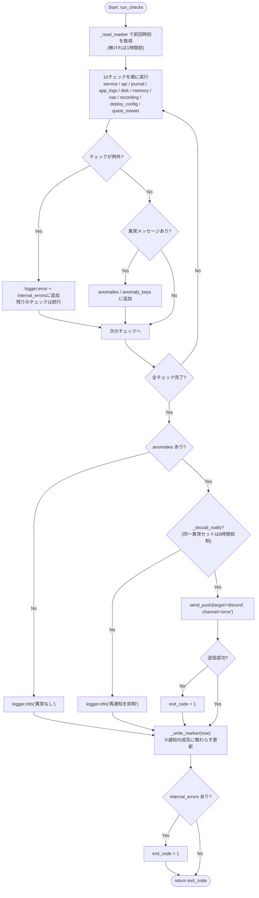

## 1. 解析メタ情報

| 項目 | 内容 |
| --- | --- |
| 対象ファイル | `monitors/health_watch.py` |
| 言語 | Python |
| 解析対象 | 提供されたコードのみ |
| 推測・補完 | 一切なし |
| 解析基準コミット | `0e15b41` (+ Issue #735 のチェック2追加、+ Issue #700 のチェック追加、+ 常時録画停止検知のチェック追加、+ 前記3件の統合によるチェック番号の振り直し) |

## 関連ドキュメント

* [config.md](./config.md) - `LOG_DIR`, `NAS_MOUNT_POINT`の設定値を提供
* [logger.md](./logger.md) - `setup_logging`の実体
* [notification_service.md](./notification_service.md) - `send_push`の実体
* [log_analyzer.md](./log_analyzer.md) - ログ走査に流用する`LogAnalyzer`クラスの実体
* [server_watchdog.md](./server_watchdog.md) - 同種のサービス監視（ただし`home_system.service`と同一プロセスツリー内で稼働）との棲み分けはdocstring参照
* [unified_server.md](./unified_server.md) - **（Issue #735 で追加）** チェック2のHTTPプローブが叩く`GET /health`（readiness。マイグレーション失敗時は503）と`GET /api/quest/data`の実体
* [quest_data.md](./quest_data.md) - **（Issue #700 で追加）** チェック9が比較するマスタ定義（`QUESTS`）の定義元
* [database.md](./database.md) - **（Issue #700 で追加）** チェック9が使う読み取り専用接続`get_ro_connection`の実体
* [sync_strict.md](./sync_strict.md) - **（Issue #700 で追加）** 乖離の「修正」側。検知(本ファイル)と同期(`sync_strict.py --if-stale`)は責務を分けている
* [quest_master_sync_marker.md](./quest_master_sync_marker.md) - **（Issue #700 で追加）** 同期側の冪等判定。本ファイルはマーカーを見ずDBとコードを直接比較する
* 運用設計: `docs/runbooks/raspi_claude_log_monitoring.md`（層1としての位置づけ・cron登録・死活監視との組み合わせ）

## 2. ファイルの概要

ラズパイの一次ヘルスチェックを行うcron想定のスクリプト。`home_system.service`の稼働状態、**unified_serverがHTTPに応答し、DBまで到達する経路も200を返すか(チェック2・Issue #735)**、journalctlのエラーログ、アプリログのERROR行、ディスク/メモリ使用率、NASマウント、実機構成(crontab/systemd/logrotate)とリポジトリ`deploy/`配下の一致(チェック8・構成ドリフト検知)、`quest_data.QUESTS`と実機DBの`quest_master`の一致(チェック9・マスタデータのドリフト検知)、カメラごとの常時録画(NVR)が止まっていないか(チェック10)の10項目を決定論的にチェックし、異常があればDiscordのerrorチャンネルへ要約を通知する。前回チェック時刻をマーカーファイルで管理してログ走査の重複を防ぎ、同一の異常セットが継続する間は再通知を6時間抑制する。自動復旧(systemctl restart等)は行わない。**Issue #339(層2)**: `config.HEALTH_WATCH_INVESTIGATE_HOOK`にスクリプトパスが設定されている場合のみ、通知と同じ抑制の内側で自動調査フック(`scripts/claude_investigate.sh`)を`_fire_investigate_hook()`によりfire-and-forget起動する。未設定(既定)なら従来どおり検知・通知のみ。**Issue #735 / AUDIT-005(チェック2)**: 既存のチェック1(`systemctl is-active`)も`server_watchdog`(`systemctl` + `pgrep`)も「プロセスが生きているか」しか見ておらず、マイグレーション失敗・DB破損・SQLiteの恒久ロック・イベントループ停止のような「プロセスは生存しているが全APIが500」という状態をどの監視も検知できなかった。本スクリプトはcron駆動でサーバーのプロセスツリーから完全に独立した唯一の監視であるため、ここに`check_api_responsive`によるHTTPプローブを追加した。**常時録画停止検知(チェック10)**: 録画は`nvr-*.service`のffmpegが担うが、2026-08〜09にparkingカメラが計12日ほど再起動ループしていても誰にも通知されなかった。カメラごとの録画フォルダの最新セグメント(ファイル名の時刻、CIFSではmtimeが書き込み中は進まないため)が`RECORDING_STALE_SEC`(30分)より古ければ異常とする。**Issue #700(チェック10)**: `quest_data.py`から退役させたクエストが実機の`quest_master`に残り続け、移設先(「きょうのすごろく」のステップ報酬)と二重報酬になっていた事故を受け、コードとDBの乖離を検知する項目を追加した。**検知のみで自動修正はしない**（同期の実行は`sync_strict.py --if-stale`の責務）。
* 根拠: モジュールdocstring (行番号: 9〜23 / 抜粋: "9. 実機構成(crontab / systemdユニット / logrotate設定)がリポジトリの deploy/ 配下と\n     一致しているか(構成ドリフト検知。", "10. `quest_data.QUESTS` と実機DBの `quest_master` が一致しているか")
* 根拠: モジュールdocstring (行番号: 28〜31 / 抜粋: "層2(Issue #339): config.HEALTH_WATCH_INVESTIGATE_HOOK にスクリプトパスが\n設定されている場合のみ、通知と同じ抑制の内側で自動調査フック")

## 3. 外部依存関係

### インポート一覧

| 名称 | 種類 | 用途 | 根拠 |
| --- | --- | --- | --- |
| `datetime` | 標準 | マーカー時刻の読み書き・経過時間計算 | 根拠: [インポート宣言] (行番号: 29 / 抜粋: "import datetime") |
| `difflib` | 標準 | 構成ファイル差分の要約(`unified_diff`) | 根拠: [インポート宣言] (行番号: 30 / 抜粋: "import difflib") |
| `glob` | 標準 | `logs/*.log`・`deploy/systemd/*.service`等のパターンマッチング | 根拠: [インポート宣言] (行番号: 31 / 抜粋: "import glob") |
| `hashlib` | 標準 | 異常セットのフィンガープリント生成 | 根拠: [インポート宣言] (行番号: 23 / 抜粋: "import hashlib") |
| `core.state_file`（Issue #661 で `json` の直接importを置き換え） | ローカルモジュール | マーカーファイル・再通知抑制状態ファイルの原子的な読み書き(`read_text`/`write_text_atomic`/`read_json`/`write_json_atomic`) | 根拠: [インポート宣言] (行番号: 43 / 抜粋: "from core import state_file") |
| `os` | 標準 | パス操作・マウント確認 | 根拠: [インポート宣言] (行番号: 25 / 抜粋: "import os") |
| `shutil` | 標準 | ディスク使用量取得 | 根拠: [インポート宣言] (行番号: 26 / 抜粋: "import shutil") |
| `sqlite3` | 標準 | **（Issue #700 で追加）** チェック9でDB/テーブル不在・一時的なロックを`OperationalError`として識別する | 根拠: [インポート宣言] (行番号: 38 / 抜粋: "import sqlite3") |
| `subprocess` | 標準 | `systemctl`/`journalctl`/`free`の実行 | 根拠: [インポート宣言] (行番号: 27 / 抜粋: "import subprocess") |
| `sys` | 標準 | パス追加・終了コード返却 | 根拠: [インポート宣言] (行番号: 28 / 抜粋: "import sys") |
| `requests` | 外部 | **（Issue #735 で追加）** チェック2のHTTPプローブ | 根拠: [インポート宣言] (行番号: 45 / 抜粋: "import requests") |
| `typing` | 標準 | 型ヒント(`List`, `Optional`, `Tuple`) | 根拠: [インポート宣言] (行番号: 38 / 抜粋: "from typing import List, Optional, Tuple") |
| `config` | 自作 | `LOG_DIR`, `NAS_MOUNT_POINT`の取得 | 根拠: [インポート宣言] (行番号: 33 / 抜粋: "import config") |
| `core.logger` | 自作 | ロガーのセットアップ | 根拠: [インポート宣言] (行番号: 34 / 抜粋: "from core.logger import setup_logging") |
| `services.notification_service` | 自作 | 異常通知の送信 | 根拠: [インポート宣言] (行番号: 35 / 抜粋: "from services.notification_service import send_push") |
| `monitors.log_analyzer` | 自作 | ログ走査ロジックの流用 | 根拠: [インポート宣言] (行番号: 36 / 抜粋: "from monitors.log_analyzer import LogAnalyzer") |
| `quest_data` | 自作 | **（Issue #700 で追加）** チェック9の比較元`QUESTS` | 根拠: [インポート宣言] (行番号: 46 / 抜粋: "import quest_data") |
| `core.database.get_ro_connection` | 自作 | **（Issue #700 で追加）** チェック9の読み取り専用DB接続 | 根拠: [インポート宣言] (行番号: 48 / 抜粋: "from core.database import get_ro_connection") |

なお、インポートに先立ち親ディレクトリを`sys.path`へ追加している（根拠: [パス操作] (行番号: 31 / 抜粋: "sys.path.append(os.path.abspath(os.path.join(os.path.dirname(__file__), '..')))")）。

### ブラックボックスとなる外部要素

| 名称 | 理由 | 根拠 |
| --- | --- | --- |
| `config.HEALTH_WATCH_PROBE_BASE_URL` / `..._TIMEOUT_SEC` / `..._DB_TIMEOUT_SEC` | **（Issue #735 で追加）** 外部ファイル(`config.py`・`.env`)で定義されており実値が不明。 | 根拠: [変数参照] (行番号: 300, 302〜303 / 抜粋: "base = config.HEALTH_WATCH_PROBE_BASE_URL.rstrip(\"/\")") |
| `config.LOG_DIR` / `config.NAS_MOUNT_POINT` | 外部ファイルで定義されており具体的な値が不明。 | 根拠: [変数参照] (行番号: 45, 47, 114, 158 / 抜粋: "os.path.join(config.LOG_DIR, ...)") |
| `setup_logging` | ロガーの具体的な設定が不明。 | 根拠: [関数呼び出し] (行番号: 38 / 抜粋: 'logger = setup_logging("health_watch")') |
| `send_push` | 送信処理の内部実装・エラー挙動が不明。 | 根拠: [関数呼び出し] (行番号: 225 / 抜粋: 'send_push([{"type": "text", "text": msg}], target="discord", channel="error")') |
| `LogAnalyzer` | 走査キーワード・タイムスタンプ解析の実装詳細は別ファイル。 | 根拠: [クラス利用] (行番号: 109〜118 / 抜粋: "analyzer = LogAnalyzer(days_back=0)") |
| 外部コマンド `systemctl`/`journalctl`/`free`/`crontab` | OS側コマンドの出力仕様に依存。 | 根拠: [外部コマンド実行] (行番号: 100〜103, 112〜119, 184, 243 / 抜粋: 'subprocess.run(["systemctl", "is-active", ...])', 'subprocess.run(["crontab", "-l"], ...)') |
| `quest_data.QUESTS` の内容 | **（Issue #700 で追加）** マスタ定義の実体は別ファイルで、ローカルオーバーレイの有無でも変わりうる。本ファイルは`id`の集合だけを参照する | 根拠: [集合生成] (行番号: 358 / 抜粋: 'master_ids = {q["id"] for q in quest_data.QUESTS}') |
| `core.database.get_ro_connection` | **（Issue #700 で追加）** 接続先(`config.SQLITE_DB_PATH`)・タイムアウトの詳細は`core/database.py`側 | 根拠: [DB読み取り] (行番号: 359〜361 / 抜粋: "with get_ro_connection() as conn:") |
| 実機側ファイル `/etc/systemd/system/*.service`・`/etc/logrotate.d/*` | 実機に導入済みの構成ファイル。存在・内容は実行環境に依存。 | 根拠: [定数定義] (行番号: 74〜77 / 抜粋: '(os.path.join(HOME_SYSTEM_DIR, "deploy", "systemd"), "*.service", "/etc/systemd/system")') |

## 4. 主要要素の定義（関数 / エンドポイント / コンポーネント）

### モジュール定数群

* **役割**: 監視対象サービス名(`WATCH_SERVICE_NAME`)、ディスク/メモリ閾値(90.0%)、マーカーファイルパス(`LOG_DIR/.claude_watch_marker`)、再通知抑制状態ファイルパス(`LOG_DIR/.claude_watch_notify_state`)、再通知間隔(6時間)、初回実行時の遡り時間(1時間)、通知抜粋の最大文字数(400)を定義する。加えてチェック8(構成ドリフト検知)用に、リポジトリルート(`REPO_ROOT`、本ファイルの2階層上)、リポジトリ管理のcrontab(`TRACKED_CRONTAB` = `deploy/cron/crontab`)、(リポジトリ側ディレクトリ, globパターン, 実機側導入先)の組(`TRACKED_CONFIG_DIRS`: `MY_HOME_SYSTEM/deploy/systemd/*.service`→`/etc/systemd/system`、`MY_HOME_SYSTEM/deploy/logrotate/*`→`/etc/logrotate.d`)、比較除外ファイル名(`CONFIG_IGNORE_BASENAMES` = `README.md`)、通知に載せる差分行の上限(`DIFF_LINES_LIMIT` = 3)を定義する。**（Issue #700 で追加）** さらにチェック9用に、通知へ載せる`quest_id`の最大件数(`QUEST_ID_LIST_LIMIT` = 8)を定義する。**（チェック10で追加）** 最新の録画セグメント開始時刻をどれだけ古いと「録画停止」とみなすかの閾値(`RECORDING_STALE_SEC` = 30分)を定義する。
* 根拠: [変数宣言] (行番号: 49〜62, 64〜81, 91 / 抜粋: 'WATCH_SERVICE_NAME: str = "home_system.service"', 'TRACKED_CRONTAB: str = os.path.join(REPO_ROOT, "deploy", "cron", "crontab")', 'QUEST_ID_LIST_LIMIT: int = 8', 'RECORDING_STALE_SEC: int = 30 * 60' ほか)

* **引数/リクエスト**: 該当なし
* 根拠: [変数宣言] (行番号: 41〜53)

* **戻り値/レスポンス**: 該当なし
* 根拠: [変数宣言] (行番号: 41〜53)

* **副作用**: なし
* 根拠: [変数宣言] (行番号: 41〜53)

* **エラーハンドリング**: なし
* 根拠: [変数宣言] (行番号: 41〜53)

### `_read_marker`

* **役割**: マーカーファイルから前回チェック完了時刻(ISO8601)を読み取る。**（Issue #661で修正）** ファイルの読み取り自体は`core/state_file.py`の`read_text`へ委譲し、返ってきた文字列を`datetime.fromisoformat`でパースする形に整理した。
* 根拠: `def _read_marker() -> datetime.datetime:` (行番号: 112 / 抜粋: "def _read_marker() -> datetime.datetime:")

* **引数/リクエスト**: なし
* 根拠: `def _read_marker() -> datetime.datetime:` (行番号: 112 / 抜粋: "def _read_marker() -> datetime.datetime:")

* **戻り値/レスポンス**: `datetime.datetime`。ファイルが無い/空/ISO8601としてパースできない場合は現在時刻から`DEFAULT_LOOKBACK_SEC`(3600秒)遡った時刻。
* 根拠: [フォールバック] (行番号: 97 / 抜粋: "return datetime.datetime.now() - datetime.timedelta(seconds=DEFAULT_LOOKBACK_SEC)")

* **副作用**: マーカーファイルの読み取り（`state_file.read_text`経由）。
* 根拠: [state_fileへの委譲] (行番号: 92 / 抜粋: "raw = state_file.read_text(MARKER_FILE)")

* **エラーハンドリング**: ファイルI/Oの失敗は`state_file.read_text`側が捕捉して警告ログを出し`None`を返す。本関数は加えて`fromisoformat`の`ValueError`を捕捉し、いずれの場合も既定の遡り時刻を返す。
* 根拠: [例外処理] (行番号: 95-96 / 抜粋: "except ValueError:")

### `_write_marker`

* **役割**: チェック開始時刻をISO8601文字列でマーカーファイルへ書き込む。**（Issue #661で修正）** 書き込みは`core/state_file.py`の`write_text_atomic`へ委譲し、一時ファイル + `fsync` + `os.replace`による原子的な差し替えになった（途中で電源断・クラッシュしても不完全な内容が残らない）。
* 根拠: `def _write_marker(dt: datetime.datetime) -> None:` (行番号: 128 / 抜粋: "def _write_marker(dt: datetime.datetime) -> None:")

* **引数/リクエスト**: `dt: datetime.datetime`
* 根拠: `def _write_marker(dt: datetime.datetime) -> None:` (行番号: 128 / 抜粋: "def _write_marker(dt: datetime.datetime) -> None:")

* **戻り値/レスポンス**: `None`
* 根拠: `def _write_marker(dt: datetime.datetime) -> None:` (行番号: 128 / 抜粋: "def _write_marker(dt: datetime.datetime) -> None:")

* **副作用**: マーカーファイルの原子的な差し替え（`state_file.write_text_atomic`経由）。
* 根拠: [state_fileへの委譲] (行番号: 101 / 抜粋: "state_file.write_text_atomic(MARKER_FILE, dt.isoformat())")

* **エラーハンドリング**: 例外は`state_file.write_text_atomic`側が捕捉して警告ログを出し`False`を返すため、本関数からは送出されない（**Issue #661 での変更点**: 以前は書き込みの失敗がそのまま呼び出し元へ伝播していた）。
* 根拠: [state_fileへの委譲] (行番号: 101 / 抜粋: "state_file.write_text_atomic(MARKER_FILE, dt.isoformat())")

### `check_service_active`

* **役割**: `systemctl is-active`で`home_system.service`の稼働状態を確認する。
* 根拠: [関数定義] (行番号: 139〜148 / 抜粋: "def check_service_active() -> Optional[str]:")

* **引数/リクエスト**: なし
* 根拠: [関数定義] (行番号: 70)

* **戻り値/レスポンス**: `Optional[str]`。activeでない場合に状態文字列を含む異常メッセージ、activeなら`None`。標準出力が空の場合は状態を"unknown"として扱う。
* 根拠: [戻り値] (行番号: 76〜79 / 抜粋: 'status = res.stdout.strip() or "unknown"')

* **副作用**: 外部コマンド`systemctl`の実行。
* 根拠: [外部コマンド実行] (行番号: 72〜75 / 抜粋: '["systemctl", "is-active", WATCH_SERVICE_NAME]')

* **エラーハンドリング**: 関数内には無し（`subprocess.run`は`check=False`。例外は`run_checks`側で捕捉される）。
* 根拠: [引数指定] (行番号: 74 / 抜粋: "capture_output=True, text=True, check=False,")

### `check_api_responsive` (**チェック2: HTTPプローブ、Issue #735 / AUDIT-005 で追加**)

* **役割**: `unified_server`に実際にHTTPリクエストを送り、「プロセスは生きているが機能していない」状態を検知する。`GET /health`（readiness。マイグレーション失敗時は503を返す）と`GET /api/quest/data`（DBまで到達する経路。`/health`はDBを触らないため別に確認する）の2本を順に叩き、いずれかが200以外なら異常とする。
* 根拠: [関数定義] (行番号: 295〜325 / 抜粋: "def check_api_responsive() -> Optional[str]:")、[プローブ定義] (行番号: 301〜304 / 抜粋: '("/health", config.HEALTH_WATCH_PROBE_TIMEOUT_SEC),')

* **引数/リクエスト**: なし
* 根拠: [関数定義] (行番号: 295 / 抜粋: "def check_api_responsive() -> Optional[str]:")

* **戻り値/レスポンス**: `Optional[str]`。2本とも200なら`None`。200以外なら「どのパスが何を返したか」＋レスポンス本文の先頭200文字（改行を空白に置換）を含む異常メッセージ。接続不能・タイムアウト等の`requests.exceptions.RequestException`は例外を送出せず、例外クラス名を含む異常メッセージとして返す。
* 根拠: [戻り値] (行番号: 306〜311 / 抜粋: 'return f"GET {path} が {res.status_code} を返しました: {body}"')

* **副作用**: 外部へのHTTPリクエスト（既定では`http://127.0.0.1:8000`。ループバックのため実質ローカルのみ）。
* 根拠: [HTTP呼び出し] (行番号: 306 / 抜粋: "res = requests.get(f\"{base}{path}\", timeout=timeout)")

* **エラーハンドリング**: `requests.exceptions.RequestException`のみ捕捉し、異常メッセージとして返す（**例外のまま送出しないのは意図的**。`run_checks`は例外を`internal_errors`扱いにして通知本文へ載せないため、サーバー停止という最重要の異常が通知されなくなる）。
* 根拠: [例外処理] (行番号: 307〜308 / 抜粋: "except requests.exceptions.RequestException as e:")

### `check_journal_errors`

* **役割**: `journalctl -u home_system.service` で前回マーカー以降のエラーを確認する。見るのは (1) systemd 自身が `err..emerg` で記録したもの(ユニットの異常終了等)と、(2) サービスの標準出力・標準エラー経由の行のうちエラーと判定されるもの(`_journal_stdio_errors`)の2種類。
* **（2026-09-19 修正）標準出力・標準エラー経由のエラーを見るようにした**: journald はサービスの標準出力・標準エラーの行を priority **info** で記録するため、従来の `-p err..emerg` だけでは一切拾えていなかった。`home_system.service` を `Type=simple`(Issue #646)へ移行して以降、未捕捉例外のトレースバックや basicConfig のままのライブラリログ(`ERROR:zeep...` 等)は journal にしか残らない(以前は `start_all.sh` が `logs/server_boot.log` へリダイレクトしており、`check_app_logs` のキーワード判定で拾えていた。移行後 `server_boot.log` は更新されない)。実機の journal で、移行後に `Traceback` と `ERROR:zeep...` が info で8行残っていたのに、修正前の本チェックは0行だったことを確認している。`_journal_stdio_errors` は `journalctl -o cat -n 2000` の各行を `LogAnalyzer._classify_line` で判定し、`core.logger` の書式(`YYYY-MM-DD HH:MM:SS [LEVEL] ...`)の行は `logs/*.log` 側で `check_app_logs` が見るため二重計上しないよう除外する。`LogAnalyzer.IGNORE_PATTERNS` も適用する。
* 根拠: [関数定義] `def _journal_stdio_errors(since_str: str) -> list[str]:`、[core.logger 書式の除外] `core_logger_line = LogAnalyzer.LEVEL_PATTERNS[0]`(回帰テスト: `tests/test_health_watch.py` の `TestJournalStdioErrors`)
* 根拠: [関数定義] (行番号: 151〜193 / 抜粋: "def check_journal_errors(since: datetime.datetime) -> Optional[str]:")

* **引数/リクエスト**: `since: datetime.datetime`（`--since`に"%Y-%m-%d %H:%M:%S"形式で渡す）
* 根拠: [関数定義] (行番号: 82, 87 / 抜粋: '"--since", since.strftime("%Y-%m-%d %H:%M:%S")')

* **戻り値/レスポンス**: `Optional[str]`。該当行があれば件数と末尾3行の抜粋(最大`SNIPPET_LIMIT`文字)を含むメッセージ、無ければ`None`。"--"で始まる区切り行("-- No entries --"等)は行数に含めない。
* 根拠: [戻り値] (行番号: 92〜99 / 抜粋: 'if ln and not ln.startswith("--")')

* **副作用**: 外部コマンド`journalctl`の実行（最大100行取得）。
* 根拠: [外部コマンド実行] (行番号: 84〜91 / 抜粋: '"-p", "err..emerg", "-n", "100"')

* **エラーハンドリング**: 関数内には無し（例外は`run_checks`側で捕捉される）。
* 根拠: [引数指定] (行番号: 90 / 抜粋: "capture_output=True, text=True, check=False,")

### `check_app_logs`

* **（2026-09-06 品質監査で修正）** `logs/*.log` の走査で `health_watch.log` に加えて `claude_investigate.log`(層2フック `_run_investigation_hook` の出力先)もファイル名で除外する。以前は「`health_watch` を含む行の除外」しか無く、フックの調査結果本文に常在する `ERROR`/`Traceback` 等の語が翌回のチェックで新規エラーとして数えられ、再発報→フック再起動→さらに出力、という自己増殖ループになり得た(本仕様書・runbook では除外済みと記載されていたが未実装だった)。
* 根拠: (行番号: 120〜126 / 抜粋: "if os.path.basename(filepath) in (\"health_watch.log\", \"claude_investigate.log\"):\n            continue")

* **役割**: `config.LOG_DIR`配下の`*.log`から前回マーカー以降のエラー行を検出する。キーワード・除外パターン・タイムスタンプ解析は`LogAnalyzer`を流用し、週次の`log_analyzer.py`と判定基準を揃える。エラー(errors > 0)のみを異常とみなし、WARNINGは対象外。
* 根拠: [関数定義] (行番号: 221〜261 / 抜粋: "def check_app_logs(since: datetime.datetime) -> Optional[str]:")

* **引数/リクエスト**: `since: datetime.datetime`（`analyzer.start_date`へ直接代入し「前回マーカー以降」のみを走査対象にする）
* 根拠: [属性代入] (行番号: 115 / 抜粋: "analyzer.start_date = since")

* **戻り値/レスポンス**: `Optional[str]`。エラーのあるファイルがあれば最大5ファイル分のファイル名・件数・最終エラー抜粋(最大120文字)を列挙したメッセージ、無ければ`None`。
* 根拠: [戻り値] (行番号: 134〜142 / 抜粋: 'errors = {f: d for f, d in analyzer.report_data.items() if d["errors"] > 0}')

* **副作用**: `LogAnalyzer._analyze_file`によるログファイル読み取り。自己発火防止のため、(1)インスタンスの`IGNORE_PATTERNS`に"health_watch"を追加し、(2)`health_watch.log`自体は走査対象から除外する。(3) Issue #339層2調査で発覚した誤検知バグの修正として、`LogAnalyzer._is_recent_file`によるmtime足切りを週次の`run_analysis`と同様に適用し、`pip_install.log`のように行に一切タイムスタンプが無く`_analyze_file`側のフィルタが効かないファイルが、中身の更新有無に関わらず毎回無条件に「新規エラー」として再カウントされる状態を防ぐ。
* 根拠: [自己発火対策] (行番号: 118, 120〜121 / 抜粋: 'analyzer.IGNORE_PATTERNS = analyzer.IGNORE_PATTERNS + ["health_watch"]', 'if os.path.basename(filepath) == "health_watch.log":')、[mtime足切り] (行番号: 123〜131 / 抜粋: "if not analyzer._is_recent_file(filepath):")

* **エラーハンドリング**: 関数内には無し（例外は`run_checks`側で捕捉される。なお`_analyze_file`自体はファイル単位で例外を握りつぶす実装であることは[log_analyzer.md](./log_analyzer.md)参照）。
* 根拠: [関数定義] (行番号: 107〜142)

### `check_disk_usage`

* **役割**: ルートファイルシステムの使用率を`shutil.disk_usage("/")`で取得し、閾値(90%)超過を判定する。
* 根拠: [関数定義] (行番号: 132〜138 / 抜粋: 'total, used, _free = shutil.disk_usage("/")')

* **引数/リクエスト**: なし
* 根拠: [関数定義] (行番号: 132)

* **戻り値/レスポンス**: `Optional[str]`。使用率が`DISK_THRESHOLD_PERCENT`以上なら使用率を含むメッセージ、未満なら`None`。
* 根拠: [戻り値] (行番号: 136〜138 / 抜粋: "if percent >= DISK_THRESHOLD_PERCENT:")

* **副作用**: なし（読み取りのみ）
* 根拠: [関数定義] (行番号: 132〜138)

* **エラーハンドリング**: 関数内には無し（例外は`run_checks`側で捕捉される）。
* 根拠: [関数定義] (行番号: 132〜138)

### `check_memory_usage`

* **役割**: `free -m`の出力2行目からメモリ使用率(used/total)を計算し、閾値(90%)超過を判定する。
* 根拠: [関数定義] (行番号: 141〜153 / 抜粋: 'res = subprocess.run(["free", "-m"], ...)')

* **引数/リクエスト**: なし
* 根拠: [関数定義] (行番号: 141)

* **戻り値/レスポンス**: `Optional[str]`。使用率が`MEMORY_THRESHOLD_PERCENT`以上ならメッセージ、未満なら`None`。
* 根拠: [戻り値] (行番号: 151〜153 / 抜粋: "if percent >= MEMORY_THRESHOLD_PERCENT:")

* **副作用**: 外部コマンド`free`の実行。
* 根拠: [外部コマンド実行] (行番号: 143 / 抜粋: 'subprocess.run(["free", "-m"], ...)')

* **エラーハンドリング**: 出力が2行未満の場合`RuntimeError`を送出する（`run_checks`側で捕捉される）。
* 根拠: [例外送出] (行番号: 145〜146 / 抜粋: 'raise RuntimeError("free -m の出力を解析できません")')

### `check_nas_mount`

* **役割**: `config.NAS_MOUNT_POINT`がマウントポイントであるかを`os.path.ismount`で確認する。
* 根拠: [関数定義] (行番号: 156〜160 / 抜粋: "if not os.path.ismount(config.NAS_MOUNT_POINT):")

* **引数/リクエスト**: なし
* 根拠: [関数定義] (行番号: 156)

* **戻り値/レスポンス**: `Optional[str]`。マウントされていなければメッセージ、されていれば`None`。
* 根拠: [戻り値] (行番号: 158〜160)

* **副作用**: なし（読み取りのみ）
* 根拠: [関数定義] (行番号: 156〜160)

* **エラーハンドリング**: 関数内には無し（例外は`run_checks`側で捕捉される）。
* 根拠: [関数定義] (行番号: 156〜160)

### `_latest_recording_time` (**チェック10で追加**)

* **役割**: 録画フォルダ内の当日・前日分の`{YYYYMMDD}_*.mp4`を列挙し、ファイル名の新しい順に先頭15文字を`%Y%m%d_%H%M%S`として解釈できた最初のものの時刻(最新セグメントの開始時刻)を返す。CIFS越しに保持期間分を毎回列挙しないよう当日と前日(日付の変わり目用)に絞る。
* 根拠: `def _latest_recording_time(folder: str, now: datetime.datetime) -> datetime.datetime | None:` (行番号: 328)

* **引数/リクエスト**: `folder`(録画フォルダの絶対パス)、`now`(基準時刻。当日・前日の日付算出に使う)
* 根拠: `def _latest_recording_time(folder: str, now: datetime.datetime) -> datetime.datetime | None:` (行番号: 328)

* **戻り値/レスポンス**: `datetime.datetime | None`(JSTのaware datetime。`JST = ZoneInfo("Asia/Tokyo")`を付与)。該当ファイルが無い、または全ファイル名が解釈できなければ`None`。
* 根拠: [戻り値] (抜粋: "return datetime.datetime.strptime(name[:15], \"%Y%m%d_%H%M%S\").replace(tzinfo=JST)", "return None")

* **副作用**: なし（`glob.glob`による読み取りのみ）
* 根拠: [処理] (抜粋: "names.extend(os.path.basename(p) for p in glob.glob(pattern))")

* **エラーハンドリング**: 形式外のファイル名は`ValueError`を捕捉して次の候補へ進む。
* 根拠: [例外処理] (抜粋: "except ValueError:\n            continue")

### `check_recording_stalled` (**チェック10: 常時録画の停止検知で追加**)

* **役割**: `config.CAMERAS`の有効なカメラごとに、`config.NVR_RECORD_DIR`配下の録画フォルダ(`nas_folder`、無ければ`name`)の最新セグメント開始時刻を`_latest_recording_time`で求め、当日・前日のファイルが無いか、`RECORDING_STALE_SEC`(30分)より古ければ異常として列挙する。録画自体は`nvr-*.service`(systemd)のffmpegが600秒ごとに新しいファイルを作る前提で、カメラに繋がらない間の再試行ループや無応答のまま固まった状態を「新しいセグメントが作られていない」ことで検知する。更新時刻(mtime)ではなくファイル名の時刻を使うのは、このNAS(CIFS)では書き込み中のファイルのmtimeが作成時刻のまま進まないため。
* 根拠: `def check_recording_stalled() -> str | None:` (行番号: 346)

* **引数/リクエスト**: なし
* 根拠: `def check_recording_stalled() -> str | None:` (行番号: 346)

* **戻り値/レスポンス**: `str | None`。基準時刻は`core.utils.get_now_jst()`(実行環境のTZに依存しない)。停止の疑いがあるカメラがあれば`"常時録画が止まっている可能性があります:"`に続けてカメラごとの1行(`{name}({folder}): 最新の録画が MM/DD HH:MM 開始(N分前)`、またはファイル無し)を並べたメッセージ、無ければ`None`。
* 根拠: [戻り値] (抜粋: "return \"常時録画が止まっている可能性があります:\\n\" + \"\\n\".join(stalled)")

* **副作用**: なし（NASの読み取りのみ）
* 根拠: [処理] (抜粋: "latest = _latest_recording_time(os.path.join(config.NVR_RECORD_DIR, folder_name), now)")

* **エラーハンドリング**: NAS未マウント時はチェック7が報告するため判定せず`None`を返す。`enabled`が偽のカメラは対象外。その他の例外は`run_checks`側で捕捉される。
* 根拠: [条件分岐] (抜粋: "if not os.path.ismount(config.NAS_MOUNT_POINT):\n        return None", "if not cam.get(\"enabled\", True):\n            continue")

### `_normalize_config_lines`

* **役割**: 構成ファイルの比較用正規化。各行の行末空白を落とし、空行と`#`始まりのコメント行を除いた行リストを返す(`crontab -e`で付くヘッダや環境依存のコメント差を差分とみなさないため)。
* 根拠: [関数定義] (行番号: 204〜218 / 抜粋: 'if not line or line.lstrip().startswith("#"):')

* **引数/リクエスト**: `text: str`
* 根拠: [関数定義] (行番号: 204)

* **戻り値/レスポンス**: `List[str]`
* 根拠: [戻り値] (行番号: 218)

* **副作用**: なし
* 根拠: [関数定義] (行番号: 204〜218)

* **エラーハンドリング**: なし
* 根拠: [関数定義] (行番号: 204〜218)

### `_config_diff_summary`

* **役割**: リポジトリ側(`expected`)と実機側(`actual`)を`_normalize_config_lines`で正規化して比較し、一致すれば`None`、差分があれば`difflib.unified_diff`(`n=0`)の`+`/`-`行(ヘッダ行`+++`/`---`は除外)を先頭`DIFF_LINES_LIMIT`本まで各80文字で連結した1行要約(`"<label>: 差分 N行 (...; ... ほかM行)"`)を返す。
* 根拠: [関数定義] (行番号: 221〜234 / 抜粋: 'return f"{label}: 差分 {len(changes)}行 ({shown}{more})"')

* **引数/リクエスト**: `label: str`, `expected: str`, `actual: str`
* 根拠: [関数定義] (行番号: 221)

* **戻り値/レスポンス**: `Optional[str]`
* 根拠: [戻り値] (行番号: 226, 234)

* **副作用**: なし
* 根拠: [関数定義] (行番号: 221〜234)

* **エラーハンドリング**: なし
* 根拠: [関数定義] (行番号: 221〜234)

### `_check_crontab_drift`

* **役割**: `TRACKED_CRONTAB`が存在しなければ比較対象外として`None`を返す。存在すれば`crontab -l`を実行し、終了コード非0なら未登録として`"crontab: 実機に未登録です (<stderr/stdoutの先頭行>)"`を、成功時は`_config_diff_summary("crontab", ...)`の結果を返す。
* 根拠: [関数定義] (行番号: 237〜249 / 抜粋: 'res = subprocess.run(["crontab", "-l"], capture_output=True, text=True, check=False)')

* **引数/リクエスト**: なし
* 根拠: [関数定義] (行番号: 237)

* **戻り値/レスポンス**: `Optional[str]`
* 根拠: [戻り値] (行番号: 240, 248, 249)

* **副作用**: `crontab -l`の実行(読み取りのみ)
* 根拠: [外部コマンド実行] (行番号: 243)

* **エラーハンドリング**: `crontab`コマンドの非0終了は「未登録」として異常文字列で報告する。コマンド自体が存在しない場合(`FileNotFoundError`)等の例外は関数内で捕捉せず、`run_checks`側の内部エラー扱いになる。
* 根拠: [分岐] (行番号: 244〜248)

### `_check_host_files_drift`

* **役割**: `TRACKED_CONFIG_DIRS`の各組について、リポジトリ側ディレクトリでglobに一致するファイル(`CONFIG_IGNORE_BASENAMES`を除く)ごとに、実機側ディレクトリの同名ファイルと`_config_diff_summary`で比較する。実機側が無ければ`"<path>: 実機に未導入です"`、読み取れなければ`"<path>: 読み取れません (<例外クラス名>)"`、差分があればその要約を、所見リストとして返す。
* 根拠: [関数定義] (行番号: 252〜275 / 抜粋: 'findings.append(f"{host_path}: 実機に未導入です")')

* **引数/リクエスト**: なし
* 根拠: [関数定義] (行番号: 252)

* **戻り値/レスポンス**: `List[str]`(異常が無ければ空リスト)
* 根拠: [戻り値] (行番号: 275)

* **副作用**: なし(ファイル読み取りのみ)
* 根拠: [関数定義] (行番号: 252〜275)

* **エラーハンドリング**: 実機側ファイルの`FileNotFoundError`は「未導入」、その他の`OSError`は「読み取れません」として所見に変換し、残りのファイルの比較を続行する。リポジトリ側ファイルの読み取り失敗は捕捉しない。
* 根拠: [例外処理] (行番号: 264〜270)

### `check_deploy_config_drift` (**チェック8: 構成ドリフト検知**)

* **役割**: `_check_crontab_drift`と`_check_host_files_drift`の所見をまとめ、1件でもあれば`"実機構成がリポジトリ(deploy/)と一致しません:"`に続けて各所見を箇条書きし、末尾に対処の指針(実機側が正なら`deploy/`へ反映してコミット、リポジトリ側が正なら各READMEの導入手順で再導入)を付けた異常メッセージを返す。無ければ`None`。docstringに、各READMEの「実機を変更したらこのファイルにも反映してコミット」という人手の同期の反映漏れを機械的に検知する目的と、自動での書き戻しは行わない旨が明記されている。
* 根拠: [関数定義] (行番号: 278〜297 / 抜粋: '"実機構成がリポジトリ(deploy/)と一致しません:\\n"')

* **引数/リクエスト**: なし
* 根拠: [関数定義] (行番号: 278)

* **戻り値/レスポンス**: `Optional[str]`
* 根拠: [戻り値] (行番号: 291〜297)

* **副作用**: なし(`crontab -l`の実行とファイル読み取りのみ)
* 根拠: [関数定義] (行番号: 278〜297)

* **エラーハンドリング**: 関数内には無し(下位関数で捕捉されない例外は`run_checks`側で内部エラーとして捕捉される)。
* 根拠: [関数定義] (行番号: 278〜297)

### `_format_quest_ids` (**Issue #700で追加**)

* **役割**: `quest_id`の一覧を通知用の文字列に整形する。先頭`QUEST_ID_LIST_LIMIT`(8)件までをカンマ区切りで並べ、それを超える分は`" ほかN件"`に畳む。
* 根拠: `def _format_quest_ids(quest_ids: list[int]) -> str:` (行番号: 470〜475)

* **引数/リクエスト**: `quest_ids: list[int]`
* 根拠: `def _format_quest_ids(quest_ids: list[int]) -> str:` (行番号: 470)

* **戻り値/レスポンス**: `str`
* 根拠: [戻り値] (行番号: 328 / 抜粋: "return shown")

* **副作用**: なし(純粋関数)
* 根拠: [関数本体] (行番号: 325〜328)

* **エラーハンドリング**: なし
* 根拠: [関数本体] (行番号: 325〜328)

### `check_quest_master_drift` (**チェック9: マスタデータのドリフト検知、Issue #700で追加**)

* **役割**: `quest_data.QUESTS`の`id`集合と、DBの`quest_master.quest_id`集合を比較し、(1)DBにだけある＝退役済みなのに残っているクエスト、(2)コードにだけある＝DBに未登録のクエスト、の双方を異常メッセージとして返す。どちらも無ければ`None`。メッセージ末尾には`sync_strict.py --dry-run`で影響を確認してから同期する旨の指針を付ける。`quest_data.QUESTS`が空の場合は「全件が退役済み」という誤報を避け、マスタ定義の読み込み失敗の可能性として別メッセージを返す。docstringには、**検知のみで自動修正はしない**（同期は`sync_strict.py --if-stale`の責務であり、毎時cronのヘルスチェックから破壊的操作を走らせない）こと、および比較対象を`quest_master`の`quest_id`集合に絞る理由（`reward_master`は`user_inventory`から参照が残る報酬を削除しない正しい挙動があり恒久的な誤検知になる、`routine_data.py`は対応するマスタテーブルを持たない）が明記されている。
* 根拠: `def check_quest_master_drift() -> str | None:` (行番号: 478〜536)

* **引数/リクエスト**: なし
* 根拠: `def check_quest_master_drift() -> str | None:` (行番号: 478)

* **戻り値/レスポンス**: `str | None`(異常メッセージ、正常なら`None`)
* 根拠: [戻り値] (行番号: 374、385〜389 / 抜粋: "return None")

* **副作用**: DBの読み取りのみ(`get_ro_connection`による`mode=ro`接続で、SQLite側が書き込みを拒否する)。
* 根拠: [DB読み取り] (行番号: 359〜361 / 抜粋: "with get_ro_connection() as conn:")

* **エラーハンドリング**: `sqlite3.OperationalError`(DBファイル・テーブルの不在、一時的なロック)は警告ログのみでスキップし`None`を返す — 毎時cronで走るため、DB不在の環境で恒久的に失敗し続けるのを避ける方針がdocstringに明記されている。それ以外の例外は`run_checks`側で内部エラーとして捕捉される。
* 根拠: [例外処理] (行番号: 362〜364 / 抜粋: "except sqlite3.OperationalError as e:")

### `_ORPHAN_CHECKS_STRICT` / `_ORPHAN_CHECKS_EXPECTED` (**モジュール定数、Issue #747で追加**)

* **役割**: 参照整合性を検査する `(ラベル, SQL)` の組。**2層に分かれているのが本質**で、一方は「起きてはならない不整合」、もう一方は「通常運用の設計どおりに生じる不整合」である。前者だけを通知する。
  * `_ORPHAN_CHECKS_STRICT`（6件）: 親が `quest_users`（`quest_history.user_id` / `reward_history.user_id` / `user_inventory.user_id` / `routine_progress.user_id` / `routine_step_events.user_id`）と自己参照の `quest_history.linked_history_id`。実行コードに `DELETE FROM quest_users` が存在しないため、ここの孤児は手動SQL・将来のスクリプトの事故しかありえない。
  * `_ORPHAN_CHECKS_EXPECTED`（2件）: 親が `quest_master` / `reward_master`（`quest_history.quest_id` / `reward_history.reward_id`）。`GameSystem.sync_master_data` の `DELETE ... WHERE quest_id NOT IN (...)` はクエストを退役させると**設計どおりマスタ行を消して履歴行を残す**（#700 で退役6件を実際に削除している）ため、孤児は想定内。毎時cronで「異常」として報告すると恒久的な誤検知になる。`check_quest_master_drift` が `reward_master` を比較対象から外したのと同じ判断。
* 根拠: `_ORPHAN_CHECKS_STRICT: tuple[tuple[str, str], ...] = (` (行番号: 537 / 抜粋: "_ORPHAN_CHECKS_STRICT: tuple[tuple[str, str], ...] = (")

`quest_id = 0` は `inventory_service` のアイテム使用ログでマスタを参照しない疑似IDのため、`_ORPHAN_CHECKS_EXPECTED` の SQL が `h.quest_id != 0` で除外している。

### `check_orphaned_rows` (**チェック11: 参照整合性の検知、Issue #747で追加**)

* **役割**: `_ORPHAN_CHECKS_STRICT` に1件でも孤児があれば異常メッセージを返し、無ければ `None`。`_ORPHAN_CHECKS_EXPECTED` の件数は**通知せず `logger.info` に残すだけ**にする（FK を張れるか＝Issue #747 のステップ3へ進めるかの判断材料になるため、通知しないが記録は必ず残す）。`PRAGMA foreign_keys=ON` を設定しているのに外部キー宣言が `user_inventory.reward_id` の1つしかなく、「本来DBが防げる不整合」への防御がサービス層の個別の None チェックとして散在している（監査の根本原因 RC-5）。SQLite で FK を追加するにはテーブル再作成が必要なため、まず孤児の実数を測るのが本チェックの役割である。**検知のみで自動修正はしない**（孤児行の削除は不可逆で、子行を消すべきか親を復活させるべきかは中身を見ないと決められない）。
* 根拠: `def check_orphaned_rows() -> str | None:` (行番号: 595 / 抜粋: "def check_orphaned_rows(")

* **引数/リクエスト**: なし
* 根拠: `def check_orphaned_rows() -> str | None:` (行番号: 595)

* **戻り値/レスポンス**: `str | None`（`_ORPHAN_CHECKS_STRICT` に孤児があれば異常メッセージ、無ければ `None`）
* 根拠: `def check_orphaned_rows() -> str | None:` (行番号: 595)

* **副作用**: DBの読み取りのみ（`get_ro_connection` による `mode=ro` 接続）。加えて `_ORPHAN_CHECKS_EXPECTED` の件数を `logger.info` へ出力する。
* 根拠: `def check_orphaned_rows() -> str | None:` (行番号: 595)

* **エラーハンドリング**: `sqlite3.OperationalError`（DBファイル・テーブルの不在、一時的なロック）は警告ログのみでスキップし `None` を返す（`check_quest_master_drift` と同じ方針。毎時cronで走るため、DB不在の環境で恒久的に失敗し続けるのを避ける）。それ以外の例外は `run_checks` 側で内部エラーとして捕捉される。
* 根拠: `def check_orphaned_rows() -> str | None:` (行番号: 595)

### `_should_notify`

* **役割**: 異常セット(チェック名の組)のSHA-256フィンガープリントを前回通知時と比較し、同一セットが`RENOTIFY_INTERVAL_SEC`(6時間)内に再検知された場合は通知を抑制する。通知する場合は状態ファイルを更新する。
* 根拠: [関数定義] (行番号: 163〜182 / 抜粋: 'fingerprint = hashlib.sha256("|".join(sorted(anomaly_keys)).encode()).hexdigest()')

* **引数/リクエスト**: `anomaly_keys: List[str]`, `now: datetime.datetime`
* 根拠: [関数定義] (行番号: 163)

* **戻り値/レスポンス**: `bool`（通知すべきならTrue、抑制ならFalse）
* 根拠: [戻り値] (行番号: 176, 182 / 抜粋: "return False", "return True")

* **副作用**: 通知する判定の場合、状態ファイル(`NOTIFY_STATE_FILE`)へフィンガープリントと通知時刻(JSON)を書き込む。**（Issue #661で修正）** 読み書きはいずれも`core/state_file.py`(`read_json`/`write_json_atomic`)へ委譲し、書き込みは原子的な差し替えになった。
* 根拠: [state_fileへの委譲] (行番号: 326-328 / 抜粋: "state_file.write_json_atomic(\n        NOTIFY_STATE_FILE, {\"fingerprint\": fingerprint, \"last_notified\": now.isoformat()}\n    )")

* **エラーハンドリング**: 状態ファイルが読めない・壊れている場合は`state_file.read_json`が`None`を返し、`last_notified`のパースに失敗した場合は`KeyError`/`TypeError`/`ValueError`を捕捉する。いずれも通知する側(True)に倒す（異常の通知を取りこぼすより重複通知の方が安全側）。
* 根拠: [例外処理] (行番号: 324-325 / 抜粋: "except (KeyError, TypeError, ValueError):")

### `_fire_investigate_hook` (**Issue #339で追加**)

* **役割**: 層2(自動調査)フックの発火。`config.HEALTH_WATCH_INVESTIGATE_HOOK`が未設定なら即return(既定・完全no-op)。設定済みならパスの存在と実行権限を確認し、異常サマリ(検知時刻+各異常の箇条書き)を標準入力で渡してフックスクリプトをfire-and-forgetのサブプロセスとして起動する(完了を待たない。毎時cronの層1を長時間ブロックしないため)。`run_checks`内の`_should_notify`通過後にのみ呼ばれるため、同一異常セット継続中の再発火は通知と同じ6時間間隔に収まる。
* 根拠: [関数定義] (行番号: 664〜707 / 抜粋: "def _fire_investigate_hook(anomalies: List[str], now: datetime.datetime) -> None:")

* **引数/リクエスト**: `anomalies: List[str]`（各チェックの異常メッセージ）、`now: datetime.datetime`（検知時刻）
* 根拠: [関数定義] (行番号: 190)

* **戻り値/レスポンス**: `None`
* 根拠: [関数定義] (行番号: 190)

* **副作用**: `subprocess.Popen`によるフックスクリプトの起動（`start_new_session=True`でdetachし、層1プロセス終了後も生存させる）、フックの標準出力/標準エラーの`logs/claude_investigate.log`への追記リダイレクト（`check_app_logs` は `claude_investigate.log` をファイル名で除外するため自己発火しない。**（2026-09-06 品質監査で修正）** 以前は除外が未実装だった）、標準入力への異常サマリ書き込みとclose、ロガーへの記録。
* 根拠: [Popen呼び出し] (行番号: 532〜543 / 抜粋: "proc = subprocess.Popen(\n                [hook],\n                stdin=subprocess.PIPE,", "start_new_session=True")
* **（Issue #761 / AUDIT-032 で追加）** 標準入力へ書き込む直前に`assert proc.stdin is not None`を置いている。`Popen`に`stdin=subprocess.PIPE`を指定しているため`None`にはならないが、`Popen`の引数を変えたときに「`'write' is not a known attribute of 'None'`」で落ちるより、その前提を実行可能な形で表明しておく。

* **エラーハンドリング**: フックパスが存在しない/実行権限がない場合はエラーログのみで起動しない。起動時の例外（`Popen`失敗等）も捕捉してエラーログのみとし、層1本体（検知・通知・マーカー更新）を巻き込まない。
* 根拠: [ガード/例外処理] (行番号: 204〜206, 228〜230 / 抜粋: "if not (os.path.isfile(hook) and os.access(hook, os.X_OK)):", "except Exception as e:\n        logger.error(f\"調査フックの起動に失敗しました: {e}\")")

### `run_checks`

* **役割**: 10個のチェック関数(`service`/`api`（Issue #735で追加）/`journal`/`app_logs`/`disk`/`memory`/`nas`/`recording`（常時録画停止検知で追加）/`deploy_config`/`quest_master`)を順に実行し、異常があれば`send_push`でDiscordのerrorチャンネルへ要約を通知し、通知抑制を通過した場合は層2フック(`_fire_investigate_hook`)も発火し、マーカーを更新してプロセスの終了コードを返すエントリーポイント。
* 根拠: [関数定義] (行番号: 710〜770 / 抜粋: "def run_checks() -> int:")、[チェック一覧] (行番号: 615〜626 / 抜粋: '("api", check_api_responsive),', '("recording", check_recording_stalled),', '("quest_master", check_quest_master_drift),')、[フック発火] (行番号: 656〜657 / 抜粋: "# 層2フックは通知の成否に関わらず発火する(通知障害時こそ調査が必要)\n            _fire_investigate_hook(anomalies, now)")

* **引数/リクエスト**: なし
* 根拠: [関数定義] (行番号: 232)

* **戻り値/レスポンス**: `int`（終了コード）。正常時および異常検知して通知に成功/抑制した場合は0。通知送信に失敗した場合、またはチェック自体が例外を出した場合は1。
* 根拠: [戻り値] (行番号: 263, 274, 281〜282, 286 / 抜粋: "exit_code = 0", "exit_code = 1", "return exit_code")

* **副作用**: (1)各チェック関数の実行、(2)異常時の`send_push`呼び出し(`target="discord"`, `channel="error"`)、(3)通知抑制を通過した場合の層2フック発火(`_fire_investigate_hook`。通知の**成否に関わらず**呼ばれる — 通知障害時こそ調査が必要なため)、(4)マーカーファイルの更新（通知の成否に関わらず実行し、同じログ行の重複検知を防ぐ）、(5)ロガーへの記録。
* 根拠: [関数呼び出し] (行番号: 252, 272, 276, 285 / 抜粋: 'send_push([{"type": "text", "text": msg}], target="discord", channel="error")', "_fire_investigate_hook(anomalies, now)", "_write_marker(now)")

* **エラーハンドリング**: 各チェックの例外は個別に捕捉してエラーログに記録し、`internal_errors`へ追加して残りのチェックを続行する（異常通知自体には含めない。run_task.shがERROR行を記録し週次のlog_analyzerが拾う想定がコメントに記載）。通知送信失敗時はエラーログを出力し終了コード1にする。
* 根拠: [例外処理] (行番号: 251〜258 / 抜粋: "except Exception as e:")、[送信失敗処理] (行番号: 272〜274 / 抜粋: 'logger.error("異常通知の送信に失敗しました")')

### `__main__` ブロック

* **役割**: スクリプト直接実行時に`run_checks`を呼び、その戻り値を終了コードとしてプロセスを終了する。
* 根拠: [エントリーポイント] (行番号: 289〜290 / 抜粋: "sys.exit(run_checks())")

* **引数/リクエスト**: なし
* 根拠: [エントリーポイント] (行番号: 289〜290)

* **戻り値/レスポンス**: プロセス終了コード
* 根拠: [エントリーポイント] (行番号: 290)

* **副作用**: `run_checks`の実行
* 根拠: [エントリーポイント] (行番号: 290)

* **エラーハンドリング**: なし
* 根拠: [エントリーポイント] (行番号: 289〜290)

## 5. 処理フロー図

## 6. 依存関係図

```mermaid
graph TD
    subgraph "monitors/health_watch.py"
        run_checks
        check_service_active
        check_api_responsive
        check_journal_errors
        check_app_logs
        check_disk_usage
        check_memory_usage
        check_nas_mount
        check_recording_stalled
        _latest_recording_time
        check_deploy_config_drift
        check_quest_master_drift
        _format_quest_ids
        _check_crontab_drift
        _check_host_files_drift
        _config_diff_summary
        _normalize_config_lines
        _read_marker
        _write_marker
        _should_notify
    end

    subgraph "外部モジュール / コマンド"
        config
        setup_logging["core.logger.setup_logging"]
        send_push["services.notification_service.send_push"]
        LogAnalyzer["monitors.log_analyzer.LogAnalyzer"]
        requests_lib["requests (HTTPクライアント)"]
        unified_server_http["unified_server (GET /health, GET /api/quest/data)"]
        systemctl["systemctl (外部コマンド)"]
        journalctl["journalctl (外部コマンド)"]
        free["free (外部コマンド)"]
        crontab["crontab -l (外部コマンド)"]
        deploy_repo["deploy/cron/crontab<br/>MY_HOME_SYSTEM/deploy/systemd/*.service<br/>MY_HOME_SYSTEM/deploy/logrotate/*"]
        deploy_host["/etc/systemd/system/*.service<br/>/etc/logrotate.d/*"]
        quest_data["quest_data.py (QUESTS)"]
        get_ro_connection["core.database.get_ro_connection"]
        quest_master[("quest_master (SQLite, 読み取り専用)")]
    end

    run_checks --> check_service_active
    run_checks --> check_api_responsive
    check_api_responsive --> requests_lib
    check_api_responsive --> config
    requests_lib --> unified_server_http
    run_checks --> check_journal_errors
    run_checks --> check_app_logs
    run_checks --> check_disk_usage
    run_checks --> check_memory_usage
    run_checks --> check_nas_mount
    run_checks --> check_recording_stalled
    check_recording_stalled --> _latest_recording_time
    check_recording_stalled --> config
    run_checks --> check_deploy_config_drift
    run_checks --> check_quest_master_drift
    run_checks --> check_orphaned_rows
    check_orphaned_rows --> get_ro_connection
    check_orphaned_rows --> _ORPHAN_CHECKS
    check_quest_master_drift --> quest_data
    check_quest_master_drift --> get_ro_connection
    get_ro_connection --> quest_master
    check_quest_master_drift --> _format_quest_ids
    check_deploy_config_drift --> _check_crontab_drift
    check_deploy_config_drift --> _check_host_files_drift
    _check_crontab_drift --> crontab
    _check_crontab_drift --> deploy_repo
    _check_crontab_drift --> _config_diff_summary
    _check_host_files_drift --> deploy_repo
    _check_host_files_drift --> deploy_host
    _check_host_files_drift --> _config_diff_summary
    _config_diff_summary --> _normalize_config_lines
    run_checks --> _read_marker
    run_checks --> _write_marker
    run_checks --> _should_notify
    run_checks --> send_push

    check_service_active --> systemctl
    check_journal_errors --> journalctl
    check_memory_usage --> free
    check_app_logs --> LogAnalyzer
    check_app_logs --> config
    check_nas_mount --> config
    _read_marker --> config
    _write_marker --> config
```

## 7. 次のステップ（リバースエンジニアリングの提案）

| 優先度 | ファイル名(推測可) | 理由 | 根拠 |
| --- | --- | --- | --- |
| 高 | `monitors/log_analyzer.py` | 流用している`LogAnalyzer`のキーワード・除外パターン・タイムスタンプ解析仕様が本スクリプトの検知精度を決めるため。 | 根拠: `LogAnalyzer`のインポートと流用 (行番号: 36, 109〜118) |
| 中 | `services/notification_service.py` | 異常通知の実際の送信経路（Discord errorチャンネル）を確認するため。 | 根拠: `send_push`の呼び出し (行番号: 225) |
| 中 | `monitors/server_watchdog.py` | 同種のサービス監視との棲み分け（プロセスツリーの違い）を確認するため。 | 根拠: モジュールdocstringの記述 (行番号: 5〜7) |
| 中 | `sync_strict.py` | **（Issue #700 で追加）** チェック9が検知した乖離を解消する側。`--if-stale`がデプロイ経路から自動実行される。 | 根拠: メッセージ内の案内 (行番号: 388 / 抜粋: "→ MY_HOME_SYSTEM で `python sync_strict.py --dry-run` で影響を確認のうえ同期してください") |

## 8. 保守上の注意点

* `check_app_logs`は`LogAnalyzer`のプライベートメソッド`_analyze_file`/`_is_recent_file`とインスタンス属性`start_date`/`IGNORE_PATTERNS`の上書きに依存している。`log_analyzer.py`側のリファクタリング時は本ファイルへの影響を確認すること（根拠: 行番号: 115, 118, 130）。
* 自己発火防止が2段になっている: (1)`IGNORE_PATTERNS`への"health_watch"追加（`core.logger`が全ロガーの出力を共通の`home_system.log`にも書くため、通知失敗時の自身のERRORログが翌回の検知対象になるのを防ぐ）、(2)`health_watch.log`自体のスキップ（`run_task.sh`が書き込むタイムスタンプ無しERROR行対策）。どちらか片方だけでは不十分（根拠: 行番号: 111〜117のコメント）。
* マーカーは通知の成否に関わらず更新されるため、通知に失敗したログエラーは次回以降再検知されない。通知失敗自体は終了コード1として`run_task.sh`のログに残り、週次の`log_analyzer.py`レポートで回収される設計（根拠: 行番号: 207〜208, 236〜237のコメント）。
* ディスク/メモリ閾値・再通知間隔はモジュール定数としてハードコードされている（環境変数化されていない）（根拠: 行番号: 41〜53）。
* cron登録・死活監視（Cloudflare Tunnelアラート）との組み合わせは `docs/runbooks/raspi_claude_log_monitoring.md` に運用手順として記載されている。
* **チェック8(構成ドリフト検知)の導入先パスはハードコード**: `TRACKED_CONFIG_DIRS`の実機側ディレクトリ(`/etc/systemd/system`、`/etc/logrotate.d`)は各READMEの導入手順と一致させる前提であり、導入先を変えたら両方を更新すること。比較はコメント・空行を除いた内容のみで、ファイルの権限・所有者や`systemctl enable`状態は見ない。差分は同一異常セットの継続として6時間ごとに再通知され続けるため、意図的に実機だけ変えた場合も`deploy/`へ反映すること（根拠: 行番号: 64〜81, 278〜297）。
* **層2フック（Issue #339）は`.env`の`HEALTH_WATCH_INVESTIGATE_HOOK`が未設定なら完全no-op**であり、実機のClaude Code CLI・ghセットアップとフラグ確認（runbookの有効化手順）が済むまで設定しないこと。フックの実体は`scripts/claude_investigate.sh`（[scripts_claude_investigate.md](./scripts_claude_investigate.md)）で、多重起動防止（flock）・タイムアウト・許可ツール制限はスクリプト側が持つ（根拠: 行番号: 190〜230）。
* **（Issue #651 で変更）** 外部コマンド(`systemctl is-active` / `journalctl` / `free -m` / `crontab -l`)の `subprocess.run` に `timeout=SUBPROCESS_TIMEOUT_SEC`(30秒)を付与した。あわせてエントリポイントを `main()` にまとめ、`LOCK_FILE`(`<BASE_DIR>/.health_watch.lock`)の `fcntl.flock(LOCK_EX | LOCK_NB)` で多重起動を防ぐ(取れなければ「前回がまだ実行中」として warning のみで 0 終了)。以前は systemd/journald が応答しない状況で無限待ちになり、毎時 cron の次回起動と重なって二重に通知・マーカー更新する余地があった。`tests/test_health_watch.py::TestHealthWatchMainLock` が固定する。
* **（Issue #700 で追加）チェック9は検知専用**。乖離を見つけても`sync_master_data()`は呼ばない（毎時cronから`DELETE ... NOT IN`を含む破壊的操作を走らせないため）。同期はデプロイ経路(`deploy/git-hooks/post-merge`・`start_all.sh` Phase 2.5)から`sync_strict.py --if-stale`が行う。**この検知が鳴り続ける場合は、同期側が動いていない（マーカーが進んでいるのにDBが古い等）ことを疑うこと。**
* **（Issue #700 で追加）チェック9の比較対象は`quest_master`だけ**。`reward_master`は`user_inventory`から参照が残る報酬の削除を意図的にスキップするため、マスタから消えた報酬行が正常に残りうる（差分として報告すると恒久的な誤検知になる）。`routine_data.py`は対応するマスタテーブルを持たないため比較できない。
* **（Issue #700 で追加）** チェック9はDBファイル・テーブルが無い環境や一時的なロックでは`sqlite3.OperationalError`を警告ログにとどめてスキップする（異常として毎時通知しない）。回帰テストは`tests/test_health_watch.py::TestQuestMasterDrift`。

* **（チェック10で追加）チェック10は録画を止めた原因までは特定しない**。カメラ側の停止・ネットワーク断・`nvr-*.service`のffmpegの固まり・NASの書き込み失敗のいずれでも「新しいセグメントが作られていない」として同じ形で報告される。録画ユニット(`/etc/systemd/system/nvr-*.service`)はリポジトリ管理外で、`segment_time`(600秒)を変えた場合は`RECORDING_STALE_SEC`も見直すこと。短時間だけ接続できては切れる再起動ループ(細切れファイルが量産される状態)は最新ファイルが新しいため検知しない。回帰テストは`tests/test_health_watch.py::TestCheckRecordingStalled`。

## 9. 不明事項一覧

| 項目 | 理由 | 必要なファイル |
| --- | --- | --- |
| `LogAnalyzer`の走査仕様の詳細 | キーワード一覧・タイムスタンプ解析形式は本ファイルからは不明。 | `monitors/log_analyzer.py` |
| `config.LOG_DIR`/`config.NAS_MOUNT_POINT`の実値 | 外部定義のため不明。 | `config.py` / `.env` |
| `setup_logging`が返すロガーの出力先 | 外部定義のため不明。 | `core/logger.py` |

## 相互参照による補足情報

| 元の不明事項 | 判明した内容 | 参照元ドキュメント |
| --- | --- | --- |
| `LogAnalyzer`の走査仕様 | `ERROR_KEYWORDS`は`["ERROR", "CRITICAL", "Traceback", "Exception", "Failed password"]`、`IGNORE_PATTERNS`には"log_analyzer"自身の除外等が含まれる。タイムスタンプはISO形式(`YYYY-MM-DD HH:MM:SS`)とSyslog形式(`Mmm DD HH:MM:SS`)の2種に対応。 | [log_analyzer.md](./log_analyzer.md) および直接ソース確認: `MY_HOME_SYSTEM/monitors/log_analyzer.py:18-38, 61-92` |
| `setup_logging`の出力先 | コンソール、`config.LOG_DIR/home_system.log`への`WatchedFileHandler`(ローテーションは logrotate 側。**（2026-09-06 品質監査で修正）** 以前は`TimedRotatingFileHandler`と記述していたが `core/logger.py` 行番号 196 は `WatchedFileHandler`)、およびERRORレベル以上のDiscordハンドラの3種（`notification_service.md`の相互参照補足と同一）。全ロガーが共通の`home_system.log`へも書くことが、本ファイルの自己発火対策(1)の背景である。 | [notification_service.md](./notification_service.md) 相互参照補足 |

## 10. 自己検証結果

* [x] 完了: 推測・外部ファイルの仕様を一切含んでいない（外部仕様は相互参照補足に分離）
* [x] 完了: 全関数・全クラス・全コンポーネントを列挙した
* [x] 完了: 全てのインポート要素を列挙した
* [x] 完了: すべての仕様説明に「根拠（行番号・抜粋）」を明記した
* [x] 完了: 根拠漏れが0件である
* [x] 完了: Mermaid構文にエラーの原因となる記号（エスケープ漏れ）がない
* [x] 完了: 不明事項を漏れなく列挙した
