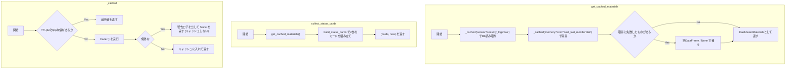
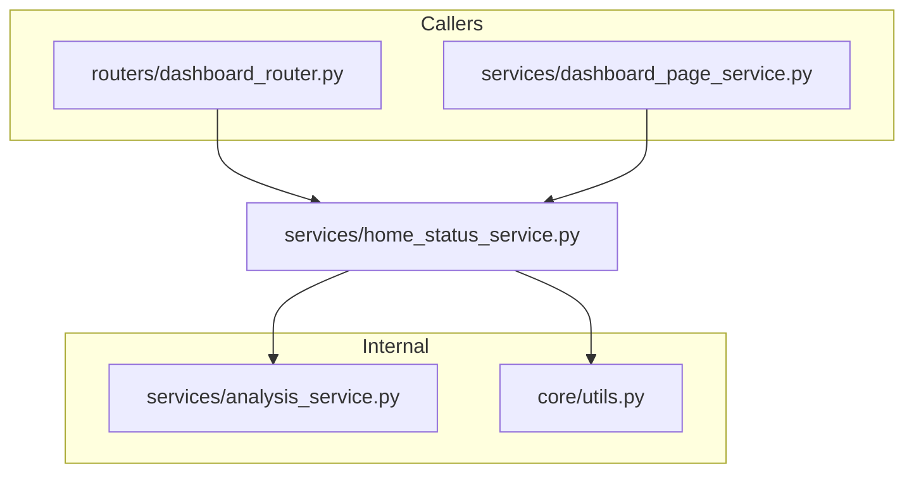

## 1. 解析メタ情報

| 項目 | 内容 |
| --- | --- |
| 対象ファイル | `services/home_status_service.py` |
| 言語 | Python |
| 解析対象 | 提供されたコードのみ |
| 推測・補完 | 一切なし |

## 関連ドキュメント

* [dashboard_router.md](./dashboard_router.md) - ホームページ(`{DASHBOARD_BASE_PATH}/`)・自動更新フラグメント(`.../status`)の呼び出し元。`collect_status_cards`/`get_cached_materials`を使う
* [dashboard_page_service.md](./dashboard_page_service.md) - ページ全体(見守り/くらし/システム)のHTML組み立て側。本ファイルのカードHTML・時刻表記・`get_cached_materials`を使う
* [analysis_service.md](./analysis_service.md) - `load_sensor_data`, `load_generic_data`, `load_nas_status`, `get_memory_usage`, `get_disk_usage`, `calculate_monthly_cost_cumulative`, `calculate_last_month_cost_same_point` の提供元
* [dashboard.md](./dashboard.md) / [summary.md](./summary.md) / [dashboard_common.md](./dashboard_common.md) - Issue #829でStreamlit版ダッシュボードごと廃止された旧呼び出し元(履歴として残る)

## 2. ファイルの概要

「家のいまの状況」を表すステータスカードについて、**判定ロジック・カードのHTML組み立て・カードのCSS・時刻の相対表記**を1箇所に集めたモジュール。Streamlitをimportしないため`unified_server.py`(FastAPI)側から使える。Issue #829でStreamlit版ダッシュボード(`dashboard.py`ほか)を廃止し、`routers/dashboard_router.py`配下のページ(この`unified_server`自身がHTMLを返す)だけになったが、「Streamlitに依存しないダッシュボードの正のロジック置き場」という役割自体は変わっていない。判定関数(`get_takasago_status`等)はいずれも副作用を持たない純粋関数で、DataFrameや取得済みの値を受け取って`(表示文字列, テーマ名)`を返す。取得はサーバー側の`get_cached_materials`/`collect_status_cards`が担う。ダッシュボードのページ定義(`DASHBOARD_TABS`)・カードの並びとグループ(`CARD_GROUPS`)・family-questへのパス(`QUEST_APP_PATH`)・値の下の補足を組み立てる`describe_*`群も持つ。**(不具合修正)** 以前あった「気になること」要約行(`summarize_alerts`/`render_alerts_html`/`ALERT_THEMES`)は要望により削除された。
根拠: `def build_status_cards(` (行番号: 650 / 抜粋: "def build_status_cards(")、`from services import analysis_service` (行番号: 29 / 抜粋: "from services import analysis_service")、`def get_takasago_status(df_sensor: pd.DataFrame, now: datetime) -> tuple[str, str]:` (行番号: 365)、`DASHBOARD_TABS: tuple[tuple[str, str], ...] = (` (行番号: 173)、`CARD_GROUPS: tuple[tuple[str, str], ...] = (` (行番号: 194)、`QUEST_APP_PATH = "/quest"` (行番号: 184)、`def describe_takasago(df_sensor: pd.DataFrame, now: datetime) -> str | None:` (行番号: 583)

## 3. 外部依存関係

### インポート一覧

| 名称 | 種類 | 用途 | 根拠 |
| --- | --- | --- | --- |
| `html` | 標準ライブラリ | カードのタイトル・値、ページ内のパス類のHTMLエスケープ | `import html` (行番号: 17 / 抜粋: "import html") |
| `logging` | 標準ライブラリ | 取得失敗時の警告ログ | `import logging` (行番号: 18 / 抜粋: "import logging") |
| `threading` | 標準ライブラリ | 自前キャッシュの排他（`threading.Lock`） | `import threading` (行番号: 19 / 抜粋: "import threading") |
| `time` | 標準ライブラリ | キャッシュのTTL判定（`time.monotonic()`） | `import time` (行番号: 20 / 抜粋: "import time") |
| `collections.abc.Callable` | 標準ライブラリ | `_cached` の引数の型注釈 | `from collections.abc import Callable` (行番号: 21 / 抜粋: "from collections.abc import Callable") |
| `datetime.datetime` | 標準ライブラリ | 時刻比較（経過分数） | `from datetime import datetime` (行番号: 22 / 抜粋: "from datetime import datetime") |
| `typing.Any` / `NamedTuple` | 標準ライブラリ | 型注釈、`StatusCard`/`DashboardMaterials` の定義 | `from typing import Any, NamedTuple` (行番号: 23 / 抜粋: "from typing import Any, NamedTuple") |
| `pandas` | 外部ライブラリ | DataFrame/Series の判定処理 | `import pandas as pd` (行番号: 25 / 抜粋: "import pandas as pd") |
| `pytz` | 外部ライブラリ | `format_relative_time`の naive タイムスタンプJST化(`_JST`) | `import pytz` (行番号: 26 / 抜粋: "import pytz") |
| `core.utils.get_now_jst` | 内部モジュール | 現在時刻（JST固定）の取得 | `from core.utils import get_now_jst` (行番号: 27 / 抜粋: "from core.utils import get_now_jst") |
| `services.analysis_service` | 内部モジュール | センサー・NAS・メモリ・電気代・防犯ログの取得 | `from services import analysis_service` (行番号: 29 / 抜粋: "from services import analysis_service") |

### ブラックボックスとなる外部要素

| 名称 | 理由 | 根拠 |
| --- | --- | --- |
| `analysis_service` の各ローダ | クエリ・対象テーブル・失敗時の挙動は [analysis_service.md](./analysis_service.md) 側にある。 | `df_sensor = _cached("sensor", lambda: analysis_service.load_sensor_data(limit=MOBILE_SENSOR_ROW_LIMIT))` (行番号: 809) |

## 4. 主要要素の定義（関数 / エンドポイント / コンポーネント）

### `_JST` / `format_short_timestamp` / `format_relative_time`

* **役割**: `_JST`はJSTのタイムゾーンオブジェクト。`format_short_timestamp`は時刻を「09/21 03:04」形式にする(読めない値は空文字)。`format_relative_time`は「3分前」のような相対表記にし、1週間以上前・未来の時刻は`format_short_timestamp`にフォールバックする。naive(tzinfo無し)な値はDB由来としてJSTでlocalizeする(`core.utils`のJST固定方針と同じ)。
* 根拠: [変数宣言] (行番号: 33 / 抜粋: '_JST = pytz.timezone("Asia/Tokyo")')、[関数定義] (行番号: 36, 44 / 抜粋: "def format_short_timestamp(value) -> str:", "def format_relative_time(value, now: datetime | None = None) -> str:")

* **引数/リクエスト**: `format_short_timestamp(value)`、`format_relative_time(value, now: datetime | None = None)`
* 根拠: [関数定義] (行番号: 36, 44)

* **戻り値/レスポンス**: いずれも`str`(「たった今」「N分前」「N時間前」「N日前」、または短縮絶対表記、または空文字)
* 根拠: [戻り値] (行番号: 40〜42, 60〜68)

* **副作用**: なし
* 根拠: [関数本体] (行番号: 36〜67)

* **エラーハンドリング**: `pd.to_datetime(..., errors="coerce")`で読めない値は`NaT`扱いにし空文字/該当分岐へ落とす。
* 根拠: [エラーハンドリング] (行番号: 38, 46〜47 / 抜粋: 'ts = pd.to_datetime(value, errors="coerce")\n    if pd.isna(ts):\n        return ""')

### `STATUS_CACHE_TTL_SEC` / `MOBILE_SENSOR_ROW_LIMIT` / `SECURITY_LOG_ROW_LIMIT` (モジュールレベル定数)

* **役割**: サーバー側キャッシュのTTL(60秒)、ダッシュボードで読むセンサー行数の上限(3000行)、見守りページの防犯ログで読む行数の上限(200行)。
* 根拠: `STATUS_CACHE_TTL_SEC = 60` (行番号: 69)、`MOBILE_SENSOR_ROW_LIMIT = 3000` (行番号: 73)、`SECURITY_LOG_ROW_LIMIT = 200` (行番号: 77)

* **引数/リクエスト**: なし（定数）
* 根拠: 同上

* **戻り値/レスポンス**: なし（定数）
* 根拠: 同上

* **副作用**: なし
* 根拠: 同上

* **エラーハンドリング**: なし
* 根拠: 同上

### `STATUS_CARD_CSS` (モジュールレベル定数)

* **役割**: カード1枚分のCSS（`.status-grid` / `.status-card` / `.theme-*`）。ホームページと各サブページ(`services/dashboard_page_service.py`)が共有する。グリッドは `repeat(auto-fit, minmax(150px, 1fr))` で、スマホ幅では2列・タブレット〜PCでは3〜5列に自動で折り返す。
* 根拠: `STATUS_CARD_CSS = """` (行番号: 80 / 抜粋: "STATUS_CARD_CSS = \"\"\"")

* **引数/リクエスト**: なし（定数）
* 根拠: 同上

* **戻り値/レスポンス**: なし（定数）
* 根拠: 同上

* **副作用**: なし
* 根拠: 同上

* **エラーハンドリング**: なし
* 根拠: 同上

### `DASHBOARD_TABS` / `DASHBOARD_TAB_KEYS` (モジュールレベル定数)

* **役割**: ダッシュボードのページ定義(`("home", "🏠 ホーム")`等4つ)と、そのキーのタプル。キーはカードの`tab`や`card_detail_href`が生成するURLの末尾セグメント(`/watch`等)としても使われる。
* 根拠: `DASHBOARD_TABS: tuple[tuple[str, str], ...] = (` (行番号: 173)、`DASHBOARD_TAB_KEYS: tuple[str, ...] = tuple(key for key, _ in DASHBOARD_TABS)` (行番号: 179)

* **引数/リクエスト**: なし（定数）
* 根拠: 同上

* **戻り値/レスポンス**: なし（定数）
* 根拠: 同上

* **副作用**: なし
* 根拠: 同上

* **エラーハンドリング**: なし
* 根拠: 同上

### `QUEST_APP_PATH` / `CARD_GROUPS` / `CARD_GROUP_LABELS` (モジュールレベル定数)

* **役割**: `QUEST_APP_PATH`はfamily-quest(PWA)へのパス(`/quest`)。ホームページの外部リンクカードが参照する。`CARD_GROUPS`はカードの並びとグループ(見守り→くらし→システムの順)。Issue #829でファミクエ(承認待ち件数)のカードを廃止したため、以前あった`quest`グループは無い。`CARD_GROUP_LABELS`は`CARD_GROUPS`から作る`dict`。
* 根拠: `QUEST_APP_PATH = "/quest"` (行番号: 184)、`CARD_GROUPS: tuple[tuple[str, str], ...] = (` (行番号: 194)、`CARD_GROUP_LABELS: dict[str, str] = dict(CARD_GROUPS)` (行番号: 199)

* **引数/リクエスト**: なし（定数）
* 根拠: 同上

* **戻り値/レスポンス**: なし（定数）
* 根拠: 同上

* **副作用**: なし
* 根拠: 同上

* **エラーハンドリング**: なし
* 根拠: 同上

### `StatusCard` (NamedTuple)

* **役割**: 1枚のカードを表す。`title`, `value`, `theme`, `value_is_html`（既定 `False`）, `tab`（既定 `None`）, `sub`（既定 `None`）, `href`（既定 `None`）, `group`（既定 `None`）, `anchor`（既定 `None`）を持つ。`tab`はそのカードの詳細が載っているページのキー(`DASHBOARD_TABS`)で、`card_detail_href`がこれを`/watch`等のURLに変換する。`href`は詳細がダッシュボードの外にあるカードのための直接リンク先で、`tab`より優先される。**(不具合修正で追加)** `anchor`は`tab`のURLの末尾にそのまま付け足す文字列(例: `#takasago-log`、`?camera=xxx#camera-section`)。同じ`tab`を持つ複数のカードがあるとき、タップしたカードの内容が実際に載っているページ内の場所まで連れて行くために使う(以前は見守りグループの4枚が全部`tab="watch"`だけを持ち、どれをタップしても同じURL=ページ先頭のカメラ映像にしか飛べなかった)。
* 根拠: `class StatusCard(NamedTuple):` (行番号: 202)

* **引数/リクエスト**: `title` (str), `value` (str), `theme` (str), `value_is_html` (bool, 既定 False), `tab` (str | None, 既定 None), `sub` (str | None, 既定 None), `href` (str | None, 既定 None), `group` (str | None, 既定 None), `anchor` (str | None, 既定 None)
* 根拠: [クラス定義] (行番号: 202〜227)

* **戻り値/レスポンス**: 該当なし（データ型）
* 根拠: 同上

* **副作用**: なし
* 根拠: 同上

* **エラーハンドリング**: なし
* 根拠: 同上

### `render_status_card_html`

* **役割**: カード1枚のHTML文字列を返す。`title` は常にHTMLエスケープし、`value` も既定でエスケープする（Issue #378）。`value_is_html=True` のときだけ `value` のエスケープをスキップする。`href` を渡すと外枠が `<a>` になりカード全体がリンクになる。`sub` を渡すと値の下に `.status-sub` の行を足す（常にエスケープする）。改行・インデントを含まない1行の文字列を返す。
* 根拠: `def render_status_card_html(` (行番号: 232〜276)

* **引数/リクエスト**: `title` (str), `value` (str), `theme` (str), キーワード専用 `value_is_html` (bool, 既定 False), `href` (str | None, 既定 None), `sub` (str | None, 既定 None)
* 根拠: [関数定義] (行番号: 227〜235)

* **戻り値/レスポンス**: 1行のHTML文字列
* 根拠: [戻り値] (行番号: 264〜271)

* **副作用**: なし（文字列を返すのみ）
* 根拠: [関数本体] (行番号: 251〜271)

* **エラーハンドリング**: なし
* 根拠: [関数本体] (行番号: 251〜271)

### `card_detail_href`

* **役割**: カードの詳細ページへのURLを返す。`card.href`があればそれを、無ければ`{dashboard_path}/{tab}`(例: `/dashboard/watch`)を返す。`tab`も`href`も無いカードは`None`。**(不具合修正)** `card.anchor`があれば、そのURLの末尾にそのまま付け足す(例: `/dashboard/watch#takasago-log`)。同じ`tab`の複数カードをページ内の異なる場所へ振り分けるための仕組み。
* 根拠: `def card_detail_href(card: StatusCard, dashboard_path: str) -> str | None:` (行番号: 279〜297)

* **引数/リクエスト**: `card` (`StatusCard`), `dashboard_path` (str)
* 根拠: [関数定義] (行番号: 279)

* **戻り値/レスポンス**: URL文字列、または `None`
* 根拠: [戻り値] (行番号: 290〜297 / 抜粋: 'return card.href', 'return None', 'href = f"{dashboard_path.rstrip(\'/\')}/{card.tab}"\n    if card.anchor:\n        href += card.anchor\n    return href')

* **副作用**: なし
* 根拠: [関数本体] (行番号: 290〜297)

* **エラーハンドリング**: なし
* 根拠: [関数本体] (行番号: 292 / 抜粋: "if card.tab is None:")

### （削除済み）`ALERT_THEMES` / `summarize_alerts` / `render_alerts_html`

* **（不具合修正で削除）** 以前は「いま気にすべきカード」を赤（`theme-red`）→ 黄（`theme-yellow`）の順に拾い、ホームページ先頭に「⚠️ 気になること: ...」/「✅ 気になることはありません」の要約行として出していた。カード自体が赤・黄の色で状態を示しており要約行は不要という要望により、この3つのシンボルは本ファイルから完全に削除された(`services/dashboard_page_service.py`の呼び出し箇所も削除)。
* 根拠: 削除は差分（`git diff`）で確認。現在の`services/home_status_service.py`には`ALERT_THEMES`/`summarize_alerts`/`render_alerts_html`のいずれの定義も存在しない(`card_detail_href`の直後は`group_cards`の定義)。

### `group_cards`

* **役割**: カードを `group` ごとの塊に分ける（並び順は変えない）。隣り合う同じグループをまとめる。`group` を持たないカードは見出し `None` の塊になる。
* 根拠: `def group_cards(cards) -> list[tuple[str | None, list[StatusCard]]]:` (行番号: 300〜313)

* **引数/リクエスト**: `cards` (`StatusCard` のイテラブル)
* 根拠: [関数定義] (行番号: 300)

* **戻り値/レスポンス**: `[(グループキー | None, カードのリスト), ...]`
* 根拠: [戻り値] (行番号: 313 / 抜粋: "return grouped")

* **副作用**: なし
* 根拠: [関数本体] (行番号: 307〜313)

* **エラーハンドリング**: なし（空のイテラブルは空のリストになる）
* 根拠: [初期化] (行番号: 307 / 抜粋: "grouped: list[tuple[str | None, list[StatusCard]]] = []")

### `render_status_grid_html`

* **役割**: 複数のカードを `.status-grid` のブロックにまとめたHTMLを返す。`group` を持つカードには見出し(`<h2 class="group-title">`)が付き、1枚だけのグループには`.status-grid-solo`が付く。`dashboard_path`を渡すと、行き先を持つカードがその行き先へのリンク(`<a>`)になる。
* 根拠: `def render_status_grid_html(cards, *, dashboard_path: str | None = None) -> str:` (行番号: 316〜345)

* **引数/リクエスト**: `cards`, キーワード専用 `dashboard_path` (str | None, 既定 None)
* 根拠: [関数定義] (行番号: 316)

* **戻り値/レスポンス**: 見出しと`
…
`を並べた文字列
* 根拠: [戻り値] (行番号: 345 / 抜粋: 'return "".join(blocks)')

* **副作用**: なし
* 根拠: [関数本体] (行番号: 322〜345)

* **エラーハンドリング**: なし
* 根拠: [関数本体] (行番号: 316〜345)

### 判定関数（`get_takasago_status` / `get_itami_status` / `get_camera_status` / `get_parking_status` / `get_server_status` / `get_nas_status_simple`）

* **役割**: それぞれ1枚のカードの `(表示文字列, テーマ名)` を返す純粋関数。
  * `get_takasago_status`: 高砂（実家）の `contact_state` が `open`/`detected` の最新行からの経過時間で、1時間未満=緑「元気」、3時間未満=黄「静か」、それ以上=赤「N時間 動きなし」。
  * `get_itami_status`: 伊丹（自宅）の人感（`device_type` に `Motion` を含むか `Webhook`）かつ検知の最新行から段階的に判定。該当が無ければ開閉センサーで60分未満のみ「活動中」とする。
  * `get_camera_status`: カメラ(`device_type`が`CAMERA_DEVICE_TYPE`="ONVIF_CAMERA"かつ`movement_state=="ON"`)の最新行からの経過時間で判定。**色は情報色(青)かグレーだけ**。
  * `get_parking_status`: **(#829で新設)** 駐車場カメラ(`device_id == PARKING_CAMERA_ID`)の動体検知の最新行からの経過時間で判定(`get_camera_status`と同じ考え方)。以前は`car_records`(action='LEAVE'/'ARRIVE')テーブルから「🚗外出中」/「🏠在宅」を判定する`get_car_status`だったが、`car_records`への書き込み経路がリポジトリ内のどこにも存在せず常に空だった(恒常的に「🏠在宅」を返す死んだ機能)ため、駐車場カメラの動体検知に置き換えた。人の往来も拾うため在宅/外出中は断定できず、`get_camera_status`と同じく常に情報色(青)かグレーにする。**(不具合修正)** 以前は表示名(`friendly_name == PARKING_CAMERA_NAME`="駐車場")の完全一致で判定していたが、実際の表示名は`devices.json`で運用者が「駐車場カメラ」に設定しており一致せず、常に「⚪ データなし」になっていた(ダッシュボードの不具合)。表示名は運用者が自由に変えられ変更のたびに再発しうるため、変更されにくい`id`(`PARKING_CAMERA_ID`)で照合するよう修正した。
  * `get_server_status`: メモリ使用率が80%未満で緑、以上で赤。`None` ならグレー「取得失敗」。
  * `get_nas_status_simple`: `status_ping` が `OK` なら緑、それ以外は赤。`None` はグレー、キー欠落は黄「データ異常」。
* **(不具合修正で削除)** `get_rice_status`(炊飯器カードの判定)は、炊飯器の表示自体が不要という要望により`_rice_cooking_rows`/`RICE_COOKER_ON_WATTS`とともに削除された。
* 判定に使う行の抽出は、補足表示（`describe_*`）と共有する private 関数（`_takasago_activity` / `_itami_motion` / `_itami_contact` / `_camera_motion` / `_parking_camera_motion`）に切り出してある。
* 根拠: `def get_takasago_status(df_sensor: pd.DataFrame, now: datetime) -> tuple[str, str]:` (行番号: 365)、`def get_itami_status(df_sensor: pd.DataFrame, now: datetime) -> tuple[str, str]:` (行番号: 424)、`def get_server_status(memory: dict[str, float] | None) -> tuple[str, str]:` (行番号: 453)、`def get_nas_status_simple(nas_data: pd.Series | None) -> tuple[str, str]:` (行番号: 459)、`def get_camera_status(df_sensor: pd.DataFrame, now: datetime) -> tuple[str, str]:` (行番号: 508)、`def get_parking_status(df_sensor: pd.DataFrame, now: datetime) -> tuple[str, str]:` (行番号: 537)、`PARKING_CAMERA_ID = "VIGI_C540_Parking"` (行番号: 491)

* **引数/リクエスト**: DataFrame（センサー）、`now`（`datetime`）、取得済みの辞書（メモリ使用率）、`pd.Series | None`（NAS）
* 根拠: `def get_server_status(memory: dict[str, float] | None) -> tuple[str, str]:` (行番号: 453)

* **戻り値/レスポンス**: `(表示文字列, テーマ名)` のタプル。テーマ名は `theme-green` / `theme-yellow` / `theme-red` / `theme-blue` / `theme-gray` のいずれか。
* 根拠: `return "⚪ データなし", "theme-gray"` (行番号: 543〜544付近を含む各関数の早期return)

* **副作用**: なし（いずれもデータ取得を行わない）
* 根拠: [各関数本体]

* **エラーハンドリング**: 列の欠落・空DataFrameは早期returnで「データなし」を返す。NASは `KeyError` を捕捉して「データ異常」を返す。
* 根拠: `if df_sensor.empty or "location" not in df_sensor.columns or "contact_state" not in df_sensor.columns:` (行番号: 358)、`except KeyError:` (行番号: 467)

### `build_status_cards`

* **役割**: 渡された材料から、画面に並べる順で7枚の `StatusCard` を組み立てる（取得は行わない）。並び順は`CARD_GROUPS`と同じ順(見守り→くらし→システム)。**(#829)** 以前は9枚(ファミクエの「📝承認待ち」カードを含む)だったが、ダッシュボード内にファミクエの状態表示を残さず外部リンクのみにする方針変更により、そのカードを削除して8枚になった。同時に、`df_car`/`pending_quests`引数も廃止された(車カードは`df_sensor`から駐車場カメラの動きを見るように変更、ファミクエカード自体が無くなったため)。**(不具合修正)** 炊飯器表示が不要という要望により「🍚 炊飯器」カードを削除し7枚になった。あわせて、見守りグループの4枚(高砂・伊丹・駐車場・カメラ)は以前すべて`tab="watch"`のみで`anchor`を持たなかったため、どのカードをタップしても同じURL(見守りページ先頭=カメラ映像)にしか飛べなかった不具合を修正し、それぞれ`anchor`(`#takasago-log`/`#itami-log`/`?camera={PARKING_CAMERA_ID}#camera-section`/`#camera-section`)で見守りページ内の異なる場所に振り分けるようにした。
* 根拠: `def build_status_cards(` (行番号: 650〜698)

* **引数/リクエスト**: `now`, `df_sensor`, `nas_data`, `memory`, `monthly_cost`、および補足表示にだけ使う省略可能な `last_month_cost` (int | None, 既定 None), `disk` (dict | None, 既定 None)
* 根拠: [関数定義] (行番号: 650〜657)

* **戻り値/レスポンス**: `list[StatusCard]`（7枚）
* 根拠: [戻り値] (行番号: 682〜698)

* **副作用**: なし
* 根拠: [関数本体] (行番号: 669〜698)

* **エラーハンドリング**: なし（各判定関数側で処理される）
* 根拠: [関数呼び出し] (行番号: 669〜674)

### `_cached` / `clear_status_cache`

* **役割**: `unified_server`には`st.cache_data`が無いため、同じTTL（60秒）の小さなメモを自前で持つ。`_cached(key, loader)`はTTL内なら前回値を返し、`loader`が例外を送出した場合は例外を伝播させず`None`を返す。**失敗はキャッシュしない**。`clear_status_cache()`はTTLを待たずに捨てる。
* 根拠: `def _cached(key: str, loader: Callable[[], Any]) -> Any:` (行番号: 711〜731)、`def clear_status_cache() -> None:` (行番号: 734〜736)

* **引数/リクエスト**: `key` (str), `loader` (引数なしの呼び出し可能オブジェクト)
* 根拠: [関数定義] (行番号: 711)

* **戻り値/レスポンス**: `loader` の戻り値、または取得失敗時は `None`
* 根拠: [戻り値] (行番号: 727, 731 / 抜粋: 'return None', 'return value')

* **副作用**: モジュールレベルの `_cache` 辞書の更新（`threading.Lock` で保護）。読み取りのみで、DBへの書き込みは行わない。
* 根拠: `_cache[key] = (time.monotonic(), value)` (行番号: 730)

* **エラーハンドリング**: `except Exception` で捕捉し、警告ログを出して `None` を返す。
* 根拠: `except Exception as e:  # noqa: BLE001 (1枚のカードの取得失敗でページ全体を落とさない)` (行番号: 725)

### `DashboardMaterials` (NamedTuple) / `get_cached_materials`

* **役割**: **(#829で新設)** ホーム・見守り・くらし・システムの各ページが共有する材料(`df_sensor`/`df_security_log`/`nas_data`/`memory`/`disk`/`monthly_cost`/`last_month_cost`)をまとめた型と、それを`_cached`経由でTTLキャッシュしつつ集める関数。同じリクエストで複数ページぶんの材料を集めてもDB・スクレイピングの回数は増えない(`_cached`のキーはページに関わらず共通)。
* 根拠: `class DashboardMaterials(NamedTuple):` (行番号: 740〜752)、`def get_cached_materials() -> DashboardMaterials:` (行番号: 756〜779)

* **引数/リクエスト**: `get_cached_materials()`は引数なし
* 根拠: [関数定義] (行番号: 756)

* **戻り値/レスポンス**: `DashboardMaterials`(NamedTuple)
* 根拠: [戻り値] (行番号: 771〜779)

* **副作用**: DBの読み取り、`psutil`相当のリソース取得、キャッシュの更新。書き込みは行わない。
* 根拠: [関数本体] (行番号: 760〜769)

* **エラーハンドリング**: 個々の取得失敗は`_cached`が`None`に丸める。
* 根拠: [フォールバック] (行番号: 772〜778 / 抜粋: 'df_sensor=df_sensor if df_sensor is not None else empty,')

### `collect_status_cards`

* **役割**: `get_cached_materials`で材料を集め、`build_status_cards`に渡して`(カード一覧, 取得時刻)`を返す。ホームページ用。
* 根拠: `def collect_status_cards(now: datetime | None = None) -> tuple[list[StatusCard], datetime]:` (行番号: 783〜796)

* **引数/リクエスト**: `now` (`datetime | None`。省略時は `core.utils.get_now_jst()`)
* 根拠: `now = now or get_now_jst()` (行番号: 785)

* **戻り値/レスポンス**: `(list[StatusCard], datetime)`
* 根拠: `return cards, now` (行番号: 796)

* **副作用**: `get_cached_materials`経由でDBの読み取り等。書き込みは行わない。
* 根拠: `materials = get_cached_materials()` (行番号: 786)

* **エラーハンドリング**: 個々の取得失敗は`get_cached_materials`側(`_cached`)が`None`に丸める。カード側は「データなし」「取得失敗」として表示され、ページ全体は返る。
* 根拠: [関数本体] (行番号: 783〜796)

### 補足表示（`describe_takasago` / `describe_itami` / `describe_parking` / `describe_camera` / `describe_cost` / `describe_server` / `describe_nas`）

* **役割**: カードの値の下に小さく出す1行（`StatusCard.sub`）を組み立てる。
  * `describe_takasago` / `describe_itami`: `最終検知 09:40`。
  * `describe_parking`: **(#829で`describe_car`から置き換え)** 駐車場カメラの最終検知時刻(`最終検知 08:15`)。以前の`describe_car`(`08:15 に出発`/`に帰宅`)は`car_records`が常に空だったため意味を成さず、`get_parking_status`と同じ理由で廃止された。抽出元の`_parking_camera_motion`は不具合修正で`device_id`照合に変更されたが、`describe_parking`自体のロジックは変わっていない。
  * `describe_camera`: どのカメラが捉えたのか（`玄関 15:42`）。
  * `describe_cost`: `先月同日 11,000円 (+1,345)`。比較対象が無いときは`None`。
  * `describe_server`: `ディスク 55%`。`describe_nas`: `空き 1,234GB`。
  * 時刻の書式は `_format_moment` が決める。
* **(#829で削除)** `describe_quest`(ファミクエの承認待ちの補足)は、ファミクエのカード自体が廃止されたため削除された。**(不具合修正で削除)** `describe_rice`(炊飯器の前回稼働時刻の補足)は、`get_rice_status`と同時に炊飯器カード自体が削除されたため削除された。
* 根拠: `def describe_takasago(df_sensor: pd.DataFrame, now: datetime) -> str | None:` (行番号: 583)、`def describe_itami(df_sensor: pd.DataFrame, now: datetime) -> str | None:` (行番号: 588)、`def describe_parking(df_sensor: pd.DataFrame, now: datetime) -> str | None:` (行番号: 597)、`def describe_camera(df_sensor: pd.DataFrame, now: datetime) -> str | None:` (行番号: 611)、`def describe_cost(monthly_cost: int, last_month_cost: int | None) -> str | None:` (行番号: 623)、`def _format_moment(moment, now: datetime) -> str | None:` (行番号: 563)

* **引数/リクエスト**: 判定関数と同じ材料（DataFrame・取得済みの辞書・`now`）
* 根拠: [各関数定義] (行番号: 583〜647)

* **戻り値/レスポンス**: 補足の文字列、または材料が無いときは `None`
* 根拠: `return None if at is None else f"最終検知 {at}"` (行番号: 585, 594, 599付近のパターン)

* **副作用**: なし（いずれもデータ取得を行わない）
* 根拠: [各関数本体]

* **エラーハンドリング**: 空DataFrame・列の欠落・`NaT`はいずれも `None` を返す。
* 根拠: `def _latest_timestamp(df: pd.DataFrame):` (行番号: 576)

### `latest_parking_motion_at`

* **役割**: **(#829で新設)** 駐車場カメラが最後に動きを捉えた時刻を返す(無ければ`None`)。システムページ(`services/dashboard_page_service.py`)の鮮度一覧が、カード判定(`get_parking_status`/`describe_parking`)と同じ抽出(`_parking_camera_motion`)を使うための公開ラッパー。
* 根拠: `def latest_parking_motion_at(df_sensor: pd.DataFrame):` (行番号: 602〜608)

* **引数/リクエスト**: `df_sensor: pd.DataFrame`
* 根拠: [関数定義] (行番号: 602)

* **戻り値/レスポンス**: タイムスタンプ、または`None`
* 根拠: `return _latest_timestamp(_parking_camera_motion(df_sensor))` (行番号: 608)

* **副作用**: なし
* 根拠: [関数本体] (行番号: 602〜608)

* **エラーハンドリング**: なし(`_latest_timestamp`/`_parking_camera_motion`側で空チェック済み)
* 根拠: [関数本体] (行番号: 602〜608)

### `MOBILE_PAGE_REFRESH_SEC` / `STATUS_SECTION_ID` (モジュールレベル定数)

* **役割**: ページの自動更新間隔(`STATUS_CACHE_TTL_SEC`と同じ60秒)と、自動更新で差し替える`
`の`id`(`"status"`)。**(#829)** 以前はこのモジュールが軽量ページのHTML全体(`render_mobile_status_page_html`)・専用CSS(`_MOBILE_PAGE_BASE_CSS`等)・タイトル(`MOBILE_PAGE_TITLE`)も持っていたが、ページ組み立て自体は`services/dashboard_page_service.py`へ移設され、このモジュールにはページに依存しない2つの定数だけが残った。
* 根拠: `MOBILE_PAGE_REFRESH_SEC = STATUS_CACHE_TTL_SEC` (行番号: 806)、`STATUS_SECTION_ID = "status"` (行番号: 809)

* **引数/リクエスト**: なし（定数）
* 根拠: 同上

* **戻り値/レスポンス**: なし（定数）
* 根拠: 同上

* **副作用**: なし
* 根拠: 同上

* **エラーハンドリング**: なし
* 根拠: 同上

## 5. 処理フロー図

## 6. 依存関係図

## 7. 次のステップ（リバースエンジニアリングの提案）

| 優先度 | ファイル名(推測可) | 理由 | 根拠 |
| --- | --- | --- | --- |
| 高 | `routers/dashboard_router.py` | ホーム・見守り・くらし・システムの各ページの実際のURL・呼び出し方を把握するため。 | `def collect_status_cards(now: datetime | None = None) -> tuple[list[StatusCard], datetime]:` (行番号: 830) |
| 高 | `services/dashboard_page_service.py` | 本ファイルのカードHTML・時刻表記が実際にどのページで使われるかを把握するため。 | `STATUS_CARD_CSS = """` (行番号: 80) |
| 中 | `services/analysis_service.py` | 各ローダが返すDataFrameの列と失敗時の挙動を把握するため。 | `df_sensor = _cached("sensor", ...)` (行番号: 809) |

## 8. 保守上の注意点

* **このモジュールに Streamlit を import しないこと**: `unified_server.py` が読み込むため、Streamlit 依存を持ち込むとサーバー側が巻き添えになる。`tests/test_mobile_status_page.py` の `TestOneSourceOfTruth` が`home_status_service`と`dashboard_page_service`両方のimport文を検査して固定している。
* 根拠: `from services import analysis_service` (行番号: 29)

* **判定をページ組み立て側（`dashboard_page_service.py`）へ戻さないこと**: 戻すとページごとに同じカードの内容が食い違いうる。
* 根拠: `def build_status_cards(` (行番号: 650)

* **取得失敗をキャッシュしないこと**: `_cached` は失敗時に `None` を返すだけでキャッシュに入れない。入れてしまうと、復旧してもTTLの60秒間は壊れた表示のままになる。
* 根拠: `except Exception as e:  # noqa: BLE001 (1枚のカードの取得失敗でページ全体を落とさない)` (行番号: 725)

* **`value_is_html=True` を渡す呼び出し元は、値の構築元に外部/DB由来の生文字列を含めないこと**: エスケープをスキップするため、格納型XSSの経路になりうる（Issue #378）。`sub` にはこの抜け道が無く、常にエスケープされる。
* 根拠: [`render_status_card_html`本体] (行番号: 253付近のエスケープ分岐)

* **判定と補足表示で同じ行の抽出を使うこと**: `describe_*` が判定（`get_*_status`）と別の条件で行を絞ると、「カードの色は緑なのに最終検知の時刻だけ新しい」という食い違いが起きる。抽出は `_takasago_activity` / `_itami_motion` / `_itami_contact` / `_parking_camera_motion` に集約してある。
* 根拠: `def _takasago_activity(df_sensor: pd.DataFrame) -> pd.DataFrame:` (行番号: 352)

* **カードの並びを「異常が上」に並べ替えないこと**: どの位置に何があるかで覚えている画面で順番が入れ替わると、かえって読み違える。**(不具合修正)** 以前は気になることを`summarize_alerts`の要約行で先頭に出す方式にしていたが、この要約行自体が削除された(要望により)ため、現在はカード自体の色(赤・黄)だけで異常を示す。
* 根拠: `def group_cards(cards) -> list[tuple[str | None, list[StatusCard]]]:` (行番号: 300)、削除は差分（`git diff`）で確認: 現在の`services/home_status_service.py`に`summarize_alerts`の定義は存在しない。

* **駐車場カメラの動体検知(`get_parking_status`)は在宅/外出中を断定しない**: 人の往来も拾うため、常に情報色(青)かグレーにする設計になっている。
* 根拠: `def get_parking_status(df_sensor: pd.DataFrame, now: datetime) -> tuple[str, str]:` (行番号: 537)

* **駐車場カメラの特定は表示名(`name`)ではなく`id`で行うこと**: `name`(`config.CAMERAS`の`name`/`devices.json`)は運用者が自由に変更できる文字列で、変更するたびに`friendly_name`との完全一致が壊れ「⚪ データなし」に静かに戻ってしまう(過去に実際に起きた不具合)。`id`は変更されにくいため`PARKING_CAMERA_ID`で照合する。同じ理由から`weekly_analyze_report.py`の駐車場動体検知カウントも`device_id`照合にしてある。
* 根拠: `PARKING_CAMERA_ID = "VIGI_C540_Parking"` (行番号: 491)、`def _parking_camera_motion(df_sensor: pd.DataFrame) -> pd.DataFrame:` (行番号: 529)

## 9. 不明事項一覧

| 項目 | 理由 | 必要なファイル |
| --- | --- | --- |
| 各ローダが返すDataFrameの正確な列とクエリ | `analysis_service` の実装が本ファイルからは見えないため。 | `services/analysis_service.py` |
| `calculate_last_month_cost_same_point` が対象にするテーブルと期間の境界 | `analysis_service` の実装が本ファイルからは見えないため。 | `services/analysis_service.py` |

## 10. 自己検証結果

* [x] 完了: 推測・外部ファイルの仕様を一切含んでいない
* [x] 完了: 全関数・全クラス・全コンポーネントを列挙した
* [x] 完了: 全てのインポート要素を列挙した
* [x] 完了: すべての仕様説明に「根拠（行番号・抜粋）」を明記した
* [x] 完了: 根拠漏れが0件である
* [x] 完了: Mermaid構文にエラーの原因となる記号（エスケープ漏れ）がない
* [x] 完了: 不明事項を漏れなく列挙した

完了
