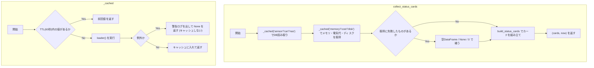
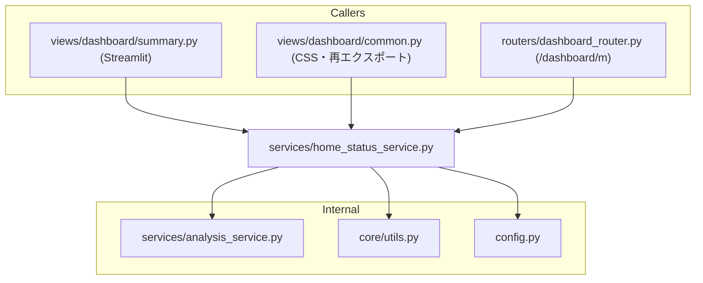

## 1. 解析メタ情報

| 項目 | 内容 |
| --- | --- |
| 対象ファイル | `services/home_status_service.py` |
| 言語 | Python |
| 解析対象 | 提供されたコードのみ |
| 推測・補完 | 一切なし |

## 関連ドキュメント

* [summary.md](./summary.md) - Streamlit側の呼び出し元。判定ロジックは本ファイルへ移動し、あちらは「キャッシュ付きローダで材料を集めて描く」だけになった
* [dashboard_router.md](./dashboard_router.md) - 軽量ページ `{DASHBOARD_BASE_PATH}/m` の呼び出し元。`collect_status_cards` と `render_mobile_status_page_html` を使う
* [dashboard_common.md](./dashboard_common.md) - `StatusCard` と `render_status_card_html` を本ファイルから再エクスポートし、`STATUS_CARD_CSS` を `CUSTOM_CSS` に埋め込む側
* [analysis_service.md](./analysis_service.md) - `load_sensor_data`, `load_generic_data`, `load_nas_status`, `get_memory_usage`, `calculate_monthly_cost_cumulative` の提供元

## 2. ファイルの概要

* 「家のいまの状況」を表すステータスカードについて、**判定ロジック・カードのHTML組み立て・カードのCSS**を1箇所に集めたモジュール。
* 根拠: `def build_status_cards(` (行番号: 633 / 抜粋: "def build_status_cards(")
* **Streamlit を import しない**。そのため `unified_server.py`（FastAPI）側からも使える。判定は以前 Streamlit の View 層（`views/dashboard/summary.py`）にあり、サーバー側から使えなかったため、軽量ページを作ると同じ判定を2つ書くことになっていた。
* 根拠: `from services import analysis_service` (行番号: 32 / 抜粋: "from services import analysis_service")
* 判定関数（`get_takasago_status` 等8つ）はいずれも副作用を持たない純粋関数で、DataFrameや取得済みの値を受け取って `(表示文字列, テーマ名)` を返す。取得は呼び出し側の責務にしてある（Streamlit側はキャッシュ付きローダから、サーバー側は `collect_status_cards` から）。
* 根拠: `def get_takasago_status(df_sensor: pd.DataFrame, now: datetime) -> tuple[str, str]:` (行番号: 333 / 抜粋: "def get_takasago_status(df_sensor: pd.DataFrame, now: datetime) -> tuple[str, str]:")
* サーバー側用に、DB読み取りと各種取得をまとめて行う `collect_status_cards` と、TTL 60秒の自前キャッシュ（`unified_server` には `st.cache_data` が無いため）を持つ。
* 根拠: `def collect_status_cards(now: datetime | None = None) -> tuple[list[StatusCard], datetime]:` (行番号: 729 / 抜粋: "def collect_status_cards(now: datetime | None = None) -> tuple[list[StatusCard], datetime]:")
* 軽量ページのHTML全体（`<head>`・カードのグリッド・下部の導線リンク）を組み立てる `render_mobile_status_page_html` を持つ。配信層（ルーター）から独立させるため、リンク先のパス類は引数で受け取る。
* 根拠: `def render_mobile_status_page_html(` (行番号: 931 / 抜粋: "def render_mobile_status_page_html(")
* ダッシュボードのタブ定義（キーとラベル）も持つ（`DASHBOARD_TABS`）。軽量ページが各カードを「詳細が載っているタブ」へのリンクにするためにキーを必要とし、Streamlit を import する `dashboard.py` 側にあるとサーバー側から読めないため。
* 根拠: `DASHBOARD_TABS: tuple[tuple[str, str], ...] = (` (行番号: 129 / 抜粋: "DASHBOARD_TABS: tuple[tuple[str, str], ...] = (")
* カードの並びとグループ（`CARD_GROUPS`）も持つ。並び順は「スマホで上から見たい順」= 利用頻度で、見守り → ファミクエ → くらし → システムの順。用途の変わり目に見出しを出すのは、9枚が1つの塊に見えると目的のカードを探すのに時間がかかるため。
* 根拠: `CARD_GROUPS: tuple[tuple[str, str], ...] = (` (行番号: 146 / 抜粋: "CARD_GROUPS: tuple[tuple[str, str], ...] = (")
* family-quest（PWA）へのパス（`QUEST_APP_PATH`）も持つ。「📝 承認待ち」カードのリンク先と `dashboard.py` のヘッダーボタンが同じ場所を指すようにするため、定義を1箇所に置いてある。
* 根拠: `QUEST_APP_PATH = "/quest"` (行番号: 140 / 抜粋: "QUEST_APP_PATH = \"/quest\"")
* 赤・黄のカードだけを拾う要約（`summarize_alerts`）を持つ。軽量ページと Streamlit 側の両方がこれを呼ぶため、「気になること」の条件が2画面で食い違わない。
* 根拠: `def summarize_alerts(cards) -> list[StatusCard]:` (行番号: 248 / 抜粋: "def summarize_alerts(cards) -> list[StatusCard]:")
* 値の下に小さく出す補足（最終検知時刻・前回値・先月比）を組み立てる `describe_*` 群を持つ。判定に使う行の抽出（`_takasago_activity` / `_itami_motion` / `_itami_contact` / `_camera_motion` / `_rice_cooking_rows`）を判定側と共有するため、カードの色と補足の時刻が食い違わない。
* 根拠: `def describe_takasago(df_sensor: pd.DataFrame, now: datetime) -> str | None:` (行番号: 557 / 抜粋: "def describe_takasago(df_sensor: pd.DataFrame, now: datetime) -> str | None:")

## 3. 外部依存関係

### インポート一覧

| 名称 | 種類 | 用途 | 根拠 |
| --- | --- | --- | --- |
| `html` | 標準ライブラリ | カードのタイトル・値、ページ内のパス類のHTMLエスケープ | `import html` (行番号: 19 / 抜粋: "import html") |
| `json` | 標準ライブラリ | 自動更新スクリプトへ埋め込むURLをJS文字列として安全に書き出す | `import json` (行番号: 20 / 抜粋: "import json") |
| `logging` | 標準ライブラリ | 取得失敗時の警告ログ | `import logging` (行番号: 21 / 抜粋: "import logging") |
| `threading` | 標準ライブラリ | 自前キャッシュの排他（`threading.Lock`） | `import threading` (行番号: 22 / 抜粋: "import threading") |
| `time` | 標準ライブラリ | キャッシュのTTL判定（`time.monotonic()`） | `import time` (行番号: 23 / 抜粋: "import time") |
| `collections.abc.Callable` | 標準ライブラリ | `_cached` の引数の型注釈 | `from collections.abc import Callable` (行番号: 24 / 抜粋: "from collections.abc import Callable") |
| `datetime.datetime` | 標準ライブラリ | 時刻比較（経過分数） | `from datetime import datetime` (行番号: 25 / 抜粋: "from datetime import datetime") |
| `typing.Any` / `NamedTuple` | 標準ライブラリ | 型注釈、`StatusCard` の定義 | `from typing import Any, NamedTuple` (行番号: 26 / 抜粋: "from typing import Any, NamedTuple") |
| `config` | 内部モジュール | 車テーブル名（`SQLITE_TABLE_CAR`）の参照 | `import config` (行番号: 28 / 抜粋: "import config") |
| `pandas` | 外部ライブラリ | DataFrame/Series の判定処理 | `import pandas as pd` (行番号: 29 / 抜粋: "import pandas as pd") |
| `core.utils.get_now_jst` | 内部モジュール | 現在時刻（JST固定）の取得 | `from core.utils import get_now_jst` (行番号: 30 / 抜粋: "from core.utils import get_now_jst") |
| `services.analysis_service` | 内部モジュール | センサー・車・NAS・メモリ・電気代の取得 | `from services import analysis_service` (行番号: 32 / 抜粋: "from services import analysis_service") |

### ブラックボックスとなる外部要素

| 名称 | 理由 | 根拠 |
| --- | --- | --- |
| `analysis_service` の各ローダ | クエリ・対象テーブル・失敗時の挙動は [analysis_service.md](./analysis_service.md) 側にある。 | `df_sensor = _cached("sensor", lambda: analysis_service.load_sensor_data(limit=MOBILE_SENSOR_ROW_LIMIT))` |
| `config.SQLITE_TABLE_CAR` | 実際のテーブル名は `config.py` 側で定義される。 | `analysis_service.load_generic_data(config.SQLITE_TABLE_CAR)` |

## 4. 主要要素の定義（関数 / エンドポイント / コンポーネント）

### `STATUS_CACHE_TTL_SEC` / `MOBILE_SENSOR_ROW_LIMIT` (モジュールレベル定数)

* **役割**: 軽量ページ側のキャッシュTTL（60秒）と、読み込むセンサー行数の上限（3000行）。TTLは Streamlit 側の `DASHBOARD_CACHE_TTL_SEC` と揃えてある。行数が Streamlit 側（10,000行）より小さいのは、カードの判定に必要なのが「直近」と「今日」だけのため。
* 根拠: `STATUS_CACHE_TTL_SEC = 60` (行番号: 39 / 抜粋: "STATUS_CACHE_TTL_SEC = 60"), `MOBILE_SENSOR_ROW_LIMIT = 3000` (行番号: 43 / 抜粋: "MOBILE_SENSOR_ROW_LIMIT = 3000")

* **引数/リクエスト**: なし（定数）
* 根拠: (行番号: 38〜43 / 抜粋: "STATUS_CACHE_TTL_SEC = 60")

* **戻り値/レスポンス**: なし（定数）
* 根拠: (行番号: 38〜43 / 抜粋: "MOBILE_BICYCLE_ROW_LIMIT = 3000")

* **副作用**: なし
* 根拠: (行番号: 38〜43 / 抜粋: "STATUS_CACHE_TTL_SEC = 60")

* **エラーハンドリング**: なし
* 根拠: (行番号: 38〜43 / 抜粋: "STATUS_CACHE_TTL_SEC = 60")

### `STATUS_CARD_CSS` (モジュールレベル定数)

* **役割**: カード1枚分のCSS（`.status-grid` / `.status-card` / `.theme-*`）。Streamlit側の `CUSTOM_CSS` と軽量ページの両方がこれを埋め込むため、どちらかだけ直して見た目が食い違うことがない。グリッドは `repeat(auto-fit, minmax(150px, 1fr))` で、スマホ幅では2列・タブレット〜PCでは3〜5列に自動で折り返す。
* 根拠: `STATUS_CARD_CSS = """` (行番号: 47 / 抜粋: "STATUS_CARD_CSS = \"\"\"")

* **引数/リクエスト**: なし（定数）
* 根拠: (行番号: 47 / 抜粋: "STATUS_CARD_CSS = \"\"\"")

* **戻り値/レスポンス**: なし（定数）
* 根拠: (行番号: 47 / 抜粋: "STATUS_CARD_CSS = \"\"\"")

* **副作用**: なし
* 根拠: (行番号: 47 / 抜粋: "STATUS_CARD_CSS = \"\"\"")

* **エラーハンドリング**: なし
* 根拠: (行番号: 47 / 抜粋: "STATUS_CARD_CSS = \"\"\"")

### `StatusCard` (NamedTuple)

* **役割**: 1枚のカードを表す。`title`, `value`, `theme`, `value_is_html`（既定 `False`）, `tab`（既定 `None`）, `sub`（既定 `None`）, `href`（既定 `None`）, `group`（既定 `None`）を持つ。`value_is_html` は、色付けの `` や改行の ` ` を意図的に含める呼び出し元だけが `True` にする。`tab` はそのカードの詳細が載っているタブのキー（`DASHBOARD_TABS`）で、軽量ページがカード自体を `?tab=...` へのリンクにするために使う。`href` は詳細がダッシュボードの外にあるカード（ファミクエ）のための直接のリンク先で、`tab` より優先される。`group` はカードが属する見出し（`CARD_GROUPS`）。`sub` は値の下に小さく出す補足（最終検知時刻・前回値・先月比）で、`value` と違い常にHTMLエスケープされる。
* 根拠: `class StatusCard(NamedTuple):` (行番号: 155 / 抜粋: "class StatusCard(NamedTuple):")

* **引数/リクエスト**: `title` (str), `value` (str), `theme` (str), `value_is_html` (bool, 既定 False), `tab` (str | None, 既定 None), `sub` (str | None, 既定 None)
* 根拠: `class StatusCard(NamedTuple):` (行番号: 155〜177 / 抜粋: "class StatusCard(NamedTuple):")

* **戻り値/レスポンス**: 該当なし（データ型）
* 根拠: `class StatusCard(NamedTuple):` (行番号: 155 / 抜粋: "class StatusCard(NamedTuple):")

* **副作用**: なし
* 根拠: `class StatusCard(NamedTuple):` (行番号: 155 / 抜粋: "class StatusCard(NamedTuple):")

* **エラーハンドリング**: なし
* 根拠: `class StatusCard(NamedTuple):` (行番号: 155 / 抜粋: "class StatusCard(NamedTuple):")

### `render_status_card_html`

* **役割**: カード1枚のHTML文字列を返す。`title` は常にHTMLエスケープし、`value` も既定でエスケープする（Issue #378: スクレイピング由来・DB由来の文字列がそのまま埋め込まれると格納型XSSになりうる）。`value_is_html=True` のときだけ `value` のエスケープをスキップする。`href` を渡すと外枠が `
` ではなく `<a>` になり、カード全体がリンクになる（軽量ページ専用。Streamlit 側はリンクを踏むとページ全体が再読み込みになるため渡さない）。`sub` を渡すと値の下に `.status-sub` の行を足す（常にエスケープする）。
* 根拠: `def render_status_card_html(title: str, value: str, theme: str, *, value_is_html: bool = False) -> str:` (行番号: 180〜224 / 抜粋: "def render_status_card_html(title: str, value: str, theme: str, *, value_is_html: bool = False) -> str:")

* **引数/リクエスト**: `title` (str), `value` (str), `theme` (str), キーワード専用 `value_is_html` (bool, 既定 False), `href` (str | None, 既定 None), `sub` (str | None, 既定 None)
* 根拠: `def render_status_card_html(title: str, value: str, theme: str, *, value_is_html: bool = False) -> str:` (行番号: 180 / 抜粋: "def render_status_card_html(...)")

* **戻り値/レスポンス**: 改行・インデントを一切含まない1行のHTML文字列。Streamlit の `st.markdown` は本文に `textwrap.dedent()` をかけてからMarkdownとして解釈するため、整形用の空白が残っていると2枚目以降のカードが生のタグ文字列として画面に出る（#807）。
* 根拠: `return (` (行番号: 116〜121 / 抜粋: "f'
'")

* **副作用**: なし（文字列を返すのみ）
* 根拠: `safe_title = html.escape(title)` (行番号: 205 / 抜粋: "safe_title = html.escape(title)")

* **エラーハンドリング**: なし
* 根拠: `safe_value = value if value_is_html else html.escape(value)` (行番号: 206 / 抜粋: "safe_value = value if value_is_html else html.escape(value)")

### `render_status_grid_html`

* **役割**: 複数のカードを `.status-grid` のブロックにまとめたHTMLを返す。`group` を持つカードには見出し（`<h2 class="group-title">`）が付き、グループごとにグリッドが分かれる。`dashboard_path` を渡すと、行き先を持つカード（`href` または `tab`）がその行き先へのリンクになる。
* 根拠: `def render_status_grid_html(cards, *, dashboard_path: str | None = None) -> str:` (行番号: 287〜313 / 抜粋: "def render_status_grid_html(cards, *, dashboard_path: str | None = None) -> str:")

* **引数/リクエスト**: `cards` (`StatusCard` のイテラブル), キーワード専用 `dashboard_path` (str | None, 既定 None)
* 根拠: `def render_status_grid_html(cards, *, dashboard_path: str | None = None) -> str:` (行番号: 287 / 抜粋: "def render_status_grid_html(cards, *, dashboard_path: str | None = None) -> str:")

* **戻り値/レスポンス**: 見出し（`<h2 class="group-title">…</h2>`）と `
…
` を並べた文字列
* 根拠: `return f'
{cards_html}
'` (行番号: 250 / 抜粋: "return f'
{cards_html}
'")

* **副作用**: なし
* 根拠: `cards_html = "".join(` (行番号: 301 / 抜粋: "cards_html = \"\".join(")

* **エラーハンドリング**: なし
* 根拠: `def render_status_grid_html(cards, *, dashboard_path: str | None = None) -> str:` (行番号: 287 / 抜粋: "def render_status_grid_html(cards, *, dashboard_path: str | None = None) -> str:")

### `DASHBOARD_TABS` / `DASHBOARD_TAB_KEYS` (モジュールレベル定数)

* **役割**: ダッシュボードのタブ定義（`("home", "🏠 ホーム")` 等5つ）と、そのキーのタプル。キーは `?tab=` のクエリパラメータに入る値でもある。`dashboard.py` はこれを読み込んで自身の `TABS` にする。
* 根拠: `DASHBOARD_TABS: tuple[tuple[str, str], ...] = (` (行番号: 129 / 抜粋: "DASHBOARD_TABS: tuple[tuple[str, str], ...] = (")

* **引数/リクエスト**: なし（定数）
* 根拠: `DASHBOARD_TAB_KEYS: tuple[str, ...] = tuple(key for key, _ in DASHBOARD_TABS)` (行番号: 135 / 抜粋: "DASHBOARD_TAB_KEYS: tuple[str, ...] = tuple(key for key, _ in DASHBOARD_TABS)")

* **戻り値/レスポンス**: なし（定数）
* 根拠: `DASHBOARD_TAB_KEYS: tuple[str, ...] = tuple(key for key, _ in DASHBOARD_TABS)` (行番号: 135 / 抜粋: "DASHBOARD_TAB_KEYS: tuple[str, ...] = tuple(key for key, _ in DASHBOARD_TABS)")

* **副作用**: なし
* 根拠: `DASHBOARD_TABS: tuple[tuple[str, str], ...] = (` (行番号: 129 / 抜粋: "DASHBOARD_TABS: tuple[tuple[str, str], ...] = (")

* **エラーハンドリング**: なし
* 根拠: `DASHBOARD_TABS: tuple[tuple[str, str], ...] = (` (行番号: 129 / 抜粋: "DASHBOARD_TABS: tuple[tuple[str, str], ...] = (")

### `card_detail_href`

* **役割**: カードの詳細が載っているタブへのURL（`{dashboard_path}?tab={tab}`）を返す。`tab` を持たないカードは `None`。`dashboard_path` は閲覧中のオリジンからのルート相対パスで、固定URLを埋めるとLAN内のIPと公開ドメインのどちらか一方でしか繋がらなくなる。
* 根拠: `def card_detail_href(card: StatusCard, dashboard_path: str) -> str | None:` (行番号: 227 / 抜粋: "def card_detail_href(card: StatusCard, dashboard_path: str) -> str | None:")

* **引数/リクエスト**: `card` (`StatusCard`), `dashboard_path` (str)
* 根拠: `def card_detail_href(card: StatusCard, dashboard_path: str) -> str | None:` (行番号: 227 / 抜粋: "def card_detail_href(card: StatusCard, dashboard_path: str) -> str | None:")

* **戻り値/レスポンス**: URL文字列、または `None`
* 根拠: `return f"{dashboard_path}?tab={card.tab}"` (行番号: 241 / 抜粋: "return f\"{dashboard_path}?tab={card.tab}\"")

* **副作用**: なし
* 根拠: `def card_detail_href(card: StatusCard, dashboard_path: str) -> str | None:` (行番号: 227 / 抜粋: "def card_detail_href(card: StatusCard, dashboard_path: str) -> str | None:")

* **エラーハンドリング**: なし
* 根拠: `if card.tab is None:` (行番号: 239 / 抜粋: "if card.tab is None:")

### `ALERT_THEMES` / `summarize_alerts` / `render_alerts_html`

* **役割**: 「いま気にすべきカード」を赤（`theme-red`）→ 黄（`theme-yellow`）の順に拾い、要約行のHTMLにする。カードの並び自体は動かさない（どの位置に何があるかで覚えている画面で順番が入れ替わると読み違えるため、並べ替えではなく要約で解決する）。気になることが無いときも同じ位置に1行出す。
* 根拠: `def summarize_alerts(cards) -> list[StatusCard]:` (行番号: 248 / 抜粋: "def summarize_alerts(cards) -> list[StatusCard]:")

* **引数/リクエスト**: `summarize_alerts(cards)`、`render_alerts_html(cards, *, dashboard_path=None)`
* 根拠: `def render_alerts_html(cards, *, dashboard_path: str | None = None) -> str:` (行番号: 257 / 抜粋: "def render_alerts_html(cards, *, dashboard_path: str | None = None) -> str:")

* **戻り値/レスポンス**: `summarize_alerts` は `StatusCard` のリスト。`render_alerts_html` は `
…
` または `
✅ 気になることはありません
`
* 根拠: `return '
✅ 気になることはありません
'` (行番号: 164 / 抜粋: "alerts-ok")

* **副作用**: なし
* 根拠: `ALERT_THEMES: tuple[str, ...] = ("theme-red", "theme-yellow")` (行番号: 245 / 抜粋: "ALERT_THEMES: tuple[str, ...] = (\"theme-red\", \"theme-yellow\")")

* **エラーハンドリング**: なし。要約行に出すタイトルは `html.escape` を通す。
* 根拠: `label = html.escape(card.title)` (行番号: 265 / 抜粋: "label = html.escape(card.title)")

### `group_cards`

* **役割**: カードを `group` ごとの塊に分ける（並び順は変えない）。`CARD_GROUPS` の順に並んでいる前提で、**隣り合う同じグループ**をまとめる。`group` を持たないカードは見出し `None` の塊になるので、`group` を付けずにカードを足しても表示から漏れない。
* 根拠: `def group_cards(cards) -> list[tuple[str | None, list[StatusCard]]]:` (行番号: 271 / 抜粋: "def group_cards(cards) -> list[tuple[str | None, list[StatusCard]]]:")

* **引数/リクエスト**: `cards` (`StatusCard` のイテラブル)
* 根拠: `def group_cards(cards) -> list[tuple[str | None, list[StatusCard]]]:` (行番号: 271 / 抜粋: "def group_cards(cards) -> list[tuple[str | None, list[StatusCard]]]:")

* **戻り値/レスポンス**: `[(グループキー | None, カードのリスト), ...]`
* 根拠: `return grouped` (行番号: 284 / 抜粋: "return grouped")

* **副作用**: なし
* 根拠: `def group_cards(cards) -> list[tuple[str | None, list[StatusCard]]]:` (行番号: 271 / 抜粋: "def group_cards(cards) -> list[tuple[str | None, list[StatusCard]]]:")

* **エラーハンドリング**: なし（空のイテラブルは空のリストになる）
* 根拠: `grouped: list[tuple[str | None, list[StatusCard]]] = []` (行番号: 278 / 抜粋: "grouped: list[tuple[str | None, list[StatusCard]]] = []")

### 判定関数（`get_takasago_status` / `get_itami_status` / `get_camera_status` / `get_quest_status` / `get_server_status` / `get_nas_status_simple` / `get_car_status` / `get_rice_status`）

* **役割**: それぞれ1枚のカードの `(表示文字列, テーマ名)` を返す純粋関数。
  * `get_takasago_status`: 高砂（実家）の `contact_state` が `open`/`detected` の最新行からの経過時間で、1時間未満=緑「元気」、3時間未満=黄「静か」、それ以上=赤「N時間 動きなし」。
  * `get_itami_status`: 伊丹（自宅）の人感（`device_type` に `Motion` を含むか `Webhook`）かつ検知（`movement_state` または `contact_state` が `detected`）の最新行から、10分未満=「活動中 (今)」、60分未満=「活動中 (N分前)」、それ以上=「静か (Nh前)」。該当が無ければ開閉センサー（`contact_state == "open"`）で60分未満のみ「活動中」とする。
  * `get_camera_status`: カメラ（`device_type` が `CAMERA_DEVICE_TYPE`=`"ONVIF_CAMERA"` かつ `movement_state == "ON"`）の最新行からの経過時間で、10分未満=「いま動きあり」、60分未満=「N分前に検知」、24時間未満=「N時間前に検知」、それ以上=「24時間 検知なし」。**色は情報色（青）かグレーだけ**で、赤・黄にはしない — 家族が出入りすれば毎日検知するため、警告色にすると `summarize_alerts` の要約行が毎回埋まって意味を失う。
  * `get_quest_status`: ファミクエで承認待ちのクエスト申請が0件なら緑「なし」、1件以上なら黄「N件」。`None`（取得失敗）はグレー。1件でも黄色にするのは、要約行に出して気づけるようにするため（見た人が今すぐ動く必要がある唯一の情報）。
  * `get_server_status`: メモリ使用率が80%未満で緑、以上で赤。`None` ならグレー「取得失敗」。
  * `get_nas_status_simple`: `status_ping` が `OK` なら緑、それ以外は赤。`None` はグレー、キー欠落は黄「データ異常」。
  * `get_car_status`: 車ログの最新行の `action` が `LEAVE` なら黄「外出中」、それ以外は緑「在宅」。
  * `get_rice_status`: 今日の炊飯器（`device_name` に「炊飯器」を含み `power_watts` が `RICE_COOKER_ON_WATTS`=500W以上）の記録があれば緑「ご飯あり」、無ければ赤「炊いてない」。
* 判定に使う行の抽出は、補足表示（`describe_*`）と共有する private 関数（`_takasago_activity` / `_itami_motion` / `_itami_contact` / `_camera_motion` / `_rice_cooking_rows`）に切り出してある。別々に絞ると「カードの色は緑なのに最終検知の時刻だけ新しい」といった食い違いが起きるため。
* 根拠: `def get_takasago_status(df_sensor: pd.DataFrame, now: datetime) -> tuple[str, str]:` (行番号: 333 / 抜粋: "def get_takasago_status(df_sensor: pd.DataFrame, now: datetime) -> tuple[str, str]:"), `def get_itami_status(df_sensor: pd.DataFrame, now: datetime) -> tuple[str, str]:` (行番号: 392 / 抜粋: "def get_itami_status(df_sensor: pd.DataFrame, now: datetime) -> tuple[str, str]:"), `def get_server_status(memory: dict[str, float] | None) -> tuple[str, str]:` (行番号: 421 / 抜粋: "def get_server_status(memory: dict[str, float] | None) -> tuple[str, str]:"), `def get_nas_status_simple(nas_data: pd.Series | None) -> tuple[str, str]:` (行番号: 427 / 抜粋: "def get_nas_status_simple(nas_data: pd.Series | None) -> tuple[str, str]:"), `def get_car_status(df_car: pd.DataFrame) -> tuple[str, str]:` (行番号: 454 / 抜粋: "def get_car_status(df_car: pd.DataFrame) -> tuple[str, str]:"), `def get_rice_status(df_sensor: pd.DataFrame, now: datetime) -> tuple[str, str]:` (行番号: 518 / 抜粋: "def get_rice_status(df_sensor: pd.DataFrame, now: datetime) -> tuple[str, str]:")

* **引数/リクエスト**: DataFrame（センサー・車）、`now`（`datetime`）、取得済みの辞書（メモリ使用率・承認待ちの集計）、`pd.Series | None`（NAS）
* 根拠: `def get_server_status(memory: dict[str, float] | None) -> tuple[str, str]:` (行番号: 421 / 抜粋: "def get_server_status(memory: dict[str, float] | None) -> tuple[str, str]:")

* **戻り値/レスポンス**: `(表示文字列, テーマ名)` のタプル。テーマ名は `theme-green` / `theme-yellow` / `theme-red` / `theme-blue` / `theme-gray` のいずれか。
* 根拠: `return "⚪ データなし", "theme-gray"` (行番号: 240〜241 / 抜粋: "return \"⚪ データなし\", \"theme-gray\"")

* **副作用**: なし（いずれもデータ取得を行わない）
* 根拠: `def get_server_status(memory: dict[str, float] | None) -> tuple[str, str]:` (行番号: 421 / 抜粋: "def get_server_status(memory: dict[str, float] | None) -> tuple[str, str]:")

* **エラーハンドリング**: 列の欠落・空DataFrameは早期returnで「データなし」を返す。NASは `KeyError` を捕捉して「データ異常」を返す。
* 根拠: `if df_sensor.empty or "location" not in df_sensor.columns or "contact_state" not in df_sensor.columns:` (行番号: 326 / 抜粋: "if df_sensor.empty or \"location\" not in df_sensor.columns"), `except KeyError:` (行番号: 247 / 抜粋: "except KeyError:")

### `build_status_cards`

* **役割**: 渡された材料から、画面に並べる順で9枚の `StatusCard` を組み立てる（取得は行わない）。並び順は利用頻度で決めてあり（`CARD_GROUPS` と同じ順）、各カードには詳細の行き先（`tab`、ファミクエだけは `href`）、所属グループ（`group`）、値の下に出す補足（`sub`、`describe_*` の戻り値）を併せて持たせる。
* 根拠: `def build_status_cards(` (行番号: 633〜688 / 抜粋: "def build_status_cards(")

* **引数/リクエスト**: `now`, `df_sensor`, `df_car`, `nas_data`, `memory`, `monthly_cost`, `pending_quests`（承認待ちの集計。省略可）、および補足表示にだけ使う省略可能な `last_month_cost` (int | None, 既定 None), `disk` (dict | None, 既定 None)。後者2つを渡さなくても補足が出ないだけで、カードの値と色は変わらない。
* 根拠: `def build_status_cards(` (行番号: 633〜688 / 抜粋: "def build_status_cards(")

* **戻り値/レスポンス**: `list[StatusCard]`（9枚）
* 根拠: `StatusCard("🗄️ NAS", nas_val, nas_theme),` (行番号: 373〜383 / 抜粋: "StatusCard(\"👵 高砂 (実家)\", taka_val, taka_theme),")

* **副作用**: なし
* 根拠: `def build_status_cards(` (行番号: 633 / 抜粋: "def build_status_cards(")

* **エラーハンドリング**: なし（各判定関数側で処理される）
* 根拠: `taka_val, taka_theme = get_takasago_status(df_sensor, now)` (行番号: 655 / 抜粋: "taka_val, taka_theme = get_takasago_status(df_sensor, now)")

### `_cached` / `clear_status_cache`

* **役割**: `unified_server` には `st.cache_data` が無いため、同じTTL（60秒）の小さなメモを自前で持つ。`_cached(key, loader)` はTTL内なら前回値を返し、`loader` が例外を送出した場合は例外を伝播させず `None` を返す（1枚のカードの取得失敗でページ全体を落とさない）。**失敗はキャッシュしない**ため、次の要求で再試行される。`clear_status_cache()` はTTLを待たずに捨てる。
* 根拠: `def _cached(key: str, loader: Callable[[], Any]) -> Any:` (行番号: 700〜720 / 抜粋: "def _cached(key: str, loader: Callable[[], Any]) -> Any:"), `def clear_status_cache() -> None:` (行番号: 723 / 抜粋: "def clear_status_cache() -> None:")

* **引数/リクエスト**: `key` (str), `loader` (引数なしの呼び出し可能オブジェクト)
* 根拠: `def _cached(key: str, loader: Callable[[], Any]) -> Any:` (行番号: 700 / 抜粋: "def _cached(key: str, loader: Callable[[], Any]) -> Any:")

* **戻り値/レスポンス**: `loader` の戻り値、または取得失敗時は `None`
* 根拠: `return None` (行番号: 406 / 抜粋: "return None")

* **副作用**: モジュールレベルの `_cache` 辞書の更新（`threading.Lock` で保護）。読み取りのみで、DBへの書き込みは行わない（CLAUDE.md「単一プロセス前提」の並行制御には触れない）。
* 根拠: `_cache[key] = (time.monotonic(), value)` (行番号: 719 / 抜粋: "_cache[key] = (time.monotonic(), value)")

* **エラーハンドリング**: `except Exception` で捕捉し、警告ログを出して `None` を返す（`# noqa: BLE001` 付きで意図を明示）。
* 根拠: `except Exception as e:  # noqa: BLE001 (1枚のカードの取得失敗でページ全体を落とさない)` (行番号: 714 / 抜粋: "except Exception as e:")

### `collect_status_cards`

* **役割**: DB読み取り（センサー・車・NAS・承認待ちのクエスト申請）、`psutil`相当のメモリ使用率、今月の電気代をすべて `_cached` 経由で集め、`build_status_cards` に渡して `(カード一覧, 取得時刻)` を返す。取得に失敗した材料は空DataFrame・`None`・`0` で補う。
* 根拠: `def collect_status_cards(now: datetime | None = None) -> tuple[list[StatusCard], datetime]:` (行番号: 729〜758 / 抜粋: "def collect_status_cards(now: datetime | None = None) -> tuple[list[StatusCard], datetime]:")

* **引数/リクエスト**: `now` (`datetime | None`。省略時は `core.utils.get_now_jst()`)
* 根拠: `now = now or get_now_jst()` (行番号: 735 / 抜粋: "now = now or get_now_jst()")

* **戻り値/レスポンス**: `(list[StatusCard], datetime)`
* 根拠: `return cards, now` (行番号: 758 / 抜粋: "return cards, now")

* **副作用**: DBの読み取り、`psutil` 相当のリソース取得、キャッシュの更新。書き込みは行わない。
* 根拠: `df_sensor = _cached("sensor", lambda: analysis_service.load_sensor_data(limit=MOBILE_SENSOR_ROW_LIMIT))` (行番号: 429 / 抜粋: "df_sensor = _cached(\"sensor\", ...)")

* **エラーハンドリング**: 個々の取得失敗は `_cached` が `None` に丸める。カード側は「データなし」「取得失敗」として表示され、ページ全体は返る。
* 根拠: `df_sensor if df_sensor is not None else empty,` (行番号: 749 / 抜粋: "df_sensor if df_sensor is not None else empty,")

### 補足表示（`describe_takasago` / `describe_itami` / `describe_car` / `describe_camera` / `describe_quest` / `describe_rice` / `describe_cost` / `describe_server` / `describe_nas`）

* **役割**: カードの値の下に小さく出す1行（`StatusCard.sub`）を組み立てる。「いまの値」だけでは高いのか低いのか・普段どおりなのかが判断できないカードに、比べる相手を添える。
  * `describe_takasago` / `describe_itami`: `最終検知 09:40`。判定と同じ抽出（伊丹は人感センサー優先、無ければ開閉センサー）の最新行を使う。
  * `describe_car`: 車ログ最新行の `action` が `LEAVE` なら `08:15 に出発`、それ以外は `に帰宅`。
  * `describe_camera`: どのカメラが捉えたのか（`玄関 15:42`）。値の「5分前に検知」だけでは場所が分からないため。
  * `describe_quest`: いちばん長く待たせている申請（`たろう 07:10 から`）。0件のときは出さない。
  * `describe_rice`: 日付で絞らずに炊飯器の稼働記録の最新行を使い `前回 昨日 18:40`。
  * `describe_cost`: `先月同日 11,000円 (+1,345)`。比較対象が無い（初月・取得失敗で0）ときは `None`。
  * `describe_server`: `ディスク 55%`。`describe_nas`: `空き 1,234GB`。
  * 時刻の書式は `_format_moment` が決める（今日は `09:40`、前日は `昨日 18:40`、それ以前は `9/15 18:40`）。
* 根拠: `def describe_takasago(df_sensor: pd.DataFrame, now: datetime) -> str | None:` (行番号: 557 / 抜粋: "def describe_takasago(df_sensor: pd.DataFrame, now: datetime) -> str | None:"), `def _format_moment(moment, now: datetime) -> str | None:` (行番号: 537 / 抜粋: "def _format_moment(moment, now: datetime) -> str | None:")

* **引数/リクエスト**: 判定関数と同じ材料（DataFrame・取得済みの辞書・`now`）
* 根拠: `def describe_cost(monthly_cost: int, last_month_cost: int | None) -> str | None:` (行番号: 606 / 抜粋: "def describe_cost(monthly_cost: int, last_month_cost: int | None) -> str | None:")

* **戻り値/レスポンス**: 補足の文字列、または材料が無いときは `None`（`None` なら `.status-sub` 自体が出ない）
* 根拠: `return None if at is None else f"最終検知 {at}"` (行番号: 402 / 抜粋: "return None if at is None else f\"最終検知 {at}\"")

* **副作用**: なし（いずれもデータ取得を行わない）
* 根拠: `def describe_rice(df_sensor: pd.DataFrame, now: datetime) -> str | None:` (行番号: 601 / 抜粋: "def describe_rice(df_sensor: pd.DataFrame, now: datetime) -> str | None:")

* **エラーハンドリング**: 空DataFrame・列の欠落・`NaT`・`KeyError` はいずれも `None` を返す。
* 根拠: `def _latest_timestamp(df: pd.DataFrame):` (行番号: 550 / 抜粋: "def _latest_timestamp(df: pd.DataFrame):")

### `MOBILE_PAGE_TITLE` / `MOBILE_PAGE_REFRESH_SEC` / `_MOBILE_PAGE_BASE_CSS` (モジュールレベル定数)

* **役割**: 軽量ページのタイトル（「おうちの様子」）、自動更新間隔（`STATUS_CACHE_TTL_SEC` と同じ60秒）、ページ全体のCSS（本文の余白、要約行 `.alerts`、下部の導線リンクを44px以上のタップターゲットにする指定を含む）。あわせて次の3つを持つ。
  * `_MOBILE_PAGE_DARK_CSS`: `prefers-color-scheme: dark` の配色。**軽量ページだけ**に適用する（ダッシュボード本体には Streamlit 自身のテーマがあり、本体を Light に固定している端末で共有CSSに入れると「周りは白いのにカードだけ黒い」状態になるため）。
  * `_MOBILE_PAGE_STALE_CSS`: 自動更新に失敗したことを示す `#status.stale` の見た目。
  * `_MOBILE_PAGE_REFRESH_JS`: カードのブロックだけを差し替える自動更新スクリプト。`__STATUS_URL__` / `__REFRESH_MS__` を `render_mobile_status_page_html` が差し込む。
* 根拠: `MOBILE_PAGE_TITLE = "おうちの様子"` (行番号: 769 / 抜粋: "MOBILE_PAGE_TITLE = \"おうちの様子\""), `MOBILE_PAGE_REFRESH_SEC = STATUS_CACHE_TTL_SEC` (行番号: 772 / 抜粋: "MOBILE_PAGE_REFRESH_SEC = STATUS_CACHE_TTL_SEC")

* **引数/リクエスト**: なし（定数）
* 根拠: (行番号: 457〜460 / 抜粋: "MOBILE_PAGE_TITLE = \"おうちの様子\"")

* **戻り値/レスポンス**: なし（定数）
* 根拠: (行番号: 457〜460 / 抜粋: "MOBILE_PAGE_REFRESH_SEC = STATUS_CACHE_TTL_SEC")

* **副作用**: なし
* 根拠: (行番号: 774 / 抜粋: "_MOBILE_PAGE_BASE_CSS = \"\"\"")

* **エラーハンドリング**: なし
* 根拠: (行番号: 774 / 抜粋: "_MOBILE_PAGE_BASE_CSS = \"\"\"")

### `STATUS_SECTION_ID` / `render_status_section_html`

* **役割**: 取得時刻（`.meta`）・要約行（`.alerts`）・カードのグリッドを、`id="status"` を付けた1ブロックにまとめて返す。自動更新でここだけを差し替えるため切り出してある（時刻と要約も一緒に差し替わるので「値だけ新しく見出しが古い」が起きない）。`routers/dashboard_router.py` がこの関数の結果だけを返す経路（`{DASHBOARD_BASE_PATH}/m/status`）を持つ。
* 根拠: `def render_status_section_html(` (行番号: 910 / 抜粋: "def render_status_section_html(")

* **引数/リクエスト**: `cards`, `fetched_at` (`datetime`)、キーワード専用 `dashboard_path` (str | None, 既定 None), `refresh_sec` (int, 既定 `MOBILE_PAGE_REFRESH_SEC`)
* 根拠: `def render_status_section_html(` (行番号: 910〜928 / 抜粋: "dashboard_path: str | None = None,")

* **戻り値/レスポンス**: `
…
` の文字列（ページ全体ではない断片）
* 根拠: `f'
'` (行番号: 922 / 抜粋: "f'
'")

* **副作用**: なし（文字列を返すのみ）
* 根拠: `STATUS_SECTION_ID = "status"` (行番号: 907 / 抜粋: "STATUS_SECTION_ID = \"status\"")

* **エラーハンドリング**: なし
* 根拠: `STATUS_SECTION_ID = "status"` (行番号: 907 / 抜粋: "STATUS_SECTION_ID = \"status\"")

### `render_mobile_status_page_html`

* **役割**: 軽量ページのHTML全体を組み立てる。マニフェスト・`apple-touch-icon`・`apple-mobile-web-app-capable` によるホーム画面追加、`render_status_section_html` のブロック、下部の導線（詳しく見る / ファミクエ）を含む。パス類を引数で受けるのは、このモジュールを配信層（ルーター・中継）から独立させておくため。
  自動更新の方式は `status_path` の有無で決まる。渡したときは `<noscript>` の中にだけ `<meta http-equiv="refresh">` を置き、JSが動く環境では `_MOBILE_PAGE_REFRESH_JS` が `#status` だけを差し替える（どちらか一方だけが働く）。渡さないときは従来どおり `<meta http-equiv="refresh">` でページ全体を読み込み直す。
* 根拠: `def render_mobile_status_page_html(` (行番号: 931〜991 / 抜粋: "def render_mobile_status_page_html(")

* **引数/リクエスト**: `cards`, `fetched_at` (`datetime`)、キーワード専用の `manifest_path`, `icon_path`, `dashboard_path`, `quest_path`, `status_path`（str | None, 既定 None）, `refresh_sec`（既定 `MOBILE_PAGE_REFRESH_SEC`）
* 根拠: `refresh_sec: int = MOBILE_PAGE_REFRESH_SEC,` (行番号: 493〜500 / 抜粋: "manifest_path: str,")

* **戻り値/レスポンス**: HTML文字列（`<!DOCTYPE html>` から `</html>` まで）
* 根拠: `return (` (行番号: 967 / 抜粋: "\"<!DOCTYPE html>\"")

* **副作用**: なし（文字列を返すのみ）
* 根拠: `f"{render_status_section_html(cards, fetched_at, dashboard_path=dashboard_path, refresh_sec=refresh_sec)}"` (行番号: 526 / 抜粋: "render_status_section_html")

* **エラーハンドリング**: なし。埋め込むパス類とタイトルは `html.escape` を通す。
* 根拠: `f'<link rel="manifest" href="{html.escape(manifest_path)}" crossorigin="use-credentials">'` (行番号: 975 / 抜粋: "html.escape(manifest_path)")

## 5. 処理フロー図

## 6. 依存関係図

## 7. 次のステップ（リバースエンジニアリングの提案）

| 優先度 | ファイル名(推測可) | 理由 | 根拠 |
| --- | --- | --- | --- |
| 高 | `routers/dashboard_router.py` | 軽量ページの配信（パス・マニフェスト・同期エンドポイントにしている理由）を把握するため。 | `def render_mobile_status_page_html(` (行番号: 931 / 抜粋: "def render_mobile_status_page_html(") |
| 中 | `services/analysis_service.py` | 各ローダが返すDataFrameの列と失敗時の挙動を把握するため。 | `df_car = _cached("car", lambda: analysis_service.load_generic_data(config.SQLITE_TABLE_CAR))` (行番号: 430 / 抜粋: "df_car = _cached(\"car\", ...)") |
| 中 | `views/dashboard/common.py` | Streamlit側がこのモジュールの何を再エクスポートしているかを把握するため。 | `STATUS_CARD_CSS = """` (行番号: 47 / 抜粋: "STATUS_CARD_CSS = \"\"\"") |

## 8. 保守上の注意点

* **このモジュールに Streamlit を import しないこと**: `unified_server.py` が読み込むため、Streamlit 依存を持ち込むとサーバー側が巻き添えになる。`tests/test_mobile_status_page.py` の `TestOneSourceOfTruth` が import 文を検査して固定している。
* 根拠: `from services import analysis_service` (行番号: 32 / 抜粋: "from services import analysis_service")

* **判定を呼び出し側（View）へ戻さないこと**: 戻すと軽量ページと本体で同じカードの内容が食い違い、片方だけ直した状態が生まれる。
* 根拠: `def build_status_cards(` (行番号: 633 / 抜粋: "def build_status_cards(")

* **取得失敗をキャッシュしないこと**: `_cached` は失敗時に `None` を返すだけでキャッシュに入れない。入れてしまうと、復旧してもTTLの60秒間は壊れた表示のままになる。
* 根拠: `except Exception as e:  # noqa: BLE001 (1枚のカードの取得失敗でページ全体を落とさない)` (行番号: 714 / 抜粋: "except Exception as e:")

* **`value_is_html=True` を渡す呼び出し元は、値の構築元に外部/DB由来の生文字列を含めないこと**: エスケープをスキップするため、格納型XSSの経路になりうる（Issue #378）。現在これを使っているカードは無い（唯一の利用者だった駐輪場カードが退役したため）が、逃げ道自体は `StatusCard` と `render_status_card_html` に残してある。`sub` にはこの抜け道が無く、常にエスケープされる。
* 根拠: `safe_value = value if value_is_html else html.escape(value)` (行番号: 206 / 抜粋: "safe_value = value if value_is_html else html.escape(value)")

* **判定と補足表示で同じ行の抽出を使うこと**: `describe_*` が判定（`get_*_status`）と別の条件で行を絞ると、「カードの色は緑なのに最終検知の時刻だけ新しい」という食い違いが起きる。抽出は `_takasago_activity` / `_itami_motion` / `_itami_contact` / `_rice_cooking_rows` に集約してあるので、新しい補足を足すときもここを使うこと。
* 根拠: `def _takasago_activity(df_sensor: pd.DataFrame) -> pd.DataFrame:` (行番号: 320 / 抜粋: "def _takasago_activity(df_sensor: pd.DataFrame) -> pd.DataFrame:")

* **カードをリンクにするのは軽量ページだけにすること**: `render_status_grid_html` に `dashboard_path` を渡すと `<a>` になる。Streamlit 側で渡すとリンクを踏んだときにページ全体が再読み込みになり（セッションが作り直され数秒かかる）、同じ移動を `dashboard.py` の「詳しく見る」ボタンが再実行だけで担っている利点が失われる。
* 根拠: `def card_detail_href(card: StatusCard, dashboard_path: str) -> str | None:` (行番号: 227 / 抜粋: "def card_detail_href(card: StatusCard, dashboard_path: str) -> str | None:")

* **`prefers-color-scheme` を共有の `STATUS_CARD_CSS` に入れないこと**: ダッシュボード本体には Streamlit 自身のテーマ（Light固定もできる）があるため、共有CSSに入れると本体を Light にしている端末で「周りは白いのにカードだけ黒い」状態になる。ダークの配色は軽量ページ専用の `_MOBILE_PAGE_DARK_CSS` に置く。
* 根拠: `_MOBILE_PAGE_DARK_CSS = """` (行番号: 888 / 抜粋: "_MOBILE_PAGE_DARK_CSS = \"\"\"")

* **カードの並びを「異常が上」に並べ替えないこと**: どの位置に何があるかで覚えている画面で順番が入れ替わると、かえって読み違える。気になることは `summarize_alerts` の要約行で先頭に出す方式にしてある。
* 根拠: `def summarize_alerts(cards) -> list[StatusCard]:` (行番号: 248 / 抜粋: "def summarize_alerts(cards) -> list[StatusCard]:")

## 9. 不明事項一覧

| 項目 | 理由 | 必要なファイル |
| --- | --- | --- |
| 各ローダが返すDataFrameの正確な列とクエリ | `analysis_service` の実装が本ファイルからは見えないため。 | `services/analysis_service.py` |
| `config.SQLITE_TABLE_CAR` の実際の値 | 定数の定義が本ファイルからは見えないため。 | `config.py` |
| `calculate_last_month_cost_same_point` が対象にするテーブルと期間の境界 | `analysis_service` の実装が本ファイルからは見えないため。 | `services/analysis_service.py` |

## 10. 自己検証結果

* [x] 推測・外部ファイルの仕様を一切含んでいない
* [x] 全関数・全クラス・全コンポーネントを列挙した
* [x] 全てのインポート要素を列挙した
* [x] すべての仕様説明に「根拠（行番号・抜粋）」を明記した
* [x] 根拠漏れが0件である
* [x] Mermaid構文にエラーの原因となる記号（エスケープ漏れ）がない
* [x] 不明事項を漏れなく列挙した
