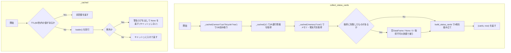
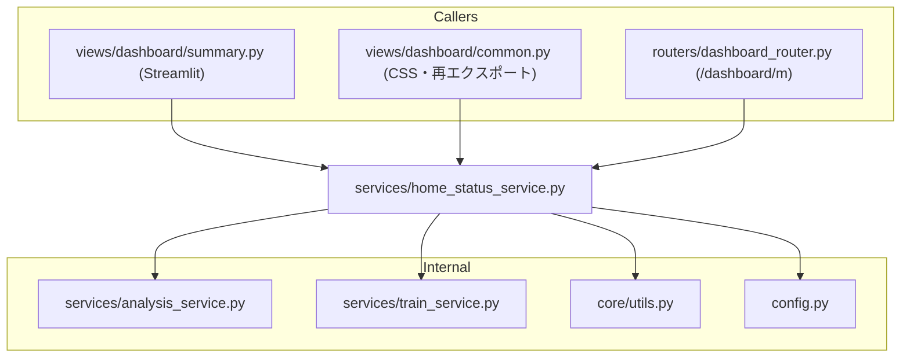

## 1. 解析メタ情報

| 項目 | 内容 |
| --- | --- |
| 対象ファイル | `services/home_status_service.py` |
| 言語 | Python |
| 解析対象 | 提供されたコードのみ |
| 推測・補完 | 一切なし |

## 関連ドキュメント

* [summary.md](./summary.md) - Streamlit側の呼び出し元。判定ロジックは本ファイルへ移動し、あちらは「キャッシュ付きローダで材料を集めて描く」だけになった
* [dashboard_router.md](./dashboard_router.md) - 軽量ページ `{DASHBOARD_BASE_PATH}/m` の呼び出し元。`collect_status_cards` と `render_mobile_status_page_html` を使う
* [dashboard_common.md](./dashboard_common.md) - `StatusCard` と `render_status_card_html` を本ファイルから再エクスポートし、`STATUS_CARD_CSS` を `CUSTOM_CSS` に埋め込む側
* [analysis_service.md](./analysis_service.md) - `load_sensor_data`, `load_generic_data`, `load_bicycle_data`, `load_nas_status`, `get_memory_usage`, `calculate_monthly_cost_cumulative` の提供元
* [train_service.md](./train_service.md) - `get_jr_traffic_status` の提供元

## 2. ファイルの概要

* 「家のいまの状況」を表すステータスカード9枚について、**判定ロジック・カードのHTML組み立て・カードのCSS**を1箇所に集めたモジュール。
* 根拠: `def build_status_cards(` (行番号: 346 / 抜粋: "def build_status_cards(")
* **Streamlit を import しない**。そのため `unified_server.py`（FastAPI）側からも使える。判定は以前 Streamlit の View 層（`views/dashboard/summary.py`）にあり、サーバー側から使えなかったため、軽量ページを作ると同じ判定を2つ書くことになっていた。
* 根拠: `from services import analysis_service, train_service` (行番号: 31 / 抜粋: "from services import analysis_service, train_service")
* 判定関数（`get_takasago_status` 等8つ）はいずれも副作用を持たない純粋関数で、DataFrameや取得済みの値を受け取って `(表示文字列, テーマ名)` を返す。取得は呼び出し側の責務にしてある（Streamlit側はキャッシュ付きローダから、サーバー側は `collect_status_cards` から）。
* 根拠: `def get_takasago_status(df_sensor: pd.DataFrame, now: datetime) -> tuple[str, str]:` (行番号: 136 / 抜粋: "def get_takasago_status(df_sensor: pd.DataFrame, now: datetime) -> tuple[str, str]:")
* サーバー側用に、DB読み取りとスクレイピングをまとめて行う `collect_status_cards` と、TTL 60秒の自前キャッシュ（`unified_server` には `st.cache_data` が無いため）を持つ。
* 根拠: `def collect_status_cards(now: datetime | None = None) -> tuple[list[StatusCard], datetime]:` (行番号: 419 / 抜粋: "def collect_status_cards(now: datetime | None = None) -> tuple[list[StatusCard], datetime]:")
* 軽量ページのHTML全体（`<head>`・カードのグリッド・下部の導線リンク）を組み立てる `render_mobile_status_page_html` を持つ。配信層（ルーター）から独立させるため、リンク先のパス類は引数で受け取る。
* 根拠: `def render_mobile_status_page_html(` (行番号: 492 / 抜粋: "def render_mobile_status_page_html(")

## 3. 外部依存関係

### インポート一覧

| 名称 | 種類 | 用途 | 根拠 |
| --- | --- | --- | --- |
| `html` | 標準ライブラリ | カードのタイトル・値、ページ内のパス類のHTMLエスケープ | `import html` (行番号: 19 / 抜粋: "import html") |
| `logging` | 標準ライブラリ | 取得失敗時の警告ログ | `import logging` (行番号: 20 / 抜粋: "import logging") |
| `threading` | 標準ライブラリ | 自前キャッシュの排他（`threading.Lock`） | `import threading` (行番号: 21 / 抜粋: "import threading") |
| `time` | 標準ライブラリ | キャッシュのTTL判定（`time.monotonic()`） | `import time` (行番号: 22 / 抜粋: "import time") |
| `collections.abc.Callable` | 標準ライブラリ | `_cached` の引数の型注釈 | `from collections.abc import Callable` (行番号: 23 / 抜粋: "from collections.abc import Callable") |
| `datetime.datetime` / `timedelta` | 標準ライブラリ | 時刻比較（経過分数・前日同時刻） | `from datetime import datetime, timedelta` (行番号: 24 / 抜粋: "from datetime import datetime, timedelta") |
| `typing.Any` / `NamedTuple` | 標準ライブラリ | 型注釈、`StatusCard` の定義 | `from typing import Any, NamedTuple` (行番号: 25 / 抜粋: "from typing import Any, NamedTuple") |
| `config` | 内部モジュール | 車テーブル名（`SQLITE_TABLE_CAR`）の参照 | `import config` (行番号: 27 / 抜粋: "import config") |
| `pandas` | 外部ライブラリ | DataFrame/Series の判定処理 | `import pandas as pd` (行番号: 28 / 抜粋: "import pandas as pd") |
| `core.utils.get_now_jst` | 内部モジュール | 現在時刻（JST固定）の取得 | `from core.utils import get_now_jst` (行番号: 29 / 抜粋: "from core.utils import get_now_jst") |
| `services.analysis_service` | 内部モジュール | センサー・車・駐輪場・NAS・メモリ・電気代の取得 | `from services import analysis_service, train_service` (行番号: 31 / 抜粋: "from services import analysis_service, train_service") |
| `services.train_service` | 内部モジュール | JR運行情報の取得 | `from services import analysis_service, train_service` (行番号: 31 / 抜粋: "from services import analysis_service, train_service") |

### ブラックボックスとなる外部要素

| 名称 | 理由 | 根拠 |
| --- | --- | --- |
| `analysis_service` の各ローダ | クエリ・対象テーブル・失敗時の挙動は [analysis_service.md](./analysis_service.md) 側にある。 | `df_sensor = _cached("sensor", lambda: analysis_service.load_sensor_data(limit=MOBILE_SENSOR_ROW_LIMIT))` |
| `train_service.get_jr_traffic_status` | 取得元（API/スクレイピング）と返却辞書のキーは [train_service.md](./train_service.md) 側にある。 | `jr_status = _cached("jr", train_service.get_jr_traffic_status)` |
| `config.SQLITE_TABLE_CAR` | 実際のテーブル名は `config.py` 側で定義される。 | `analysis_service.load_generic_data(config.SQLITE_TABLE_CAR)` |

## 4. 主要要素の定義（関数 / エンドポイント / コンポーネント）

### `STATUS_CACHE_TTL_SEC` / `MOBILE_SENSOR_ROW_LIMIT` / `MOBILE_BICYCLE_ROW_LIMIT` (モジュールレベル定数)

* **役割**: 軽量ページ側のキャッシュTTL（60秒）と、読み込む行数の上限（いずれも3000行）。TTLは Streamlit 側の `DASHBOARD_CACHE_TTL_SEC` と揃えてある。行数が Streamlit 側（10,000行）より小さいのは、カードの判定に必要なのが「直近」と「今日」と「前日同時刻」だけのため。
* 根拠: `STATUS_CACHE_TTL_SEC = 60` (行番号: 38 / 抜粋: "STATUS_CACHE_TTL_SEC = 60"), `MOBILE_SENSOR_ROW_LIMIT = 3000` (行番号: 42 / 抜粋: "MOBILE_SENSOR_ROW_LIMIT = 3000")

* **引数/リクエスト**: なし（定数）
* 根拠: (行番号: 38〜43 / 抜粋: "STATUS_CACHE_TTL_SEC = 60")

* **戻り値/レスポンス**: なし（定数）
* 根拠: (行番号: 38〜43 / 抜粋: "MOBILE_BICYCLE_ROW_LIMIT = 3000")

* **副作用**: なし
* 根拠: (行番号: 38〜43 / 抜粋: "STATUS_CACHE_TTL_SEC = 60")

* **エラーハンドリング**: なし
* 根拠: (行番号: 38〜43 / 抜粋: "STATUS_CACHE_TTL_SEC = 60")

### `STATUS_CARD_CSS` (モジュールレベル定数)

* **役割**: カード1枚分のCSS（`.status-grid` / `.status-card` / `.theme-*`）。Streamlit側の `CUSTOM_CSS` と軽量ページの両方がこれを埋め込むため、どちらかだけ直して見た目が食い違うことがない。グリッドは `repeat(auto-fit, minmax(150px, 1fr))` で、スマホ幅では2列・タブレット〜PCでは3〜5列に自動で折り返す。
* 根拠: `STATUS_CARD_CSS = """` (行番号: 47 / 抜粋: "STATUS_CARD_CSS = \"\"\"")

* **引数/リクエスト**: なし（定数）
* 根拠: (行番号: 47 / 抜粋: "STATUS_CARD_CSS = \"\"\"")

* **戻り値/レスポンス**: なし（定数）
* 根拠: (行番号: 47 / 抜粋: "STATUS_CARD_CSS = \"\"\"")

* **副作用**: なし
* 根拠: (行番号: 47 / 抜粋: "STATUS_CARD_CSS = \"\"\"")

* **エラーハンドリング**: なし
* 根拠: (行番号: 47 / 抜粋: "STATUS_CARD_CSS = \"\"\"")

### `StatusCard` (NamedTuple)

* **役割**: 1枚のカードを表す。`title`, `value`, `theme`, `value_is_html`（既定 `False`）を持つ。`value_is_html` は、色付けの `` や改行の ` ` を意図的に含める呼び出し元だけが `True` にする。
* 根拠: `class StatusCard(NamedTuple):` (行番号: 85 / 抜粋: "class StatusCard(NamedTuple):")

* **引数/リクエスト**: `title` (str), `value` (str), `theme` (str), `value_is_html` (bool, 既定 False)
* 根拠: `class StatusCard(NamedTuple):` (行番号: 85〜95 / 抜粋: "class StatusCard(NamedTuple):")

* **戻り値/レスポンス**: 該当なし（データ型）
* 根拠: `class StatusCard(NamedTuple):` (行番号: 85 / 抜粋: "class StatusCard(NamedTuple):")

* **副作用**: なし
* 根拠: `class StatusCard(NamedTuple):` (行番号: 85 / 抜粋: "class StatusCard(NamedTuple):")

* **エラーハンドリング**: なし
* 根拠: `class StatusCard(NamedTuple):` (行番号: 85 / 抜粋: "class StatusCard(NamedTuple):")

### `render_status_card_html`

* **役割**: カード1枚のHTML文字列を返す。`title` は常にHTMLエスケープし、`value` も既定でエスケープする（Issue #378: スクレイピング由来・DB由来の文字列がそのまま埋め込まれると格納型XSSになりうる）。`value_is_html=True` のときだけ `value` のエスケープをスキップする。
* 根拠: `def render_status_card_html(title: str, value: str, theme: str, *, value_is_html: bool = False) -> str:` (行番号: 97〜121 / 抜粋: "def render_status_card_html(title: str, value: str, theme: str, *, value_is_html: bool = False) -> str:")

* **引数/リクエスト**: `title` (str), `value` (str), `theme` (str), キーワード専用 `value_is_html` (bool, 既定 False)
* 根拠: `def render_status_card_html(title: str, value: str, theme: str, *, value_is_html: bool = False) -> str:` (行番号: 97 / 抜粋: "def render_status_card_html(...)")

* **戻り値/レスポンス**: 改行・インデントを一切含まない1行のHTML文字列。Streamlit の `st.markdown` は本文に `textwrap.dedent()` をかけてからMarkdownとして解釈するため、整形用の空白が残っていると2枚目以降のカードが生のタグ文字列として画面に出る（#807）。
* 根拠: `return (` (行番号: 116〜121 / 抜粋: "f'
'")

* **副作用**: なし（文字列を返すのみ）
* 根拠: `safe_title = html.escape(title)` (行番号: 109 / 抜粋: "safe_title = html.escape(title)")

* **エラーハンドリング**: なし
* 根拠: `safe_value = value if value_is_html else html.escape(value)` (行番号: 110 / 抜粋: "safe_value = value if value_is_html else html.escape(value)")

### `render_status_grid_html`

* **役割**: 複数のカードを `.status-grid` の1ブロックにまとめたHTMLを返す。
* 根拠: `def render_status_grid_html(cards) -> str:` (行番号: 123〜133 / 抜粋: "def render_status_grid_html(cards) -> str:")

* **引数/リクエスト**: `cards` (`StatusCard` のイテラブル)
* 根拠: `def render_status_grid_html(cards) -> str:` (行番号: 123 / 抜粋: "def render_status_grid_html(cards) -> str:")

* **戻り値/レスポンス**: `
…
` の文字列
* 根拠: `return f'
{cards_html}
'` (行番号: 129 / 抜粋: "return f'
{cards_html}
'")

* **副作用**: なし
* 根拠: `cards_html = "".join(` (行番号: 125 / 抜粋: "cards_html = \"\".join(")

* **エラーハンドリング**: なし
* 根拠: `def render_status_grid_html(cards) -> str:` (行番号: 123 / 抜粋: "def render_status_grid_html(cards) -> str:")

### 判定関数（`get_takasago_status` / `get_itami_status` / `get_traffic_status` / `get_server_status` / `get_nas_status_simple` / `get_car_status` / `get_rice_status` / `get_bicycle_status`）

* **役割**: それぞれ1枚のカードの `(表示文字列, テーマ名)` を返す純粋関数。
  * `get_takasago_status`: 高砂（実家）の `contact_state` が `open`/`detected` の最新行からの経過時間で、1時間未満=緑「元気」、3時間未満=黄「静か」、それ以上=赤「N時間 動きなし」。
  * `get_itami_status`: 伊丹（自宅）の人感（`device_type` に `Motion` を含むか `Webhook`）かつ検知（`movement_state` または `contact_state` が `detected`）の最新行から、10分未満=「活動中 (今)」、60分未満=「活動中 (N分前)」、それ以上=「静か (Nh前)」。該当が無ければ開閉センサー（`contact_state == "open"`）で60分未満のみ「活動中」とする。
  * `get_traffic_status`: 取得済みのJR運行情報辞書から、運休=赤、遅延=黄、取得不可=グレー（「平常運転」と偽らない）、それ以外=緑。
  * `get_server_status`: メモリ使用率が80%未満で緑、以上で赤。`None` ならグレー「取得失敗」。
  * `get_nas_status_simple`: `status_ping` が `OK` なら緑、それ以外は赤。`None` はグレー、キー欠落は黄「データ異常」。
  * `get_car_status`: 車ログの最新行の `action` が `LEAVE` なら黄「外出中」、それ以外は緑「在宅」。
  * `get_rice_status`: 今日の炊飯器（`device_name` に「炊飯器」を含む）の最大 `power_watts` が500W以上なら緑「ご飯あり」、それ以外は赤「炊いてない」。
  * `get_bicycle_status`: 対象3エリアの最新待機数と前日同時刻（±2時間で最も近い行）との差を色付きで並べ、合計0=緑、10未満=黄、以上=赤。
* 根拠: `def get_takasago_status(df_sensor: pd.DataFrame, now: datetime) -> tuple[str, str]:` (行番号: 136 / 抜粋: "def get_takasago_status(df_sensor: pd.DataFrame, now: datetime) -> tuple[str, str]:"), `def get_itami_status(df_sensor: pd.DataFrame, now: datetime) -> tuple[str, str]:` (行番号: 160 / 抜粋: "def get_itami_status(df_sensor: pd.DataFrame, now: datetime) -> tuple[str, str]:"), `def get_traffic_status(jr_status: dict[str, dict[str, Any]]) -> tuple[str, str]:` (行番号: 211 / 抜粋: "def get_traffic_status(jr_status: dict[str, dict[str, Any]]) -> tuple[str, str]:"), `def get_server_status(memory: dict[str, float] | None) -> tuple[str, str]:` (行番号: 233 / 抜粋: "def get_server_status(memory: dict[str, float] | None) -> tuple[str, str]:"), `def get_nas_status_simple(nas_data: pd.Series | None) -> tuple[str, str]:` (行番号: 239 / 抜粋: "def get_nas_status_simple(nas_data: pd.Series | None) -> tuple[str, str]:"), `def get_car_status(df_car: pd.DataFrame) -> tuple[str, str]:` (行番号: 251 / 抜粋: "def get_car_status(df_car: pd.DataFrame) -> tuple[str, str]:"), `def get_rice_status(df_sensor: pd.DataFrame, now: datetime) -> tuple[str, str]:` (行番号: 257 / 抜粋: "def get_rice_status(df_sensor: pd.DataFrame, now: datetime) -> tuple[str, str]:"), `def get_bicycle_status(df_bicycle: pd.DataFrame) -> tuple[str, str]:` (行番号: 281 / 抜粋: "def get_bicycle_status(df_bicycle: pd.DataFrame) -> tuple[str, str]:")

* **引数/リクエスト**: DataFrame（センサー・車・駐輪場）、`now`（`datetime`）、取得済みの辞書（JR運行情報・メモリ使用率）、`pd.Series | None`（NAS）
* 根拠: `def get_traffic_status(jr_status: dict[str, dict[str, Any]]) -> tuple[str, str]:` (行番号: 211 / 抜粋: "def get_traffic_status(jr_status: dict[str, dict[str, Any]]) -> tuple[str, str]:")

* **戻り値/レスポンス**: `(表示文字列, テーマ名)` のタプル。テーマ名は `theme-green` / `theme-yellow` / `theme-red` / `theme-blue` / `theme-gray` のいずれか。
* 根拠: `return "⚪ データなし", "theme-gray"` (行番号: 240〜241 / 抜粋: "return \"⚪ データなし\", \"theme-gray\"")

* **副作用**: なし（いずれもデータ取得を行わない）
* 根拠: `def get_server_status(memory: dict[str, float] | None) -> tuple[str, str]:` (行番号: 233 / 抜粋: "def get_server_status(memory: dict[str, float] | None) -> tuple[str, str]:")

* **エラーハンドリング**: 列の欠落・空DataFrameは早期returnで「データなし」を返す。JR運行情報はキー欠落でも例外にならないよう `.get()` に統一されている（Issue #438）。NASは `KeyError` を捕捉して「データ異常」を返す。
* 根拠: `if df_sensor.empty or "location" not in df_sensor.columns or "contact_state" not in df_sensor.columns:` (行番号: 139 / 抜粋: "if df_sensor.empty or \"location\" not in df_sensor.columns"), `except KeyError:` (行番号: 247 / 抜粋: "except KeyError:")

### `build_status_cards`

* **役割**: 渡された材料から、画面に並べる順で9枚の `StatusCard` を組み立てる（取得は行わない）。駐輪場カードだけが `value_is_html=True`（前日比の色付け `` と改行 ` ` を含むため。Issue #378）。
* 根拠: `def build_status_cards(` (行番号: 346〜383 / 抜粋: "def build_status_cards(")

* **引数/リクエスト**: `now`, `df_sensor`, `df_car`, `df_bicycle`, `nas_data`, `jr_status`, `memory`, `monthly_cost`
* 根拠: `def build_status_cards(` (行番号: 346〜355 / 抜粋: "def build_status_cards(")

* **戻り値/レスポンス**: `list[StatusCard]`（9枚）
* 根拠: `StatusCard("🗄️ NAS", nas_val, nas_theme),` (行番号: 373〜383 / 抜粋: "StatusCard(\"👵 高砂 (実家)\", taka_val, taka_theme),")

* **副作用**: なし
* 根拠: `def build_status_cards(` (行番号: 346 / 抜粋: "def build_status_cards(")

* **エラーハンドリング**: なし（各判定関数側で処理される）
* 根拠: `taka_val, taka_theme = get_takasago_status(df_sensor, now)` (行番号: 357 / 抜粋: "taka_val, taka_theme = get_takasago_status(df_sensor, now)")

### `_cached` / `clear_status_cache`

* **役割**: `unified_server` には `st.cache_data` が無いため、同じTTL（60秒）の小さなメモを自前で持つ。`_cached(key, loader)` はTTL内なら前回値を返し、`loader` が例外を送出した場合は例外を伝播させず `None` を返す（1枚のカードの取得失敗でページ全体を落とさない）。**失敗はキャッシュしない**ため、次の要求で再試行される。`clear_status_cache()` はTTLを待たずに捨てる。
* 根拠: `def _cached(key: str, loader: Callable[[], Any]) -> Any:` (行番号: 390〜410 / 抜粋: "def _cached(key: str, loader: Callable[[], Any]) -> Any:"), `def clear_status_cache() -> None:` (行番号: 413 / 抜粋: "def clear_status_cache() -> None:")

* **引数/リクエスト**: `key` (str), `loader` (引数なしの呼び出し可能オブジェクト)
* 根拠: `def _cached(key: str, loader: Callable[[], Any]) -> Any:` (行番号: 390 / 抜粋: "def _cached(key: str, loader: Callable[[], Any]) -> Any:")

* **戻り値/レスポンス**: `loader` の戻り値、または取得失敗時は `None`
* 根拠: `return None` (行番号: 406 / 抜粋: "return None")

* **副作用**: モジュールレベルの `_cache` 辞書の更新（`threading.Lock` で保護）。読み取りのみで、DBへの書き込みは行わない（CLAUDE.md「単一プロセス前提」の並行制御には触れない）。
* 根拠: `_cache[key] = (time.monotonic(), value)` (行番号: 409 / 抜粋: "_cache[key] = (time.monotonic(), value)")

* **エラーハンドリング**: `except Exception` で捕捉し、警告ログを出して `None` を返す（`# noqa: BLE001` 付きで意図を明示）。
* 根拠: `except Exception as e:  # noqa: BLE001 (1枚のカードの取得失敗でページ全体を落とさない)` (行番号: 404 / 抜粋: "except Exception as e:")

### `collect_status_cards`

* **役割**: DB読み取り（センサー・車・駐輪場・NAS）とスクレイピング（JR運行情報）、`psutil`相当のメモリ使用率、今月の電気代をすべて `_cached` 経由で集め、`build_status_cards` に渡して `(カード一覧, 取得時刻)` を返す。取得に失敗した材料は空DataFrame・`None`・`0`・「取得不可」扱いのJR辞書で補う。
* 根拠: `def collect_status_cards(now: datetime | None = None) -> tuple[list[StatusCard], datetime]:` (行番号: 419〜454 / 抜粋: "def collect_status_cards(now: datetime | None = None) -> tuple[list[StatusCard], datetime]:")

* **引数/リクエスト**: `now` (`datetime | None`。省略時は `core.utils.get_now_jst()`)
* 根拠: `now = now or get_now_jst()` (行番号: 425 / 抜粋: "now = now or get_now_jst()")

* **戻り値/レスポンス**: `(list[StatusCard], datetime)`
* 根拠: `return cards, now` (行番号: 446 / 抜粋: "return cards, now")

* **副作用**: DBの読み取り、HTTPスクレイピング、キャッシュの更新。書き込みは行わない。
* 根拠: `df_sensor = _cached("sensor", lambda: analysis_service.load_sensor_data(limit=MOBILE_SENSOR_ROW_LIMIT))` (行番号: 429 / 抜粋: "df_sensor = _cached(\"sensor\", ...)")

* **エラーハンドリング**: 個々の取得失敗は `_cached` が `None` に丸める。JR運行情報が取れなかった場合は両路線 `is_unavailable=True` の辞書を渡し、カードは「情報取得不可」になる（「平常運転」と偽らない）。
* 根拠: `jr_status or {"宝塚線": {"is_unavailable": True}, "神戸線": {"is_unavailable": True}},` (行番号: 442 / 抜粋: "jr_status or {\"宝塚線\": {\"is_unavailable\": True}")

### `MOBILE_PAGE_TITLE` / `MOBILE_PAGE_REFRESH_SEC` / `_MOBILE_PAGE_BASE_CSS` (モジュールレベル定数)

* **役割**: 軽量ページのタイトル（「おうちの様子」）、自動更新間隔（`STATUS_CACHE_TTL_SEC` と同じ60秒）、ページ全体のCSS（本文の余白、下部の導線リンクを44px以上のタップターゲットにする指定を含む）。
* 根拠: `MOBILE_PAGE_TITLE = "おうちの様子"` (行番号: 457 / 抜粋: "MOBILE_PAGE_TITLE = \"おうちの様子\""), `MOBILE_PAGE_REFRESH_SEC = STATUS_CACHE_TTL_SEC` (行番号: 460 / 抜粋: "MOBILE_PAGE_REFRESH_SEC = STATUS_CACHE_TTL_SEC")

* **引数/リクエスト**: なし（定数）
* 根拠: (行番号: 457〜460 / 抜粋: "MOBILE_PAGE_TITLE = \"おうちの様子\"")

* **戻り値/レスポンス**: なし（定数）
* 根拠: (行番号: 457〜460 / 抜粋: "MOBILE_PAGE_REFRESH_SEC = STATUS_CACHE_TTL_SEC")

* **副作用**: なし
* 根拠: (行番号: 462 / 抜粋: "_MOBILE_PAGE_BASE_CSS = \"\"\"")

* **エラーハンドリング**: なし
* 根拠: (行番号: 462 / 抜粋: "_MOBILE_PAGE_BASE_CSS = \"\"\"")

### `render_mobile_status_page_html`

* **役割**: 軽量ページのHTML全体を組み立てる。`<meta http-equiv="refresh">` による自動更新、マニフェスト・`apple-touch-icon`・`apple-mobile-web-app-capable` によるホーム画面追加、カードのグリッド、下部の導線（詳しく見る / ファミクエ）を含む。パス類を引数で受けるのは、このモジュールを配信層（ルーター・中継）から独立させておくため。
* 根拠: `def render_mobile_status_page_html(` (行番号: 492〜531 / 抜粋: "def render_mobile_status_page_html(")

* **引数/リクエスト**: `cards`, `fetched_at` (`datetime`)、キーワード専用の `manifest_path`, `icon_path`, `dashboard_path`, `quest_path`, `refresh_sec`（既定 `MOBILE_PAGE_REFRESH_SEC`）
* 根拠: `refresh_sec: int = MOBILE_PAGE_REFRESH_SEC,` (行番号: 493〜500 / 抜粋: "manifest_path: str,")

* **戻り値/レスポンス**: HTML文字列（`<!DOCTYPE html>` から `</html>` まで）
* 根拠: `return (` (行番号: 508 / 抜粋: "\"<!DOCTYPE html>\"")

* **副作用**: なし（文字列を返すのみ）
* 根拠: `f"{render_status_grid_html(cards)}"` (行番号: 526 / 抜粋: "f\"{render_status_grid_html(cards)}\"")

* **エラーハンドリング**: なし。埋め込むパス類とタイトルは `html.escape` を通す。
* 根拠: `f'<link rel="manifest" href="{html.escape(manifest_path)}" crossorigin="use-credentials">'` (行番号: 516 / 抜粋: "html.escape(manifest_path)")

## 5. 処理フロー図

## 6. 依存関係図

## 7. 次のステップ（リバースエンジニアリングの提案）

| 優先度 | ファイル名(推測可) | 理由 | 根拠 |
| --- | --- | --- | --- |
| 高 | `routers/dashboard_router.py` | 軽量ページの配信（パス・マニフェスト・同期エンドポイントにしている理由）を把握するため。 | `def render_mobile_status_page_html(` (行番号: 492 / 抜粋: "def render_mobile_status_page_html(") |
| 中 | `services/analysis_service.py` | 各ローダが返すDataFrameの列と失敗時の挙動を把握するため。 | `df_car = _cached("car", lambda: analysis_service.load_generic_data(config.SQLITE_TABLE_CAR))` (行番号: 430 / 抜粋: "df_car = _cached(\"car\", ...)") |
| 中 | `views/dashboard/common.py` | Streamlit側がこのモジュールの何を再エクスポートしているかを把握するため。 | `STATUS_CARD_CSS = """` (行番号: 47 / 抜粋: "STATUS_CARD_CSS = \"\"\"") |

## 8. 保守上の注意点

* **このモジュールに Streamlit を import しないこと**: `unified_server.py` が読み込むため、Streamlit 依存を持ち込むとサーバー側が巻き添えになる。`tests/test_mobile_status_page.py` の `TestOneSourceOfTruth` が import 文を検査して固定している。
* 根拠: `from services import analysis_service, train_service` (行番号: 31 / 抜粋: "from services import analysis_service, train_service")

* **判定を呼び出し側（View）へ戻さないこと**: 戻すと軽量ページと本体で同じカードの内容が食い違い、片方だけ直した状態が生まれる。
* 根拠: `def build_status_cards(` (行番号: 346 / 抜粋: "def build_status_cards(")

* **取得失敗をキャッシュしないこと**: `_cached` は失敗時に `None` を返すだけでキャッシュに入れない。入れてしまうと、復旧してもTTLの60秒間は壊れた表示のままになる。
* 根拠: `except Exception as e:  # noqa: BLE001 (1枚のカードの取得失敗でページ全体を落とさない)` (行番号: 404 / 抜粋: "except Exception as e:")

* **`value_is_html=True` を渡す呼び出し元は、値の構築元に外部/DB由来の生文字列を含めないこと**: エスケープをスキップするため、格納型XSSの経路になりうる（Issue #378）。現状これを使うのは駐輪場カードだけで、値は数値と自前のHTML断片からのみ組み立てられている。
* 根拠: `StatusCard("🚲 駐輪場待機", bicycle_val, bicycle_theme, value_is_html=True),` (行番号: 374 / 抜粋: "StatusCard(\"🚲 駐輪場待機\", bicycle_val, bicycle_theme, value_is_html=True),")

## 9. 不明事項一覧

| 項目 | 理由 | 必要なファイル |
| --- | --- | --- |
| 各ローダが返すDataFrameの正確な列とクエリ | `analysis_service` の実装が本ファイルからは見えないため。 | `services/analysis_service.py` |
| JR運行情報の取得元と辞書のキー | `train_service` の実装が本ファイルからは見えないため。 | `services/train_service.py` |
| `config.SQLITE_TABLE_CAR` の実際の値 | 定数の定義が本ファイルからは見えないため。 | `config.py` |

## 10. 自己検証結果

* [x] 推測・外部ファイルの仕様を一切含んでいない
* [x] 全関数・全クラス・全コンポーネントを列挙した
* [x] 全てのインポート要素を列挙した
* [x] すべての仕様説明に「根拠（行番号・抜粋）」を明記した
* [x] 根拠漏れが0件である
* [x] Mermaid構文にエラーの原因となる記号（エスケープ漏れ）がない
* [x] 不明事項を漏れなく列挙した
