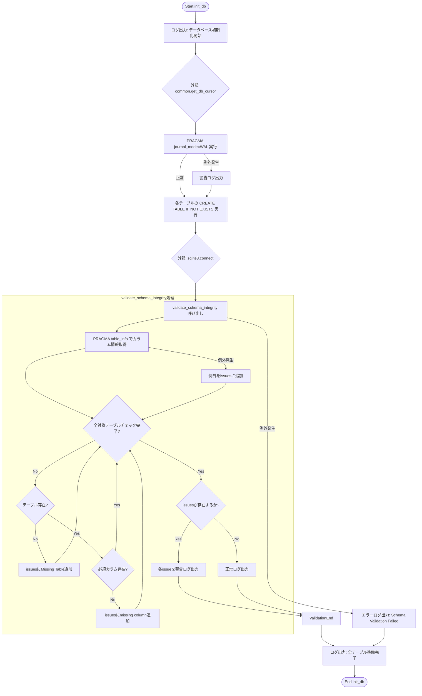
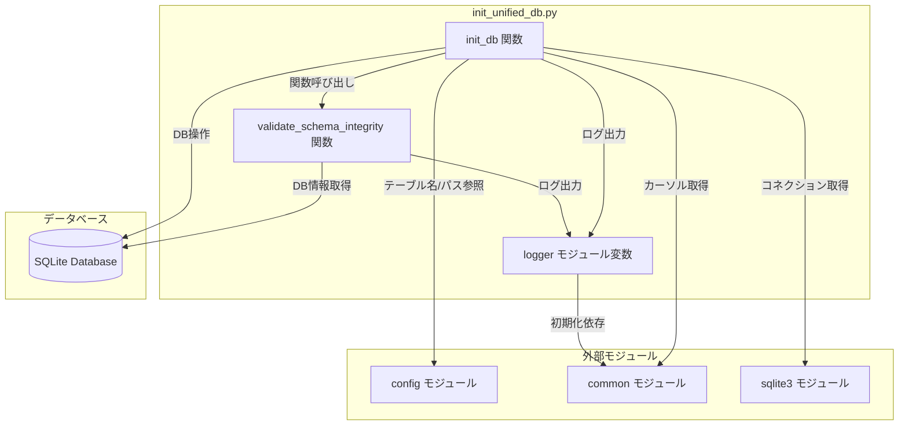

## 1. 解析メタ情報

| 項目 | 内容 |
| --- | --- |
| 対象ファイル | `init_unified_db.py` |
| 言語 | Python |
| 解析対象 | 提供されたコードのみ |
| 推測・補完 | 一切なし |

## 2. ファイルの概要

本ファイルは、SQLiteデータベースの初期化とスキーマの整合性検証を行うスクリプトです。システムの稼働に必要な各種テーブル群（Core Tables、Legacy Tables、Game & Quest System等のトランジション用テーブル）を `CREATE TABLE IF NOT EXISTS` 文を用いて作成し、主要なテーブルに期待されるカラムが正しく定義されているかを `PRAGMA table_info` を使用して自動検証します。

## 3. 外部依存関係

### インポート一覧

| 名称 | 種類 | 用途 | 根拠 |
| --- | --- | --- | --- |
| `sqlite3` | 標準ライブラリ | データベース接続および操作に使用 | 根拠: `import sqlite3` (行番号取得不可 / 抜粋: "import sqlite3") |
| `logging` | 標準ライブラリ | ログ機能に関連するモジュール（※直接的な関数呼び出しはなし） | 根拠: `import logging` (行番号取得不可 / 抜粋: "import logging") |
| `typing` | 標準ライブラリ | 型ヒント（List, Dict, Any, Optional）に使用 | 根拠: `from typing import List...` (行番号取得不可 / 抜粋: "from typing import List, Dict") |
| `config` | カスタムモジュール | データベースのパスやテーブル名の定数を取得 | 根拠: `import config` (行番号取得不可 / 抜粋: "import config") |
| `common` | カスタムモジュール | ロガーの初期化やDBカーソルの取得に使用 | 根拠: `import common` (行番号取得不可 / 抜粋: "import common") |

### ブラックボックスとなる外部要素

| 名称 | 理由 | 根拠 |
| --- | --- | --- |
| `config.SQLITE_TABLE_*` 等の定数群 | 具体的なテーブル名の文字列値が本ファイル内では定義されていないため不明 | 根拠: `config.SQLITE_TABLE_DAILY_LOGS` (行番号取得不可 / 抜粋: "config.SQLITE_TABLE_DAILY_LOGS") |
| `config.SQLITE_DB_PATH` | データベースファイルの保存先パスが不明 | 根拠: `config.SQLITE_DB_PATH` (行番号取得不可 / 抜粋: "config.SQLITE_DB_PATH") |
| `common.setup_logging` | 引数 `"init_db"` を渡した際の具体的なログフォーマットや出力先が不明 | 根拠: `common.setup_logging` (行番号取得不可 / 抜粋: "logger = common.setup_logging") |
| `common.get_db_cursor` | 引数 `commit=True` を渡した際のDB接続確立プロセスやトランザクション管理処理の実装が不明 | 根拠: `common.get_db_cursor` (行番号取得不可 / 抜粋: "with common.get_db_cursor(commi") |

## 4. 主要要素の定義（関数 / エンドポイント / コンポーネント）

### `validate_schema_integrity`

* **役割**: `expected_schemas` 辞書に定義された主要テーブルについて、`PRAGMA table_info` を実行してカラム情報を取得し、期待される必須カラムが存在するかどうかを検証し、結果をログ出力する。
* 根拠: `def validate_schema_integrity(conn: sqlite3.Connection) -> None:` (行番号取得不可 / 抜粋: "def validate_schema_integrity(")

* **引数/リクエスト**: `conn` (`sqlite3.Connection`): SQLiteデータベースへの接続オブジェクト。
* 根拠: 引数定義 (行番号取得不可 / 抜粋: "conn: sqlite3.Connection")

* **戻り値/レスポンス**: `None`
* 根拠: 戻り値の型アノテーション (行番号取得不可 / 抜粋: "-> None:")

* **副作用**: `logger` を使用して、スキーマの欠損がある場合は `warning` レベルで、正常な場合は `info` レベルでログを出力する。
* 根拠: `logger.warning` / `logger.info` 呼び出し (行番号取得不可 / 抜粋: "logger.warning(f"⚠️ Schema Int")

* **エラーハンドリング**: 各テーブルの `PRAGMA table_info` 実行時に発生した `Exception` をキャッチし、エラー内容を検証エラーのリスト (`issues`) に追加する。
* 根拠: `try...except Exception as e:` (行番号取得不可 / 抜粋: "except Exception as e:")

### `init_db`

* **役割**: ロギング開始後、`common.get_db_cursor` でカーソルを取得し、WALモードを有効化。その後、アプリケーションで利用する全テーブル（Core, Legacy, Game/Quest等）の `CREATE TABLE IF NOT EXISTS` 文を実行し、最後に `sqlite3.connect` を用いて `validate_schema_integrity` を呼び出す。
* 根拠: `def init_db() -> None:` (行番号取得不可 / 抜粋: "def init_db() -> None:")

* **引数/リクエスト**: なし
* 根拠: 引数定義 (行番号取得不可 / 抜粋: "def init_db() -> None:")

* **戻り値/レスポンス**: `None`
* 根拠: 戻り値の型アノテーション (行番号取得不可 / 抜粋: "-> None:")

* **副作用**: データベースファイルへのテーブル作成（書き込み処理）、設定変更（`PRAGMA journal_mode=WAL;`）、および標準出力を伴うログ記録。
* 根拠: `cur.execute` によるSQL実行 (行番号取得不可 / 抜粋: "cur.execute('''")

* **エラーハンドリング**:
* WALモード設定失敗時の `Exception` をキャッチし `logger.warning` でログ出力。
* 根拠: `except Exception as e:` (行番号取得不可 / 抜粋: "logger.warning(f"⚠️ WALモード設定失")

* `validate_schema_integrity` 実行時の `Exception` をキャッチし `logger.error` でログ出力。
* 根拠: `except Exception as e:` (行番号取得不可 / 抜粋: "logger.error(f"Schema Validatio")

## 5. 処理フロー図

## 6. 依存関係図

## 7. 次のステップ（リバースエンジニアリングの提案）

| 優先度 | ファイル名(推測可) | 理由 | 根拠 |
| --- | --- | --- | --- |
| 高 | `config.py` | `SQLITE_TABLE_*` の具体的なテーブル名や `SQLITE_DB_PATH` の実際の保存場所を特定し、本スクリプトがどこに影響を及ぼすかを正確に把握するため。 | 根拠: `config.SQLITE_DB_PATH` 等の参照 (行番号取得不可 / 抜粋: "import config") |
| 中 | `common.py` | `get_db_cursor(commit=True)` の内部実装におけるトランザクション制御や排他制御の仕様を確認し、DB初期化時の安全性を評価するため。 | 根拠: `common.get_db_cursor` の呼び出し (行番号取得不可 / 抜粋: "import common") |

## 8. 保守上の注意点

* `init_db` 内でテーブル作成に `common.get_db_cursor(commit=True)` を使用している一方、その直後の `validate_schema_integrity` 実行時には別途 `sqlite3.connect(config.SQLITE_DB_PATH)` で新規コネクションを張り直している。
* `validate_schema_integrity` で定義されている `expected_schemas` 辞書にはすべての作成テーブルが網羅されているわけではなく、一部の主要テーブルのみが検証対象となっている。
* WALモードの有効化 (`PRAGMA journal_mode=WAL;`) に失敗した場合でも、例外をキャッチして処理を継続する設計となっている。
* 複数の `CREATE TABLE` において、外部キー制約を利用しているテーブル (`user_inventory` など) があるが、`PRAGMA foreign_keys = ON;` を実行する記述が本ファイル内には存在しない。

## 9. 不明事項一覧

| 項目 | 理由 | 必要なファイル |
| --- | --- | --- |
| 各テーブルの実際のテーブル名 | 定数として管理されており、本ファイル内では定義されていないため。 | `config.py` |
| データベースの物理保存パス | `SQLITE_DB_PATH` で指定されているが実際の文字列が不明なため。 | `config.py` |
| `get_db_cursor` の詳細挙動 | 例外発生時のロールバック処理などがどのように行われているか不明なため。 | `common.py` |
| 外部キー制約の有効化状態 | 本ファイルで外部キー制約を用いたテーブルを生成しているが、制約の有効化状態が呼び出し元の挙動に依存するため。 | DB接続を管理するファイル (例: `common.py`) |

## 10. 自己検証結果

* [x] 推測・外部ファイルの仕様を一切含んでいない
* [x] 全関数・全クラス・全コンポーネントを列挙した
* [x] 全てのインポート要素を列挙した
* [x] すべての仕様説明に「根拠（行番号・抜粋）」を明記した
* [x] 根拠漏れが0件である
* [x] Mermaid構文にエラーの原因となる記号（エスケープ漏れ）がない
* [x] 不明事項を漏れなく列挙した

完了