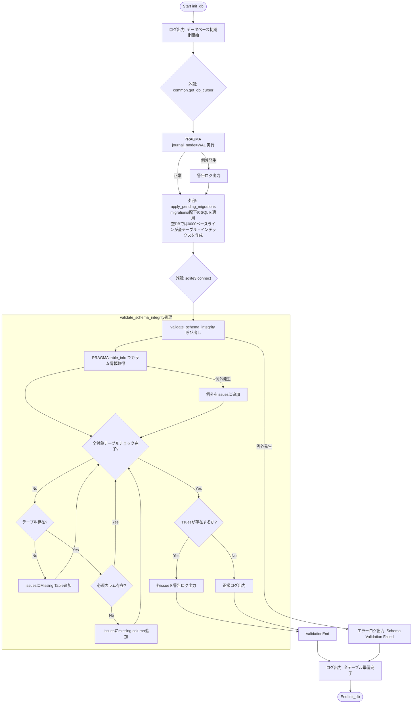
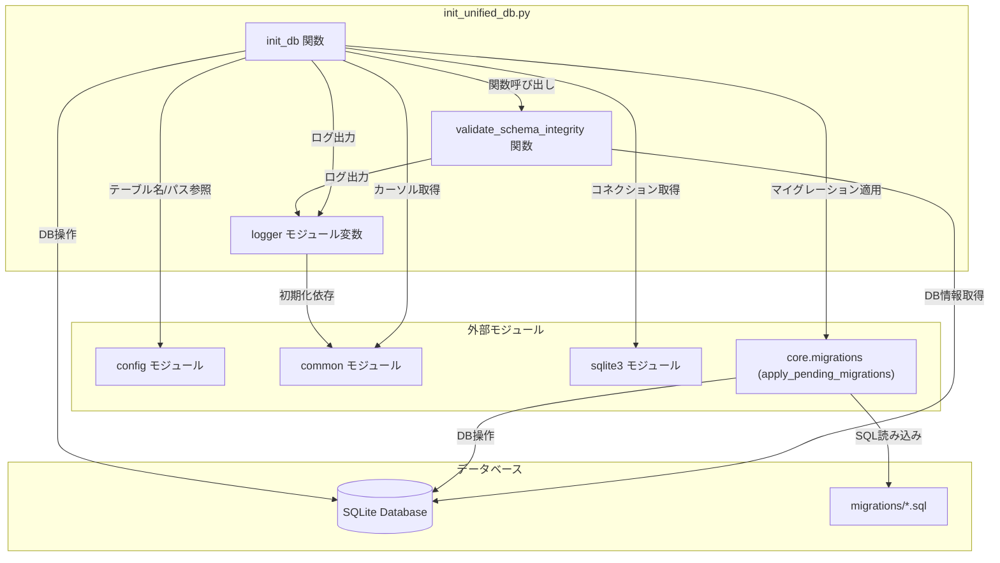

## 1. 解析メタ情報

| 項目 | 内容 |
| --- | --- |
| 対象ファイル | `init_unified_db.py` |
| 言語 | Python |
| 解析対象 | 提供されたコードのみ |
| 推測・補完 | 一切なし |

## 関連ドキュメント

* [config.md](./config.md) - `config.SQLITE_TABLE_*`定数群および`config.SQLITE_DB_PATH`を提供
* [common.md](./common.md) - `common.setup_logging`, `common.get_db_cursor`のFacade再エクスポート元
* [database.md](./database.md) - `common.get_db_cursor`の実体(`core.database.get_db_cursor`)。WALモード・外部キー制約(`PRAGMA foreign_keys=ON`)の有効化やリトライ機構を提供
* [logger.md](./logger.md) - `setup_logging`の実体
* [quest_service.md](./quest_service.md) - 本ファイルが作成する`quest_history.linked_history_id`等のカラムを実際に利用する呼び出し元

## 2. ファイルの概要

本ファイルは、SQLiteデータベースの初期化とスキーマの整合性検証を行うスクリプトです。**Issue #330（スキーマ管理のmigrations/一本化）以降、本ファイルはスキーマ定義（CREATE TABLE群）を一切持たない薄いラッパー**であり、WALモードの有効化と `apply_pending_migrations()` によるマイグレーション適用（空DBでは `migrations/0000_baseline_schema.sql` が全テーブル・インデックスを作成し、0001以降がカラム追加・データ移行を積み上げる）、および主要テーブルのカラムが期待どおりかの `PRAGMA table_info` による自動検証のみを行います。以前ここにあった各種テーブル群（Core Tables、Legacy Tables、Game & Quest System等）の `CREATE TABLE IF NOT EXISTS` 文と高頻度書き込みテーブル（`power_usage`, `switchbot_meter_logs`, `device_records`）へのインデックス作成は `migrations/0000_baseline_schema.sql` へ移設されました。
* 根拠: `init_db`のdocstring (行番号: 56-64 / 抜粋: "Issue #330 (スキーマ管理のmigrations/一本化) 以降、本関数はスキーマ定義を\n    一切持たない薄いラッパーである。")

## 3. 外部依存関係

### インポート一覧

| 名称 | 種類 | 用途 | 根拠 |
| --- | --- | --- | --- |
| `sqlite3` | 標準ライブラリ | データベース接続および操作に使用 | 根拠: `import sqlite3` (行番号: 2 / 抜粋: "import sqlite3") |
| `typing` | 標準ライブラリ | 型ヒント（`List`, `Dict`）に使用 | 根拠: `from typing import List, Dict` (行番号: 3 / 抜粋: "from typing import List, Dict") |
| `config` | カスタムモジュール | データベースのパスやテーブル名の定数を取得 | 根拠: `import config` (行番号: 4 / 抜粋: "import config") |
| `common` | カスタムモジュール | ロガーの初期化やDBカーソルの取得に使用 | 根拠: `import common` (行番号: 5 / 抜粋: "import common") |
| `core.migrations.apply_pending_migrations` | カスタムモジュール | `migrations/`配下のバージョン管理されたマイグレーションSQLの適用（0000ベースライン含む） | 根拠: `from core.migrations import apply_pending_migrations` (行番号: 6 / 抜粋: "from core.migrations import apply_pending_migrations") |

### ブラックボックスとなる外部要素

| 名称 | 理由 | 根拠 |
| --- | --- | --- |
| `config.SQLITE_TABLE_*` 等の定数群 | 具体的なテーブル名の文字列値が本ファイル内では定義されていないため不明 | 根拠: `config.SQLITE_TABLE_DAILY_LOGS` (行番号: 21 / 抜粋: "config.SQLITE_TABLE_DAILY_LOGS: [\"category\", \"detail\", \"timestamp\"],") |
| `config.SQLITE_DB_PATH` | データベースファイルの保存先パスが不明 | 根拠: `config.SQLITE_DB_PATH` (行番号: 65, 85 / 抜粋: "with sqlite3.connect(config.SQLITE_DB_PATH) as conn:") |
| `common.setup_logging` | 引数 `"init_db"` を渡した際の具体的なログフォーマットや出力先が不明 | 根拠: `common.setup_logging` (行番号: 8 / 抜粋: "logger = common.setup_logging("init_db")") |
| `common.get_db_cursor` | 引数 `commit=True` を渡した際のDB接続確立プロセスやトランザクション管理処理の実装が不明 | 根拠: `common.get_db_cursor` (行番号: 67 / 抜粋: "with common.get_db_cursor(commit=True) as cur:") |

## 4. 主要要素の定義（関数 / エンドポイント / コンポーネント）

### `logger`

* **役割**: `init_db` という名前でセットアップされたロガーのインスタンスを保持する。
* 根拠: `logger = common.setup_logging("init_db")` (行番号: 8 / 抜粋: "logger = common.setup_logging(\"init_db\")")

### `validate_schema_integrity`

* **役割**: `expected_schemas` 辞書に定義された主要テーブルについて、`PRAGMA table_info` を実行してカラム情報を取得し、期待される必須カラムが存在するかどうかを検証し、結果をログ出力する。
* 根拠: `def validate_schema_integrity(conn: sqlite3.Connection) -> None:` (行番号: 10-53 / 抜粋: "設計書(3.1)に基づくスキーマ整合性の自動検証を行う。")

* **引数/リクエスト**: `conn` (`sqlite3.Connection`): SQLiteデータベースへの接続オブジェクト。
* 根拠: 引数定義 (行番号: 10 / 抜粋: "def validate_schema_integrity(conn: sqlite3.Connection) -> None:")

* **戻り値/レスポンス**: `None`
* 根拠: 戻り値の型アノテーション (行番号: 10 / 抜粋: "def validate_schema_integrity(conn: sqlite3.Connection) -> None:")

* **副作用**: `logger` を使用して、スキーマの欠損がある場合は `warning` レベルで、正常な場合は `info` レベルでログを出力する。
* 根拠: `logger.warning` / `logger.info` 呼び出し (行番号: 51, 53 / 抜粋: "logger.warning(f\"⚠️ Schema Integrity Issue: {issue}\")")

* **エラーハンドリング**: 各テーブルの `PRAGMA table_info` 実行時に発生した `Exception` をキャッチし、エラー内容を検証エラーのリスト (`issues`) に追加する。
* 根拠: `try...except Exception as e:` (行番号: 34, 46-47 / 抜粋: "except Exception as e:")

### `init_db`

* **役割**: ロギング開始後、`common.get_db_cursor` でカーソルを取得し、WALモードを有効化（`PRAGMA journal_mode=WAL`の結果行を`cur.fetchall()`で読み切る。未消費のまま後続処理がcommitすると "cannot commit transaction - SQL statements in progress" になるため）。続いて `apply_pending_migrations(cur.connection)` でバージョン管理されたマイグレーション（0000ベースライン含む）を適用し、最後に `sqlite3.connect` を用いて `validate_schema_integrity` を呼び出す。**Issue #330以降、CREATE TABLE / CREATE INDEX文は本関数に存在しない**（`migrations/0000_baseline_schema.sql`へ移設済み）。
* 根拠: `def init_db() -> None:` (行番号: 55-90 / 抜粋: "本関数はスキーマ定義を\n    一切持たない薄いラッパーである。")、`cur.fetchall()` (行番号: 70-74 / 抜粋: "cur.execute(\"PRAGMA journal_mode=WAL;\")")、`apply_pending_migrations(cur.connection)` (行番号: 81 / 抜粋: "apply_pending_migrations(cur.connection)")

* **引数/リクエスト**: なし
* 根拠: 引数定義 (行番号: 55 / 抜粋: "def init_db() -> None:")

* **戻り値/レスポンス**: `None`
* 根拠: 戻り値の型アノテーション (行番号: 55 / 抜粋: "def init_db() -> None:")

* **副作用**: 設定変更（`PRAGMA journal_mode=WAL;`、行番号: 70）、`core.migrations.apply_pending_migrations`によるマイグレーションSQLの適用（空DBでは0000ベースラインによる全テーブル・インデックス作成、`schema_migrations`テーブルへの記録を含む、行番号: 81）、および標準出力を伴うログ記録（行番号: 65, 90）。
* 根拠: `cur.execute` によるSQL実行 (行番号: 70 / 抜粋: "cur.execute(\"PRAGMA journal_mode=WAL;\")")、マイグレーション適用 (行番号: 78-81 / 抜粋: "apply_pending_migrations(cur.connection)")

* **エラーハンドリング**:
* WALモード設定失敗時の `Exception` をキャッチし `logger.warning` でログ出力。
* 根拠: `except Exception as e:` (行番号: 69-76 / 抜粋: "logger.warning(f\"⚠️ WALモード設定失敗: {e}\")")

* `validate_schema_integrity` 呼び出しを含む `sqlite3.connect` ブロック実行時の `Exception` をキャッチし `logger.error` でログ出力。
* 根拠: `try: ... except Exception as e:` (行番号: 83-88 / 抜粋: "logger.error(f\"Schema Validation Failed: {e}\")")

## 5. 処理フロー図

```mermaid
flowchart TD
    Start([Start init_db]) --> LogStart[ログ出力: データベース初期化開始]
    LogStart --> GetCursor{外部: common.get_db_cursor}
    GetCursor --> SetWAL[PRAGMA journal_mode=WAL 実行]
    SetWAL -- 例外発生 --> LogWALError[警告ログ出力]
    SetWAL -- 正常 --> ApplyMigrations[外部: apply_pending_migrations<br>migrations/配下のSQLを適用<br>空DBでは0000ベースラインが全テーブル・インデックスを作成]
    LogWALError --> ApplyMigrations
    ApplyMigrations --> ConnectDB{外部: sqlite3.connect}
    ConnectDB --> CallValidate[validate_schema_integrity 呼び出し]
    
    subgraph validate_schema_integrity処理
        CallValidate --> GetSchemaInfo[PRAGMA table_info でカラム情報取得]
        GetSchemaInfo --> CheckTables{全対象テーブルチェック完了?}
        CheckTables -- No --> TableExist{テーブル存在?}
        TableExist -- No --> AddIssueMissing[issuesにMissing Table追加]
        TableExist -- Yes --> ColExist{必須カラム存在?}
        ColExist -- No --> AddIssueCol[issuesにmissing column追加]
        ColExist -- Yes --> CheckTables
        AddIssueMissing --> CheckTables
        AddIssueCol --> CheckTables
        GetSchemaInfo -- 例外発生 --> CatchPragma[例外をissuesに追加] --> CheckTables
        CheckTables -- Yes --> HasIssue{issuesが存在するか?}
        HasIssue -- Yes --> LogWarning[各issueを警告ログ出力]
        HasIssue -- No --> LogInfo[正常ログ出力]
    end
    
    LogWarning --> ValidationEnd
    LogInfo --> ValidationEnd
    
    ValidationEnd --> LogComplete[ログ出力: 全テーブル準備完了]
    CallValidate -- 例外発生 --> CatchValErr[エラーログ出力: Schema Validation Failed]
    CatchValErr --> LogComplete
    LogComplete --> End([End init_db])

```

## 6. 依存関係図

```mermaid
graph TD
    subgraph init_unified_db.py
        init_db[init_db 関数]
        validate_schema_integrity[validate_schema_integrity 関数]
        logger[logger モジュール変数]
    end

    subgraph 外部モジュール
        config[config モジュール]
        common[common モジュール]
        sqlite3[sqlite3 モジュール]
        migrations["core.migrations (apply_pending_migrations)"]
    end

    subgraph データベース
        SQLiteDB[(SQLite Database)]
        MigrationFiles["migrations/*.sql"]
    end

    logger -->|初期化依存| common
    init_db -->|テーブル名/パス参照| config
    init_db -->|カーソル取得| common
    init_db -->|コネクション取得| sqlite3
    init_db -->|DB操作| SQLiteDB
    init_db -->|マイグレーション適用| migrations
    migrations -->|SQL読み込み| MigrationFiles
    migrations -->|DB操作| SQLiteDB
    init_db -->|関数呼び出し| validate_schema_integrity
    validate_schema_integrity -->|DB情報取得| SQLiteDB
    validate_schema_integrity -->|ログ出力| logger
    init_db -->|ログ出力| logger

```

## 7. 次のステップ（リバースエンジニアリングの提案）

| 優先度 | ファイル名(推測可) | 理由 | 根拠 |
| --- | --- | --- | --- |
| 高 | `config.py` | `SQLITE_TABLE_*` の具体的なテーブル名や `SQLITE_DB_PATH` の実際の保存場所を特定し、本スクリプトがどこに影響を及ぼすかを正確に把握するため。 | 根拠: `config.SQLITE_DB_PATH` 等の参照 (行番号: 5, 61, 572 / 抜粋: "import config") |
| 中 | `common.py` | `get_db_cursor(commit=True)` の内部実装におけるトランザクション制御や排他制御の仕様を確認し、DB初期化時の安全性を評価するため。 | 根拠: `common.get_db_cursor` の呼び出し (行番号: 6, 63 / 抜粋: "import common") |

## 8. 保守上の注意点

* `init_db` 内でテーブル作成に `common.get_db_cursor(commit=True)` を使用している一方、その直後の `validate_schema_integrity` 実行時には別途 `sqlite3.connect(config.SQLITE_DB_PATH)` で新規コネクションを張り直している。
* `validate_schema_integrity` で定義されている `expected_schemas` 辞書にはすべての作成テーブルが網羅されているわけではなく、一部の主要テーブルのみが検証対象となっている。
* WALモードの有効化 (`PRAGMA journal_mode=WAL;`) に失敗した場合でも、例外をキャッチして処理を継続する設計となっている。
* **Issue #330でスキーマ定義を退役**: 以前本ファイルが持っていた全テーブルの `CREATE TABLE IF NOT EXISTS` 文とインデックス作成は `migrations/0000_baseline_schema.sql` へ移設された。migrations/のみで構築したスキーマが旧init_db構築スキーマを包含することは、`tests/test_empty_db_e2e.py` が旧スキーマのスナップショット(`tests/fixtures/legacy_init_db_schema.json`)との突き合わせで検証している。今後のスキーマ変更は本ファイルではなく `migrations/NNNN_*.sql` に追加すること。外部キー制約（`user_inventory` の `FOREIGN KEY` など）はベースラインSQL内で定義され、`PRAGMA foreign_keys=ON;` は `common.get_db_cursor`（実体は `core/database.py` の `get_db_cursor`）が接続確立時に毎回発行する。
* `apply_pending_migrations` は `migrations/` 配下の未適用SQLファイルをファイル名昇順で適用し、`schema_migrations` テーブルで適用済みバージョンを管理する。既に別経路（`services/quest_service.py` の実行時チェック等）でカラムが追加済みの環境に対して再適用された場合、`ALTER TABLE` の失敗(`sqlite3.OperationalError`)は警告ログに留め処理を継続する。
* Issue #114で修正（歴史的経緯・現在の定義は`migrations/0000_baseline_schema.sql`側にある）: `weather_history` テーブルの `CREATE TABLE` 定義が `current_schema.sql`（実運用スキーマ）と乖離しており、`location`/`max_pop`/`umbrella_level` 列が存在しなかったため、新規DB(init_db)では `services/analysis_service.py` の `load_weather_history`/`load_yearly_temperature_stats` が要求するこれらの列を欠いたまま `PRAGMA table_info` による整合性検証(`validate_schema_integrity`)の対象外にもなっており、実行時の `no such column` エラーが検知されずに天気関連の表示が無言で空になっていた。`CREATE TABLE` 定義を `current_schema.sql` に合わせて修正し、既存DB向けに `migrations/0007_add_weather_history_location_columns.sql` を追加した。

## 9. 不明事項一覧

| 項目 | 理由 | 必要なファイル |
| --- | --- | --- |
| 各テーブルの実際のテーブル名 | 定数として管理されており、本ファイル内では定義されていないため。 | `config.py` |
| データベースの物理保存パス | `SQLITE_DB_PATH` で指定されているが実際の文字列が不明なため。 | `config.py` |
| `get_db_cursor` の詳細挙動 | 例外発生時のロールバック処理などがどのように行われているか不明なため。 | `common.py` |
| `migrations/`配下のSQL内容 | 実際にどのようなマイグレーションが登録されているか（対象テーブル・カラム）が本ファイルからは不明なため。 | `migrations/*.sql`, `core/migrations.py` |

## 相互参照による補足情報

| 元の不明事項 | 判明した内容 | 参照元ドキュメント |
| --- | --- | --- |
| `get_db_cursor` の詳細挙動 | `database.md`の解析によれば、`get_db_cursor`(`common.get_db_cursor`の実体)は最大5回・1秒間隔のリトライ機構を備え、接続時に`PRAGMA journal_mode=WAL;`と`PRAGMA foreign_keys=ON;`を実行するコンテキストマネージャであり、`OperationalError`(locked)以外の例外発生時はロールバックして再送出するとされる。 | database.md |
| `migrations/`配下のSQL内容 | `MY_HOME_SYSTEM/migrations/`配下の5ファイルと`MY_HOME_SYSTEM/core/migrations.py`(全83行)を直接確認した。`0001_add_quest_users_role.sql`は`quest_users`に`role`列を追加し`dad`/`mom`を`role_adult`、`daughter`/`son`/`child`を`role_child`に初期設定する。`0002_add_quest_master_reset_period.sql`は`quest_master`に`reset_period TEXT DEFAULT 'weekly_monday'`列を追加する。`0003_add_reward_master_description.sql`は`reward_master`に`description`列を追加する。`0004_add_coop_quest_link.sql`は`quest_history`に兄弟連携クエスト用の`linked_history_id INTEGER DEFAULT NULL`列を追加する。`0005_fix_quest_master_reset_period_default.sql`は、コメントによれば0002で設定した既定値`'weekly_monday'`が`is_within_reset_period()`が扱えない値でありクエスト完了判定が常にFalseになるバグを引き起こしていたため、既存データの`reset_period`が`NULL`または`'weekly_monday'`の行を`'daily'`に補正する内容である。適用側の`core/migrations.py`は、`_discover_migration_files()`(43〜46行目)が`migrations/`配下の`*.sql`をファイル名昇順で列挙し、`apply_pending_migrations(conn)`(49〜82行目)が`schema_migrations`テーブル(28〜34行目で`CREATE TABLE IF NOT EXISTS`定義、`version TEXT PRIMARY KEY`)を参照して未適用分のみ`conn.executescript(sql)`で実行・記録する。「duplicate column」等の`sqlite3.OperationalError`は既に別経路で適用済みとみなして警告ログのみ出し、バージョンを適用済みとして記録して起動を継続する設計であることを確認した(76〜82行目)。本ファイル(`init_unified_db.py`)の初期スキーマ作成とは別系統の、バージョン管理されたマイグレーション機構である。 | 直接ソース確認: `MY_HOME_SYSTEM/migrations/0001_add_quest_users_role.sql`, `MY_HOME_SYSTEM/migrations/0002_add_quest_master_reset_period.sql`, `MY_HOME_SYSTEM/migrations/0003_add_reward_master_description.sql`, `MY_HOME_SYSTEM/migrations/0004_add_coop_quest_link.sql`, `MY_HOME_SYSTEM/migrations/0005_fix_quest_master_reset_period_default.sql`, `MY_HOME_SYSTEM/core/migrations.py:28-82` |
| 各テーブルの実際のテーブル名／データベースの物理保存パス | `config.md`の解析によれば、`config.SQLITE_TABLE_*`および`config.SQLITE_DB_PATH`は環境変数等から初期化される定数であることが判明したが、実際の文字列値自体は`config.md`でも確認できていない。 | config.md |

## 10. 自己検証結果

* [x] 推測・外部ファイルの仕様を一切含んでいない
* [x] 全関数・全クラス・全コンポーネントを列挙した
* [x] 全てのインポート要素を列挙した
* [x] すべての仕様説明に「根拠（行番号・抜粋）」を明記した
* [x] 根拠漏れが0件である
* [x] Mermaid構文にエラーの原因となる記号（エスケープ漏れ）がない
* [x] 不明事項を漏れなく列挙した

完了