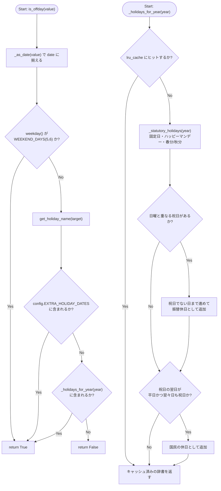
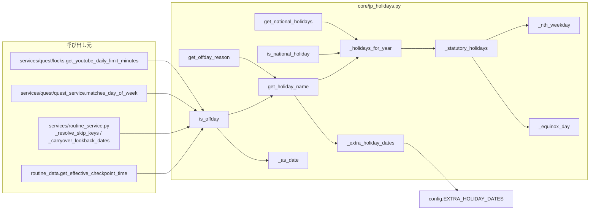

## 1. 解析メタ情報

| 項目 | 内容 |
| --- | --- |
| 対象ファイル | `core/jp_holidays.py` |
| 言語 | Python |
| 解析対象 | 提供されたコードのみ |
| 推測・補完 | 一切なし |

## 関連ドキュメント

* [config.md](./config.md) - `EXTRA_HOLIDAY_DATES`（祝日ではないが休日扱いにしたい日）を提供する
* [routine_data.md](./routine_data.md) - `is_offday` を `get_effective_checkpoint_time` で使用する呼び出し元
* [routine_service.md](./routine_service.md) - `is_offday` を `_resolve_skip_keys` / `_carryover_lookback_dates` で使用する呼び出し元
* [quest_quest_service.md](./quest_quest_service.md) - `is_offday` / `WEEKEND_DAYS` を `matches_day_of_week` で使用する呼び出し元
* [quest_locks.md](./quest_locks.md) - `is_offday` を `get_youtube_daily_limit_minutes` で使用する呼び出し元

## 2. ファイルの概要

日本の「国民の祝日」と、ファミクエ上の「休日」を判定するモジュール。ファイル冒頭のdocstringが述べる通り、それ以前このリポジトリには祝日という概念が無く、休日判定はすべて`weekday() >= 5`(土日)だけで行われていたため、祝日は完全に平日として扱われていた。外部の暦ライブラリ(jpholiday等)に依存せずローカル計算で判定する方針も同docstringに明記されており、春分・秋分は近似式(1980〜2099年で有効)で求める。判定対象は現行(2020年以降)の祝日法であり、2020・2021年の東京五輪に伴う一度きりの移動と2019年の即位関連の臨時の祝日は再現しない旨、および振替休日は2007年改正後の規則で計算する旨も同docstringに明記されている。公開APIは`get_national_holidays`・`get_holiday_name`・`is_national_holiday`・`is_offday`・`get_offday_reason`の5つで、呼び出し側(すごろくのスキップ判定・クエストの曜日判定・YouTubeの日次上限)がどれも「今日は学校/会社がある日か」だけを知りたいため、土日と祝日をまとめて1つの`is_offday`で返す設計であることもdocstringに書かれている。

* 根拠: [モジュールdocstring] (行番号: 2〜32 / 抜粋: "日本の「国民の祝日」と、ファミクエにおける「休日」の判定。")

## 3. 外部依存関係

### インポート一覧

| 名称 | 種類 | 用途 | 根拠 |
| --- | --- | --- | --- |
| `datetime` | 標準 | 日付の生成・比較・加減算、および型ヒント(`datetime.date` / `datetime.datetime`) | 根拠: [インポート宣言] (行番号: 34 / 抜粋: "import datetime") |
| `functools` | 標準 | `_holidays_for_year`の年単位キャッシュ(`functools.lru_cache`) | 根拠: [インポート宣言] (行番号: 35 / 抜粋: "import functools") |
| `typing` | 標準 | 型ヒントの提供(`Dict` / `Optional` / `Union`) | 根拠: [インポート宣言] (行番号: 36 / 抜粋: "from typing import Dict, Optional, Union") |
| `config` | 外部 | `EXTRA_HOLIDAY_DATES`(「家の休み」)の取得 | 根拠: [インポート宣言] (行番号: 38 / 抜粋: "import config") |

### ブラックボックスとなる外部要素

| 名称 | 理由 | 根拠 |
| --- | --- | --- |
| `config.EXTRA_HOLIDAY_DATES` | 設定される日付の具体的な値は`.env`側にあり、本ファイルからは不明。`getattr`の既定値から、未定義でも空集合として扱われることのみ分かる。 | 根拠: [変数参照] (行番号: 154 / 抜粋: 'return getattr(config, "EXTRA_HOLIDAY_DATES", frozenset())') |

## 4. 主要要素の定義（関数 / エンドポイント / コンポーネント）

### `WEEKEND_DAYS` / `SUPPORTED_YEAR_MIN` / `SUPPORTED_YEAR_MAX` / `SUBSTITUTE_HOLIDAY_NAME` / `CITIZENS_HOLIDAY_NAME` / `EXTRA_HOLIDAY_NAME` / `DateLike`

* **役割**: `WEEKEND_DAYS`は土曜(5)・日曜(6)を表す`frozenset`。`SUPPORTED_YEAR_MIN`/`SUPPORTED_YEAR_MAX`は春分・秋分の近似式が有効な年の範囲(1980/2099)で、コメントに「範囲外でも計算自体は行うが、春分/秋分日が1日ずれる可能性がある」と明記されている。`SUBSTITUTE_HOLIDAY_NAME`/`CITIZENS_HOLIDAY_NAME`は計算で生成される休日の表示名("振替休日"/"国民の休日")。`EXTRA_HOLIDAY_NAME`は`config.EXTRA_HOLIDAY_DATES`に付ける表示名("家の休み")。`DateLike`は`date`と`datetime`のどちらも受け取れることを表す型エイリアス。
* 根拠: [定数宣言] (行番号: 41 / 抜粋: "WEEKEND_DAYS = frozenset({5, 6})")、(行番号: 45 / 抜粋: "SUPPORTED_YEAR_MIN = 1980")、(行番号: 46 / 抜粋: "SUPPORTED_YEAR_MAX = 2099")、(行番号: 48 / 抜粋: 'SUBSTITUTE_HOLIDAY_NAME = "振替休日"')、(行番号: 49 / 抜粋: 'CITIZENS_HOLIDAY_NAME = "国民の休日"')、(行番号: 52 / 抜粋: 'EXTRA_HOLIDAY_NAME = "家の休み"')、(行番号: 54 / 抜粋: "DateLike = Union[datetime.date, datetime.datetime]")
* **引数/リクエスト**: 該当なし
* **戻り値/レスポンス**: 該当なし
* **副作用**: なし
* **エラーハンドリング**: なし

### `_as_date`

* **役割**: `date`・`datetime`のどちらを渡されても`date`に揃える。docstringに「呼び出し側はJST固定の datetime(`core.utils.get_now_jst()` 由来)を持っていることが多いため」と理由が書かれている。
* 根拠: [関数定義] (行番号: 57 / 抜粋: "def _as_date(value: DateLike) -> datetime.date:")
* **引数/リクエスト**: `value: DateLike`
* 根拠: [関数シグネチャ] (行番号: 57 / 抜粋: "def _as_date(value: DateLike) -> datetime.date:")
* **戻り値/レスポンス**: `datetime.date`(`datetime.datetime`なら`.date()`、それ以外はそのまま)
* 根拠: [戻り値] (行番号: 64〜66 / 抜粋: "if isinstance(value, datetime.datetime):\n        return value.date()\n    return value")
* **副作用**: なし
* **エラーハンドリング**: なし

### `_nth_weekday`

* **役割**: その月の第`nth`・指定曜日の日付を返す(例: 9月第3月曜 = 敬老の日)。月初の曜日との差分`(weekday - first.weekday()) % 7`に`7 * (nth - 1)`日を足して求める。
* 根拠: [関数定義] (行番号: 68 / 抜粋: "def _nth_weekday(year: int, month: int, weekday: int, nth: int) -> datetime.date:")、[計算] (行番号: 71〜72 / 抜粋: "offset = (weekday - first.weekday()) % 7\n    return first + datetime.timedelta(days=offset + 7 * (nth - 1))")
* **引数/リクエスト**: `year: int, month: int, weekday: int, nth: int`
* 根拠: [関数シグネチャ] (行番号: 68 / 抜粋: "def _nth_weekday(year: int, month: int, weekday: int, nth: int) -> datetime.date:")
* **戻り値/レスポンス**: `datetime.date`
* 根拠: [戻り値] (行番号: 72 / 抜粋: "return first + datetime.timedelta(days=offset + 7 * (nth - 1))")
* **副作用**: なし
* **エラーハンドリング**: なし

### `_equinox_day`

* **役割**: 春分/秋分の日付の「日」部分を近似式で求める。`base`は春分20.8431・秋分23.2488(1980〜2099年用の定数)。docstringには`//`ではなく`int(...)`による0方向への切り捨てを使う理由(`year - 1980`が負になりうるのは`SUPPORTED_YEAR_MIN`未満のみのため)が書かれている。
* 根拠: [関数定義] (行番号: 75 / 抜粋: "def _equinox_day(year: int, base: float) -> int:")、[計算] (行番号: 82 / 抜粋: "return int(base + 0.242194 * (year - 1980) - int((year - 1980) / 4))")
* **引数/リクエスト**: `year: int, base: float`
* 根拠: [関数シグネチャ] (行番号: 75 / 抜粋: "def _equinox_day(year: int, base: float) -> int:")
* **戻り値/レスポンス**: `int`(日付の「日」部分)
* 根拠: [戻り値] (行番号: 82 / 抜粋: "return int(base + 0.242194 * (year - 1980) - int((year - 1980) / 4))")
* **副作用**: なし
* **エラーハンドリング**: なし

### `_statutory_holidays`

* **役割**: 振替休日・国民の休日を除いた、その年の祝日そのものを`{date: 祝日名}`で返す。内訳は元日(1/1)・成人の日(1月第2月曜)・建国記念の日(2/11)・天皇誕生日(2/23)・春分の日(計算)・昭和の日(4/29)・憲法記念日(5/3)・みどりの日(5/4)・こどもの日(5/5)・海の日(7月第3月曜)・山の日(8/11)・敬老の日(9月第3月曜)・秋分の日(計算)・スポーツの日(10月第2月曜)・文化の日(11/3)・勤労感謝の日(11/23)の16件。
* 根拠: [関数定義] (行番号: 85 / 抜粋: "def _statutory_holidays(year: int) -> Dict[datetime.date, str]:")、[辞書リテラル] (行番号: 88〜104 / 抜粋: 'datetime.date(year, 1, 1): "元日",')
* **引数/リクエスト**: `year: int`
* 根拠: [関数シグネチャ] (行番号: 85 / 抜粋: "def _statutory_holidays(year: int) -> Dict[datetime.date, str]:")
* **戻り値/レスポンス**: `Dict[datetime.date, str]`
* 根拠: [戻り値] (行番号: 87〜104 / 抜粋: "return {")
* **副作用**: なし
* **エラーハンドリング**: なし

### `_holidays_for_year`

* **役割**: その年の`{date: 祝日名}`(振替休日・国民の休日を含む)を返す。`_statutory_holidays`の結果に、(1) 祝日が日曜と重なった場合の振替休日(その後で最も近い「祝日でない日」。コメントに「2007年改正後の規則。5/3が日曜なら5/4・5/5を飛ばして5/6が振替休日」と例示)、(2) 前後を祝日に挟まれた平日(日曜・祝日自身は対象外)の「国民の休日」(コメントに「現行法では敬老の日(9月第3月曜)と秋分の日が1日あいだを空けて並ぶ年のシルバーウィーク(例: 2026-09-22)だけが該当する」と明記)を追加する。`functools.lru_cache(maxsize=8)`で年単位にキャッシュされ、docstringに「戻り値は内部キャッシュそのものなので、外部へ渡す`get_national_holidays`側でコピーする」と明記されている。
* 根拠: [デコレータ/関数定義] (行番号: 107〜108 / 抜粋: "@functools.lru_cache(maxsize=8)\ndef _holidays_for_year(year: int) -> Dict[datetime.date, str]:")、[振替休日] (行番号: 120〜127 / 抜粋: "        while substitute in holidays:")、[国民の休日] (行番号: 132〜138 / 抜粋: "        if sandwiched + datetime.timedelta(days=1) in statutory:")
* **引数/リクエスト**: `year: int`
* 根拠: [関数シグネチャ] (行番号: 108 / 抜粋: "def _holidays_for_year(year: int) -> Dict[datetime.date, str]:")
* **戻り値/レスポンス**: `Dict[datetime.date, str]`(キャッシュされた辞書そのもの)
* 根拠: [戻り値] (行番号: 138 / 抜粋: "    return holidays")
* **副作用**: `lru_cache`によるキャッシュ格納(最大8年分)。
* 根拠: [デコレータ] (行番号: 107 / 抜粋: "@functools.lru_cache(maxsize=8)")
* **エラーハンドリング**: なし

### `get_national_holidays`

* **役割**: その年の国民の祝日を`{date: 祝日名}`で返す公開API。`_holidays_for_year`の結果を`dict(...)`でコピーして返すため、呼び出し側が変更してもキャッシュは壊れない。
* 根拠: [関数定義] (行番号: 141〜143 / 抜粋: "def get_national_holidays(year: int) -> Dict[datetime.date, str]:")、[戻り値] (行番号: 143 / 抜粋: "    return dict(_holidays_for_year(year))")
* **引数/リクエスト**: `year: int`
* 根拠: [関数シグネチャ] (行番号: 141 / 抜粋: "def get_national_holidays(year: int) -> Dict[datetime.date, str]:")
* **戻り値/レスポンス**: `Dict[datetime.date, str]`
* 根拠: [戻り値] (行番号: 143 / 抜粋: "    return dict(_holidays_for_year(year))")
* **副作用**: なし(間接的に`_holidays_for_year`のキャッシュが埋まる)
* **エラーハンドリング**: なし

### `is_national_holiday`

* **役割**: 渡された日が国民の祝日(振替休日・国民の休日を含む)かを返す。docstringに「土日は含まない」と明記されている。`config.EXTRA_HOLIDAY_DATES`の「家の休み」も含まない(`_holidays_for_year`のみを参照するため)。
* 根拠: [関数定義] (行番号: 146 / 抜粋: "def is_national_holiday(value: DateLike) -> bool:")、[判定] (行番号: 149 / 抜粋: "    return target in _holidays_for_year(target.year)")
* **引数/リクエスト**: `value: DateLike`
* 根拠: [関数シグネチャ] (行番号: 146 / 抜粋: "def is_national_holiday(value: DateLike) -> bool:")
* **戻り値/レスポンス**: `bool`
* 根拠: [戻り値] (行番号: 149 / 抜粋: "    return target in _holidays_for_year(target.year)")
* **副作用**: なし
* **エラーハンドリング**: なし

### `_extra_holiday_dates`

* **役割**: `config.EXTRA_HOLIDAY_DATES`を`getattr`で読み出す。docstringに「読むのは呼び出し時(テストの差し替え用)」と明記されている(import時に値を束縛しないため、テストの`monkeypatch`が効く)。
* 根拠: [関数定義] (行番号: 152 / 抜粋: "def _extra_holiday_dates() -> frozenset:")、[戻り値] (行番号: 154 / 抜粋: 'return getattr(config, "EXTRA_HOLIDAY_DATES", frozenset())')
* **引数/リクエスト**: なし
* **戻り値/レスポンス**: `frozenset`(未定義時は空)
* 根拠: [戻り値] (行番号: 154 / 抜粋: 'return getattr(config, "EXTRA_HOLIDAY_DATES", frozenset())')
* **副作用**: なし
* **エラーハンドリング**: `config`に属性が無い場合は`getattr`の既定値(空の`frozenset`)にフォールバックする。

### `get_holiday_name`

* **役割**: 祝日名を返す公開API。`config.EXTRA_HOLIDAY_DATES`に含まれる日は`EXTRA_HOLIDAY_NAME`("家の休み")を優先して返し、それ以外はその年の祝日辞書を引く。祝日でも家の休みでもなければ`None`。
* 根拠: [関数定義] (行番号: 157 / 抜粋: "def get_holiday_name(value: DateLike) -> Optional[str]:")、[判定] (行番号: 160〜162 / 抜粋: "if target in _extra_holiday_dates():\n        return EXTRA_HOLIDAY_NAME\n    return _holidays_for_year(target.year).get(target)")
* **引数/リクエスト**: `value: DateLike`
* 根拠: [関数シグネチャ] (行番号: 157 / 抜粋: "def get_holiday_name(value: DateLike) -> Optional[str]:")
* **戻り値/レスポンス**: `Optional[str]`
* 根拠: [戻り値] (行番号: 161〜162 / 抜粋: "        return EXTRA_HOLIDAY_NAME\n    return _holidays_for_year(target.year).get(target)")
* **副作用**: なし
* **エラーハンドリング**: なし

### `is_offday`

* **役割**: ファミクエ上の「休日」か(土日 / 国民の祝日 / 家の休み)を返す、本モジュールの中心的な公開API。docstringに「すごろくのスキップ・チェックポイント時刻、デイリークエストの曜日判定、YouTubeごほうび券の日次上限は、いずれもこの1つの判定を共有する」と明記されている。土日であれば即`True`、そうでなければ`get_holiday_name`が`None`でないかで判定する。
* 根拠: [関数定義] (行番号: 165 / 抜粋: "def is_offday(value: DateLike) -> bool:")、[判定] (行番号: 172〜175 / 抜粋: "if target.weekday() in WEEKEND_DAYS:\n        return True\n    return get_holiday_name(target) is not None")
* **引数/リクエスト**: `value: DateLike`
* 根拠: [関数シグネチャ] (行番号: 165 / 抜粋: "def is_offday(value: DateLike) -> bool:")
* **戻り値/レスポンス**: `bool`
* 根拠: [戻り値] (行番号: 173〜175 / 抜粋: "        return True\n    return get_holiday_name(target) is not None")
* **副作用**: なし
* **エラーハンドリング**: なし

### `get_offday_reason`

* **役割**: 休日である理由の表示名("土曜"/"日曜"/祝日名/"家の休み")を返す。docstringに「祝日が土日と重なっている場合は祝日名を優先する(表示・ログ用)」と明記されており、実装も`get_holiday_name`を先に評価する。平日なら`None`。
* 根拠: [関数定義] (行番号: 177 / 抜粋: "def get_offday_reason(value: DateLike) -> Optional[str]:")、[判定] (行番号: 183〜190 / 抜粋: "name = get_holiday_name(target)\n    if name:\n        return name")
* **引数/リクエスト**: `value: DateLike`
* 根拠: [関数シグネチャ] (行番号: 177 / 抜粋: "def get_offday_reason(value: DateLike) -> Optional[str]:")
* **戻り値/レスポンス**: `Optional[str]`
* 根拠: [戻り値] (行番号: 185〜190 / 抜粋: '        return name\n    if target.weekday() == 5:\n        return "土曜"')
* **副作用**: なし
* **エラーハンドリング**: なし

## 5. 処理フロー図

以下は本モジュールの中心である`is_offday`と、その土台になる`_holidays_for_year`のフローチャートです。

## 6. 依存関係図

## 7. 次のステップ

| 優先度 | ファイル | 理由 |
| --- | --- | --- |
| 高 | `MY_HOME_SYSTEM/services/routine_service.py` | `is_offday`の最大の利用者。すごろくのスキップ判定・繰越の遡りが休日かどうかで分岐する |
| 高 | `MY_HOME_SYSTEM/routine_data.py` | チェックポイント締切(平日7:50 / 休日9:30)の切り替えに使う |
| 中 | `MY_HOME_SYSTEM/services/quest/quest_service.py` | デイリークエストの曜日指定(`day_of_week`)と休日の関係(`matches_day_of_week`) |
| 中 | `MY_HOME_SYSTEM/services/quest/locks.py` | YouTubeごほうび券の日次上限の平日/休日切り替え |
| 低 | `MY_HOME_SYSTEM/config.py` | `EXTRA_HOLIDAY_DATES`のパース(不正な要素は警告して無視) |

## 8. 保守上の注意点

* **祝日法が改正されたら`_statutory_holidays`を直すこと。** 本ファイルは外部の暦データを持たず、現行(2020年以降)の定義をコードに直接書いている。祝日の新設・廃止・移動はこの関数の辞書リテラルの修正で対応する。
* **`is_offday`が単一の判定点である。** 休日かどうかで分岐したい新しい処理を足すときは、`weekday() >= 5`のような独自判定を書かずこの関数を使うこと。祝日が平日として扱われていた不具合は、この判定が各所に散っていたことが原因だった。
* **春分・秋分は近似式であり、`SUPPORTED_YEAR_MIN`〜`SUPPORTED_YEAR_MAX`(1980〜2099)の範囲外は1日ずれる可能性がある。** 範囲外でも例外にはせず計算を続ける。
* **`_holidays_for_year`は`lru_cache`付きで、戻り値は内部キャッシュそのものである。** 外部へ渡す経路(`get_national_holidays`)は必ずコピーを返すこと。
* **`config.EXTRA_HOLIDAY_DATES`は呼び出しのたびに`getattr`で読む。** import時に束縛するとテストの`monkeypatch`が効かなくなる。
* 回帰テストは`MY_HOME_SYSTEM/tests/test_jp_holidays.py`(暦そのもの・クエストの曜日判定・YouTube上限・チェックポイント時刻)と`MY_HOME_SYSTEM/tests/test_routine_holiday.py`(すごろくの各分岐)にある。

## 9. 不明事項一覧

| 項目 | 内容 |
| --- | --- |
| `config.EXTRA_HOLIDAY_DATES`の実値 | 本ファイルからは型(`frozenset`想定)しか分からず、実際にどの日が設定されているかは`.env`側にあるため不明。 |
| 2020・2021年の判定 | docstringが「再現しない」と明記している範囲であり、実際にどの日付とずれるかは本ファイルの情報だけでは確定できない。 |

## 10. 自己検証結果

* [x] 4章のすべての記述に「根拠」を付けた
* [x] ソースコードのみを根拠にし、推測・補完を行っていない
* [x] 分からないことは9章に記載した
* [x] mermaid図はソース上の呼び出し関係のみで構成した
* [x] 日本語で記述した
