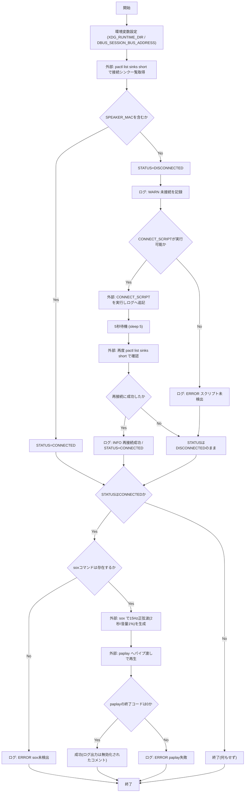
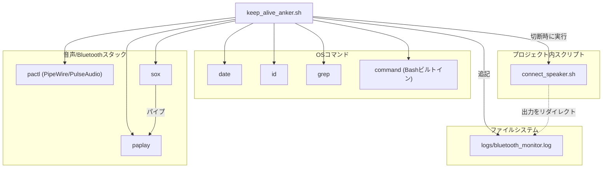

## 1. 解析メタ情報

| 項目 | 内容 |
| --- | --- |
| 対象ファイル | keep_alive_anker.sh |
| 言語 | Shell Script (Bash) |
| 解析対象 | 提供されたコードのみ |
| 推測・補完 | 一切なし |

## 関連ドキュメント

* [connect_speaker.md](./connect_speaker.md) - 接続断を検知した際に本スクリプトが呼び出す再接続スクリプト(`CONNECT_SCRIPT`)
* [keep_alive_speaker.md](./keep_alive_speaker.md) - 同じログファイル(`bluetooth_monitor.log`)を共有する、別方式(mpg123による無音MP3再生)のキープアライブスクリプト

## 2. ファイルの概要

Anker SoundCore 2 Bluetoothスピーカー(PipeWire/PulseAudio環境)向けのキープアライブ用シェルスクリプト。`pactl`でシンク一覧を取得しスピーカーのMACアドレスが含まれるか確認して接続状態を判定し(根拠: `[STATUS判定]` (行番号: 25〜29 / 抜粋: "if pactl list sinks short | grep -q \"${SPEAKER_MAC//:/_}\"; then")、切断中であれば再接続スクリプトを実行して再接続を試みる(根拠: `[再接続処理]` (行番号: 32〜48 / 抜粋: "if [ \"$STATUS\" = \"DISCONNECTED\" ]; then"))。接続が確認できた場合は、人間の可聴域外(15Hz)の正弦波を`sox`で生成し`paplay`へパイプで渡して2秒間再生することで、Bluetoothアンプが無音判定によりスリープ(オートパワーオフ)するのを防ぐ(根拠: `[keep-alive再生]` (行番号: 51〜59 / 抜粋: "sox -n -r 48000 -b 16 -c 2 -t wav - synth 2 sin 15 vol 0.01 2>/dev/null | \\"))。処理結果は全て`log()`関数経由でログファイルへ追記される(根拠: `[log関数]` (行番号: 19〜21 / 抜粋: "log() {\n    echo \"$TIMESTAMP - $1\" >> \"$LOGFILE\"\n}"))。またcron実行下でもPipeWire/PulseAudioソケットに接続できるよう、`XDG_RUNTIME_DIR`と`DBUS_SESSION_BUS_ADDRESS`を明示的にエクスポートしている(根拠: `[環境変数設定]` (行番号: 15〜16 / 抜粋: "export XDG_RUNTIME_DIR=\"/run/user/$(id -u)\""))。

## 3. 外部依存関係

### 外部コマンド一覧

| 名称 | 種類 | 用途 | 根拠 |
| --- | --- | --- | --- |
| `date` | coreutils(外部コマンド) | ログ用タイムスタンプ(`YYYY-MM-DD HH:MM:SS`)の生成 | 根拠: `[TIMESTAMP=$(date ...)]` (行番号: 9 / 抜粋: "TIMESTAMP=$(date '+%Y-%m-%d %H:%M:%S')") |
| `id` | coreutils(外部コマンド) | 実行ユーザーのUIDを取得し`XDG_RUNTIME_DIR`を組み立てる | 根拠: `[id -u]` (行番号: 15 / 抜粋: "export XDG_RUNTIME_DIR=\"/run/user/$(id -u)\"") |
| `pactl` | 外部コマンド(PipeWire/PulseAudio制御CLI) | シンク一覧を取得し、対象スピーカーが接続済みシンクに含まれるか確認 | 根拠: `[pactl list sinks short]` (行番号: 25, 45 / 抜粋: "pactl list sinks short | grep -q") |
| `grep` | coreutils(外部コマンド) | `pactl`の出力からMACアドレス(`:`を`_`に置換した文字列)を検索 | 根拠: `[grep -q]` (行番号: 25, 45 / 抜粋: "grep -q \"${SPEAKER_MAC//:/_}\"") |
| `command` | Bashビルトイン | `sox`コマンドがPATH上に存在するか確認 | 根拠: `[command -v sox]` (行番号: 57 / 抜粋: "if command -v sox &> /dev/null; then") |
| `sox` | 外部コマンド(音声生成ツール) | 15Hzの正弦波(可聴域外)を2秒間・WAV形式で標準出力へ生成 | 根拠: `[sox -n ...]` (行番号: 58 / 抜粋: "sox -n -r 48000 -b 16 -c 2 -t wav - synth 2 sin 15 vol 0.01") |
| `paplay` | 外部コマンド(PulseAudioクライアント) | `sox`が生成した音声データをパイプで受け取り再生 | 根拠: `[paplay --stream-name ...]` (行番号: 59 / 抜粋: "paplay --stream-name=\"Anker KeepAlive\" --property=media.role=event") |
| `$CONNECT_SCRIPT`(外部スクリプト) | プロジェクト内シェルスクリプト | 切断検知時に呼び出す再接続処理の実行 | 根拠: `[$CONNECT_SCRIPT実行]` (行番号: 37 / 抜粋: "\"$CONNECT_SCRIPT\" >> \"$LOGFILE\" 2>&1") |

### ブラックボックスとなる外部要素

| 名称 | 理由 | 根拠 |
| --- | --- | --- |
| `connect_speaker.sh`(`$CONNECT_SCRIPT`) | 本ファイルには呼び出し箇所のみが存在し、実際の再接続ロジック(実装内容)は提供されていないため。 | 根拠: `[CONNECT_SCRIPT定義・実行]` (行番号: 11, 37 / 抜粋: "CONNECT_SCRIPT=\"/home/masahiro/develop/MY_HOME_SYSTEM/connect_speaker.sh\"") |

## 4. 主要要素の定義（関数 / エンドポイント / コンポーネント）

### `log()`

* **役割**: 引数で渡されたメッセージにタイムスタンプを付与し、ログファイルへ追記する。
* 根拠: `[log関数定義]` (行番号: 19〜21 / 抜粋: "log() {\n    echo \"$TIMESTAMP - $1\" >> \"$LOGFILE\"\n}")

* **引数/リクエスト**: `$1` (ログに出力するメッセージ文字列)
* 根拠: `[echo \"$TIMESTAMP - $1\"]` (行番号: 20 / 抜粋: "echo \"$TIMESTAMP - $1\" >> \"$LOGFILE\"")

* **戻り値/レスポンス**: なし
* 根拠: `[log関数本体]` (行番号: 19〜21 / 抜粋: "log() {")

* **副作用**: `$LOGFILE`への追記書き込み。
* 根拠: `[>> \"$LOGFILE\"]` (行番号: 20 / 抜粋: ">> \"$LOGFILE\"")

* **エラーハンドリング**: なし(書き込み失敗時の処理は存在しない)。
* 根拠: `[log関数本体]` (行番号: 19〜21 / 抜粋: "log() {")

### メイン処理(スクリプト本体の逐次フロー)

* **役割**: スピーカーの接続状態を確認し、切断時は再接続スクリプトを実行、接続時は可聴域外の音声を再生してBluetoothアンプのスリープを防止する一連の処理。
* 根拠: `[スクリプト全体]` (行番号: 23〜72 / 抜粋: "# --- 1. Check Connection ---")

* **引数/リクエスト**: コマンドライン引数は使用しない。cron実行を想定した環境変数`XDG_RUNTIME_DIR`・`DBUS_SESSION_BUS_ADDRESS`を自ら設定する。
* 根拠: `[環境変数エクスポート]` (行番号: 15〜16 / 抜粋: "export DBUS_SESSION_BUS_ADDRESS=\"unix:path=${XDG_RUNTIME_DIR}/bus\"")

* **戻り値/レスポンス**: 明示的な`exit`コードは設定されていない(最後に実行したコマンドの終了コードがそのままスクリプトの終了コードとなる)。
* 根拠: `[exit未使用]` (行番号: 1〜72 / 抜粋: "#!/bin/bash")

* **副作用**: `pactl`によるシンク一覧照会、`$CONNECT_SCRIPT`の実行、`sox`/`paplay`による音声再生、`$LOGFILE`への追記。
* 根拠: `[各種外部コマンド呼び出し]` (行番号: 25, 37, 58〜59 / 抜粋: "paplay --stream-name=\"Anker KeepAlive\"")

* **エラーハンドリング**: `$CONNECT_SCRIPT`が実行不可(存在しない/実行権限なし)の場合はエラーログを出力するのみで処理を継続する(行番号41)。`sox`未検出時もエラーログのみで継続する(行番号70)。`paplay`の終了コード(`$RET`)が非0の場合もエラーログを出力するのみ(行番号67)。いずれも`exit`によるスクリプト停止は行われない。
* 根拠: `[エラー時ログのみ]` (行番号: 40〜42, 66〜70 / 抜粋: "log \"[ERROR] Reconnect script not found at $CONNECT_SCRIPT\"")

## 5. 処理フロー図

## 6. 依存関係図

## 7. 次のステップ（リバースエンジニアリングの提案）

| 優先度 | ファイル名(推測可) | 理由 | 根拠 |
| --- | --- | --- | --- |
| 高 | `connect_speaker.sh` | 本スクリプトが切断検知時に実行する再接続処理の実装を確認するため。 | 根拠: `[CONNECT_SCRIPT]` (行番号: 11, 37 / 抜粋: "CONNECT_SCRIPT=\"/home/masahiro/develop/MY_HOME_SYSTEM/connect_speaker.sh\"") |
| 中 | `keep_alive_speaker.sh` | 同一ログファイルを使う類似目的のスクリプトとの役割分担(対象デバイスの違い)を確認するため。 | 根拠: `[LOGFILE]` (行番号: 8 / 抜粋: "LOGFILE=\"/home/masahiro/develop/MY_HOME_SYSTEM/logs/bluetooth_monitor.log\"") |
| 中 | crontab設定または systemd タイマー定義(ファイル名不明・推測) | 本スクリプトが定期実行される仕組み(実行間隔・実行ユーザー)を確認するため。本ファイル単体では実行契機が不明。 | 根拠: `[cron実行を前提としたコメント]` (行番号: 14 / 抜粋: "# cron実行時でもPipeWireソケットを見つけられるようにする") |

## 8. 保守上の注意点

* **ハードコードされた絶対パス**: `LOGFILE`・`CONNECT_SCRIPT`が`/home/masahiro/develop/MY_HOME_SYSTEM/...`という特定ユーザー環境のパスで固定されており、環境変数や設定ファイルによる切り替えができない。 根拠: `[LOGFILE, CONNECT_SCRIPT定義]` (行番号: 8, 11 / 抜粋: "LOGFILE=\"/home/masahiro/develop/MY_HOME_SYSTEM/logs/bluetooth_monitor.log\"")
* **ハードコードされたMACアドレス**: `SPEAKER_MAC`がコード中に直接埋め込まれており、機種変更時はスクリプト自体の書き換えが必要。 根拠: `[SPEAKER_MAC定義]` (行番号: 10 / 抜粋: "SPEAKER_MAC=\"F4:4E:FC:B6:65:D4\" # Anker SoundCore 2 MAC Address")
* **パイプの終了コード判定**: `sox | paplay`のパイプ実行後に取得している`RET=$?`は、`set -o pipefail`が設定されていないBashの仕様上、パイプ中の最後のコマンド(`paplay`)の終了コードのみを表しており、`sox`側の失敗(音声生成エラー)は検知できない可能性がある。 根拠: `[RET=$?]` (行番号: 58〜61 / 抜粋: "paplay --stream-name=\"Anker KeepAlive\" --property=media.role=event >/dev/null 2>&1\n        \n        RET=$?")
* **ログ出力の抑制コメント**: 成功時のログ出力は`log`呼び出しがコメントアウトされ、代わりにno-opの`:`が置かれている。デバッグ時にコメントを戻す運用が想定されているが、現状では成功回数を追跡できない。 根拠: `[成功ログのコメントアウト]` (行番号: 63〜65 / 抜粋: "# log \"[SUCCESS] Keep-alive signal sent (15Hz).\"\n            :")
* **ログディレクトリの存在前提**: `LOGFILE`の親ディレクトリ(`logs/`)を`mkdir`等で作成する処理がなく、ディレクトリが存在しない環境では`log()`内の`echo >> ...`がエラーとなり、そのエラー自体もどこにも記録されない。 根拠: `[log関数]` (行番号: 19〜21 / 抜粋: "log() {\n    echo \"$TIMESTAMP - $1\" >> \"$LOGFILE\"\n}")
* **`set -e`/`set -u`未使用**: エラー発生時も後続処理がそのまま継続される設計であり、想定外の変数未定義や外部コマンド失敗があっても検出しにくい。 根拠: `[スクリプト全体]` (行番号: 1〜72 / 抜粋: "#!/bin/bash")

## 9. 不明事項一覧

| 項目 | 理由 | 必要なファイル |
| --- | --- | --- |
| 本スクリプトの実行契機(定期実行の間隔・トリガー) | crontabやsystemdタイマー等の設定が本ファイルには含まれていないため。（リポジトリ全体を`crontab`/`systemd`/`.service`等のファイル名・記述で検索したが該当ファイルは存在せず、解消不可） | crontab設定ファイルまたはsystemdユニットファイル(ファイル名不明) |
| `connect_speaker.sh`の再接続ロジックの詳細 | 呼び出し箇所のみが存在し、実装内容は本ファイルに含まれていないため。 | `connect_speaker.sh` |
| `logs/`ディレクトリの作成主体 | 本ファイルにはディレクトリ作成処理がなく、他のセットアップ処理で作成されている可能性があるため。 | プロジェクトのセットアップ/デプロイ関連スクリプト |

## 相互参照による補足情報

| 元の不明事項 | 判明した内容 | 参照元ドキュメント |
| --- | --- | --- |
| `connect_speaker.sh`の再接続ロジックの詳細 | `MY_HOME_SYSTEM/tools/connect_speaker.sh`(全156行)を直接確認した。対象MACアドレス`F4:4E:FC:B6:65:D4`(6行目、本ファイルの`SPEAKER_MAC`と同一値)に対し、`bluetoothctl info "$MAC"`の出力を`grep -q "Connected: yes"`で判定する処理(86行目)で接続状態を判定する。切断時は`bluetoothctl trust "$MAC"`(118行目)で信頼設定を念押しした上で、`MAX_RETRIES=3`(11行目)回、`bluetoothctl connect "$MAC"`→`sleep 5`(124〜125行目)を繰り返す再接続ループ(120〜140行目)を実行し、成功時は`pactl set-default-sink`/`set-sink-volume`(134〜135行目)で出力先を再設定してDiscordへ成功通知(131行目)、全リトライ失敗時は`run_diagnostics`(49〜71行目、`systemctl status bluetooth`・`rfkill list`・`bluetoothctl info`・`dmesg`・`pactl list sinks`・`pgrep pulse`の出力をログに追記)を実行した上で失敗通知(152行目)を送る、という設計であることを確認した。また、本ファイル(`keep_alive_anker.sh`)11行目の`CONNECT_SCRIPT="/home/masahiro/develop/MY_HOME_SYSTEM/connect_speaker.sh"`は`tools/`を含まないパスを指しているが、実際の配置は`MY_HOME_SYSTEM/tools/connect_speaker.sh`であり、両者のパスが一致しないことも直接確認した(本番デプロイ時のディレクトリ構成がリポジトリと異なる可能性があるが、この差異自体はリポジトリの内容からは解消できない)。 | 直接ソース確認: `MY_HOME_SYSTEM/tools/connect_speaker.sh:1-156`（参考: `MY_HOME_SYSTEM/tools/keep_alive_anker.sh:11`） |
| `logs/`ディレクトリの作成主体 | リポジトリ全体を`makedirs`/`mkdir`と`logs`の組み合わせで検索した結果、`logs/`ディレクトリを作成している箇所は`MY_HOME_SYSTEM/core/logger.py`63〜64行目の`log_dir = os.path.join(config.BASE_DIR, "logs")` / `os.makedirs(log_dir, exist_ok=True)`(`setup_logging`関数内)の1箇所のみであった。これは`config.BASE_DIR`(`MY_HOME_SYSTEM/`直下)配下に`logs/`を作成するもので、`setup_logging`はほぼ全てのPythonモジュールから呼び出されている。本ファイル(`keep_alive_anker.sh`)および`connect_speaker.sh`はbashスクリプトであり、ログファイルへは`>>`によるリダイレクトで追記するのみでディレクトリ自体を作成する処理は無い(8行目の`LOGFILE`、および`connect_speaker.sh`9行目の`LOGFILE`はいずれも`.../MY_HOME_SYSTEM/logs/bluetooth_monitor.log`を指しており、`core/logger.py`が作成する`MY_HOME_SYSTEM/logs/`と同じディレクトリである)。したがって、リポジトリ内で確認できる限り、`logs/`ディレクトリは`core/logger.py`の`setup_logging`が(Python側のいずれかのモジュール実行時に)作成しているという可能性が最も高いが、本シェルスクリプト自体との明示的な依存関係(呼び出し順序の保証)はリポジトリ内には見つからず、確実な断定はできなかった。リポジトリ直下`.gitignore`21行目に`logs/`規則があり、`logs/`ディレクトリ自体もgit追跡対象外であることを確認した。 | 直接ソース確認: `MY_HOME_SYSTEM/core/logger.py:63-65`, `MY_HOME_SYSTEM/tools/keep_alive_anker.sh:8`, `MY_HOME_SYSTEM/tools/connect_speaker.sh:9`, `.gitignore:21` |

## 10. 自己検証結果

* [x] 推測・外部ファイルの仕様を一切含んでいない（完了）
* [x] 全関数・全クラス・全コンポーネントを列挙した（完了）
* [x] 全てのインポート要素を列挙した（完了）
* [x] すべての仕様説明に「根拠（行番号・抜粋）」を明記した（完了）
* [x] 根拠漏れが0件である（完了）
* [x] Mermaid構文にエラーの原因となる記号（エスケープ漏れ）がない（完了）
* [x] 不明事項を漏れなく列挙した（完了）
