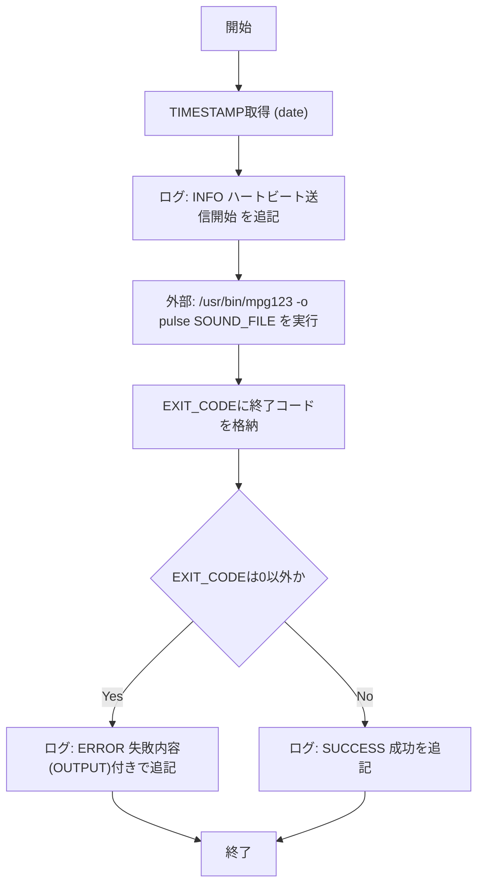
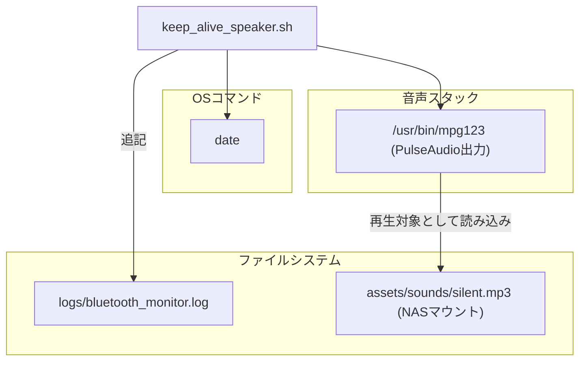

## 1. 解析メタ情報

| 項目 | 内容 |
| --- | --- |
| 対象ファイル | keep_alive_speaker.sh |
| 言語 | Shell Script (Bash) |
| 解析対象 | 提供されたコードのみ |
| 推測・補完 | 一切なし |

## 関連ドキュメント

* [keep_alive_anker.md](./keep_alive_anker.md) - 同じログファイル(`bluetooth_monitor.log`)を共有する、別方式(15Hz正弦波+PipeWire接続監視)のキープアライブスクリプト

## 2. ファイルの概要

Bluetoothスピーカー等のオーディオ経路を維持するため、無音のMP3ファイル(`silent.mp3`)を`mpg123`で再生する「ハートビート」送信用シェルスクリプト。処理開始時にログへハートビート送信開始を記録し(根拠: `[開始ログ]` (行番号: 17 / 抜粋: "echo \"$TIMESTAMP - [INFO] 💓 Sending heartbeat (silent audio)...\" >> \"$LOGFILE\""))、`/usr/bin/mpg123`を`-o pulse`(PulseAudio出力)オプション付きで実行して`SOUND_FILE`を再生する(根拠: `[mpg123実行]` (行番号: 20 / 抜粋: "OUTPUT=$(/usr/bin/mpg123 -o pulse \"$SOUND_FILE\" 2>&1)"))。実行結果の終了コードに応じて、失敗時はエラー内容(`OUTPUT`)付きのエラーログ、成功時は成功ログをそれぞれ`LOGFILE`へ追記する(根拠: `[結果判定]` (行番号: 26〜31 / 抜粋: "if [ $EXIT_CODE -ne 0 ]; then"))。関数定義は存在せず、スクリプト全体が単一の逐次処理として構成されている(根拠: `[スクリプト全体]` (行番号: 1〜32 / 抜粋: "#!/bin/bash"))。

## 3. 外部依存関係

### 外部コマンド一覧

| 名称 | 種類 | 用途 | 根拠 |
| --- | --- | --- | --- |
| `date` | coreutils(外部コマンド) | ログ用タイムスタンプ(`YYYY-MM-DD HH:MM:SS`)の生成(処理開始時・結果判定時にそれぞれ呼び出し) | 根拠: `[TIMESTAMP=$(date ...)]` (行番号: 11, 28, 31 / 抜粋: "TIMESTAMP=$(date '+%Y-%m-%d %H:%M:%S')") |
| `/usr/bin/mpg123` | 外部コマンド(MP3再生ツール) | `SOUND_FILE`(無音MP3)をPulseAudio出力(`-o pulse`)で再生 | 根拠: `[mpg123実行]` (行番号: 20 / 抜粋: "OUTPUT=$(/usr/bin/mpg123 -o pulse \"$SOUND_FILE\" 2>&1)") |

### ブラックボックスとなる外部要素

該当なし

## 4. 主要要素の定義（関数 / エンドポイント / コンポーネント）

### メイン処理(スクリプト本体の逐次フロー)

* **役割**: 無音MP3ファイルを`mpg123`で再生することで、オーディオ経路(Bluetoothスピーカー等)へのハートビート信号を送信し、結果をログファイルへ記録する。
* 根拠: `[スクリプト全体]` (行番号: 1〜32 / 抜粋: "#!/bin/bash")

* **引数/リクエスト**: コマンドライン引数は使用しない。`LOGFILE`・`SOUND_FILE`はスクリプト冒頭でハードコードされた固定パス。
* 根拠: `[LOGFILE, SOUND_FILE定義]` (行番号: 7〜8 / 抜粋: "LOGFILE=\"/home/masahiro/develop/MY_HOME_SYSTEM/logs/bluetooth_monitor.log\"\nSOUND_FILE=\"/mnt/nas/home_system/assets/sounds/silent.mp3\"")

* **戻り値/レスポンス**: 明示的な`exit`は行われず、最後に実行される`echo`(ログ書き込み)コマンドの終了コードがそのままスクリプトの終了コードとなる。
* 根拠: `[exit未使用]` (行番号: 1〜32 / 抜粋: "#!/bin/bash")

* **副作用**: `/usr/bin/mpg123`の実行(外部プロセス起動・音声再生)、`LOGFILE`への追記書き込み(開始ログ・結果ログ)。
* 根拠: `[mpg123実行とログ追記]` (行番号: 17, 20, 28, 31 / 抜粋: "echo \"$(date '+%Y-%m-%d %H:%M:%S') - [SUCCESS] Heartbeat sent.\" >> \"$LOGFILE\"")

* **エラーハンドリング**: `mpg123`の終了コード(`$?`を格納した`EXIT_CODE`)が0以外の場合、標準出力・標準エラーを結合した`OUTPUT`変数の内容を含めてエラーログを記録するのみで、リトライや異常終了(`exit`)は行わない。
* 根拠: `[EXIT_CODE判定]` (行番号: 21, 26〜28 / 抜粋: "EXIT_CODE=$?\n\n# ==========================================\n# 結果判定\n# ==========================================\nif [ $EXIT_CODE -ne 0 ]; then")

## 5. 処理フロー図

## 6. 依存関係図

## 7. 次のステップ（リバースエンジニアリングの提案）

| 優先度 | ファイル名(推測可) | 理由 | 根拠 |
| --- | --- | --- | --- |
| 中 | `keep_alive_anker.sh` | 同一ログファイルを使用する類似目的のスクリプトであり、両者の役割分担(対象デバイス・実行方式の違い)を確認するため。 | 根拠: `[LOGFILE]` (行番号: 7 / 抜粋: "LOGFILE=\"/home/masahiro/develop/MY_HOME_SYSTEM/logs/bluetooth_monitor.log\"") |
| 中 | crontab設定または systemd タイマー定義(ファイル名不明・推測) | 本スクリプトが定期実行される仕組み(実行間隔)を確認するため。本ファイル単体では実行契機が不明。 | 根拠: `[スクリプト全体]` (行番号: 1〜32 / 抜粋: "#!/bin/bash") |
| 低 | `silent.mp3`(NAS上のアセットファイル) | 再生対象の無音音源ファイルの実体(長さ・フォーマット)を確認するため。 | 根拠: `[SOUND_FILE定義]` (行番号: 8 / 抜粋: "SOUND_FILE=\"/mnt/nas/home_system/assets/sounds/silent.mp3\"") |

## 8. 保守上の注意点

* **ハードコードされた絶対パス**: `LOGFILE`・`SOUND_FILE`が特定ユーザー環境・NASマウントパスに固定されており、環境に応じた切り替えができない。 根拠: `[LOGFILE, SOUND_FILE定義]` (行番号: 7〜8 / 抜粋: "SOUND_FILE=\"/mnt/nas/home_system/assets/sounds/silent.mp3\"")
* **NASマウント依存**: `SOUND_FILE`がNASマウントポイント(`/mnt/nas/...`)配下にあるため、NAS未マウント時は`mpg123`がファイル読み込みに失敗し、エラーログのみが記録されて処理は正常終了する(異常検知が難しい)。 根拠: `[SOUND_FILE定義, エラーハンドリング]` (行番号: 8, 26〜28 / 抜粋: "if [ $EXIT_CODE -ne 0 ]; then")
* **`set -e`/`set -u`未使用**: エラー時も後続処理がそのまま継続する設計であり、変数未定義や予期しない失敗を検出しにくい。 根拠: `[スクリプト全体]` (行番号: 1〜32 / 抜粋: "#!/bin/bash")
* **ログディレクトリの存在前提**: `LOGFILE`の親ディレクトリを作成する処理がなく、存在しない場合の`echo >> ...`失敗はどこにも記録されない。 根拠: `[ログ追記処理]` (行番号: 17, 28, 31 / 抜粋: ">> \"$LOGFILE\"")
* **成功ログの取捨コメント**: 成功時ログについて「多すぎるようならコメントアウト可」という運用コメントがあり、恒常的な出力有無が運用者判断に委ねられている。 根拠: `[運用コメント]` (行番号: 30 / 抜粋: "# 成功時: 成功ログを残す（もしログが多すぎるようなら、この行はコメントアウトしてもOKです）")

## 9. 不明事項一覧

| 項目 | 理由 | 必要なファイル |
| --- | --- | --- |
| 本スクリプトの実行契機(定期実行の間隔・トリガー) | crontabやsystemdタイマー等の設定が本ファイルには含まれていないため。（リポジトリ内を`crontab`/`*.service`/`*.timer`等で検索したが該当ファイルは存在せず、解消不可） | crontab設定ファイルまたはsystemdユニットファイル(ファイル名不明) |
| `silent.mp3`の実体(長さ・フォーマット・生成方法) | 音源ファイル自体は本ファイルの解析範囲外であるため。（リポジトリ内を検索したが実体ファイルは存在せず、解消不可。`.gitignore`64行目の`*.mp3`規則により追跡対象外と判明） | `/mnt/nas/home_system/assets/sounds/silent.mp3` |
| `keep_alive_anker.sh`との使い分け基準 | 両スクリプトが同一ログを共有しつつ異なる方式でキープアライブを行っているが、どちらがどのデバイス/環境で使われるかは本ファイルからは判断できないため。（`keep_alive_anker.sh`自体は直接確認できたが、呼び出し元のcrontab/systemd設定がリポジトリ内に存在しないため、使い分け基準そのものは解消不可） | 呼び出し元のcrontab/systemd設定、または`keep_alive_anker.sh` |

## 相互参照による補足情報

| 元の不明事項 | 判明した内容 | 参照元ドキュメント |
| --- | --- | --- |
| `keep_alive_anker.sh`との使い分け基準 | `MY_HOME_SYSTEM/tools/keep_alive_anker.sh`を直接確認した。本ファイル(`keep_alive_speaker.sh`)は`/usr/bin/mpg123 -o pulse "$SOUND_FILE"`(20行目)で無音に近い音源ファイル`silent.mp3`をPulseAudio出力で再生するだけの単純な方式であるのに対し、`keep_alive_anker.sh`は(1)`pactl list sinks short`でAnker SoundCoreのMACアドレス(`F4:4E:FC:B6:65:D4`、10行目)がシンク一覧に含まれるかを先に確認し(24〜28行目)、未接続なら`connect_speaker.sh`を呼び出して再接続を試みた上で(35〜46行目)、(2)接続確認後に`sox`で15Hzの可聴域外の正弦波を音量0.01で2秒間生成し`paplay`にパイプで渡す(59〜61行目)という、接続監視・自動再接続・無音信号生成を組み合わせたより高機能な方式である点が直接確認できた。ただし両スクリプトのうちどちらが実際にどのデバイス/環境向けのcrontab等に登録されているかは、該当するcrontab/systemd設定がリポジトリ内に存在しないため確認できなかった。 | 直接ソース確認: `MY_HOME_SYSTEM/tools/keep_alive_anker.sh:8-61`(参考: `MY_HOME_SYSTEM/tools/keep_alive_speaker.sh:8,20`) |

## 10. 自己検証結果

* [x] 推測・外部ファイルの仕様を一切含んでいない（完了）
* [x] 全関数・全クラス・全コンポーネントを列挙した（完了）
* [x] 全てのインポート要素を列挙した（完了）
* [x] すべての仕様説明に「根拠（行番号・抜粋）」を明記した（完了）
* [x] 根拠漏れが0件である（完了）
* [x] Mermaid構文にエラーの原因となる記号（エスケープ漏れ）がない（完了）
* [x] 不明事項を漏れなく列挙した（完了）
