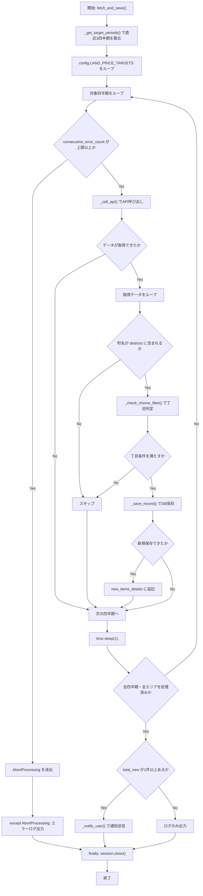

## 1. 解析メタ情報

| 項目 | 内容 |
| --- | --- |
| 対象ファイル | land_price_service.py |
| 言語 | Python |
| 解析対象 | 提供されたコードのみ |
| 推測・補完 | 一切なし |

## 関連ドキュメント

- [common.md](./common.md) — `setup_logging`, `get_db_cursor`, `send_push`, `get_now_iso` を再エクスポートするFacadeモジュール
- [config.md](./config.md) — `REINFOLIB_API_KEY`, `REINFOLIB_WEB_URL`, `LAND_PRICE_TARGETS`, `LINE_USER_ID` 等の設定値を提供
- [logger.md](./logger.md) — `common.setup_logging` の実体
- [database.md](./database.md) — `common.get_db_cursor` の実体
- [notification_service.md](./notification_service.md) — `common.send_push` の実体

## 2. ファイルの概要

`LandPriceService`クラスは、国土交通省「不動産情報ライブラリ」の新API（`XIT001`: 不動産取引価格情報）を利用して、`config.LAND_PRICE_TARGETS`で指定されたエリアの土地取引価格情報を直近3四半期分取得し、町名・丁目でフィルタした上でSQLiteデータベースへ記録、新規取引があればDiscordへリンク付きで通知するサービスである。
根拠: [LandPriceServiceクラスdocstring] (行番号: 22〜27 / 抜粋: "国土交通省「不動産情報ライブラリ」APIを利用して、\n    指定エリアの土地価格情報を収集・記録するクラス")

`requests.Session`にリトライ機構（`HTTPAdapter` + `urllib3.util.retry.Retry`、対象ステータス`500,502,503,504`）を組み込んだセッションを保持し、API呼び出しが連続して失敗した場合は独自例外`AbortProcessing`を送出して処理を中断する仕組みを持つ。
根拠: [_create_retry_session, AbortProcessing] (行番号: 19〜20, 43〜51 / 抜粋: "class AbortProcessing(Exception):")

`fetch_and_save`がエントリポイントであり、対象エリア×直近3四半期の組み合わせごとにAPIを呼び出し、町名フィルタ・丁目フィルタを通過したレコードのみを`_save_record`でDB保存する。
根拠: [fetch_and_save] (行番号: 53〜104 / 抜粋: "def fetch_and_save(self):")

## 3. 外部依存関係

### インポート一覧

| 名称 | 種類 | 用途 | 根拠 |
| --- | --- | --- | --- |
| `requests` | 外部ライブラリ | 不動産情報ライブラリAPIへのHTTP GETリクエスト送信 | 根拠: [import requests] (行番号: 1 / 抜粋: "import requests") |
| `sqlite3` | 標準ライブラリ | インポートされているが本ファイル内での使用箇所なし（DBアクセスは`common.get_db_cursor`経由） | 根拠: [import sqlite3] (行番号: 2 / 抜粋: "import sqlite3") |
| `logging` | 標準ライブラリ | インポートされているが本ファイル内での使用箇所なし（ロガーは`common.setup_logging`経由で取得） | 根拠: [import logging] (行番号: 3 / 抜粋: "import logging") |
| `time` | 標準ライブラリ | API呼び出し間隔調整のための待機（`time.sleep`） | 根拠: [import time] (行番号: 4 / 抜粋: "import time") |
| `re` | 標準ライブラリ | 「丁目」フィルタ判定のための正規表現抽出 | 根拠: [import re] (行番号: 5 / 抜粋: "import re") |
| `sys` | 標準ライブラリ | APIキー未設定時のプロセス終了（`sys.exit(1)`） | 根拠: [import sys] (行番号: 6 / 抜粋: "import sys") |
| `datetime.datetime` | 標準ライブラリ | 対象四半期の算出のための現在日時取得 | 根拠: [from datetime import datetime] (行番号: 7 / 抜粋: "from datetime import datetime") |
| `requests.adapters.HTTPAdapter` | 外部ライブラリ | リトライ機構付きHTTPアダプタの構成 | 根拠: [from requests.adapters import HTTPAdapter] (行番号: 8 / 抜粋: "from requests.adapters import HTTPAdapter") |
| `urllib3.util.retry.Retry` | 外部ライブラリ | HTTPリクエストの自動リトライポリシー定義 | 根拠: [from urllib3.util.retry import Retry] (行番号: 9 / 抜粋: "from urllib3.util.retry import Retry") |
| `config` | 内部モジュール | APIキー、監視対象エリア、Web URL等の設定値提供 | 根拠: [import config] (行番号: 12 / 抜粋: "import config") |
| `common` | 内部モジュール | ロガー取得、DBカーソル取得、通知送信、日時ユーティリティの提供 | 根拠: [import common] (行番号: 13 / 抜粋: "import common") |

### ブラックボックスとなる外部要素

| 名称 | 理由 | 根拠 |
| --- | --- | --- |
| `config.REINFOLIB_API_KEY` | `config`モジュールの実装が提供されておらず、APIキーの実値が不明 | 根拠: [__init__] (行番号: 39 / 抜粋: "if not getattr(config, \"REINFOLIB_API_KEY\", None):") |
| `config.LAND_PRICE_TARGETS` | 監視対象エリアの一覧・構造（`city_code`/`city_name`/`districts`/`filter_chome`以外のキーの有無）が不明 | 根拠: [fetch_and_save] (行番号: 61 / 抜粋: "for target_area in config.LAND_PRICE_TARGETS:") |
| `config.REINFOLIB_WEB_URL` | 通知メッセージに埋め込む実際のURL文字列が不明（未設定時のデフォルト値のみ本ファイル内で確認可能） | 根拠: [_notify_user] (行番号: 195 / 抜粋: "link_url = getattr(config, \"REINFOLIB_WEB_URL\", \"https://www.reinfolib.mlit.go.jp/\")") |
| `config.LINE_USER_ID` | 通知先ユーザーIDの実値が不明 | 根拠: [_notify_user] (行番号: 204 / 抜粋: "common.send_push(config.LINE_USER_ID,") |
| 不動産情報ライブラリAPI (`XIT001`) のレスポンス仕様 | 外部APIの実際のレスポンス形式・エラーコード体系はドキュメント化されておらず、本ファイルのコード上の扱い（`status`, `data`キー等）からのみ推測できる範囲に限られる | 根拠: [_call_api] (行番号: 143〜145 / 抜粋: "if json_data.get(\"status\") == \"OK\":") |
| `common.setup_logging`, `common.get_db_cursor`, `common.send_push`, `common.get_now_iso` | `common`モジュールの実装が提供されておらず、詳細な挙動が不明 | 根拠: [各呼び出し箇所] (行番号: 16, 166, 174, 204 / 抜粋: "logger = common.setup_logging(\"land_price_service\")") |

## 4. 主要要素の定義（関数 / エンドポイント / コンポーネント）

### `AbortProcessing`

* **役割**: 連続エラー発生時に`fetch_and_save`の処理ループを中断するための内部制御用例外クラス。
* 根拠: [AbortProcessing] (行番号: 18〜20 / 抜粋: "class AbortProcessing(Exception):\n    pass")

* **引数/リクエスト**: `Exception`を継承するのみで独自の引数追加なし
* 根拠: [AbortProcessing] (行番号: 19〜20 / 抜粋: "class AbortProcessing(Exception):\n    pass")

* **戻り値/レスポンス**: 該当なし（例外クラス）
* 根拠: [AbortProcessing] (行番号: 19〜20 / 抜粋: "pass")

* **副作用**: なし
* 根拠: [AbortProcessing] (行番号: 19〜20 / 抜粋: "class AbortProcessing(Exception):")

* **エラーハンドリング**: 該当なし

### `LandPriceService`

* **役割**: 不動産情報ライブラリAPIを利用した土地価格情報の収集・記録・通知を行うクラス本体。`API_URL`, `TABLE_NAME`, `MAX_CONSECUTIVE_ERRORS`をクラス定数として保持する。
* 根拠: [LandPriceService] (行番号: 22〜32 / 抜粋: "class LandPriceService:")

### `__init__`

* **役割**: リトライ付きHTTPセッションの生成、連続エラーカウンタの初期化、APIキー未設定時のプロセス終了判定を行う。
* 根拠: [**init**] (行番号: 34〜41 / 抜粋: "def __init__(self):")

* **引数/リクエスト**: `None`（`self`のみ）
* 根拠: [**init**] (行番号: 34 / 抜粋: "def __init__(self):")

* **戻り値/レスポンス**: `None`
* 根拠: [**init**] (行番号: 34〜41 / 抜粋: "self.session = self._create_retry_session()")

* **副作用**: `self.session`, `self.consecutive_error_count`の初期化。`config.REINFOLIB_API_KEY`が未設定の場合、エラーログ出力後`sys.exit(1)`によりプロセスを終了させる。
* 根拠: [**init**] (行番号: 39〜41 / 抜粋: "logger.error(\"❌ REINFOLIB_API_KEY が config.py に設定されていません。\")\n            sys.exit(1)")

* **エラーハンドリング**: `config.REINFOLIB_API_KEY`未設定時に`sys.exit(1)`でプロセスを強制終了する（例外捕捉ではなくプロセス終了による対応）。
* 根拠: [**init**] (行番号: 39〜41 / 抜粋: "if not getattr(config, \"REINFOLIB_API_KEY\", None):")

### `_create_retry_session`

* **役割**: 指定リトライ回数・バックオフ係数で、サーバエラー系ステータス（500/502/503/504）を対象に自動リトライする`requests.Session`を生成する。
* 根拠: [_create_retry_session] (行番号: 43〜51 / 抜粋: "def _create_retry_session(self, retries=3, backoff_factor=1.0):")

* **引数/リクエスト**: `retries` (デフォルト`3`), `backoff_factor` (デフォルト`1.0`)
* 根拠: [_create_retry_session] (行番号: 43 / 抜粋: "def _create_retry_session(self, retries=3, backoff_factor=1.0):")

* **戻り値/レスポンス**: `requests.Session`（`https://`用に`HTTPAdapter`をマウント済み）
* 根拠: [_create_retry_session] (行番号: 51 / 抜粋: "return session")

* **副作用**: なし（新規セッションオブジェクトの生成のみ）
* 根拠: [_create_retry_session] (行番号: 44〜50 / 抜粋: "session = requests.Session()")

* **エラーハンドリング**: なし

### `fetch_and_save`

* **役割**: 処理全体のエントリポイント。対象エリア×直近3四半期の組み合わせでAPIを呼び出し、フィルタを通過したレコードを保存、新規保存件数があれば通知する。
* 根拠: [fetch_and_save] (行番号: 53〜104 / 抜粋: "def fetch_and_save(self):")

* **引数/リクエスト**: `None`（`self`のみ）
* 根拠: [fetch_and_save] (行番号: 53 / 抜粋: "def fetch_and_save(self):")

* **戻り値/レスポンス**: `None`
* 根拠: [fetch_and_save] (行番号: 53〜104 / 抜粋: "logger.info(\"🚀 土地価格情報の取得を開始します (新API)...\")")

* **副作用**: `self._call_api`によるHTTP通信、`self._save_record`によるDB書き込み、`self._notify_user`による通知送信、四半期ごとの`time.sleep(1)`によるAPI負荷抑制
* 根拠: [fetch_and_save] (行番号: 71, 87, 94, 97 / 抜粋: "time.sleep(1) # API制限考慮")

* **エラーハンドリング**: `self.consecutive_error_count`が`MAX_CONSECUTIVE_ERRORS`(3)以上になると`AbortProcessing`を送出し、`except AbortProcessing as e`で捕捉してエラーログを出力する。`finally`で`self.session.close()`を必ず実行する。
* 根拠: [fetch_and_save] (行番号: 68〜69, 101〜104 / 抜粋: "raise AbortProcessing(\"連続エラーのため中断します\")")

### `_get_target_periods`

* **役割**: 現在日時から、直近3四半期分の`(年, 四半期)`タプルのリストを生成する。
* 根拠: [_get_target_periods] (行番号: 106〜119 / 抜粋: "\"\"\"直近3四半期分を生成\"\"\"")

* **引数/リクエスト**: `None`（`self`のみ）
* 根拠: [_get_target_periods] (行番号: 106 / 抜粋: "def _get_target_periods(self):")

* **戻り値/レスポンス**: `List[Tuple[int, int]]`（3件の`(year, quarter)`タプル）
* 根拠: [_get_target_periods] (行番号: 119 / 抜粋: "return periods")

* **副作用**: なし
* 根拠: [_get_target_periods] (行番号: 106〜119 / 抜粋: "now = datetime.now()")

* **エラーハンドリング**: なし

### `_call_api`

* **役割**: 指定した年・四半期・エリアコード・市区町村コードで不動産情報ライブラリAPIを呼び出し、取引データのリストを取得する。
* 根拠: [_call_api] (行番号: 121〜151 / 抜粋: "def _call_api(self, year, quarter, area_code, city_code):")

* **引数/リクエスト**: `year`, `quarter`, `area_code`, `city_code`（いずれも型注釈なし）
* 根拠: [_call_api] (行番号: 121 / 抜粋: "def _call_api(self, year, quarter, area_code, city_code):")

* **戻り値/レスポンス**: `list`（取引データのリスト。404時・エラー時・`status`が`"OK"`以外の場合は空リスト`[]`）
* 根拠: [_call_api] (行番号: 138, 145, 151 / 抜粋: "return []")

* **副作用**: `self.session.get`によるHTTP GETリクエスト送信、成功時の`self.consecutive_error_count`リセット、失敗時の同カウンタ加算
* 根拠: [_call_api] (行番号: 134, 141, 148 / 抜粋: "self.consecutive_error_count = 0")

* **エラーハンドリング**: HTTPステータス404は「未発表」として正常扱いし空リストを返す。それ以外の例外は`except Exception as e`で捕捉して`consecutive_error_count`を加算し警告ログを出力する。
* 根拠: [_call_api] (行番号: 136〜149 / 抜粋: "if res.status_code == 404:\n                return []")

### `_check_chome_filter`

* **役割**: 町名文字列から「丁目」の数字を全角→半角変換の上で抽出し、対象丁目リストに含まれるか判定する。
* 根拠: [_check_chome_filter] (行番号: 153〜160 / 抜粋: "def _check_chome_filter(self, district_name, target_chome_list):")

* **引数/リクエスト**: `district_name`（型注釈なし。町名文字列）, `target_chome_list`（型注釈なし。対象丁目のリストまたは`None`）
* 根拠: [_check_chome_filter] (行番号: 153 / 抜粋: "def _check_chome_filter(self, district_name, target_chome_list):")

* **戻り値/レスポンス**: `bool`（`target_chome_list`が空の場合は無条件`True`。丁目番号が一致すれば`True`、抽出できなければ`True`、不一致なら`False`）
* 根拠: [_check_chome_filter] (行番号: 154, 159, 160 / 抜粋: "if not target_chome_list: return True")

* **副作用**: なし
* 根拠: [_check_chome_filter] (行番号: 153〜160 / 抜粋: "kanji_map = str.maketrans(")

* **エラーハンドリング**: なし

### `_save_record`

* **役割**: 取引レコードの一意キー（`trade_id`）を生成し、既存レコードと重複しない場合のみ`land_price_records`テーブルへINSERTする。
* 根拠: [_save_record] (行番号: 162〜184 / 抜粋: "def _save_record(self, item, city_name):")

* **引数/リクエスト**: `item`（型注釈なし。APIレスポンスの1レコード辞書）, `city_name`（型注釈なし。エリア名）
* 根拠: [_save_record] (行番号: 162 / 抜粋: "def _save_record(self, item, city_name):")

* **戻り値/レスポンス**: `bool`（新規保存成功時`True`、重複または失敗時`False`）
* 根拠: [_save_record] (行番号: 168, 181, 184 / 抜粋: "if cur.fetchone(): return False")

* **副作用**: `self.TABLE_NAME`（`land_price_records`）テーブルへのINSERT、成功時の情報ログ出力
* 根拠: [_save_record] (行番号: 176〜180 / 抜粋: "sql = f\"\"\"INSERT INTO {self.TABLE_NAME} ")

* **エラーハンドリング**: `except Exception as e`でDB例外を捕捉しエラーログを出力し`False`を返す。
* 根拠: [_save_record] (行番号: 182〜184 / 抜粋: "logger.error(f\"DB保存エラー: {e}\")")

### `_notify_user`

* **役割**: 新規取得件数と詳細（最大5件+件数省略表記）をまとめ、不動産情報ライブラリへのMarkdownリンク付きメッセージをDiscordへ送信する。
* 根拠: [_notify_user] (行番号: 186〜204 / 抜粋: "\"\"\"\n        Discord Reportチャンネルへ通知\n        Markdownリンクを含めて情報元へのアクセスを容易にします\n        \"\"\"")

* **引数/リクエスト**: `count`（型注釈なし。新規件数）, `details`（型注釈なし。詳細説明文字列のリスト）
* 根拠: [_notify_user] (行番号: 186 / 抜粋: "def _notify_user(self, count, details):")

* **戻り値/レスポンス**: `None`
* 根拠: [_notify_user] (行番号: 186〜204 / 抜粋: "body = \"\\n\".join(details[:5])")

* **副作用**: `common.send_push`によるDiscordの`report`チャンネルへの通知送信
* 根拠: [_notify_user] (行番号: 204 / 抜粋: "common.send_push(config.LINE_USER_ID, [{\"type\": \"text\", \"text\": msg}], target=\"discord\", channel=\"report\")")

* **エラーハンドリング**: なし（`common.send_push`側の例外はここでは捕捉しない）

## 5. 処理フロー図

## 6. 依存関係図

```mermaid
graph TD
    LandPriceServicePY["land_price_service.py"]

    subgraph Python_Standard_Libraries
        Sqlite3["sqlite3（未使用）"]
        Logging["logging（未使用）"]
        Time["time"]
        Re["re"]
        Sys["sys"]
        Datetime["datetime"]
    end

    subgraph External_Libraries
        Requests["requests"]
        HTTPAdapter["requests.adapters.HTTPAdapter"]
        Retry["urllib3.util.retry.Retry"]
    end

    subgraph Project_Internal
        Common["common.py"]
        Config["config.py"]
    end

    subgraph External_Services
        ReinfolibAPI["不動産情報ライブラリAPI (XIT001)"]
        DiscordTarget["Discord（common.send_push経由）"]
    end

    LandPriceServicePY --> Sqlite3
    LandPriceServicePY --> Logging
    LandPriceServicePY --> Time
    LandPriceServicePY --> Re
    LandPriceServicePY --> Sys
    LandPriceServicePY --> Datetime
    LandPriceServicePY --> Requests
    LandPriceServicePY --> HTTPAdapter
    LandPriceServicePY --> Retry
    LandPriceServicePY --> Common
    LandPriceServicePY --> Config

    LandPriceServicePY -->|HTTP GET| ReinfolibAPI
    LandPriceServicePY -->|send_push経由| DiscordTarget
```

## 7. 次のステップ（リバースエンジニアリングの提案）

| 優先度 | ファイル名(推測可) | 理由 | 根拠 |
| --- | --- | --- | --- |
| 高 | `config.py` | `LAND_PRICE_TARGETS`の実際の構造・件数、`REINFOLIB_API_KEY`/`REINFOLIB_WEB_URL`の設定方法を確認するため。（本リポジトリでは`config.md`として既に解析済み） | 根拠: [config参照箇所] (行番号: 39, 61, 195 / 抜粋: "config.LAND_PRICE_TARGETS") |
| 高 | `common.py` | `get_db_cursor`のトランザクション制御、`send_push`の通知仕様を確認するため。（本リポジトリでは`common.md`として既に解析済み） | 根拠: [common参照箇所] (行番号: 16, 166, 204 / 抜粋: "common.setup_logging(\"land_price_service\")") |
| 中 | `land_price_records`テーブルのスキーマ定義 | `_save_record`がINSERTするカラム構成の実際の型・制約を検証するため。 | 根拠: [_save_record] (行番号: 176〜178 / 抜粋: "(trade_id, prefecture, city, district, type, price, area_m2, price_per_m2, transaction_period, recorded_at)") |

## 8. 保守上の注意点

* **未使用インポート**: `sqlite3`, `logging`がインポートされているが、DBアクセスは`common.get_db_cursor`、ロギングは`common.setup_logging`経由で行われており、本ファイル内で直接使用されている箇所が確認できない。
  * 根拠: [import文] (行番号: 2〜3 / 抜粋: "import sqlite3\nimport logging")
* **APIキー未設定時のプロセス強制終了**: `__init__`で`config.REINFOLIB_API_KEY`が未設定の場合、例外を送出せず`sys.exit(1)`でプロセス全体を終了させる。呼び出し元がこの挙動を想定していない場合、上位のバッチ処理全体が予期せず停止する可能性がある。
  * 根拠: [__init__] (行番号: 39〜41 / 抜粋: "sys.exit(1)")
* **`AbortProcessing`が`fetch_and_save`外に伝播しない設計**: `AbortProcessing`は`fetch_and_save`内の`try/except`で捕捉されログ出力のみが行われ、呼び出し元には異常終了したことが例外としては伝わらない（戻り値は常に`None`）。
  * 根拠: [fetch_and_save] (行番号: 101〜102 / 抜粋: "except AbortProcessing as e:\n            logger.error(f\"🚨 {e}\")")
* **APIリクエストへのウェイトがフィルタ後ではなく四半期単位**: `time.sleep(1)`は四半期ごとの呼び出し直後に実行されており、`_call_api`がリトライ機構（`Retry`）で複数回リクエストを行った場合の追加待機は考慮されていない。
  * 根拠: [fetch_and_save] (行番号: 94 / 抜粋: "time.sleep(1) # API制限考慮")
* **エントリポイント直下（`if __name__`）にモード分岐がない**: 他の類似バッチ（`app_ranking_service.py`等）と異なり、`argparse`によるモード切替がなく、実行すると常に`fetch_and_save`のみが動作する構成である。
  * 根拠: [__main__ブロック] (行番号: 206〜208 / 抜粋: "service = LandPriceService()\n    service.fetch_and_save()")

## 9. 不明事項一覧

| 項目 | 理由 | 必要なファイル |
| --- | --- | --- |
| `config.LAND_PRICE_TARGETS`の実際の内容 | 監視対象エリア（`city_code`, `city_name`, `districts`, `filter_chome`）の一覧が本ファイル内で定義されていないため。 | `config.py` |
| `config.REINFOLIB_API_KEY` / `config.REINFOLIB_WEB_URL`の値 | APIキーおよびWeb URLの実値が本ファイル内で定義されていないため。 | `config.py` |
| 不動産情報ライブラリAPI (`XIT001`) の完全なレスポンス仕様 | 本ファイルのコードから使用フィールド（`DistrictName`, `TradePrice`等）は判明するが、公式のAPI仕様書は本ファイル内に含まれないため全容は不明。 | 外部API仕様書（国土交通省提供） |
| `land_price_records`テーブルの完全なスキーマ | INSERT文からカラム名は判明するが、型・制約・インデックスの定義は本ファイル内では確認できないため。 | データベースのマイグレーション/DDL定義ファイル |

## 10. 自己検証結果

* [x] 推測・外部ファイルの仕様を一切含んでいない
* [x] 全関数・全クラス・全コンポーネントを列挙した
* [x] 全てのインポート要素を列挙した
* [x] すべての仕様説明に「根拠（行番号・抜粋）」を明記した
* [x] 根拠漏れが0件である
* [x] Mermaid構文にエラーの原因となる記号（エスケープ漏れ）がない
* [x] 不明事項を漏れなく列挙した
