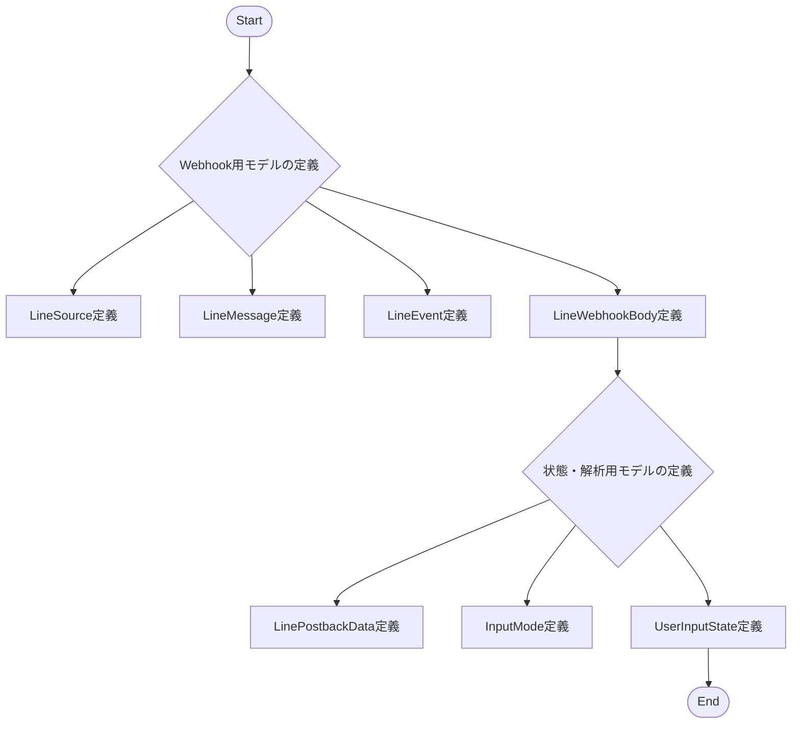
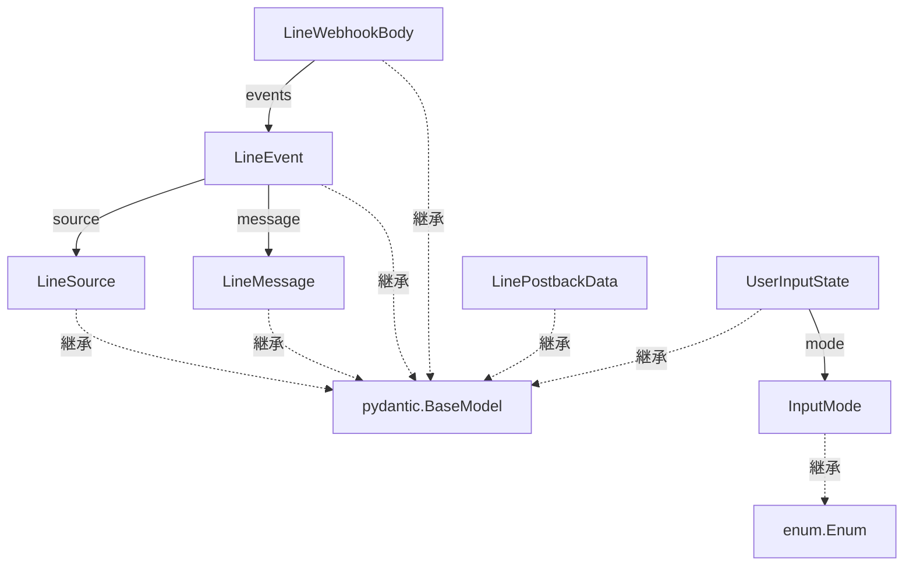

## 1. 解析メタ情報

| 項目 | 内容 |
| --- | --- |
| 対象ファイル | `line.py` |
| 言語 | Python |
| 解析対象 | 提供されたコードのみ |
| 推測・補完 | 一切なし |

## 2. ファイルの概要

* LINEシステムとの連携において、データ構造を定義し型安全性を担保するためのPydanticモデル群およびEnumクラスを提供するファイル。
* Webhookから受信するイベントデータの構造定義、およびPostback時のデータやユーザー入力状態を保持するための構造定義を行っている。
* 具体的な処理ロジック（関数の実行や外部API通信など）は含まれていない。

## 3. 外部依存関係

### インポート一覧

| 名称 | 種類 | 用途 | 根拠 |
| --- | --- | --- | --- |
| `pydantic.BaseModel` | 外部ライブラリ | データモデル定義の基底クラスとして使用 | 根拠: [インポート宣言] (行番号: 2 / 抜粋: "from pydantic import BaseModel, Field") |
| `pydantic.Field` | 外部ライブラリ | インポートされているがファイル内では未使用 | 根拠: [インポート宣言] (行番号: 2 / 抜粋: "from pydantic import BaseModel, Field") |
| `typing.List` | 標準ライブラリ | リスト型の型ヒントとして使用 | 根拠: [インポート宣言] (行番号: 3 / 抜粋: "from typing import List, Optional, Any") |
| `typing.Optional` | 標準ライブラリ | 省略可能な項目の型ヒントとして使用 | 根拠: [インポート宣言] (行番号: 3 / 抜粋: "from typing import List, Optional, Any") |
| `typing.Any` | 標準ライブラリ | 任意の型を許容する型ヒントとして使用 | 根拠: [インポート宣言] (行番号: 3 / 抜粋: "from typing import List, Optional, Any") |
| `enum.Enum` | 標準ライブラリ | 列挙型定義の基底クラスとして使用 | 根拠: [インポート宣言] (行番号: 4 / 抜粋: "from enum import Enum") |

### ブラックボックスとなる外部要素

| 名称 | 理由 | 根拠 |
| --- | --- | --- |
| `unified_server.py` | コメントにて利用先として言及されているが、本ファイル内に実装がないためどのようにモデルが参照・インスタンス化されるか不明 | 根拠: [コメント] (行番号: 6 / 抜粋: "# --- Webhookのエントリポイント用モデル (unified_server.py用) ---") |
| `line_logic.py` | コメントにて利用先として言及されているが、本ファイル内に実装がないためPostbackのパース処理や状態管理の詳細が不明 | 根拠: [コメント] (行番号: 29 / 抜粋: "# --- Postback解析用モデル (line_logic.py用) ---") |

## 4. 主要要素の定義（関数 / エンドポイント / コンポーネント）

### `LineSource`

* **役割**: LINE Webhookの送信元情報を保持するデータモデル。
* 根拠: [LineSource] (行番号: 7〜9 / 抜粋: "class LineSource(BaseModel):")

* **引数/リクエスト**: `userId`: str, `type`: str
* 根拠: [LineSource属性] (行番号: 8〜9 / 抜粋: "userId: str type: str")

* **戻り値/レスポンス**: `LineSource` インスタンス
* 根拠: [LineSource] (行番号: 7 / 抜粋: "class LineSource(BaseModel):")

* **副作用**: なし
* 根拠: [LineSource] (行番号: 7〜9 / 抜粋: "class LineSource(BaseModel):")

* **エラーハンドリング**: なし（Pydanticによる標準の型検証のみ）
* 根拠: [LineSource] (行番号: 7〜9 / 抜粋: "class LineSource(BaseModel):")

### `LineMessage`

* **役割**: LINE Webhookのメッセージ情報を保持するデータモデル。
* 根拠: [LineMessage] (行番号: 11〜14 / 抜粋: "class LineMessage(BaseModel):")

* **引数/リクエスト**: `id`: str, `type`: str, `text`: Optional[str] (デフォルト値: None)
* 根拠: [LineMessage属性] (行番号: 12〜14 / 抜粋: "text: Optional[str] = None")

* **戻り値/レスポンス**: `LineMessage` インスタンス
* 根拠: [LineMessage] (行番号: 11 / 抜粋: "class LineMessage(BaseModel):")

* **副作用**: なし
* 根拠: [LineMessage] (行番号: 11〜14 / 抜粋: "class LineMessage(BaseModel):")

* **エラーハンドリング**: なし
* 根拠: [LineMessage] (行番号: 11〜14 / 抜粋: "class LineMessage(BaseModel):")

### `LineEvent`

* **役割**: LINE Webhookの単一イベント情報を保持するデータモデル。
* 根拠: [LineEvent] (行番号: 16〜22 / 抜粋: "class LineEvent(BaseModel):")

* **引数/リクエスト**: `type`: str, `replyToken`: Optional[str] (デフォルト値: None), `source`: LineSource, `message`: Optional[LineMessage] (デフォルト値: None), `postback`: Optional[Any] (デフォルト値: None), `timestamp`: int
* 根拠: [LineEvent属性] (行番号: 17〜22 / 抜粋: "postback: Optional[Any] = None")

* **戻り値/レスポンス**: `LineEvent` インスタンス
* 根拠: [LineEvent] (行番号: 16 / 抜粋: "class LineEvent(BaseModel):")

* **副作用**: なし
* 根拠: [LineEvent] (行番号: 16〜22 / 抜粋: "class LineEvent(BaseModel):")

* **エラーハンドリング**: なし
* 根拠: [LineEvent] (行番号: 16〜22 / 抜粋: "class LineEvent(BaseModel):")

### `LineWebhookBody`

* **役割**: LINE Webhookのリクエストボディ全体の構造を保持するデータモデル。
* 根拠: [LineWebhookBody] (行番号: 24〜27 / 抜粋: "class LineWebhookBody(BaseModel):")

* **引数/リクエスト**: `destination`: str, `events`: List[LineEvent]
* 根拠: [LineWebhookBody属性] (行番号: 26〜27 / 抜粋: "destination: str events: List[LineEvent]")

* **戻り値/レスポンス**: `LineWebhookBody` インスタンス
* 根拠: [LineWebhookBody] (行番号: 24 / 抜粋: "class LineWebhookBody(BaseModel):")

* **副作用**: なし
* 根拠: [LineWebhookBody] (行番号: 24〜27 / 抜粋: "class LineWebhookBody(BaseModel):")

* **エラーハンドリング**: なし
* 根拠: [LineWebhookBody] (行番号: 24〜27 / 抜粋: "class LineWebhookBody(BaseModel):")

### `LinePostbackData`

* **役割**: LINEのボタン操作等で送られるPostbackデータをパースした後の構造を保持するデータモデル。
* 根拠: [LinePostbackData] (行番号: 30〜38 / 抜粋: "class LinePostbackData(BaseModel):")

* **引数/リクエスト**: `action`: str, `child`: Optional[str] (デフォルト値: None), `status`: Optional[str] (デフォルト値: None), `value`: Optional[str] (デフォルト値: None)
* 根拠: [LinePostbackData属性] (行番号: 35〜38 / 抜粋: "child: Optional[str] = None")

* **戻り値/レスポンス**: `LinePostbackData` インスタンス
* 根拠: [LinePostbackData] (行番号: 30 / 抜粋: "class LinePostbackData(BaseModel):")

* **副作用**: なし
* 根拠: [LinePostbackData] (行番号: 30〜38 / 抜粋: "class LinePostbackData(BaseModel):")

* **エラーハンドリング**: なし
* 根拠: [LinePostbackData] (行番号: 30〜38 / 抜粋: "class LinePostbackData(BaseModel):")

### `InputMode`

* **役割**: 入力モードの種類を定義し、タイポを防ぐための列挙型。
* 根拠: [InputMode] (行番号: 40〜44 / 抜粋: "class InputMode(str, Enum):")

* **引数/リクエスト**: 該当なし (定義値: `CHILD_HEALTH`, `MEAL`, `STOMACH`)
* 根拠: [InputMode属性] (行番号: 42〜44 / 抜粋: "CHILD_HEALTH = "child_health"")

* **戻り値/レスポンス**: `InputMode` 列挙子
* 根拠: [InputMode] (行番号: 40 / 抜粋: "class InputMode(str, Enum):")

* **副作用**: なし
* 根拠: [InputMode] (行番号: 40〜44 / 抜粋: "class InputMode(str, Enum):")

* **エラーハンドリング**: なし
* 根拠: [InputMode] (行番号: 40〜44 / 抜粋: "class InputMode(str, Enum):")

### `UserInputState`

* **役割**: ユーザーの入力状態（モードや対象名、カテゴリなど）を保持するデータモデル。
* 根拠: [UserInputState] (行番号: 46〜52 / 抜粋: "class UserInputState(BaseModel):")

* **引数/リクエスト**: `mode`: InputMode, `target_name`: Optional[str] (デフォルト値: None), `category`: Optional[str] (デフォルト値: None)
* 根拠: [UserInputState属性] (行番号: 50〜52 / 抜粋: "mode: InputMode target_name: Optional[str] = None")

* **戻り値/レスポンス**: `UserInputState` インスタンス
* 根拠: [UserInputState] (行番号: 46 / 抜粋: "class UserInputState(BaseModel):")

* **副作用**: なし
* 根拠: [UserInputState] (行番号: 46〜52 / 抜粋: "class UserInputState(BaseModel):")

* **エラーハンドリング**: なし
* 根拠: [UserInputState] (行番号: 46〜52 / 抜粋: "class UserInputState(BaseModel):")

## 5. 処理フロー図

本ファイルはデータモデルの定義のみであり、動的なロジック（関数による処理フロー）は存在しません。以下の図は定義のロード順序の概要を示します。

## 6. 依存関係図

ファイル内のモデル同士の参照関係、およびインポートした外部クラスとの関係を示します。

## 7. 次のステップ（リバースエンジニアリングの提案）

| 優先度 | ファイル名(推測可) | 理由 | 根拠 |
| --- | --- | --- | --- |
| 高 | `unified_server.py` | Webhookのエントリポイント用モデルの利用箇所であり、実際にどのようにリクエストデータが受信され、処理の起点となるかを把握するため。 | 根拠: [コメント] (行番号: 6 / 抜粋: "# --- Webhookのエントリポイント用モデル (unified_server.py用) ---") |
| 高 | `line_logic.py` | Postback解析用モデルの利用箇所であり、パース処理や状態管理がどの機能と連動して実行されるかを把握するため。 | 根拠: [コメント] (行番号: 29 / 抜粋: "# --- Postback解析用モデル (line_logic.py用) ---") |

## 8. 保守上の注意点

* `pydantic` から `Field` がインポートされていますが、ファイル内では一度も使用されておらず未使用インポートとなっています。
* `LineEvent` クラスにおける `postback` プロパティの型が `Optional[Any]` となっており、Pydanticによる厳密な型検証が行われません。
* `LineEvent` の `replyToken`, `message`, `postback` はいずれも `Optional` であるため、イベントタイプ（例: messageイベントかpostbackイベントか）に応じた必須項目のチェックはこのモデル単体では機能しません。

## 9. 不明事項一覧

| 項目 | 理由 | 必要なファイル |
| --- | --- | --- |
| 各モデルのインスタンス化・利用箇所 | 本ファイルは定義のみであり、実際のデータの受け渡しや検証がどこで行われているか不明なため。 | `unified_server.py`, `line_logic.py` 等の呼び出し元ファイル |
| `LineEvent.postback` のデータ構造 | 型が `Any` として定義されているため、Webhookから具体的にどのような形式のデータが渡ってくるかが不明なため。 | `unified_server.py` または LINE Webhook APIの仕様書 |
| Postbackデータのパース処理 | `LinePostbackData` のコメントにある文字列をパースするロジックの実装が不明なため。 | `line_logic.py` |

## 10. 自己検証結果

* [x] 推測・外部ファイルの仕様を一切含んでいない
* [x] 全関数・全クラス・全コンポーネントを列挙した
* [x] 全てのインポート要素を列挙した
* [x] すべての仕様説明に「根拠（行番号・抜粋）」を明記した
* [x] 根拠漏れが0件である
* [x] Mermaid構文にエラーの原因となる記号（エスケープ漏れ）がない
* [x] 不明事項を漏れなく列挙した

完了