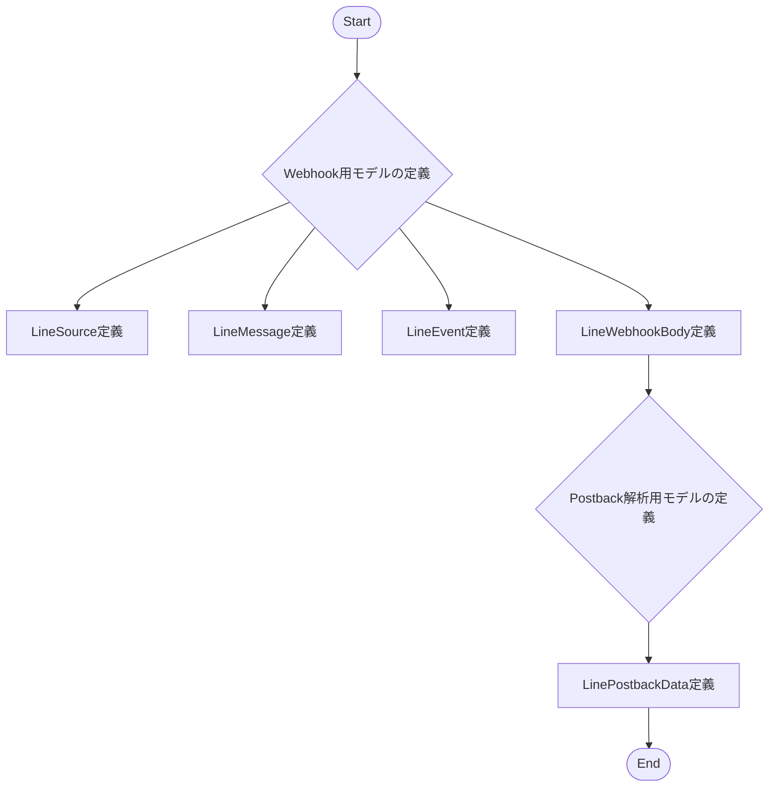
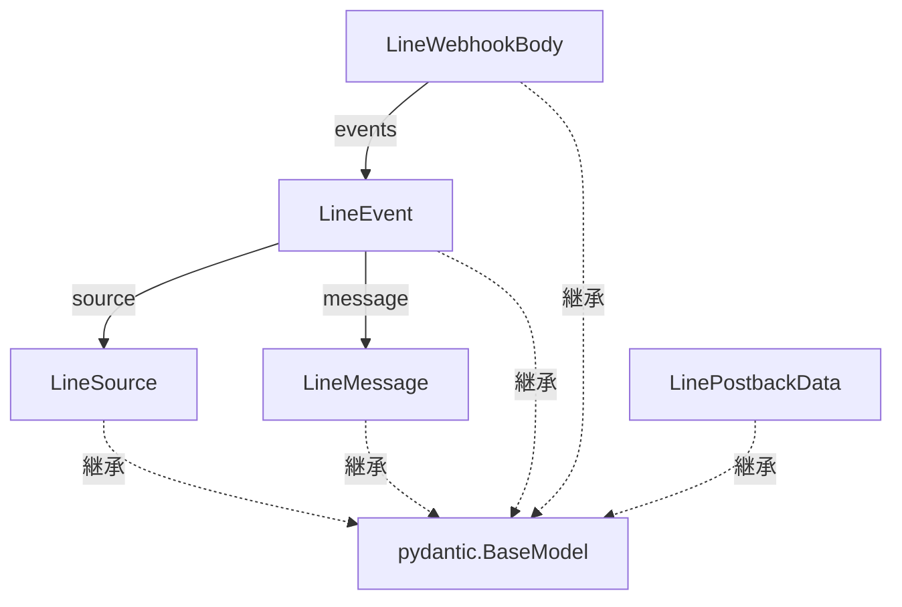

## 1. 解析メタ情報

| 項目 | 内容 |
| --- | --- |
| 対象ファイル | `line.py` |
| 言語 | Python |
| 解析対象 | 提供されたコードのみ |
| 推測・補完 | 一切なし |

## 関連ドキュメント

* [line_handler.md](./line_handler.md) - 型のインポート元だがLinePostbackDataは未使用。Webhookの実処理を行うイベントハンドラー
* [line_logic.md](./line_logic.md) - LinePostbackDataの実利用元(Postbackデータのパースに使用)
* [webhook_router.md](./webhook_router.md) - 実際のWebhook HTTPエントリポイント(callback_line())

## 2. ファイルの概要

* LINEシステムとの連携において、データ構造を定義し型安全性を担保するためのPydanticモデル群を提供するファイル。
* Webhookから受信するイベントデータの構造定義、およびPostback時のデータをパースした後の構造定義を行っている。
* 具体的な処理ロジック（関数の実行や外部API通信など）は含まれていない。
* 2026年のリファクタリング（コミット `1ecbe3b`）により、`InputMode`（Enum）および`UserInputState`（BaseModel）は削除された。これらは `handlers/line_logic.py` 側の手入力継続用ステートマシン（`USER_INPUT_STATE`）でのみ使用されていたが、そのステートマシン自体が到達不能コードとして削除されたため、消費者がいなくなり不要になった。これに伴い、Enum定義に使用していた `from enum import Enum` のインポートも削除されている。

## 3. 外部依存関係

### インポート一覧

| 名称 | 種類 | 用途 | 根拠 |
| --- | --- | --- | --- |
| `pydantic.BaseModel` | 外部ライブラリ | データモデル定義の基底クラスとして使用 | 根拠: [インポート宣言] (行番号: 2 / 抜粋: "from pydantic import BaseModel, Field") |
| `pydantic.Field` | 外部ライブラリ | インポートされているがファイル内では未使用 | 根拠: [インポート宣言] (行番号: 2 / 抜粋: "from pydantic import BaseModel, Field") |
| `typing.List` | 標準ライブラリ | リスト型の型ヒントとして使用 | 根拠: [インポート宣言] (行番号: 3 / 抜粋: "from typing import List, Optional, Any") |
| `typing.Optional` | 標準ライブラリ | 省略可能な項目の型ヒントとして使用 | 根拠: [インポート宣言] (行番号: 3 / 抜粋: "from typing import List, Optional, Any") |
| `typing.Any` | 標準ライブラリ | 任意の型を許容する型ヒントとして使用 | 根拠: [インポート宣言] (行番号: 3 / 抜粋: "from typing import List, Optional, Any") |

### ブラックボックスとなる外部要素

| 名称 | 理由 | 根拠 |
| --- | --- | --- |
| `unified_server.py` | コメントにて利用先として言及されているが、本ファイル内に実装がないためどのようにモデルが参照・インスタンス化されるか不明 | 根拠: [コメント] (行番号: 5 / 抜粋: "# --- Webhookのエントリポイント用モデル (unified_server.py用) ---") |
| `line_logic.py` | コメントにて利用先として言及されているが、本ファイル内に実装がないためPostbackのパース処理の詳細が不明 | 根拠: [コメント] (行番号: 28 / 抜粋: "# --- Postback解析用モデル (line_logic.py用) ---") |

## 4. 主要要素の定義（関数 / エンドポイント / コンポーネント）

### `LineSource`

* **役割**: LINE Webhookの送信元情報を保持するデータモデル。
* 根拠: [LineSource] (行番号: 6〜8 / 抜粋: "class LineSource(BaseModel):")

* **引数/リクエスト**: `userId`: str, `type`: str
* 根拠: [LineSource属性] (行番号: 7〜8 / 抜粋: "userId: str type: str")

* **戻り値/レスポンス**: `LineSource` インスタンス
* 根拠: [LineSource] (行番号: 6 / 抜粋: "class LineSource(BaseModel):")

* **副作用**: なし
* 根拠: [LineSource] (行番号: 6〜8 / 抜粋: "class LineSource(BaseModel):")

* **エラーハンドリング**: なし（Pydanticによる標準の型検証のみ）
* 根拠: [LineSource] (行番号: 6〜8 / 抜粋: "class LineSource(BaseModel):")

### `LineMessage`

* **役割**: LINE Webhookのメッセージ情報を保持するデータモデル。
* 根拠: [LineMessage] (行番号: 10〜13 / 抜粋: "class LineMessage(BaseModel):")

* **引数/リクエスト**: `id`: str, `type`: str, `text`: Optional[str] (デフォルト値: None)
* 根拠: [LineMessage属性] (行番号: 11〜13 / 抜粋: "text: Optional[str] = None")

* **戻り値/レスポンス**: `LineMessage` インスタンス
* 根拠: [LineMessage] (行番号: 10 / 抜粋: "class LineMessage(BaseModel):")

* **副作用**: なし
* 根拠: [LineMessage] (行番号: 10〜13 / 抜粋: "class LineMessage(BaseModel):")

* **エラーハンドリング**: なし
* 根拠: [LineMessage] (行番号: 10〜13 / 抜粋: "class LineMessage(BaseModel):")

### `LineEvent`

* **役割**: LINE Webhookの単一イベント情報を保持するデータモデル。
* 根拠: [LineEvent] (行番号: 15〜21 / 抜粋: "class LineEvent(BaseModel):")

* **引数/リクエスト**: `type`: str, `replyToken`: Optional[str] (デフォルト値: None), `source`: LineSource, `message`: Optional[LineMessage] (デフォルト値: None), `postback`: Optional[Any] (デフォルト値: None), `timestamp`: int
* 根拠: [LineEvent属性] (行番号: 16〜21 / 抜粋: "postback: Optional[Any] = None")

* **戻り値/レスポンス**: `LineEvent` インスタンス
* 根拠: [LineEvent] (行番号: 15 / 抜粋: "class LineEvent(BaseModel):")

* **副作用**: なし
* 根拠: [LineEvent] (行番号: 15〜21 / 抜粋: "class LineEvent(BaseModel):")

* **エラーハンドリング**: なし
* 根拠: [LineEvent] (行番号: 15〜21 / 抜粋: "class LineEvent(BaseModel):")

### `LineWebhookBody`

* **役割**: LINE Webhookのリクエストボディ全体の構造を保持するデータモデル。
* 根拠: [LineWebhookBody] (行番号: 23〜26 / 抜粋: "class LineWebhookBody(BaseModel):")

* **引数/リクエスト**: `destination`: str, `events`: List[LineEvent]
* 根拠: [LineWebhookBody属性] (行番号: 25〜26 / 抜粋: "destination: str events: List[LineEvent]")

* **戻り値/レスポンス**: `LineWebhookBody` インスタンス
* 根拠: [LineWebhookBody] (行番号: 23 / 抜粋: "class LineWebhookBody(BaseModel):")

* **副作用**: なし
* 根拠: [LineWebhookBody] (行番号: 23〜26 / 抜粋: "class LineWebhookBody(BaseModel):")

* **エラーハンドリング**: なし
* 根拠: [LineWebhookBody] (行番号: 23〜26 / 抜粋: "class LineWebhookBody(BaseModel):")

### `LinePostbackData`

* **役割**: LINEのボタン操作等で送られるPostbackデータをパースした後の構造を保持するデータモデル。
* 根拠: [LinePostbackData] (行番号: 29〜37 / 抜粋: "class LinePostbackData(BaseModel):")

* **引数/リクエスト**: `action`: str, `child`: Optional[str] (デフォルト値: None), `status`: Optional[str] (デフォルト値: None), `value`: Optional[str] (デフォルト値: None)
* 根拠: [LinePostbackData属性] (行番号: 34〜37 / 抜粋: "child: Optional[str] = None")

* **戻り値/レスポンス**: `LinePostbackData` インスタンス
* 根拠: [LinePostbackData] (行番号: 29 / 抜粋: "class LinePostbackData(BaseModel):")

* **副作用**: なし
* 根拠: [LinePostbackData] (行番号: 29〜37 / 抜粋: "class LinePostbackData(BaseModel):")

* **エラーハンドリング**: なし
* 根拠: [LinePostbackData] (行番号: 29〜37 / 抜粋: "class LinePostbackData(BaseModel):")

## 5. 処理フロー図

本ファイルはデータモデルの定義のみであり、動的なロジック（関数による処理フロー）は存在しません。以下の図は定義のロード順序の概要を示します。

```mermaid
flowchart TD
    Start([Start]) --> DefineWebhookModels{Webhook用モデルの定義}
    DefineWebhookModels --> DefineLineSource["LineSource定義"]
    DefineWebhookModels --> DefineLineMessage["LineMessage定義"]
    DefineWebhookModels --> DefineLineEvent["LineEvent定義"]
    DefineWebhookModels --> DefineLineWebhookBody["LineWebhookBody定義"]
    
    DefineLineWebhookBody --> DefinePostbackModels{Postback解析用モデルの定義}
    DefinePostbackModels --> DefineLinePostbackData["LinePostbackData定義"]
    
    DefineLinePostbackData --> End([End])

```

## 6. 依存関係図

ファイル内のモデル同士の参照関係、およびインポートした外部クラスとの関係を示します。

```mermaid
graph TD
    %% 外部クラス継承関係
    BaseModel[pydantic.BaseModel]
    
    LineSource -.->|継承| BaseModel
    LineMessage -.->|継承| BaseModel
    LineEvent -.->|継承| BaseModel
    LineWebhookBody -.->|継承| BaseModel
    LinePostbackData -.->|継承| BaseModel
    
    %% クラス間参照関係
    LineWebhookBody -->|events| LineEvent
    LineEvent -->|source| LineSource
    LineEvent -->|message| LineMessage

```

## 7. 次のステップ（リバースエンジニアリングの提案）

| 優先度 | ファイル名(推測可) | 理由 | 根拠 |
| --- | --- | --- | --- |
| 高 | `unified_server.py` | Webhookのエントリポイント用モデルの利用箇所であり、実際にどのようにリクエストデータが受信され、処理の起点となるかを把握するため。 | 根拠: [コメント] (行番号: 5 / 抜粋: "# --- Webhookのエントリポイント用モデル (unified_server.py用) ---") |
| 高 | `handlers/line_logic.py` | Postback解析用モデルの利用箇所であり、パース処理がどの機能と連動して実行されるかを把握するため。 | 根拠: [コメント] (行番号: 28 / 抜粋: "# --- Postback解析用モデル (line_logic.py用) ---") |

## 8. 保守上の注意点

* `pydantic` から `Field` がインポートされていますが、ファイル内では一度も使用されておらず未使用インポートとなっています。
* `LineEvent` クラスにおける `postback` プロパティの型が `Optional[Any]` となっており、Pydanticによる厳密な型検証が行われません。
* `LineEvent` の `replyToken`, `message`, `postback` はいずれも `Optional` であるため、イベントタイプ（例: messageイベントかpostbackイベントか）に応じた必須項目のチェックはこのモデル単体では機能しません。
* 2026年のリファクタリング（コミット `1ecbe3b`）で `InputMode`（Enum）と `UserInputState`（BaseModel）が削除された。消費者だった `handlers/line_logic.py` の `USER_INPUT_STATE` ステートマシン自体が到達不能コードとして削除されたことに伴う整理であり、`from enum import Enum` のインポートも同時に除去されている。

## 9. 不明事項一覧

| 項目 | 理由 | 必要なファイル |
| --- | --- | --- |
| 各モデルのインスタンス化・利用箇所 | 本ファイルは定義のみであり、実際のデータの受け渡しや検証がどこで行われているか不明なため。 | `unified_server.py`, `handlers/line_logic.py` 等の呼び出し元ファイル |
| `LineEvent.postback` のデータ構造 | 型が `Any` として定義されているため、Webhookから具体的にどのような形式のデータが渡ってくるかが不明なため。 | `unified_server.py` または LINE Webhook APIの仕様書 |
| Postbackデータのパース処理 | `LinePostbackData` のコメントにある文字列をパースするロジックの実装が不明なため。 | `handlers/line_logic.py` |

## 相互参照による補足情報

| 元の不明事項 | 判明した内容 | 参照元ドキュメント |
| --- | --- | --- |
| 各モデルのインスタンス化・利用箇所 | `routers/webhook_router.py`と`handlers/line_handler.py`、`handlers/line_logic.py`をリポジトリ全体で`LineSource`/`LineMessage`/`LineEvent`/`LineWebhookBody`について`grep`した結果、これら4モデルは`models/line.py`の定義箇所以外どこからもインポート・インスタンス化されていないことを確認した。実際のWebhookエンドポイントは`routers/webhook_router.py`19〜33行目の`callback_line()`であり、リクエストボディを`(await request.body()).decode('utf-8')`で文字列化した上で`line_handler.line_handler.handle(body, x_line_signature)`(28行目、`linebot.v3.WebhookHandler`のインスタンス)にそのまま渡しており、`models.line`側のモデルは一切経由しない設計であることが判明した。一方`LinePostbackData`のみは`handlers/line_logic.py`33行目でインポートされ、208〜215行目の`handle_postback`内で実際にインスタンス化されている（`handlers/line_handler.py`28行目でも同モデルはインポートされているが、同ファイル内では未使用）。 | 直接ソース確認: `MY_HOME_SYSTEM/routers/webhook_router.py:19-33`, `MY_HOME_SYSTEM/handlers/line_logic.py:33,208-215`, `MY_HOME_SYSTEM/handlers/line_handler.py:28`(モデル定義自体は`MY_HOME_SYSTEM/models/line.py:6-26`) |
| `LineEvent.postback` のデータ構造 | `models/line.py`で定義される`LineEvent`自体が上記の通りリポジトリ内のどこからもインスタンス化されない未使用モデルであることを直接確認した。実際にシステムを流れるPostbackイベントは`handlers/line_handler.py`24行目でインポートされる`linebot.v3.webhooks.PostbackEvent`であり、その`event.postback.data`(文字列)は`handlers/line_logic.py`208行目で`parse_qsl(event.postback.data)`によりクエリ文字列としてパースされ、`{"action": ..., "child": ..., "status": ..., "value": ...}`のようなキーを持つ辞書に変換された上で212行目の`LinePostbackData(**raw_dict)`に渡される。 | 直接ソース確認: `MY_HOME_SYSTEM/handlers/line_handler.py:24`, `MY_HOME_SYSTEM/handlers/line_logic.py:206-215`(モデル定義: `MY_HOME_SYSTEM/models/line.py:15-21`) |
| Postbackデータのパース処理 | `handlers/line_logic.py`を直接確認した。200〜219行目の`handle_postback`内で、207行目のコメント`# data形式例: "action=child_check&child=Taro&status=genki"`が示す通り、208行目で`raw_dict = dict(parse_qsl(event.postback.data))`によりURLクエリ文字列形式のデータを辞書化する。続いて211〜215行目で`try: pb = LinePostbackData(**raw_dict) except Exception: pb = LinePostbackData(action=raw_dict.get("action", "unknown"))`という構造になっており、`LinePostbackData`に未定義のフィールドが含まれる等でバリデーションに失敗した場合は、`action`フィールドのみ(存在しなければ`"unknown"`)でフォールバックする設計であることを確認した。 | 直接ソース確認: `MY_HOME_SYSTEM/handlers/line_logic.py:200-219` |

## 10. 自己検証結果

* [x] 推測・外部ファイルの仕様を一切含んでいない
* [x] 全関数・全クラス・全コンポーネントを列挙した
* [x] 全てのインポート要素を列挙した
* [x] すべての仕様説明に「根拠（行番号・抜粋）」を明記した
* [x] 根拠漏れが0件である
* [x] Mermaid構文にエラーの原因となる記号（エスケープ漏れ）がない
* [x] 不明事項を漏れなく列挙した

完了
