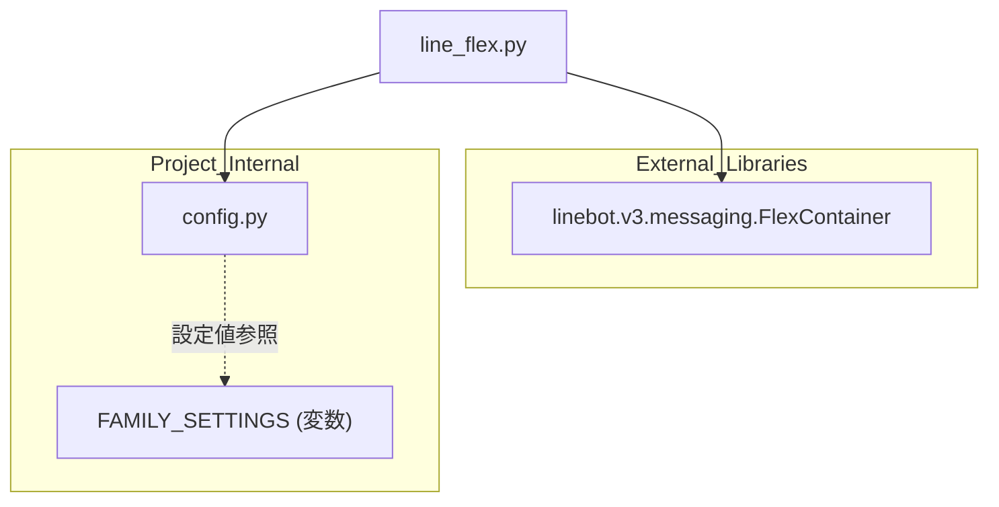

## 1. 解析メタ情報

| 項目 | 内容 |
| --- | --- |
| 対象ファイル | line_flex.py |
| 言語 | Python |
| 解析対象 | 提供されたコードのみ |
| 推測・補完 | 一切なし |

## 関連ドキュメント

* [config.md](./config.md) - `FAMILY_SETTINGS`(`styles`/`members`)の設定値を提供する内部モジュール
* [line_logic.md](./line_logic.md) - 同様に`create_health_carousel_flex`という類似名の関数を持つモジュール。ファイル名・関数の類似性から、家族の体調確認カルーセル生成という同一目的を別々に実装している可能性がある(本ファイルの関数`create_health_carousel`が実際にこのモジュールから呼び出されているかは、本ファイル単体からは確認できない)

## 2. ファイルの概要

LINE Botで使用するFlex Message(`FlexContainer`)を構築するビュー(表示生成)専用モジュール。3つの関数が定義されており、いずれも辞書(dict)構造でFlex Messageのペイロードを組み立て、`FlexContainer.from_dict`でオブジェクト化して返す(根拠: `[FlexContainer.from_dict呼び出し]` (行番号: 51, 55, 71 / 抜粋: "return FlexContainer.from_dict({\"type\": \"carousel\", \"contents\": bubbles})"))。`create_health_carousel`は`config.FAMILY_SETTINGS`の`members`(家族メンバー一覧)と`styles`(メンバーごとの色・アイコン設定)を参照し、メンバーごとに体調選択用のボタン(元気/熱あり/鼻水・他/その他)を持つバブルを生成してカルーセルにまとめる(根拠: `[create_health_carousel]` (行番号: 5〜51 / 抜粋: "for name in members:\n        st = styles.get(name, {\"color\": \"#333333\", \"age\": \"\", \"icon\": \"🙂\"})"))。`create_record_confirm_bubble`は記録完了時の確認メッセージ用の単一バブルを生成する(根拠: `[create_record_confirm_bubble]` (行番号: 53〜67 / 抜粋: "def create_record_confirm_bubble(text: str, button_label: str = \"📊 記録を確認\") -> FlexContainer:"))。`create_summary_bubble`は指定日付の記録サマリを表示するバブルを生成する(根拠: `[create_summary_bubble]` (行番号: 69〜95 / 抜粋: "def create_summary_bubble(date_str: str, summary_text: str) -> FlexContainer:"))。

## 3. 外部依存関係

### インポート一覧

| 名称 | 種類 | 用途 | 根拠 |
| --- | --- | --- | --- |
| `FlexContainer` | 外部ライブラリ(`linebot.v3.messaging`) | 構築したdict構造をLINE Flex Message用のオブジェクトに変換する | 根拠: `[from linebot.v3.messaging import FlexContainer]` (行番号: 2 / 抜粋: "from linebot.v3.messaging import FlexContainer") |
| `config` | 内部モジュール | 家族メンバー一覧・メンバーごとの表示スタイル(`FAMILY_SETTINGS`)の取得 | 根拠: `[import config]` (行番号: 3 / 抜粋: "import config") |

### ブラックボックスとなる外部要素

| 名称 | 理由 | 根拠 |
| --- | --- | --- |
| `config.FAMILY_SETTINGS` | `config`モジュールの実装が提供されておらず、`styles`・`members`の実際の内容(家族構成・色・アイコン設定)が不明であるため。 | 根拠: `[config.FAMILY_SETTINGS参照]` (行番号: 8〜9 / 抜粋: "styles = config.FAMILY_SETTINGS[\"styles\"]\n    members = config.FAMILY_SETTINGS[\"members\"]") |
| `FlexContainer.from_dict`の内部バリデーション挙動 | `linebot.v3.messaging`ライブラリの実装が提供されておらず、渡したdictのスキーマ不整合時の挙動(例外の有無など)は不明であるため。 | 根拠: `[FlexContainer.from_dict]` (行番号: 51 / 抜粋: "return FlexContainer.from_dict({\"type\": \"carousel\", \"contents\": bubbles})") |

## 4. 主要要素の定義（関数 / エンドポイント / コンポーネント）

### `create_health_carousel`

* **役割**: 家族メンバーごとに体調選択ボタン(元気/熱あり/鼻水・他/その他)付きのFlex Bubbleを生成し、それらをまとめたカルーセル(`FlexContainer`)を返す。
* 根拠: `[create_health_carousel]` (行番号: 5〜51 / 抜粋: "def create_health_carousel() -> FlexContainer:\n    \"\"\"詳細入力用カルーセルを作成\"\"\"")

* **引数/リクエスト**: なし
* 根拠: `[関数シグネチャ]` (行番号: 5 / 抜粋: "def create_health_carousel() -> FlexContainer:")

* **戻り値/レスポンス**: `FlexContainer`(`type: carousel`、メンバー数分の`bubble`を`contents`に持つ)
* 根拠: `[戻り値]` (行番号: 51 / 抜粋: "return FlexContainer.from_dict({\"type\": \"carousel\", \"contents\": bubbles})")

* **副作用**: なし(純粋にデータ構造を組み立てて返すのみ)
* 根拠: `[関数本体]` (行番号: 5〜51 / 抜粋: "bubbles = []")

* **エラーハンドリング**: なし。`styles.get(name, {...})`によりメンバーのスタイル未定義時はデフォルト値(色`#333333`・アイコン`🙂`)にフォールバックする。
* 根拠: `[styles.get フォールバック]` (行番号: 12 / 抜粋: "st = styles.get(name, {\"color\": \"#333333\", \"age\": \"\", \"icon\": \"🙂\"})")

### `create_record_confirm_bubble`

* **役割**: 記録完了時に表示する確認メッセージ(テキスト+確認ボタン)を持つ単一のFlex Bubbleを生成する。
* 根拠: `[create_record_confirm_bubble]` (行番号: 53〜67 / 抜粋: "\"\"\"記録完了時の確認バブルを作成\"\"\"")

* **引数/リクエスト**: `text` (`str`、バブル本文に表示するテキスト)、`button_label` (`str`、デフォルト`"📊 記録を確認"`。フッターボタンのラベル)
* 根拠: `[関数シグネチャ]` (行番号: 53 / 抜粋: "def create_record_confirm_bubble(text: str, button_label: str = \"📊 記録を確認\") -> FlexContainer:")

* **戻り値/レスポンス**: `FlexContainer`(`type: bubble`。本文に`text`、フッターに`data=\"action=check_status\"`のpostbackボタン)
* 根拠: `[戻り値]` (行番号: 55〜67 / 抜粋: "\"action\": {\"type\": \"postback\", \"label\": button_label, \"data\": \"action=check_status\"}")

* **副作用**: なし
* 根拠: `[関数本体]` (行番号: 53〜67 / 抜粋: "return FlexContainer.from_dict({")

* **エラーハンドリング**: なし
* 根拠: `[関数本体]` (行番号: 53〜67 / 抜粋: "def create_record_confirm_bubble(text: str, button_label: str = \"📊 記録を確認\") -> FlexContainer:")

### `create_summary_bubble`

* **役割**: 指定日付とサマリテキストから、記録内容の確認・修正導線(「入力パネルを表示」ボタン)付きのFlex Bubbleを生成する。
* 根拠: `[create_summary_bubble]` (行番号: 69〜95 / 抜粋: "\"\"\"サマリ表示バブルを作成\"\"\"")

* **引数/リクエスト**: `date_str` (`str`、表示する日付文字列)、`summary_text` (`str`、表示するサマリ本文)
* 根拠: `[関数シグネチャ]` (行番号: 69 / 抜粋: "def create_summary_bubble(date_str: str, summary_text: str) -> FlexContainer:")

* **戻り値/レスポンス**: `FlexContainer`(`type: bubble`。ヘッダ相当のタイトルテキスト`📅 {date_str} の記録`、区切り線、サマリ本文、フッターに`data=\"action=show_health_input\"`のpostbackボタン)
* 根拠: `[戻り値]` (行番号: 71〜94 / 抜粋: "\"text\": f\"📅 {date_str} の記録\", \"weight\": \"bold\", \"size\": \"md\"")

* **副作用**: なし
* 根拠: `[関数本体]` (行番号: 69〜95 / 抜粋: "return FlexContainer.from_dict({")

* **エラーハンドリング**: なし
* 根拠: `[関数本体]` (行番号: 69〜95 / 抜粋: "def create_summary_bubble(date_str: str, summary_text: str) -> FlexContainer:")

## 5. 処理フロー図

```mermaid
flowchart TD
    subgraph create_health_carousel_Flow["create_health_carousel() 処理フロー"]
        H1["開始"] --> H2["外部: config.FAMILY_SETTINGSからstyles/membersを取得"]
        H2 --> H3["bubbles = [] を初期化"]
        H3 --> H4{"membersを1件ずつ処理"}
        H4 --> H5["styles.get(name, デフォルト値) でスタイル取得"]
        H5 --> H6["ヘッダー(アイコン+名前, 背景色)を構築"]
        H6 --> H7["ボディ(体調選択の案内テキスト)を構築"]
        H7 --> H8["フッター(元気/熱あり/鼻水・他/その他/記録確認ボタン)を構築"]
        H8 --> H9["bubble を bubbles に追加"]
        H9 --> H4
        H4 -- 全member処理完了 --> H10["FlexContainer.from_dict({type: carousel, contents: bubbles})"]
        H10 --> H11["終了: FlexContainerを返却"]
    end

    subgraph create_record_confirm_bubble_Flow["create_record_confirm_bubble() 処理フロー"]
        C1["開始"] --> C2["text/button_labelを受け取り"]
        C2 --> C3["body(text表示)とfooter(確認ボタン)を持つbubble構造を構築"]
        C3 --> C4["FlexContainer.from_dict(...)"]
        C4 --> C5["終了: FlexContainerを返却"]
    end

    subgraph create_summary_bubble_Flow["create_summary_bubble() 処理フロー"]
        S1["開始"] --> S2["date_str/summary_textを受け取り"]
        S2 --> S3["body(タイトル+区切り線+サマリ本文)を構築"]
        S3 --> S4["footer(修正導線ボタン)を構築"]
        S4 --> S5["FlexContainer.from_dict(...)"]
        S5 --> S6["終了: FlexContainerを返却"]
    end
```

## 6. 依存関係図

## 7. 次のステップ（リバースエンジニアリングの提案）

| 優先度 | ファイル名(推測可) | 理由 | 根拠 |
| --- | --- | --- | --- |
| 高 | `config.py` | `FAMILY_SETTINGS`の`styles`・`members`の実際の構造(家族構成・色定義)を確認するため。 | 根拠: `[config.FAMILY_SETTINGS参照]` (行番号: 8〜9 / 抜粋: "styles = config.FAMILY_SETTINGS[\"styles\"]\n    members = config.FAMILY_SETTINGS[\"members\"]") |
| 高 | `line_logic.py` | 類似名の関数`create_health_carousel_flex`を持ち、本ファイルの各関数の実際の呼び出し元(またはその代替実装)である可能性が高いため、呼び出し関係の有無を確認する必要がある。 | 根拠: `[postbackアクション data文字列の一致]` (行番号: 36, 38, 40, 42, 45 / 抜粋: "\"data\": f\"action=child_check&child={name}&status=genki\"") |
| 中 | 本ファイルの各関数を呼び出すハンドラ(webhook_router.py / line_handler.py等、推測) | `create_health_carousel`等が現状どこからも呼び出されていない可能性があり(本ファイル単体では呼び出し元不明)、実際の利用箇所を特定するため。 | 根拠: `[関数群]` (行番号: 5, 53, 69 / 抜粋: "def create_health_carousel() -> FlexContainer:") |

## 8. 保守上の注意点

* **呼び出し元が本ファイルからは不明**: 3つの関数はいずれも単純な生成処理であり、実際にどこから(どのハンドラ・ルーターから)呼び出されているかは本ファイル自体には記述がない。未使用(デッドコード)である可能性、または別モジュール(`line_logic.py`の`create_health_carousel_flex`等)と機能が重複している可能性がある。 根拠: `[関数定義群]` (行番号: 5, 53, 69 / 抜粋: "def create_health_carousel() -> FlexContainer:")
* **`styles.get`のデフォルト値ハードコード**: メンバー未登録時のフォールバックスタイル(`color: #333333`, `icon: 🙂`)が関数内にハードコードされている。 根拠: `[デフォルトスタイル]` (行番号: 12 / 抜粋: "st = styles.get(name, {\"color\": \"#333333\", \"age\": \"\", \"icon\": \"🙂\"})")
* **postbackの`data`文字列が手組みのクエリ形式**: `f\"action=child_check&child={name}&status=genki\"`のように`&`区切りの文字列をf-stringで直接組み立てており、`name`に`&`や`=`等の特殊文字が含まれた場合にパース側で誤動作するリスクがある(URLエンコード等の対策は行われていない)。 根拠: `[postback data組み立て]` (行番号: 36 / 抜粋: "\"data\": f\"action=child_check&child={name}&status=genki\"")
* **入力値の検証なし**: `create_record_confirm_bubble`・`create_summary_bubble`は受け取った`text`・`summary_text`をそのままFlex Messageに埋め込んでおり、長さや内容に対するバリデーションは行われていない(LINE側の文字数制限等に抵触する可能性)。 根拠: `[テキスト埋め込み]` (行番号: 59, 78 / 抜粋: "{\"type\": \"text\", \"text\": text, \"wrap\": True}")

## 9. 不明事項一覧

| 項目 | 理由 | 必要なファイル |
| --- | --- | --- |
| `config.FAMILY_SETTINGS`の実際の構造(メンバー数・スタイル定義) | `config`モジュールの実装が提供されていないため。 | `config.py` |
| 本ファイルの各関数の実際の呼び出し元 | 呼び出し箇所は本ファイルに含まれていないため。 | `webhook_router.py`、`line_handler.py`、`line_logic.py`等のハンドラ/ルーター群 |
| `line_logic.py`の`create_health_carousel_flex`との関係(重複実装か、置き換え途中か) | `line_logic.py`の実装内容自体は本ファイルの解析範囲外であるため。 | `line_logic.py` |

## 相互参照による補足情報

| 元の不明事項 | 判明した内容 | 参照元ドキュメント |
| --- | --- | --- |
| `config.FAMILY_SETTINGS`の実際の構造(メンバー数・スタイル定義) | `MY_HOME_SYSTEM/config.py`を直接確認した。469〜477行目で`Dict[str, Any]`型として定義されており、`members`キーは`["智矢", "涼花", "将博", "春菜"]`という4名の文字列リスト、`styles`キーは各名前をキーとして`{"color": "#1E90FF", "age": None, "icon": "👦"}`のような`color`(16進カラーコード文字列)・`age`(初期値`None`)・`icon`(絵文字文字列)を持つ辞書であることを確認した。なお479〜488行目で`family_members.local.json`が存在する場合、`styles`内の既存キーに対して`age`等の値がマージされる設計であることも確認した。 | 直接ソース確認: `MY_HOME_SYSTEM/config.py:469-488` |
| 本ファイルの各関数の実際の呼び出し元 | `MY_HOME_SYSTEM/views/line_flex.py`の3関数(`create_health_carousel`, `create_record_confirm_bubble`, `create_summary_bubble`)について、リポジトリ全体を`line_flex`および各関数名で`grep`した結果、`views/line_flex.py`自身の定義箇所以外にインポート・呼び出しが一切見つからなかった。`routers/webhook_router.py`、`handlers/line_handler.py`、`handlers/line_logic.py`のいずれにも`line_flex`のインポート文は存在せず、本ファイルはリポジトリ内のどこからも呼び出されていない未使用モジュールであることを確認した。 | 直接ソース確認: リポジトリ全体`grep`（`MY_HOME_SYSTEM/views/line_flex.py`, `MY_HOME_SYSTEM/routers/webhook_router.py`, `MY_HOME_SYSTEM/handlers/line_handler.py`, `MY_HOME_SYSTEM/handlers/line_logic.py`にインポート記述なし） |
| `line_logic.py`の`create_health_carousel_flex`との関係(重複実装か、置き換え途中か) | `MY_HOME_SYSTEM/handlers/line_logic.py`104〜143行目の`create_health_carousel_flex()`と、本ファイル`views/line_flex.py`5〜51行目の`create_health_carousel()`を直接比較した。両者はbubbleの`header`/`body`/`footer`構造、ボタンのpostbackデータ形式(`action=child_check&child={name}&status=...`)まで含めてほぼ同一の実装であり、唯一の差異は対象メンバーの取得元で、`line_logic.py`側は`TARGET_MEMBERS`という同ファイル内の定数を使うのに対し、`line_flex.py`側は`config.FAMILY_SETTINGS["members"]`を直接参照する点であった。かつ`line_logic.create_health_carousel_flex`は`handlers/line_logic.py`264行目で実際に呼び出されているのに対し、`line_flex.create_health_carousel`は前項の通りどこからも呼び出されていない。この状況から、`line_flex.py`は`line_logic.py`側に実装が移された（または統合された）後に削除されずに残った重複・未使用の実装であると直接確認できる差異から判断できるが、開発の経緯(どちらが先に書かれたか)自体はソースコードからは判断できない。 | 直接ソース確認: `MY_HOME_SYSTEM/views/line_flex.py:5-51`, `MY_HOME_SYSTEM/handlers/line_logic.py:104-143,264` |

## 10. 自己検証結果

* [x] 推測・外部ファイルの仕様を一切含んでいない（完了）
* [x] 全関数・全クラス・全コンポーネントを列挙した（完了）
* [x] 全てのインポート要素を列挙した（完了）
* [x] すべての仕様説明に「根拠（行番号・抜粋）」を明記した（完了）
* [x] 根拠漏れが0件である（完了）
* [x] Mermaid構文にエラーの原因となる記号（エスケープ漏れ）がない（完了）
* [x] 不明事項を漏れなく列挙した（完了）
