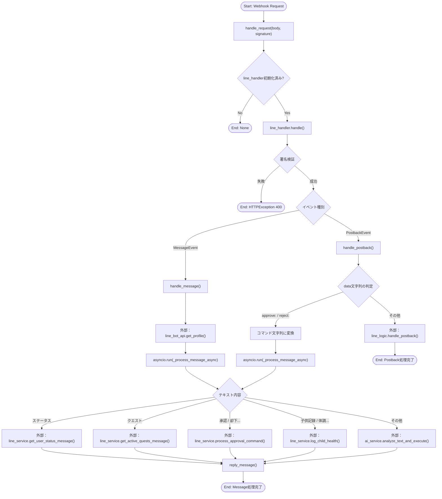
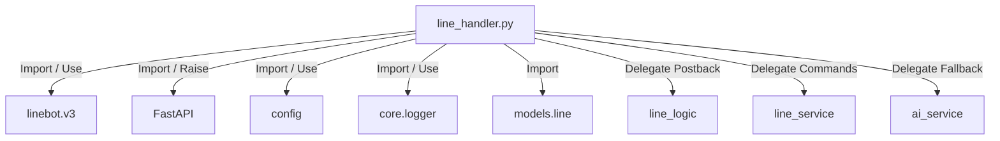

## 1. 解析メタ情報

| 項目 | 内容 |
| --- | --- |
| 対象ファイル | line_handler.py |
| 言語 | Python (FastAPI関連要素含む) |
| 解析対象 | 提供されたコードのみ |
| 推測・補完 | 一切なし |

## 2. ファイルの概要

* LINE Bot API（v3）からのWebhookリクエストを受信し、発生したイベント（テキストメッセージ受信、ポストバック受信）を解析して、適切な処理（ステータス確認、クエスト処理、子供の体調記録、AI解析、その他のロジック）へ振り分けるルーターおよびエントリーポイントとしての責務を担う。
* 根拠: ファイル全体の構成および `handle_request`, `@line_handler.add(MessageEvent...`, `@line_handler.add(PostbackEvent)` の存在 (行番号: 行番号取得不可 / 抜粋: "@line_handler.add(MessageEvent")

## 3. 外部依存関係

### インポート一覧

| 名称 | 種類 | 用途 | 根拠 |
| --- | --- | --- | --- |
| `asyncio` | 標準ライブラリ | 非同期関数の同期的な実行(`asyncio.run`) | インポート宣言 (行番号: 行番号取得不可 / 抜粋: "import asyncio") |
| `os`, `sys`, `json` | 標準ライブラリ | ファイル内での明示的な使用箇所なし | インポート宣言 (行番号: 行番号取得不可 / 抜粋: "import os") |
| `Optional`, `List` | 標準ライブラリ (typing) | 型ヒント | インポート宣言 (行番号: 行番号取得不可 / 抜粋: "from typing import Optional") |
| `Request`, `HTTPException` | 外部ライブラリ (FastAPI) | 型ヒントおよび例外送出 | インポート宣言 (行番号: 行番号取得不可 / 抜粋: "from fastapi import Request") |
| `handlers.line_logic` | 内部モジュール | ポストバックイベントの一部処理委譲 | インポート宣言 (行番号: 行番号取得不可 / 抜粋: "import handlers.line_logic") |
| `WebhookHandler`等 (linebot.v3) | 外部ライブラリ | LINE APIの初期化、イベントハンドリング、メッセージ送信 | インポート宣言 (行番号: 行番号取得不可 / 抜粋: "from linebot.v3 import") |
| `MessageEvent`等 (linebot.v3.webhooks) | 外部ライブラリ | Webhookイベントの型定義およびルーティング | インポート宣言 (行番号: 行番号取得不可 / 抜粋: "from linebot.v3.webhooks import") |
| `InvalidSignatureError` | 外部ライブラリ | 署名検証エラーの捕捉 | インポート宣言 (行番号: 行番号取得不可 / 抜粋: "from linebot.v3.exceptions") |
| `config` | 内部モジュール | APIトークンや設定値（家族のメンバー等）の取得 | インポート宣言 (行番号: 行番号取得不可 / 抜粋: "import config") |
| `setup_logging` (core.logger) | 内部モジュール | ロガーの初期化 | インポート宣言 (行番号: 行番号取得不可 / 抜粋: "from core.logger import setup_logging") |
| `LinePostbackData` (models.line) | 内部モジュール | ファイル内での明示的な使用箇所なし | インポート宣言 (行番号: 行番号取得不可 / 抜粋: "from models.line import") |
| `line_service`, `ai_service` | 内部モジュール | ビジネスロジック、外部API、AI解析処理への委譲 | インポート宣言 (行番号: 行番号取得不可 / 抜粋: "from services import") |

### ブラックボックスとなる外部要素

| 名称 | 理由 | 根拠 |
| --- | --- | --- |
| `config.LINE_CHANNEL_ACCESS_TOKEN` 

 `config.LINE_CHANNEL_SECRET` | 値の取得元や環境変数の仕様が不明 | 該当要素の使用 (行番号: 行番号取得不可 / 抜粋: "line_conf = Configuration(") |
| `config.FAMILY_SETTINGS["members"]` | データ構造やリストに含まれる要素の型・内容が不明 | 該当要素の使用 (行番号: 行番号取得不可 / 抜粋: "for child in config.FAMILY_SET") |
| `line_service` 各種メソッド | 引数に対する具体的な処理内容および戻り値の型・形式が不明 | 該当要素の呼び出し (行番号: 行番号取得不可 / 抜粋: "resp = await line_service.") |
| `ai_service.analyze_text_and_execute` | AI解析の具体的なロジック、副作用、戻り値の仕様が不明 | 該当要素の呼び出し (行番号: 行番号取得不可 / 抜粋: "ai_resp_text = await ai_servic") |
| `line_logic.handle_postback` | 委譲先の具体的な処理内容および副作用が不明 | 該当要素の呼び出し (行番号: 行番号取得不可 / 抜粋: "line_logic.handle_postback(") |

## 4. 主要要素の定義（関数 / エンドポイント / コンポーネント）

### `reply_message`

* **役割**: `line_bot_api.reply_message` を用いてユーザーにメッセージを返信するラッパー関数。単一のメッセージオブジェクトが渡された場合はリストに変換して送信する。
* 根拠: `reply_message` 関数定義 (行番号: 行番号取得不可 / 抜粋: "def reply_message(reply_token:")

* **引数/リクエスト**:
* `reply_token`: `str`型 (LINE APIの返信用トークン)
* `messages`: `List[any]`型または単一のオブジェクト (送信するメッセージオブジェクト)
* 根拠: 引数定義 (行番号: 行番号取得不可 / 抜粋: "reply_token: str, messages: L")

* **戻り値/レスポンス**: なし (`None`)
* 根拠: return文の記述がない (行番号: 行番号取得不可 / 抜粋: "line_bot_api.reply_message(")

* **副作用**: LINE Platform経由でのユーザーへのメッセージ送信。
* 根拠: 外部API呼び出し (行番号: 行番号取得不可 / 抜粋: "line_bot_api.reply_message(")

* **エラーハンドリング**: 例外発生時は `logger.error` でログ出力を行い、処理を継続する。
* 根拠: try-exceptブロック (行番号: 行番号取得不可 / 抜粋: "except Exception as e: logger")

### `handle_message`

* **役割**: `TextMessageContent` の `MessageEvent` を受け取り、送信者の表示名を取得した上で、非同期処理 `_process_message_async` を同期的に実行 (`asyncio.run`) する。
* 根拠: `@line_handler.add` デコレータと関数定義 (行番号: 行番号取得不可 / 抜粋: "def handle_message(event: Mess")

* **引数/リクエスト**:
* `event`: `MessageEvent`型 (LINEのWebhookイベントオブジェクト)
* 根拠: 引数定義 (行番号: 行番号取得不可 / 抜粋: "event: MessageEvent")

* **戻り値/レスポンス**: なし (`None`)
* 根拠: return文が存在しない (行番号: 行番号取得不可 / 抜粋: "asyncio.run(")

* **副作用**: `line_bot_api.get_profile` による外部API呼び出し、および `_process_message_async` の実行に伴う副作用。
* 根拠: API呼び出し処理 (行番号: 行番号取得不可 / 抜粋: "profile = line_bot_api.get_pro")

* **エラーハンドリング**: `get_profile` の失敗時 (未登録ユーザー等) は例外を無視し、`user_name` を "Unknown" のまま続行する。
* 根拠: try-except-passブロック (行番号: 行番号取得不可 / 抜粋: "except Exception: pass")

### `_process_message_async`

* **役割**: 受信したテキストメッセージの内容に応じた分岐（ステータス、クエスト、承認/却下、子供の体調記録）を行い、該当しない場合はAI解析に回す非同期処理ロジック。
* 根拠: 関数定義および内部のif文 (行番号: 行番号取得不可 / 抜粋: "async def _process_message_asy")

* **引数/リクエスト**:
* `user_id`: `str`型 (ユーザーのLINE ID)
* `user_name`: `str`型 (ユーザーの表示名)
* `msg_text`: `str`型 (受信したテキストメッセージ)
* `reply_token`: `str`型 (返信用トークン)
* 根拠: 引数定義 (行番号: 行番号取得不可 / 抜粋: "user_id: str, user_name: str, ")

* **戻り値/レスポンス**: なし (`None`)
* 根拠: 各分岐でのreturnは空 (行番号: 行番号取得不可 / 抜粋: "return")

* **副作用**: `line_service`、`ai_service` への処理委譲に伴う副作用、および `reply_message` によるメッセージ送信。
* 根拠: サービス呼び出し (行番号: 行番号取得不可 / 抜粋: "await line_service.get_user_st")

* **エラーハンドリング**: AI処理 (`ai_service.analyze_text_and_execute`) で例外が発生した場合、エラーログを出力し、固定のエラーメッセージをユーザーに返信する。
* 根拠: try-exceptブロック (行番号: 行番号取得不可 / 抜粋: "except Exception as e: logger")

### `handle_postback`

* **役割**: `PostbackEvent` (ボタン押下など) を受け取るハンドラー。`data` 文字列が "approve:" または "reject:" で始まる場合は「承認/却下」コマンドに変換して `_process_message_async` を呼び出す。それ以外は `line_logic.handle_postback` へ処理を丸投げする。
* 根拠: `@line_handler.add` デコレータと関数定義 (行番号: 行番号取得不可 / 抜粋: "def handle_postback(event: Pos")

* **引数/リクエスト**:
* `event`: `PostbackEvent`型
* 根拠: 引数定義 (行番号: 行番号取得不可 / 抜粋: "event: PostbackEvent")

* **戻り値/レスポンス**: なし (`None`)
* 根拠: 各分岐でのreturnは空 (行番号: 行番号取得不可 / 抜粋: "return")

* **副作用**: `_process_message_async` または `line_logic.handle_postback` の実行に伴う副作用。
* 根拠: 関数呼び出し (行番号: 行番号取得不可 / 抜粋: "line_logic.handle_postback(eve")

* **エラーハンドリング**:
* "approve:/reject:" のパース失敗時 (`ValueError`) にはエラーログを出力し処理終了。
* `line_logic.handle_postback` 委譲時の例外はキャッチしてエラーログを出力（ユーザーへの通知はコメントアウトされている）。
* 根拠: try-exceptブロック (行番号: 行番号取得不可 / 抜粋: "except ValueError: logger.erro")

### `handle_request`

* **役割**: 外部 (おそらくFastAPIのルーター等) から呼び出されるWebhook受信用のエントリーポイント。署名の検証とハンドラーの呼び出しを行う。
* 根拠: 関数定義と `line_handler.handle` の呼び出し (行番号: 行番号取得不可 / 抜粋: "def handle_request(request: Re")

* **引数/リクエスト**:
* `request`: `Request`型 (FastAPIのリクエストオブジェクト)
* `body`: `str`型 (リクエストボディ文字列)
* `signature`: `str`型 (LINEプラットフォームからの署名ヘッダ)
* 根拠: 引数定義 (行番号: 行番号取得不可 / 抜粋: "request: Request, body: str, s")

* **戻り値/レスポンス**: `line_handler` が初期化されていない場合は暗黙の `None` を返す。正常終了時も明示的な戻り値はない。
* 根拠: if文による早期リターンとreturn欠如 (行番号: 行番号取得不可 / 抜粋: "if not line_handler: return")

* **副作用**: `line_handler.handle` の実行による登録済みイベントハンドラーの同期呼び出し。
* 根拠: ハンドラー呼び出し (行番号: 行番号取得不可 / 抜粋: "line_handler.handle(body, sign")

* **エラーハンドリング**: `InvalidSignatureError` 発生時、警告ログを出力し `HTTPException(status_code=400)` をスローする。
* 根拠: try-exceptブロック (行番号: 行番号取得不可 / 抜粋: "raise HTTPException(status_cod")

## 5. 処理フロー図

## 6. 依存関係図

## 7. 次のステップ（リバースエンジニアリングの提案）

| 優先度 | ファイル名(推測可) | 理由 | 根拠 |
| --- | --- | --- | --- |
| 高 | `config.py` | 認証情報やシステム設定値（`FAMILY_SETTINGS`等）の構造が不明なため、システム要件の全容把握に必須。 | 該当ファイルからのインポートと参照 (抜粋: "config.LINE_CHANNEL_ACCESS_T") |
| 高 | `services/line_service.py` | 主要なビジネスロジック（クエスト、承認、体調管理）がこのファイルに隠蔽されており、具体的な処理内容やデータベース更新の有無が不明なため。 | 該当モジュールのメソッド呼び出し (抜粋: "await line_service.get_user_") |
| 中 | `handlers/line_logic.py` | Postbackイベントのうち、承認/却下以外のボタン操作処理の実装が全てこのファイルに委譲されているため。 | 該当モジュールの呼び出し (抜粋: "line_logic.handle_postback(") |
| 中 | `services/ai_service.py` | 未定義のコマンドを受け取った際のフォールバックロジック（AI解析）の具体的なプロンプト仕様や外部API呼び出しの詳細を知るため。 | 該当モジュールのメソッド呼び出し (抜粋: "await ai_service.analyze_tex") |

## 8. 保守上の注意点

* **非同期処理の実行**: `handle_message` および `handle_postback` は同期関数として定義されており、内部で `asyncio.run()` を使用して非同期関数を呼び出している。FastAPIのイベントループ内でさらにイベントループを生成しようとする可能性があり、ASGIサーバーの実行環境によっては `RuntimeError` が発生するリスクがある。
* 根拠: `asyncio.run` の使用 (行番号取得不可 / 抜粋: "asyncio.run( _process_message")

* **変数初期化の順序と依存**: `line_handler` と `line_bot_api` がグローバルスコープで定義され、条件付きで初期化されているが、`reply_message` などの関数内部でこれらの変数が `None` でないことを前提とするか、あるいは `if not line_bot_api: return` のように早期リターンする設計になっている。状態が環境変数に依存している。
* 根拠: モジュールレベルの条件分岐 (行番号取得不可 / 抜粋: "if config.LINE_CHANNEL_ACCESS_")

* **未使用のインポート**: `json`, `os`, `sys`, `models.line.LinePostbackData` などがインポートされているが、ファイル内で明示的に使用されていない。
* 根拠: インポート宣言と使用箇所の不在 (行番号取得不可 / 抜粋: "import os", "from models.line")

* **引数の未使用**: `handle_request` に渡される `request: Request` は関数内部で使用されていない。
* 根拠: 関数定義 (行番号取得不可 / 抜粋: "def handle_request(request: Re")

## 9. 不明事項一覧

| 項目 | 理由 | 必要なファイル |
| --- | --- | --- |
| `config.LINE_CHANNEL...` の取得元 | 環境変数か直接記述か判断できないため。 | `config.py` |
| `FAMILY_SETTINGS["members"]` の構造 | リストの要素型や定義されている家族のデータ構造が不明なため。 | `config.py` |
| `line_service` の戻り値の型 | 各関数が返却するオブジェクトが `TextMessage` のようなLINEのメッセージオブジェクト群なのか、文字列なのか判断できないため。 | `services/line_service.py` |
| `ai_service` のAI処理仕様 | 外部のLLM APIを叩いているのか、独自の解析ロジックか判断できないため。 | `services/ai_service.py` |
| Postback未処理の挙動 | `line_logic.handle_postback` に渡された後、どのようにレスポンスが形成されるのか不明なため。 | `handlers/line_logic.py` |
| `LinePostbackData` の用途 | 本ファイル内でインポートされているが使用されていないため、本来どこで使用されるべきモデルだったか不明。 | `models/line.py` (または過去のコミット) |

## 10. 自己検証結果

* [x] 推測・外部ファイルの仕様を一切含んでいない
* [x] 全関数・全クラス・全コンポーネントを列挙した
* [x] 全てのインポート要素を列挙した
* [x] すべての仕様説明に「根拠（行番号・抜粋）」を明記した
* [x] 根拠漏れが0件である
* [x] Mermaid構文にエラーの原因となる記号（エスケープ漏れ）がない
* [x] 不明事項を漏れなく列挙した

完了